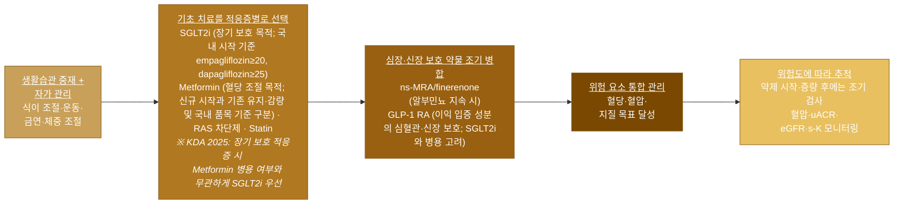
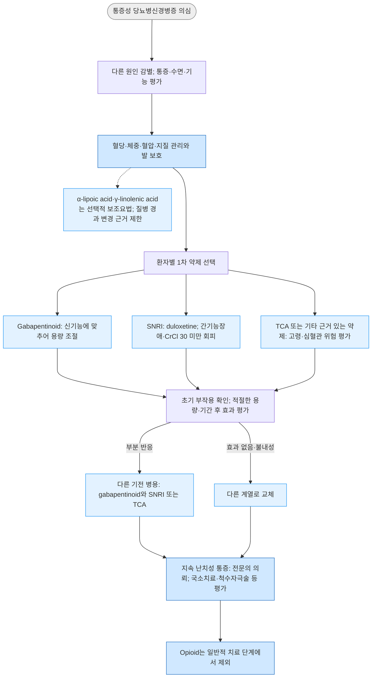

# 당뇨병 합병증 Complications of diabetes

## <mark style="color:green;">일반 사항</mark>

#### <mark style="color:$primary;">합병증 분류</mark>

* 미세혈관 합병증 : 망막병증, 신경병증, 콩팥병증
* 대혈관 합병증 : 관상동맥병, 뇌혈관 질환, 말초동맥 질환
* 비혈관계 합병증 : 위마비, 설사, 배뇨/성 기능 장애, 피부 질환, 감염, 백내장, 녹내장, 치주 질환, 청력 장애
* 당뇨 관련 동반 질환 : 수면무호흡증, 대사이상지방간질환(MASLD/MASH), 성선기능저하증(관련 증상·징후가 있는 남성에서 평가), 골절, 인지 장애, 우울, 악성 종양

* 위마비·배뇨/성 기능 장애 등은 자율신경병증과 중복되는 임상 표현형이며, 위 분류는 상호 배타적이지 않음. 심부전은 ASCVD와 별개로 평가해야 하는 주요 심혈관 합병증임
* 본 장의 정기 선별검사 표는 성인을 대상으로 함. 소아청소년·임신 중 검사 시기는 해당 지침에 따름

#### <mark style="color:$primary;">합병증 발생 시기</mark>

* 고혈당 노출 기간이 길수록 합병증 위험이 증가하지만 발생 시점은 다양하며, 무증상이라는 이유로 선별검사를 늦추지 않음
* 알부민뇨와 eGFR 감소의 순서는 일정하지 않고 비알부민뇨성 DKD도 존재함. T2DM은 진단 당시 이미 콩팥병이 있을 수 있어 유병기간 10~15년을 기다려 검사하지 않음 (☞ [단백뇨](../227_/111_-proteinuria.md#undefined-1))
* 대혈관 합병증은 T2DM 진단 시 이미 존재하는 경우도 많음

#### <mark style="color:$primary;">합병증 선별검사</mark>

<table><thead><tr><th>합병증</th><th>성인 T1DM</th><th>성인 T2DM</th><th>추적 주기</th></tr></thead><tbody><tr><td>망막병증</td><td>진단 후 5년 이내 첫 검사</td><td>진단 즉시</td><td>기본 매년; 망막병증 없고 혈당 안정 시 1~2년, 이상 시 더 자주</td></tr><tr><td>DKD (uACR + eGFR)</td><td>유병기간 5년부터</td><td>진단 즉시</td><td>선별 매년; CKD 확진 시 GFR·알부민뇨 위험도에 따라 연 1~4회 이상</td></tr><tr><td>말초신경병증</td><td>유병기간 5년부터</td><td>진단 즉시</td><td>매년</td></tr><tr><td>발 검사</td><td>진단 시부터 발 상태·위험 평가</td><td>진단 시부터 발 상태·위험 평가</td><td>포괄적 발 검사 최소 매년; 보호감각 소실·과거 궤양/절단은 매 방문 발 시진</td></tr><tr><td>PAD (ABI)</td><td>증상 시; 고위험 무증상자는 선별 고려</td><td>증상 시; 고위험 무증상자는 선별 고려</td><td>증상·발 소견 변화 시; 위험도에 따라 추적</td></tr><tr><td>심혈관자율신경병증</td><td>유병기간 5년부터</td><td>진단 즉시</td><td>증상·징후 최소 매년 평가</td></tr></tbody></table>

_\* PAD 무증상 고위험군 (PAD 진단이 치료 방침을 바꿀 때 ABI 선별 고려, ADA 2026) : ⓵ 65세 이상 모든 당뇨병 환자, ⓶ 65세 미만이더라도 미세혈관 합병증·당뇨발 합병증·당뇨 관련 말기 장기 손상 동반, ⓷ 당뇨 유병기간 ≥10년에서는 추가로 고려_

* T2DM은 진단 시 이미 수년간의 고혈당 노출이 있을 수 있어 진단 즉시 전반적인 합병증 선별검사를 시작함
* T1DM은 발병 연령이 낮아 소아 및 청소년기에는 성인에 비해 일부 검사 시작 시기를 조정할 수 있음

***

## ■ 말초동맥질환 (Peripheral Artery Disease, PAD)

## <mark style="color:green;">임상 양상</mark>

* 간헐적 파행, 사지 허혈
* dependent 부위의 적색 피부 변화, 하지 거상 시 창백한 피부, 털 소실, 발톱 퇴행 위축
* 맥박 약화, 피부 감각 저하

### <mark style="color:$danger;">🚩 Red Flags!</mark>

<mark style="color:$danger;">**즉각 조치**</mark>

* 갑작스러운 사지 통증·창백·맥박 소실·감각 이상·마비·냉감(6P) → 즉시 응급실/혈관 전문팀 평가; 6가지가 모두 나타날 때까지 기다리지 않음  `[급성 사지 허혈]`
* 습성 괴저, 전신 이상 또는 급속히 진행하는 발 감염 → 즉시 응급 평가  `[사지 위협 감염·허혈]`

<mark style="color:$warning;">**당일~수일 내 평가**</mark>

* 허혈성 안정 시 통증, 비치유성 궤양 또는 건성 괴저 → 당일 혈관 전문 평가  `[만성 사지 위협 허혈 의심]`
* ABI ＜0.4, 발목 수축기압 ＜50 ㎜Hg, 족지 수축기압 ＜30 ㎜Hg, TcPO₂ ＜30 ㎜Hg 또는 단상성·소실된 족부 Doppler 파형(특히 발 궤양·괴저 동반) → 당일 긴급 혈관 전문 평가  `[중증 허혈]`

<mark style="color:$info;">**조기 평가 및 추적**</mark>

* 간헐적 파행으로 일상생활 제한 → 혈관 전문 평가 및 치료 반응 추적  `[증상성 PAD]`
* 안정적 간헐적 파행 + ABI 0.4\~0.9 : 약물·운동·생활습관 치료 후에도 일상생활 제한이 지속되고 재혈관화를 고려할 때 혈관 영상검사 계획  `[증상성 PAD]`

## <mark style="color:green;">진단</mark>

* ABI(ankle-brachial index) : 정상 1.00\~1.40, 경계 0.91\~0.99, 비정상 ≤0.90, 비압축성 ＞1.40. ＜0.4는 중증 허혈을 시사하나 ABI 단독으로 사지 위협 여부를 결정하지 않음
  * ABI ＞1.4 또는 측정 불가는 혈관 석회화에 의한 비압축성 혈관·위고값 가능 → 응급상태로 단정하지 말고 족지-상완지수(TBI), 족지압 및 족부 Doppler 파형 추가 평가
  * TBI ≤0.70은 PAD를 시사함. 당뇨병·CKD에서는 석회화로 ABI가 정상/고값이어도 PAD를 배제하지 못하므로 족부 맥박·Doppler 파형·족지압을 함께 해석
  * 운동 시 하지 증상이 있으나 안정 ABI가 정상 또는 경계이면 운동부하 ABI 고려
* 재혈관화 계획이 있거나 생리검사만으로 진단이 불명확하면 duplex 초음파·CTA·MRA 등을 선택; CKD에서는 조영제 위험을 개별 평가

## <mark style="color:$warning;">Management</mark>

**항혈소판제**

* 증상성 PAD 또는 ASCVD 동반 : aspirin 100 ㎎ qd <mark style="color:blue;">\[아스피린 프로텍트]</mark> 또는 clopidogrel 75 ㎎ qd <mark style="color:blue;">\[플라빅스]</mark>
* Aspirin 알레르기 등으로 사용하기 어려운 경우 clopidogrel 고려; 출혈 위험·상호작용 평가
* 무증상 ABI 감소만 존재 : 이익·출혈 위험을 비교하여 개별화. 2024 ACC/AHA는 단일 항혈소판제 사용을 합리적 선택으로 보지만, 무증상 당뇨병 환자 모두에게 일률 처방하는 근거는 충분하지 않음
* 출혈 고위험이 아닌 증상성 PAD, 특히 재혈관화 후에는 rivaroxaban 2.5 ㎎ bid <mark style="color:blue;">[자렐토]</mark> + 저용량 aspirin으로 MACE·MALE 감소를 고려. 별도의 항응고 적응증·DAPT 여부와 신기능·출혈 금기를 확인하며, 심방세동용 항응고 용량과 혼용하지 않음. 국내 허가와 급여 인정 범위는 구분  <mark style="color:$info;">[ACC/AHA PAD 2024]</mark>

**혈당·혈압·지질** 통합 관리

* 혈당·혈압·지질·금연을 함께 관리. PAD는 임상 ASCVD이므로 최대내약 statin을 기본으로 LDL-C ＜55 ㎎/㎗ 및 기저 대비 ≥50% 감소 목표(KDA 2025); 필요 시 ezetimibe 등 추가. 세부 사항 ☞ 당뇨병콩팥병증 치료 방침 및 이상지질혈증 장

**SGLT2i · GLP-1 RA**

* 심혈관 이익이 입증된 SGLT2i·GLP-1 RA를 동반 ASCVD·HF·CKD에 따라 선택. MACE 감소와 MALE 감소를 구분하며 두 계열의 모든 성분에서 하지 사건 감소가 입증된 것으로 일반화하지 않음
* STRIDE(2025)에서는 증상성 PAD+T2DM 환자에서 피하 semaglutide 1 ㎎/주의 보행거리 개선이 확인됨. 이를 하지 절단 예방 효과가 확정된 연구로 해석하지 않으며, 모든 GLP-1 RA의 동일 효과로 일반화하지 않음  <mark style="color:$info;">[STRIDE 2025]</mark>

**생활습관**

* 금연(필수), DASH 식이

**감독하 운동치료 (Supervised exercise therapy)**

* 감독하 보행 훈련을 회당 총 30\~45분의 실제 운동, 주 3회 이상, 12주 이상 시행. 통증·휴식을 반복하여 점차 증량하며 발 궤양·안정 시 통증·급성 허혈이 있으면 먼저 해당 상태 평가
* 감독 프로그램이 어려우면 행동 중재·추적을 포함한 구조화된 가정/지역사회 운동을 고려. 재혈관화와 운동의 이익은 환자군·평가 지표에 따라 달라 일률적으로 동등하다고 설명하지 않음
* 일상생활을 제한하는 파행에는 cilostazol <mark style="color:blue;">[프레탈]</mark> 고려. **심부전은 금기**이며, 국내 허가상 증식당뇨망막병증 등 출혈 소인도 금기이므로 확인. 생활습관·혈관 위험 관리와 운동에도 증상이 지속되거나 사지 위협 허혈이 있으면 재혈관화 평가

***

## ■ 당뇨병콩팥병증 (Diabetic Kidney Disease, DKD)

* 당뇨병에 의한 만성콩팥병(CKD); 당뇨병 환자에서 가장 흔한 CKD 원인이자 말기신부전(ESRD)의 주된 원인
* 진단 기준 : eGFR ＜60 ㎖/min/1.73㎡ 또는 중등도 이상의 알부민뇨(uACR ≥30 ㎎/g, 구 미세알부민뇨) 또는 기타 콩팥 손상 소견이 3개월 이상 지속 (☞ [만성콩팥병](../227_/112_-chronic-kidney-disease-ckd.md))
  * 당뇨병망막병증 등 다른 당뇨병 미세혈관 합병증이 동반되어 있으면 신장 생검 없이도 당뇨병콩팥병증으로 추정 진단 가능. 그렇지 않은 경우-특히 급격한 신기능 악화, 활동성 요침사, 망막병증 없는 T1DM-에는 다른 신장 질환 감별 고려


비알부민뇨성 DKD (Non-albuminuric DKD) : 일부 당뇨병 환자는 알부민뇨 없이 eGFR 감소로 CKD가 발견됨. 빈도는 전체 T2DM인지 DKD 환자인지 등 분모와 정의에 따라 달라지므로 일률적인 30~40%로 제시하지 않음. 알부민뇨가 정상이더라도 eGFR을 별도로 추적하고 고령·혈관질환 등 다른 원인도 평가. 신장 예후와 심혈관 위험은 동반 질환·GFR 단계에 따라 다름  <mark style="color:$info;">[ADA 2026, CKD]</mark>


* 당뇨병 환자의 약 20\~40%에서 CKD가 동반됨. 유병률은 당뇨병 유형·기간·대상군과 CKD 정의에 따라 달라짐
* 위험 인자 : 조기 발병 T2DM, 남성, 고령, 가족력, 불량한 혈당·혈압 조절, 고지혈증, 비만, 흡연
* 급성 신장 손상 위험 증가 - NSAID, 조영제 등 주의
* 당뇨병 환자에서 다음 소견이 있으면 DKD 외 원인을 감별하기 위해 콩팥생검 고려 : ⓵ 단백뇨 급격 증가, ⓶ 신증후군, ⓷ 빠른 eGFR 감소, ⓸ 혈뇨 또는 활성 요침전물, ⓹ 짧은 당뇨병 유병 기간, ⓺ 특히 T1DM에서 당뇨병망막병증 부재. T2DM에서 망막병증이 없다는 사실만으로 DKD를 배제하거나 생검을 일률 시행하지 않음

### <mark style="color:$danger;">🚩 Red Flags!</mark>

<mark style="color:$danger;">**즉각 조치**</mark>

* 호흡곤란·폐부종, 심전도 이상/근력 저하를 동반한 고칼륨혈증, 무뇨·요독성 의식 변화 → 응급 평가  `[체액 과다·전해질 이상·신부전]`

<mark style="color:$warning;">**당일~수일 내 평가**</mark>

* 새로 발생한 핍뇨·급격한 sCr 상승, 새 혈뇨/활성 요침전물, 급격한 단백뇨 증가·신증후군 → 급성 악화 정도에 따라 당일 또는 수일 내 신장내과 평가  `[AKI·비당뇨병성 콩팥병 의심]`

<mark style="color:$info;">**조기 평가 및 추적**</mark>

* 지속적인 uACR 증가·eGFR 감소, eGFR ＜30, 원인 불명 CKD, 저항성 고혈압·빈혈·전해질 관리의 어려움 → 신장내과 의뢰  `[진행성·복잡성 CKD]`

## <mark style="color:green;">진단</mark>

#### <mark style="color:$primary;">선별 검사 항목 및 시기</mark>

<table><thead><tr><th width="229.5238037109375">항목</th><th width="187.6190185546875">T1DM</th><th>T2DM</th></tr></thead><tbody><tr><td>•uACR (u-Alb/Cr ratio)<br>•eGFR (s-Cr 기반)</td><td>진단 후 5년째부터 매년</td><td>진단 즉시, 이후 매년</td></tr><tr><td>혈압</td><td>매 방문마다</td><td>매 방문마다</td></tr><tr><td>지질(TC/LDL/HDL/TG)</td><td>매년</td><td>매년</td></tr></tbody></table>

#### <mark style="color:$primary;">단백뇨 해석 및 추적</mark>

* 임의뇨(가능하면 아침 첫 소변)에서 uACR 측정; uACR가 매우 높거나(예: ＞500 ㎎/g) 비알부민 단백뇨가 의심되면 urine protein/creatinine ratio(uPCR)를 함께 측정할 수 있음 (☞ [단백뇨](../227_/111_-proteinuria.md))
* 검사 전 24시간 이내의 격렬한 운동, 발열, 요로감염, 급성 질환, 심한 고혈당, 심한 고혈압, 심부전 악화, 탈수, 생리 중 채뇨는 일시적으로 알부민뇨를 증가시킬 수 있으므로 가능하면 이러한 상황을 피하여 검사
* CKD 확진 후 uACR 및 eGFR은 GFR·알부민뇨 위험도(KDIGO heat map)에 따라 연 1\~4회 이상 추적. 안정된 G3a A1은 연 1회일 수 있고 G4\~G5 또는 고위험은 더 자주 검사하며, 약제 시작·증량 후 안전성 검사는 별도 시행
* 3\~6개월 내 반복 측정한 uACR 3회 중 2회 이상 ≥30 ㎎/g이면 지속성 알부민뇨를 확인하되, CKD의 만성성(≥3개월)과 일시적 상승 원인도 확인
* 알부민뇨 : A1 ＜30, A2 30\~299, A3 ≥300 ㎎/g. GFR : G1 ≥90, G2 60\~89, G3a 45\~59, G3b 30\~44, G4 15\~29, G5 ＜15 ㎖/min/1.73㎡. G1\~G2만으로 CKD를 진단하지 않으며 알부민뇨 등 콩팥 손상 증거가 필요
* 근육량 감소·절단 등으로 creatinine 기반 eGFR의 정확도가 낮고 약제 선택에 영향을 주면 cystatin C 병합 eGFR 고려. G3\~G5에서는 KFRE 등 검증된 신부전 위험 예측을 의뢰·치료 계획에 보조적으로 활용

### <mark style="color:orange;">다른 원인 콩팥병 의심 상황</mark>

* 특히 T1DM에서 망막병증 없는 콩팥병증, 빠른 eGFR 감소, 급격한 단백뇨 증가, 혈뇨/활성 요침전물
* 치료 저항성 고혈압, 당뇨 외 전신 질환 징후
* ACEI/ARB 시작·증량 후 4주 이내 sCr ＞30% 증가 또는 빠른 eGFR 저하 → 체액 고갈·NSAID 등 병용약·신동맥 협착 등 평가

## <mark style="color:$warning;">Management</mark>

#### <mark style="color:$primary;">신장·심혈관 보호를 위한 다요소 치료</mark>

* T2DM+CKD에서는 생활습관 중재에 RAS 차단제, SGLT2i, statin, 적응증이 있는 경우 finerenone을 조기에 병합하는 다요소 치료를 시행. 모든 CKD 환자에게 네 약물을 동시에 시작하는 원칙은 아니며 적응증·혈압·신기능·혈청 K·내약성에 따라 최적화  <mark style="color:$info;">[KDIGO 2024; ADA 2026]</mark>

<table><thead><tr><th>약물</th><th>주요 적용 조건</th><th>목적</th></tr></thead><tbody><tr><td>SGLT2i</td><td>T2DM+CKD에서 지침상 eGFR ≥20; 국내 CKD/HF 적응증의 시작 기준은 empagliflozin ≥20, dapagliflozin ≥25로 구분</td><td>신장·심혈관 위험 감소</td></tr><tr><td>ACEI 또는 ARB</td><td>고혈압+알부민뇨/CKD에서 우선; 정상혈압+알부민뇨는 개별 고려. 두 계열 병용 금지</td><td>혈압 조절·알부민뇨 감소·신장 보호</td></tr><tr><td>Statin (±ezetimibe)</td><td>연령·ASCVD·CKD 위험도에 따라 선택; 유지투석 환자의 일률적 신규 시작은 아님</td><td>심혈관 위험 감소</td></tr><tr><td>Finerenone (ns-MRA)</td><td>T2DM+CKD, 최대내약 ACEI/ARB에도 알부민뇨 지속, eGFR ≥25 및 혈청 K 조건 충족</td><td>신장·심혈관 위험 감소</td></tr></tbody></table>

* GLP-1 RA : T2DM+CKD에서 이익이 입증된 성분을 신장병 진행 및 심혈관 위험 감소 목적으로 권고. SGLT2i 불가 또는 혈당 목표 미달에만 국한하지 않으며 동반 질환·체중·내약성에 따라 병용을 고려  <mark style="color:$info;">[ADA 2026, CKD]</mark>
  * FLOW trial (2024) : semaglutide 1 ㎎ 주 1회 → T2DM + CKD 환자에서 신장 기능 악화(eGFR 50% 이상 감소)·신부전·신장 관련 사망·심혈관 사망을 포함한 복합 위험을 24% 감소(HR 0.76); 미국 FDA 2025년 승인에 이어 국내에도 T2DM+CKD의 eGFR 지속 감소·말기신장병·심혈관 사망 위험 감소 적응증이 반영됨
* Aspirin : 확인된 ASCVD의 2차 예방에 사용. 1차 예방은 심혈관 위험과 출혈 위험을 비교하여 선택하며, CKD 자체만으로 일률적으로 투여하지 않음
* Finerenone <mark style="color:blue;">[케렌디아]</mark> — 아래는 **T2DM+CKD 적응증**의 용법임
  * 시작 전 K·eGFR 확인: eGFR ≥60은 20 ㎎ qd, 25~＜60은 10 ㎎ qd; ＜25에서 신규 시작하지 않음. K ＞5.0 mmol/L이면 시작하지 않으며 4.8＜K≤5.0에서는 첫 4주 내 추가 모니터링하에 고려
  * 시작·재시작·증량 **4주 후 K·eGFR** 확인, 이후 대개 4개월 간격으로 추적하되 고위험·병용약 변경 시 더 자주 검사
  * K ＞5.5이면 보류, ≤5.0으로 회복하면 10 ㎎ qd로 재시작. 10 ㎎ 복용 중 K ≤4.8이고 직전 대비 eGFR 감소 ＜30%이면 20 ㎎으로 증량; 4.8＜K≤5.5이면 현재 용량 유지. eGFR ＜15로 진행하면 중단
  * 강력한 CYP3A4 억제제(예: clarithromycin·ritonavir) 병용 금기, 강력/중등도 CYP3A4 유도제 회피; K 보충제·다른 MRA 등 고칼륨혈증 유발 약제 점검. 심부전(LVEF ≥40%) 적응증의 목표용량·K 조절표와 혼용하지 않음  <mark style="color:$info;">[국내 품목허가정보]</mark>


**SGLT2i·nsMRA 동시 시작** : RAS 차단제를 사용 중인 T2DM 환자에서 uACR ≥100 ㎎/g이고 eGFR 30\~90인 경우, SGLT2i와 nsMRA(finerenone)를 순차적이 아닌 동시에 시작하는 것을 고려할 수 있음; CONFIDENCE의 주 평가변수는 180일 uACR 변화이므로 병용 자체의 신부전·사망 감소가 별도 입증된 것으로 표현하지 않음. 동시 시작 시 K·eGFR·혈압·체액 상태 추적  <mark style="color:$info;">[ADA 2026; CONFIDENCE 2025]</mark>



**KDA 2025 핵심 권고** - 다음 약물 권고는 주로 T2DM+CKD에 해당하며 RAS 차단제 및 statin 등 기초 관리에 추가함

1. 알부민뇨가 있거나 eGFR이 감소한 경우 : A1C 수치와 무관하게 신장 이익이 입증된 **SGLT2i**를 우선 사용하고 금기·부작용 없는 한 유지; 단순 혈당강하제가 아니라 신장 보호 치료로서의 위치가 강조됨
2. 알부민뇨(+), eGFR 감소, 정상 혈청 칼륨인 T2DM 환자 : **비스테로이드 미네랄코티코이드수용체길항제**(finerenone) 고려
3. 심혈관 위험이 높은 T2DM 환자 → 알부민뇨 진행 억제를 위해 **GLP-1 RA** 고려 \[제한적권고]



**2026년 추가 근거** : 2026년 10월 ADA/EASD 합의문은 T2DM+CKD에서 SGLT2i를 기반으로, 이익이 입증된 GLP-1 기반 치료와 알부민뇨 동반 시 finerenone을 조기에 병합하는 접근을 지지함. 국가별 허가와 성분별 임상결과 근거에 따라 적용함.

**T1DM+CKD의 finerenone** : FINE-ONE(2026)은 ACEI/ARB를 투여 중인 T1DM, eGFR 25~＜90, uACR 200~＜5,000 환자 242명에서 6개월 uACR을 위약 대비 약 25% 감소시킴. 장기 신부전·사망 감소를 직접 평가한 결과는 아님. 미국은 2026년 9월 17일 T1DM 동반 CKD에서 uACR 감소 적응증을 승인함. 이를 국내 T1DM 허가·급여로 간주하지 않으며, 본 장의 표준 처방례는 T2DM+CKD 대상임. T1DM에서 SGLT2i를 T2DM의 신장 보호 처방처럼 일률 적용하지 않음(DKA 위험).


***


```mermaid
graph LR
    A["<u>생활습관 중재 + 
    자가 관리</u><br/>식이 조절·운동·
    금연·체중 조절"]
    B["<u>기초 치료를 적응증별로 선택</u><br/>SGLT2i (장기 보호 목적; 국내 시작 기준 empagliflozin≥20, dapagliflozin≥25)<br/>Metformin (혈당 조절 목적; 신규 시작과 기존 유지·감량 및 국내 품목 기준 구분) · RAS 차단제 · Statin<br/><i>※ KDA 2025: 장기 보호 적응증 시 
    Metformin 병용 여부와 
    무관하게 SGLT2i 우선</i>"]
    C["<u>심장·신장 보호 약물 조기 병합</u><br/>ns-MRA/finerenone
    (알부민뇨 지속 시)<br/>GLP-1 RA (이익 입증 성분의 심혈관·신장 보호; SGLT2i와 병용 고려)"]
    D["<u>위험 요소 통합 관리</u><br/>혈당·혈압·
    지질 목표 달성"]
    E["<u>위험도에 따라 추적</u><br/>약제 시작·증량 후에는 조기 검사<br/>혈압·uACR·
    eGFR·s-K 모니터링"]

    A ---> B ---> C ---> D ---> E

    style A fill:#c8a05a,stroke:#8a6020,color:#fff
    style B fill:#b07820,stroke:#8a6020,color:#fff
    style C fill:#986010,stroke:#8a6020,color:#fff
    style D fill:#7a4800,stroke:#8a6020,color:#fff
    style E fill:#e8c060,stroke:#8a6020,color:#fff
```

<p align="center"><strong>CKD 환자의 신장-심장 위험 인자 관리</strong></p>

***

### <mark style="color:orange;">혈당 관리</mark>

* T2DM 일반 목표는 A1C ＜6.5%(KDA 2025)이지만 CKD에서는 저혈당·노쇠·기대 여명·치료 부담에 따라 개별화. KDIGO의 비투석 CKD 범위는 ＜6.5\~＜8.0%이며, 건강 상태가 매우 나쁜 환자에게도 ＜8.0%를 절대 상한으로 강제하지 않음
* Metformin : 국제 권고의 eGFR ≥30에서 기존 투여 감량·유지와 국내 제품별 허가를 구분. 다이아벡스엑스알은 eGFR 45~＜60에서 최대 1,000 ㎎/d, ＜45이면 중단 (☞ [당뇨병 약물 치료](101_-dmdrugs.md#metformin-mtf))
* SGLT2i : 신장 보호 목적의 지침 기준은 eGFR ≥20이나 국내 신규 시작은 empagliflozin ≥20, dapagliflozin ≥25로 구분. 초기 eGFR 감소만으로 중단하지 말고 체액 상태·AKI 가능성을 평가하며 내약성이 양호하면 신대체요법 전까지 유지 고려
* GLP-1 RA : 혈당 목표 미달·기존 약제 사용 불가 외에도 이익 입증 성분을 심혈관·신장 위험 감소 목적으로 고려. FLOW의 피하 semaglutide 신장결과를 다른 모든 GLP-1 RA의 동일한 근거로 간주하지 않음
* CKD stage 3 이상 : 저혈당 위험 증가; 인슐린 용량 신중 조절
* 투석 환자 : 저혈당 위험 낮은 약제 우선; 인슐린 용량 조절
* 일반 성인 CGM 목표 : TIR(70\~180 ㎎/㎗) ＞70%, TBR(＜70) ＜4%, TBR(＜54) ＜1%. 고령·저혈당 고위험은 TIR ＞50%, TBR(＜70) ＜1% 등으로 완화하여 저혈당 예방 우선. 진행 CKD·투석·빈혈·ESA 사용 시 A1C가 실제 혈당과 어긋날 수 있어 CGM/자가혈당을 함께 해석  <mark style="color:$info;">[KDA 2025; ADA 2026]</mark>

### <mark style="color:orange;">고혈압 관리</mark>

* 목표 : ＜130/80 ㎜Hg  <mark style="color:$info;">[KDA 2025, 대한고혈압학회 2026]</mark>; 안전하게 달성 가능한 경우 적용
  * 고령·노쇠 환자는 기립성 저혈압 위험 고려하여 개별화
  *  심혈관·신장 고위험 시 수축기 혈압 ＜120 ㎜Hg 목표를 지지하나 측정법·기립성 증상·노쇠·내약성을 평가하여 개별화  <mark style="color:$info;">[ADA 2026]</mark>
* 고혈압+알부민뇨 또는 eGFR ＜60에서 우선 약물 : ACEI 또는 ARB; 최대내약 용량으로 적정. 알부민뇨·다른 적응증이 없으면 DHP-CCB·thiazide 계열도 적절한 선택
  * 중등도 알부민뇨(uACR 30\~299 ㎎/g)에서 권고; 심한 알부민뇨(≥300 ㎎/g) &/or eGFR ＜60에서 강력 권고
  * 정상 혈압이라도 알부민뇨(uACR ≥30 ㎎/g)가 있으면 신장 보호 목적으로 ACEI/ARB 사용 고려
  * 예방적 투여 : 정상 혈압 + 정상 uACR + 정상 eGFR인 당뇨병 환자에서 예방적 목적의 ACEI/ARB 투여는 권고하지 않음
  * 증상성 저혈압·치료로 조절되지 않는 고칼륨혈증은 감량/중단 고려. 시작·증량 후 4주 내 sCr ＞30% 상승은 가역 원인 평가 후 조정하며 자동 영구 중단 기준으로 사용하지 않음. 임신 중 ACEI/ARB 금기; 임신 계획 시 미리 전환
* 추가 : 이뇨제, DHP-CCB, β-차단제(MI 동반 시)
* 모니터링 : ACEI/ARB, 이뇨제 투여 2\~4주 후 s-K, Cr 확인; 체액 고갈이 없으면 sCr 기저치의 30% 이내의 상승 시 중단하지 않음

### <mark style="color:orange;">식이 및 생활습관</mark>

* 비투석 DKD의 단백질 : 통상 약 0.8 g/㎏/d를 기준으로 영양 상태·노쇠·동반 질환에 따라 개별화. 과다 섭취(＞1.3 g/㎏/d)와 일률적인 ＜0.8 g/㎏/d 제한을 피함; 전문 영양관리하 특수 저단백 식이와 구분  <mark style="color:$info;">[KDA 2025; KDIGO 2024; ADA 2026]</mark>
  * 투석 중에는 1.0\~1.2 g/㎏/d 유지
  * KDIGO 2024는 CKD 환자에서 0.8 g/㎏/d 권고를 유지함
* 저염식 : Na ＜2 g/d (소금 약 5 g)
* 체중·영양 상태에 맞춘 관리, 규칙적 운동, 금연. 비만이 있으면 체중 감량을 고려하되 노쇠·근감소증·영양실조 환자에게 BMI ＜25를 일률 목표로 강제하지 않음
* 영양제·한약·민간요법 복용 전 반드시 주치의 상의


**당뇨병콩팥병증 동반 빈혈 관리** : 진행 CKD에서 EPO 생성 감소, 철 결핍·염증 등이 빈혈에 기여함. CBC·망상적혈구·ferritin·TSAT를 기본으로 확인하고 출혈·B12/엽산 결핍 등 다른 원인을 평가. 빈혈이 확인되면 철 결핍을 우선 교정하며 ESA 필요성과 목표 Hb는 증상·혈전/뇌졸중 위험 등을 고려하여 신장내과에서 개별 결정함. 성인 ESA 유지치료의 Hb 목표는 ＜11.5 g/㎗이며 Hb 정상화를 목표로 증량하지 않음  <mark style="color:$info;">[KDIGO Anemia in CKD 2026]</mark>


***

## ■ 당뇨병망막병증 (Diabetic Retinopathy, DR)

* 당뇨병과 관련된 망막 미세혈관 손상; 근로 연령 성인에서 예방 가능한 시력 손상의 주요 원인
* 기전 : 지속 고혈당 → 망막 모세혈관 기저막 비후 → 혈관 주위 세포 손실 → blood-retina barrier 손상 → 모세혈관 폐쇄·허혈·혈청 누출 → VEGF·cytokine 증가 → 혈관 증식/신생
* 분류 : NPDR(경증·중등도·중증)와 PDR. 전증식성은 과거 용어로 주로 중증 NPDR에 해당하며 독립 단계처럼 사용하지 않음. 당뇨황반부종(DME)은 어느 단계에서도 발생 가능
* 유병률은 유병 기간·대상군·검사법에 따라 다르며 T2DM 진단 시에도 존재할 수 있음. 대상군을 구분하여 해석함
* 위험 인자 : 유병 기간, 만성 고혈당, 고혈압, 이상지질혈증, 흡연, 신질환, 임신

## <mark style="color:green;">임상 양상</mark>

* 초기(경증\~중등도 NPDR)에는 대부분 무증상 - 자각 증상이 나타날 때는 이미 진행된 경우가 많아 정기 선별검사가 필수적
* 진행 시 증상 : 비문증(floaters), 시야 흐림·왜곡(황반부종 동반 시), 야간 시력 저하
* 진행성 병변(PDR, 유리체출혈, 망막박리)에서는 급격한 시력 저하·시야 결손 발생 가능

### <mark style="color:$danger;">🚩 Red Flags!</mark>

<mark style="color:$danger;">**즉각 조치**</mark>

* 갑작스러운 시력 소실, 커튼이 가리는 듯한 시야 결손, 급증한 비문증·광시증 → 즉시 안과/응급 평가  `[망막박리·유리체출혈·망막혈관 폐색 등]`
* 심한 안통·충혈과 급성 시력 저하 → 즉시 안과 응급 평가  `[신생혈관 녹내장 등]`

<mark style="color:$warning;">**당일 안과 평가**</mark>

* 새 시력 저하를 동반한 PDR·황반부종 의심, 신생혈관/안압 상승 소견 → 당일 안과 평가  `[시력 위협 망막병증·녹내장 의심]`

<mark style="color:$info;">**조기 평가 및 추적**</mark>

* 무증상이라도 중등도 이상 NPDR, 모든 DME 또는 PDR 발견 → 안과로 신속히 의뢰하여 치료 필요성·검사 간격 결정  `[진행성 망막병증]`
* 혈당·혈압 조절 악화 또는 혈당 조절 급속 강화 계획 → 망막 상태 재평가·추적 계획  `[망막병증 진행·초기 악화 위험]`

## <mark style="color:green;">진단 - 선별검사</mark>

* 안과 전문의에 의한 산동(동공 확대) 후 안저검사를 포함한 포괄적 검사
* 비산동(nondilated) 망막 사진 촬영 및 판독 - 안과 접근이 어려운 지역에서 적절한 대안적 선별 전략
  * 사진 판독은 훈련된 안과 전문 인력, reading center 판독 기술자, 또는 해당 국가에서 승인된 AI 프로그램(국내에서는 식약처 허가 범위 적용)으로 시행 가능. 단, 망막 사진 촬영 및 판독은 포괄적 산동 안과 검진의 완전한 대체가 아님 - 사진 품질이 불량하거나 이상 소견이 발견되면 반드시 포괄적 검진으로 의뢰

#### <mark style="color:$primary;">검사 시작 시기 및 주기</mark>

<table><thead><tr><th width="180">대상</th><th width="220">검사 시작</th><th>추적 주기</th></tr></thead><tbody><tr><td>T1DM</td><td>진단 후 5년 이내</td><td>망막병증(-) + 혈당 양호 : 1~2년<br>망막병증(+) : 최소 매년 또는 더 자주</td></tr><tr><td>T2DM</td><td>진단 즉시</td><td>(상동)</td></tr><tr><td>임신 전 T1DM/T2DM</td><td>임신 전 및 임신 1기</td><td>임신 중 각 분기 및 산후 1년까지 망막병증 중증도에 따라 추적; 단순 GDM은 일률적 검사 불필요</td></tr></tbody></table>

## <mark style="color:$warning;">Management</mark>

* 최적의 혈당·혈압·지질 통합 관리; 금연, 규칙적 운동, 건강 식단
* **중심부 침범 DME+시력 저하**에서는 anti-VEGF 유리체내 주입이 일차 치료. 중심부 침범이 있어도 시력이 양호하면 면밀한 관찰 또는 레이저 후 악화 시 주입하는 전략을 선택할 수 있어 부종만으로 모두 즉시 주사하지 않음
  * bevacizumab(off-label) <mark style="color:blue;">\[아바스틴]</mark>, ranibizumab <mark style="color:blue;">\[루센티스]</mark>, aflibercept <mark style="color:blue;">\[아일리아]</mark>, brolucizumab <mark style="color:blue;">\[비오뷰]</mark>, faricimab <mark style="color:blue;">\[바이스모]</mark>
  * faricimab은 VEGF-A/Ang-2 이중 억제제, aflibercept 8 ㎎은 고용량 VEGF 억제제임. 초기 투여 후 해부학적·시력 반응과 국내 품목별 용법에 따라 투여 간격을 연장하며, 두 약제를 모두 동일한 16주 고정 간격으로 처방하지 않음
  * Brolucizumab은 안구 내 염증·망막혈관염/혈관폐쇄 위험을 고려하여 선택. Bevacizumab의 유리체내 투여는 허가 외 사용임
* 고위험 PDR 및 일부 중증 NPDR : 범망막광응고(PRP). 일부 PDR은 anti-VEGF로 치료 가능하나 반복 주입·지속 추적이 전제되며 추적 탈락 위험을 고려하여 PRP와 선택/병합
* DME에서 anti-VEGF 반응 불충분·사용 곤란 등은 덱사메타손 임플란트 등 선택적 치료 고려. 안압 상승·백내장 위험을 평가하며 모든 황반부종에서 anti-VEGF와 동등한 일차 선택으로 제시하지 않음
* Vitrectomy : traction 망막박리, 유리체 출혈
* Calcium dobesilate : 국내 당뇨병성 망막병증 허가가 있으나 시력 손상·DME 예방에 대한 일상적 사용 근거는 제한적(CALDIRET에서 DME 예방 효과 미입증). 표준 안과 치료를 대체하지 않으며 보조적 사용 여부 개별 결정. <mark style="color:blue;">[일성독시움정]</mark> 250 ㎎, 망막병증 허가용량 500\~1,000 ㎎/d, 식후 투여
* 이상지질혈증+초기 DR에서는 fenofibrate가 진행을 늦출 수 있으나 국내 망막병증 적응증과 구분하고 신기능·statin 병용 위험을 평가. Statin은 심혈관 적응증에 따라 유지
* 시력 손상으로 자가관리가 어려우면 저시력 재활·보조기기와 투약/혈당측정 지원 고려


Aspirin은 망막출혈 위험을 증가시키지 않으므로 당뇨망막병증은 aspirin 투여의 금기가 아님



혈당이 급격히 개선되면(예: 인슐린 강화 요법 시작, GLP-1 RA 투여 초기) 처음 수개월 동안 망막병증이 일시적으로 악화될 수 있음(**Early worsening, 초기 악화 현상**).

GLP-1 기반 치료 등 혈당 조절을 강화할 때 망막병증 상태를 확인. 기존 DR, 높은 A1C와 큰 폭의 감소가 예상되는 환자는 안과와 추적 간격을 개별 설정하며, 모든 환자에게 일률적으로 투여 전 긴급 검진 또는 3~6개월 간격 검사를 강제하지 않음. 장기 혈당 조절의 이익을 설명하고 망막병증만으로 필요한 혈당 치료를 중단하지 않음.



**GLP-1 기반 약제와 눈 건강** : 급격한 혈당 개선에 따른 망막병증 초기 악화와 NAION을 구분. EMA는 2025년 semaglutide 관련 NAION을 매우 드문 이상반응으로 판단함. 국내 오젬픽 허가사항에도 위험 증가 가능성, 갑작스러운 시력 상실 시 안과 검사, NAION 확진 시 semaglutide 중단이 반영되어 있음. 녹내장·신생혈관 AMD 등의 관찰연구 결과를 확정적인 계열 효과로 일반화하지 않음  <mark style="color:$info;">[EMA 2025; 국내 품목허가정보 2026]</mark>.

**DCCT/EDIC 40년 추적 연구**에서 초기 집중 혈당 관리가 이후 수십 년간의 망막병증·신장병증 진행을 지속적으로 낮추는 'metabolic memory(대사 기억)' 효과를 재확인함 - 진단 초기 적극적 혈당 관리의 장기적 근거로 활용 가능  <mark style="color:$info;">[ADA 2026]</mark>.


***

## ■ 당뇨병신경병증 (Diabetic Neuropathy)

* 흔한 만성 합병증이며 유병 기간이 길수록 위험 증가. 연구별 정의·검사법·대상군 차이가 커 특정 연수의 발생률을 일률 적용하지 않음
* 통증·감각 이상, 부상·낙상 위험 증가, 발 궤양의 가장 중요한 원인
* 여러 아형 중 원위 대칭성 다발성신경병증(Distal symmetrical polyneuropathy, DSPN)과 자율신경병증이 가장 흔함; 통상 '당뇨병신경병증'은 DSPN을 의미
* 당뇨병 말초신경병증 환자의 \~50%는 무증상 - 선별 검사와 예방적 발 관리 필수
* 위험 인자 : 불량한 혈당 조절, 긴 유병 기간, 고혈압, 고지혈증, 흡연, 음주, 비만, 다약제

## <mark style="color:green;">임상 양상</mark>

* 소섬유 침범 : 통증(burning, lancinating, tingling, electric shock), 통각과민, 온도 감각 저하 - 특히 밤에 심해질 수 있음
* 대섬유 침범 : numbness, 진동·고유 수용 감각 저하 - "두꺼운 양말을 신고 걷는 것 같다"; 소섬유와 대섬유의 침범 순서는 일정하지 않음
* 발에서 시작 → stocking-and-glove 패턴으로 근위부로 수개월\~수년에 걸쳐 진행

### <mark style="color:$danger;">🚩 Red Flags!</mark>

<mark style="color:$danger;">**즉각 조치**</mark>

* 갑작스러운 편측 감각 이상·근력 저하, 언어/시야 이상 → 뇌졸중 응급 평가  `[급성 중추신경계 질환 의심]`
* 새로운 운동마비·호흡근 약화 또는 빠르게 진행하는 신경학적 결손 → 응급 신경계 평가  `[급성 진행성 신경질환 의심]`

<mark style="color:$warning;">**당일~수일 내 평가**</mark>

* 새 발 궤양 또는 감염 → 당일 발 평가; 전신 독성·빠른 진행·중증 허혈은 즉시 응급 평가  `[당뇨발 합병증]`
* 심한 기립 저혈압·실신·반복 구토 등 중증 위마비 의심 증상 → 당일 평가; 의식 변화·쇼크·수분 섭취 불가이면 즉시 응급 평가  `[중증 자율신경병증·순환/영양 장애]`
* 급격한 체중 감소와 심한 신경병증성 통증 → 악성종양·영양결핍·당뇨병성 신경통증성 악액질 등 감별  `[비전형적 신경병증]`

<mark style="color:$info;">**조기 평가 및 추적**</mark>

* 통증 조절 불충분·무증상 신경병증 → 치료 반응 및 보호감각·발 위험 추적  `[DSPN]`
* 비대칭·운동 우세·빠른 진행·비전형적 분포 → 신경과 평가  `[비당뇨병성 신경병증 감별]`

## <mark style="color:green;">진단</mark>

다음 3단계로 접근; 당뇨병신경병증과 일치하는 특징 확인 + 다른 원인 배제

1. 병력 청취 : MNSI 설문지, 증상 부위·성격·야간 악화 여부 확인
2. 신경계 진찰
   * 소섬유 : 온도(냉/온) 감각, pinprick 감각
   * 대섬유 : ankle reflex, 128 Hz tuning fork 진동 감각, 10-g monofilament, proprioception
     * Ipswich touch test : 검사자가 검지 손가락 끝으로 양발의 제1·3·5족지 끝 6곳을 각각 1\~2초 가볍게 접촉. 2곳 이상 느끼지 못하면 보호감각 소실 의심. 도구가 없을 때 유용하나 초기 DSPN의 소섬유 검사를 대신하지 않으며 진동/통각 등 다른 검사 최소 1개를 함께 시행  <mark style="color:$info;">[ADA 2026]</mark>
3. 보조 검사 (옵션)
   * 기본 감별 : 약물·음주력, CBC, 신장/간 기능, Vit B12(특히 metformin 장기 복용), TSH. 필요 시 엽산·단백전기영동/면역고정검사; ANA·RF·HIV·간염·cryoglobulin 등은 증상·노출·진찰 소견에 맞추어 선택하며 일괄 패널로 시행하지 않음
   * 신경전도/근전도 : 전형적 DSPN의 일률 검사로 필요하지 않음. 비대칭·운동 우세·빠른 진행·진단 불명확 시 시행; 소섬유만 침범하면 정상일 수 있음. 현저한 탈수초 소견이면 CIDP 등 감별
   * 자율신경 기능 검사(안정 빈맥, 기립성 저혈압, 위마비, 발한 이상 시), 요역동학 검사; 심혈관자율신경병증 검사, 위장관계자율신경기능검사, 발한 검사 등 해당 증상 동반 시 시행 \[제한적권고]
     * 기립성 저혈압 확인 시 약물 유발 원인을 반드시 먼저 감별 - 항고혈압제(특히 이뇨제, α-차단제), 삼환계 항우울제 등도 기립 저혈압을 유발하거나 악화시킬 수 있으므로 복약력을 확인하고, 가능하면 원인 약물 조정 후 재평가 (☞ [기립성 저혈압](../225_/096_-orthostatic-hypotension.md))


**Metformin 장기 복용과 Vit B12 결핍** : Metformin은 장기 복용 시 회장에서 Vit B12 흡수를 억제하여 결핍을 유발할 수 있음. metformin 장기 복용 환자에서 Vit B12 결핍 선별검사를 권고. 말초신경병증 증상이 있는 경우 반드시 확인; 결핍 시 경구 또는 근육 주사 보충 후 신경병증 증상이 일부 호전될 수 있음.


### <mark style="color:orange;">선별검사</mark>

* T1DM : 진단 후 5년째부터 매년; T2DM: 진단 즉시 & 이후 매년
* 검사 방법 : 당뇨병신경병증 설문(MNSIQ)과 신경계 진찰(진동 감각 검사, 발목 반사 검사, 10 g 모노필라멘트 검사 및 바늘찌름 검사, 온도 감각 검사)

#### <mark style="color:$primary;">Michigan Neuropathy Screening Instrument</mark>

1. <mark style="color:cyan;">**Questionnaire**</mark>

<table data-header-hidden data-search="false"><thead><tr><th width="552.71435546875">문항</th><th width="55"></th><th width="73.5714111328125"></th></tr></thead><tbody><tr><td><ol><li>발 또는 다리에 저린 느낌이 있습니까?</li></ol></td><td>예</td><td>아니오</td></tr><tr><td><ol start="2"><li>발 또는 다리에 화끈거리는 통증을 느낀 적이 있습니까?</li></ol></td><td>예</td><td>아니오</td></tr><tr><td><ol start="3"><li>발에 무엇이 닿을 때 과민하게 느낍니까?</li></ol></td><td>예</td><td>아니오</td></tr><tr><td><ol start="4"><li>발 또는 다리에 갑자기 쥐가 납니까?</li></ol></td><td>예</td><td>아니오</td></tr><tr><td><ol start="5"><li>발 또는 다리에 찌르는 듯한 느낌을 받은 적이 있습니까?</li></ol></td><td>예</td><td>아니오</td></tr><tr><td><ol start="6"><li>피부에 이불이 닿을 때 아픔을 느낍니까?</li></ol></td><td>예</td><td>아니오</td></tr><tr><td><ol start="7"><li>목욕할 때 뜨거운 물과 차가운 물을 구분할 수 있습니까?</li></ol></td><td>예</td><td>아니오</td></tr><tr><td><ol start="8"><li>발에 까진 상처가 생긴 적이 있습니까?</li></ol></td><td>예</td><td>아니오</td></tr><tr><td><ol start="9"><li>의사로부터 '당뇨병신경병증'이라는 진단을 받은 적이 있습니까?</li></ol></td><td>예</td><td>아니오</td></tr><tr><td><ol start="10"><li>평소 몸 전체에 힘이 없다고 느낍니까?</li></ol></td><td>예</td><td>아니오</td></tr><tr><td><ol start="11"><li>다리나 발의 증상이 밤에 더 심해집니까?</li></ol></td><td>예</td><td>아니오</td></tr><tr><td><ol start="12"><li>걸을 때 다리가 아픕니까?</li></ol></td><td>예</td><td>아니오</td></tr><tr><td><ol start="13"><li>걸을 때 발의 감각을 느낄 수 있습니까?</li></ol></td><td>예</td><td>아니오</td></tr><tr><td><ol start="14"><li>발의 피부가 너무 건조해서 자주 갈라집니까?</li></ol></td><td>예</td><td>아니오</td></tr><tr><td><ol start="15"><li>발이나 발가락을 절단하는 수술을 받은 적이 있습니까?</li></ol></td><td>예</td><td>아니오</td></tr></tbody></table>

* 배점 : 7번과 13번 '아니오'=1점, 나머지 '예'=1점; 4번(순환장애)과 10번(전신 쇠약감)은 최종 점수에 포함하지 않음 (13점 만점)
* 판정 : 설문 ≥7점은 전통적 기준이나 민감도가 낮음; ≥4점이 선별 성능을 높였다는 DCCT/EDIC 검증 결과가 있음. 사용하는 한국어 검증판의 절단값을 따르고 낮은 점수만으로 배제하지 않음

2. <mark style="color:cyan;">**신체검사 (Examination)**</mark>

<table><thead><tr><th width="379.047607421875">검사 항목</th><th width="229.5238037109375">좌측/우측 각각</th></tr></thead><tbody><tr><td>1. 발의 외형 (변형/건조 피부/굳은살/감염/열창)</td><td>정상=0 / 비정상=1</td></tr><tr><td>2. 발 궤양</td><td>정상=0 / 비정상=1</td></tr><tr><td>3. 발목 반사</td><td>있음=0 / 강화법에서만 유발=0.5 / 강화해도 없음=1</td></tr><tr><td>4. 엄지발가락 진동 감각¹⁾</td><td>있음=0 / 약함=0.5 / 없음=1</td></tr><tr><td>5. 10 g 모노필라멘트²⁾</td><td>정상=0 / 감소=0.5 / 없음=1</td></tr></tbody></table>

_¹⁾ 엄지발가락 진동 감각 : 128 Hz tuning fork를 IP(엄지발가락 지간관절) 등쪽 뼈 돌출부에 대고, 환자가 진동이 멈췄다고 할 때 즉시 검사자 손가락 관절에 대어 잔여 진동 시간이 ＜10초 시 '있음', ≥10초 시 '약함'; 환자가 처음부터 진동을 감지하지 못하면 '없음'._\
_²⁾ 10 g 모노필라멘트 : 눈을 감은 상태로 엄지발가락 등쪽 nail fold\~IP joint 사이에 수직으로 ＜1초 적용. 10번 시도 중 8번 이상 '예' → 정상, 1\~7번 → 감소, 0번 → 없음; 발 온도 ＞30℃ 상태에서 시행._

* 판정 : 원 개발기관의 현재 10점 양식은 ＞2점이면 추가 평가 대상. MNSI 모노필라멘트 방법은 발등 검사이므로 발바닥 보호감각/궤양 위험 검사와 구분하며 점수 합산만으로 확진하지 않음
* 출처 : Michigan Diabetes Research Center, University of Michigan(MNSI ©2000; P30DK020572). 본 표는 한국어 설명용이며 검증된 한국어판과 동일한 타당도가 확보되었다고 간주하지 않음

## <mark style="color:$warning;">Management</mark>

* 개인별 목표에 따른 혈당 조절(발생 예방·진행 지연) - 1형 당뇨병에서 말초신경병증 및 심혈관자율신경병증의 발생을 예방하거나 진행을 지연시킴; 2형 당뇨병에서도 발생과 진행을 지연
* 금연, 금주, 규칙적 운동, 균형 훈련, 발 보호(패드·양말·적절한 신발)
* 당뇨병신경병증 통증이 있으면 통증을 평가하고 통증 조절 및 삶의 질 향상을 위해 약물 치료 시행
* 자율신경병증 동반 시 해당 장기별 관리 (예: 위마비)

### <mark style="color:orange;">약물 치료 - 통증 조절</mark>

* 통증성 DPN에 대한 약물 치료는 증상(통증) 완화가 목적이며, 이미 진행된 신경 손상을 되돌리거나 신경병증의 자연 경과 자체를 바꾸는 치료는 아님 - 진행 억제를 위해 혈당뿐 아니라 체중·혈압·지질 및 생활습관을 함께 관리함
* 초기 약물은 gabapentinoid(pregabalin·gabapentin), SNRI(duloxetine), TCA 등에서 동반 질환·부작용·비용에 따라 선택. Pregabalin·duloxetine은 국내 DPN 적응증이 있으며 gabapentin은 국내 말초 신경병증성 통증 허가 범위에 따라 사용 가능; 미국 DPN 개별 승인 유무로 국내 허가를 판단하지 않음. TCA는 고령·심혈관 환자의 항콜린·심장 부작용에 주의 (☞ [통증](../220_/001_-pain.md#undefined-8))
* Gabapentinoid : 저용량 시작 후 신기능에 맞추어 증량. 초기 효과와 부작용은 조기에 확인하고 충분한 용량·기간의 치료 후 평가하며, 효과 평가를 무조건 2개월 이후로 미루지 않음. 어지럼·졸음·부종·낙상에 주의
* Duloxetine : 간질환으로 인한 간기능장애, CrCl ＜30 또는 투석 환자는 국내 허가상 금기. 오심을 줄이기 위해 30 ㎎ qd로 시작하여 내약성에 따라 보통 1주 후 60 ㎎ qd로 증량; 증량 속도는 개별화  <mark style="color:$info;">[국내 품목허가정보]</mark>
* TCA : 항콜린 부작용으로 ≥65세, 전립선 비대, 녹내장, 심혈관 질환에서 신중 사용
* Na channel blocker는 대안이 될 수 있으나 개별 약물의 근거·위해가 다름. Lamotrigine·lacosamide·oxcarbazepine을 모두 유효한 표준 DPN 처방으로 나열하지 않으며, 국내 DPN 허가 외 사용 여부와 발진·저나트륨혈증·심전도 위험 등을 검토하여 전문의와 선택
* α-lipoic acid <mark style="color:blue;">[치옥타시드]</mark>, γ-linolenic acid <mark style="color:blue;">[에보프림]</mark> : 일부 증상 완화 자료가 있으나 신경 손상 회복·장기 질병 경과 변경 효과가 확립된 치료로 설명하지 않음. 보조적으로 고려하며 표준 통증 치료를 대체하지 않음
* Capsaicin : 국내 <mark style="color:blue;">[다이악센크림]</mark>은 capsaicin으로서 **0.075%**, 1일 3~4회 도포하는 저농도 크림. 해외 capsaicin **8% 패치**(의료진이 적용하는 별도 제제, 미국 DPN 적응증 승인)와 제형·농도·용법을 혼용하지 않음
* Vit B12·folate : 결핍을 확인하거나 강하게 의심하면 보충. B12 결핍이 배제되지 않은 상태에서 folate만 투여하지 않으며 고용량 Vit B6의 장기 사용은 오히려 신경병증을 유발할 수 있음
* 척수 자극술(SCS) : 약물 난치성 통증성 DPN에 고려
* 병용 요법 : 적절한 용량·기간에도 부분 반응이면 서로 다른 기전의 약제(gabapentinoid + SNRI 또는 TCA) 병용을 고려. 효과가 없거나 내약성이 나쁘면 다른 계열로 교체. TCA+SNRI를 일상적 병용 조합으로 제시하지 않음
* Tramadol·tapentadol·oxycodone 등 opioid는 DPN의 일반적인 다음 단계 치료로 사용하지 않음. 드문 예외는 통증 전문의가 이익·위해를 평가하여 결정  <mark style="color:$info;">[ADA 2026, Neuropathy]</mark>

***


```mermaid
graph TD
    A(["통증성 당뇨병신경병증 의심"]) ---> B["다른 원인 감별; 통증·수면·기능 평가"]
    B ---> C["혈당·체중·혈압·지질 관리와 발 보호"]
    C ---> D["환자별 1차 약제 선택"]
    D ---> E["Gabapentinoid: 신기능에 맞추어 용량 조절"]
    D ---> F["SNRI: duloxetine; 간기능장애·CrCl 30 미만 회피"]
    D ---> G["TCA 또는 기타 근거 있는 약제: 고령·심혈관 위험 평가"]
    E ---> H["초기 부작용 확인; 적절한 용량·기간 후 효과 평가"]
    F ---> H
    G ---> H
    H --->|"부분 반응"| I["다른 기전 병용: gabapentinoid와 SNRI 또는 TCA"]
    H --->|"효과 없음·불내성"| J["다른 계열로 교체"]
    I ---> K["지속 난치성 통증: 전문의 의뢰; 국소치료·척수자극술 등 평가"]
    J ---> K
    C -.-> L["α-lipoic acid·γ-linolenic acid는 선택적 보조요법; 질병 경과 변경 근거 제한"]
    K ---> M["Opioid는 일반적 치료 단계에서 제외"]
style A fill:#eeeeee,stroke:#888888
classDef sky fill:#e3f2ff,stroke:#2196f3
class E,F,G,I,J,L sky
classDef blue fill:#d0e8ff,stroke:#1a6abf
class C,K,M blue
```

<p align="center"><strong>당뇨병성 말초신경병증(DPN) 치료 알고리즘</strong></p>

<p align="center"><em><mark style="color:$info;">Ref. KDA 2025 및 ADA Standards of Care 2026의 권고를 바탕으로 재구성</mark></em></p>

***

## ■ 당뇨발 예방 및 당뇨병성 발 감염 (Diabetic Foot Infection, DFI)

* 당뇨병성 족부궤양의 평생 발생률은 19\~34%, 연간 발생률은 약 2%이며, 말초신경병증·PAD·발 변형 등으로 생긴 궤양에 감염이 동반되면 심부 조직 감염·골수염·하지 절단으로 진행할 수 있음.  <mark style="color:$info;">[IWGDF 2023]</mark>
* 당뇨병성 족부궤양은 모두 세균이 집락화되어 있으나, 배양 양성만으로 감염을 진단하지 않고 임상 소견(발적·열감·부종·통증·농성 분비물 중 2개 이상)으로 진단함. 괴저, 빠른 진행, 전신 이상 또는 허혈이 동반되면 즉시 병원 평가가 필요함.
* 포괄적 발 검사 : 피부·궤양·굳은살·변형, 족배/후경골동맥 맥박, 10-g monofilament 또는 Ipswich test와 진동/통각 등 추가 검사, 신발 상태를 평가

| IWGDF 위험군 | 기준 | 포괄적 발 평가 간격 |
| --- | --- | --- |
| 0 | 보호감각 소실(LOPS)·PAD 모두 없음 | 매년 |
| 1 | LOPS 또는 PAD | 6~12개월 |
| 2 | LOPS+PAD, LOPS+발 변형 또는 PAD+발 변형 | 3~6개월 |
| 3 | LOPS 또는 PAD가 있으면서 과거 발 궤양·하지 절단·말기신부전 중 하나 이상 | 1~3개월 |

* LOPS·과거 궤양/절단 환자는 위 주기와 별도로 매 방문 발 시진. 매일 자가 발 관찰, 맨발 보행 회피, 적절한 신발·양말과 피부 관리 교육
* 감염 소견 없는 궤양에는 전신/국소 항생제를 예방적으로 사용하지 않음. 궤양 치료에는 압력 분산(offloading)·혈류·감염·상처 관리가 함께 필요함

### <mark style="color:$danger;">🚩 Red Flags!</mark>

<mark style="color:$danger;">**즉각 조치**</mark>

* 빠른 괴사·습성 괴저·전신 독성·심부 농양 의심 → 응급실/외과 평가  `[중증 DFI]`

<mark style="color:$warning;">**당일~수일 내 평가**</mark>

* 새로 붉고 뜨겁고 부은 발, 특히 신경병증이 있고 통증이 경미한 경우 → 즉시 체중부하를 줄이고 고정/압력 분산을 시작하며 당일 전문 평가; 초기 X선이 정상이어도 배제하지 않음  `[활동성 Charcot 신경골관절병증 의심]`
* 새 궤양·감염 또는 허혈 소견 → 당일 발 평가  `[당뇨발 합병증]`

<mark style="color:$info;">**조기 평가 및 추적**</mark>

* 굳은살·출혈성 물집·신발 압박·발 변형 → 조기 교정 및 위험도별 추적  `[궤양 전 단계]`

* 상세 중증도 분류(IWGDF/IDSA 2023), Red Flags, 진단·치료, 발 관리 교육, 처방례·복약지도·환자 안내서는 (☞ [당뇨병성 족부감염](171_-diabetic-foot-infection.md)) 참조

***

## ■ 당뇨병위마비 (Diabetic Gastroparesis)

* 자율신경병증의 한 형태로 기계적 폐색 없이 위 배출이 지연됨
* 10년 누적 발병률 T1DM - 5.2%, T2DM - 1%
* 위험 인자 : T1DM, 여성, 오래된 당뇨
* 혈당이 조절되어도 지속됨
* 임상 양상 : 조기/지속 포만감, 오심, 복부 팽만, (수 시간 후 소화 안 된 음식물) 구토 → 장기 지속 시 저체중·영양실조
* 음식 흡수와 식사 인슐린 작용 시점이 어긋나 식후 초기 저혈당·뒤늦은 고혈당이 반복될 수 있음
* GLP-1 RA 투여 후 위마비 증상이 드러날 수 있음

## <mark style="color:green;">진단</mark>

* 복부 진찰은 비특이적(복부 팽만, 상복부 압통)
* 기계적 폐색을 내시경/영상으로 배제하고 약물·급성 고혈당 등 가역 원인을 평가한 뒤 **표준 고형식 4시간 위배출 신티그라피**로 지연을 확인(통상 4시간 저류 ＞10%). 2시간 이하 검사만으로 배제하지 않음. 저류율과 증상 중증도가 항상 일치하지 않아 저류율만으로 임상 중증도를 결정하지 않음
* 검사를 교란하는 위장운동촉진제·opioid·항콜린제 등은 통상 48시간 전 보류하되 약물 반감기와 검사기관 프로토콜에 따름. 장시간 작용 GLP-1 기반 약제는 더 긴 영향이 가능하며 혈당도 검사 시 조절
* 감별 : 기능성 소화불량, gastric outlet obstruction, cyclic vomiting syndrome, IBS (☞ [소화불량](../224_/075_-indigestion-dyspepsia.md))
* 필요 시 A1C, 전해질·신기능, CBC, 영양 상태 및 TSH 확인; 자가면역검사는 임상 의심이 있을 때 선택

## <mark style="color:$warning;">Management</mark>

* 혈당 조절; 위배출 지연과 음식 섭취량을 고려하여 식사 인슐린을 식후 투여하거나 분할 투여하는 등 시점을 개별 조정. 인슐린 제제 선택과 투여 시점을 구분하고 기저 인슐린은 별도로 유지
* 식이 조절 : 저지방·저섬유 음식으로 소량·자주(4\~5끼); 탄산음료·알코올·흡연 회피
* 회피 약물 : GLP-1 RA, opioid, anticholinergics, TCA, pramlintide
  * DPP-4 억제제는 위배출 지연 효과가 임상적으로 유의하지 않아 회피 약물에서 제외  <mark style="color:$info;">[ADA; KDA 2025]</mark>
* 위장운동촉진제 : AGA 2025는 metoclopramide 또는 erythromycin을 조건부 초기 선택으로 제안하며 domperidone은 일률적인 일차 치료로 권고하지 않음
  * **Metoclopramide** <mark style="color:blue;">[맥페란]</mark> : 해외 위마비 치료 권고와 국내 허가를 구분. 국내는 구역·구토 증상 치료 등의 적응증이며 **최대 권장 치료기간 5일**, 투여 간격 ≥6시간. 위마비에 1일 4회·장기 투여하는 해외 용법을 그대로 옮기지 않음. 추체외로 증상·지연성 운동장애 및 신기능별 감량 확인
  * **Domperidone** : 국내 구역·구토 적응증과 단기 사용 원칙에 따름. QT 연장·심장질환·전해질 이상·상호작용을 평가하며 metoclopramide와 병용하지 않음
  * **Erythromycin** : 위마비에는 허가 외 사용. QT/상호작용·내성 및 빠른 내성화(tachyphylaxis)를 고려하여 전문의가 단기간 선택
  * 상세 용법 ☞ [위장운동촉진제](../224_/073_.md#gi-prokinetic-agent)
* Antiemetics : ondansetron 등(국내 위마비 관련 사용은 허가 외)으로 오심·구토 완화를 고려하되 위배출을 개선하는 치료는 아님. Scopolamine·promethazine 등 항콜린 작용이 있는 약제를 기본 처방 목록에 두지 않으며, 난치성 증상은 소화기 전문의와 치료 선택. 저지방·저섬유 식사에 더하여 작은 입자 식사(small-particle diet)를 고려
* 영양 유지가 어렵거나 반복 입원이 필요하면 소화기·영양팀 평가; 경장영양 및 선택적 내시경/수술 치료를 검토하며 유문 보툴리눔 독소 주사를 일률 시행하지 않음

***

## ■ 당뇨병케토산증 (Diabetic Ketoacidosis, DKA)

* 절대적·상대적 인슐린 부족과 길항호르몬 증가 → 케톤 생성·대사성 산증 및 삼투성 이뇨·탈수
* 유발 인자 : 인슐린 누락/부족, 감염, 급성 심혈관질환·췌장염, 수술·금식, SGLT2i 등


**정상혈당 DKA** : 혈당 ＜200 ㎎/㎗에서도 케톤증과 산증이 있으면 DKA가 가능함. SGLT2i 사용, 식사 감소·금식, 임신 등에서 특히 주의하며 혈당 정상만으로 배제하지 않음.


## <mark style="color:green;">임상 양상</mark>

* 다뇨·다음·체중 감소, 탈수·빈맥·저혈압, 구역·구토·복통, 깊고 빠른 호흡(Kussmaul), 의식 변화
* 과일향 날숨은 없을 수 있으며 진단·의뢰의 필수 조건이 아님

### <mark style="color:$danger;">🚩 Red Flags!</mark>

<mark style="color:$danger;">**즉각 조치**</mark>

* 반복 구토·복통·깊고 빠른 호흡·의식 변화·심한 탈수 또는 수분 섭취 불가 → 혈당과 무관하게 DKA 등 응급상황 평가  `[DKA 등 의심]`
* 혈중 β-hydroxybutyrate ≥3.0 mmol/L, 중등도 이상 소변 케톤 또는 케톤의 뚜렷한 증가 → 즉시 응급 평가; 산증 검사를 기다리며 이송을 지연하지 않음  `[DKA 의심]`
* SGLT2i 복용 중 DKA 의심 증상 → 복용 중단 후 즉시 케톤·산증 평가  `[정상혈당 DKA 가능]`

<mark style="color:$warning;">**당일~수일 내 평가**</mark>

* 경미한 케톤 양성/고혈당이 있으나 전신 상태·수분 섭취가 양호하고 위 응급 소견이 없는 경우. 사전 교정 계획 적용과 당일 연락·평가; 케톤 증가·구토·복통·호흡곤란 시 즉시 응급실  `[케톤증·DKA 진행 위험]`

<mark style="color:$info;">**조기 평가 및 추적**</mark>

* 회복 후 인슐린·기기 사용 재교육, 유발 요인·복약 누락·사회심리적 문제 평가 및 재발 예방 계획  `[DKA 재발 예방]`

## <mark style="color:green;">진단</mark>

**다음 세 요소를 모두 충족함.**  <mark style="color:$info;">[2024 Hyperglycemic Crises Consensus; ADA 2026]</mark>

| 요소 | 기준 |
| --- | --- |
| 당뇨병/고혈당 | 혈당 ≥200 ㎎/㎗ **또는 기존 당뇨병 병력**(내원 혈당과 무관) |
| 케톤증 | 혈중 β-hydroxybutyrate ≥3.0 mmol/L **또는** 소변 케톤 ≥2+ |
| 대사성 산증 | 정맥혈 pH ＜7.3 **또는** HCO₃⁻ ＜18 mmol/L |

* 혈중 β-hydroxybutyrate를 우선 측정; 소변 케톤만으로 초기 중증도·회복을 판단하지 않음
* 혈당·전해질·BUN/Cr·정맥혈 가스·케톤을 확인하고, 감염·심근경색 등 유발 인자에 맞춰 ECG·배양·영상검사 등을 선택
* Anion gap 상승은 보조 소견이며 직접 케톤 검사가 가능하면 진단·회복의 필수 지표로 사용하지 않음

## <mark style="color:$warning;">Management</mark>

* **응급실/입원 프로토콜로 치료**. 수액·인슐린·전해질 및 유발 원인 치료를 병행
* 심장·신장기능 제한이 없는 성인은 등장성 식염수 또는 균형 결정질 수액을 초기 2~4시간 500~1,000 ㎖/h로 시작 후 조정. 고령·HF·진행된 CKD는 작은 분할 수액(예: 250 ㎖)과 반복 평가
* 인슐린은 통상 정맥 지속주입 0.1 U/㎏/h. **K ＜3.5 mmol/L이면 K를 먼저 보충하고 ＞3.5가 될 때까지 인슐린 시작을 보류**
* 혈당 ＜250 ㎎/㎗이면 포도당 수액을 추가하고 인슐린은 감량·유지하여 케톤산증이 해결될 때까지 치료. 정상혈당 DKA는 포도당 공급이 처음부터 필요할 수 있음
* 혈당은 1~2시간마다, 전해질·sCr·정맥 pH·β-hydroxybutyrate는 통상 4시간마다 확인. K는 인슐린 시작 2시간 후 및 이후 4시간마다 확인하며 이상 시 더 자주 검사. 중탄산염·인산염은 일률 보충하지 않음
* DKA 해소 : **β-hydroxybutyrate ＜0.6 mmol/L 및 (정맥 pH ≥7.3 또는 HCO₃⁻ ≥18)**; 가능하면 혈당 ＜200 ㎎/㎗도 확인. 혈당 정상화만으로 인슐린 주입을 종료하지 않음
* 피하 기저 인슐린 투여 후 정맥 인슐린을 일정 시간 겹쳐 유지(ADA 2026: 보통 2~4시간; 2024 합의문: 최소 1~2시간)하고 제제·병원 프로토콜에 따라 전환. 경증~중등도 비합병 DKA의 피하 속효성 인슐린 치료도 충분한 모니터링이 가능한 의료기관에서만 선택

### <mark style="color:orange;">예방 교육 — 아픈 날 대처</mark>

1. **T1DM의 기저 인슐린은 금식 중에도 중단하지 않음**. 식사·교정 인슐린은 개인별 계획에 따라 조정하며 모든 당뇨약을 무조건 유지하라고 교육하지 않음
2. 혈당은 일반적으로 2~4시간마다 측정. T1DM·SGLT2i 사용자의 구역·복통·권태 등에서는 혈당이 높지 않아도 케톤 확인
3. SGLT2i는 급성 중증질환·탈수·금식 시 보류. 계획 수술 전 dapagliflozin·empagliflozin은 최소 3일, ertugliflozin은 최소 4일 중단; 회복·경구 섭취·케톤 위험을 확인한 뒤 재개
4. Metformin은 탈수·AKI·저산소증 위험 시 보류. SU/glinide는 식사 불가·저혈당 위험 시 보류. GLP-1 기반 약제는 지속 구토·심한 위장관 증상·탈수 시 보류 고려
5. 물을 조금씩 자주 섭취하되 HF·CKD의 수분 제한 계획을 따름. 식사 불가 시 탄수화물 보충·인슐린 조정은 사전 계획 적용
6. 케톤이 높거나 증가하는 경우, 반복 구토·복통·호흡곤란·의식 변화·수분 섭취 불가 시 즉시 응급실. 케톤증 상태에서 운동하지 않음

* 상세 약제별 관리 ☞ [당뇨병 — 아픈 날 대처](100_-diabetes-mellitus.md#아픈-날-대처)

***

## ■ 고삼투압고혈당상태 (Hyperosmolar Hyperglycemic State, HHS)

* 심한 고혈당·삼투성 이뇨에 의한 탈수와 고삼투압이 특징이며, 유의한 케톤증·산증은 없음. DKA와 혼합형으로 발현할 수 있음
* 고령 T2DM에서 흔하며 감염, 인슐린/약제 누락, 급성 심혈관질환, 고혈당 유발 약물, 수분 접근 제한 등을 평가

## <mark style="color:green;">임상 양상</mark>

* 수일~수주 동안 진행하는 다뇨·다음·심한 탈수, 빈맥·저혈압. 혼돈·경련·국소 신경학적 증상이 가능하지만 **의식 변화·혼수는 진단 필수 조건이 아님**
* 국소 신경학적 결손은 HHS 때문으로 단정하지 말고 뇌졸중 등을 동시에 평가

### <mark style="color:$danger;">🚩 Red Flags!</mark>

<mark style="color:$danger;">**즉각 조치**</mark>

* 혈당 ≥600 ㎎/㎗ → 의식이 명료하고 활력징후가 안정적이어도 즉시 응급 평가  `[HHS 의심]`
* 심한 탈수·저혈압·의식 변화·경련·급성 국소 신경학적 증상 → 혈당 수치와 무관하게 응급 평가  `[HHS·뇌졸중 등 의심]`

<mark style="color:$warning;">**당일~수일 내 평가**</mark>

* 현저한 고혈당·음수량 감소·기능 저하가 있으나 위 응급 소견이 없고 경구 섭취가 가능한 경우. 특히 요양시설 거주 고령자는 HHS 위험을 평가  `[HHS 진행 위험]`

<mark style="color:$info;">**조기 평가 및 추적**</mark>

* 회복 후 감염·약제·수분 접근 제한·간병 문제를 교정하고 재발 예방 계획을 확인  `[HHS 재발 예방]`

## <mark style="color:green;">진단</mark>

**다음 네 요소를 모두 충족함.**  <mark style="color:$info;">[2024 Hyperglycemic Crises Consensus; ADA 2026]</mark>

| 요소 | 기준 |
| --- | --- |
| 고혈당 | 혈장 포도당 ≥600 ㎎/㎗ |
| 고삼투압 | **유효 삼투압 ＞300 또는 총 삼투압 ＞320 mOsm/㎏** |
| 유의한 케톤증 부재 | β-hydroxybutyrate ＜3.0 mmol/L 또는 소변 케톤 ＜2+ |
| 산증 부재 | pH ≥7.3 **및** HCO₃⁻ ≥15 mmol/L |

* 유효 삼투압 = 2 × Na(mmol/L) + 혈당(㎎/㎗)/18
* 총 삼투압 = 2 × Na(mmol/L) + 혈당(㎎/㎗)/18 + BUN(㎎/㎗)/2.8; **요소와 BUN의 단위·계수를 혼용하지 않음**
* β-hydroxybutyrate ≥3.0 mmol/L, pH ＜7.3 또는 HCO₃⁻ ＜18이면 혼합형/산증 원인을 평가. HHS 진단의 HCO₃⁻ ≥15와 저용량 인슐린 치료 선택에 쓰는 ≥18 기준이 다름에 주의

## <mark style="color:$warning;">Management</mark>

* 응급실/입원에서 수액으로 순환혈량을 회복하고 인슐린·전해질·유발 원인을 치료. 초기 수액은 DKA의 개별화 원칙을 적용하되 고령·HF·CKD에서는 특히 주의
* β-hydroxybutyrate ＜3.0, pH ≥7.3 및 HCO₃⁻ ≥18인 HHS는 정맥 인슐린 0.05 U/㎏/h; β-hydroxybutyrate ≥3.0, pH ＜7.3 또는 HCO₃⁻ ＜18의 혼합형은 보통 0.1 U/㎏/h. 수액 반응·K를 먼저 평가하며 **K ＜3.5이면 인슐린을 보류**하고 먼저 보충
* 혈당 하강은 **90~120 ㎎/㎗/h를 초과하지 않도록**, 삼투압 하강은 3~8 mOsm/㎏/h, 혈청 Na 하강은 24시간 10 mmol/L 이내로 조절
* 초기 혈당 감소에 따른 Na 상승만을 이유로 저장성 수액으로 바꾸지 않음. 수액 균형·삼투압 추세에 따라 결정
* 혈당이 감소하면 포도당 수액을 병용하여 저혈당을 예방하면서 고삼투압·탈수 해결까지 치료. K 등 전해질을 반복 평가하고 회복 후 투약·돌봄 계획을 재설정
* HHS 해소 판단 : 삼투압 ＜300 mOsm/㎏, 혈당 ＜250 ㎎/㎗, 소변량 ＞0.5 ㎖/㎏/h, 인지 상태·순환혈량 회복 등을 종합. 처음부터 의식 변화가 없었던 환자도 삼투압·탈수 회복을 확인

***

## ■ 기타 합병증

### <mark style="color:orange;">비뇨기계 이상</mark>

* 방광 기능 장애 : 잔뇨량·요로감염·폐색 및 약물 영향을 평가하고 시간제/이중 배뇨, 유의한 요폐에는 간헐적 도뇨 등 선택. Bethanechol <mark style="color:blue;">[하이네콜]</mark>은 일률적 일차 치료가 아니며 효과 근거·부작용을 고려한 제한적 선택 (☞ [요실금](../227_/125_-urinary-incontinence.md#overflow-incontinence))
* 발기 부전: PDE5i <mark style="color:blue;">\[비아그라]</mark>, <mark style="color:blue;">\[시알리스]</mark> — 질산염·riociguat 병용 금기, 심혈관 상태와 신기능별 용량 확인 (☞ [성기능장애](../227_/132_-sexual-dysfunction.md#undefined-7))
* 여성 성 기능 장애: 윤활제·보습제, 동반 감염/통증 치료, 폐경비뇨생식기증후군이면 국소 질 estrogen 등 개별 선택. 당뇨병성 성기능장애만으로 전신 호르몬요법을 일률 시행하지 않음 (☞ [여성 성기능장애](../227_/132_-sexual-dysfunction.md#female-sexual-dysfunction))

### <mark style="color:orange;">T1DM 동반 자가면역질환</mark>

* T1DM 환자는 다른 자가면역질환 동반 위험이 일반 인구보다 높음

<table><thead><tr><th>동반 질환</th><th>대상별 선별</th></tr></thead><tbody><tr><td>자가면역 갑상선질환</td><td>성인: 진단 후 조기에 TSH, 임상 상태에 따라 반복. 소아청소년: 안정된 진단 시 검사, 정상 시 보통 1~2년마다</td></tr><tr><td>셀리악병</td><td>성인: 위장관 증상·흡수장애·철결핍빈혈·골질환 등 의심 소견 시 검사. 소아청소년: 진단 후 조기에 tTG-IgA와 총 IgA, 진단 후 2년 이내 및 5년째 반복; IgA 결핍 시 IgG 기반 검사</td></tr><tr><td>악성빈혈·백반증·부신기능부전·자가면역간염·조기난소부전</td><td>증상·징후·검사 이상에 따라 평가</td></tr></tbody></table>

* 자가면역질환 선별로 임상 경과가 개선된다는 근거(RCT)는 부족하나, 관련 증상(피로, 체중 변화, 소화기 증상, 월경 이상 등) 발생 시 낮은 문턱으로 검사 고려 _<mark style="color:$info;">[JAMA 2026 Type 1 Diabetes Review]</mark>_

### <mark style="color:orange;">췌장 또는 도세포 이식</mark>

* 대상: T1DM + 말기신부전(동시 췌장-신장 이식 또는 신장 이식 후 췌장 이식), 또는 중증·불응성 저혈당·저혈당무감지증이 있는 경우 고려
* 내인성 인슐린 생성을 회복시켜 외인성 인슐린 요구를 없앨 수 있으나, 면역억제에 따른 감염·악성종양·신독성 등의 위험을 동반하므로(이식 후 사망률을 면역억제의 인과적 사망률로 해석하지 않음) 3차 기관 이식 전문팀과의 협진이 필수
* 1차 진료에서는 반복되는 중증 저혈당·저혈당무감지증이 조절되지 않는 T1DM 환자를 이식 가능 여부 평가를 위해 조기 의뢰하는 역할이 중요함 _<mark style="color:$info;">[JAMA 2026 Type 1 Diabetes Review]</mark>_

***

### <mark style="color:red;">질병코드</mark>

* 아래는 범주 안내이며 실제 청구에는 합병증·혼수·궤양/괴저 유무에 맞는 KCD-9 세부 코드를 적용함

E10.2\~E10.8 신장·눈·신경·말초순환·다발성·기타/상세불명 합병증을 동반한 1형 당뇨병 범주; DKA·혼수는 E10.1·E10.0 등 별도 범주

E11.2\~E11.8 신장·눈·신경·말초순환·다발성·기타/상세불명 합병증을 동반한 2형 당뇨병 범주; DKA·혼수는 E11.1·E11.0 등 별도 범주

E11.0 혼수를 동반한 2형 당뇨병 — HHS가 항상 혼수를 동반하는 것은 아니므로 임상 상태와 KCD 세부 분류에 맞추어 선택

H36.0* 당뇨병성 망막병증 — 원인 당뇨병 코드(E10\~E14의 해당 눈 합병증 코드)와 원인·발현 이원분류 원칙에 따라 사용

L98.4 달리 분류되지 않은 피부의 만성 궤양 - 비특이적 궤양 코드이며, 당뇨병성 족부궤양에서는 당뇨병성 족부궤양·괴저 및 병변의 위치·깊이·감염에 맞는 KCD-9 세부 코드를 선택 (☞ [당뇨병성 족부감염](171_-diabetic-foot-infection.md#질병코드))

***

## <mark style="color:purple;">처방례</mark>

> **처방례 1. 당뇨병성 말초신경병증 - 통증 경증 (초기)**
>
> ```
> Pregabalin(리리카) 75 ㎎/cap  1cap  bid  (취침 전 75 ㎎으로 시작 후 bid로 증량)
> ```
>
> _✽신기능이 양호한 환자의 보수적 시작 예시. 75 ㎎ hs로 시작한 뒤 내약성에 따라 75 ㎎ bid로 증량, 통상 목표 150~300 ㎎/d. CrCl에 따라 감량하며 초기 부작용은 조기에 확인하고 적절한 용량·기간의 치료 후 효과 평가._

> **처방례 2. 당뇨병성 말초신경병증 - 통증 중등도 (SNRI 선택)**
>
> ```
> Duloxetine(심발타) 30 ㎎/cap  1cap  qd  (보통 1주 후 60 ㎎으로 증량; 내약성에 따라 조정)
> ```
>
> _✽초기 오심을 줄이기 위해 30 ㎎ qd로 시작. 간질환으로 인한 간기능장애·CrCl ＜30·투석은 투여 금기. 우울·불안 동반 시 추가 이점._

> **처방례 3. T2DM+CKD - 최대내약 ACEI/ARB 사용 중 알부민뇨 지속, eGFR 45~＜60, K ≤4.8인 경우**
>
> ```
> Dapagliflozin(다파엔) 10 ㎎/tab  1tab  qd  (식사 무관)
> Finerenone(케렌디아) 10 ㎎/tab  1tab  qd  (식사 무관)
> Metformin HCl SR(다이아벡스엑스알) 1,000 ㎎  1tab  qd  석식과 함께 (기존 복용 유지)
> ACEI 또는 ARB                    기존 최대내약 용량 유지 (두 계열 병용 금지)
> ```
>
> _✽각 약제의 독립된 적응증을 충족한 병합 예시. eGFR 45~＜60이므로 finerenone 10 ㎎으로 시작하고, 기존 metformin SR은 해당 품목허가 범위에서 유지(다이아벡스엑스알은 최대 1,000 ㎎/d). Finerenone 시작·증량 4주 후 K·eGFR 확인, 이후 정기 추적; K ＞5.5이면 보류하며 eGFR ＜15이면 중단. eGFR ≥60의 DKD 환자는 finerenone 시작용량 20 ㎎임. SGLT2i·finerenone 동시 시작은 uACR ≥100 및 eGFR 30~90 등 조건에서 개별 고려하며, 임상 근거와 국내 급여 조건을 구분._

> **처방례 4. T2DM+CKD - 신장 이익이 입증된 GLP-1 RA 추가 (FLOW 연구 근거)**
>
> ```
> Semaglutide(오젬픽프리필드펜)  0.25 ㎎  주 1회  SQ  4주
> 이후 0.5 ㎎/주로 증량하고 최소 4주 후 필요·내약성에 따라 1 ㎎/주
> ```
>
> _✽FLOW trial(2024): semaglutide 1 ㎎/주 → T2DM+CKD에서 신장 복합 결과·심혈관 사망 유의 감소(국내에도 T2DM+CKD 위험 감소 적응증이 반영됨). 신규 시작은 0.25 ㎎/주로 4주 후 0.5 ㎎, 이후 최소 4주 후 필요·내약성에 따라 1 ㎎으로 증량. 위 처방은 신규 도입 예시이며 FLOW의 평가 용량은 1 ㎎/주임; 0.25 ㎎은 유지용량이 아님. SGLT2i 불가인 경우 외에 병용도 고려하며, eGFR이 ＜20으로 낮아졌다는 이유만으로 기존 SGLT2i를 자동 중단하지 않음. 국내 T2DM+CKD 위험 감소 허가가 있으나 급여는 semaglutide 개별 고시의 선행 요법·A1C·병용 조건을 충족해야 하며 CKD 동반만으로 자동 인정되지 않음._

> **처방례 5. 당뇨망막병증 - 도베실레이트의 선택적 보조 사용(표준 안과 치료 대체 불가)**
>
> ```
> Calcium dobesilate(일성독시움정) 250 ㎎/tab  2tab  bid  (식후)
> ```
>
> _✽국내 망막병증 허가용량 500~1,000 ㎎/d 범위의 상한 예시. CALDIRET에서 DME 예방 효과가 입증되지 않아 일상적 예방 처방으로 제시하지 않음. 신부전 시 주의하며, 드문 무과립구증 관련 발열·인후통·구강 감염 발생 시 중단 후 CBC 등 평가._

**당뇨병성 족부감염 처방례**는 (☞ [당뇨병성 족부감염](171_-diabetic-foot-infection.md#처방례)) 참조

***

### <mark style="color:$success;">핵심 복약 지도</mark>

**당뇨병신경병증 통증 치료제**

* Pregabalin/gabapentin: 복용 초기 졸음·어지럼이 올 수 있으니 운전·기계 조작 주의. 신기능에 따라 용량을 조절하며 초기 부작용은 조기에 확인하고 적절한 용량·기간 후 효과를 평가함. 갑자기 끊지 말고 의사와 상담 후 감량
* Duloxetine: 처음에 메스꺼움이 있을 수 있음; 1\~2주 내 호전. 급격히 끊으면 금단증상 가능 → 천천히 감량
* Finerenone (케렌디아): 고칼륨혈증 모니터링 필수 - 정기 혈액 검사 빠짐없이 받기. 자몽(그레이프프루트) 주스 피하기(CYP3A4 상호작용)

**SGLT2i 사용 시**

* 복용 중 구역·구토·복통·식욕 감소 → 즉시 병원 내원 (euglycemic DKA 가능)
* 금식·탈수·급성 중증질환 시 사전 계획에 따라 복용을 보류하고 담당 의사에게 연락; 계획 수술은 미리 중단 일정 확인
* 소변량 증가, 성기 주변 감염(캔디다) 주의

***

### <mark style="color:blue;">환자 안내서</mark>

**당뇨 발(발 궤양·발 감염) 예방 수칙**은 (☞ [당뇨병성 족부감염](171_-diabetic-foot-infection.md#환자-안내서)) 참조

**당뇨병케토산증(DKA) 경고 증상**

반복되는 구토·심한 복통, 깊고 빠른 호흡·호흡 곤란, 심한 탈수·물도 마실 수 없음, 의식 혼탁 또는 혈중 케톤이 높으면 즉시 응급실로 가세요. 과일향 날숨이 없어도 DKA일 수 있습니다.

SGLT2i(예: 다파엔, 자디앙)를 복용 중인 경우 혈당이 정상이어도 이런 증상이 나타날 수 있습니다. 수술·금식·탈수·중증 급성 질환 시에는 복용을 보류하고 의사에게 알리세요. 1형 당뇨병의 기저 인슐린은 식사를 못하더라도 임의로 중단하지 마세요.

***

## <mark style="color:green;">주요 참고문헌 및 확인 자료</mark>

### <mark style="color:orange;">임상 근거</mark>

* 대한당뇨병학회. 당뇨병 진료지침 제9판. 2025; 영문판: 2025 Clinical Practice Guidelines for Diabetes Management in Korea: Recommendation of the Korean Diabetes Association. Diabetes Metab J. 2025;49:582–783. [https://doi.org/10.4093/dmj.2025.0469](https://doi.org/10.4093/dmj.2025.0469)
* American Diabetes Association. 11. Chronic Kidney Disease and Risk Management; 12. Retinopathy, Neuropathy, and Foot Care; 16. Diabetes Care in the Hospital. Standards of Care in Diabetes—2026. [진료지침 모음](https://diabetesjournals.org/care/issue/49/Supplement_1)
* American Diabetes Association. 4. Comprehensive Medical Evaluation and Assessment of Comorbidities; 14. Children and Adolescents. Standards of Care in Diabetes—2026 — 성인·소아청소년의 자가면역질환 선별 구분. [진료지침 모음](https://diabetesjournals.org/care/issue/49/Supplement_1)
* Umpierrez GE, et al. Hyperglycemic Crises in Adults With Diabetes: A Consensus Report. Diabetes Care. 2024;47:1257–1275. [https://doi.org/10.2337/dci24-0032](https://doi.org/10.2337/dci24-0032)
* KDIGO. 2022 Clinical Practice Guideline for Diabetes Management in CKD. [KDIGO](https://kdigo.org/guidelines/diabetes-ckd/) — 같은 페이지의 2026 공개검토 초안은 확정 지침과 구분함
* KDIGO. 2026 Clinical Practice Guideline for the Management of Anemia in CKD. [확정 지침](https://kdigo.org/wp-content/uploads/2026/01/KDIGO-2026-Anemia-in-CKD-Guideline.pdf)
* KDIGO. 2024 Clinical Practice Guideline for the Evaluation and Management of Chronic Kidney Disease. [KDIGO 지침](https://kdigo.org/guidelines/ckd-evaluation-and-management/)
* Perkovic V, et al. Effects of Semaglutide on Chronic Kidney Disease in Patients with Type 2 Diabetes (FLOW). N Engl J Med. 2024;391:109–121. [https://doi.org/10.1056/NEJMoa2403347](https://doi.org/10.1056/NEJMoa2403347)
* Davies MJ, et al. Management of type 2 diabetes, 2026: ADA/EASD consensus report. Diabetologia. Published 2026-10-02. [https://doi.org/10.1007/s00125-026-06855-7](https://doi.org/10.1007/s00125-026-06855-7)
* Agarwal R, et al. Finerenone with Empagliflozin in Chronic Kidney Disease and Type 2 Diabetes (CONFIDENCE). N Engl J Med. 2025;393:533–543. [https://doi.org/10.1056/NEJMoa2410659](https://doi.org/10.1056/NEJMoa2410659)
* Heerspink HJL, et al. Finerenone in Type 1 Diabetes and Chronic Kidney Disease (FINE-ONE). N Engl J Med. 2026;394:947–957. [https://doi.org/10.1056/NEJMoa2512854](https://doi.org/10.1056/NEJMoa2512854)
* Gornik HL, et al. 2024 ACC/AHA Guideline for the Management of Lower Extremity Peripheral Artery Disease. [https://doi.org/10.1161/CIR.0000000000001251](https://doi.org/10.1161/CIR.0000000000001251)
* STRIDE investigators. Semaglutide and walking capacity in people with symptomatic peripheral artery disease and type 2 diabetes. Lancet. 2025. [https://doi.org/10.1016/S0140-6736(25)00509-4](https://doi.org/10.1016/S0140-6736(25)00509-4)
* IWGDF. Guidelines on the Prevention and Management of Diabetes-related Foot Disease. 2023 update. [공식 지침 모음](https://iwgdfguidelines.org/guidelines-2023/)
* Staller K, et al. AGA Clinical Practice Guideline on Management of Gastroparesis. Gastroenterology. 2025;169:828–861. [https://doi.org/10.1053/j.gastro.2025.08.004](https://doi.org/10.1053/j.gastro.2025.08.004)
* Haritoglou C, et al. Effect of calcium dobesilate on occurrence of diabetic macular oedema (CALDIRET). Lancet. 2009;373:1364–1371. [https://doi.org/10.1016/S0140-6736(09)60218-X](https://doi.org/10.1016/S0140-6736(09)60218-X)
* University of Michigan Diabetes Research Center. Michigan Neuropathy Screening Instrument — Patient Version; How to Use the MNSI. [원 개발기관 자료](https://medresearch.umich.edu/survey-instruments); [사용 지침 PDF](https://medresearch.umich.edu/sites/default/files/2025-07/MNSI_howto.pdf); [환자·신체검사 양식 PDF](https://medresearch.umich.edu/sites/default/files/2025-07/MNSI_patient.pdf)
* Jacobsen LM, Schatz DA. Type 1 Diabetes: A Review. JAMA. 2026;335:1070–1083. [https://doi.org/10.1001/jama.2026.0048](https://doi.org/10.1001/jama.2026.0048)

### <mark style="color:orange;">허가·급여 확인 자료</mark>

* 확인 기준일 : 2026-10-27. 임상 권고·국내 허가·건강보험 급여는 각각 구분하여 기술함
* Finerenone의 국내 DKD 급여는 임상 권고보다 좁음 : T2DM 성인 CKD, 최대내약 ACEI/ARB ≥4주 안정 투여에도 uACR ＞300 ㎎/g 또는 요시험지봉 ≥1+, 25≤eGFR＜75를 모두 만족해야 함. 지속 증상성 만성 심부전(NYHA II~IV)은 이 DKD 급여기준에서 제외, eGFR ＜15이면 중단. ADA 동시 시작 기준(uACR ≥100)만으로 급여를 판단하지 않음
* Semaglutide 주사제는 고시 제2026-24호(2026.2.1. 시행) 적용 : 경구제 병용은 metformin+SU를 2~4개월 이상에도 A1C ≥7%이고 BMI ≥25 또는 인슐린 요법 불가인 경우 등. 기저 인슐린(단독 또는 metformin 병용)을 2~4개월 이상 투여에도 A1C ≥7%이면 기저 인슐린+오젬픽(±metformin) 등을 인정. 최초 객관적 자료 제출, 이후 3개월마다 A1C 평가; 도입 첫 3개월 처방은 최대 4~6주분, 이후 최대 3개월분. 전체 세부 조건은 개별 고시 적용
* Empagliflozin은 고시 제2026-159호(2026.8.1. 시행)에서 비당뇨 CKD 급여 범위가 확대됨. T2DM 투여는 일반원칙 당뇨병용제 기준을 따르므로 이 확대를 모든 당뇨병 환자의 독립적인 CKD 급여로 해석하지 않음. Dapagliflozin 역시 T2DM 일반원칙과 비당뇨 CKD 개별 기준을 구분
* 처방례의 약물 병합은 각 약제의 임상 적응증을 충족한 예시이며 모든 약제의 자동 급여를 의미하지 않음

* 식품의약품안전처. 의약품안전나라 — 의약품 품목허가정보. 국내 제품별 적응증·용법·금기 및 허가 상태 확인. [https://nedrug.mfds.go.kr/index](https://nedrug.mfds.go.kr/index)
* 건강보험심사평가원. [일반원칙] 당뇨병용제 — 보건복지부 고시 제2026-117호(2026.6.1. 시행); 개별 급여기준이 있는 약제는 해당 고시 적용. [보험인정기준](https://www.hira.or.kr/rc/insu/insuadtcrtr/InsuAdtCrtrPopup.do?brdScnBltNo=4&isPopupYn=Y&mtgHmeDd=20260601&mtgMtrRegSno=13&sno=1)
* 건강보험심사평가원. Finerenone 경구제 — 고시 제2024-20호(2024.2.1. 시행). [개별 급여기준](https://www.hira.or.kr/rc/insu/insuadtcrtr/InsuAdtCrtrPopup.do?mtgHmeDd=20240201&mtgMtrRegSno=0002&sno=4)
* 건강보험심사평가원. semaglutide 주사제 — 고시 제2026-24호(2026.2.1. 시행). [고시 안내](https://www.hira.or.kr/rc/drug/insuadtcrtr/bbsView.do?brdBltNo=53076&brdScnBltNo=4&pgmid=HIRAA030069000400); [세부 기준 PDF, pp.6–7](https://diabetes.or.kr/bbs/download.php?code=weekly_brief&number=3095)
* 건강보험심사평가원. Empagliflozin 경구제 — 고시 제2026-159호(2026.8.1. 시행). [개별 급여기준](https://www.hira.or.kr/rc/insu/insuadtcrtr/InsuAdtCrtrPopup.do?mtgHmeDd=20260801&mtgMtrRegSno=0007&sno=1)
* 건강보험심사평가원. Dapagliflozin 경구제 — 고시 제2025-102호(2025.7.1. 시행). [개별 급여기준](https://www.hira.or.kr/rc/insu/insuadtcrtr/InsuAdtCrtrPopup.do?mtgHmeDd=20250701&mtgMtrRegSno=0031&sno=2)
* 동화약품. 맥페란정/주 — 국내 적응증·용법 및 최대 치료기간 확인. [제조사 제품정보](https://www.dong-wha.co.kr/product/content.asp?b=10&s=10&t_idx=2&t_page=1)
* European Medicines Agency. PRAC concludes eye condition NAION is a very rare side effect of semaglutide medicines Ozempic, Rybelsus and Wegovy. 2025. [EMA 발표](https://www.ema.europa.eu/en/news/prac-concludes-eye-condition-naion-very-rare-side-effect-semaglutide-medicines-ozempic-rybelsus-wegovy)

* Bayer. U.S. FDA approves finerenone for CKD associated with type 1 diabetes. 2026-09-17. [해외 허가 발표](https://www.bayer.com/media/en-us/us-fda-approves-finerenone-for-new-indication-in-patients-with-chronic-kidney-disease-associated-with-type-1-diabetes/)
