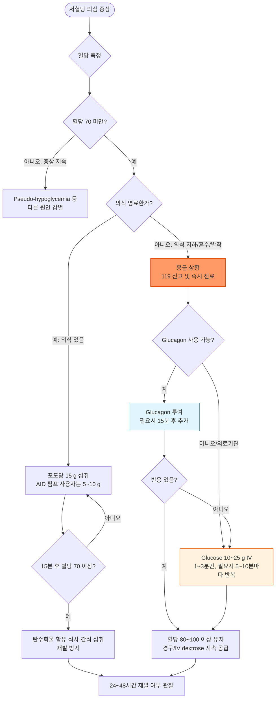

# 저혈당, 당뇨병성 Hypoglycemia, Diabetic

## <mark style="color:green;">일반 사항</mark>

* 증상 유무와 관계없이 위해를 끼칠 수 있는 수준의 비정상적으로 낮은 혈당 상태
* 저혈당 기전 : 당 섭취 또는 흡수 부족, 혈당에 대한 counter-regulatory mechanism 부전
* 저혈당에 대한 정상 반응(단계적 계층 구조) : 80\~85 ㎎/㎗ 시 insulin 분비↓, 65\~70 ㎎/㎗ 시 glucagon·epinephrine 등 counter-regulatory hormone↑, 60\~70 ㎎/㎗ 시 autonomic 증상, 50\~55 ㎎/㎗ 시 neuroglycopenia; 단, 혈당 역치는 개개인 및 혈당 조절 상태에 따라 다름
* 긴 유병 기간의 T1DM에서는 glucagon 반응이 소실되는 counter-regulatory failure가 흔히 동반되어, 이 단계가 무력화되고 저혈당 불감증으로 더 쉽게 이어질 수 있음
* 보통 ＜54 ㎎/㎗이면 임상적으로 유의미한 저혈당 증상이 발생하지만, 평소 높은 혈당에서 갑자기 떨어지면 낮은 혈당이 아님에도 저혈당 증상이 발생할 수 있음 (☞ Pseudo-hypoglycemia)
* 분류&#x20;
  * Level 1 : ＜70 ㎎/㎗ & ≥54 ㎎/㎗; 주의가 필요한 저혈당. 증상이 있을 수도 없을 수도 있음
  * Level 2 : ＜54 ㎎/㎗; 신경당결핍(neuroglycopenic) 증상이 발생하기 시작하는 역치이며 임상적으로 명백한 저혈당
  * Level 3 : 혈당 수치와 무관하게 의식 변화 &/or 도움이 필요한 신체 상태를 특징으로 하는 중증 사건
* Level 2 또는 3 저혈당이 한 번이라도 발생하면 치료 계획을 재평가해야 함  - 약제 감량·변경, 혈당 목표 상향
* 인슐린·SU 사용 여부, T1DM vs T2DM, CGM 사용 여부에 따라 저혈당 발생 편차가 큼
* 야간 저혈당(nocturnal hypoglycemia)의 발생 빈도가 상대적으로 높은 것으로 보고됨
* 저혈당에 대한 과잉 치료는 반동성 고혈당 및 체중 증가를 초래할 수 있음&#x20;

## <mark style="color:green;">원인 및 위험 인자</mark>

* 인슐린 또는 인슐린 분비 촉진제(예: sulfonylurea, meglitinide) 사용&#x20;
  * 강도별 위험도 : 강화 인슐린요법(MDI/CSII/AID) ＞ 기저 인슐린 단독 ＞ sulfonylurea/meglitinide
  * 인슐린과 sulfonylurea 병용 시 위험 증가
* 엄격한 혈당 조절, 최근 낮은 당화 혈색소 수준(＜6.0%), 갑작스런 혈당 강하, 큰 혈당 변동성(glycemic variability)
* 긴 당뇨병 유병 기간, 특히 T1DM은 유병 기간이 길지 않아도 위험이 높을 수 있음
* 중증 저혈당 과거력 - 최근 3\~6개월 내 Level 2 or 3 저혈당은 재발의 가장 강력한 예측 인자
* 고령(≥75세), 소아·청소년 T1DM, 쇠약, 저체중, 임신
* 불규칙 식사·적은 식사·끼니 거름, 무계획적인 운동·과다한 활동, 종교·문화적 이유의 금식
* 음주(지연 저혈당 위험), 다제약물 복용
* β-blocker : adrenergic warning 증상(떨림, 두근거림 등)을 약화시켜 저혈당 인지를 어렵게 할 수 있으며, 특히 nonselective [β-blocker](../225_/095_-hypertension.md#v-v-adrenergic-receptor-blocker-bb)에서 더 뚜렷함
* 저혈당에 대한 행동 반응을 저해할 수 있는 신체 또는 지적 장애, 인지 기능 장애
  * 인지기능 저하와 저혈당은 양방향 관계이므로 고령자에서 정기적 인지기능 평가를 권고&#x20;
* 여러가지 질환 : 간/신질환(특히 신부전), CHF, 갑상선저하증, 자율신경병증, 우울증·중증 정신질환, 섭식 장애, 급성 질환(illness), 스트레스, 장염(구토/설사), 저혈당 불감증, counterregulatory response 장애, 위마비(gastroparesis), 비만대사수술(특히 Roux-en-Y) 과거력
* 사회경제적 위기 : 식품 불안정, 저소득, 주거 불안정, 의료보장 미흡, 낮은 건강 문해력
* 여성이 독립적인 위험 인자로 보고되나 기전은 명확하지 않음 \[ADA 2026]

## <mark style="color:green;">임상 양상</mark>

* Adrenergic Sx. : 배고픔, 두근거림, 구역, 떨림, 창백, 식은땀, 불안, 과민
* Neurologic(Neuroglycopenic) Sx. : 어지럼, 두통, 기력 약화, 감각 이상, 시각 이상, 말하기 힘듦, 협응 장애, 인지 장애, 혼돈, 섬망
* 증상 순서 : 대개 adrenergic Sx.이 neurologic Sx.보다 먼저 나타나 경고 신호 역할을 함; 저혈당 불감증에서는 이 순서가 소실되어 혼돈이 첫 증상으로 나타날 수 있음

### <mark style="color:$danger;">🚩 Red Flags!</mark>

<mark style="color:$danger;">**즉각 조치 또는 의뢰**</mark>

* 의식 소실, 혼수 또는 반응 없음 (Level 3 저혈당)&#x20;
* Glucagon 또는 IV dextrose 투여 후 15분 내 의식 회복 없음 → 다른 원인(두개내 병변, 전해질 이상, lactate 상승 등 중증 대사 이상 등)
* 저혈당에 의한 발작
* 국소 신경학적 결손(편마비, 실어 등 뇌졸중 유사 증상) 동반, 특히 혈당 교정 후에도 지속

<mark style="color:$warning;">**당일 또는 조기 의뢰**</mark>

* Sulfonylurea(특히 장시간 작용형) 또는 지속형 인슐린에 의한 저혈당
* 반복적인 Level 2 이상 저혈당(최근 수 주 내 재발)&#x20;
* 원인 불명의 공복 저혈당, 특히 당뇨 병력 없음 → 기질적 원인(insulinoma 등)
* 신부전, 간부전, 부신기능저하 등 동반 질환이 있는 저혈당
* 알코올 관련 저혈당
* 인지기능 저하 또는 치매가 새로 확인된 저혈당 고위험 환자

<mark style="color:$info;">**외래 추적 / 추가 평가 계획**</mark> <mark style="color:$info;">- 즉각 위험 낮으나 호전 없으면 의뢰</mark>

* 저혈당 불감증이 의심되나 현재 혈역학적으로 안정적
* 경미한 반복 저혈당(Level 1 수준)으로 자가 대처가 가능
* 저혈당에 대한 두려움(fear of hypoglycemia)으로 환자 스스로 혈당 조절을 회피

## <mark style="color:green;">진단</mark>

* 혈당 검사 - 저혈당 여부는 반드시 혈당 검사를 하여 판단하여야 함
* Whipple triad : ⓵ 저혈당 증상, ⓶ 검사로 확인된 낮은 혈당치, ⓷ 당 공급/혈당 조절 후 증상 해소
* 현장에서는 모세혈관(capillary) 혈당(자가혈당측정기)으로 신속히 확인하되, 진단이 애매하거나 정밀 평가가 필요한 경우(반응성 저혈당 정밀검사 등)에는 정맥(venous) 혈당이 더 정확함 - 두 값이 항상 일치하지는 않음에 유의
* CT, MRI, 초음파 검사 : 당뇨병력이 없는 공복 저혈당 등 기질적 원인 감별을 위하여 고려

### <mark style="color:orange;">저혈당 위험 선별</mark>&#x20;

* 매 방문마다 확인; 특히 인슐린, sulfonylurea, meglitinide 사용자는 매 진료 시 저혈당 병력(빈도·중증도·유발 요인)을 확인&#x20;
* 저혈당 불감증은 최소 매년 선별&#x20;
  * 단일 질문법 : "(혈당이 떨어졌을 때) 저혈당 징후가 시작되는 것을 (몸으로) 거의 항상 느끼십니까?"에 "아니오"로 답하면 다항목 설문(Clarke 등)으로 상세 평가하거나 전문의 의뢰
* 저혈당에 대한 두려움도 최소 매년 함께 선별

### <mark style="color:orange;">저혈당의 종류 (감별)</mark>

#### <mark style="color:$primary;">공복 저혈당 (자발저혈당, Spontaneous/Fasting hypoglycemia)</mark>

* 정의 : 당뇨병 여부와 관계없이 5시간 이상 음식을 먹지 않은 공복 상태나 새벽에 혈당이 ＜70 ㎎/㎗으로 떨어지는 상태 (✽반응성 저혈당의 "식후 1\~4시간" 정의와 구분하기 위한 실용적 기준)

- [ ] 선별 목적의 정의이며, 확진을 위해서는 Whipple triad가 함께 확인되어야 함; 정밀 진단을 위한 72시간 금식 검사에서는 통상 ＜55 ㎎/㎗ 전후를 임상적으로 유의미한 기준으로 사용함 - 건강한 성인, 특히 젊은 여성은 장시간 금식 시 무증상으로 혈당이 ＜70 ㎎/㎗까지 떨어질 수 있음

**원인**

* 단식, 식욕 억제제 투여, 섭식 장애, 영양 결핍, 구토, 설사
* 음주, 운동, 과활동, 발열, 임신
* 약물 : 혈당 강하제(특히 인슐린, SU), β-차단제, pentamidine, salicylate, quinine, hydroxychloroquine, fluoroquinolone, doxycycline, sertraline, disopyramide
* 식품 : 비터 멜론, 카페인, 계피, 호로파, 인삼, 과라나, 스테비아
* 수술 : gastrectomy, Roux-en-Y
* 종양 : insulinoma, extrapancreatic insulin-secreting tumor
* 간질환, 신부전, 혈액 투석, 뇌하수체/갑상선/부신 저하, glucagon 결핍, catecholamine 결핍

#### <mark style="color:$primary;">가성저혈당 (Pseudo-hypoglycemia)</mark>

* 정의 : 실제 혈당 수치와 무관하게 저혈당으로 오인되는 상태
* 유형
  1. 증상성 : 혈당이 정상/고혈당에서 급격히 떨어질 때, 그 하강 속도를 신체가 못 견뎌 저혈당 증상을 느끼는 경우(측정치는 정확함)&#x20;
     * 혈당치 ≥70 ㎎/㎗에서도 전형적인 저혈당 증상을 보임
     * 원인 : 고혈당 상태에 있던 환자에서 빠르게 혈당 강하를 시키는 경우
     * 만성 고혈당이 서서히 교정되는 과정에서 흔히 나타나며, 이때 측정된 혈당은 실제로는 정상 범위인 경우가 대부분임
     * CGM 사용자에서는 혈당이 급격히 변할 때 측정 값이 수 분 지연되어 반영하는 lag time도 유사한 증상 불일치의 원인이 될 수 있음; 증상과 맞지 않는 CGM 수치는 손끝 혈당으로 재확인 권장
     * 대처 : 당 조절에 있어서 속도 조절이 필요
  2. 검체(아티팩트)성 : 채혈 후 혈액 내 적혈구·백혈구가 시험관 안에서 포도당을 계속 소비하여, 실제로는 정상임에도 측정치가 거짓으로 낮게 나오는 경우(특히 백혈구증가증·적혈구증가증, 채혈 후 처리 지연 시)
     * 검체성이 의심되면 즉시 원심분리하거나 fluoride 튜브로 재채혈, 모세혈관 혈당과 대조 확인
     * 대처 : 검체 처리를 신속히 하거나 재검사
* 어느 유형이든 당 조절이 정상화되거나 검체 문제가 해결되면 발생하지 않음

#### <mark style="color:$primary;">저혈당 불감증 (Hypoglycemia unawareness)</mark>

* 정의 : 혈당치 ＜70 ㎎/㎗에서도 저혈당 증상을 느끼지 않는 상태(= hypoglycemia-associated autonomic failure)
* Level 3 저혈당 위험을 크게 증가시키며, 저혈당에 대한 두려움과 흔히 동반됨
* 유형
  1. 기능적(HAAF) : 최근 반복된 저혈당(또는 수면, 운동)이 원인이 되어 자율신경·증상 반응의 역치가 낮아지는 것으로, 저혈당을 철저히 피하면 대개 2\~3주 내 가역적으로 회복됨&#x20;
     * 호발 인자 : 저혈당의 반복(반복적인 저혈당 자체가 다음 저혈당에 대한 인지 역치를 낮추어 불감증을 유발·악화시키는 악순환을 형성함), 엄격한 당뇨병 조절 지속
     * 대처 : 최소 2\~3주 동안 저혈당 재발을 철저히 방지하여 저혈당 인지능 회복을 도모(혈당 목표 일시 완화, 약제 강도 감량 포함); 실시간 연속혈당측정기(real-time CGM) 사용 고려, 특히 predictive low-glucose alert 기능을 활용하면 저혈당 발생 전 미리 대처 가능; 가능하면 구조화된 저혈당 인지능 회복 교육 프로그램 연계&#x20;
  2. 구조적(당뇨병성 자율신경병증 동반) : 장기간 당뇨병에 따른 자율신경 손상이 원인으로, 최근 저혈당 노출과 무관하게 나타날 수 있으며 회복이 제한적일 수 있음&#x20;
     * 모든 자율신경 증상을 자율신경병증으로 단정하지 말고 HAAF와 감별할 것
     * 호발 인자 : 긴 당뇨병 유병 기간
     * 대처 : HAAF에서의 회피 전략을 함께 적용하되 회복이 제한적일 수 있음을 환자에게 설명; 자율신경병증에 대한 별도 평가·관리 병행

#### <mark style="color:$primary;">반응성(식후) 저혈당</mark>

* 인슐린/SU를 사용하지 않는 환자에서도 발생할 수 있는 독립적인 임상 문제로, 진단·관리가 당뇨병성 저혈당과 다름 (☞   [반응성 저혈당](reactive-hypoglycemia-postprandial-hypoglycemia.md))

***



<p align="center"><strong>당뇨병성 저혈당 대처 알고리듬</strong></p>

<p align="center"><em><mark style="color:$info;">Ref. ADA Standards of Care in Diabetes, Glycemic Goals, Hypoglycemia, and Hyperglycemic Crises (2026); KDA 당뇨병 진료지침 제9판(2025)</mark></em></p>

***

## <mark style="background-color:$warning;">Management</mark>


**의식 유무에 따라 처치가 달라짐** :  의식이 있는 환자는 경구 당분 섭취로, 의식이 없거나 스스로 섭취가 불가능한 환자는 glucagon 또는 IV glucose로 처치


### <mark style="color:orange;">환자가 의식이 있을 때</mark>

* 포도당 15 g 섭취 → 15분 후 혈당 재검 → ＜70 ㎎/㎗이면 반복 섭취 → 정상 회복 시 재발 방지를 위해 식사 또는 스낵 섭취(다음 식사가 1시간 이상 남은 경우 복합 탄수화물 + 단백질이 포함된 간식 권장)
* 운동 중·직후 발생한 저혈당은 활동으로 인한 포도당 소모가 한동안 지속될 수 있으므로 단순당으로 1차 교정 후에도 복합 탄수화물을 함께 섭취하여 재발을 예방
* 포도당 1 g으로 보통 혈당 3 ㎎/㎗ 상승; 15\~20 g 단순당은 약 20분 내 혈당을 45\~60 ㎎/㎗ 상승시켜 대부분의 저혈당 해소
* 포도당 15\~20 g 음식 예
  * 포도당 정제 4\~5정 또는 포도당 젤(glucose gel)&#x20;
  * 사탕 4\~5개
  * 주스 또는 청량음료(설탕 함유) 150\~175 ㎖&#x20;
  * 설탕(or 꿀) 한 큰술(15 g/15 ㎖)
  * 우유 1\~2컵 - lactose(우유)는 흡수가 느려 다른 대안이 없을 때만 사용
  - [ ] 시판 요구르트는 제품별 당 함량 편차가 커서 예시에서 제외
* 순수 포도당(글루코스)이 1차 선택이며, 지방·단백질이 많이 포함된 초콜렛, 아이스크림은 흡수가 지연되어 초기 치료에 적합하지 않음
* 자동인슐린전달장치(AID) 또는 인슐린펌프 사용자는 5\~10 g으로도 충분한 경우가 많음(운동 동반 저혈당 등 제외) \[ADA 2026]; KDA 2025 등 다수 지침은 전통적으로 15\~20 g을 권고해 왔으므로, 개인의 인슐린 요법·과거 반응을 참고하여 조정


**Acarbose 등 α-glucosidase inhibitor 복용 중인 환자** : Acarbose가 sucrose(설탕) 분해를 억제하므로, 사탕·설탕이 아니라 순수 포도당(글루코스) 정제로만 치료해야 함. 과당(fructose) 위주의 과일주스나 우유(lactose)는 acarbose에 의해 분해가 차단되지는 않으나, 시판 제품에는 설탕(sucrose)이 함께 첨가된 경우가 많아 흡수를 예측하기 어려움 - 포도당(dextrose) 정제가 가장 확실하고 예측 가능한 선택


### <mark style="color:orange;">환자가 의식이 없을 때</mark>

* 가능한 한 빨리 조치
* 음식·음료를 억지로 먹이지 않음(기도 흡인 위험); 절대 인슐린을 투여하지 않도록 보호자에게 명확히 교육&#x20;
* Glucagon : 1 ㎎ IM 또는 SC(삼각근 or 대퇴부), 필요시 15분 후 추가 투여
* Glucagon은 재발성 저혈당을 예방하지 못하므로, 투여 후 의식이 회복되더라도 반드시 응급실로 이송
* Glucose : 10\~25 g(50% dextrose 20\~50 ㎖) 1\~3분 간 IV, 필요시 5\~10분마다 추가 투여 → 의식 회복 후에는 재발 방지를 위해 경구 &/or IV 5% dextrose를 지속 공급 (혈당 80\~100 ㎎/㎗ 이상 유지면 충분)
* 회복 후 24\~48시간 동안 재발 여부 관찰 (특히 sulfonylurea, 지속형 인슐린에 의한 경우)

## <mark style="color:green;">비-약물 치료 및 예방</mark>

* 저혈당의 증상/징후 및 대처 방법에 대하여 환자 및 주위 사람들에게 교육; 당뇨 패찰 착용
* 규칙적 식사 : 식사를 거르지 않음 (특히 과로, 스트레스 시)
* 식후 저혈당 시 고단백, 식이 섬유/복합 탄수화물(예: 전곡류, 잡곡)을 소량으로 자주 식사(1일 6회)
* 규칙적 자가 혈당 측정 (특히 인슐린 치료 환자); 저혈당 증상이 있을 때 즉시 자가 혈당 측정
* 운동 전 자가 혈당 측정; ＜100 ㎎/㎗ 시 운동 전 당분 섭취, 약물 조절
* 저혈당 병력이 있는 환자는 운전 전 혈당을 측정하고, ＜90 ㎎/㎗ 이면 운전 전 탄수화물을 섭취하도록 교육
* CGM 사용자에게는 저혈당 경고(alert/alarm) 기능을 항상 활성화해 둘 것을 교육
* 인슐린을 사용하는 모든 환자 또는 저혈당 고위험군에게 glucagon 처방 \[ADA 2026] (✽이전에는 Level 2 이상 위험이 높은 환자로 좁게 권고되었으나 대상이 확대됨)
* 가정용 구급 상자에 경구 포도당을 포함해 둘 것을 권고
* 저혈당 불감증이 있거나 중증 저혈당이 한 번 이상 반복되는 경우에는 저혈당의 재발을 막고 저혈당 불감증을 회복시키기 위해서 최소 2\~3주 동안 혈당 목표치의 상향을 고려
* 낮은 인지 능력의 당뇨 환자에 대하여 관리자는 저혈당에 대하여 더 주의를 기울여야 하며, 고령자는 정기적 인지기능 평가를 함께 시행&#x20;
* 인슐린 사용 중이거나(특히 MDI, CSII) 저혈당 과거력·고위험군, 반복적 중증 저혈당 환자에 대하여 real-time CGM 사용을 권고
* 자동 저혈당 중단 기능(automated low-glucose suspend)·자동인슐린전달(AID) 시스템은 T1DM에서 저혈당 감소 효과가 입증됨
* sulfonylurea나 인슐린에 의한 경우 저혈당이 지속될 가능성이 있으므로 입원 치료를 고려
* 저혈당 위험이 높거나 반복되는 경우, 혈당 조절 목표 자체를 개별화하여 완화하는 것을 우선 고려 (엄격한 A1C 목표보다 저혈당 회피가 우선)

### <mark style="color:orange;">방문 시기별 저혈당 예방 체크리스트</mark>

<table><thead><tr><th width="280">예방 활동</th><th width="90" align="center">초진</th><th width="151.90478515625" align="center">매 방문</th><th align="center">연 1회</th></tr></thead><tbody><tr><td>저혈당 병력 확인</td><td align="center">✓</td><td align="center">✓</td><td align="center">✓</td></tr><tr><td>저혈당 불감증·인지기능 평가</td><td align="center">✓</td><td align="center"></td><td align="center">✓</td></tr><tr><td>저혈당 예방·대처 구조화 교육</td><td align="center">✓</td><td align="center">재발 시</td><td align="center">재발 시</td></tr><tr><td>당뇨병 기기(CGM/AID) 필요성 검토</td><td align="center">✓</td><td align="center">✓</td><td align="center">✓</td></tr><tr><td>치료 계획 재평가(약제 감량·변경)</td><td align="center">✓</td><td align="center">Level 2/3 발생 시</td><td align="center">Level 2/3 발생 시</td></tr><tr><td>Glucagon 처방·주변인 교육</td><td align="center">✓</td><td align="center"></td><td align="center">✓</td></tr></tbody></table>

_✽ADA 2026 Table 6.7을 재구성; 제시된 주기는 최소 권고이며 임상 판단에 따라 더 자주 시행 가능_

## <mark style="color:green;">약물 치료</mark>

#### <mark style="color:$primary;">경구 포도당·탄수화물</mark>

* 의식이 있는 경증\~중등도 저혈당의 1차 치료; 순수 포도당이 우선(흡수 예측 가능)이며, 포도당을 함유한 어떤 형태의 탄수화물도 사용 가능
* 약국에서 포도당 정제(1정당 약 3\~4 g)를 판매하며, 휴대가 간편하고 흡수가 빨라 반복적 저혈당이 있는 환자(특히 1형 당뇨병)에게 상비할 것을 권장
* Acarbose 복용 환자는 반드시 순수 포도당으로 치료

#### <mark style="color:$primary;">Glucagon</mark>

* 의식 저하로 경구 섭취가 불가능한 경우 1차 선택; 인슐린을 사용하거나 저혈당 고위험군인 모든 환자에게 처방 권고&#x20;
* glucagon 1 ㎎/vial, 사용 직전 동봉된 희석액에 녹여 사용 <mark style="color:blue;">\[다림 가르콘주]</mark>, <mark style="color:blue;">\[청계 글루카곤주]</mark>
* 국내에서는 중증저혈당 치료용 글루카곤(<mark style="color:blue;">글루카젠 하이포키트</mark> 등)을 한국희귀·필수의약품센터를 통해 구입 가능 - 처방 전 공급 절차·재고 확인 필요&#x20;
* 보호자·동거인·학교 관계자 등 주변인 대상 사전 교육 필수(보관 위치, 투여법, 투여 후 옆으로 눕히기 - 구역·구토 대비, 인슐린을 절대 투여하지 않도록 안내)
* 의료 전문가가 아니어도 안전하게 투여 가능한 약물임을 주변인에게 안내
* 간 글리코겐 고갈 상태(기아, 만성 저혈당, 알코올성 저혈당, 일부 당원 축적증)에서는 효과가 제한적 → 이 경우 IV glucose가 우선

- [ ] 비강분무형(Baqsimi), ready-to-use 사전충전형 pen/syringe(Gvoke), dasiglucagon(Zegalogue) 등은 재구성이 필요 없어 해외 지침에서 우선 권고되는 추세이나 2026년 현재 국내는 분말을 직접 녹여 사용하는 주사형만 유통됨

#### <mark style="color:$primary;">Dextrose (정맥 투여)</mark>

* 의료기관 내 의식 저하 환자, 또는 glucagon에 반응하지 않는 경우
* 50% dextrose 20\~50 ㎖(포도당 10\~25 g)을 1\~3분에 걸쳐 IV, 필요시 5\~10분마다 반복
* 회복 후 저혈당 재발 방지를 위해 5% dextrose 지속 정주 &/or 경구 섭취 병행

***

### <mark style="color:red;">질병코드</mark>

E10.63 저혈당을 동반한 1형 당뇨병

E11.63 저혈당을 동반한 2형 당뇨병

E14.63 저혈당을 동반한 상세불명의 당뇨병

E16.2 상세불명의 저혈당

***

## <mark style="color:purple;">처방례</mark>

> **처방례 1. 의식 있는 경증\~중등도 저혈당 (자가 대처 가능)**
>
> ```
> 포도당 정제  4~5정(약 15 g)  즉시 복용, 15분 후에도 혈당 70 미만이면 반복
> ```
>
> _✽지방·단백질이 포함된 초콜렛·아이스크림은 흡수가 지연되어 부적합; 회복 후 재발 방지를 위해 식사 또는 스낵 섭취 안내; acarbose 복용 중이면 반드시 순수 포도당 사용_

> **처방례 2. 인슐린 사용 환자, 반복 저혈당 또는 중증 저혈당 과거력**
>
> ```
> 글루카젠 하이포키트 1 mg  응급 상황 시 대퇴부 또는 삼각근에 IM/SC
> ※ 사용 직전 동봉된 희석액에 녹여서 사용; 15분 후 반응 없으면 재투여
> ※ 보호자·동거인에게 사용법 사전 교육 및 투여 후 측와위 자세 교육; 인슐린 병용 투여 금지 안내
> ```
>
> _✽ADA 2026부터 glucagon 처방 대상이 "인슐린 사용자 또는 저혈당 고위험군 전체"로 확대됨; 국내는 한국희귀·필수의약품센터를 통한 구입 절차 사전 확인_

> **처방례 3. Sulfonylurea 또는 지속형 인슐린에 의한 저혈당**
>
> ```
> (원인 약제 용량 감량 또는 중단)
> 포도당 정제  즉시 15 g, 15분마다 반복 평가
> ※ 지연성·재발성 저혈당 위험 → 24~48시간 관찰(필요시 입원) 안내
> ※ 저혈당 회복 후에도 원인 약제(특히 장시간 작용형 SU, glyburide 등)는 처방 재검토 없이 재개하지 않음
> ```
>
> _✽Sulfonylurea·지속형 인슐린에 의한 저혈당은 약효 지속시간이 길어 단회 처치 후에도 재발할 수 있음_

***

### <mark style="color:$success;">핵심 복약 지도</mark>

> **15분 원칙, 정확히 지키기**
>
> * 포도당 15 g(펌프 사용자는 5\~10 g) 섭취 → 15분 대기(추가 섭취 없이) → 재측정
> * 15분 이내 반복 섭취하면 과잉 치료로 반동성 고혈당이 발생할 수 있음을 설명
> * 지방·단백질 함유 식품(초콜릿, 아이스크림)은 흡수가 늦어 적절한 치료제가 아님을 안내
> * Acarbose 복용 중인 환자에게는 반드시 순수 포도당(사탕·설탕 아님)으로 치료하도록 별도 설명

> **Glucagon kit, 보호자까지 교육**
>
> * 환자 본인이 아니라 동거인·보호자가 사용하는 약임을 명확히 안내
> * 분말을 희석액에 녹여 즉시 사용해야 하며, 미리 섞어 보관할 수 없음
> * 투여 후 구역·구토가 흔하므로 환자를 옆으로 눕힐 것
> * 15분 내 반응이 없으면 추가 투여하고, 즉시 응급실로 이송할 것
> * 유효기간을 정기적으로 확인하고 만료 전 재처방받을 것; 국내는 한국희귀·필수의약품센터를 통한 구입임을 안내

> **원인 약제 재검토 및 저혈당 불감증 선별**
>
> * Sulfonylurea, 지속형 인슐린으로 인한 저혈당은 반나절 이상 지연·재발할 수 있어 저혈당 회복만으로 안심하지 말 것
> * 반복 저혈당 발생 시 임의로 약을 끊지 말고 반드시 진료 후 용량·종류를 조정할 것
> * 매년(또는 재발 시) "혈당이 낮아지면 항상 느끼십니까?" 질문으로 저혈당 불감증을 선별할 것

> **언제 다시 병원을 방문해야 하나요?**
>
> * Glucagon 또는 포도당 섭취 후에도 15분 이내 의식이 회복되지 않는 경우 - 즉시 내원/119 신고
> * 저혈당이 최근 1\~2주 내 반복되는 경우
> * 원인을 알 수 없는 저혈당(당뇨병 약제 변경이 없었는데도 발생)이 있는 경우
> * 저혈당 증상을 스스로 느끼지 못하게 된 경우(저혈당 불감증 의심)

***

### <mark style="color:blue;">환자 안내서</mark>


**저혈당, 빠르게 알아채고 빠르게 대처하는 것이 가장 중요합니다**

저혈당은 혈액 속 당(포도당)이 정상보다 낮아진 상태로, 당뇨병 약이나 인슐린을 사용하는 분들에게 흔히 발생할 수 있습니다. 방치하면 위험할 수 있지만, 원칙만 잘 기억하면 대부분 집에서 안전하게 대처할 수 있습니다.


#### <mark style="color:$primary;">왜 저혈당이 생기나요?</mark>

* 당뇨병 약(특히 인슐린, 설포닐우레아 계열)의 양이 몸에 비해 많을 때
* 식사를 거르거나 평소보다 적게 먹었을 때
* 계획에 없던 심한 운동을 했을 때
* 술을 마신 경우(특히 공복에 마신 술은 다음 날까지도 저혈당을 일으킬 수 있습니다)

#### <mark style="color:$primary;">저혈당 증상이 느껴지면 어떻게 해야 하나요?</mark>

* **바로 혈당을 측정하십시오.** 짐작만으로 판단하지 마십시오.
* **포도당 15 g을 즉시 섭취하십시오.** 사탕 4\~5개, 주스 반 컵, 설탕 한 큰술 등이 해당합니다. (인슐린펌프를 사용 중이라면 5\~10 g으로도 충분할 수 있습니다.)
* **15분간 기다린 뒤 다시 측정하십시오.** 아직 낮다면 같은 양을 한 번 더 드십시오.
* 회복되었다면 다음 식사가 1시간 이상 남았을 경우 간단한 간식을 챙겨 드십시오.
* 초콜릿이나 아이스크림은 흡수가 느려 응급 처치용으로 적합하지 않습니다.
* 아카보스 같은 당뇨약을 복용 중이라면 사탕이 아닌 **포도당 정제**로 치료해야 효과가 있습니다.

#### <mark style="color:$primary;">Glucagon은 가족이 어떻게 사용하나요?</mark>

* 환자가 의식이 없거나 스스로 삼킬 수 없을 때, **음식을 억지로 먹이지 말고** glucagon을 사용하십시오.
* 가루약을 동봉된 액에 녹여 허벅지나 팔 근육에 주사합니다. 절대로 인슐린을 대신 주사하지 마십시오.
* 주사 후 구토할 수 있으므로 환자를 **옆으로 눕혀** 두십시오.
* 15분이 지나도 깨어나지 않으면 즉시 119에 신고하십시오.
* 가정에 상비하고 계신다면 유효기간을 정기적으로 확인하십시오.

#### <mark style="color:$primary;">저혈당을 예방하려면?</mark>

* **식사를 거르지 마십시오.** 특히 약을 복용하거나 인슐린을 맞은 뒤에는 반드시 식사하십시오.
* **평소와 다른 운동을 할 때는 미리 혈당을 확인하십시오.**
* **포도당 정제나 사탕을 항상 가지고 다니십시오.** 가정 구급상자에도 포도당을 넣어 두십시오.
* 저혈당을 자주 겪었다면 담당 의사와 약 용량 조절, 연속혈당측정기(CGM) 사용을 상의하십시오.
* 저혈당이 잦은 경우 목표 혈당을 다소 높게 잡는 것이 더 안전할 수 있습니다.
* 혈당이 낮아져도 잘 느끼지 못한다면 반드시 의료진에게 말씀해 주십시오 - 조기에 확인할수록 회복이 쉽습니다.

#### <mark style="color:$primary;">이럴 때는 즉시 병원을 방문하세요</mark>

* 포도당을 먹거나 glucagon을 사용해도 15분 안에 의식이 돌아오지 않을 때
* 발작이 있었을 때
* 최근 1\~2주 사이 저혈당이 반복될 때
* 예전과 달리 저혈당 증상을 전혀 느끼지 못하게 되었을 때
