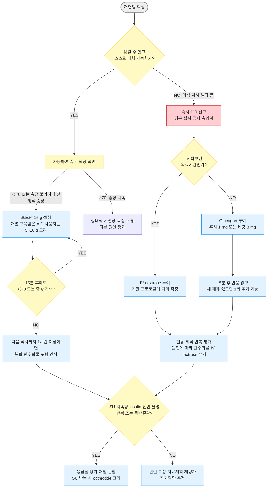

# 저혈당 Hypoglycemia

## <mark style="color:green;">일반 사항</mark>

* 증상 유무와 관계없이 위해를 끼칠 수 있는 수준의 비정상적으로 낮은 혈당 상태
* 저혈당 기전 : 당 섭취·흡수 부족, 혈당강하 약제의 과도한 작용, 간 포도당 생성 저하, 혈당에 대한 counter-regulatory mechanism 부전 등
* 저혈당에 대한 정상 반응(단계적 계층 구조) : 약 80\~85 ㎎/㎗에서 insulin 분비가 감소하고, 약 65\~70 ㎎/㎗에서 glucagon·epinephrine 등의 counter-regulatory hormone이 증가하며, 더 낮아지면 autonomic 및 neuroglycopenic 증상이 나타남. 단, 각 반응의 혈당 역치는 개인 및 평소 혈당 조절 상태에 따라 달라짐
* T1DM에서는 질병 경과 중 저혈당에 대한 glucagon 반응이 저하될 수 있으며, 반복 저혈당이 동반되면 counter-regulatory response와 경고 증상이 더욱 약화되어 저혈당 불감증으로 이어질 수 있음
* 평소 높은 혈당이 빠르게 낮아지면 혈당이 70 ㎎/㎗ 이상이어도 저혈당과 유사한 증상을 느낄 수 있음(상대적 저혈당); 실제 저혈당과 구분 필요
* 분류
  * Level 1 : ＜70 ㎎/㎗ & ≥54 ㎎/㎗; 주의가 필요한 저혈당. 증상이 있을 수도 없을 수도 있음
  * Level 2 : ＜54 ㎎/㎗; 즉각적인 조치가 필요한 임상적으로 유의한 저혈당
  * Level 3 : 혈당 수치와 관계없이, 저혈당 회복을 위해 다른 사람의 도움이 필요한 심한 인지·정신 또는 신체 기능 장애를 동반한 사건
* Level 2 또는 3 저혈당이 한 번이라도 발생하면 치료 계획을 재평가해야 함 - 원인 확인, 약제 감량·변경, 혈당 목표의 개별화·일시적 완화 등
* 인슐린·sulfonylurea(SU) 사용 여부, T1DM vs T2DM, CGM 및 AID 사용 여부에 따라 저혈당 발생 편차가 큼
* 야간 저혈당(nocturnal hypoglycemia)은 증상을 인지하기 어렵고 발견이 지연될 수 있음
* 저혈당에 대한 과잉 치료는 반동성 고혈당 및 불필요한 열량 섭취·체중 증가를 초래할 수 있음

## <mark style="color:green;">원인 및 위험 인자</mark>

* 인슐린 또는 인슐린 분비 촉진제(예: sulfonylurea, meglitinide) 사용
  * 식사 인슐린을 포함한 다회주사요법이나 비자동 펌프요법에서 위험이 높을 수 있음
  * CGM 연동 저혈당 예측 중단·AID 시스템은 기존 인슐린요법보다 저혈당 위험을 낮출 수 있음
  * Sulfonylurea·meglitinide의 위험은 성분, 용량, 신기능, 식사 상태 및 병용약에 따라 달라 단순 서열화하기 어려움
  * 인슐린과 sulfonylurea 병용 시 위험 증가
* 엄격한 혈당 조절, 최근의 빠른 혈당 강하, 큰 혈당 변동성(glycemic variability); 특히 저혈당 유발 약제를 사용하면서 A1C가 낮은 경우
* 긴 당뇨병 유병 기간; T1DM은 유병 기간이 길지 않아도 위험이 높을 수 있음
* 최근 3\~6개월 내 Level 2 또는 3 저혈당 과거력 - 재발의 강력한 예측 인자
* 고령(특히 ≥75세), 소아·청소년 T1DM, 쇠약, 저체중, 임신
* 불규칙 식사·적은 식사·끼니 거름, 무계획적인 운동·과다한 활동, 종교·문화적 이유의 금식
* 음주(특히 공복 음주; 지연 저혈당 위험), 다제약물 복용
* β-blocker : adrenergic warning 증상(떨림, 두근거림 등)을 약화시켜 저혈당 인지를 어렵게 할 수 있으며, 특히 nonselective [β-blocker](../225_/095_-hypertension.md#v-v-adrenergic-receptor-blocker-bb)에서 더 뚜렷함; 발한은 비교적 보존될 수 있음
* 저혈당에 대한 행동 반응을 저해할 수 있는 신체·지적 장애 또는 인지기능 장애
  * 인지기능 저하와 저혈당은 양방향 관계이므로 고위험 환자에서 정기적 인지기능 평가 권고
* 신기능 저하·신부전, 진행성 간질환, 심부전·중증 급성 질환, 부신기능저하, 섭식장애·영양불량, 구토·설사, 위마비, 저혈당 불감증, 비만대사수술 과거력
* Sulfonylurea와 상호작용할 수 있는 약물(예: fluoroquinolone, clarithromycin, trimethoprim/sulfamethoxazole, metronidazole, fluconazole 등) 또는 insulin·SU 효과에 영향을 주는 병용약
* 사회경제적 위기 : 식품 불안정, 저소득, 주거 불안정, 의료보장 미흡, 낮은 건강 문해력
* 여성에서 위험 증가가 보고되지만 개인별 위험은 약제·질환·사회적 요인을 함께 평가 [ADA 2026]

## <mark style="color:green;">임상 양상</mark>

* Autonomic Sx. : 배고픔, 두근거림, 떨림, 창백, 식은땀, 불안, 과민, 구역
* Neuroglycopenic Sx. : 어지럼, 두통, 기력 약화, 감각·시각 이상, 말하기 힘듦, 협응 장애, 행동 변화, 인지 장애, 혼돈, 섬망, 발작, 의식 소실
* 대개 autonomic Sx.이 neuroglycopenic Sx.보다 먼저 나타나 경고 신호 역할을 하지만, 저혈당 불감증에서는 경고 증상이 약해져 혼돈·행동 변화가 첫 증상으로 나타날 수 있음

### <mark style="color:$danger;">🚩 Red Flags!</mark>

<mark style="color:$danger;">**즉각 조치 또는 의뢰**</mark>

* 의식 저하·혼수·발작 또는 안전하게 삼킬 수 없는 상태
* 저혈당 회복에 다른 사람의 도움이 필요한 Level 3 저혈당
* Glucagon 투여 직후 - 반응을 기다리지 말고 119 신고 및 응급 이송
* IV dextrose 투여 후에도 의식 또는 혈당이 회복되지 않거나 저혈당이 반복됨
* 국소 신경학적 결손(편마비, 실어 등 뇌졸중 유사 증상), 특히 혈당 교정 후에도 지속
* Sulfonylurea 과량복용 의심 또는 원인 불명의 지속·재발 저혈당

<mark style="color:$warning;">**당일~수일 내 평가**</mark>

* Sulfonylurea 또는 지속형 인슐린 관련 저혈당 중 재발·지연 위험이 높거나 용량 오류, 신기능 저하, 섭취 불량이 동반됨
* 최근 수 주 내 반복적인 Level 2 저혈당
* 당뇨병 병력이 없는 환자의 원인 불명 공복 저혈당 또는 Whipple triad가 확인된 저혈당
* 신부전, 진행성 간질환, 부신기능저하, 중증 급성 질환이 동반된 저혈당
* 공복 음주 또는 영양불량과 관련된 저혈당
* 인지기능 저하 또는 치매가 새로 확인된 저혈당 고위험 환자

<mark style="color:$info;">**외래 추적 / 추가 평가 계획**</mark> <mark style="color:$info;">- 즉각 위험 낮으나 호전 없으면 의뢰</mark>

* 저혈당 불감증이 의심되나 현재 안정적이고 자가 대처가 가능
* 경미한 반복 저혈당(Level 1)으로 자가 대처가 가능
* 저혈당에 대한 두려움(fear of hypoglycemia)으로 환자가 인슐린 투여 또는 혈당 조절을 회피

## <mark style="color:green;">진단</mark>

* 현장에서는 모세혈관 혈당으로 신속히 확인하되, 의식 저하·발작 등 중증 증상이 있거나 측정이 즉시 불가능하면 검사를 기다리느라 치료를 지연하지 않음
* CGM은 간질액 glucose를 측정하므로 빠른 혈당 변화 시 시간 지연이 있고 저혈당 범위의 정확도가 낮아질 수 있음. 증상이나 임상 상황과 맞지 않으면 손끝 혈당으로 재확인
* Whipple triad : ⓵ 저혈당에 합당한 증상·징후, ⓶ 신뢰할 수 있는 검사로 확인된 낮은 혈장 glucose, ⓷ 혈당 상승 후 증상·징후 해소
  * 당뇨병 약제를 사용하지 않는 환자에서는 불필요한 검사를 피하기 위해 Whipple triad가 확인된 경우에 저혈당 질환을 평가
  * 인슐린·분비촉진제 사용 환자에서 전형적인 증상이 있으나 즉시 측정할 수 없다면 치료 목적으로 저혈당으로 간주하여 조치 가능
* 비당뇨병성 원인 불명 저혈당에서는 가능하면 저혈당 당시 탄수화물 투여 전에 critical sample 채취 : plasma glucose, insulin, C-peptide, proinsulin, β-hydroxybutyrate, 경구 혈당강하제 선별검사; 필요 시 insulin antibody, cortisol 등
* 자발적 발생 당시 검사를 확보하지 못하면 전문기관에서 임상 양상에 따라 감독하 72시간 금식검사 또는 mixed-meal test 고려
* 내인성 고인슐린혈증이 생화학적으로 확인된 뒤 췌장 CT/MRI, 내시경초음파 등의 병변 국소화 검사 시행 [Endocrine Society 2009]

### <mark style="color:orange;">저혈당 위험 선별</mark>

* 저혈당 위험이 있는 모든 환자에서 매 진료 시 저혈당 병력(빈도·중증도·유발 요인·야간 발생)을 확인
* 저혈당 불감증은 최소 매년 및 임상적으로 필요할 때 선별
  * 단일 질문법 : “혈당이 떨어질 때 저혈당 징후가 시작되는 것을 거의 항상 느끼십니까?”에 “아니오”로 답하면 Clarke 또는 Gold score 등으로 상세 평가하거나 전문 교육 연계
* 중증 또는 잦은 저혈당이 있거나 고위험군이면 저혈당에 대한 두려움도 최소 매년 및 필요 시 평가

### <mark style="color:orange;">저혈당의 종류 (감별)</mark>

#### <mark style="color:$primary;">공복 저혈당 Fasting hypoglycemia</mark>

* 야간 또는 음식 섭취가 없는 상태에서 발생하는 저혈당
* 당뇨병 약제를 사용하지 않는 환자에서는 혈당 ＜70 ㎎/㎗만으로 저혈당 질환을 진단하지 않고 Whipple triad를 확인한 뒤 평가
* 감독하 금식검사에서는 증상과 혈장 glucose를 함께 판단하며, 과거 Whipple triad가 명확한 경우 혈장 glucose ＜55 ㎎/㎗ 전후가 중요한 진단 범위. 건강한 사람, 특히 젊은 여성은 장시간 금식 시 무증상 저혈당 수치가 나타날 수 있으므로 수치만으로 진단하지 않음

**주요 원인**

* 약물 : insulin, sulfonylurea·meglitinide; 드물게 quinine, pentamidine, fluoroquinolone, hydroxychloroquine 등
* 음주, 장시간 금식, 영양불량·섭식장애, 지속적인 구토·설사
* 진행성 간질환, 신부전, 패혈증·중증 심부전 등 중증 질환
* Cortisol 결핍 등 호르몬 결핍
* 내인성 고인슐린혈증 : insulinoma, insulin autoimmune syndrome 등
* 비췌도세포종양 저혈당(non-islet cell tumor hypoglycemia) : 대개 IGF-II 매개
* 고의·우발적 insulin 또는 분비촉진제 노출

#### <mark style="color:$primary;">상대적 저혈당 Relative hypoglycemia</mark>

* 만성 고혈당 상태에서 혈당이 빠르게 낮아질 때 측정 혈당이 ≥70 ㎎/㎗인데도 저혈당과 유사한 증상을 느끼는 상태
* 실제 저혈당이 아니라면 반복적인 당 섭취를 피하고, 다른 증상 원인 및 혈당 하강 속도·치료 강도를 개별적으로 재평가

#### <mark style="color:$primary;">측정·검체 아티팩트</mark>

* CGM lag : 혈당이 빠르게 변할 때 간질액 glucose가 혈당 변화를 수 분 늦게 반영할 수 있음
* 압박 저혈당(compression low) : 수면·휴식 중 센서 부위 압박으로 인위적으로 낮은 CGM 수치가 나타남
  * 증상 또는 임상 상황과 맞지 않는 CGM 수치는 손끝 혈당으로 재확인 (☞ [당뇨병 약물 치료](101_-dmdrugs.md#cgm-데이터-판독-및-관리-실무))
* 검체성 저혈당 : 채혈 후 혈구가 시험관 안에서 glucose를 계속 소비하여 실제보다 낮게 측정됨. 백혈구증가증·적혈구증가증·혈소판증가증 또는 검체 처리 지연 시 의심
  * 신속한 혈장 분리 또는 적절한 glycolysis inhibitor 검체로 재검하고 임상 상태·모세혈관 혈당과 대조

#### <mark style="color:$primary;">저혈당 불감증 Impaired hypoglycemia awareness</mark>

* 저혈당이 발생해도 경고 증상을 느끼지 못하거나 늦게 인지하는 상태; hypoglycemia-associated autonomic failure(HAAF)의 중요한 구성요소지만 완전한 동의어는 아님
* 반복 저혈당, 엄격한 혈당 조절, 수면, 운동 등으로 counter-regulatory response와 autonomic warning response의 역치가 낮아질 수 있음
* Level 3 저혈당 위험을 크게 증가시키며 저혈당에 대한 두려움과 흔히 동반
* 대처
  * 수 주 동안 저혈당 재발을 철저히 방지하여 인지능 회복 도모 : 혈당 목표 일시 완화, 원인 약제 감량·변경
  * 저혈당 경고 기능이 있는 real-time CGM, predictive low-glucose suspend 또는 AID 고려
  * 구조화된 저혈당 인지능 회복 교육 프로그램 또는 경험 있는 당뇨병 교육자·전문가에게 연계
  * 당뇨병성 자율신경병증이 의심되면 별도 평가·관리하되 이를 저혈당 불감증의 유일한 원인으로 단정하지 않음

#### <mark style="color:$primary;">반응성(식후) 저혈당</mark>

* 인슐린/SU를 사용하지 않는 환자에서도 발생할 수 있는 독립적인 임상 문제로, 진단·관리가 당뇨병성 저혈당과 다름. 위절제술·Roux-en-Y 후 저혈당도 주로 식후에 발생 (☞ [반응성 저혈당](reactive-hypoglycemia-postprandial-hypoglycemia.md))

***


```mermaid
graph TD
    A([저혈당 의심]) --> B{삼킬 수 있고<br/>스스로 대처 가능한가?}
    B -->|YES| C[가능하면 즉시 혈당 확인]
    C -->|＜70 또는 측정 불가하나 전형적 증상| D[포도당 15 g 섭취<br/>개별 교육받은 AID 사용자는 5~10 g 고려]
    C -->|≥70, 증상 지속| E[상대적 저혈당·측정 오류<br/>다른 원인 평가]
    D --> F{15분 후에도<br/>＜70 또는 증상 지속?}
    F -->|YES| D
    F -->|NO| G[다음 식사까지 1시간 이상이면<br/>복합 탄수화물 포함 간식]
    B -->|NO: 의식 저하·발작 등| H[즉시 119 신고<br/>경구 섭취 금지·측와위]
    H --> I{IV 확보된<br/>의료기관인가?}
    I -->|YES| J[IV dextrose 투여<br/>기관 프로토콜에 따라 적정]
    I -->|NO| K[Glucagon 투여<br/>주사 1 mg 또는 비강 3 mg]
    K --> L[15분 후 반응 없고<br/>새 제제 있으면 1회 추가 가능]
    J --> M[혈당·의식 반복 평가<br/>원인에 따라 탄수화물·IV dextrose 유지]
    L --> M
    G --> N{SU·지속형 insulin·원인 불명<br/>반복 또는 동반질환?}
    M --> N
    N -->|YES| O[응급실 평가·재발 관찰<br/>SU 반복 시 octreotide 고려]
    N -->|NO| P[원인 교정·치료계획 재평가<br/>자가혈당 추적]

    style A fill:#eeeeee,stroke:#888888,stroke-width:2px
    style H fill:#ffcdd2,stroke:#c62828
    classDef yellow fill:#fff9c4,stroke:#ffe082
    class B,C,F,I,N yellow
    classDef sky fill:#e3f2ff,stroke:#2196f3
    class D,G,J,K,L,M,O,P sky
```

<p align="center"><strong>저혈당 대처 알고리듬</strong></p>

<p align="center"><em><mark style="color:$info;">저자 재구성(참고문헌 : ADA Standards of Care in Diabetes, Glycemic Goals, Hypoglycemia, and Hyperglycemic Crises, 2026; KDA 당뇨병 진료지침 제9판, 2025; Endocrine Society, 2009)</mark></em></p>

***

## <mark style="background-color:$warning;">Management</mark>


**삼킴·자가 대처 가능 여부에 따라 처치가 달라짐** : 안전하게 삼킬 수 있는 환자는 경구 포도당으로, 의식 저하·발작 또는 삼킴이 불가능한 환자는 경구 섭취를 금하고 glucagon 또는 IV dextrose로 처치


### <mark style="color:orange;">안전하게 삼킬 수 있을 때</mark>

* 포도당 15 g 섭취 → 15분 후 혈당 재검 → ＜70 ㎎/㎗이거나 증상이 지속되면 반복 → 회복 후 다음 식사가 1시간 이상 남은 경우 복합 탄수화물이 포함된 간식 섭취
* 운동 중·직후 발생한 저혈당은 활동으로 인한 glucose 소모가 지속될 수 있으므로 1차 교정 후 추가 탄수화물 필요 여부를 혈당 추세와 운동 상황에 따라 판단
* 포도당 15\~20 g 음식 예
  * 포도당 정제 또는 gel : 제품 표시에서 총 포도당 약 15 g이 되도록 사용
  * 설탕 함유 주스 또는 청량음료 약 150\~175 ㎖
  * 설탕 또는 꿀 한 큰술 - α-glucosidase inhibitor 복용자는 사용하지 않음
  * 사탕 : 제품별 탄수화물 함량을 확인하여 총량 약 15 g이 되도록 사용
* 순수 포도당이 1차 선택이며, 지방·단백질이 많은 초콜릿·아이스크림은 흡수가 지연되어 초기 치료에 적합하지 않음
* AID 사용자는 insulin delivery가 이미 감소·중단되므로 5\~10 g으로도 충분할 수 있음. 운동 동반, 수동 모드, 많은 insulin on board 등에서는 더 필요할 수 있으므로 기기·과거 반응에 따라 사전에 개별 교육 [ADA 2026]


**Acarbose 등 α-glucosidase inhibitor를 다른 저혈당 유발 약제와 병용하는 환자** : α-glucosidase inhibitor 단독은 보통 저혈당을 일으키지 않지만, insulin·SU 등과 병용 중 발생한 저혈당은 sucrose(설탕)가 아니라 순수 포도당으로 치료. 과일주스·사탕은 성분이 일정하지 않으므로 포도당 정제·gel이 가장 예측 가능한 선택


### <mark style="color:orange;">의식 저하·발작 또는 삼킬 수 없을 때</mark>

* 즉시 119 신고; 음식·음료를 억지로 먹이지 않고 측와위 유지. 저혈당 교정을 위해 insulin을 추가 투여하지 않도록 보호자 교육
* 비의료 현장 또는 IV 확보 전 glucagon
  * 주사형 : 1 ㎎ IM 또는 SC
  * 비강형 : 3 ㎎을 한쪽 비강에 1회 분무; 흡입할 필요 없음
  * 15분 후에도 반응이 없고 두 번째 제제가 있으면 응급의료진을 기다리는 동안 추가 투여 가능
* 의료기관에서는 IV dextrose 투여 후 5\~15분 간격으로 혈당·의식을 반복 평가
  * 기관 프로토콜에 따라 10% 또는 20% dextrose 등을 적정; 50% dextrose를 사용할 경우 고장성으로 인한 혈관외 유출·조직손상 및 반동성 고혈당에 주의
  * 재발 위험이 있으면 경구 탄수화물 또는 10% dextrose 등의 지속 공급을 원인·혈당 반응에 따라 적정; 5% dextrose만으로는 부족할 수 있음
* 회복 후 원인 약제, 용량, 신·간기능, 식사·음주, 재발 여부를 평가. Level 3, 원인 불명, sulfonylurea·지속형 insulin 관련 또는 반복 저혈당은 응급실 평가·관찰

### <mark style="color:orange;">Sulfonylurea 유발 지속·재발 저혈당</mark>

* Sulfonylurea 과량복용 또는 dextrose 투여 후 반복되는 저혈당은 단순 경구 포도당 처치 후 귀가시키지 않고 응급실 이송·입원 관찰
* Dextrose가 insulin 분비를 다시 촉진하여 재발할 수 있으므로 독성센터·응급의학과와 협의하여 octreotide 병용 고려
  * 성인에서 흔히 octreotide 50\~100 ㎍ SC 또는 IV, 필요 시 6\~12시간 간격 반복; 구체적 용량·기간은 원인 성분, 신기능, 재발 여부 및 기관 중독 프로토콜에 따름
* IV dextrose 및 octreotide 중단 후에도 지연 재발 가능. 관찰 기간은 약제·용량·신기능 및 마지막 치료 후 경과에 따라 개별화

## <mark style="color:green;">비-약물 치료 및 예방</mark>

* 모든 insulin 사용자와 저혈당 위험이 있는 환자에게 증상·유발 요인·15분 원칙·중증 저혈당 대처에 대한 구조화 교육 제공; 주위 사람도 교육하고 당뇨 패찰 착용 고려
* 규칙적 식사; insulin 또는 분비촉진제 사용 중 식사량·시간이 달라지면 약제 조정 계획을 사전에 교육
* 규칙적 자가혈당 측정 또는 CGM 사용; 증상이 있을 때 즉시 확인하되 중증 증상에서는 측정을 기다리느라 치료를 지연하지 않음
* Insulin 또는 분비촉진제 사용자는 운동 전 혈당·CGM 추세, insulin on board, 운동 종류·강도·시간에 따라 탄수화물 섭취 또는 insulin 감량을 개별화
* 저혈당 위험이 있는 환자는 운전 전 혈당을 확인. 낮거나 하강 중이면 탄수화물 섭취 후 안전 범위로 회복했는지 재확인하고, 인지기능이 충분히 회복될 때까지 운전하지 않음
* CGM 사용자는 저혈당 경고 기능을 활성화하고 경고 역치·공유 기능을 개인 상황에 맞게 설정
* Insulin을 사용하는 모든 환자 또는 저혈당 고위험군에게 glucagon 처방; 가족·보호자·학교 관계자 등 주변인에게 보관 위치와 사용법 교육 [ADA 2026]
* 가정용 구급상자와 외출 가방에 경구 포도당을 준비
* 저혈당 불감증 또는 반복 Level 2/3 저혈당이 있으면 수 주 동안 저혈당 회피를 최우선으로 하여 혈당 목표를 일시 완화하고 약제를 조정
* 인지기능을 정기적으로 평가하고 저하가 확인되면 치료계획을 단순화하며 보호자 참여를 강화
* 저혈당 고위험군에서 real-time CGM 권고; T1DM에서 저혈당 예측 중단 기능 및 AID는 저혈당 감소에 도움
* 저혈당 위험이 높거나 반복되면 엄격한 A1C 목표보다 저혈당 회피를 우선하여 목표와 약제를 개별화

### <mark style="color:orange;">방문 시기별 저혈당 예방 체크리스트</mark>

<table><thead><tr><th width="290">예방 활동</th><th width="90" align="center">초진</th><th width="150" align="center">매 방문</th><th align="center">연 1회</th></tr></thead><tbody><tr><td>저혈당 병력 평가</td><td align="center">✓</td><td align="center">✓</td><td align="center">✓</td></tr><tr><td>저혈당 불감증 평가</td><td align="center">✓</td><td align="center"></td><td align="center">✓</td></tr><tr><td>인지기능 및 기타 저혈당 위험 인자 평가</td><td align="center">✓</td><td align="center"></td><td align="center">✓</td></tr><tr><td>저혈당 예방·대처 구조화 교육</td><td align="center">✓</td><td align="center">재발 또는 고위험 약제 시작 시</td><td align="center">재발 또는 고위험 약제 시작 시</td></tr><tr><td>당뇨병 기술(CGM/AID 등) 필요성 검토</td><td align="center">✓</td><td align="center">✓</td><td align="center">✓</td></tr><tr><td>치료계획 재평가·단순화·약제 변경</td><td align="center">✓</td><td align="center">Level 2/3, 급성 질환·상호작용 시</td><td align="center">Level 2/3, 급성 질환·상호작용 시</td></tr><tr><td>Glucagon 처방·주변인 교육</td><td align="center">✓</td><td align="center"></td><td align="center">✓</td></tr><tr><td>저혈당 인지능 회복 교육</td><td align="center">불감증 시</td><td align="center"></td><td align="center">불감증 시</td></tr></tbody></table>

_✽ADA 2026 Table 6.7 재구성; 제시된 주기는 최소 권고이며 임상 판단에 따라 더 자주 시행_

## <mark style="color:green;">약물 치료</mark>

#### <mark style="color:$primary;">경구 포도당·탄수화물</mark>

* 안전하게 삼킬 수 있는 경증\~중등도 저혈당의 1차 치료; 순수 포도당이 우선이며 glucose를 함유한 다른 탄수화물도 사용 가능
* 포도당 정제·gel은 제품별 함량을 확인하여 총 포도당 약 15 g이 되도록 사용
* α-glucosidase inhibitor를 insulin·SU 등과 병용하는 환자는 순수 포도당으로 치료

#### <mark style="color:$primary;">Glucagon</mark>

* 의식 저하·발작 또는 삼킴 불가능으로 경구 섭취가 불가능한 경우 IV dextrose를 즉시 사용할 수 없는 현장에서 사용
* Insulin 사용자 또는 저혈당 고위험군에게 미리 처방하고 주변인에게 사용법 교육; 재구성이 필요 없는 제형 우선 권고 [ADA 2026]
* 주사형 1 ㎎ : 사용 직전 동봉된 희석액으로 재구성하여 IM 또는 SC <mark style="color:blue;">[글루카겐하이포키트주]</mark>
* 비강형 3 ㎎ : 한쪽 비강에 1회 분무; 흡입 불필요, 1회용 <mark style="color:blue;">[바크시미나잘스프레이]</mark>
* 두 제품은 당뇨병을 가진 소아·성인의 중증 저혈당증에 대해 2026년 1월 1일부터 국내 급여 적용 [보건복지부 고시 제2025-224호]; 처방 전 공급 경로·재고 및 최신 급여기준 확인
* Glucagon 투여 직후 119에 신고하고 측와위 유지. 15분 후 반응이 없고 새 제제가 있으면 응급의료진을 기다리는 동안 추가 투여 가능
* 회복하여 안전하게 삼킬 수 있으면 빠르게 흡수되는 탄수화물에 이어 지속성 탄수화물이 포함된 식사·간식 제공
* 간 glycogen 고갈 상태(장시간 기아, 만성 저혈당, 알코올 관련 저혈당, 일부 glycogen storage disease)에서는 효과가 제한적 → IV dextrose 우선

#### <mark style="color:$primary;">Dextrose 정맥 투여</mark>

* 의료기관의 의식 저하·발작·삼킴 불가능 환자 또는 glucagon에 반응하지 않는 환자
* 기관 프로토콜에 따라 IV dextrose를 투여하고 5\~15분 간격으로 혈당·의식을 재평가하며 추가 용량 적정
* 말초정맥에서는 10% 또는 20% dextrose 사용을 고려. 50% dextrose 사용 시 혈관외 유출에 따른 조직손상과 반동성 고혈당에 주의
* 재발 위험이 있으면 경구 탄수화물 또는 IV dextrose 지속 주입을 원인과 반응에 따라 조정

#### <mark style="color:$primary;">Octreotide</mark>

* Sulfonylurea 과량복용 또는 dextrose 후 반복되는 저혈당에서 응급실·입원 환경에서 병용 고려
* 성인에서 흔히 50\~100 ㎍ SC 또는 IV 후 필요 시 6\~12시간 간격 반복; 독성센터·응급의학과 및 기관 프로토콜에 따라 적용

***

### <mark style="color:red;">질병코드</mark>

E10.63 저혈당을 동반한 1형 당뇨병

E11.63 저혈당을 동반한 2형 당뇨병

E13.63 저혈당을 동반한 기타 명시된 당뇨병

E14.63 저혈당을 동반한 상세불명의 당뇨병

E15 비당뇨병성 저혈당성 혼수

E16.0 혼수를 동반하지 않은 약물유발 저혈당

E16.1 기타 저혈당

E16.2 상세불명의 저혈당

***

## <mark style="color:purple;">처방례</mark>

> **처방례 1. 안전하게 삼킬 수 있는 경증\~중등도 저혈당**
>
> ```
> 포도당 정제  제품 표시상 총 포도당 약 15 g  즉시 복용
> 15분 후 혈당이 70 ㎎/㎗ 미만이거나 증상이 지속되면 같은 양 반복
> ```
>
> _✽회복 후 다음 식사가 1시간 이상 남았으면 복합 탄수화물이 포함된 간식 섭취; α-glucosidase inhibitor를 insulin·SU와 병용 중이면 반드시 순수 포도당 사용_

> **처방례 2. Insulin 사용자 또는 저혈당 고위험군의 중증 저혈당 구조약 - 다음 중 1개 선택**
>
> ```
> 바크시미나잘스프레이 3 ㎎/device  중증 저혈당 시 한쪽 비강에 1회 분무
> 또는
> 글루카겐하이포키트주 1 ㎎  사용 직전 재구성하여 대퇴부 또는 삼각근에 IM/SC
>
> ※ 투여 직후 119 신고 및 측와위 유지
> ※ 15분 후에도 반응이 없고 새 제제가 있으면 응급의료진을 기다리는 동안 추가 투여 가능
> ```
>
> _✽환자 본인이 아니라 가족·동거인 등 주변인이 사용하는 구조약이므로 보관 위치·사용법·유효기간을 함께 교육; 공급 경로·재고 및 최신 급여기준 확인_

> **처방례 3. Sulfonylurea 또는 지속형 insulin 관련 반복·지연 저혈당**
>
> ```
> 자가치료 처방례가 아님 - 즉시 응급실 의뢰
> 원인 약제 중단 및 혈당 반복 측정
> IV dextrose 투여 후에도 반복되는 sulfonylurea 저혈당은 octreotide 병용 고려
> 관찰 기간은 약제·용량·신기능·재발 여부와 마지막 치료 시점에 따라 결정
> ```

***

### <mark style="color:$success;">핵심 복약 지도</mark>

> **15분 원칙, 정확히 지키기**
>
> * 포도당 15 g 섭취 → 15분 대기 → 재측정; 여전히 ＜70 ㎎/㎗이거나 증상이 지속되면 반복
> * AID 사용자는 사전에 개별 교육받은 경우 5\~10 g으로 시작할 수 있음
> * 지방·단백질 함유 식품(초콜릿, 아이스크림)은 흡수가 늦어 초기 치료제로 부적합
> * α-glucosidase inhibitor를 insulin·SU와 병용 중이면 반드시 순수 포도당으로 치료

> **Glucagon, 투여 즉시 119 신고**
>
> * 환자 본인이 아니라 가족·동거인·보호자가 사용하는 구조약임을 안내
> * 주사형은 사용 직전 재구성하고, 비강형은 한쪽 코에 1회 분무하며 흡입할 필요가 없음
> * 투여 직후 119에 신고하고 구토에 대비해 환자를 옆으로 눕힘
> * 15분 내 반응이 없고 새 제제가 있으면 응급의료진을 기다리는 동안 추가 투여 가능
> * 유효기간을 정기적으로 확인하고 사용 후 재처방

> **원인 약제 재검토 및 저혈당 불감증 선별**
>
> * Sulfonylurea·지속형 insulin 관련 저혈당은 지연·재발할 수 있어 회복만으로 안심하지 않음
> * Level 2 또는 3 저혈당이 한 번이라도 발생하면 원인 약제·혈당 목표·CGM 필요성을 재평가
> * 최소 매년 및 재발 시 “혈당이 낮아질 때 항상 느낄 수 있습니까?”라고 질문하여 저혈당 불감증 선별

> **언제 다시 병원을 방문해야 하나요?**
>
> * 의식 저하·발작·삼킴 불가능 또는 다른 사람의 도움이 필요한 경우 - 즉시 119 신고
> * 포도당을 반복 섭취해도 저혈당이 교정되지 않거나 다시 발생하는 경우
> * 최근 수 주 내 Level 2 저혈당이 반복되는 경우
> * 원인을 알 수 없는 저혈당 또는 저혈당 불감증이 의심되는 경우

***

## <mark style="color:blue;">환자 안내서</mark>


**저혈당, 빠르게 알아채고 빠르게 대처하는 것이 가장 중요합니다**

저혈당은 혈액 속 당이 지나치게 낮아진 상태입니다. 당뇨병 약이나 insulin을 사용하는 분에게 생길 수 있으며, 심하면 다른 사람의 도움이 필요합니다. 아래 원칙을 환자와 가족이 함께 익혀 두십시오.


#### <mark style="color:$primary;">왜 저혈당이 생기나요?</mark>

* Insulin이나 일부 당뇨병 약, 특히 sulfonylurea 계열의 작용이 몸에 필요한 양보다 많을 때
* 식사를 거르거나 평소보다 적게 먹었을 때
* 계획에 없던 운동이나 심한 활동을 했을 때
* 공복에 술을 마셨을 때 - 다음 날까지 늦게 발생할 수 있음
* 신장·간 기능이 나빠지거나 구토·설사 등 급성 질환이 생겼을 때

#### <mark style="color:$primary;">저혈당 증상이 느껴지면 어떻게 해야 하나요?</mark>

* 가능하면 바로 혈당을 측정하십시오. 다만 심한 의식 저하나 발작이 있으면 측정을 기다리지 말고 119에 신고하십시오.
* 안전하게 삼킬 수 있고 혈당이 70 ㎎/㎗ 미만이면 포도당 15 g을 즉시 섭취하십시오.
  * 포도당 정제·gel은 제품 표시를 확인하여 총 포도당 약 15 g
  * 설탕 함유 주스·청량음료 약 150\~175 ㎖
* 15분간 기다린 뒤 다시 측정하고, 아직 70 ㎎/㎗ 미만이거나 증상이 지속되면 같은 양을 반복하십시오.
* 회복 후 다음 식사가 1시간 이상 남았다면 복합 탄수화물이 포함된 간식을 드십시오.
* 초콜릿이나 아이스크림은 흡수가 느려 첫 응급 처치용으로 적합하지 않습니다.
* Acarbose 같은 약을 insulin·sulfonylurea와 함께 복용한다면 설탕이나 사탕 대신 순수 포도당 정제·gel을 사용하십시오.

#### <mark style="color:$primary;">가족은 glucagon을 어떻게 사용하나요?</mark>

* 환자가 의식이 없거나 발작 중이거나 삼킬 수 없으면 음식을 억지로 먹이지 말고 **즉시 119에 신고**하십시오.
* 처방받은 glucagon을 바로 사용하십시오.
  * 비강형 : 한쪽 코에 1회 분무합니다. 환자가 들이마실 필요는 없습니다.
  * 주사형 : 동봉된 설명에 따라 가루약을 희석액에 녹여 허벅지나 팔에 주사합니다.
* 구토할 수 있으므로 환자를 옆으로 눕혀 두십시오. 저혈당을 고치려고 insulin을 추가 주사해서는 안 됩니다.
* 15분이 지나도 깨어나지 않고 새 glucagon 제제가 있으면 응급의료진을 기다리는 동안 한 번 더 투여할 수 있습니다.
* 사용 후에는 반드시 다시 처방받고 유효기간을 정기적으로 확인하십시오.

#### <mark style="color:$primary;">저혈당을 예방하려면?</mark>

* 식사를 거르지 말고 식사량·시간이 달라질 때 약 조절법을 담당 의료진과 미리 상의하십시오.
* 평소와 다른 운동을 할 때는 혈당과 CGM 추세를 확인하고 필요한 탄수화물이나 insulin 조절법을 미리 정하십시오.
* 포도당 정제·gel을 항상 가지고 다니고 가정 구급상자에도 넣어 두십시오.
* CGM을 사용한다면 저혈당 경고 기능을 켜 두십시오.
* 저혈당이 반복되면 약 용량·종류, 목표 혈당 및 CGM/AID 사용을 담당 의료진과 재검토하십시오.
* 혈당이 낮아져도 잘 느끼지 못한다면 반드시 의료진에게 알리십시오.

#### <mark style="color:$primary;">이럴 때는 즉시 119에 신고하세요</mark>

* 의식이 흐려지거나 깨우기 어렵고 안전하게 삼킬 수 없을 때
* 발작이 있었을 때
* 다른 사람의 도움 없이는 저혈당을 치료할 수 없을 때
* 포도당을 반복 섭취해도 회복되지 않거나 곧 다시 저혈당이 발생할 때
