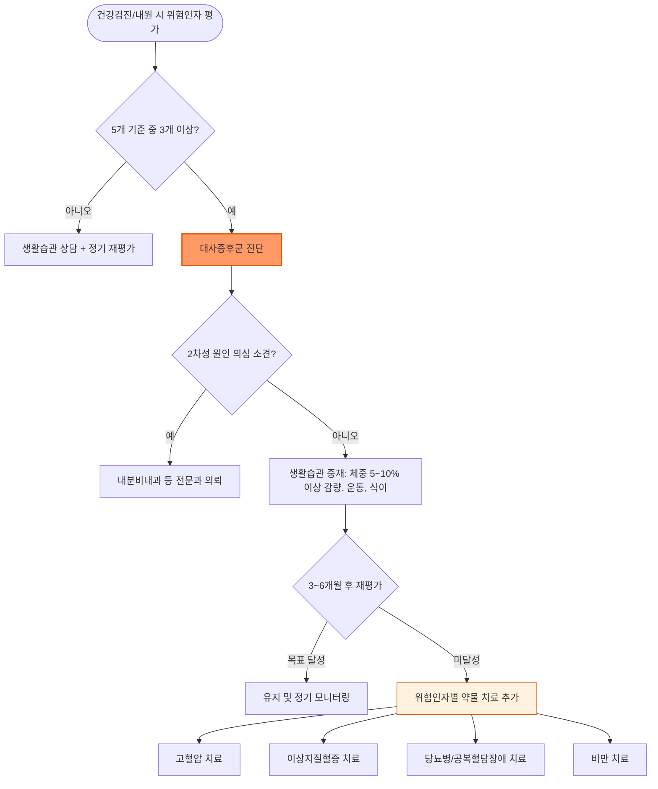

# 대사증후군 Metabolic Syndrome

## <mark style="color:green;">일반 사항</mark>

* 2형 당뇨병, 심혈관 질환, 뇌졸중, 지방간, 암 등의 위험을 증가시키는 대사 이상들의 묶음(cluster)
* 다른 이름 : insulin resistance syndrome, syndrome X
* 유병률(국민건강영양조사 제9기, 2022\~2024) : 19세 이상 성인 21.5%, 30세 이상 25.7%, 65세 이상 39.0%; 남성 28.5%, 여성 14.3%로 남성이 여성의 약 2배&#x20;
  * 제8기(2019\~2021) 24.9%에서 제9기 21.5%로 감소했으나 성별 격차는 오히려 확대되는 추세(한국 대사증후군 팩트시트 2026)
  * 성별 격차의 배경 : 폐경 전 여성은 estrogen의 보호 효과로 유병률이 상대적으로 낮으나 폐경 이후 빠르게 상승하는 반면, 남성은 전 연령대에서 내장 지방 축적이 더 흔해 젊은 연령부터 유병률이 높음
  * 고혈압 환자에서는 약 53%까지 동반율 상승
* 심혈관 질환 등으로 전체 사망률 증가(남 1.44\~2.26배, 여 1.38\~2.78배)


**대사증후군과 CKM 증후군(Cardiovascular-Kidney-Metabolic Syndrome)**\
미국심장협회(AHA)는 2023년 Presidential Advisory에서 비만·대사이상·만성신질환·심혈관질환을 하나의 연속된 병태생리 스펙트럼으로 보는 CKM 증후군 개념을 제시했고, 2026년 6월 AHA/ACC/ADA/ASN 공동으로 첫 임상진료지침이 발표되었다. Stage 1(과체중/비만) → Stage 2(대사 위험인자 또는 CKD 동반, 대사증후군이 여기 해당) → Stage 3(무증상 심혈관질환/고위험군) → Stage 4(임상적 심혈관질환)로 단계가 진행하며, 조기 단계(비만·대사증후군)에서의 개입이 이후 심·신장 합병증을 줄이는 핵심으로 강조된다. 전통적 대사증후군 5항목 진단 기준은 CKM Stage 2 판정의 실무적 도구로 계속 유용하다. CKM 단계는 기존 대사증후군을 대체하는 개념이 아니라, 심장·신장·대사 질환을 통합적으로 평가하는 새로운 위험도 분류 체계로 이해하는 것이 정확하다.


<table><thead><tr><th width="110">CKM Stage</th><th>정의</th><th width="200">대사증후군과의 관계</th></tr></thead><tbody><tr><td>Stage 0</td><td>위험인자 없음</td><td>해당 없음</td></tr><tr><td>Stage 1</td><td>과체중/비만 또는 이상지방분포, 다른 대사 위험인자 없음</td><td>대사증후군 진단 기준 미충족(0\~2개)</td></tr><tr><td>Stage 2</td><td>대사 위험인자(고혈압, 이상지질혈증, 고혈당 등) 또는 CKD 동반, 심혈관질환 없음</td><td>대사증후군 5항목 중 ≥3개 충족 시 통상 이 단계에 해당</td></tr><tr><td>Stage 3</td><td>무증상 심혈관질환 또는 고위험 CKD·높은 예측 심혈관 위험</td><td>대사증후군 + 아형 검사(관상동맥석회화 등)에서 이상 소견</td></tr><tr><td>Stage 4</td><td>임상적 심혈관질환 동반</td><td>대사증후군 + 확진된 심혈관질환</td></tr></tbody></table>


**대사증후군은 위험 표지(risk marker)입니다**\
대사증후군은 그 자체가 독립적인 치료 대상이라기보다 심혈관·신장·대사 위험이 증가했음을 알리는 위험 표지로 이해하는 것이 적절하며, 실제 치료는 진단명이 아니라 혈압·지질·혈당·체중 등 개별 위험 인자의 적극적인 조절에 초점을 둔다.


### <mark style="color:orange;">병태생리</mark>

* intra-abdominal & visceral adipose tissue 증가
* adipose tissue dysfunction, insulin resistance; leptin resistance가 병태생리적 기전으로 제시되나 임상적 진단 도구는 아직 없음
* adipose tissue inflammation 및 ectopic fat deposition(간, 췌장, 골격근 등에 이소성 지방 축적)
* adiponectin(2형 당뇨병, 고혈압, 죽상경화증 등으로부터의 보호 인자) 감소
* 지방산 대사 이상, 혈관내피 기능이상, 전신 염증(IL-6, TNF-α, resistin, CRP↑), 산화 스트레스, renin-angiotensin system 활성화, prothrombotic state(tissue plasminogen activator inhibitor-1↑)

***

## <mark style="color:green;">원인 및 위험 인자</mark>

* 중심 비만, 인슐린 저항성
* 고령, 폐경기
* 유전, 가족력(대사증후군, 당뇨병, 심혈관 질환)
* 소아기 비만
* 고칼로리 식사, 설탕 가미 음료 섭취
* 낮은 사회 경제적 상태
* 음주, 흡연, 신체 비활동
* 약물 : steroid, 항정신병제, β-blocker
* pro-inflammatory state, 장내 미생물총 변화

### <mark style="color:orange;">관련 질환</mark>

* 폐쇄수면무호흡증(OSA), MASLD(구 NAFLD), 만성 신질환(CKD), PCOS, 고요산혈증/통풍, 발기 장애 — 최근 근거에서 연관성·임상적 중요도가 특히 큰 질환
* acanthosis nigricans, 담석증, 우울, 인지 장애, Vit D 결핍, 무증상 갑상선저하증

***

## <mark style="color:green;">임상 양상</mark>

* 대부분 무증상이며 건강검진의 허리둘레·혈압·혈액검사에서 우연히 발견되는 경우가 많음
* 중심 비만의 신체 소견 : 허리둘레 증가, 목·겨드랑이 등의 acanthosis nigricans(인슐린 저항성 시사)
* 관련 질환의 증상이 먼저 나타나기도 함 : 코골이·주간 졸림(폐쇄수면무호흡증), 여성에서 월경 불순·다모증(PCOS), 관절통(고요산혈증/통풍)
* 진행 시 2형 당뇨병, 관상동맥질환, 뇌졸중 등 대혈관 합병증의 증상으로 발현 가능

***

### <mark style="color:$danger;">🚩 Red Flags!</mark>

<mark style="color:$danger;">**즉각 조치 또는 의뢰**</mark>

* 급성 흉통, 호흡곤란 등 급성 관상동맥증후군 의심 증상
* 편측 위약감, 언어 장애 등 급성 뇌졸중 의심 증상
* 혈압 ≥180/120 ㎜Hg + 흉통·호흡곤란·시야 이상·의식 변화 등 표적장기 손상 증후(고혈압 응급, hypertensive emergency — 국제적으로 hypertensive crisis 범주)
* 심한 다뇨·다음·의식 변화를 동반한 고혈당(당뇨병성 케톤산증, 고삼투압성 고혈당 상태 의심)
* 심한 복통을 동반한 중성지방 ≥500 ㎎/㎗(급성 췌장염 위험)

<mark style="color:$warning;">**당일 또는 조기 의뢰**</mark>

* 혈압 ≥180/120 ㎜Hg이나 표적장기 손상 증후는 없는 경우(중증 고혈압, hypertensive urgency)
* 공복혈당 ≥200 ㎎/㎗ 또는 새로 진단된 증상이 뚜렷한 고혈당(다뇨·다음·체중 감소 동반) → 당뇨병 확인 및 치료 시작
* 심한 이상지질혈증(LDL-C ≥190 ㎎/㎗) → 이차성 원인 감별 및 약물 치료 결정
* 쿠싱증후군, 갑상선기능저하증 등 2차성 원인이 강력히 의심되는 경우(급속한 체중 증가·자색 선조·근력 저하 등) → 내분비내과 의뢰
* 코골이 + 수면 중 무호흡 목격 + 주간 졸림 동반 → 폐쇄성 수면무호흡증 강력 의심, 수면다원검사 의뢰

<mark style="color:$info;">**외래 추적 / 추가 평가 계획**</mark> <mark style="color:$info;">- 즉각 위험 낮으나 호전 없으면 의뢰</mark>

* 생활습관 개선 3\~6개월 후에도 목표(체중, 혈압, 지질, 혈당) 미달성
* 경계역 소견(공복혈당장애, 경도 이상지질혈증 등)의 정기 재평가
* 만성 신질환·MASLD 등 동반 질환 진행 여부 모니터링

***

## <mark style="color:green;">진단</mark>

* 진단 : 다음 5개 항목 중 ≥3개 해당(NCEP-ATP III 개정안 + 대한비만학회 복부비만 기준)

<table><thead><tr><th width="220">항목</th><th>기준</th></tr></thead><tbody><tr><td>중심 비만</td><td>복부 둘레 남성 ≥90 ㎝, 여성 ≥85 ㎝</td></tr><tr><td>높은 중성지방</td><td>≥150 ㎎/㎗ 또는 약물 치료 중</td></tr><tr><td>낮은 HDL-C</td><td>남성 &#x3C;40 ㎎/㎗, 여성 &#x3C;50 ㎎/㎗ 또는 약물 치료 중</td></tr><tr><td>높은 혈압</td><td>SBP ≥130 ㎜Hg 또는 DBP ≥85 ㎜Hg 또는 약물 치료 중</td></tr><tr><td>높은 혈당</td><td>공복혈당 ≥100 ㎎/㎗(일부 지침에서는 HbA1c ≥5.7%도 병기) 또는 혈당강하제 치료 중 또는 제2형 당뇨병</td></tr></tbody></table>

* 기본 검사 : 허리둘레·혈압 측정, 공복혈당 또는 HbA1c, 지질검사(LDL-C 포함), 간기능(MASLD 선별), creatinine/eGFR, 요산

### <mark style="color:orange;">감별 진단</mark>

* 중심 비만·대사 이상을 유발하는 2차성 원인의 감별이 필요

<table><thead><tr><th width="150">질환</th><th width="260">대사증후군과의 차이점</th><th>핵심 감별 포인트</th></tr></thead><tbody><tr><td>쿠싱증후군</td><td>중심 비만·고혈압·고혈당이 코티솔 과잉에 기인</td><td>자색 선조, 근위부 근력 저하, 다혈성 안면 → 24시간 요중 유리코티솔/덱사메타손 억제검사</td></tr><tr><td>갑상선기능저하증</td><td>체중 증가·이상지질혈증이 갑상선호르몬 저하에 기인</td><td>피로, 서맥, 부종 → TSH·free T4</td></tr><tr><td>다낭성난소증후군(PCOS)</td><td>인슐린 저항성이 동반되나 생식계 이상이 주 소견</td><td>월경 불순, 다모증, 여드름 → 남성호르몬·초음파</td></tr><tr><td>약물 유발</td><td>steroid, 비정형 항정신병제 등으로 이차적 발생</td><td>약물 복용력 확인 및 가능시 대체 약제 검토</td></tr></tbody></table>

***



<p align="center"><strong>대사증후군 진단 및 치료 알고리듬</strong></p>

<p align="center"><em><mark style="color:$info;">Ref. NCEP-ATP III 개정안; AHA/ACC/ADA/ASN CKM Syndrome Guideline (2026)</mark></em></p>

***

## <mark style="background-color:$warning;">Management</mark>


**단계별 치료 전략(Step-wise Approach)**\
생활습관 개선이 모든 치료의 근간이며, 개별 위험 인자가 자체 진단 기준(고혈압, 이상지질혈증, 당뇨병 등)을 충족하면 해당 질환의 표준 치료 지침을 따라 약물 치료를 추가한다.


### <mark style="color:orange;">치료 방침</mark>

* 1차 치료는 생활습관 개선(체중 감량, 운동, 식이)이며, 개별 위험 인자 조절을 병행
* 복수의 위험 인자가 동반되는 경우 각 인자별 목표에 따라 개별화된 복합 치료가 원칙
* 첫 6\~12개월 동안 현 체중의 5\~10% 이상 감량을 목표로 하며, 가능하면 10% 이상(GLP-1/GIP 계열 사용 시 15\~20%까지) 감량 시 대사 지표 개선 효과가 더 큼; 궁극적으로 BMI &#x3C;25를 목표로 관리(☞ [비만](../230_/191_-obesity.md))
  * ✽BMI &#x3C;25는 대한비만학회 등 아시아·태평양 기준(비만 ≥25)에 따른 목표치이며, WHO 국제 기준(비만 ≥30)과는 차이가 있음에 유의

***

## <mark style="color:green;">비-약물 치료 및 예방</mark>

* [금연](../230_/190_-smoking.md), [음주 제한](../230_/189_-alcohol-use-disorder-aud.md)(남 ≤2 SD/d, 여 ≤1 SD/d)
* 신체 활동 : 가급적 매일 ≥30분, ≥150\~300분/주 중등 강도 유산소 운동 및 근육 강화 운동(☞ [운동지침](../231_/216_-physical-activity-guideline.md))
* 식이 : 식이 섬유, 정제된 곡물보다 통곡물, 저나트륨, 채소/과일 섭취(☞ [식이지침](../231_/217_-nutritiondiet-guideline.md))
  * DASH diet, 지중해식 식단 권장 : 과일·채소(8\~10 serv./d), 저지방 유제품(2\~3 serv./d), 생선(2회/wk)
  * 제한 : 소금(&#x3C;5 g/d)(☞ [고혈압](../225_/095_-hypertension.md#undefined-27)), 단순 당, 포화 지방, 붉은 고기
  * 초가공식품(ultra-processed food) 섭취 제한 — 최근 여러 가이드라인에서 공통으로 강조
  * 칼륨, Vit A/B/E, 견과류, 유제품 등의 효과에 대한 근거는 아직 부족함

***

## <mark style="color:green;">약물 치료</mark>

### <mark style="color:orange;">비만</mark>

* 생활습관 개선만으로 목표 달성이 어려운 경우 약물 치료 고려(☞ [비만](../230_/191_-obesity.md))
* GLP-1/GIP 수용체 작용제 계열(semaglutide, tirzepatide 등)이 체중 감량과 함께 심혈관 위험 감소 효과가 확인되며 비만 동반 대사증후군에서 활용도가 커지는 추세; 국내 허가·보험 기준은 처방 전 최신 고시 확인 필요

### <mark style="color:orange;">고혈압</mark>

* 목표 혈압 : 일반적으로 &#x3C;140/90 ㎜Hg(대한고혈압학회 2026, 6차 개정); 당뇨병·CKD·심혈관 질환·뇌졸중이 동반된 고위험군은 &#x3C;130/80 ㎜Hg으로 더 엄격하게 관리(☞ [고혈압](../225_/095_-hypertension.md))

### <mark style="color:orange;">이상지질혈증</mark>

* 목표 TG : &#x3C;150 ㎎/㎗
* 목표 LDL-C : 대사증후군 자체가 LDL 목표를 결정하지는 않으며 ASCVD 위험도에 따라 결정; 일반적으로 &#x3C;100 ㎎/㎗을 사용하되 고위험군에서는 &#x3C;70 ㎎/㎗, 초고위험군에서는 &#x3C;55 ㎎/㎗까지 강화(☞ [이상지질혈증](../225_/099_-dyslipidemia.md))


**⚠️ 중증 고중성지방혈증 주의**\
중성지방 ≥500 ㎎/㎗은 급성 췌장염 위험이 급격히 증가하므로 fibrate 등을 이용한 적극적 강하 치료가 필요하다.


### <mark style="color:orange;">당뇨병, 공복혈당장애, 인슐린 저항성</mark>

* 생활습관 교정, 체중 감량이 우선(☞ [당뇨병](100_-diabetes-mellitus.md#management)); 반응 불충분 시 약물 치료
* 예방적 metformin 500\~1,000 ㎎/d <mark style="color:blue;">\[다이아벡스]</mark>은 25\~59세, BMI ≥35 ㎏/㎡, 공복혈당 ≥110 ㎎/㎗(일부 문헌에서는 ≥100 ㎎/㎗ 기준 병기) 또는 HbA1c ≥6.0%, 과거 임신성 당뇨병 병력 등 진행 위험이 특히 높은 당뇨병전단계에서 고려할 수 있음(ADA 2026)

### <mark style="color:orange;">기타</mark>

* 저용량 aspirin : 과거 대사증후군·고위험군에서 일차예방 목적으로 널리 쓰였으나, USPSTF·ACC/AHA·ADA·ESC 등 최근 주요 가이드라인에서는 순 이익이 적고 출혈 위험이 상쇄 요인으로 부각되어 routine 일차예방 목적의 aspirin 사용을 권고하지 않는 방향으로 거의 통일됨
* 다만 관상동맥질환, 뇌졸중 등 확진된 심혈관 질환이 있는 **이차예방**에서는 금기가 없는 한 여전히 표준 치료로 반드시 유지(☞ [항혈전제](../231_/214_-anti-thrombotics-anti-coagulants.md))

***

### <mark style="color:red;">질병코드</mark>

E88.9 상세불명의 대사장애

✽국내 KCD에는 대사증후군 전용 세부 코드가 별도로 확립되어 있지 않아, 실무에서는 E88.8(기타 명시된 대사장애) 또는 E88.9(상세불명의 대사장애)를 기관·청구 관행에 따라 다르게 사용하며, 흔히 동반된 개별 질환 코드를 함께 기재(예 : E11 2형 당뇨병 + I10 본태성 고혈압 + E78 이상지질혈증)하는 방식이 실무적으로 많이 쓰임; 어느 코드가 표준인지는 단정하지 말고 처방 전 최신 KCD 개정판과 원내 청구 기준으로 확인 요망

***

## <mark style="color:purple;">처방례</mark>

> **처방례 1. 경도 고혈압 동반, 저위험군**
>
> ```
> 생활습관 개선(체중 감량, 저염식, 운동) 우선; 3개월 후 재평가
> ```
>
> _✽당뇨병·CKD·심혈관 질환 등 고위험 동반 질환이 없는 SBP 130\~139 또는 DBP 85\~89 ㎜Hg 단계에서는 약물보다 생활습관 개선을 우선 시도_

> **처방례 2. 이상지질혈증 동반**
>
> ```
> 아토르바스타틴 10 ㎎/T  1T  qd  취침 전
> ```
>
> _✽LDL-C ≥100 ㎎/㎗ 또는 심혈관 위험이 높은 경우 스타틴 시작; 4\~6주 후 지질 재검 및 용량 조절_

> **처방례 3. 공복혈당장애/인슐린 저항성 동반**
>
> ```
> 메트포르민 500 ㎎/T  1T  qd  저녁 식사 직후(1주 후 1T bid로 증량)
> ※ 위장관 부작용(설사, 복통 등) 최소화 위해 1\~2주 간격으로 서서히 증량
> ※ eGFR &#x3C;30 ㎖/min/1.73㎡에서는 금기
> ```
>
> _✽25\~59세, BMI ≥35 ㎏/㎡, 공복혈당 ≥110 ㎎/㎗ 또는 HbA1c ≥6.0%, 과거 임신성 당뇨병 병력 등 진행 위험이 높은 당뇨병전단계에서 예방적 사용을 고려(ADA 2026)_

> **처방례 4. 비만 동반, 체중 감량 목표**
>
> ```
> 생활습관 중재 3\~6개월 병행 후 반응 불충분 시 GLP-1/GIP 계열 고려
> ※ 저용량부터 시작하여 서서히 증량; 위장관 부작용(오심, 구토) 모니터링
> ※ 국내 허가·보험 적용 여부는 최신 고시 확인
> ```
>
> _✽BMI 및 동반 질환에 따른 비만 치료 약제 선택은 [비만](../230_/191_-obesity.md) 챕터 참조_

***

### <mark style="color:$success;">핵심 복약 지도</mark>

> **생활습관 개선이 최우선입니다**
>
> * 대사증후군 자체를 목표로 하는 단일 약물은 없으며, 개별 위험 인자(고혈압·이상지질혈증·고혈당·비만)가 각각의 진단 기준을 충족할 때 해당 표준 치료를 적용
> * 체중의 5\~10% 이상 감량만으로도 혈압·혈당·지질 수치가 함께 개선되는 경우가 많으며, 10% 이상 감량 시 효과가 더 큼을 환자에게 설명

> **약물 병용 시 주의사항**
>
> * 스타틴과 fibrate 병용 시 근육병증(myopathy) 위험이 증가하므로 CK 상승, 근육통 발생 시 즉시 보고하도록 안내
> * metformin은 조영제 사용 전후 일시 중단이 필요할 수 있음(신기능 저하 위험)

> **정기 모니터링**
>
> * 3\~6개월마다 허리둘레, 혈압, 공복혈당(또는 HbA1c), 지질 재평가
> * 연 1회 간기능(MASLD 선별), 신기능, 요산 확인

> **언제 다시 병원을 방문해야 하나요?**
>
> * 생활습관 개선 3\~6개월 이내에 목표(체중·혈압·혈당·지질)에 도달하지 못하는 경우
> * 혈압이 **180/120 ㎜Hg 이상**이면서 흉통·호흡곤란·의식 변화 등이 동반되는 경우 — 즉시 내원
> * 심한 복통이 동반되는 경우(중성지방이 매우 높을 때 췌장염 가능) — 즉시 내원
> * 다뇨·다음·체중 감소 등 새로운 고혈당 증상이 나타나는 경우

***

### <mark style="color:blue;">환자 안내서</mark>


**대사증후군, 여러 위험 신호가 한꺼번에 나타난 상태입니다**

대사증후군은 배가 나오는 복부 비만과 함께 혈압, 혈당, 콜레스테롤 중 여러 가지가 동시에 기준치를 넘은 상태를 말합니다. 당장 큰 증상은 없지만 방치하면 당뇨병이나 심근경색, 뇌졸중으로 이어질 위험이 크게 높아집니다.


#### <mark style="color:$primary;">왜 대사증후군이 생기나요?</mark>

* 내장 지방이 늘어나면 우리 몸이 인슐린에 잘 반응하지 않게 되고(인슐린 저항성), 이로 인해 혈압·혈당·콜레스테롤이 함께 나빠집니다
* 고칼로리 식사, 운동 부족, 흡연·음주, 스트레스, 유전적 소인 등이 함께 작용합니다

#### <mark style="color:$primary;">일상생활에서 어떻게 관리하나요?</mark>

* **체중을 현재보다 5\~10% 이상 줄이는 것을 첫 목표로 삼으십시오.** 이것만으로도 혈압, 혈당, 콜레스테롤이 함께 좋아지는 경우가 많고, 더 많이 줄일수록 효과가 커집니다
* **매일 30분 이상 걷기 등 유산소 운동을 하십시오.** 일주일에 150분 이상이 목표입니다
* **채소, 통곡물, 생선 위주의 식사를 하고 짠 음식과 단 음료는 줄이십시오.**
* **금연하십시오. 술은 최근 '안전한 음주량은 없다'는 권고가 강화되고 있으니, 가능하면 줄이고 마시더라도 권장량 이내로 제한하십시오.**

#### <mark style="color:$primary;">약은 어떻게 써야 하나요?</mark>

* 대사증후군 자체를 치료하는 하나의 약은 없습니다. 혈압약, 콜레스테롤약, 당뇨약 등은 각 수치가 기준을 넘을 때 의사의 처방에 따라 시작합니다
* 처방받은 약은 임의로 중단하지 말고 정해진 시간에 꾸준히 복용하십시오

#### <mark style="color:$primary;">이럴 때는 즉시 병원을 방문하세요</mark>

* 갑작스러운 가슴 통증이나 숨이 심하게 찬 경우
* 몸의 한쪽이 갑자기 힘이 빠지거나 말이 어눌해지는 경우
* 혈압이 매우 높으면서(180/120 ㎜Hg 이상) 두통, 시야 이상이 동반되는 경우
* 심한 복통이 갑자기 생기는 경우
