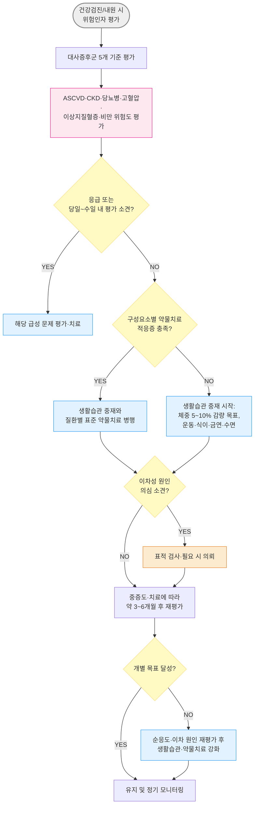

# 대사증후군 Metabolic Syndrome

## <mark style="color:green;">일반 사항</mark>

* 2형 당뇨병, 심혈관 질환, 뇌졸중, 지방간 등의 위험을 증가시키는 대사 이상들의 묶음(cluster)
* 다른 이름 : insulin resistance syndrome, syndrome X
* 유병률 : 19세 이상의 21.5%, 30세 이상의 25.7%, 65세 이상의 39.0%; 남성의 28.5%, 여성의 14.3%(남성이 여성의 약 2배) \[국민건강영양조사 제9기, 2022\~2024; 한국 대사증후군 팩트시트 2026]
  * 제8기(2019\~2021)의 24.9%에서 제9기 21.5%로 감소했으나 성별 격차는 확대됨
  * 남성은 50\~60대에 유병률이 정점에 이르고, 여성은 폐경 이후 연령이 증가할수록 빠르게 상승하는 양상
* 국내 10년 추적 자료에서 대사증후군은 보정 후 전체 사망 위험 15%, 심뇌혈관질환 발생 위험 77% 증가와 연관 \[한국 대사증후군 팩트시트 2026]

**대사증후군과 CKM 증후군(Cardiovascular-Kidney-Metabolic Syndrome)**

* 미국심장협회(AHA)는 비만·대사이상·만성신질환·심혈관질환을 하나의 연속된 병태생리 스펙트럼으로 보는 CKM 증후군 개념을 제시했고(2023년), 2026년 6월 AHA/ACC/ADA/ASN 공동 임상진료지침이 발표됨
* CKM은 Stage 0(위험인자 없음)부터 Stage 4(임상적 심혈관질환)까지 분류하며, 조기 단계에서 체중·혈압·지질·혈당·신장 위험을 함께 평가하고 치료하는 것을 강조
* 전통적 대사증후군 5항목은 심혈관 위험을 알리는 실무적 도구로 유용하지만 CKM 단계와 일대일로 대응하지 않음. 대사증후군 환자도 CKD, 무증상 또는 임상적 심혈관질환, 예측 위험도에 따라 CKM Stage 2\~4에 분포할 수 있음

<table><thead><tr><th width="110">CKM Stage</th><th>정의</th><th>대사증후군과의 관계</th></tr></thead><tbody><tr><td>Stage 0</td><td>과체중·비만, 대사 위험인자, CKD, 심혈관질환이 없음</td><td>대사증후군에 해당하지 않음</td></tr><tr><td>Stage 1</td><td>과체중·비만 또는 기능 이상 지방조직이 있으나 다른 대사 위험인자나 CKD는 없음</td><td>복부비만만 있을 수 있으나 대사증후군 기준은 충족하지 않음</td></tr><tr><td>Stage 2</td><td>고혈압·고중성지방혈증·당뇨병 등의 대사 위험인자 또는 CKD가 있으나 임상적 심혈관질환은 없음</td><td>대사증후군은 대개 이 단계 이상에 해당하지만, 5항목 중 3개 충족이 Stage 2의 필수조건은 아님</td></tr><tr><td>Stage 3</td><td>무증상 심혈관질환 또는 높은 예측 심혈관 위험·고위험 CKD</td><td>대사증후군 유무와 별도로 무증상 심혈관질환·전체 위험도로 판정</td></tr><tr><td>Stage 4</td><td>임상적 심혈관질환 동반</td><td>대사증후군 동반 여부와 관계없이 임상적 심혈관질환이 있으면 해당</td></tr></tbody></table>


**"대사증후군은 위험 표지(risk marker)이다"** 대사증후군은 그 자체가 단일 약물의 치료 대상이라기보다 심혈관·신장·대사 위험이 증가했음을 알리는 위험 표지로 이해하는 것이 적절하며, 실제 치료는 혈압·지질·혈당·체중 등 개별 위험 인자의 적극적인 조절에 초점을 둠


### <mark style="color:orange;">병태생리</mark>

* intra-abdominal & visceral adipose tissue 증가
* adipose tissue dysfunction, insulin resistance; leptin resistance가 병태생리적 기전으로 제시되나 임상적 진단 도구는 아직 없음
* adipose tissue inflammation 및 ectopic fat deposition(간, 췌장, 골격근 등에 이소성 지방 축적)
* adiponectin(2형 당뇨병, 고혈압, 죽상경화증 등으로부터의 보호 인자) 감소
* 지방산 대사 이상, 혈관내피 기능이상, 전신 염증(IL-6, TNF-α, resistin, CRP↑), 산화 스트레스, renin-angiotensin system 활성화, prothrombotic state(plasminogen activator inhibitor-1↑)

## <mark style="color:green;">원인 및 위험 인자</mark>

* 중심 비만, 인슐린 저항성
* 고령, 폐경기
* 유전, 가족력(대사증후군, 당뇨병, 심혈관 질환)
* 소아기 비만
* 고칼로리 식사, 설탕 가미 음료 섭취
* 낮은 사회 경제적 상태
* 음주, 흡연, 신체 비활동, 수면 부족·수면 장애
* 약물 : glucocorticoid, 일부 비정형 항정신병제 등; β-blocker·thiazide계 이뇨제는 일부 대사 지표에 영향을 줄 수 있으나 명확한 심혈관 적응증이 있으면 임의로 중단하지 않음
* pro-inflammatory state, 장내 미생물총 변화

### <mark style="color:orange;">관련 질환</mark>

* MASLD (대사이상지방간질환) : 대사증후군의 간(肝) 표현형이라 할 정도로 연관성이 큼
* OSA (폐쇄수면무호흡증) : 중심비만·인슐린저항성 및 대사증후군과 양방향으로 강하게 연관
* 고요산혈증/통풍 : 요산이 대사증후군 개별 구성 요소와 연동됨
* CKD : 대사증후군이 있으면 위험도가 유의하게 상승함. 단, eGFR·알부민뇨 포함 여부 등 CKD 정의에 따라 연관성 크기의 편차가 큼
* PCOS (다낭성난소증후군) : 가임기 여성에서 대사증후군 위험과 연관
* acanthosis nigricans : 인슐린저항성을 시사하는 임상 표지
* 발기 장애 : 혈관내피기능이상 경로로 대사증후군과 연관될 수 있음
* 담석증 : 비만·이상지질혈증 경로로 연관
* 우울·인지 장애 : 연관성이 있으나 인과관계는 명확하지 않음
* 무증상 갑상선저하증·Vit D 결핍 : 관찰 연구상 연관성이 보고되나 인과관계와 치료 효과의 근거는 제한적임

## <mark style="color:green;">임상 양상</mark>

* 대부분 무증상이며 건강검진의 허리둘레·혈압·혈액검사에서 우연히 발견되는 경우가 많음
* 중심 비만의 신체 소견 : 허리둘레 증가, 목·겨드랑이 등의 acanthosis nigricans(인슐린 저항성 시사)
* 관련 질환의 증상이 먼저 나타나기도 함 : 코골이·주간 졸림(OSA), 여성에서 월경 불순·다모증(PCOS), 관절통(고요산혈증/통풍)
* 진행 시 2형 당뇨병, 관상동맥질환, 뇌졸중 등으로 발현 가능

### <mark style="color:$danger;">🚩 Red Flags!</mark>

<mark style="color:$danger;">**즉각 조치 또는 의뢰**</mark>

* 급성 흉통, 심한 호흡곤란, 실신 또는 혈역학적 불안정 → 급성 관상동맥증후군·급성 심부전·폐색전증 등 응급 심폐질환 평가
* 편측 위약감, 언어 장애, 갑작스러운 시야 장애 → 급성 뇌졸중
* 반복 측정한 혈압 ≥180/120 ㎜Hg + 흉통·호흡곤란·신경학적 이상·시야 이상·의식 변화·급성 신기능 저하 등 → 고혈압응급증 평가
* 심한 다뇨·다음과 함께 탈수, 구토, 복통, Kussmaul 호흡 또는 의식 변화 → 당뇨병성 케톤산증·고삼투압성 고혈당상태 평가
* 새로 발생한 심한 상복부 통증·지속적인 구토 → 급성 췌장염 등 급성 복증 평가; TG ≥1,000 ㎎/㎗이면 고중성지방혈증성 췌장염을 강하게 의심

<mark style="color:$warning;">**당일~수일 내 평가**</mark>

* 반복 측정한 혈압 ≥180/120 ㎜Hg이나 급성 표적장기 손상 증후는 없는 경우 → 복약 순응도·유발 요인 확인, 신속한 외래 평가 및 치료 조정
* 현저한 고혈당과 다뇨·다음·체중 감소가 있으나 고혈당 위기 소견은 없는 경우 → 당뇨병 확인 및 조기 치료
* TG ≥500 ㎎/㎗ → 금주, 식이 교정, 이차성 원인 평가 및 췌장염 예방을 위한 적극적 치료
* LDL-C ≥190 ㎎/㎗ → 가족성 고콜레스테롤혈증과 이차성 원인 평가 및 신속한 치료 시작
* 급속한 체중 증가, 넓은 자색 선조, 근위부 근력 저하 등 → 쿠싱증후군 등 이차성 원인 평가

<mark style="color:$info;">**외래 추적 / 추가 평가 계획**</mark> <mark style="color:$info;">- 즉각 위험 낮으나 호전 없으면 의뢰</mark>

* 코골이 + 수면 중 무호흡 목격 + 주간 졸림 → OSA 선별 및 계획된 수면 평가
* 경계역 혈압·공복혈당·지질 이상 또는 대사증후군 구성요소 1\~2개 → 생활습관 중재와 정기 재평가
* 적절한 생활습관·약물 치료 후에도 체중·혈압·지질·혈당 목표 미달성

## <mark style="color:green;">진단</mark>

* 진단 : 다음 5개 항목 중 ≥3개 해당(NCEP-ATP III 개정안 + 대한비만학회 한국인 복부비만 기준)

<table><thead><tr><th width="143.80950927734375">항목</th><th>기준</th></tr></thead><tbody><tr><td>중심 비만</td><td>허리둘레 남성 ≥90 ㎝, 여성 ≥85 ㎝</td></tr><tr><td>높은 중성지방</td><td>≥150 ㎎/㎗ 또는 이에 대한 약물 치료 중</td></tr><tr><td>낮은 HDL-C</td><td>남성 &#x3C;40 ㎎/㎗, 여성 &#x3C;50 ㎎/㎗ 또는 이에 대한 약물 치료 중</td></tr><tr><td>높은 혈압</td><td>SBP ≥130 ㎜Hg 또는 DBP ≥85 ㎜Hg 또는 고혈압 약물 치료 중</td></tr><tr><td>높은 혈당</td><td>공복혈당 ≥100 ㎎/㎗ 또는 혈당강하제 치료 중</td></tr></tbody></table>

* 허리둘레는 양발을 모으고 서서 숨을 편안히 내쉰 상태에서 마지막 늑골 하단과 장골능 상단의 중간 지점을 바닥과 수평으로 측정
* HbA1c는 당뇨병전단계·당뇨병 평가에 유용하지만 대사증후군 5항목의 공식 판정 기준인 공복혈당을 대체하지 않음
* 기본 평가
  * 병력 : 흡연·음주, 식사, 신체 활동, 수면, 약물, 가족력, 심혈관질환 병력
  * 신체 : 허리둘레, BMI, 표준화된 진료실 혈압; 필요 시 가정혈압 또는 활동혈압으로 확인
  * 검사 : 공복혈당 ± HbA1c, 공복 지질검사(LDL-C·non-HDL-C 포함), AST·ALT, creatinine/eGFR, UACR
  * MASLD 고위험군(특히 제2형 당뇨병 또는 비만과 추가 대사 위험인자)에서는 간효소 정상 여부만으로 배제하지 말고 AST·ALT·혈소판을 이용한 FIB-4 등 섬유화 위험 평가 고려
  * 요산은 통풍·CKD·요산 상승 약물 사용 등 임상 적응증에 따라 선택적으로 검사
* 대사증후군 진단과 별도로 ASCVD, CKD, 당뇨병, 고혈압 및 이상지질혈증의 진단·위험도·표적장기 손상을 평가

### <mark style="color:orange;">감별</mark>

* 중심 비만·대사 이상을 유발하거나 악화시키는 이차성 원인은 임상적으로 의심될 때 표적 검사

<table><thead><tr><th width="123.33331298828125">질환</th><th width="282.8570556640625">대사증후군과의 차이점</th><th>핵심 감별 포인트</th></tr></thead><tbody><tr><td>쿠싱증후군</td><td>중심 비만·고혈압·고혈당이 코티솔 과잉에 기인</td><td>넓은 자색 선조, 근위부 근력 저하, 쉽게 멍듦, 다혈성 안면 → 1 ㎎ overnight dexamethasone 억제검사, 24시간 요중 유리코티솔 또는 야간 타액 코티솔 중 적절한 검사</td></tr><tr><td>갑상선저하증</td><td>체중 증가·이상지질혈증이 갑상선호르몬 저하에 기인</td><td>피로, 서맥, 부종 등 임상적 의심 → TSH ± free T4</td></tr><tr><td>PCOS</td><td>인슐린 저항성이 흔히 동반되나 배란장애·고안드로겐증이 핵심</td><td>월경 불순, 다모증, 여드름 → 다른 원인 배제 후 진단 기준에 따라 평가; 모든 환자에서 초음파가 필수는 아님</td></tr><tr><td>약물 유발</td><td>glucocorticoid, 일부 비정형 항정신병제 등으로 대사 이상 발생·악화</td><td>약물 복용력, 치료 전후 체중·혈압·혈당·지질 변화 확인; 원 적응증과 위험·이익을 고려해 대체 약제 검토</td></tr></tbody></table>


```mermaid
graph TD
    Start(["건강검진/내원 시 <br/>위험인자 평가"]) --> Criteria["대사증후군 5개 기준 평가"]
    Criteria --> Risk["ASCVD·CKD·당뇨병·고혈압·<br/>이상지질혈증·비만 위험도 평가"]
    Risk --> Severity{"응급 또는 <br/>당일~수일 내 평가 소견?"}
    Severity -- "YES" --> Urgent["해당 급성 문제 평가·치료"]
    Severity -- "NO" --> Indication{"구성요소별 약물치료 <br/>적응증 충족?"}
    Indication -- "YES" --> Combined["생활습관 중재와 <br/>질환별 표준 약물치료 병행"]
    Indication -- "NO" --> Lifestyle["생활습관 중재 시작:<br/>체중 5~10% 감량 목표,<br/>운동·식이·금연·수면"]
    Combined --> Secondary{"이차성 원인 <br/>의심 소견?"}
    Lifestyle --> Secondary
    Secondary -- "YES" --> Workup["표적 검사·필요 시 의뢰"]
    Secondary -- "NO" --> Reassess["중증도·치료에 따라 <br/>약 3~6개월 후 재평가"]
    Workup --> Reassess
    Reassess --> Goal{"개별 목표 달성?"}
    Goal -- "YES" --> Maintain["유지 및 정기 모니터링"]
    Goal -- "NO" --> Intensify["순응도·이차 원인 재평가 후 <br/>생활습관·약물치료 강화"]
    Intensify --> Maintain
style Start fill:#eeeeee,stroke:#888888,stroke-width:2px
classDef yellow fill:#fff9c4,stroke:#ffe082
class Severity,Indication,Secondary,Goal yellow
classDef sky fill:#e3f2ff,stroke:#2196f3
class Urgent,Combined,Lifestyle,Intensify sky
style Risk fill:#fde8f0,stroke:#e91e8c
style Workup fill:#fdebd0,stroke:#e67e22
```

<p align="center"><strong>대사증후군 진단 및 치료 알고리듬</strong></p>

<p align="center"><em><mark style="color:$info;">저자 재구성(참고 문헌: NCEP-ATP III 개정안; AHA/ACC/ADA/ASN CKM Syndrome Guideline 2026)</mark></em></p>

***

## <mark style="background-color:$warning;">Management</mark>

### <mark style="color:orange;">치료 방침</mark>

* 생활습관 개선은 모든 단계의 치료 기반이며, 개별 위험 인자의 약물치료 적응증을 동시에 평가
* 고혈압·당뇨병·이상지질혈증·CKD·비만이 각각의 치료 적응증을 충족하면 생활습관 개선 결과를 3\~6개월 기다리지 않고 해당 질환의 표준 치료를 병행
* 과체중·비만에서는 초기 6개월 동안 현 체중의 5\~10% 감량을 목표로 하되, 동반 질환·기능 상태·치료 반응에 따라 추가 감량 목표를 개별화(☞ [비만](../230_/191_-obesity.md))
  * BMI ＜25 ㎏/㎡ 도달을 모든 환자의 필수 목표로 삼기보다, 달성 가능하고 지속 가능한 체중 감량과 허리둘레·대사 지표 개선을 우선


**단계별 치료 전략(Step-wise Approach)** : 생활습관 개선이 모든 치료의 근간이지만 약물치료가 필요한 고혈압·당뇨병·이상지질혈증·비만 등을 단순히 "대사증후군"이라는 이유로 지연하지 않음


## <mark style="color:green;">비-약물 치료 및 예방</mark>

* [금연](../230_/190_-smoking.md), 음주는 시작을 권하지 않으며 가능한 한 줄이거나 피하도록 권고(☞ [음주](../230_/189_-alcohol-use-disorder-aud.md))
* 신체 활동 : 주 150\~300분 중등 강도 또는 75\~150분 고강도 유산소 운동 + 주 2일 이상 근력 운동; 장시간 좌식 시간을 줄임(☞ [운동지침](../231_/216_-physical-activity-guideline.md))
* 식이 : 총열량과 식사 패턴을 개별화하고, 식이섬유·통곡물·채소·과일·콩류·견과류·생선·불포화지방을 늘림(☞ [식이지침](../231_/217_-nutritiondiet-guideline.md))
  * DASH diet, 지중해식 식단 등 지속 가능한 심장건강 식사 패턴 권장
  * 제한 : 소금(＜5 g/d)(☞ [고혈압](../225_/095_-hypertension.md#undefined-27)), 설탕 가미 음료·단순당, 포화지방·트랜스지방, 가공육·과도한 붉은 고기
  * 초가공식품(ultra-processed food) 섭취 제한
  * 칼륨이 풍부한 식품은 혈압 관리에 도움이 될 수 있으나 CKD·고칼륨혈증 위험에서는 개별화; Vit A/B/E 등 항산화 비타민 보충제를 대사증후군 치료 목적으로 일률적으로 권고할 근거는 부족

## <mark style="color:green;">약물 치료</mark>

### <mark style="color:orange;">비만</mark>

* 비만 약물치료 적응증을 충족하면 생활습관 중재와 함께 시작할 수 있으며, 사전에 반드시 3\~6개월의 생활습관 단독 치료를 요구하지 않음(☞ [비만](../230_/191_-obesity.md))
* semaglutide는 GLP-1 수용체 작용제, tirzepatide는 GIP/GLP-1 이중 수용체 작용제임. 체중 감량 효과와 심혈관·신장 이익은 약제별 허가 적응증과 근거가 확인된 환자군에 따라 판단
* 국내 허가·보험 기준, 금기와 중단 후 체중 재증가 가능성을 처방 전 확인

### <mark style="color:orange;">고혈압</mark>

* 목표 혈압 : 일반적으로 ＜140/90 ㎜Hg; 당뇨병·CKD·심혈관 질환·뇌졸중이 동반된 고위험군은 치료 내약성을 고려해 ＜130/80 ㎜Hg으로 더 엄격하게 관리 \[대한고혈압학회 2026] (☞ [고혈압](../225_/095_-hypertension.md))

### <mark style="color:orange;">이상지질혈증</mark>

* 대사증후군 자체만으로 LDL-C 치료 목표를 정하지 않으며, ASCVD·당뇨병·CKD와 전체 위험도에 따라 위험군별 LDL-C 목표 및 스타틴 강도를 결정(☞ [이상지질혈증](../225_/099_-dyslipidemia.md))
* TG 150\~499 ㎎/㎗ : 체중 감량, 운동, 음주·정제 탄수화물 제한, 당뇨병·갑상선저하증·약물 등 이차성 원인 교정 및 ASCVD 위험에 따른 스타틴 치료가 우선
* TG ≥500 ㎎/㎗ : 췌장염 예방을 위해 매우 저지방식, 금주, 이차성 원인 교정과 함께 fibrate 또는 처방용 omega-3 fatty acid 등을 고려; TG ≥1,000 ㎎/㎗에서 췌장염 위험이 특히 높음

### <mark style="color:orange;">당뇨병, 공복혈당장애</mark>

* 생활습관 교정과 체중 감량이 우선(☞ [당뇨병](100_-diabetes-mellitus.md#management))
* ADA 2026은 25\~59세, BMI ≥35 ㎏/㎡, 공복혈당 ≥110 ㎎/㎗, HbA1c ≥6.0% 또는 과거 임신성 당뇨병 병력 등 진행 위험이 특히 높은 당뇨병전단계에서 metformin을 고려하도록 권고
  * metformin <mark style="color:blue;">[다이아벡스]</mark>을 당뇨병전단계의 당뇨병 예방 목적으로 사용하는 것은 국내 허가 외 사용
  * 장기 복용 시 특히 빈혈·말초신경병증이 있으면 Vit B12 결핍을 주기적으로 평가

### <mark style="color:orange;">기타</mark>

* 저용량 aspirin : 대사증후군만을 이유로 일차예방에 일률적으로 사용하지 않음. 연령·심혈관 위험·출혈 위험을 함께 평가하여 제한적으로 고려
  * 관상동맥질환, 허혈성뇌졸중 등 확진된 죽상경화성 심혈관질환의 이차예방에서는 질환별 항혈전 지침을 적용(☞ [항혈전제](../231_/214_-anti-thrombotics-anti-coagulants.md))

***

### <mark style="color:red;">질병코드</mark>

E88.8 기타 명시된 대사장애 – Other specified metabolic disorders

* KCD에는 대사증후군만을 위한 독립 세부코드가 없으므로 E88.8을 사용할 수 있음. E88.9 상세불명의 대사장애 – Metabolic disorder, unspecified는 대사장애가 구체화되지 않은 경우에 제한
* 고혈압·당뇨병·이상지질혈증·비만 등 동반 질환은 실제 진단 기준을 충족하고 진료한 경우에만 각각의 코드를 추가

***

## <mark style="color:purple;">처방례</mark>

> **처방례 1. 경계역 혈압 상승, 저위험군**
>
> ```
> 생활습관 개선(체중 감량, 저염식, 운동) 우선; 가정혈압 측정 후 약 3개월 이내 재평가
> ```
>
> _✽당뇨병·CKD·심혈관질환 등 고위험 동반 질환이 없고 SBP 130\~139 또는 DBP 85\~89 ㎜Hg인 경우. 반복 측정 또는 가정혈압으로 확인하고 전체 심혈관 위험도에 따라 치료 시점을 개별화_

> **처방례 2. 스타틴 치료 적응증이 있는 이상지질혈증 동반**
>
> ```
> 아토르바스타틴 10 ㎎/T  1T  qd  매일 일정한 시간
> ```
>
> _✽대사증후군 또는 LDL-C ≥100 ㎎/㎗만으로 일률적으로 처방하지 않으며, ASCVD·당뇨병·CKD·LDL-C ≥190 ㎎/㎗ 및 전체 위험도에 따라 적응증과 강도를 결정. 시작 또는 용량 변경 4\~12주 후 지질 재검_

> **처방례 3. 진행 위험이 특히 높은 당뇨병전단계**
>
> ```
> 다이아벡스 500 ㎎/T  1T  qd  저녁 식사 직후(1~2주 후 1T bid로 증량 고려)
> ※ 당뇨병전단계의 당뇨병 예방 목적은 국내 허가 외 사용
> ※ 위장관 부작용(설사, 복통 등)을 줄이기 위해 1~2주 간격으로 서서히 증량
> ※ eGFR <30 ㎖/min/1.73㎡에서는 금기
> ```
>
> _✽25\~59세, BMI ≥35 ㎏/㎡, 공복혈당 ≥110 ㎎/㎗, HbA1c ≥6.0% 또는 과거 임신성 당뇨병 병력 등 진행 위험이 특히 높은 당뇨병전단계에서 생활습관 중재와 함께 고려(ADA 2026)_

> **처방례 4. 비만 동반**
>
> ```
> 생활습관 중재와 함께 BMI·동반 질환·금기·환자 선호에 따라 비만 약물치료 고려
> ※ 약제별 저용량부터 시작하여 서서히 증량; 위장관 부작용(오심, 구토) 등 모니터링
> ※ 국내 허가·보험 적용 여부는 최신 고시 확인
> ```
>
> _✽적응증을 충족하면 생활습관 단독 치료를 3\~6개월 먼저 시행할 필요는 없으며, 약제 선택과 증량법은_ [_비만_](../230_/191_-obesity.md) _챕터 참조_

***

## <mark style="color:$success;">핵심 복약 지도</mark>

> **생활습관 개선은 모든 치료의 기반입니다**
>
> * 대사증후군 자체를 목표로 하는 단일 약물은 없으며, 개별 위험 인자(고혈압·이상지질혈증·고혈당·비만)가 각각의 치료 적응증을 충족하면 해당 표준 치료를 적용
> * 과체중·비만에서는 체중의 5\~10% 감량만으로도 혈압·혈당·지질이 함께 개선될 수 있으며, 달성 가능하고 유지할 수 있는 목표를 단계적으로 설정

> **약물 복용 시 주의사항**
>
> * 스타틴과 fibrate 병용 시 근육병증 위험이 증가하며 특히 gemfibrozil 병용을 피함. 설명되지 않는 근육통·근력 저하 또는 진한 소변이 나타나면 즉시 보고하고 의료진이 CK 등을 평가
> * metformin 복용 중 조영검사가 예정되면 임의로 중단하지 말고 검사기관에 복용 사실과 신기능을 알림. AKI, eGFR ＜30 ㎖/min/1.73㎡ 또는 일부 동맥 내 조영술에서는 일시 중단이 필요할 수 있음

> **정기 모니터링**
>
> * 초기 치료 중에는 대개 3\~6개월 간격으로 체중·허리둘레·혈압·혈당·지질을 평가하되, 이상 정도와 치료에 따라 간격을 개별화
> * 신기능은 eGFR과 UACR로 평가하고, MASLD 고위험군은 FIB-4 등 섬유화 위험 평가를 고려; 요산은 임상 적응증에 따라 확인

> **언제 다시 병원을 방문해야 하나요?**
>
> * 정한 기간 내에 체중·혈압·혈당·지질 목표에 도달하지 못하거나 약물 부작용이 의심되는 경우
> * 혈압이 **180/120 ㎜Hg 이상**이면서 흉통·호흡곤란·신경학적 이상·시야 이상·의식 변화 등이 동반되는 경우 - 즉시 내원
> * 갑작스러운 심한 상복부 통증이나 지속적인 구토가 생기는 경우 - 즉시 내원
> * 다뇨·다음·체중 감소 등 새로운 고혈당 증상이 나타나는 경우

***

## <mark style="color:blue;">환자 안내서</mark>


**대사증후군, 여러 위험 신호가 한꺼번에 나타난 상태입니다**

대사증후군은 복부 비만, 높은 혈압·혈당·중성지방, 낮은 HDL 콜레스테롤 가운데 세 가지 이상이 함께 나타난 상태입니다. 당장 큰 증상이 없더라도 방치하면 당뇨병이나 심근경색, 뇌졸중, 콩팥병 위험이 커질 수 있습니다.


#### <mark style="color:$primary;">왜 대사증후군이 생기나요?</mark>

* 내장 지방이 늘어나면 우리 몸이 인슐린에 잘 반응하지 않게 되고(인슐린 저항성), 혈압·혈당·중성지방과 HDL 콜레스테롤이 함께 나빠질 수 있습니다
* 고칼로리 식사, 운동 부족, 흡연·음주, 수면 부족, 스트레스, 유전적 소인 등이 함께 작용합니다

#### <mark style="color:$primary;">일상생활에서 어떻게 관리하나요?</mark>

* **과체중·비만이라면 현재 체중의 5\~10% 감량을 첫 목표로 삼으십시오.** 혈압·혈당·지질이 함께 좋아질 수 있으며, 무리한 단기 감량보다 유지 가능한 변화가 중요합니다
* **빠르게 걷기 등 중등 강도 유산소 운동을 일주일에 150분 이상 하고, 주 2회 이상 근력 운동을 병행하십시오.**
* **채소, 통곡물, 콩류, 견과류, 생선 위주로 먹고 짠 음식, 단 음료, 가공육과 초가공식품은 줄이십시오.**
* **금연하십시오. 술은 가능하면 피하거나 줄이십시오.** 특히 중성지방이 매우 높으면 금주가 필요합니다

#### <mark style="color:$primary;">약은 어떻게 써야 하나요?</mark>

* 대사증후군 자체를 한 번에 치료하는 약은 없습니다. 혈압약, 콜레스테롤약, 당뇨약, 비만 치료제 등은 각 수치와 전체 위험도를 평가하여 처방합니다
* 처방받은 약은 임의로 중단하지 말고 정해진 방법대로 꾸준히 복용하십시오

#### <mark style="color:$primary;">이럴 때는 즉시 병원을 방문하세요</mark>

* 갑작스러운 가슴 통증이나 숨이 심하게 찬 경우
* 몸의 한쪽이 갑자기 힘이 빠지거나 말이 어눌해지는 경우
* 혈압이 180/120 ㎜Hg 이상이면서 가슴 통증, 호흡곤란, 신경학적 이상, 시야 이상 또는 의식 변화가 동반되는 경우
* 갑작스러운 심한 상복부 통증이나 지속적인 구토가 생기는 경우
