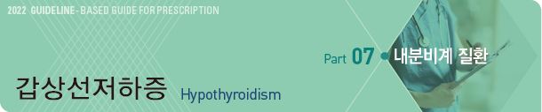
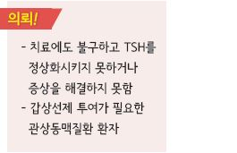
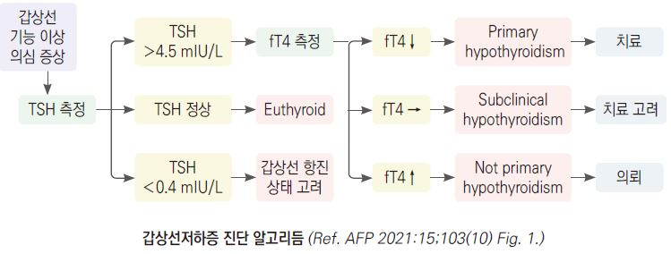
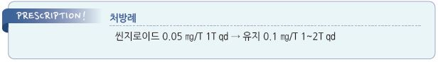

# 갑상선저하증 Hypothyroidism



## 일반 사항

* 갑상선 호르몬 감소 또는 호르몬에 대한 저항에 의해 발생하는 대사 이상 상태
* 무증상\~(치료하지 않으면) myxedema coma까지 다양한 수준의 증상을 보임
* 경과 : Hashimoto 갑상선염에 의한 경증 저하증의 회복률- 11%; 치료 중단 후 재발할 수 있음
* 유병률 : 일반 인구의 ＞1%, ＞60세의 5%

## 원인

1. 원발성(Primary) hypothyroidism : 대부분 해당(＞95%)

* chronic autoimmune hypothyroidism(Hashimoto’s thyroiditis; 가장 흔함)
* 의인성 : 갑상선 절제, 방사선 요오드 치료
* 요오드 결핍 또는 과잉
*   약물 : 갑상선항진증 치료제(propylthiouracil, methimazole), lithium, amiodarone, tyrosine kinase inhibitor,

    interleukin-2, interferon-α
* 침윤성 질환 : fibrous thyroiditis, hemochromatosis, sarcoidosis
*   thyroiditis : 항진증 후 저하증이 이어짐; subacute granulomatous thyroiditis, silent lymphocytic thyroiditis,

    postpartum thyroiditis (☞ p.583)
* 선천성 갑상선 무형성, 호르몬 합성 결핍

2. 중추성 hypothyroidism(드묾) : hypothalamic-pituitary 질환

* TSH deficiency, TRH deficiency

3. Generalized thyroid hormone resistance

### 위험 인자

* 여성(특히 ＞60세, 임신, 분만 후 갑상선염 병력), 고령
*   자가면역 질환 병력/가족력; 1형 당뇨병, 셀리악병, 자가면역 위축성 위염,

    multiple autoimmune endocrinopathies, RA
* 두경부 방사선 치료, 갑상선 기능 이상, 갑상선 수술 등의 과거력
* Down syndrome, Turner syndrome

임상 양상

* 피로, 무기력, 우울, 두통, 감각 이상, 추위 불내성, 운동 시 호흡 곤란, 관절통/근육통,
* 피부 건조, 얇은/부서지기 쉬운 손톱, 가늘어진 머리카락, 창백 또는 황색(carotenemia) 피부
* 체중 증가, 말초 부종, 부운 얼굴/눈꺼풀, 월경 과다, 변비, 근육 경련, 목소리 변화
* 서맥, 확장기 고혈압, 손목터널증후군, 레이노병, 심부 건반사 이완 반응 지연, 갑상선 비대(goiter)

## 진단

### 갑상선 호르몬 검사

* 기본 : TSH, free T4
* 필요시 total T4, total T3, free T3 (✽free or total T3로는 갑상선저하증을 진단하지 않음)
* 임신부를 포함하여 증상이 없는 사람에 대한 일률적인 선별 검사는 권하지 않음

#### 검사 결과에 영향을 주는 요인

* TSH↑ : 비-갑상선 질환의 회복기, 약물(예: dopamine 대항제, amiodarone)
*   TSH↓: 비갑상선 질환, chorionic gonadotropin↑(예: 임신 초기, molar pregnancy, choriocarcinoma),

    TSH 분비 억제 약물(고용량 dopamine(또는 agonist), dobutamine, steroid, octreotide
* s-TBG↓ 약물 (total T4↓ 유발) : androgen, danazol, steroid, nicotinic acid
* s-TBG↑ 약물 (total T4↑ 유발) : estrogen, tamoxifen, raloxifene, methadone, 5-fluorouracil
* T4-TBG 결합 방해 약물(free T4↑) : salicylate, salsalate, furosemide, heparin, NSAID

※TSH의 계절적 변이(1,2월에 최고,6\~8월에 최저)가 있으므로 TSH가 약간 상승하고 FT4가 정상 수준을 유지한다면

바로 갑상선저하증으로 진단하여 약물 처방하는 것을 보류하고 2\~3개월 후 추적 검사를 권고하는 연구 결과가 있음.

### 기타

*   anti-thyroperoxidase Ab(TPO Ab), anti-thyroglobulin Ab : autoimmune thyroiditis에서 높음;

    TSH가 크게 높거나 치료에 반응하지 않는 환자에 대하여 고려; 반복 검사는 필요 없음
* 영상 검사 : 보통 필요 없음; 종괴가 있을 때 고려
* 대사 이상 검사 : 동반될 수 있는 대사 이상에 대한 검사 고려; 저혈당, 빈혈, Na↓, 이상지질혈증
*   TSH가 정상이지만 증상이 지속될 때의 감별 진단 : 빈혈(Vit B12 or iron 결핍), 자가면역 질환, 신/간 질환,

    폐경기, 우울/불안, 감염

> **Management**

### 치료 방침

* 치료 목표 : 1차적으로 TSH 정상 참고치 유지; 0.5\~5 mIU/L; 80세- 7.5 mIU/L

> ```
> ✽고령에서는 TSH가 상승하며, 약간의 상승이 항상 임상적 의미를 갖는 것은 아님
> ```

* 식이 요법 : 권고하는 식이 요법은 없으며, 요오드 보충은 요오드 부족이 확인된 경우에만 고려



## 약물 치료

*   약물 치료 : 1차 선택- levothyroxine(T4)

    •T3 : T4 단독 투여로 조절되지 않는 환자에서 대체제로 선택 또는 병용

#### Levothyroxine (T4)

\*\* 용법\*\*

*   용량 : 저용량으로 시작(증상에 따라 결정)

    •＜60세 & 심장 질환(-) : 50~~100 ㎍ qd (1.5~~1.8 ㎍/㎏/d) \[씬지로이드]

    •≥60세 or 심장 질환(+) : 12.5\~50 ㎍ qd; 심장 질환이 있는 환자에 대해서는 TSH가 high-normal range로

    유지되도록 낮은 용량으로 시작

    • TSH를 기준으로 4~~6주마다 12.5~~25 ㎍/d 증량
*   공복 및 일정한 시간에 투여. 예) 아침 식전 30~~60분 또는 취침 전(마지막 식사 2~~4시간 후)

    •취침 전 투여 시 아침 투여보다 T4는 약간 높고 TSH는 낮아짐
* 갑상선제의 흡수를 방해하는 약제와는 4시간 분리하여 투여
*   T4 및 T3가 단백질과 결합하므로 혈중 단백질 수준에 영향 받음

    •혈중 단백질 수준이 낮은 경우에는 감량 : 간질환, 신증후군, 영양 결핍, 고령

    •혈중 단백질 수준이 증가하는 경우에는 증량

> ```
> ✽제조사마다 생물학적 동등성의 차이가 있을 수 있으므로 가능한 한 동일 제조사의 동일 제품을 사용
> ```

*   치료를 통하여 TSH를 정상 수준으로 유지하더라도 fT4는 높고 fT3는 낮을 수 있으며 이때 환자는 저하 증상을

    계속 느낄 수 있음. 이 경우 금기(예: 불안정 협심증)가 아니라면 fT3가 low-normal range에 도달하도록

    갑상선제를 증량할 수 있음
* 치료 중단 후 6주 이내 재개할 때에는 심장 문제 또는 체중 감소가 없으면 이전 용량으로 재개

**약제(T4) 요구량이 증가하는 상황**

* 임신, 체중 증가, 신증후군, 지속되는 갑상선 이상, 식이 섬유 섭취, 위장관 질환(약제 흡수 감소)
*   갑상선제 흡수 방해 : 두유, 셀리악병, IBD, 유당 불내증, H. pylori 감염, 위축성 위염, PPI, H2 차단제, sucralfate,

    Al, Mg, Ca, Fe, 종합 영양제, cholestyramine, colestipol, sertraline, resin, raloxifene, sevelamer, orlistat
*   T4→T3 전환 방해 : amiodarone, steroid, oral cholecystography 조영제(예: iopanoic acid), propylthiouracil,

    propranolol, nadolol
* s-TBG 증가 : estrogen, tamoxifen, raloxifene, methadone, 5-fluorouracil, clofibrate, heroin, mitotane
* T4 clearance 증가 : phenytoin, carbamazepine, rifampin, phenobarbital

\*\* 약제 요구량이 감소하는 상황\*\*

* 출산, 양측 난소 절제, 폐경/HRT 중단, GnRH 작용제 투여

\*\* 금기\*\*

* 급성 MI, thyrotoxic heart failure, 조절되지 않는 adrenocortical insufficiency

#### Triiodothyronine (T3)

* T3는 효과가 강력한 반면 작용 시간이 짧아 용량 조절이 어려워 일반적으로 권고하지 않음
* T4 단독 투여로 조절되지 않는 환자에서 대체제로 고려
* liothyronine \[테트로닌], levothyroxine/liothyronine 복합제 \[콤지로이드]

### 모니터링

*   치료 경과 : 치료 시작 1~~2주 내 T4의 유의미한 증가, 2~~3주 후 증상 호전, 6주 후 TSH 안정

    •TSH가 매우 높았거나 높은 상태에서 장기간 지속되었던 환자는 TSH 정상화에 6개월까지 소요될 수 있음
*   검사 일정(TSH, fT4) : 진단 초기 및 용량 변경 6(±2)주 후 검사 → 3개월마다 검사 → 2회 연속 참고치 내

    비슷한 수준으로 유지되면 → 6개월 후 및 매년
* 시작 용량에서 2\~3차례의 증량 or 200 ㎍/d에도 조절되지 않는 경우 재평가 또는 의뢰 고려
* 약물 복용 후에는 일시적으로 fT4가 상승하기 때문에 투약 중 추적 검사를 하는 경우에는 약물을 복용 전에 채혈함
* TSH↑ & fT4 →/↑의 해석 : 평소 복용이 일정하지 않다가 검사 전 수일 동안에만 제대로 복용했을 가능성이 있음
*   TSH가 성공적으로 조절됨에도 불구하고 갑상선저하증 증상이 지속되는 경우 total T3 또는 fT3 검사

    → s-T3가 낮은 경우 갑상선제(T4 또는 T4/T3 복합제) 투여량을 약간 늘린 후 F/U
*   갑자기 조절되지 않는 경우의 원인 : 약 복용 순응도 저하, (약제의 흡수를 방해하는) 음식과 함께 복용,

    약제 대사에 영향을 주는(T4 요구량이 증가하는) 상황 발생(예: 새로운 약물 복용 시작)

## 임신/수유 중 관리

* 시작 용량 : 75\~100 ㎍/d or 1.6 ㎍/㎏/d
*   임신 전부터 levothyroxine을 복용한 경우 20~~30% 증량을 고려 (✽임신 4~~5주째부터 levothyroxine 요구량이 증가함.

    증량 예) 평소 stable dose인 경우 주 2회 추가 복용하여 1주에 총 9회 복용)
* TPO Ab 양성이면서 TSH ＞2.5 mIU/L인 산모는 조산, 유산 등의 위험이 높음
* 모니터링 (TSH, total T4) : 임신 전반기 매달, 임신 26\~32주, 분만 6주 후
*   조절 목표 •TSH : 임신 1분기 2\~2.5 mIU/L, 2분기 ＜3.0 mIU/L, 3분기 ＜3.5 mIU/L

    •total T4 : 정상 범위
* 수유 중에도 levothyroxine 투여를 중단하지 않음
*   Postpartum thyroiditis : 출산 2~~6주 후에 갑상선 항진 증상 발생하여 2~~3개월 동안 지속된 후, 수개월 동안

    갑상선 저하 증상이 이어질 수 있음 (30%에서 갑상선저하증이 지속될 수 있음)

> **질병코드** E03 기타 갑상선기능저하증

E06 갑상선염

E89.0 처치후 갑상선기능저하증 질병코드



##

## ￭ 무증상 갑상선저하증 Subclinical (Mild) Hypothyroidism

*   TSH는 증가되었으나 fT4 및 hypothalamic-pituitary-thyroid axis는 정상으로, 갑상선 호르몬 저하 관련 증상이

    발생하지 않은 상태
* 피로, 우울증, 고지혈증 등의 징후가 나타날 수 있음
* ≥65세에서 흔함(유병률 13%)
* 선별 검사 : 권고 안 함; 무증상 환자에 대한 선별 검사와 치료가 예후를 향상시키는 근거가 없음

### 원인

* chronic autoimmune thyroiditis, subacute thyroiditis, postpartum thyroiditis, painless thyroiditis
* 갑상선 손상 : 부분 갑상선 절제, 경부 수술, 방사선 요오드 치료, 두경부 방사선 조사
*   갑상선 기능 저해 약물 : 요오드 및 함유 약물(예: amiodarone, 방사선 조영제, interferon-α, ethionamide,

    sulfonamide, sulfonylurea)
* 갑상선저하증의 불충분한/부적당한 치료
*   갑상선 침윤 : amyloidosis, sarcoidosis, hemochromatosis, Riedel’s thyroiditis, cystinosis, HIV 감염,

    primary thyroid lymphoma
* 직업/환경 독성 물질
* TSH 수용체 유전자 변이 : Gα gene mutation

### 경과

* 35%가 2년 내 정상화; antithyroid Ab가 없고 TSH 상승이 적은 경우에 정상화 가능성이 높음
* 10%가 3년 내 임상적 갑상선저하증으로 진행됨
* 50%가 anti-thyroid Ab(+)이며 이 경우에 추후 증상이 있는 갑상선저하증이 발생할 가능성이 보다 높음

### 치료

*   일률적 치료는 권고하지 않음

    •환자는 이미 적응된 상태이거나, TSH 상승이 연령 증가에 대한 보상 작용일 가능성이 있음

    •치료의 문제점 : 과잉 치료 시 심장 문제, 골다공증, 골절 위험을 증가시킬 수 있음. 고령에서는 치료가

    사망 위험을 높인다는 보고가 있음. 치료 시작 후에는 치료 종료 시점을 결정하기 어려움
* 치료 고려 대상 : TSH ＞10 mIU/L(이 상태에서는 대부분 증상이 나타나기 시작함)

#### 치료제

* levothyroxine : TSH 정도에 따라 25\~75 ㎍/d로 시작 \[씬지로이드]

### 모니터링

* 치료하지 않는 경우 매년 TFT 검사 권고
* anti-thyroid Ab의 일률적 검사는 권하지 않음
