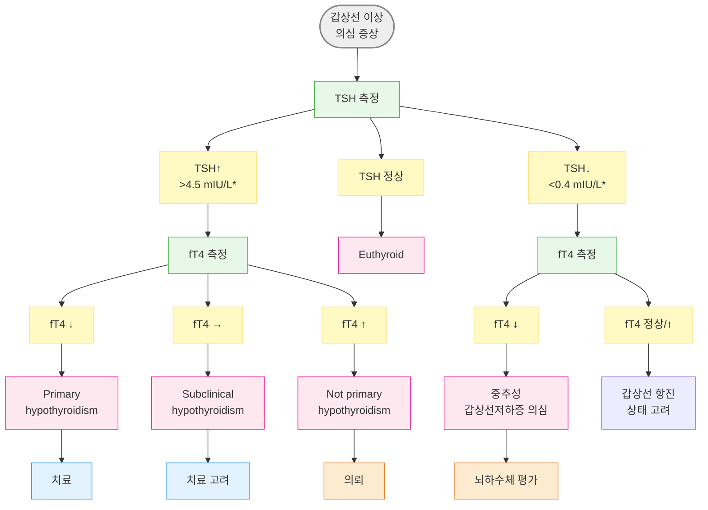
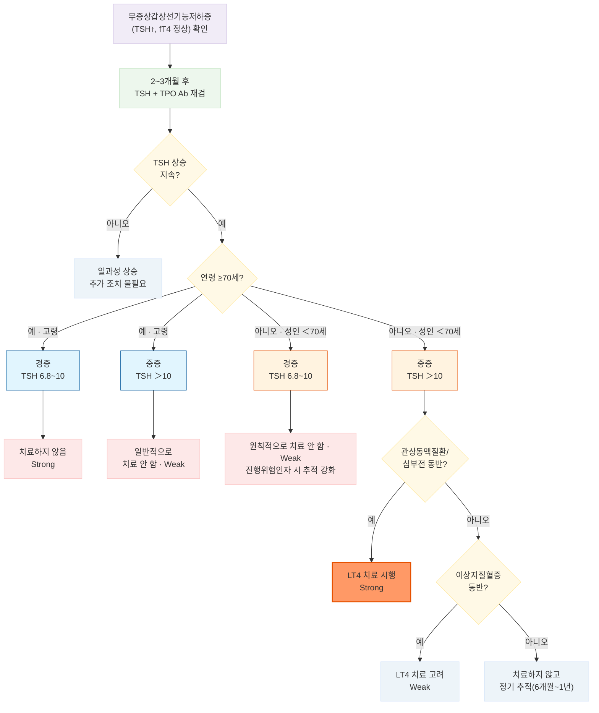

# 갑상선저하증 Hypothyroidism

## <mark style="color:green;">일반 사항</mark>

* 갑상선 호르몬 감소 또는 호르몬에 대한 말초 저항에 의해 발생하는 대사 이상 상태
* 스펙트럼 : 무증상(무증상 갑상선저하증) \~ 경증/현성 저하증 \~ (치료하지 않으면) myxedema coma까지 다양한 수준의 증상을 보임
* 유병률 : 일반 인구의 ＞1%, 60세 이상의 5%
* 경과 : Hashimoto 갑상선염에 의한 경증 저하증의 자연 회복률 - 11%
  * 치료 중단 후 재발할 수 있음
  * 대부분의 원발성 저하증(특히 만성 자가면역성, 갑상선 절제/방사성 요오드 치료)은 영구적이며 평생 호르몬 보충이 필요

## <mark style="color:green;">원인</mark>

* **원발성 갑상선저하증 (Primary hypothyroidism)** : 전체 갑상선저하증의 95% 이상 차지
  * chronic autoimmune thyroiditis (Hashimoto thyroiditis) - 가장 흔함
  * 의인성 : 갑상선 절제, 방사성 요오드 치료
  * 요오드 결핍 또는 과잉
  * 약물 : 갑상선항진증 치료제(propylthiouracil, methimazole), lithium, amiodarone, tyrosine kinase inhibitor, interleukin-2, interferon-α
  * 침윤성 질환 : fibrous thyroiditis, hemochromatosis, sarcoidosis
  * 일부 thyroiditis : subacute granulomatous thyroiditis, silent lymphocytic thyroiditis, postpartum thyroiditis - 일시적인 thyrotoxic phase 후 hypothyroid phase가 이어질 수 있음
  * 선천성 갑상선 무형성, 호르몬 합성 결핍
* **중추성 갑상선저하증 (Central hypothyroidism) :** hypothalamic-pituitary 질환에 의한 TRH/TSH 결핍; 드묾
* **Resistance to thyroid hormone β (RTHβ) :** 대부분 THRB 유전자 이상에 의한 갑상선 호르몬 수용체 저항(과거 "generalized thyroid hormone resistance"로 불림); 드묾

### <mark style="color:orange;">위험 인자</mark>

* 여성(특히 ＞60세, 임신, 분만 후 갑상선염 병력), 고령
* 자가면역 질환 병력/가족력 : 1형 당뇨병, 셀리악병, 자가면역 위축성 위염, multiple autoimmune endocrinopathies, RA
* 두경부 방사선 치료, 갑상선 기능 이상, 갑상선 수술 등의 과거력
* Down syndrome, Turner syndrome

## <mark style="color:green;">임상 양상</mark>

* 피로, 무기력, 우울, 두통, 감각 이상, 추위 불내성, 운동 시 호흡 곤란, 관절통/근육통
* 피부 건조, 얇은/부서지기 쉬운 손톱, 가늘어진 머리카락, 창백 또는 황색(carotenemia) 피부
* 체중 증가, 말초 부종, 부운 얼굴/눈꺼풀, 월경 과다, 변비, 근육 경련, 목소리 변화
* 서맥, 확장기 고혈압, 손목터널증후군, 레이노병, 심부 건반사 이완 반응 지연, 갑상선 비대(goiter)

### <mark style="color:$danger;">🚩 Red Flags!</mark>

<mark style="color:$danger;">**즉각 조치 또는 의뢰**</mark>

* 의식 저하/혼수, 저체온, 서맥, 저혈압, 저나트륨혈증, 저혈당 동반 → Myxedema coma
* 갑상선제 투여 중 흉통, 협심증 악화, 급성 부정맥 발생

<mark style="color:$warning;">**당일 또는 조기 의뢰**</mark>

* 관상동맥질환·불안정 협심증이 동반된 환자에서 갑상선제 시작/증량이 필요
* 뇌하수체/시상하부 질환 시사 소견, 다른 뇌하수체 호르몬 이상 동반 → 중추성 갑상선저하증
* 임신부에서 새로 진단된 갑상선저하증
* TSH가 현저히 높으면서(예: ＞100 mIU/L) 증상이 심함

<mark style="color:$info;">**외래 추적 / 추가 평가 계획**</mark> <mark style="color:$info;">- 즉각 위험 낮으나 호전 없으면 의뢰</mark>

* 치료에도 불구하고 TSH가 정상화되지 않거나 증상이 해결되지 않음
* 시작 용량에서 2\~3차례 증량하거나 200 ㎍/d에도 조절되지 않음

## <mark style="color:green;">진단</mark>

### <mark style="color:orange;">갑상선 호르몬 검사</mark>

* 기본 : TSH, free T4
* 필요시 total T4, total T3, free T3
  * [ ] free 또는 total T3만으로는 갑상선저하증을 진단하지 않음 - 갑상선 기능 저하 초기에는 T4→T3 전환이 보상적으로 증가해 T3가 정상으로 유지될 수 있고(민감도↓), 반대로 비갑상선질환증후군(sick euthyroid) 등 갑상선이 정상인 상태에서도 T3만 낮아질 수 있어(특이도↓) 진단 지표로는 부적합
* 임신부를 포함하여 증상이 없는 사람에 대한 일률적인 선별 검사는 권하지 않음 (USPSTF : 무증상 성인 선별의 이득·위해 균형에 대한 근거 불충분)

#### <mark style="color:$primary;">검사 결과에 영향을 주는 요인</mark>

<table><thead><tr><th width="240">검사 소견</th><th>영향 요인</th></tr></thead><tbody><tr><td>TSH↑</td><td>비-갑상선 질환의 회복기, 약물(dopamine 대항제, amiodarone)</td></tr><tr><td>TSH↓</td><td>비갑상선 질환, chorionic gonadotropin↑(임신 초기, molar pregnancy, choriocarcinoma), TSH 분비 억제 약물(고용량 dopamine 또는 agonist, dobutamine, steroid, octreotide)</td></tr><tr><td>s-TBG↓ (total T4↓ 유발)</td><td>androgen, danazol, steroid, nicotinic acid</td></tr><tr><td>s-TBG↑ (total T4↑ 유발)</td><td>estrogen, tamoxifen, raloxifene, methadone, 5-fluorouracil, clofibrate, heroin, mitotane</td></tr><tr><td>T4-TBG 결합 방해 (free T4↑)</td><td>salicylate, salsalate, furosemide, heparin, NSAID</td></tr><tr><td>TSH↓, free T4/T3↑ (위양성 가능)</td><td>biotin(비오틴) 복용 - 면역측정법(immunoassay) 간섭; 일반 함량(모발·피부 영양제 등) 복용 시 검사 최소 48시간(2일) 전 중단, 고용량(10 ㎎/일 이상) 복용 시에는 최소 7일 전 중단 권장</td></tr></tbody></table>

* TBG는 T4/T3 결합능의 약 70\~75%를 차지하는 주된 결합단백질로, 위 표의 약물 외에 질환·생리 상태에 의해서도 변동할 수 있음 (✽ transthyretin·albumin은 결합친화도가 낮아 total 수치에 미치는 영향이 미미함)
  * TBG를 저하시키는 상황(합성 감소) : 만성 간질환, 영양 결핍
  * TBG를 상승시키는 상황 : 임신·estrogen 노출(합성 증가), 급성 간염(일시적 분비 증가)
  * ✽신증후군은 TBG **합성이 줄어드는 것이 아니라 소변으로 소실**되는 기전으로, 위 두 경우와 달리 오히려 요구량을 **늘리는** 방향으로 작용함(☞ 아래 "T4 요구량이 증가하는 상황" 참고)


**TSH의 계절적 변이** : TSH는 계절에 따라 변동하므로(1\~2월에 최고, 6\~8월에 최저), TSH가 약간 상승하면서 fT4가 정상 범위이면 바로 갑상선저하증으로 진단하여 약물을 처방하기보다 2\~3개월 후 추적 검사를 고려할 수 있음\
✽비순응도, 비갑상선질환 회복기 등 TSH 상승의 다른 원인을 먼저 배제한 경우에 한하여 참고 - 계절 요인으로 쉽게 해석하지 않도록 주의


### <mark style="color:orange;">기타 검사</mark>

* anti-thyroperoxidase Ab(TPO Ab), anti-thyroglobulin Ab : autoimmune thyroiditis에서 상승. TSH가 크게 높거나 치료 반응이 불량한 환자에서 고려. 반복 검사는 불필요
  * [ ] TSH receptor Ab(TRAb)는 항진증·Graves병 감별에 활용하며 갑상선저하증 평가에는 필요하지 않음
* 영상 검사 : 보통 불필요; 종괴가 만져질 때 고려
* 동반 대사 이상 검사 고려 : 저혈당, 빈혈, Na↓, 이상지질혈증



<p align="center"><strong>갑상선저하증 진단 알고리듬</strong> <em><mark style="color:$info;">(Ref. AFP 2021;103(10):605-613, Fig. 1.)</mark></em></p>

_\*TSH 컷오프(4.5, 0.4 mIU/L)는 일반적 국제 기준값임. 우리나라 TSH 참고치는 0.6\~6.8 mIU/L로 제시되고 있음_

### <mark style="color:orange;">감별</mark>

* TSH가 정상이지만 증상이 지속될 때의 감별 : 빈혈(Vit B12 또는 iron 결핍), 자가면역 질환, 신질환/간질환, 폐경기, 우울/불안, 감염

#### <mark style="color:$primary;">중추성 갑상선저하증</mark>

* TSH가 낮거나 정상, 드물게 (생물학적 활성이 낮은 상태로) 약간 상승할 수도 있어 TSH만으로는 배제되지 않으며, free T4 저하를 기준으로 진단
* 두통·시야 결손 등 시상하부-뇌하수체 질환 시사 소견이나 다른 뇌하수체 호르몬 이상이 동반되면 의심&#x20;
* → 뇌하수체 MRI 및 타 뇌하수체 축(ACTH/cortisol, LH/FSH, prolactin, GH/IGF-1) 평가


**부신부전 동반 여부를 반드시 확인** : 뇌하수체·시상하부 질환에 의한 중추성 갑상선저하증에서는 이차성 부신피질기능저하증이 동반될 수 있음. 부신부전을 배제하거나 먼저 교정하지 않고 levothyroxine을 단독으로 시작하면 대사율이 증가하면서 부신 위기(adrenal crisis)를 유발할 수 있음 → 필요시 glucocorticoid를 levothyroxine과 동시에 시작하거나 우선 투여; 부신부전 평가는 오전 8\~9시 cortisol 측정을 우선 시행하고, 애매한 경우 ACTH 자극검사(cosyntropin test)로 확인


***

## <mark style="background-color:$warning;">Management</mark>

### <mark style="color:orange;">치료 방침</mark>

* 치료 목표 : TSH를 검사실 참고범위(reference range)로 유지 (✽ 일률적으로 특정 수치를 목표로 고정하기보다 참고치 범위를 기준으로 함)
  * 성인에서의 일반적인 목표치 : 대략 0.4\~4.0 mIU/L (검사기관·측정법에 따라 다를 수 있음); 이 titration 목표(0.4\~4.0 mIU/L)는 이미 약물 치료 중인 현성 갑상선저하증 환자의 적정 조절 기준이며, 한국인 진단 상한(6.8 mIU/L)과는 별개의 개념임 - 미치료 상태에서 무증상 갑상선저하증을 "진단"하는 기준과, 이미 치료 중인 환자의 TSH를 "조절"하는 목표는 다를 수 있음
  * 고령에서는 TSH가 생리적으로 상승하는 경향이 있어, ≥80세는 상한을 \~7.5 mIU/L까지 허용하기도 함 (✽ 약간의 상승이 항상 임상적 의미를 갖는 것은 아님)
* 식이 요법 : 별도로 권고되는 식이 요법은 없으며, 요오드 보충은 요오드 결핍이 확인된 경우에만 고려

## <mark style="color:green;">약물 치료</mark>

* 1차 선택 : levothyroxine (T4)
  * liothyronine(T3) : levothyroxine 단독 투여로 조절되지 않는 환자에서 대체제 또는 병용 고려

#### <mark style="color:$primary;">Levothyroxine (T4)</mark>

<mark style="color:cyan;">**용법**</mark>

* 용량 : 저용량으로 시작 (연령·심장 질환 여부에 따라 결정)
  * ＜60세 & 심장 질환(-) : 1.6 ㎍/㎏/d (약 1.5\~1.8 ㎍/㎏/d), 통상 50\~100 ㎍ qd로 시작 <mark style="color:blue;">\[씬지로이드]</mark>
    * [ ] 체중에 기반하여 용량를 계산하고 반올림하여 정제 단위에 맞춰 처방할 수도 있음
  * ≥60세 or 심장 질환(+) : 저용량(12.5\~50 ㎍ qd)으로 시작
    * 심장 질환 동반 환자는 TSH가 high-normal range로 유지되도록 낮은 용량으로 시작
  * TSH를 기준으로 4\~6주마다 12.5\~25 ㎍/d씩 증량
  * 치료 중단 후 6주 이내 재개할 때는 심장 문제·체중 감소가 없으면 이전 용량으로 재개
* 공복 및 일정한 시간에 투여 : 예) 아침 식전 30\~60분 또는 취침 전(마지막 식사 2\~4시간 후)
  * [ ] 취침 전 복용 시 아침 복용보다 T4가 약간 높고 TSH가 낮아지는 경향이 있는 것으로 보고됨 - 수면 중에는 공복 상태가 자연히 유지되어 커피·음식·칼슘제 등 흡수 저해 요인이 적고, 야간 위장관 운동 저하로 약물-점막 접촉 시간이 길어져 약물 흡수가 증가하기 때문으로 추정
* 흡수를 방해하는 약제와는 4시간 이상 분리하여 투여; 커피는 약제 복용 최소 30\~60분 경과 후 음용
* 제조사마다 약효 차이가 있을 수 있으므로 가급적 동일 제조사·동일 제품 유지; 제품 변경 시 6주 후 TSH 재검
* PPI 장기 복용, 위축성 위염, 위 절제/우회술 등 흡수 장애가 확인되거나 의심되는 환자에서는 액상(liquid) 또는 연질캡슐(soft-gel) 제형이 흡수에 도움이 될 수 있음(정제보다 부형제의 영향을 덜 받음) - 국내 유통 제품 없음
* T4 및 T3는 혈중에서 TBG 등결합단백질과 결합한 상태로 순환하므로 TBG 농도 변화가 total T4/T3에 영향(free T4·TSH는 대개 보상되어 유지)
  * TBG를 저하시키는 상황에서 감량, TBG를 상승시키는 상황에서 증량 고려(☞ [진단 검사](105_-hypothyroidism.md#undefined-6))
* 고령에서의 감량 고려는 TBG 변화가 아니라 약물 청소율(clearance) 감소 및 체표면적 감소가 주된 기전임

<mark style="color:cyan;">**T4 요구량이 증가하는 상황**</mark>

* 임신, 체중 증가, 신증후군, 지속되는 갑상선 이상, 식이 섬유 섭취 증가, 위장관 질환(흡수 감소)
* 흡수 방해 : 두유, 셀리악병, IBD, 유당 불내증, H. pylori 감염, 위축성 위염, PPI, H2 차단제, sucralfate, Al/Mg/Ca/Fe 제제, 종합 영양제, cholestyramine, colestipol, sertraline, resin, raloxifene, sevelamer, orlistat
* T4→T3 전환 방해 : amiodarone, steroid, oral cholecystography 조영제(예 : iopanoic acid), propylthiouracil, propranolol, nadolol
* s-TBG 증가 약제 : estrogen, tamoxifen, raloxifene, methadone, 5-fluorouracil, clofibrate, heroin, mitotane
* T4 clearance 증가 : phenytoin, carbamazepine, rifampin, phenobarbital

<mark style="color:cyan;">**T4 요구량이 감소하는 상황**</mark>

* estrogen 감소 관련 : 출산, 양측 난소 절제, 폐경/HRT 중단, GnRH 작용제 투여
* TBG 저하(합성 감소) : 만성 간질환, 영양 결핍
* s-TBG 저하 약제 : androgen, danazol, nicotinic acid
  * ✽steroid는 TBG를 낮추는 동시에 T4→T3 전환도 억제하는 상반된 기전을 함께 가져 순net effect가 개인차를 보임 - 위 "T4 요구량이 증가하는 상황"의 T4→T3 전환 방해 항목 참고, 임의로 감량하지 않고 TSH로 판단


**⚠️ Levothyroxine 금기 · 주의**\
급성 심근경색, thyrotoxic heart failure, 조절되지 않는 adrenocortical insufficiency에서는 투여하지 않음(또는 원인 교정 후 투여)


#### <mark style="color:$primary;">Triiodothyronine (T3)</mark>

* levothyroxine에 비해 작용이 강하고 반감기가 짧아 용량 조절이 어려움; **일상적인 1차 치료로는 권고되지 않으며, 원칙적으로 내분비내과 전문의가 시작·감독**함 (2023 BTA/SfE 공동 합의 성명)
* 16건 이상의 RCT와 이를 종합한 메타분석들에서 T4/T3 병용이 T4 단독보다 기분·삶의 질·인지기능 면에서 우월하다는 일관된 근거는 확인되지 않음 - 다만 개별 환자 수준에서 병용요법에 반응하는 경우가 보고되어, 아래 조건을 모두 만족하는 제한된 경우에 한해 전문의 감독 하 시도를 고려할 수 있음

<mark style="color:cyan;">**T3 병용을 고려하기 전 확인 순서**</mark>

1. **현성 갑상선저하증 진단이 확실한지 확인** - 과거 TSH ≥10 mIU/L 또는 치료 전 낮은 fT4가 문서로 확인되어야 함; 확인되지 않으면 T3 시도보다 levothyroxine을 6주간 중단 후 TSH를 재검하는 방안을 우선 고려
2. **지속 증상을 설명할 수 있는 동반질환을 배제** - 갑상선저하증 증상은 비특이적이며, 정상 갑상선 기능인 사람의 60%도 유사 증상을 호소할 수 있음
3. **levothyroxine 용량을 먼저 최적화** - TSH를 참고치 하한부(0.3\~2.0 mIU/L)로 3\~6개월간 유지한 후 반응을 평가; 증상이 좋아진다면 TSH 0.1\~0.3 mIU/L의 경도 저하도 허용 가능하나 TSH＜0.1 mIU/L(완전 억제)는 피함


**동반질환 배제를 위한 권장 검사 (BTA/SfE 2023)**\
FBC, 전해질/신기능, 간기능, calcium, HbA1c, ferritin, B12, vitamin D, transglutaminase Ab(셀리악병); 체중 감소나 부신부전이 의심되면 오전 9시 cortisol; Epworth 척도로 수면무호흡 선별, HADS 등으로 우울 선별


* T3 병용을 고려할 수 있는 조건(모두 충족) : ① 현성 원발성 갑상선저하증 진단이 확실 ② levothyroxine 단독으로도 증상이 지속 ③ levothyroxine이 충분한 기간·용량·TSH 반응으로 적절히 투여됨 ④ 증상을 설명할 다른 동반질환이 배제됨 ⑤ 내분비내과 전문의가 시작·감독할 의사가 있음
* 병용 시작 방법 : liothyronine을 현재 levothyroxine 용량의 약 1/17로 대체 투입하고, levothyroxine 용량은 liothyronine 용량의 3배만큼 감량(예 : 기존 levothyroxine 100 ㎍/d → levothyroxine 85 ㎍/d + liothyronine 5 ㎍/d)
* TSH가 참고치 내에서 유지된 상태로 최소 3\~6개월간 병용 후 반응을 평가하며, 증상 호전이 없으면 levothyroxine 단독으로 복귀
* 모니터링은 원칙적으로 TSH만으로 하되, TSH가 낮거나 억제된 경우 fT3/fT4를 추가 측정 - liothyronine 복용 사실을 검사 의뢰서에 기재
* 반감기가 짧아 이론적으로는 1일 2회 분할 복용이 원칙(예 : 아침·오후로 나눔)이나, 국내 유통 liothyronine 정제(테트로닌정)는 5 ㎍ 단일 함량으로 분할이 어려워 실제로는 저용량(예 : 5 ㎍/d)에서 1일 1회(qd) 복용으로 처방되는 경우가 많음 - 처방 시 반감기·혈중 농도 변동을 환자에게 설명하고, 용량이 늘어나는 경우(10 ㎍/d 이상) BID 분할을 우선 고려
* liothyronine <mark style="color:blue;">\[테트로닌]</mark>(국내 5 ㎍ 정제만 유통), levothyroxine/liothyronine 복합제 <mark style="color:blue;">\[콤지로이드]</mark> - 국내 건강보험 급여 인정 범위가 제한적일 수 있어 처방 전 급여 기준 확인 필요, 실제 처방 가능 여부도 원내 약제 수급 상황에 따라 다를 수 있음


**⚠️ Liothyronine 장기 사용의 안전성 우려**\
과다 치료 시 부정맥, 골소실 가속, 뇌졸중 위험이 있어 장기 모니터링이 필요함. 국내 코호트 연구(Yi 등, Thyroid 2022)에서는 liothyronine을 levothyroxine과 함께 또는 단독으로 1년 이상 사용한 군에서 levothyroxine 단독 사용군 대비 뇌졸중·심부전 위험이 유의하게 높았음(특히 1년 이상 노출 시 뚜렷)


* **T3 단독요법은 원칙적으로 권고하지 않음** - levothyroxine 또는 그 부형제에 대한 알레르기·불내성이 확인된 경우에 한해 예외적으로 고려
*
* desiccated thyroid extract(천연 갑상선 추출물)는 사용을 권고하지 않음
* 감량/중단 시 : liothyronine 5 ㎍은 levothyroxine 약 15 ㎍(1:3 비율)로 대체; 용량 변경 6\~8주 후 TSH 재검; 안정적으로 병용 중이며 TSH가 정상인 환자를 일률적으로 감량할 필요는 없음
* DIO2, MCT10 등 유전자 다형성이 T4/T3 병용요법 반응과 관련될 수 있다는 소규모 연구가 있으나, 근거가 충분하지 않아 **치료 반응 예측을 위한 유전자 검사는 현재 임상에서 권고되지 않음**(ETA/BTA 공통 입장)

### <mark style="color:orange;">모니터링</mark>

* 치료 경과 : 치료 시작 1\~2주 내 T4의 유의미한 증가, 2\~3주 후 증상 호전, 6주 후 TSH 안정
  * TSH가 매우 높았거나 높은 상태로 장기간 지속되었던 환자는 TSH 정상화에 6개월까지 소요될 수 있음
* 검사 일정(TSH, fT4) : 진단 초기 및 용량 변경 6(±2)주 후 검사 → 3개월마다 검사 → 2회 연속 참고치 내 비슷한 수준 유지되면 → 6개월 후 및 매년
* 시작 용량에서 2\~3차례 증량하거나 200 ㎍/d에도 조절되지 않는 경우 재평가 또는 의뢰 고려
* 복용 후 일시적으로 fT4가 상승하므로, 투약 중 추적 검사는 그날 약물 복용 전에 채혈
* 제제를 변경한 경우에는 약 6주 후 TSH를 다시 확인
* TSH↑ & fT4 →/↑의 해석 : 평소 복용이 일정하지 않다가 검사 전 수일 동안만 제대로 복용했을 가능성
* **LT4 용량은 TSH를 기준으로 조절하며, fT3를 치료 목표로 삼아 용량을 조절하지 않음** - fT3를 low-normal range로 맞추기 위해 증량하는 것은 TSH 억제(과다 치료) 위험을 높이므로 권고되지 않음
* TSH가 성공적으로 조절됨에도 저하 증상이 지속되는 경우 : 임의로 증량하기보다, 아래 "Triiodothyronine (T3)" 섹션의 확인 순서(진단 재확인 → 동반질환 배제 → TSH 0.3\~2.0으로 최적화)를 따르고 필요시 전문의 의뢰
* 갑자기 조절되지 않는 원인 : 복용 순응도 저하, (흡수를 방해하는) 음식과 함께 복용, T4 요구량 증가 상황 발생(예 : 새로운 약물 복용 시작)

***

## ■ 임신/수유 중 관리

#### <mark style="color:$primary;">임신 준비(preconception) 단계</mark>

* 목표 TSH : **0.5\~2.5 mIU/L**(참고치 내에서 안전역 확보 목적) \[ATA 2026]
* Liothyronine·천연 갑상선 추출물(desiccated thyroid) 복용 중이면 임신 시도 전 **LT4 단독으로 전환** - 태아 뇌는 모체에서 오는 T4에 의존하므로 T3 우세 상태는 태아 갑상선호르몬 공급에 불리할 수 있음
  * 전환 비율 : liothyronine 5 ㎍ ≈ LT4 20 ㎍(1:4) - ☞ 아래 "Triiodothyronine (T3)" 섹션의 병용 중단용 1:3 비율과는 **목적이 다른 별개의 전환비**이므로 혼동하지 않도록 주의(1:4는 임신 준비를 위한 완전 전환용)

#### <mark style="color:$primary;">임신 중 관리</mark>

* 시작 용량(임신 중 신규 진단) : 75\~100 ㎍/d 또는 1.6\~1.7 ㎍/㎏/d
* 이미 LT4를 복용 중인 여성 : 임신 확인 즉시 약 25% 증량(예 : 평소 stable dose에서 주 2회 추가 복용) 후 적정; 이후 **임신 12주까지 약 25%, 20주까지 약 50%** 증량이 필요한 경우가 많음
  * ✽임신 전 TSH＜1.5 mIU/L, 임신 전 LT4 용량＞100 ㎍/d, 또는 주 2정 추가 방식으로 일괄 증량한 경우 과다치료(overtreatment) 위험이 다소 높으므로 증량 폭을 개별화
* 모니터링(TSH, free/total T4) : **임신 전반기 4주마다 + 임신 3분기 중 최소 1회(약 30주 전후) + 용량 조정 후 4\~6주 후** + 분만 6주 후
* 조절 목표
  * TSH : **검사실·삼분기별(trimester-specific) 참고구간**이 있으면 최우선 사용; 없는 경우 대안으로 **1·2분기 TSH 0.1\~4.0 mIU/L**을 사용(3분기는 비임신 참고치 적용 가능) - 과거 흔히 쓰이던 "비임신 상한에서 0.5 mIU/L 감산" 방식의 보정 공식은 현성 갑상선저하증의 최대 46%를 다른 범주(무증상/정상/저T4혈증)로 오분류할 수 있음이 확인되어 더 이상 권장되지 않음
  * **이미 LT4를 복용 중인 여성(임신 전·임신 중 공통)** : TSH를 **참고구간 내, 2.5 mIU/L 미만**으로 유지하는 것을 목표로 함(임신에 따른 요구량 증가에 대비한 안전역)
  * total T4 : estrogen에 의한 TBG 증가로 자연히 상승 - **임신 7주부터 주당 5%씩 증가**하여 **16주경 최대 50% 증가**로 정체(plateau)하므로, 비임신 참고치 상한에 이 증가율을 적용해 해석(비임신 참고치 그대로 적용하지 않음)
* 수유 중에도 levothyroxine 투여를 중단하지 않음; 분만 후에는 통상 임신 전 용량으로 감량하고 6주 후 TSH 재평가(단, 임신 전 용량이 최적이 아니었거나 임신 중 체중이 많이 증가한 경우 임신 전 용량보다 높은 용량이 필요할 수 있음)
* **임신 중에는 liothyronine을 사용하지 않음**

#### <mark style="color:$primary;">Euthyroid TPOAb 양성 여성 - LT4 치료 대상 아님</mark>

* **TSH·fT4가 모두 정상인 TPOAb 양성 여성**(임신 준비 중, 불임/습관유산 병력, 임신 중 모두 포함)에게는 **TSH 수치나 유산력과 무관하게 LT4 치료를 시작하지 않음** \[Strong, High] - 3건의 고품질 무작위 대조 연구에서 LT4 투여가 산과적 예후를 개선하지 못함이 확인됨(2026판의 핵심 변경 사항)
  * ✽과거 흔히 쓰이던 "TPOAb 양성 + TSH＞2.5는 치료 고려"라는 접근은 최신 근거로 뒤집혔으므로 주의; TPOAb 양성 자체는 조산·유산 위험과 연관되나(절대 위험차 +2\~8%), 이 위험은 LT4로 교정되지 않음
* 다만 향후 1년 이내 (불)현성 갑상선저하증으로 진행할 위험이 7\~9%로 일반 인구보다 높으므로, **임신 준비 중에는 3\~6개월마다, 임신 중에는 통상 스케줄대로** TSH를 추적
* 셀레늄 보충, 글루코코르티코이드, 정맥 면역글로불린 등도 근거 부족으로 권장하지 않음

#### <mark style="color:$primary;">Postpartum thyroiditis (산후 갑상선염)</mark>

* 자연 경과(3상성, triphasic) : 분만 후 **1\~6개월**경 파괴성 갑상선기능항진기(경증, ATD 사용하지 않음) → **4\~8개월**경 갑상선기능저하기 → 이후 수개월에 걸쳐 자연 회복 - 모든 상을 거치지 않고 한 상만 나타나는 경우도 흔함
* 위험 인자 : 산후갑상선염 과거력(재발 위험 약 70%), **TPOAb 양성(가장 강력한 인자, 위험 33\~50%까지 상승)**, 자가면역질환 개인력/가족력
* 갑상선기능항진기 : 증상이 있으면 propranolol 등 베타차단제 최저 유효 용량(수유 중 안전) 사용; 호르몬 과다생성이 아닌 파괴성 기전이므로 **항갑상선제(ATD)는 사용하지 않음**
* 갑상선기능저하기 LT4 치료 : **증상이 있거나, 수유 중이거나, 6개월 이내 임신을 계획 중인 경우**에 시작(무증상이면 4\~8주마다 재검하며 관찰 가능)
* LT4를 시작했더라도 저하기는 흔히 일과성이므로 **분만 후 약 1년 시점에 감량/중단(taper) 시도**를 원칙으로 함
* 초기 정상화 후에도 장기적으로 **10\~50%가 결국 영구 갑상선저하증**으로 이행할 수 있음(위험 인자 : 다분만력, 초음파상 저에코, 초기 저하증 중증도, TPOAb 양성, 고령, 유산력) - 정상화되었더라도 **1년 후 재검** 또는 저하 증상 발생 시 재검 권고
* Graves병 재발과의 감별 : 발병 시기(산후갑상선염 1\~6개월 vs Graves 3\~12개월), TRAb/TSI(음성 vs 양성 - 가장 확실한 감별점), 갑상선안병증(없음 vs 있을 수 있음), TT3/TT4 비율(전형적으로 ＜20 vs ＞20) - 감별이 애매하면 보존적 경과 관찰 우선, 필요시 내분비내과 의뢰

***

## ■ 무증상 갑상선저하증 Subclinical Hypothyroidism

* TSH는 증가되었으나 fT4는 정상으로, 갑상선 호르몬 저하 관련 증상이 뚜렷하지 않거나 비특이적인 상태(건강검진에서 우연히 발견되는 경우가 흔함)
* 소아·청소년, 임신부, 임신을 시도하는 여성은 이 섹션의 적용 대상에서 제외 - 별도의 임신 중 갑상선질환 지침을 따름
* 유병률 : 국외 4\~20%; 국내는 측정법·연령·지역에 따라 0.2\~17.3%로 보고(40\~70세 지역사회 코호트 11.7%, 65세 이상 코호트 17.3%); 여성·고령에서 유병률 증가
* 선별 검사 : 권고하지 않음 - 무증상 환자에 대한 선별 검사와 치료가 예후를 향상시킨다는 근거는 부족함


**국내 진단 기준 및 중증도 분류 (2023 대한갑상선학회 무증상갑상선기능저하증 진료 권고안)**\
2013\~2015년 국민건강영양조사 기준집단(갑상선질환·가족력 없음, 갑상선자가항체 음성, 비임신) 분석에 근거하여 한국인 TSH 참고치를 **0.6\~6.8 mIU/L**로 제시 - 국제적으로 흔히 쓰이는 4.0\~5.0 mIU/L 상한보다 높음(요오드 과잉 섭취와 연관)\
✽경증(mild) : TSH 6.8\~10.0 mIU/L / 중증(severe) : TSH ＞10.0 mIU/L\
✽연령 구분 : 성인(＜70세) / 고령(≥70세) - 연령에 따라 LT4 치료의 이득·위해가 다르므로 구분하여 접근\
✽해외 문헌(TSH 상한 4.0\~5.0 기준)을 인용·비교할 때는 국내 기준과 컷오프가 다름을 반드시 감안 - 동일한 "무증상 갑상선저하증"이라도 포함되는 TSH 범위가 다를 수 있음


### <mark style="color:orange;">원인</mark>

* 갑상선 질환 : chronic autoimmune thyroiditis(하시모토 갑상선염, 가장 흔함), 침윤성 갑상선염(amyloidosis, sarcoidosis, primary thyroid lymphoma, Riedel's thyroiditis), 일과성 갑상선염(아급성, 무통성, 산후 갑상선염), 현성 갑상선저하증 환자의 불충분한 LT4 치료(용량 부족, 순응도 저하, 흡수 감소, 대사 증가), 갑상선 무형성증
* 비갑상선 질환 : 비갑상선질환증후군(sick euthyroid) 회복기, 부신피질저하, 만성신부전, 두경부 악성종양, 고도비만(BMI ＞40), 중추갑상선기능이상, 갑상선호르몬저항증후군
* 약물 : 요오드 조영제, amiodarone, lithium, tyrosine kinase inhibitor, interferon-α, 면역관문억제제(ipilimumab, pembrolizumab 등)
* 요오드 섭취의 결핍 또는 과잉(국내는 고요오드 섭취 지역에 해당)
* 기타 : 고령, 계절/일중 변동, 측정 방법에 따른 차이, TSH 측정 방해 요인(이종친화항체, 류마티스인자, 비오틴, macro-TSH, TSH 아형 이상)

### <mark style="color:orange;">경과 및 현성 갑상선저하증으로의 진행</mark>

* 첫 발견 시 반드시 2\~3개월 후 TSH를 재검하여 지속 여부를 확인(일과성 상승 배제); 진행 예측을 위해 TPO Ab를 함께 측정(반복 측정은 불필요)
* 진행률 : 무증상갑상선저하증 환자는 정상 갑상선기능 환자보다 5년 이내 현성 갑상선저하증이 될 확률이 약 10배 높음; 5년 추적 시 2.0\~3.4%, 10년 이상 추적 시 33\~55%가 현성으로 진행
* 진행 위험 인자 : 진단 시 높은 TSH·낮은 fT4, TPO Ab 양성, 추적 검사에서 TSH 2배 이상 상승, 여성, 갑상선종대, 초음파상 에코 저하/염증 소견, 고령, 요오드 과잉 섭취, 고혈당·이상지질혈증·비만·고혈압, 심방세동, 신장질환, amiodarone 복용

### <mark style="color:orange;">치료 선별 (2023 대한갑상선학회 권고)</mark>

_✽아래 경증/중증 TSH 구간(6.8\~10 / ＞10 mIU/L)은 **대한갑상선학회 2023 기준**이며, 국제 가이드라인(주로 4.5\~5.0 / 10 mIU/L 기준 사용)과 다를 수 있으므로 혼동하지 않도록 주의_

<table><thead><tr><th width="110">연령</th><th width="140">중증도</th><th>권고</th></tr></thead><tbody><tr><td>성인(＜70세)</td><td>경증(6.8\~10)</td><td>LT4 치료는 일반적으로 권고하지 않음 [Weak, Moderate]</td></tr><tr><td>성인(＜70세)</td><td>중증(＞10)</td><td>관상동맥질환·심부전 동반 시 치료 시행 [Strong, Moderate]; 이상지질혈증 동반 시 개선 목적으로 고려 가능 [Weak, Moderate]</td></tr><tr><td>고령(≥70세)</td><td>경증(6.8\~10)</td><td>치료하지 않음 [Strong, High]</td></tr><tr><td>고령(≥70세)</td><td>중증(＞10)</td><td>일반적으로 권고하지 않음 [Weak, Moderate]</td></tr></tbody></table>

* 대사증후군·비만 개선 목적의 LT4 치료는 시행하지 않음 \[Strong, Moderate]
* 우울증 개선 목적(성인 ＜70세) 및 인지기능 개선 목적(고령 ≥70세)의 LT4 치료는 권고하지 않음 - 여러 RCT·메타분석에서 유의한 효과가 확인되지 않음
* 갑상선저하 관련 증상 자체의 호전만을 목표로 한 LT4 치료도 일반적으로 권고하지 않음(성인 \[Weak, Low], 고령 \[Strong, Moderate]) - 다만 TSH ≥12 mIU/L인 하위군에서 일부 증상 호전을 시사한 **소규모 사후 분석(post-hoc subgroup analysis)** 결과가 있으나 근거 수준이 낮아 과잉 해석에 주의
* T3/T4 복합제는 무증상갑상선저하증에 근거가 부족하여 권고하지 않음

***



<p align="center"><strong>무증상 갑상선저하증 진료 흐름도</strong></p>

<p align="center"><em><mark style="color:$info;">Ref. 2023 대한갑상선학회 무증상갑상선기능저하증 진료 권고안 (Int J Thyroidol 2023;16(1):32-50)</mark></em></p>

***

#### <mark style="color:$primary;">치료제 및 용량 조정</mark>

* 경구 LT4가 가장 적절한 치료 \[Strong, High]
* 초기 용량 12.5\~50 ㎍/d; 고령 또는 심혈관질환 위험을 동반한 환자는 12.5\~25 ㎍/d로 시작하여 1\~2개월 간격으로 갑상선 기능을 추적하며 TSH 정상화를 목표로 조정 <mark style="color:blue;">\[씬지로이드]</mark>
* 치료 중 갑상선기능항진 상태로 전환되면 감량 또는 중단을 시도
* 치료를 시작했더라도 경증이면서 TPO Ab 음성, 초음파상 정상 갑상선 실질 소견을 보이는 환자는 추후 중단을 시도해 볼 수 있음(중단 성공률 약 35.6%)

### <mark style="color:orange;">모니터링</mark>

* 치료하지 않는 경우 : 첫 확인 후 6개월 이내 재검, 이후 안정적이면 6개월\~1년 간격으로 추적(경증은 더 늦게, 중증은 더 일찍 고려 가능)
* TPO Ab의 일률적 반복 검사는 권하지 않음

### <mark style="color:orange;">환자 교육 (전문가 권고사항)</mark>

* 지속적인 무증상갑상선저하증에서는 정기적인 갑상선 기능 검사가 필요함을 설명(미치료 시 현성 진행 여부 확인, 치료 중이면 용량 적절성 평가 목적)
* 만성 자가면역갑상선염이 의심되면 저요오드 식이를 권장하고, 고요오드 함유 건강보조식품(다시마 진액 등)은 피하도록 교육
* 모든 가임기 여성에게 임신 관련 주의사항을 교육 - 특히 LT4 치료 없이 경과 관찰 중인 여성은 계획 임신의 필요성과, 임신 확인 시 즉시 갑상선 기능 검사가 필요함을 설명

***

### <mark style="color:red;">질병코드</mark>

E03 기타 갑상선기능저하증

E03.5 점액수종 혼수 (Myxedema coma)

E03.8 기타 명시된 갑상선기능저하증

E03.9 상세불명 갑상선기능저하증

E06.3 만성 림프구성 갑상선염 (하시모토병)

E89.0 처치후 갑상선기능저하증

***

## <mark style="color:purple;">처방례</mark>

> **처방례 1. 표준 초회 용량 (60세 미만, 심장 질환 없음)**
>
> ```
> 씬지로이드정 0.1 mg/T   1T   qd  아침 식전 30~60분
> ```
>
> _✽통상 50\~100 ㎍/d로 시작(체중 기준 산정 원칙은 1.6 ㎍/㎏/d, 약 1.5\~1.8 ㎍/㎏/d); TSH 기준 4\~6주마다 12.5\~25 ㎍/d씩 증량하며 검사실 참고치(대략 0.4\~4.0 mIU/L) 내로 TSH가 들어올 때까지 조정_

> **처방례 2. 고령 또는 관상동맥질환 동반 환자 (저용량 시작)**
>
> ```
> 씬지로이드정 0.025 mg/T   1T   qd  아침 식전 30~60분
> ```
>
> _✽12.5\~50 ㎍/d로 최저 용량 시작; 협심증 유발 여부를 관찰하며 4\~6주 간격으로 12.5\~25 ㎍씩 서서히 증량; 불안정 협심증이 있으면 순환기내과 협진 후 조정_

> **처방례 3. 임신 중 갑상선저하증**
>
> ```
> 씬지로이드정 0.1 mg/T   1T   qd  아침 식전 30~60분
> ```
>
> _✽75\~100 ㎍/d(또는 1.6\~1.7 ㎍/㎏/d)로 시작; 기존 복용자는 확인 즉시 약 25% 증량(예 : 주 2회 추가 복용), 이후 12주까지 25%·20주까지 50% 증량이 필요할 수 있음; 목표 TSH는 검사실 삼분기별 참고구간을 우선 사용하고 없으면 1·2분기 0.1\~4.0 mIU/L(이미 LT4 복용 중이던 여성은 참고구간 내 2.5 mIU/L 미만); 임신 전반기 4주마다 + 3분기 중 1회 + 용량 조정 후 4\~6주 후 + 분만 6주 후 재평가 (ATA 2026)_

> **처방례 4. 무증상 갑상선저하증, 중증(TSH＞10) + 관상동맥질환/심부전 동반 (성인 ＜70세, 치료 대상)**
>
> ```
> 씬지로이드정 0.025 mg/T   1T   qd  아침 식전 30~60분
> ```
>
> _✽12.5\~25 ㎍/d로 시작하여 1\~2개월 간격으로 TSH를 추적하며 정상화까지 서서히 증량; 성인(＜70세) 경증(TSH 6.8\~10)은 원칙적으로 치료하지 않으며, 고령(≥70세)은 경증·중증 모두 일반적으로 치료하지 않음(2023 대한갑상선학회 권고) - 치료하지 않는 경우 6개월\~1년 간격 TFT 추적_

> **처방례 5. Levothyroxine 최적화에도 증상이 지속되는 경우 (전문의 감독 하 T3 병용 트라이얼)**
>
> ```
> 씬지로이드정 0.085 mg/T   1T   qd  아침 식전
> 테트로닌정 5 mcg/T   1T   qd  아침 식전 (levothyroxine과 동시 복용)
> ```
>
> _✽예시는 기존 levothyroxine 100 ㎍/d 복용자를 liothyronine 1/17 대체 원칙(BTA/SfE 2023)에 따라 levothyroxine 85 ㎍ + liothyronine 5 ㎍으로 전환한 것; 국내 유통 테트로닌정이 5 ㎍ 단일 함량이라 이 용량에서는 qd로 처방; **반드시 내분비내과 전문의 감독 하에서만 시작**하며 1차 의료 단독 개시는 권장하지 않음; 현성 갑상선저하증 진단이 확실하고, 동반질환을 배제했으며, levothyroxine을 TSH 0.3\~2.0 mIU/L로 3\~6개월 이상 최적화했음에도 증상이 지속되는 경우에 한해 시도; 최소 3\~6개월 트라이얼 후 무반응 시 levothyroxine 단독으로 복귀; 임신 중에는 사용하지 않음_

***

### <mark style="color:$success;">핵심 복약 지도</mark>

> **복용 시간과 방법**
>
> * 공복에, 매일 같은 시간에 복용하도록 지도(아침 식전 30\~60분 또는 취침 전 - 마지막 식사 2\~4시간 후 중 하나를 선택해 일관되게 유지)
> * 칼슘·철분제, 제산제, 종합 비타민 등 흡수를 방해하는 약제·음식과는 최소 4시간 간격을 두고 복용
> * 커피는 흡수를 감소시킬 수 있으므로 복용 후 최소 30\~60분이 지난 뒤에 마시도록 안내
> * 하루 복용을 깜빡한 경우 : 그날 안에 기억나면 즉시 복용; 다음 날까지 기억하지 못했다면 다음 날 평소 용량의 2배를 한 번에 복용해도 됨(단, 협심증 등 심장 질환이 있는 환자는 임의로 배수 복용하지 말고 병원에 문의하도록 안내)

> **평생 복용 및 정기 검사의 필요성**
>
> * 대부분의 원발성 갑상선저하증은 영구적이므로 증상이 좋아졌다고 임의로 중단하지 않도록 설명
> * 용량 변경 후 6주경 재검사가 필요하며, 그 사이 임의로 용량을 조절하지 않도록 지도
> * 가능한 한 동일 제조사·동일 제품을 유지 - 제품을 변경한 경우 6주 후 재검사를 받도록 안내

> **임신 계획 시**
>
> * 임신을 계획 중이거나 임신을 확인한 경우 즉시 알리도록 안내 - 임신 확인 즉시 약 25% 증량 후, 12주까지 25%·20주까지 50%까지 추가 증량이 필요할 수 있어 조기 증량과 빈번한 모니터링이 필요함
> * Liothyronine이나 천연 갑상선 추출물을 복용 중인 여성은 임신을 시도하기 전에 levothyroxine 단독으로 전환하도록 안내(태아 뇌 발달에 필요한 T4 공급을 위함)

> **Liothyronine(T3)을 함께 복용하는 경우**
>
> * levothyroxine만으로 충분한 기간 최적화했음에도 증상이 지속될 때 전문의 감독 하 제한적으로 병용하는 약이며, 일상적인 1차 약제가 아님을 설명
> * 반감기가 짧아 이론적으로는 하루 2회 분할 복용이 원칙이나, 국내 정제(5 ㎍)는 분할이 어려워 저용량에서는 1일 1회로 처방되는 경우가 많음을 설명
> * 두근거림, 손 떨림, 불면 등 과다 복용 징후를 스스로 관찰하도록 교육하고, 정기적인 TSH(필요시 fT3) 추적이 필요함을 안내
> * 3\~6개월 트라이얼 후에도 증상 호전이 없으면 levothyroxine 단독으로 되돌아갈 수 있음을 미리 설명

> **언제 다시 병원을 방문해야 하나요?**
>
> * 새로운 흉통, 두근거림, 심한 불안·수면장애 등 과다 복용을 시사하는 증상이 생긴 경우
> * 임신을 계획하거나 확인한 경우
> * 다른 병원에서 새로운 약(철분제, 제산제, 골다공증약, 항경련제 등)을 처방받은 경우
> * 처방된 용량을 꾸준히 복용했음에도 6주 후 검사에서 TSH가 정상화되지 않거나 증상이 지속되는 경우

***

### <mark style="color:blue;">환자 안내서</mark>


**갑상선저하증, 매일 같은 시간에 꾸준히 복용하는 것이 핵심입니다**

갑상선저하증은 목 앞쪽의 갑상선에서 만드는 호르몬이 부족해 몸의 대사가 전반적으로 느려지는 상태입니다. 대부분 부족한 호르몬을 약으로 매일 보충하면 증상이 좋아지고 정상적인 생활이 가능합니다.


#### <mark style="color:$primary;">왜 갑상선저하증이 생기나요?</mark>

* 가장 흔한 원인은 몸의 면역계가 자신의 갑상선을 서서히 공격하는 만성 자가면역성 갑상선염(하시모토병)입니다
* 갑상선 수술이나 방사성 요오드 치료를 받은 뒤에도 생길 수 있습니다
* 대부분은 평생 관리가 필요한 만성 질환이지만, 매일 약을 챙겨 드시면 정상적인 컨디션을 유지할 수 있습니다

#### <mark style="color:$primary;">약은 어떻게 써야 하나요?</mark>

* **매일 같은 시간, 빈속에 드십시오.** 아침 식사 30\~60분 전이나 잠들기 직전(마지막 식사 후 2\~4시간 뒤) 중 편한 시간을 정해 꾸준히 지키는 것이 중요합니다
* **철분제, 칼슘제, 제산제, 종합 비타민과는 4시간 이상 간격**을 두고 드십시오. 함께 드시면 약효가 떨어질 수 있습니다
* 증상이 좋아졌다고 **임의로 중단하거나 용량을 바꾸지 마십시오.** 대부분 평생 복용해야 하는 약이며, 용량 조절은 혈액 검사 결과를 보고 의사가 결정합니다
* 처방받은 것과 **같은 제품을 계속 사용**하십시오. 다른 제품으로 바꾸면 흡수량이 달라질 수 있습니다

#### <mark style="color:$primary;">일상생활에서 어떻게 관리하나요?</mark>

* 특별한 식이 제한은 없으나, 콩(두유) 제품이나 섬유질이 매우 많은 식사는 약 흡수를 낮출 수 있어 약 복용 시간과 겹치지 않게 하십시오
* 정기적으로(초기에는 6주 간격, 안정되면 6개월\~1년 간격) 혈액 검사를 받으십시오
* 임신을 계획하거나 임신 사실을 확인하면 **바로 병원에 알리십시오.** 임신 초기부터 필요한 약의 양이 늘어납니다

#### <mark style="color:$primary;">이럴 때는 즉시 병원을 방문하세요</mark>

* 가슴 두근거림, 흉통, 손 떨림, 심한 불면 등 약이 과할 때 나타나는 증상이 생긴 경우
* 원래 있던 갑상선저하증 환자가 갑자기 몸이 매우 차갑고 축 처지며 말이 어눌해지거나 의식이 흐려지는 경우 - 매우 드물지만 응급 상황(myxedema coma)일 수 있으므로 즉시 응급실로 가십시오
* 약을 꾸준히 복용했는데도 증상이 나아지지 않거나 검사 수치가 계속 정상으로 돌아오지 않는 경우
