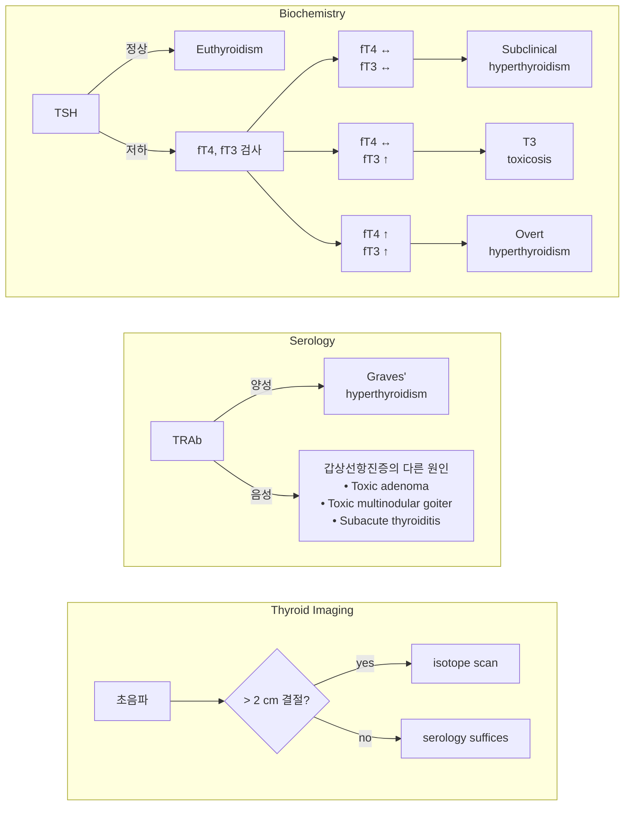
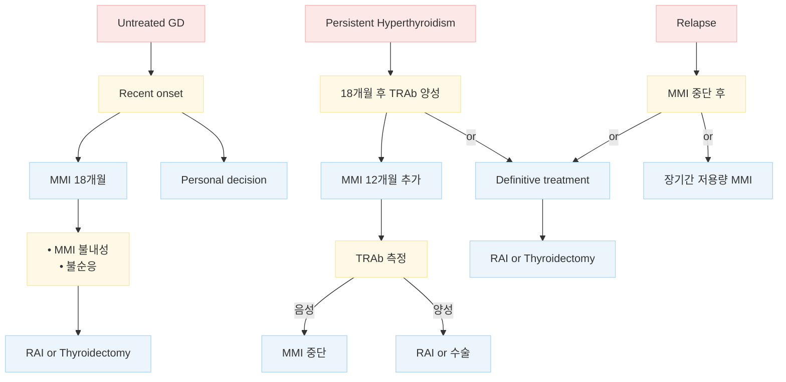

# 갑상선항진증 Hyperthyroidism

## 일반 사항

* 갑상선항진증 (Hyperthyroidism) : 갑상선 기능 과다로 갑상선 호르몬이 증가됨으로써 갑상선 호르몬의 생리적 작용이 과도하게 나타나는 임상 증후군
* 갑상선중독증 (Thyrotoxicosis) : 갑상선 호르몬(T4 or T3)의 과도한 증가와 관련된 임상 양상
* 갑상선중독발작 (Thyroid storm) : 어떤 사건에 의해 갑상선 호르몬의 급격하고 과도한 작용이 발생한 상태
* 무증상 갑상선항진증 (Euthyroid hyperthyroxinemia) : 갑상선 호르몬은 증가되어 있으나 TSH는 정상이며 갑상선 이상 증상은 없는 상태
* 경과 : 갑상선항진증 환자의 30\~60%에서 자연 회복 (특히 청소년)
  * 재발률 : 치료 종료 후 12개월 동안 T3/T4/TSH가 모두 정상인 경우의 8\~10%에서 재발

## 원인 및 종류

**Hyperthyroidism with a normal or high radioiodine uptake**

* (호르몬의 새로운 합성을 의미; 합성 억제제인 항갑상선제에 반응 함)
* Autoimmune thyroid Dz : Graves’ Dz(가장 흔함), Hashitoxicosis
* Autonomous thyroid tissue : Toxic adenoma, Toxic multinodular goiter
* TSH-mediated hyperthyroidism : TSH-생성 pituitary adenoma, 비 중앙성 TSH-mediated hyperthyroidism
* Human chorionic gonadotropin-mediated hyperthyroidism : Hyperemesis gravidarum, Trophoblastic Dz

**Hyperthyroidism with a near absent radioiodine uptake**

* (갑상선의 염증 또는 파괴를 의미; 항갑상선제에 반응하지 않음)
* Thyroiditis : Subacute (granulomatous) T, Painless T (silent T), Postpartum T, Radiation T, Palpation T, Drug-induced T (amiodarone, interferon-α)
* Exogenous thyroid hormone intake : Excessive replacement therapy, Intentional suppressive therapy, Factitious hyperthyroidism
* Ectopic hyperthyroidism : Struma ovarii, Metastatic follicular thyroid cancer

### Graves’ disease (GD)

* 자가면역 질환
* 갑상선항진증의 가장 흔한 원인(60\~80%)
* 기전 : 갑상선 내 β-cell로부터의 TSH receptor Ab(TR Ab)의 과다 생성 → 갑상선의 TSH receptor에 결합, receptor 활성화 → 갑상선 호르몬 합성 및 분출 자극(thyrotoxicosis), 갑상선 비대(goiter), 안구 돌출(안구 뒤 결합조직의 antigen과 결합)
* 위험 인자 : 여성(남성의 8배), 20\~40세, 가족력(특히 모계)
* 다른 면역 질환 위험 증가와 관련 : Sjögren syndrome, 셀리악병, pernicious anemia, Addison disease, 원형탈모증, 백반증, 1형 당뇨병, 부갑상선저하증, myasthenia gravis, 심근증
* 경과 : 항갑상선제 치료 시 30%에서 1\~2년 내 완화
  * 좋은 예후 : small goiter, 경증 항진 증상, 적은 항갑선제 요구량, TRAb ＜2 mU/L

### Toxic multinodular goiter (TMNG, Plummer’s Dz)

* 2번째로 흔함; ＞65세에서는 가장 흔함
* autonomous thyroid adenoma에 의해 발생; insidious onset

### 갑상선염 (Thyroiditis)

* 갑상선의 염증에 해당되는 여러 가지 질환군; transient autoimmune process
* 경과 : 갑상선 염증으로 갑상선 조직에 저장되어 있던 T3/T4 방출 \[항진 증상 발생] → 방출 종료 → 방출된 갑상선호르몬의 소멸 \[저하 증상 발생] → 회복
* Subacute (granulomatous) thyroiditis (= de Quervain’s T) : viral URI 후 갑상선 비대/통증, 갑상선 항진 증상 발생 → 감염 회복과 함께 완화 → 수개월 동안 갑상선 저하 증상; 10%에서 1년 후에도 지속. 1\~4%에서 재발
* Silent (lymphocytic) thyroiditis : spontaneous, 약물(예: 화학요법제, lithium, amiodarone) 등에 의해 발생
* Postpartum thyroiditis : 출산 2\~6주 후에 갑상선 항진 증상이 발생하여 2\~3개월 동안 지속된 후, 수개월 동안 갑상선 저하 증상이 이어질 수 있음; 30%에서 갑상선저하증이 지속될 수 있음

## 임상 양상

* 신경 : 과민, 안절부절, 손가락 떨림, 불면
* 근골격 : 근 약화, 근 경련, 심부 건반사 항진, 골다공증, 골절
* 심혈관 : 빈맥(두근거림), SBP 상승, 심방세동, 심장 비대, 심부전 악화
* 내분비 : 열 불내성, 다한증, 갑상선종, 여성형유방증, 성 기능 저하, 불규칙 월경, 당뇨병 악화
* 피부 : 따듯하고 습한 피부, 가려움, fine hair, onycholysis, pretibial yxedema(3%)
* 눈 : 안구 돌출(20\~40%), 위 눈꺼풀 수축, 복시, 안구 건조, 안구 통증
* 기타 : 피로, 체중 변화(보통 감소), 발열, 무른 변/빈변, 호흡 곤란
* 갑상선 비대 : 광범위 비대(없을 수 있음), 경증 압통; 화농성 갑상선염에서는 국소 염증 반응

#### 고령에서의 특징

* 고령에서는 전형적 증상이 나타나지 않을 수 있음
* 피로, 쇠약, 체중 감소, 심방세동(TSH ＜0.1 mIU/L에서 흔함), 호흡 곤란

## 진단

### 선별 검사 대상

* 다음의 상태에서 검사 고려 : 갑상선 질환 의심 증상, 1형 당뇨병, 자가면역 질환, 폐경기증후군, 새로이 발생한 심방세동, 설명할 수 없는 행동 변화/우울/불안

### 갑상선 호르몬 검사

* 기본 : TSH, free T4(thyroxine)
* 필요시 total T3, total T4, free T3(triiodothyronine)
  * ✽TSH ＜0.1 mIU/L로 진단 시 민감도 ＞98%, 특이도 92% ✽갑상선 호르몬의 반감기는 T3 = 1일, T4 = 1주일로, 갑상선염 등 갑상선 조직의 파괴에 의해 일시적으로 갑상선 호르몬이 유출되는 상태에서는 T3가 T4보다 일찍 감소하여 T4/T3 비가 커짐
* 검사 결과에 영향을 주는 요인 (☞ p.579)

<table data-header-hidden data-search="false"><thead><tr><th width="78"></th><th width="92.33331298828125"></th><th></th></tr></thead><tbody><tr><td><strong>TSH</strong></td><td><strong>free T4</strong></td><td><strong>해석</strong></td></tr><tr><td>↓</td><td>↑</td><td>갑상선항진증, 자가 치유 중인 갑상선염</td></tr><tr><td>↓</td><td>→</td><td>Subclinical hyperthyroidism, T3 toxicosis, thyroxine(T4) 섭취</td></tr><tr><td>↓/→</td><td>↓</td><td>Non-thyroidal illness, 최근 갑상선항진증 치료</td></tr><tr><td>↑</td><td>↓</td><td>갑상선 중독증 치료 후의 갑상선저하증</td></tr><tr><td>↓/→</td><td>↓</td><td>전신적인 병증 (비갑상선 질환)</td></tr><tr><td>↑/→</td><td>↑</td><td>pituitary tumor, 갑상선 호르몬 저항</td></tr></tbody></table>

### 기타 검사

* 영상 검사 : Scintigraphy, 초음파, CT, MRI: 진단이 불확실하거나 결절 의심 시 고려
* TRAb : Graves’ Dz 감별 및 예후 판정을 위하여 고려 (Graves’ Dz 95%에서 양성)
* CBC, LFT : 항갑상선제를 투여하기 전에 기초 검사 목적으로 고려

#### 안과 검진 대상

* 눈꺼풀, 결막충혈 또는 부종
* (4주 이상) 안구 뒤 통증, 눈을 움직일 때 통증
* caruncle 부종
* 모든 방향의 안구 움직임 ≥5°감소
* 안구 돌출 ≥2 ㎜
* Snellen chart상 ≥1 line 시력 저하

**Graves’ hyperthyroidism 의심 환자의 진단 알고리듬**&#x20;

_Ref. European thyroid association. Guideline for the management of Graves’ hyperthyroidism. 2018._

*
*

    

***

## Management

### 치료 방침

* 증상 완화 : β-차단제, steroid
*   갑상선 치료 : 항갑상선제, 131I therapy(RAIT), 갑상선 절제

    •thyroiditis 환자에서 항갑상선제는 투여하지 않음
* 식이 요법 : 특이 방법 없음; 체중 저하 예방을 위하여 충분한 칼로리 섭취를 권고
  * ✽L-carnitine이 갑상선 호르몬의 대항제로 작용하여 증상 완화 및 골 대사에 유효하다는 보고가 있음

**Graves’ hyperthyroidism 환자의 관리 알고리듬**

_Ref. European thyroid association. Guideline for the management of Graves’ hyperthyroidism. 2018._

## 약물 치료

### 항갑상선제

* 작용 : 갑상선에서의 갑상선 호르몬 합성 억제
* 대상 : GD, RAIT/수술 전(4\~8주간 투여)

#### Methimazole

*   1차 선택제; 1일 1\~2회 복용하며 효과 발현이 빠르고

    간 괴사 부작용이 적어 선호됨
* 임신 1분기에는 금기
* 최소 유효 용량으로 조절 \[메티마졸]

#### Propylthiouracil (PTU)

* 부가적으로 말초에서의 T4 → active T3 전환 차단 효과가 있음
* 1일 2\~3회 복용 \[안티로이드]
* 드물게 간 독성 부작용이 있음
* 임신 1분기에 1차 선택

| **항목**           | **MMI (메티마졸)** | **PTU (안티로이드)** |
| ---------------- | -------------- | --------------- |
| 시작 용량 (mg/d)     | 15\~40\* #2    | 300\~400 #3     |
| 유지 용량 (mg/d)     | 5\~15 qd       | 100\~150 #3     |
| 흡수               | 빠름             | 빠름              |
| bioavailability  | \~100%         | \~100%          |
| 최고혈중농도 도달        | 60\~120분       | 60분             |
| 혈중 반감기           | 6\~8h          | 90분             |
| thyroid turnover | slow           | moderate        |
| 작용 기간            | >24h           | 8\~12h          |
| 혈청 단백 결합         | 0              | >75%            |
| 태반 통과            | ++             | +               |
| 모유 전달            | +              | +               |
| 배설               | 신장             | 신장              |
| 강도               | ×10            | ×1              |
| T3 및 T4 정상화      | 6주             | 12주             |
| 부작용 발생률          | 15%            | 20%             |
| 무과립구증            | 0.1\~0.5%      | 1\~1.5%         |

#### 부작용

*   흔한 부작용(1\~5%) : 피부 발진, 두드러기, 관절통, 발열;

    단순한 가려움은 항갑상선제 중단 없이 항히스타민제로

    조절할 수 있음
*   무과립구증 : 발생률- 0.6%, 가족력 있음, PTU에서 보다 흔함;

    복용 초기 3개월에 흔함; 인후통, 발열, 비정상적 출혈 발생 시

    즉시 항갑상선제 복용 중단 및 WBC 검사 (TSH 모니터링 시

    함께 검사); 보통 투약 중단과 항생제 치료로 회복
*   간염 : 발생률- 0.1\~0.2%, 복용 초기 3개월에 흔함, PTU에서

    보다 흔함; 황달, 어두운색 소변, 밝은색 대변, 복통,

    체중 감소, 구역 등 발생 시 복용 중단 및 LFT 시행

#### 모니터링

*   치료 개시 후 (증상에 따라) 2\~6주에 free T4 및 T3 검사; free T4가 정상이어도 T3는 증가 상태일 수 있으므로

    T3를 함께 측정; 초기 치료 반응 평가에서 TSH는 배제

    * ✽항갑상선제의 역할이 이미 방출된 갑상선 호르몬에 대한 작용이 아니라, 신규 합성을 차단하는 것이기 때문에 혈중 T4/T3 수준을 낮추는 데 3주 정도 소요되며 TSH 수준 정상화에는 더 긴 기간이 필요함
*   항진 증상이 해소되고 TFT가 정상화됨에 따라 약제 용량을 30~~50% 감량하고 4~~6주마다 TSH 및 T4 검사

    → 정상 수준의 TFT를 유지하는 최소 용량이 정해진 후에는 2\~3개월 간격으로 검사

    → ＞18개월 장기간 치료 중인 경우에는 6개월 간격으로 검사

#### 치료 종료

* 성인에서는 12\~18개월 치료 후 TSH 및 TRAb가 정상이면 치료 중단 고려
* 12\~18개월 치료 후에도 high TRAb가 지속되면 12개월간 항갑상선제 치료를 추가로 지속하거나 RAIT 또는 thyroidectomy 고려
  * ✽항갑상선제로 18개월 이상 치료 시 추가 회복이 거의 나타나지 않음
*   치료 종료 후 TFT 추적 검사 일정 : 첫 6개월 동안 2~~3개월 간격 → 다음 6개월 동안 4~~6개월 간격

    → 이후 6\~12개월마다 또는 이상 증상이 있을 때

### β-차단제

* 작용 : T3 활성 억제, 두근거림/떨림/불안 등 증상 완화
* 대상 : 고령, 휴식 중 맥박 ＞90회, 심혈관 질환 동반; 금기가 아닌 모든 환자
* 투여 기간 : 증상이 호전될 때까지; 보통 2\~3주
* β-차단제를 사용할 수 없는 환자에서는 CCB 선택

<table data-header-hidden><thead><tr><th width="167.5238037109375"></th><th width="181.6190185546875"></th><th></th></tr></thead><tbody><tr><td><strong>성분명 [상품명]</strong></td><td><strong>용법</strong></td><td><strong>특징</strong></td></tr><tr><td><strong>propranolol [인데롤]</strong></td><td>10~40 mg tid~qid</td><td>고용량에서 T4→T3 전환 차단; 임신/수유부 투여 가능</td></tr><tr><td><strong>metoprolol [베타록]</strong></td><td>25~50 mg bid~tid</td><td>상대적 β1 선택차단제</td></tr><tr><td><strong>atenolol [테놀민]</strong></td><td>25~50 mg qd~bid</td><td>상대적 β1 선택차단제</td></tr></tbody></table>

\* _blood-brain barrie&#x72;_&#xB97C; 통과하므로 불안증 완화에 보다 유효

### 기타

#### Steroid

* 작용 : T4의 T3로의 전환 억제 (✽T3가 T4보다 3\~4배 효력이 있음)
* 적용 : thyroid storm, Graves’ orbitopathy
* prednisolone : 5~~20 ㎎ tid ×2~~3wk \[소론도]

#### Cholestyramine

* 작용 : 장간순환에서의 갑상선 호르몬 재흡수 억제
* 적용 : 갑상선 절제술, 임신, 갑상선중독증
* 용법 : 4 g qid \[퀘스트란]

## 방사선 치료/수술

#### 대상

* TMNG, toxic adenoma
* 12\~18개월간의 경구제 치료에도 지속되는 GD, 또는 재발 GD
* 심방세동, 심부전, 허혈성 심질환을 동반한 고령 환자

### Radioactive iodine therapy (RAIT)

* 작용 : 갑상선에 농축되어 갑상선 조직을 파괴
* 부작용 : 영구적 갑상선저하증, 경부 통증, 미각 저하, 홍조감, 갑상선저하증, 방사성 갑상선염, 안구병증 악화
* 모니터링 : RAIT 후 6주, 12주, 6개월, 매년 TFT 시행

### 수술

*   대상 : 항갑상선제 또는 RAIT로 치료할 수 없는 상태, 호흡에 지장을 주는 큰 갑상선종, 암으로의 진행 가능성이 있는

    결절, active Graves’ eye Dz
* 장점 : 빠르고 영구적인 치료
* 부작용 : 영구적 갑상선저하증, hypoparathyroidism, recurrent laryngeal nerve 손상

## 임신/수유 중 관리

### 검사 및 모니터링

* autoimmune thyroid disease 병력이 있는 모든 임신부는 1분기 중 TRAb를 측정

→ 증가되어 있는 경우 18\~22주째에 재검

* 항목 : TSH, free T4 (필요시 total T4 & T3 포함); 매 2주 & 안정 후 매 4주
* 출산 후 TFT 시행 : 갑상선항진증 악화가 흔함. GD는 출산 3개월 이후 흔함

### 치료

* 선택 약제 : 임신 1분기- PTU ≤200 ㎎/d; 임신 2, 3분기- MMI ≤20 ㎎/d

<table data-header-hidden><thead><tr><th width="127.5238037109375"></th><th width="162.5714111328125"></th><th></th></tr></thead><tbody><tr><td><strong>진단 시점</strong></td><td><strong>상황</strong></td><td><strong>권고 사항</strong></td></tr><tr><td>임신 전 진단</td><td>MMI 복용 중</td><td>• PTU로 전환 또는 중단¹) • TRAb 측정 → 상승 시 18~22주²) &#x26; 30~34주 재검³)</td></tr><tr><td>임신 전 진단</td><td>투약 중단 및 완화</td><td>• TFT 시행; TRAb 불필요</td></tr><tr><td>임신 전 진단</td><td>RAI/수술 병력</td><td>• 임신 제1기 석달 중 TRAb 측정 → 상승 시 18~22주 재검⁴)</td></tr><tr><td>임신 중 진단</td><td>임신 1기</td><td>• PTU 투여 개시 · TRAb 측정 → 상승 시 18<del>22주²) &#x26; 30</del>34주 재검³)</td></tr><tr><td>임신 중 진단</td><td>임신 2, 3분기⁵)</td><td>• MMI 투여 개시¹) · TRAb 측정 → 상승 시 18<del>22주²) &#x26; 30</del>34주 재검³)</td></tr></tbody></table>

1\) 임신 전 적용량(MMI ≤10 mg/d, PTU ≤100 mg/d) 투여 중인 경우 임신 6\~10주 전에 투여 중단 가능.\
2\) TRAb(+) 여성에서 임신 중 TRAb(-)로 전환 시 태아 갑상선 자극 위험 감소 → 항갑상선제 감량 또는 중단 고려.\
3\) 치료 종료 후에도 태아 갑상선자극호르몬에 의한 **neonatal hyperthyroidism** 위험 존재.\
4\) 산모가 고 TRAb 상태에서 치료 또는 수술을 받은 경우, 임신 후기에 태아 항진증 여부 평가 및 필요 시 항갑상선제 치료 시작.\
5\) 임신 2, 3분기 중 T3 또는 비임신 기준치의 1.5배까지 허용하며 최소 필요 용량 투여.

_Ref. American thyroid association. Guidelines for diagnosis and management of hyperthyroidism and other causes of thyrotoxicosis. 2016._

### 수유 중 항갑상선제 투여

* 비-수유 산모와 동일하게 치료
* 약물 복용 시간 : 수유 직후 약물을 복용하고 약제 복용 3\~4시간 후 모유 수유
* MMI : 1차 선택제; PTU의 간 독성 문제로 MMI를 권고; ≤20 ㎎/d
* PTU : 모유로의 이동이 적어 통상 용량에서 안전

## ￭ 무증상 갑상선항진증 Subclinical (Mild) Hyperthyroidism

* TSH는 저하되어 있으나 T3 & free T4는 정상으로 갑상선 호르몬 관련 증상이 발생하지 않은 상태
*   원인 : TMNG, GD, solitary autonomously functioning nodule, thyroiditis, central hypothyroidism,

    nonthyroidal illness, 고령, 임신, 간질환, 약물(예: estrogen, steroid)
*   증가되어 있는 T3와 T4의 대부분은 단백질(예: thyroxine-binding globulin)에 결합되어 있고 실제 임상 증상을

    발생시키는 T3와 T4의 free form은 정상임
*   선별 검사 : 권고하지 않음

    •무증상 환자에 대한 선별 검사 및 치료가 예후를 향상시키는 근거가 없음

### 치료

* 대부분의 환자들은 치료가 필요 없으며 2년 내에 회복됨
* 대상

<table data-header-hidden><thead><tr><th width="287.52386474609375"></th><th></th><th></th></tr></thead><tbody><tr><td><strong>Factor</strong></td><td><strong>TSH &#x3C; 0.1 mIU/L</strong></td><td><strong>TSH 0.1~0.4</strong>¹⁾²⁾ <strong>mIU/L</strong></td></tr><tr><td>&#x3C;65세, 동반 질환 없는 무증상</td><td>치료 고려</td><td>관찰</td></tr><tr><td>&#x3C;65세, 폐경²⁾·골다공증·심장 질환 또는 위험 인자 있음</td><td>치료</td><td>치료 고려</td></tr><tr><td>&#x3C;65세, 갑상선 항진 증상 있음</td><td>치료</td><td>치료 고려</td></tr><tr><td>≥65세</td><td>치료</td><td>치료 고려</td></tr></tbody></table>

¹⁾ 정상 하한값이 0.5 mIU/L인 경우 0.4 mIU/L를 기준으로 함\
²⁾ estrogen 또는 bisphosphonate 치료를 하지 않는 폐경 여성

_Ref. American Thyroid Association. Guidelines for diagnosis and management of hyperthyroidism and other causes of thyrotoxicosis. 2016._

* 목표 : TSH 정상치 회복
* 방법 : 치료를 하는 경우에는 갑상선항진증과 동일하게 시행

### **질병코드**&#x20;

E05 갑상선독증\[갑상선기능항진증]

E06 갑상선염

## 처방례

**처방례 1. 중등도 갑상선항진증** 메티마졸 5 mg/T 6T #3 → 유지 2\~3T qd

**처방례 2. 메티마졸 복용 곤란 중등도 갑상선항진증** 안티로이드 50 mg/T 6T #3 → 유지 50 mg/T 2\~3T #1\~2
