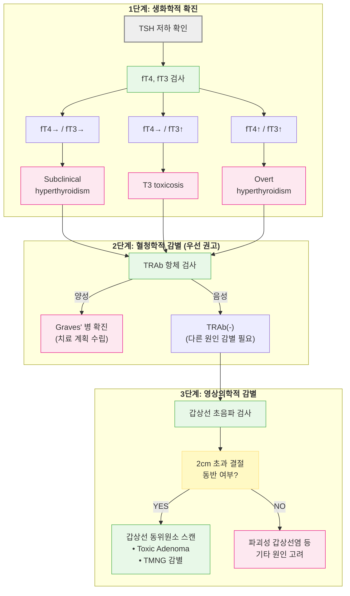
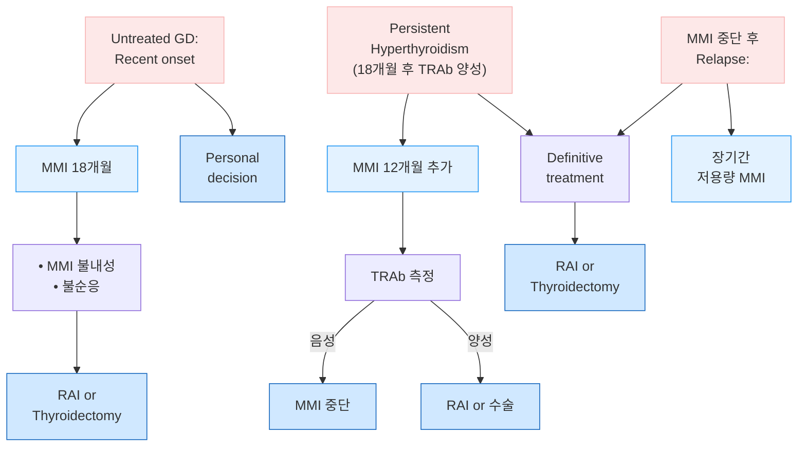

# 갑상선항진증 Hyperthyroidism

## <mark style="color:green;">일반 사항</mark>

* 갑상선항진증 (Hyperthyroidism) : 갑상선 자체에서 갑상선호르몬(T3, T4)의 신생 합성·분비가 증가하여, 그 결과 말초 조직에서 갑상선호르몬의 생리적 작용이 과도하게 나타나는 임상 증후군; 신생 합성 증가가 핵심 기전이라는 점에서, 저장된 호르몬의 파괴적 유출(파괴성 갑상선염)이나 외인성 섭취로 인한 갑상선중독증과 구분됨
* 갑상선중독증 (Thyrotoxicosis) : 원인(기전)과 무관하게 갑상선 호르몬(T4 or T3)의 과도한 증가와 관련된 임상 양상 전반을 지칭하는 상위 개념으로, 갑상선항진증을 포함함
* 갑상선중독발작 (Thyroid storm) : 감염, 수술, 요오드 노출, 임의 중단 등의 유발 사건에 의해 갑상선 호르몬의 급격하고 과도한 작용이 다발성 장기 기능 부전을 동반하며 나타나는 내분비 응급 상황; 진단·치료가 늦어지면 위험(사망률 10\~30%)
* 무증상 갑상선항진증 (Subclinical hyperthyroidism) : TSH가 저하되어 있지만, T3 및 free T4는 정상이고 갑상선 항진 증상은 없는 상태&#x20;
* 유병률 : 요오드 충분 지역에서 전체 인구의 약 0.2\~1.3%; 여성에서 남성보다 훨씬 흔함(약 5\~10배); Graves병이 전체 원인의 60\~80%로 가장 흔함
* 경과 : 자연 관해(remission)는 드물며 대부분 치료가 필요함(일부 경증 Graves병에서 드물게 자연 관해가 보고됨); 항갑상선제 치료 시 약 40\~60%에서 관해에 도달
  * 재발 : 관해 후에도 상당수에서 재발하며, 항갑상선제 종료 시 TRAb 음성이면 재발 위험이 낮고 지속 양성이면 재발 위험이 높음
* 합병증 : 심방세동, 심부전, 골다공증·병적 골절, 갑상선중독발작(thyroid storm), Graves' orbitopathy

## <mark style="color:green;">원인 및 위험 인자</mark>

### <mark style="color:orange;">방사성 요오드 섭취율 정상 또는 증가</mark>

* 갑상선 호르몬의 신규 합성이 항진된 상태를 의미하며, 합성 억제제인 항갑상선제에 반응함
* Autoimmune thyroid disease : Graves' disease(가장 흔함), Hashitoxicosis
* Autonomous thyroid tissue : Toxic adenoma, Toxic multinodular goiter
* TSH-mediated hyperthyroidism : TSH 분비 뇌하수체선종, 비-중앙성 TSH-mediated hyperthyroidism
* Human chorionic gonadotropin-mediated hyperthyroidism : Hyperemesis gravidarum, Trophoblastic disease

#### <mark style="color:$primary;">Graves' disease (GD)</mark>

* 자가면역 질환으로 갑상선항진증의 가장 흔한 원인임(60\~80%)
* 기전 : B 림프구에서 생성된 TSH receptor 자극항체(TRAb)가 갑상선의 TSH receptor에 결합 → receptor 활성화 → 갑상선 호르몬 합성·분비 자극(thyrotoxicosis), 갑상선 비대(goiter), 안와 돌출 유발
  * 안와 증상 : 안와섬유아세포에도 TSH 수용체가 발현되어 있어 TRAb가 직접 작용 → 섬유아세포 증식, 글리코사미노글리칸 축적, 림프구 침윤성 염증 → 안구돌출·외안근 비대(Graves' orbitopathy) 유발
* 위험 인자 : 여성(남성의 8배), 20\~40세, 가족력(특히 모계), 흡연(특히 Graves' orbitopathy 위험을 높임)
* 다른 자가면역질환 위험 증가와 관련 : Sjögren syndrome, 셀리악병, pernicious anemia, Addison disease, 원형탈모증, 백반증, 1형 당뇨병, 부갑상선저하증, myasthenia gravis, 심근증
* 경과 : 항갑상선제 치료 시 약 40\~60%에서 관해
  * 좋은 예후 인자 : small goiter, 경증 항진 증상, 적은 항갑상선제 요구량, TRAb ＜2 mU/L
  * 치료 종료 시점의 TRAb 상태가 재발의 중요한 예측 인자 : 음성 전환 시 재발 위험 낮음, 지속 양성 시 재발 위험 높음

#### <mark style="color:$primary;">Toxic multinodular goiter (TMNG, Plummer's disease)</mark>

* 2번째로 흔한 원인; 65세 이상에서는 가장 흔함
* 여러 개의 autonomously functioning thyroid nodules에 의해 발생; insidious onset

### <mark style="color:orange;">방사성 요오드 섭취율 감소</mark>

* 갑상선의 염증 또는 파괴로 저장된 호르몬이 혈중으로 유출되는 상태를 의미하며, 항갑상선제에 반응하지 않음
* Thyroiditis : Subacute (granulomatous) thyroiditis, Painless (silent) thyroiditis, Postpartum thyroiditis, Radiation thyroiditis, Palpation thyroiditis, Drug-induced thyroiditis (amiodarone, interferon-α)
* Exogenous thyroid hormone intake : Excessive replacement therapy, Intentional suppressive therapy, Factitious hyperthyroidism
* Ectopic hyperthyroidism : Struma ovarii, Metastatic follicular thyroid cancer

#### <mark style="color:$primary;">갑상선염 (Thyroiditis)</mark>

* 갑상선의 염증에 해당되는 여러 질환군; transient autoimmune process인 경우가 많음
* 경과 : 조직에 저장되어 있던 T3/T4가 갑상선 염증으로 인하여방출 \[항진 증상 발생] → 방출 종료 → 방출된 갑상선호르몬의 소멸 \[저하 증상 발생] → 회복
* Subacute (granulomatous) thyroiditis (= de Quervain's thyroiditis) : viral URI 후 갑상선 비대·통증과 항진 증상 발생 → 감염 회복과 함께 완화 → 수개월간 저하 증상; 10%에서 1년 후에도 지속, 1\~4%에서 재발
* Silent (lymphocytic) thyroiditis : 특발성 또는 약물(예: 화학요법제, lithium, amiodarone)에 의해 발생
* [산후 갑상선염](106_-hyperthyroidism.md#postpartum-thyroiditis-ppt) (Postpartum thyroiditis) : 대개 산후 1\~6개월 사이에 항진 증상이 발생하여 0\~3개월 지속된 후, 수개월간 저하 증상이 이어질 수 있음; 관해 후에도 10\~50%에서 갑상선저하증이 영구화될 수 있음

## <mark style="color:green;">임상 양상</mark>

* 신경 : 과민, 안절부절, 손가락 떨림, 불면
* 근골격 : 근 약화, 근 경련, 심부 건반사 항진, 골다공증, 골절
* 심혈관 : 빈맥(두근거림), 수축기혈압 상승, 심방세동, 심장 비대, 심부전 악화
* 내분비 : 열 불내성, 다한증, 갑상선종, 여성형유방증, 성 기능 저하, 불규칙 월경, 당뇨병 악화
* 피부 : 따뜻하고 습한 피부, 가려움, 가는 모발(fine hair), onycholysis, pretibial myxedema(3%)
* 눈 : 안구돌출(20\~40%), 위 눈꺼풀 수축, 복시, 안구 건조, 안구 통증
* 기타 : 피로, 체중 변화(보통 감소), 발열, 무른 변·빈변, 호흡 곤란
* 갑상선 비대 : 미만성 갑상선 비대(대개 압통 없음이 일반적; 압통이 뚜렷하면 subacute thyroiditis 등 다른 원인 고려); 화농성 갑상선염에서는 국소 압통·염증 반응

**고령에서의 특징**

* 고령에서는 전형적 증상이 나타나지 않을 수 있음 (apathetic hyperthyroidism)
* 피로, 쇠약, 체중 감소, 심방세동(TSH ＜0.1 mIU/L에서 흔함), 호흡 곤란이 주 증상일 수 있음

### <mark style="color:$danger;">🚩 Red Flags!</mark>

<mark style="color:$danger;">**즉각 조치 또는 의뢰**</mark>

* 고열(≥38.9℃), 심한 빈맥(＞140/분) 또는 심방세동, 의식 변화(초조·섬망·혼수), 심한 오심·구토·황달 동반 (Burch-Wartofsky Point Scale ≥45점) → 갑상선중독발작
* 급격한 시력 저하, 색각 이상, 구심동공반사 이상 → 갑상선 시신경병증
* 심한 빈맥 또는 새로 발생한 심방세동 + 혈역학적 불안정(저혈압, 흉통, 호흡곤란)
* 항갑상선제 복용 중 고열·심한 인후통 → 무과립구증

<mark style="color:$warning;">**당일 또는 조기 의뢰**</mark>

* 새로 진단된 심방세동 또는 심부전 악화 소견
* 안구돌출의 급속 진행, 새로 발생한 복시, 결막 부종·충혈 심화
* 임신 중 갑상선항진증 신규 진단 또는 임신 중 TRAb 상승
* 항갑상선제 복용 중 경미한 발열·인후통(무과립구증 완전 배제 안 됨)

<mark style="color:$info;">**외래 추적 / 추가 평가 계획**</mark> <mark style="color:$info;">- 즉각 위험 낮으나 호전 없으면 의뢰</mark>

* 항갑상선제 치료 4\~6주 후에도 TFT 호전 없음
* 무증상 갑상선항진증 경과 관찰 중 증상 발생 또는 고위험군(65세 이상, 심질환·골다공증 동반)으로 재분류
* 경증 Graves' orbitopathy의 활동성·진행 여부 정기 추적

## <mark style="color:green;">진단</mark>

### <mark style="color:orange;">선별 검사 대상</mark>

* 다음의 상태에서 검사 고려 : 갑상선 질환 의심 증상, 1형 당뇨병 등 자가면역 질환, 새로이 발생한 심방세동, 설명되지 않는 체중감소, 지속적인 동성빈맥(persistent sinus tachycardia), 골다공증, 설명할 수 없는 행동 변화·우울·불안

### <mark style="color:orange;">갑상선 호르몬 검사</mark>

* 기본 : TSH, free T4(thyroxine)
* 필요시 free or total T3 추가 - 임상 환경상 free  T3 측정에 어려움이 있어 흔히 total T3를 검사
  * free T4가 정상이더라도 T3만 단독으로 상승하는 경우(T3 toxicosis) 감별을 위해 T3 측정이 필요함
  * TSH ＜0.1 mIU/L을 기준으로 한 갑상선항진증 진단은 민감도 ＞98%, 특이도 92%
  * 갑상선 호르몬의 반감기는 T3 = 1일, T4 = 1주일로, 갑상선염 등 갑상선 조직의 파괴에 의해 저장 호르몬이 일시적으로 유출되는 상태에서는 T3가 T4보다 일찍 감소하여 T4/T3 비가 커짐

<table data-header-hidden><thead><tr><th width="82.33331298828125"></th><th width="102.47613525390625"></th><th></th></tr></thead><tbody><tr><td><strong>TSH</strong></td><td><strong>free T4</strong></td><td><strong>해석</strong></td></tr><tr><td>↓</td><td>↑</td><td>갑상선항진증, 자가 치유 중인 갑상선염</td></tr><tr><td>↓</td><td>→</td><td>Subclinical hyperthyroidism, T3 toxicosis, thyroxine(T4) 섭취</td></tr><tr><td>↓/→</td><td>↓</td><td>전신적인 병증(non-thyroidal illness), 최근 갑상선항진증 치료</td></tr><tr><td>↑</td><td>↓</td><td>갑상선중독증 치료 후의 갑상선저하증</td></tr><tr><td>↑/→</td><td>↑</td><td>Pituitary tumor, 갑상선 호르몬 저항</td></tr></tbody></table>

* 검사 결과에 영향을 주는 요인 ☞ [갑상선저하증](105_-hypothyroidism.md#undefined-6)

### <mark style="color:orange;">기타 검사</mark>

* 영상 검사 : 초음파·scintigraphy가 주된 검사; CT·MRI는 흉골하 갑상선종, 뇌하수체 종양, 안병증 평가 등 특수한 상황에서만 선택적으로 고려
* TRAb : Graves' disease 감별 및 예후 판정을 위해 고려(Graves' disease의 95%에서 양성)
* CBC, LFT : 항갑상선제 투여 전 기초 검사 목적으로 고려

#### <mark style="color:$primary;">안과 검진 대상</mark>

* 눈꺼풀·결막 충혈 또는 부종
* (4주 이상 지속되는) 안구 뒤 통증, 눈을 움직일 때 통증
* Caruncle 부종
* 모든 방향의 안구 움직임 ≥5° 감소
* 안구돌출 ≥2 ㎜
* Snellen chart상 ≥1 line 시력 저하
* 다음 소견은 시력 위협(sight-threatening) 징후로 응급 안과 의뢰가 필요 : 새로 발생한 복시, 색각 저하, 구심동공반사이상(RAPD)



<p align="center"><strong>Graves' hyperthyroidism 의심 환자의 진단 알고리듬</strong></p>

<p align="center"><em><mark style="color:$info;">Ref. European Thyroid Association. Guideline for the management of Graves' hyperthyroidism. Eur Thyroid J. 2018.</mark></em></p>

### <mark style="color:orange;">감별</mark>

* 열 불내성·심계항진·체중 감소 등으로 내원 시 아래 질환과의 감별이 필요; TSH가 정상이면 갑상선 질환 가능성은 낮음

<table><thead><tr><th width="169.047607421875">질환</th><th width="278.5714111328125">감별 포인트</th><th>핵심 검사</th></tr></thead><tbody><tr><td>불안장애·공황장애</td><td>발한·심계항진은 유사하나 열 불내성·체중감소·안구 증상은 드묾</td><td>TSH 정상</td></tr><tr><td>갱년기(폐경) 증후군</td><td>안면홍조·발한은 있으나 빈맥·손떨림은 덜함</td><td>TSH, FSH/LH</td></tr><tr><td>갈색세포종(Pheo-chromocytoma)</td><td>발작성 고혈압·심계항진·발한이 특징적; 갑상선종·안구 증상 없음</td><td>혈장 또는 소변 metanephrine</td></tr><tr><td>악성 종양(체중감소 동반)</td><td>식욕부진 동반 체중감소가 흔함(갑상선항진증은 식욕 증가에도 체중 감소)</td><td>영상 검사; TSH 정상</td></tr><tr><td>기타 원인의 심방세동</td><td>고령·구조적 심질환 동반이 흔함</td><td>TSH로 감별</td></tr></tbody></table>

#### <mark style="color:$primary;">갑상선중독발작 중증도 평가 (Burch-Wartofsky Point Scale)</mark>

* 갑상선중독발작이 임상적으로 의심되는 경우, 체온·심혈관계·중추신경계·위장관/간 증상과 유발 인자 유무를 점수화하여 위험도를 정량적으로 평가할 수 있음

<table data-search="false"><thead><tr><th width="166.66668701171875">항목</th><th width="358.09521484375">소견</th><th>점수</th></tr></thead><tbody><tr><td>체온 조절 장애 (℃)</td><td>37.2~37.7</td><td>5</td></tr><tr><td></td><td>37.8~38.3</td><td>10</td></tr><tr><td></td><td>38.4~38.8</td><td>15</td></tr><tr><td></td><td>38.9~39.3</td><td>20</td></tr><tr><td></td><td>39.4~39.9</td><td>25</td></tr><tr><td></td><td>≥40.0</td><td>30</td></tr><tr><td>빈맥 (회/분)</td><td>90~109</td><td>5</td></tr><tr><td></td><td>110~119</td><td>10</td></tr><tr><td></td><td>120~129</td><td>15</td></tr><tr><td></td><td>130~139</td><td>20</td></tr><tr><td></td><td>≥140</td><td>25</td></tr><tr><td>심방세동</td><td>있음</td><td>10</td></tr><tr><td>심부전</td><td>경증</td><td>5</td></tr><tr><td></td><td>중등도</td><td>10</td></tr><tr><td></td><td>중증</td><td>15</td></tr><tr><td>위장관·간 기능이상</td><td>중등도(설사, 복통, 오심/구토)</td><td>10</td></tr><tr><td></td><td>중증(황달)</td><td>20</td></tr><tr><td>중추신경계 증상</td><td>경증(초조)</td><td>10</td></tr><tr><td></td><td>중등도(섬망, 정신병, 극도의 무기력)</td><td>20</td></tr><tr><td></td><td>중증(경련, 혼수)</td><td>30</td></tr><tr><td>유발 인자</td><td>없음</td><td>0</td></tr><tr><td></td><td>있음(감염, 수술, 요오드 노출, 외상, 임의 중단 등)</td><td>10</td></tr></tbody></table>

* 판정 : 총점 ≥45점 - 갑상선중독발작 강력 시사; 25\~44점 - 임박한 갑상선중독발작(impending storm) 시사; ＜25점 - 갑상선중독발작 가능성 낮음
* 중추신경계 증상(초조, 섬망, 정신병, 극도의 무기력, 경련, 혼수)의 유무와 정도가 단순 중증 갑상선중독증과 실제 갑상선중독발작을 구분하는 가장 중요한 임상 소견임
* 점수와 무관하게 임상적으로 갑상선중독발작이 강력히 의심되면 지체 없이 응급 이송 및 치료를 시작할 것

***

## <mark style="background-color:$warning;">Management</mark>

### <mark style="color:orange;">치료 방침</mark>

* 증상 완화 : β-차단제, (필요시) steroid
* 갑상선 치료 : 항갑상선제, ¹³¹I therapy(RAIT), 갑상선 절제
  * Thyroiditis 환자에서는 항갑상선제를 투여하지 않음(신규 합성이 항진된 상태가 아니므로 효과 없음)
* 식이 요법 : 특이 방법은 없음; 체중 저하 예방을 위해 충분한 칼로리 섭취를 권고
  * L-carnitine이 갑상선 호르몬의 말초 작용을 길항하여 증상 완화 및 골 대사에 유효하다는 일부 보고가 있으나, 근거 수준이 낮은 소규모 연구에 국한되어 보조적 선택지 수준으로만 고려

<mark style="color:cyan;">**단계별 치료 전략 (Step-wise Approach)**</mark>

<table><thead><tr><th width="82.3809814453125">단계</th><th width="295.7142333984375">핵심 치료</th><th>대상</th></tr></thead><tbody><tr><td>Step 1</td><td>β-차단제로 증상 완화</td><td>모든 유증상 환자(금기 없는 한)</td></tr><tr><td>Step 2</td><td>원인별 확정 치료 결정 - 항갑상선제 / RAIT / 수술</td><td>Graves' disease, TMNG, Toxic adenoma</td></tr><tr><td>Step 3</td><td>Graves' orbitopathy 동반 여부 평가 및 안과 협진</td><td>안구 증상이 있거나 위험 인자(흡연 등) 보유</td></tr><tr><td>Step 4</td><td>정기적 TFT 추적 및 치료 반응·부작용 모니터링</td><td>모든 환자</td></tr></tbody></table>

<mark style="color:cyan;">**치료법별 추적 검사 주기**</mark>&#x20;

<table><thead><tr><th width="227.142822265625">상황</th><th>추적 검사 주기</th></tr></thead><tbody><tr><td>항갑상선제 시작 직후</td><td>2~6주 후 free T4·T3 확인(TSH는 수개월간 억제 상태 지속 가능하여 초기 판정에서 배제) → 정상화 후 4~6주마다 → 안정 후 2~3개월마다 → 18개월 이상 장기 치료 시 6개월마다</td></tr><tr><td>RAIT 이후</td><td>4~6주 이내 첫 검사 → 정상화될 때까지(치료 후 6개월까지) 2~3개월마다 → 정상 2회 확인 후 6개월~1년마다</td></tr><tr><td>무증상 갑상선항진증 관찰</td><td>치료하지 않는 경우 정기적 재평가(수개월 간격), 증상 발생 시 즉시 재검</td></tr><tr><td>임신 중(항갑상선제 복용)</td><td>임신 확인 즉시 → 이후 1분기 1~2주마다 → 2~3분기 2~4주마다</td></tr><tr><td>임신 중(TRAb/TSI ≥3×ULN)</td><td>1분기, 18~22주, 30~34주 재검 + 18~20주부터 매월 태아 초음파</td></tr><tr><td>산후 갑상선염</td><td>4~8주 간격 관찰; 정상화 후 1년째 또는 증상 발생 시 재검</td></tr></tbody></table>

_TRAb=TSH Receptor Antibodies, TSI=Thyroid-Stimulating Immunoglobulin_

***



<p align="center"><strong>Graves' hyperthyroidism 관리 알고리듬</strong></p>

<p align="center"><em><mark style="color:$info;">Ref. European Thyroid Association. Guideline for the management of Graves' hyperthyroidism. Eur Thyroid J. 2018.</mark></em></p>

***

## <mark style="color:green;">비-약물 치료 및 예방</mark>

* **금연** : 흡연은 Graves' orbitopathy의 발생 및 악화와 관련된 가장 강력한 교정 가능 위험 인자이므로, 안구 증상 유무와 무관하게 모든 환자에게 금연을 권고 \[EUGOGO 2021]
* 갑상선중독 급성기에는 무리한 운동·격렬한 신체활동 자제(부정맥·심부전 악화 위험)
* 충분한 칼로리·단백질 섭취로 체중 감소 예방
* 요오드 과다 섭취(다시마 등 해조류, 요오드 조영제, amiodarone 등) 회피 - 특히 자율기능성 결절(TMNG, toxic adenoma) 환자에서 요오드-유발 갑상선중독증(Jod-Basedow 현상) 위험
* 카페인 등 교감신경 항진 유발 물질 최소화(심계항진·불안 증상 악화 가능)
* 안구 증상이 있는 경우 인공눈물 사용, 선글라스 착용, 수면 시 머리를 높게 유지

***

## <mark style="color:green;">약물 치료</mark>

### <mark style="color:orange;">항갑상선제</mark>

* 작용 : 갑상선에서의 갑상선 호르몬 합성 억제
* 대상 : Graves' disease, RAIT·수술 전(4\~8주간 투여)

#### <mark style="color:$primary;">Methimazole (MMI)</mark>

* 1차 선택제; 반감기는 짧으나 갑상선 내 체류시간이 길어 대부분 1일 1회 복용(초기 고용량에서만 분할 투여); 효과 발현이 빠르고 간 괴사 부작용이 적어 선호됨
* 임신 1분기에는 회피 권고(기형 위험으로 PTU를 우선 선택); 다만 PTU에 중증 부작용이 있거나 구할 수 없는 등 대안이 없는 경우, 치료하지 않은 갑상선항진증 자체의 위험(유산·태아 사망 등)이 더 크므로 최소 유효 용량의 MMI 사용을 고려 \[ATA 2026]
* 증상·TFT 호전에 따라 최소 유효 용량으로 감량 <mark style="color:blue;">\[메티마졸]</mark>

#### <mark style="color:$primary;">Propylthiouracil (PTU)</mark>

* 부가적으로 말초에서의 T4 → active T3 전환 차단 효과가 있음
* 1일 2\~3회 복용 <mark style="color:blue;">\[안티로이드]</mark>
* 드물게 중증 간독성 부작용이 있어 MMI보다 우선순위가 낮음
* 임신 1분기, thyroid storm에서는 1차 선택

| **항목**           | **MMI (메티마졸)**                                   | **PTU (안티로이드)**                             |
| ---------------- | ------------------------------------------------ | ------------------------------------------- |
| 시작 용량            | 10\\\~30 ㎎/d, 1일 1회(중증 시 최대 40 ㎎/d까지, 이때는 분할 투여) | 100\\\~300 ㎎/d, 1일 2\\\~3회(중증 시 최대 400 ㎎/d) |
| 유지 용량            | 5\\\~15 ㎎/d, 1일 1회                               | 100\\\~150 ㎎/d, 1일 2\\\~3회                  |
| 흡수               | 빠름                                               | 빠름                                          |
| Bioavailability  | \\\~100%                                         | \\\~100%                                    |
| 최고혈중농도 도달        | 60\\\~120분                                       | 60분                                         |
| 혈중 반감기           | 6\\\~8시간                                         | 90분                                         |
| Thyroid turnover | Slow                                             | Moderate                                    |
| 작용 기간            | >24시간                                            | 8\\\~12시간                                   |
| 혈청 단백 결합         | 0                                                | >75%                                        |
| 태반 통과            | ++                                               | +                                           |
| 모유 전달            | +                                                | +                                           |
| 배설               | 신장                                               | 신장                                          |
| 역가(강도)           | ×10                                              | ×1                                          |
| T3·T4 정상화까지      | 6주                                               | 12주                                         |
| 부작용 발생률          | 15%                                              | 20%                                         |
| 무과립구증            | 0.1\\\~0.5%                                      | 0.1\\\~0.5%(MMI 대비 상대적으로 더 흔함)              |

#### <mark style="color:$primary;">부작용</mark>

* 흔한 부작용(1\~5%) : 피부 발진, 두드러기, 관절통, 발열; 단순한 가려움은 항갑상선제 중단 없이 항히스타민제로 조절 가능
* 무과립구증 : 발생률 약 0.1\~0.5%(PTU에서 상대적으로 더 흔함), 가족력과 연관 가능; 복용 초기 3개월에 흔함; 인후통·발열·비정상적 출혈 발생 시 즉시 항갑상선제 복용 중단 및 CBC(백혈구 분획 포함, ANC 확인) 시행; 대개 투약 중단과 항생제 치료로 회복
* 간염 : 발생률 0.1\~0.2%, 복용 초기 3개월에 흔함, PTU에서 더 흔함(중증 간부전 보고 있음); 황달, 어두운색 소변, 밝은색 대변, 복통, 체중 감소, 구역 등 발생 시 복용 중단 및 LFT 시행


**⚠️ Propylthiouracil 중증 간독성 경고**\
PTU는 드물게 급성 전격성 간부전을 유발할 수 있어(성인 10만 명당 약 1명), 소아·임신 1분기 이외에는 MMI를 1차로 우선 고려하고 PTU 사용 시 정기 LFT 모니터링이 필요합니다.


#### <mark style="color:$primary;">모니터링</mark>

* 치료 개시 후 2\~6주(증상에 따라)에 free T4 및 T3 검사; free T4가 정상이어도 T3는 증가 상태일 수 있으므로 T3를 함께 측정; 초기 치료 반응 평가에서 TSH는 배제
  * ✽항갑상선제는 이미 방출된 갑상선 호르몬에는 작용하지 않고 신규 합성만 차단하므로, 혈중 T4/T3 수준을 낮추는 데 약 3주가 소요되며 TSH 정상화에는 더 긴 기간이 필요함
  * ✽TSH는 치료 시작 후 수개월간 억제된 상태로 지속될 수 있어, 이 기간 동안은 TSH만으로 치료 반응이나 과다치료 여부를 판정하지 않음
* 항진 증상이 해소되고 TFT가 정상화됨에 따라 약제 용량을 30\~50% 감량하고 4\~6주마다 TSH 및 T4 검사
  * → 정상 TFT를 유지하는 최소 용량이 정해진 후에는 2\~3개월 간격으로 검사
  * → 18개월 이상 장기 치료 중인 경우에는 6개월 간격으로 검사
  * ✽일부 연구에서 TRAb 음성 전환 확인 후에도 일정 기간 항갑상선제를 추가 유지하는 것이 재발률 감소와 연관된다는 보고가 있으나, 표준화된 최적 유지 기간에 대한 확립된 지침은 아직 없음 \[ETA 2018]

#### <mark style="color:$primary;">치료 종료</mark>

* 성인에서는 12\~18개월 치료 후 TSH 및 TRAb가 정상이면 치료 중단 고려
* 12\~18개월 치료 후에도 high TRAb가 지속되면 12개월간 항갑상선제 치료를 추가 지속하거나 RAIT 또는 thyroidectomy 고려
  * ✽항갑상선제로 18개월 이상 치료 시 추가 완화 효과가 거의 나타나지 않음
* 치료 종료 후 TFT 추적 검사 일정 : 첫 6개월 동안 2\~3개월 간격 → 다음 6개월 동안 4\~6개월 간격 → 이후 6\~12개월마다 또는 이상 증상이 있을 때

### <mark style="color:orange;">β-차단제</mark>

* 작용 : 말초 T4 → T3 전환 억제, 두근거림·떨림·불안 등 증상 완화
* 대상 : 고령, 안정 시 맥박 ＞90회/분, 심혈관 질환 동반; 금기가 아닌 모든 유증상 환자
* 투여 기간 : 증상이 호전될 때까지, 보통 2\~3주
* β-차단제를 사용할 수 없는 환자(중증 천식 등)에서는 CCB(예: diltiazem, verapamil)를 대체로 고려

| **성분명 \[상품명]**                                      | **용법**                | **특징**                                                              |
| --------------------------------------------------- | --------------------- | ------------------------------------------------------------------- |
| propranolol <mark style="color:blue;">\[인데롤]</mark> | 10\\\~40 ㎎ tid\\\~qid | 고용량에서 T4→T3 전환 차단; blood-brain barrier 통과로 불안증 완화에 유리; 임신·수유부 투여 가능 |
| metoprolol <mark style="color:blue;">\[베타록]</mark>  | 25\\\~50 ㎎ bid\\\~tid | 상대적 β1 선택차단제                                                        |
| atenolol <mark style="color:blue;">\[테놀민]</mark>    | 25\\\~50 ㎎ qd\\\~bid  | 상대적 β1 선택차단제                                                        |

### <mark style="color:orange;">기타</mark>

#### <mark style="color:$primary;">Steroid</mark>

* 작용 : T4의 T3로의 전환 억제(✽T3가 T4보다 3\~4배 효력이 강함)
* 용법은 적용 상황에 따라 다름 : 중등도\~중증 활동성 Graves' orbitopathy - 정맥 methylprednisolone 프로토콜(☞ 아래 Graves' orbitopathy 치료 참고); 갑상선중독발작 - hydrocortisone 정맥 투여(☞ 처방례 4)
* 외래에서 경구 prednisolone을 장기간 분할(tid) 투여하는 처방은 일반적이지 않음

#### <mark style="color:$primary;">Cholestyramine</mark>

* 작용 : 장간순환에서의 갑상선 호르몬 재흡수 억제
* 적용 : 갑상선절제술 전 준비, 중증 갑상선중독증·갑상선중독발작의 보조 치료(장간순환 차단으로 호르몬 농도 하강을 가속)
* 용법 : 4 g qid <mark style="color:blue;">\[퀘스트란]</mark>

### <mark style="color:orange;">Graves' orbitopathy (안병증) 치료</mark>

* 원칙 : 활동성(activity)·중증도(severity) 평가에 따라 치료 방침을 결정 \[EUGOGO 2021]
* **흡연은 Graves' orbitopathy 발생·악화의 가장 중요한 교정 가능(modifiable) 위험 인자이므로 모든 단계에서 금연이 우선됨**
* 경증(mild) : 인공눈물 등 국소 치료 + 위험 인자(흡연, 갑상선기능 이상) 교정; 최근 발병한 활동성 경증에서는 6개월간 selenium 보충이 진행 방지 및 삶의 질 개선에 도움이 될 수 있음(근거는 셀레늄 결핍 지역에서 가장 강하며, 요오드·셀레늄이 충분한 지역에서는 효과가 제한적일 수 있음) \[EUGOGO 2021]
* 중등도\~중증 활동성(moderate-to-severe active) : 정맥 methylprednisolone(IVMP) ± mycophenolate 병용이 1차 치료 \[EUGOGO 2021 Strong recommendation]; teprotumumab은 국내 미허가(2025년 기준)로 국내에서는 고용량 IVMP 요법이 중심(누적 용량 8 g/cycle 초과 금지 - 간독성 위험); IVMP 투여 중에는 정기적 LFT 모니터링 필요(드물게 중증 간손상 보고) \[EUGOGO 2021]
* 시력 위협(sight-threatening, dysthyroid optic neuropathy 등) : 고용량 IVMP 즉시 투여, 48\~72시간 내 반응 없으면 안와 감압술(orbital decompression) 응급 시행 → 안과 응급 의뢰
* 갑상선 기능은 정상으로 유지(과다·저하 모두 안병증 악화 요인); RAIT는 활동성 중등도\~중증 안병증에서는 상대적 금기이거나 예방적 스테로이드 병용을 고려

***

## <mark style="color:green;">시술 및 기타 처치</mark>

### <mark style="color:orange;">Radioactive iodine therapy (RAIT)</mark>

* 작용 : 갑상선에 농축되어 갑상선 조직을 파괴; 갑상선기능항진증의 완치(정상 갑상선기능 또는 갑상선기능저하증 도달)를 목표로 함 \[대한갑상선학회(KTA) 2025]
* 국내 자료 : 1차 RAIT 후 1년 성공률 62.8%, 2년 성공률 76.8%로 항갑상선제 2년 성공률(41%)보다 높은 관해율을 보임; 무과립구증 이후 시행한 RAIT의 성공률은 88.8%로 특히 높음 \[KTA 2025]
* 전체 암 발생 위험은 RAIT를 받지 않은 군과 유의한 차이가 없음(국내 코호트 위험비 0.96); 오히려 갑상선기능을 신속히 정상화한 경우 심혈관 사망률 감소와 연관된다는 보고가 있음 \[KTA 2025]

#### <mark style="color:$primary;">적응증 (KTA 2025)</mark>

<table><thead><tr><th width="150">권고 수준</th><th>해당 상황</th></tr></thead><tbody><tr><td>적극 고려</td><td>완치율이 높은 1차 치료를 원하는 경우; 항갑상선제로 중증 부작용(무과립구증, 간독성 등) 발생; 항갑상선제 완치 후 재발하여 높은 완치율을 원하는 경우; 충분한 항갑상선제 치료(12\~18개월)에도 조절되지 않는 경우</td></tr><tr><td>고려 가능</td><td>항갑상선제 복용 순응도가 낮은 경우; 조절되지 않는 부정맥·심부전 등 갑상선기능 변동에 취약한 기저질환 동반; 정상 기능 유지에 고용량 항갑상선제(메티마졸 ≥15\~20 ㎎/d 또는 PTU ≥150\~300 ㎎/d)가 지속적으로 필요한 경우(특히 6개월 이후 임신 계획 여성)</td></tr><tr><td>권고하지 않음</td><td>임신 중이거나 수유 중인 여성; 중등도 이상의 활동성 Graves' orbitopathy 동반; 갑상선암 동반</td></tr></tbody></table>

* 절대 금기는 아니나 치료 실패율이 높을 것으로 예상되는 상황 : 큰 갑상선종, 높은 TRAb 농도(특히 ＞40 U/L) - 이런 경우 빠른 완치가 목표라면 수술을 우선 고려
* 시행 전 최소 48시간 이내 임신 여부 확인 필수

#### <mark style="color:$primary;">치료 전 준비</mark>

* 용량 : 갑상선기능저하증을 유발할 만큼 충분한 고정 용량 10\~15 mCi 사용(국내 임상 여건상 개별 선량 측정 방식보다 고정 용량 방식을 권고); 큰 갑상선종에서는 15 mCi 초과 용량을 고려할 수 있으나 치료 후 일시적 갑상선염 발생 가능성을 감안한 관찰 필요 \[KTA 2025]
* 저요오드 식이 : 일괄적인 저요오드 식이 처방은 권고하지 않으나, 해조류(김·미역·다시마) 등 요오드 함유량이 높은 식품과 고용량 요오드 보충제는 치료 최소 1주일 전부터 섭취 중단 권고; 요오드 조영제·아미오다론 등 사용 이력이 있으면 영향을 고려하고, 무기 요오드제는 최소 1\~2주 전 중단 \[KTA 2025]
* 항갑상선제 중단 : RAIT 3\~7일 전 중단 권고(항갑상선제를 치료 시점까지 유지하면 치료 실패 위험이 유의하게 증가); 갑상선기능항진증 악화 시 위험이 큰 고령·심혈관질환 동반 환자 등에서는 RAIT 후 3\~7일 이내 항갑상선제 재투여를 고려 \[KTA 2025]
* PTU는 방사성보호 효과로 RAIT 효과를 감소시킬 수 있어, PTU 복용 중이었다면 MMI보다 더 이른 시점에 중단을 고려
* 임신 계획 시 주의 : 여성은 치료 후 최소 6개월간 임신을 연기; 남성 환자도 정자 생성 주기를 고려하여 치료 후 최소 3\~4개월간 임신 시도(피임)를 연기하도록 권고 \[KTA 2025]

#### <mark style="color:$primary;">Graves' orbitopathy 동반 시 예방적 스테로이드 (KTA 2025)</mark>

<table><thead><tr><th width="110">활동성</th><th width="150">경증 · 위험인자 없음</th><th width="150">경증 · 위험인자 있음</th><th width="150">중등도-중증 · 위험인자 없음</th><th>중등도-중증 · 위험인자 있음</th></tr></thead><tbody><tr><td>비활동성</td><td>예방적 스테로이드 불필요</td><td>예방적 스테로이드 고려</td><td>예방적 스테로이드 불필요</td><td>예방적 스테로이드 권고</td></tr><tr><td>활동성</td><td>예방적 스테로이드 고려</td><td>예방적 스테로이드 권고</td><td>RAIT 금기</td><td></td></tr></tbody></table>

* 활동성 중등도\~중증 안병증에서는 원칙적으로 RAIT를 피하고 항갑상선제 또는 수술을 우선 고려 \[KTA 2025]; 다른 치료 옵션이 모두 불가능한 예외적 상황에서 부득이하게 RAIT가 필요하다면 고용량 스테로이드 예방요법 병용을 고려할 수 있으나, 이는 일반적 권고가 아닌 개별 사례별 판단 사항임
* 위험인자 : 흡연, 높은 TRAb 농도
* 예방적 스테로이드 요법 예 : 저용량 prednisone 0.1\~0.2 ㎎/㎏로 시작하여 6주간 점진적 감량(고용량 0.3\~0.5 ㎎/㎏ 요법과 효과 동등) \[KTA 2025]

#### <mark style="color:$primary;">부작용 및 추적 관찰</mark>

* 부작용 : 영구적 갑상선기능저하증(치료 후 1년 24\~87%, 이후 매년 3\~5%씩 추가 발생; 10년 누적 59%, 25년 누적 82%로 보고됨), 경부 통증, 미각 저하, 홍조감, 방사성 갑상선염, Graves' orbitopathy 악화(위 표 참고) \[KTA 2025]
* 갑상선 크기는 치료 6개월 후 평균 약 57\~73%, 12개월 후 약 71% 감소
* 추적 검사 : RAIT 후 4\~6주 이내 TSH·free T4 시행(이 시기는 TSH가 지속적으로 억제되어 있을 수 있어 TSH만으로 판단하지 말 것) → 이후 갑상선기능이 정상화되거나 치료 후 6개월까지는 2\~3개월 간격 → 정상 기능이 2회 이상 확인되면 6개월\~1년 간격으로 전환 → 갑상선기능항진증·저하증 증상이 의심되면 즉시 재검 \[KTA 2025]

### <mark style="color:orange;">수술</mark>

* 대상 : 항갑상선제 또는 RAIT로 치료할 수 없는 상태, 호흡에 지장을 주는 큰 갑상선종, 암으로의 진행 가능성이 있는 결절, 중등도\~중증 활동성 Graves' orbitopathy
* 장점 : 빠르고 영구적인 치료
* 부작용 : 영구적 갑상선저하증, hypoparathyroidism, recurrent laryngeal nerve 손상

***

## ■ 임신/수유 중 관리

#### <mark style="color:$primary;">임신 중 갑상선중독증의 평가</mark>

* 임신 초기 hCG의 약한 TSH-수용체 자극 효과로 TSH가 흔히 저하되는데, 이 중 상당수는 임신성 일과성 갑상선중독증(gestational transient thyrotoxicosis, GTT)이며 병적 갑상선항진증(주로 Graves' disease)과의 감별이 필요함 \[ATA 2026]
* 임신오조(hyperemesis gravidarum)만 있고 다른 갑상선항진증 임상 소견이 없다면 갑상선기능검사를 굳이 시행하지 않아도 됨; 갑상선 초음파는 GTT와 Graves' disease를 구별하는 데 유용하지 않으며, 동위원소 스캔(scintigraphy)은 임신 중 절대 금기 \[ATA 2026]

<table><thead><tr><th width="170">특징</th><th width="180">GTT</th><th>Graves' disease</th></tr></thead><tbody><tr><td>임신 전 갑상선중독 증상</td><td>없음</td><td>흔함</td></tr><tr><td>임신오조 동반</td><td>흔함</td><td>대개 없음</td></tr><tr><td>갑상선 질환 개인·가족력</td><td>대개 없음</td><td>흔함</td></tr><tr><td>갑상선종</td><td>없거나 경미</td><td>미만성 갑상선종 가능</td></tr><tr><td>갑상선 눈병증</td><td>없음</td><td>동반 가능</td></tr><tr><td>혈청 TRAb/TSI</td><td>정상</td><td>상승</td></tr><tr><td>TSH</td><td>임신 3분기까지 대개 정상화</td><td>임신 내내 억제되는 경우 흔함</td></tr></tbody></table>

* 무증상 갑상선항진증(TSH 저하, free T4·T3 정상)이면서 GTT로 판단되는 경우 항갑상선제를 투여하지 않고 2\~4주 간격으로 TSH·free T4를 재검하며 경과 관찰; 두근거림 등 증상은 propranolol로 대증 치료 가능 \[ATA 2026]
* Graves' disease 등 GTT가 아닌 원인의 overt 갑상선항진증은 갑상선중독 기간을 최소화하기 위해 즉시 치료 \[ATA 2026]

#### <mark style="color:$primary;">검사 및 모니터링</mark>

* Graves' disease 병력이 있는 모든 임신부는 임신 1분기에 TSH, free T4, TRAb(또는 TSI)를 측정 \[ATA 2026]
* TRAb/TSI 농도가 정상 상한의 3배(3× ULN) 이상이면 18\~22주, 30\~34주에 재검하며 태아 갑상선항진증 징후를 모니터링; 3× ULN 미만이고 산모가 갑상선기능 정상을 유지하면 추가 TRAb 추적 및 태아 모니터링은 중단 가능 \[ATA 2026]
* 관해(remission) 후 1년 이상 경과하고 정의적 치료(RAI·수술) 이력이 없는 유리 갑상선기능 정상 여성은 매 분기 갑상선기능검사, 산후 4\~6주 및 4\~6개월에 재검 \[ATA 2026]
* 항갑상선제 복용 중인 경우 임신 확인 즉시 TSH·free T4·TRAb/TSI를 측정하고, 이후 2\~4주 간격으로 TSH·free T4 추적 \[ATA 2026]

#### <mark style="color:$primary;">항갑상선제 치료 (ATA 2026)</mark>

* 임신 확인 즉시 연락하도록 미리 교육 : 저용량 항갑상선제(MMI ＜5\~10 ㎎/d 또는 PTU ＜100\~200 ㎎/d)를 6개월 이상 복용하며 유리 갑상선기능을 유지 중이었다면 임신 확인 시점에 항갑상선제 중단을 고려할 수 있음(중단 후 1년 이내 재발 위험 30\~70%이므로 개별화된 상담 필요)
* 중단 후에는 1분기에 1\~2주 간격, 2\~3분기에 2\~4주 간격으로 TSH·free T4 및 임상 소견을 관찰
* 새로 진단되었거나 중단 시 재발 위험이 높은 경우 항갑상선제를 유지 : 임신 16주 이전에는 (가능하면) PTU를 사용하고, MMI 복용 중이었다면 16주까지 PTU로 전환을 고려(전환 비율 MMI 1 : PTU 20, 예 - MMI 5 ㎎/d = PTU 50 ㎎ bid); 16주 이후에는 PTU를 유지할지 MMI로 전환할지 확립된 근거가 없음
* 목표 : free T4를 정상 범위의 상위 1/3 부근 또는 그보다 약간 높게 유지(과소 치료 시 태아 갑상선기능저하증 위험) - 낮은 free T4를 목표로 하면 안 됨
* PTU를 구할 수 없으면 MMI를 최소 유효 용량으로 최단 기간 사용
* 증상 조절에는 propranolol을 통상 용량으로 사용 가능


**⚠️ 임신 1분기 항갑상선제 노출과 선천성 기형 위험**\
MMI/carbimazole 노출은 두피 결손(aplasia cutis), 제대탈장(omphalocele), 안면·비뇨기계 기형 등 여러 장기계통에 걸친 기형과 연관되며, PTU 노출은 안면·경부 및 비뇨기계 기형과 연관되나 대체로 MMI보다 경미함. 두 약제 모두 노출 시 선천성 기형의 절대 위험이 소폭 증가하므로(비노출군 대비 출생아 1000명당 약 9\~17건 추가), 1분기에는 가능하면 PTU를 우선 고려함 \[ATA 2026]


* 산모 부작용 : 무과립구증·간독성 발생률은 비임신 인구와 유사할 것으로 추정; 항갑상선제 시작 시 기초 CBC·LFT 시행

#### <mark style="color:$primary;">태아·신생아 모니터링</mark>

* TRAb/TSI가 3× ULN 이상으로 유지되거나 항갑상선제를 복용 중인 모든 임신부는 임신 18\~20주부터 매월 태아 초음파(태아 갑상선종·심박수·성장 평가)를 시행 \[ATA 2026]
* 태아 갑상선항진증 시사 소견 : 지속적 태아 빈맥(＞160\~180회/분), 갑상선종, 골성숙 가속, 심부전·태아수종
* 태아 갑상선항진증이 확인되면 산모 항갑상선제로 치료; 과거 RAI·수술로 갑상선기능저하증 상태에서 levothyroxine을 복용 중인 산모도 태아 치료 목적으로 항갑상선제를 추가할 수 있음(levothyroxine은 유지) - 이 경우가 아니면 임신 중 block-and-replace 요법은 사용하지 않음
* 출산 후 : 항갑상선제 복용 중인 산모의 신생아는 출생 시 정상이더라도 항갑상선제 효과가 소실되면서 갑상선중독증이 나타날 수 있음(모체 TRAb의 반감기가 항갑상선제보다 길기 때문) → 다학제 진료로 신생아 추적 필요; 신생아 Graves 갑상선항진증은 대개 일시적이며 생후 20주경 관해가 흔함

#### <mark style="color:$primary;">중증·응급 상황: 갑상선중독발작 및 수술 (ATA 2026)</mark>

* 임신 중 갑상선중독발작 관리 원칙은 비임신 상태와 동일하되, 산모 건강을 우선하며 산과·신생아과와 긴밀히 협진
* β-차단제는 propranolol을 1차로 사용; 무기 요오드(SSKI)의 단기 사용은 태반을 통과하나 갑상선중독발작 치료나 수술 전 단기 사용은 태아에 큰 해가 없을 것으로 판단됨(장기 사용은 회피)
* 항갑상선제 최대 용량으로도 조절되지 않는 중증 갑상선항진증, 중증 부작용, 갑상선중독발작 등 예외적 상황에서는 임신 중 갑상선전절제술을 고려; 응급 수술이 필요하면 시기와 무관하게 시행하되, 가능하면 임신 2분기가 선호됨(1분기는 유산과의 인과관계 오인 우려, 3분기는 조기분만 위험 때문)

#### <mark style="color:$primary;">요오드 영양 (ATA 2026)</mark>

* 임신·수유부 목표 : 식이 섭취와 보충제를 합쳐 1일 요오드 250 μg
* 요오드 결핍 위험군(식이 제한, 흡수 장애, 요오드 부족 지역 거주 등)은 임신 최소 3개월 전부터 1일 150 μg 요오드 보충 시작, 수유 종료 시까지 지속
* 항갑상선제 복용 중이거나 levothyroxine 복용 중인 임신부에도 동일한 요오드 보충 원칙 적용
* 임신 중 과량 요오드 노출(요오드 조영제, SSKI 등 특정 의학적 필요 제외)은 피하고, 식이·보충제를 통한 지속적 섭취가 1일 500 μg을 넘지 않도록 함(태아·산모 갑상선기능이상 위험)

#### <mark style="color:$primary;">수유 중 항갑상선제 투여</mark>

* MMI는 모유로의 이행이 적고(모체 용량의 약 0.1\~0.2%) 1일 1회 복용이 가능하며 PTU 관련 간독성 우려가 없어 1차 선택제로 선호됨; 1일 20 ㎎까지는 신생아 갑상선기능·신경발달에 영향이 없는 것으로 보고됨(일부에서는 최대 30 ㎎/d까지 사용 가능) \[ATA 2026]
* PTU는 모유 이행이 더 적으나(모체 용량의 약 0.025% 미만) 중증 간독성 위험 때문에 MMI보다 후순위이며, 1일 450 ㎎까지는 비교적 안전 자료가 있음
* 복용 시간 : 수유 직후 약물을 복용하고 약제 복용 3\~4시간 후 다음 수유
* 진단적 방사성동위원소 스캔이 필요하면 ¹²³I 투여 후 3\~4일, ⁹⁹ᵐTc pertechnetate 투여 후 36시간 동안 모유를 유축·폐기; ¹³¹I 치료는 수유 중 금기이며 투여 전 최소 3개월 수유를 중단해야 함

### <mark style="color:orange;">산후 갑상선염 (Postpartum Thyroiditis, PPT)</mark>

* 정의 : 출산(또는 유산) 후 12개월 이내에 발생하는 일과성 자가면역성 갑상선기능이상; 갑상선염과 동일하게 저장된 호르몬 유출에 의한 파괴성 갑상선중독기(대개 산후 1\~6개월) → 갑상선기능저하기(대개 산후 4\~8개월) → 대부분 자연 회복의 3단계 경과를 거침(전체 3단계를 모두 거치는 경우는 일부이며, 갑상선중독기 또는 저하기만 나타나는 경우도 흔함) \[ATA 2026]
* 유병률 : 임상적으로 뚜렷한 경우만 집계해도 약 8%로 추정되며 실제로는 더 많은 무증상 예가 있을 것으로 추정
* 위험 인자 : PPT 과거력, TPOAb 양성(가장 강력한 위험인자로, 양성 시 PPT 위험 33\~50%), 자가면역질환 병력·가족력, 초음파상 갑상선 저에코 소견
* 경과 : PPT 과거력이 있으면 다음 임신에서 재발 위험 약 70%; 갑상선기능저하기가 관해된 여성의 10\~50%는 이후 수년 내 영구 갑상선기능저하증으로 이행 - 정상화되더라도 1년 후 또는 갑상선저하 증상 발생 시 재검 권고

#### <mark style="color:$primary;">Graves' disease와의 감별 (ATA 2026)</mark>

<table><thead><tr><th width="170">특징</th><th width="200">PPT 갑상선중독기</th><th>Graves' disease</th></tr></thead><tbody><tr><td>갑상선중독 발생 시기</td><td>산후 1\~6개월</td><td>산후 3\~12개월</td></tr><tr><td>TRAb/TSI</td><td>음성</td><td>대부분 양성</td></tr><tr><td>갑상선항진 증상</td><td>대개 경미</td><td>심할 수 있음</td></tr><tr><td>눈병증</td><td>없음</td><td>동반 가능</td></tr><tr><td>갑상선중독기 지속기간</td><td>0\~3개월</td><td>3개월 이상</td></tr><tr><td>갑상선 혈류(도플러)</td><td>낮음</td><td>높음</td></tr></tbody></table>

#### <mark style="color:$primary;">치료</mark>

* 갑상선중독기 : 증상이 있는 경우 최소 유효 용량의 β-차단제(propranolol 또는 metoprolol - 수유 중 사용 가능)로 수 주간 대증 치료; 파괴성 갑상선염이므로 항갑상선제는 사용하지 않음
* 갑상선저하기 : 증상이 있거나, 수유 중이거나, 6개월 이내 임신을 계획 중이면 levothyroxine을 고려; 무증상이며 향후 계획이 없다면 4\~8주 간격으로 재검하며 경과 관찰 가능
* Levothyroxine을 시작한 경우 산후 1년 시점에 감량·중단 시도를 고려(저하기가 일과성인 경우가 많으므로)
* TPOAb 양성 임신부에게 PPT 예방 목적의 levothyroxine이나 셀레늄 보충은 권고하지 않음(예방 효과 근거 부족)

***

## ■ 무증상 갑상선항진증 (Subclinical Hyperthyroidism)

* TSH는 저하되어 있으나 T3 및 free T4는 정상으로, 갑상선 호르몬 관련 증상이 발생하지 않은 상태
* 원인 : TMNG, Graves' disease, solitary autonomously functioning nodule, thyroiditis, central hypothyroidism, non-thyroidal illness, 고령, 임신, 간질환, 약물(예: steroid) - estrogen은 TBG 증가로 총 T4를 높일 뿐 subclinical hyperthyroidism의 원인은 아님
* 증가되어 있는 T3·T4의 대부분은 단백질(예: thyroxine-binding globulin)에 결합되어 있고, 실제 임상 증상을 일으키는 free form은 정상임
* 선별 검사 : 권고하지 않음 - 무증상 환자에 대한 선별 검사 및 치료가 예후를 향상시킨다는 근거가 없음

#### <mark style="color:$primary;">치료</mark>

* 대부분의 환자는 치료가 필요 없으며 2년 내 자연 회복됨
* 치료 근거 : 미치료 시 심방세동 위험 증가(특히 TSH ＜0.1 mIU/L에서 뚜렷) 및 골밀도 감소·골절 위험 증가와 연관되므로, 아래 표의 위험군에서는 치료를 고려 \[ATA 2016]

| **Factor**                        | **TSH < 0.1 mIU/L** | **TSH 0.1\\\~0.4**¹⁾²⁾ **mIU/L** |
| --------------------------------- | ------------------- | -------------------------------- |
| <65세, 동반 질환 없는 무증상                | 치료 고려               | 관찰                               |
| <65세, 폐경²⁾·골다공증·심장 질환 또는 위험 인자 있음 | 치료                  | 치료 고려                            |
| <65세, 갑상선 항진 증상 있음                | 치료                  | 치료 고려                            |
| ≥65세                              | 치료                  | 치료 고려                            |

¹⁾ 정상 하한값이 0.5 mIU/L인 경우 0.4 mIU/L를 기준으로 함\
²⁾ Estrogen 또는 bisphosphonate 치료를 하지 않는 폐경 여성

<p align="center"><em><mark style="color:$info;">Ref. American Thyroid Association. Guidelines for diagnosis and management of hyperthyroidism and other causes of thyrotoxicosis. 2016.</mark></em></p>

* 목표 : TSH 정상치 회복
* 방법 : 치료를 하는 경우에는 갑상선항진증과 동일하게 시행

***

### <mark style="color:red;">질병코드</mark>

E05.0 미만성 갑상선종을 동반한 갑상선독증\[Graves병]

E05.1 독성 단일 갑상선결절을 동반한 갑상선독증

E05.2 독성 다결절성 갑상선종을 동반한 갑상선독증

E05.5 갑상선 위기 또는 발작(thyroid crisis or storm)

E05.8 기타 갑상선독증

E05.9 상세불명의 갑상선독증

E06.1 아급성 갑상선염

E06.2 일과성 갑상선중독증을 동반한 만성 갑상선염

✽정확한 세부 코드 및 급여 청구 기준은 KCD 최신판(현재 KCD-8) 및 HIRA 고시를 통해 확인할 것(코드 개정 가능)

***

## <mark style="color:purple;">처방례</mark>

> **처방례 1. 중등도 Graves' 항진증 (초기 치료)**
>
> ```
> 메티마졸 5 ㎎/T  6T　#3
> 프로프라놀롤 10 ㎎/T  3T　#3
> ```
>
> _✽메티마졸은 1일 1\~2회 복용도 가능하나 초기 고용량 분할 투여가 흔히 사용됨; 안정 시 맥박 ＞90회/분 등 증상이 뚜렷하면 β-차단제 병용; 2\~6주 후 free T4/T3로 반응 재평가_

> **처방례 2. 메티마졸 복용 곤란 또는 임신 1분기 갑상선항진증**
>
> ```
> 안티로이드 50 ㎎/T  6T　#3
> ```
>
> _✽PTU는 임신 1분기 1차 선택제(1일 최대 200 ㎎ 이내); 비임신 성인에서는 MMI 불내성·부작용 시 대체제로 사용; 드물게 중증 간독성 위험이 있어 정기 LFT 모니터링 필요_

> **처방례 3. 항갑상선제 복용 중 인후통·고열 발생 시 초기 대응**
>
> ```
> 항갑상선제 즉시 복용 중단
> CBC(WBC 분획 포함) 응급 시행
> ```
>
> _✽무과립구증(ANC ＜500/㎣) 확인 시 항생제 치료 및 입원 고려; 원인 확인 전까지 해당 계열 항갑상선제 재투여 금지_

> **처방례 4. 갑상선중독발작 의심 시 상급기관 이송 전 초기 처치**
>
> ```
> 프로프라놀롤 60\~80 ㎎  경구 즉시 투여
> 하이드로코르티손 100 ㎎  정맥 투여
> ```
>
> _✽1차 의료기관에서는 진단 확정을 기다리지 말고 즉시 상급기관 응급실로 이송하는 것이 최우선이며, 상기 처치는 이송 지연이 불가피한 경우의 임시 조치임; 고용량 항갑상선제·요오드제·표준 냉각 요법 등 정규 치료는 입원 후 시행_

**참고 : 입원 후 갑상선중독발작 단계별 표준 치료 (교육용 요약)**

<table><thead><tr><th width="140">단계</th><th width="180">약제</th><th>목적·비고</th></tr></thead><tbody><tr><td>1. 교감신경 항진 억제</td><td>Propranolol(고용량 경구 또는 정맥)</td><td>빈맥·진전 등 증상 조절; 고용량에서 T4→T3 전환도 일부 억제</td></tr><tr><td>2. 호르몬 신규 합성 차단</td><td>PTU 또는 MMI(고용량)</td><td>PTU는 T4→T3 전환 억제 효과도 있어 중증에서 선호되기도 함</td></tr><tr><td>3. 호르몬 방출 차단(요오드제)</td><td>SSKI 또는 Lugol 용액</td><td>항갑상선제 투여 1시간 이후 시작(먼저 투여 시 신규 합성 기질 공급 위험)</td></tr><tr><td>4. 말초 전환 억제·부신 지지</td><td>Hydrocortisone 정맥</td><td>T4→T3 전환 억제 및 상대적 부신기능부전 대비</td></tr><tr><td>5. 유발 요인 치료·전신 관리</td><td>해열·수액·감염원 치료 등</td><td>유발 인자(감염, 수술 등) 확인 및 동시 치료</td></tr><tr><td>6. 불응성 중증 예</td><td>Cholestyramine, 혈장교환술 고려</td><td>표준 치료에 반응 없는 중증·불응성 예에서 3차 옵션</td></tr></tbody></table>

***

### <mark style="color:$success;">핵심 복약 지도</mark>

> **항갑상선제(메티마졸/PTU) 복용 안내**
>
> * 매일 같은 시간에 복용하며 임의로 용량을 조절하거나 중단하지 않도록 안내
> * 인후통·고열·입안 궤양은 무과립구증의 초기 증상일 수 있으므로, 발생 시 즉시 복용을 중단하고 CBC 검사를 받도록 안내
> * 황달, 진한 소변, 심한 피로감이 나타나면 간독성 가능성이 있으므로 복용 중단 후 내원하도록 안내
> * 임신 계획이 있거나 임신 중이라면 반드시 사전에 알리도록 안내 - 임신 시기에 따라 약제 변경이 필요할 수 있음

> **β-차단제 복용 안내**
>
> * 심계항진·떨림 등 증상을 완화하는 보조 약제이며 갑상선 기능 자체를 치료하는 약이 아님을 설명
> * 임의로 갑자기 중단하지 않도록 안내(반동성 빈맥 가능)
> * 천식·중증 서맥 병력이 있다면 복용 전 반드시 알리도록 안내

> **언제 다시 병원을 방문해야 하나요?**
>
> * 인후통·고열·구강 궤양이 새로 발생한 경우 - 즉시 내원
> * 황달, 진한 소변색, 심한 피로감이 나타나는 경우 - 즉시 내원
> * 가슴 두근거림이 심해지거나 숨이 차는 경우 - 즉시 내원
> * 눈이 갑자기 튀어나오거나 물체가 두 개로 보이는 경우 - 즉시 내원
> * 치료 4\~6주 후에도 증상이 호전되지 않는 경우 - 예약 내원

***

### <mark style="color:blue;">환자 안내서</mark>


**갑상선항진증, 조급해하지 말고 꾸준히 치료하세요**

갑상선은 목 앞쪽에 있는 나비 모양의 기관으로, 우리 몸의 신진대사를 조절하는 호르몬을 만듭니다. 갑상선항진증은 이 호르몬이 너무 많이 만들어져서 몸의 대사가 지나치게 빨라지는 병입니다. 약물 치료로 대부분 잘 조절되며, 꾸준히 치료받으면 정상 생활이 가능합니다.


#### <mark style="color:$primary;">왜 갑상선항진증이 생기나요?</mark>

* 가장 흔한 원인은 그레이브스병(Graves병)이라는 자가면역질환입니다. 우리 몸의 면역체계가 실수로 갑상선을 자극하는 항체를 만들어 호르몬이 과다 분비됩니다.
* 그 외에도 갑상선에 혹(결절)이 생겨 호르몬을 과다하게 만들거나, 갑상선에 일시적인 염증이 생겨 저장된 호르몬이 새어 나오는 경우도 있습니다.

#### <mark style="color:$primary;">일상생활에서 어떻게 관리하나요?</mark>

* **담배를 끊으십시오.** 흡연은 갑상선 눈병증(안구돌출, 복시 등)을 악화시키는 가장 중요한 원인입니다.
* **무리한 운동은 피하십시오.** 심장이 이미 빨리 뛰고 있는 상태이므로 격렬한 운동은 부정맥 위험을 높일 수 있습니다.
* **충분히 먹고 쉬십시오.** 대사가 빨라져 체중이 줄고 쉽게 피로해질 수 있으므로 균형 잡힌 식사와 휴식이 필요합니다.
* **카페인 섭취를 줄이십시오.** 두근거림, 불안감이 더 심해질 수 있습니다.
* 미역·다시마 등 요오드가 많은 음식이나 요오드 보충제는 담당의와 상의 후 섭취하십시오.

#### <mark style="color:$primary;">약은 어떻게 써야 하나요?</mark>

* 항갑상선제(메티마졸 등)는 매일 같은 시간에 꾸준히 복용해야 효과가 있습니다. 증상이 좋아졌다고 임의로 끊으면 재발하기 쉽습니다.
* 심장 두근거림을 줄여주는 약(β-차단제)은 갑상선 자체를 치료하는 약이 아니라 증상만 완화해주는 약입니다.
* 임신 계획이 있거나 임신 중이라면 반드시 미리 담당의와 상의하십시오.

#### <mark style="color:$primary;">이럴 때는 즉시 병원을 방문하세요</mark>

* 🌡️ 갑자기 고열이 나면서 가슴이 심하게 두근거리고 정신이 혼미해지는 경우
* 목이 심하게 아프거나 열이 나면서 입안이 헐었을 때(약물 부작용 가능성)
* 눈이 심하게 튀어나오거나 사물이 두 개로 보이는 경우
* 피부나 눈이 노랗게 변하거나 소변 색이 진해지는 경우
