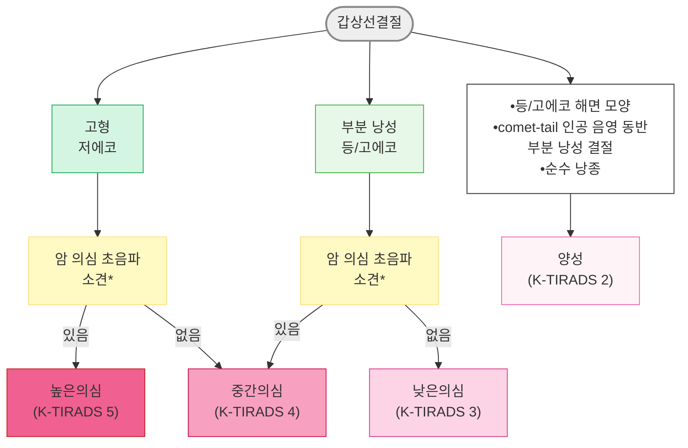

# 갑상선결절 Thyroid Nodule

## <mark style="color:green;">일반 사항</mark>

* 정의 : 촉진 또는 초음파 등 영상검사에서 주변 정상 갑상선 조직과 뚜렷하게 구별되는 병소
  * 촉진되는 병소가 항상 영상학적 이상 소견과 일치하는 것은 아니며, 촉진되지 않지만 영상검사에서 우연히 발견되는 결절(우연종)도 같은 크기의 촉진 결절과 동등한 악성 위험을 가짐
* 여성, 고령, 비만, 요오드 섭취 부족에서 흔함
* 유병률 : 고해상도 초음파검사 시 국내 성인의 30\~40%, 촉진으로는 약 5%에서 발견됨 \[KTA 2024]; 미국 자료에서는 초음파상 최대 68%까지 보고 - 검사 지역·연령·성별에 따라 보고치 편차가 큼
* 임상적 중요성 : 결절의 2\~6%가 갑상선암이며, 악성 여부와 무관하게 크기가 커지면 기도 및 주위 조직을 압박하여 증상을 유발할 수 있음&#x20;
* 경과 : 대부분 변화 없이 지속되며 간혹 서서히 성장 - 5년간 11%에서 결절이 성장했다는 보고가 있음
* 갑상선 기능은 대부분 정상(euthyroid)이며 간혹 항진 또는 저하를 동반
* 선별 검사 : 가족력이 있는 일반인을 포함하여 일률적인 갑상선 초음파 선별 검사는 권고하지 않음 - 조기 진단이 이환율·사망률을 개선한다는 근거가 부족하고, 과잉 진단·과잉 치료로 인한 부작용을 초래할 수 있음 \[KTA 2024]

## <mark style="color:green;">원인 및 위험 인자</mark>

#### <mark style="color:$primary;">양성 (90% 이상)</mark>

* 다결절성 갑상선종(multinodular/sporadic goiter)
* 하시모토 갑상선염(Hashimoto's/chronic lymphocytic thyroiditis)
* 낭종(colloid, simple, or hemorrhagic cyst)
* 여포선종(follicular adenoma) : macro-follicular, micro-follicular, cellular adenoma
* Hürthle 세포선종(oxyphil cell adenoma)

#### <mark style="color:$primary;">악성</mark>

* Papillary carcinoma (가장 흔함)
* Follicular carcinoma : minimally/widely invasive, Hürthle cell type, noninvasive follicular thyroid neoplasm with papillary-like nuclear features(NIFTP)
* Medullary carcinoma, anaplastic carcinoma, primary thyroid lymphoma
* Metastatic carcinoma (유방암, 신세포암 등)

#### <mark style="color:$primary;">악성 위험 인자</mark>

* 두경부 방사선 조사력 (특히 소아기 노출; 위험도는 10\~30 Gy 구간에서 최고조 후 감소)
* 요오드 결핍 (follicular carcinoma 위험 ↑)
* ＜20세 또는 고령에서 발견
* 가족력·유전 : 직계 가족 중 2명 이상의 갑상선분화암(위험도 4.6%) 또는 3명 이상(22.7%)
* 그레이브스병(결절 동반 시 갑상선암 위험 4\~5배 ↑, 유병률 11.5%), 하시모토갑상선염(1.5\~1.8배 ↑), 부갑상선항진증(2.1\~11.3% 동반)과 같은 동반 질환 - 단, 예후가 대조군보다 불량하다는 근거는 부족

### <mark style="color:orange;">고위험군의 갑상선암 선별 검사</mark>

* 직계 가족 중 3명 이상 갑상선분화암 환자가 있어도 일률적인 초음파검사는 권고하지 않음(조기 진단은 가능하나 이환율·사망률 개선 근거 부족)
* 가족성 갑상선암·유전성 종양증후군 가족은 유전상담 후 유전자변이 여부에 따라 선별 검사·치료 시행&#x20;
* 그레이브스병, 하시모토갑상선염, 부갑상선기능항진증 환자에서도 일률적 초음파검사는 권고하지 않음&#x20;
* 위 고위험군이라도 신체검진에서 결절, 비대칭적 갑상선종대, 림프절 종대가 의심되면 초음파검사를 고려&#x20;
* 소아기 두경부 방사선 치료(또는 I-131 MIBG 치료) 과거력이 있는 소아암 생존자는 치료 5년 후부터 1\~2년 간격 촉진 또는 3\~5년 간격 초음파검사 권고

### <mark style="color:$danger;">🚩 Red Flags!</mark>

<mark style="color:$danger;">**즉각 조치 또는 의뢰**</mark>

* 급속히 커지는 단단하고 고정된 종괴 + 애성·연하곤란·호흡곤란 동반 → 미분화암, 기도 폐쇄
* 결절에 의한 기도 압박으로 호흡곤란, 천명(stridor) 발생
* 급격한 성대마비로 흡인 위험이 있는 경우

<mark style="color:$warning;">**당일 또는 조기 의뢰**</mark>

* 1개월 이상 지속되는 애성, 연하곤란&#x20;
* 결절과 동반된 악성 의심 경부 림프절 종대
* 병리진단검사(FNA/CNB)에서 악성 또는 악성의심(Bethesda 범주 V/VI) 결과
* 혈청 칼시토닌이 유의하게 상승(특히 ＞100 pg/㎖) → 갑상선수질암
* 소아에서 높은의심(K-TIRADS 5) 초음파 소견의 결절

<mark style="color:$info;">**외래 추적 / 추가 평가 계획**</mark> <mark style="color:$info;">- 즉각 위험 낮으나 호전 없으면 의뢰</mark>

* 반복 병리진단검사에서 비진단적 결과가 지속
* 결절 성장 - 두 방향에서 2 ㎜ 이상 & 20% 이상 직경 증가, 또는 용적 50% 이상 증가
* 자율기능성 결절로 갑상선항진증이 동반되어 치료 계획 수립이 필요한 경우
* 비정형(AUS)·여포종양 등 미결정 세포검사 결과로 반복 검사 또는 분자표지자검사 등 추가 평가가 필요한 경우

## <mark style="color:green;">진단</mark>

* 결절 발견 시 TSH 등 갑상선기능검사 시행 (☞ [혈액 검사](107_-thyroid-nodule.md#id-1))
  * **TSH↓** 시 갑상선스캔 시행  (☞ [갑상선스캔](107_-thyroid-nodule.md#thyroid-scintigraphy))
  * TSH 정상 또는↑ 시 초음파 시행 (☞ [초음파검사](107_-thyroid-nodule.md#undefined-7))
    * 초음파 위험도(K-TIRADS)에 따라 FNA/CNB 시행 여부 결정 (☞ [FNA/CNB](107_-thyroid-nodule.md#fna-cnb))
      * FNA/CNB 결과가 미결정 범주 시 분자표지자검사 고려 (☞ [분자표지자검사](107_-thyroid-nodule.md#undefined-8))

#### <mark style="color:$primary;">혈액 검사</mark>

* **TSH를 포함한 갑상선기능검사**를 초기 검사로 시행하고, TSH가 낮으면 갑상선스캔을 시행
* 혈청 갑상선글로불린(Tg)의 일률적 측정은 권고하지 않음 - 양성·악성 모두에서 상승 가능해 민감도·특이도가 낮음&#x20;
* 혈청 칼시토닌 : 모든 갑상선결절에서 일률적인 측정을 강하게 권고하지는 않으나, 측정을 고려할 수 있으며 특히 수술 또는 비수술적절제 치료를 앞둔 경우 도움이 됨 - 10 pg/㎖ 기준 갑상선수질암 진단 민감도 100%, 특이도 97.2%; 100 pg/㎖ 이상이면 거의 모두 수질암, 10\~20 pg/㎖에서는 약 5%에서 진단됨 (만성 갑상선염, 신부전 등에서도 상승 가능하므로 해석에 주의)

#### <mark style="color:$primary;">갑상선 스캔 (Thyroid Scintigraphy)</mark>

* 대상 : 혈청 **TSH↓ 시**(갑상선 기능이 정상이면 시행하지 않음), ectopic thyroid tissue 또는 흉골뒤갑상선종 의심 시
* 열결절(hot/hyperfunctioning) : 냉결절보다 악성 가능성은 낮으나, 기능성 결절이라도 초음파에서 암 의심 소견이 있으면 FNA를 고려함
* 냉결절(cold/nonfunctioning) : 악성 가능성 14\~22%

#### <mark style="color:$primary;">갑상선 초음파검사</mark>

* 대상 : ① 결절이 촉진되거나 우연히 발견된 경우, ② **TSH가 정상이거나 높은 경우** (TSH가 낮으면 먼저 갑상선스캔으로 기능 여부를 확인)
* 갑상선결절이 존재하거나 의심되는 모든 환자에서 경부 림프절 평가를 포함한 초음파검사를 권고
* 국내에서는 대한갑상선영상의학회 K-TIRADS에 따라 암 위험도 및 병리진단검사(FNA/CNB) 기준을 적용
* 기저 범주(base composition) : 고형(solid) · 저에코(hypoechoic)는 그 자체로 암 의심 소견은 아니며, 여기에 아래 암 의심 소견이 동반될 때 위험도가 상승함
* **암 의심 초음파 소견** : 점상 고에코 병소(미세석회화), 비평행 방향성(taller-than-wide), 불규칙한 경계(침상 또는 소엽성)
* **양성 시사 소견** : 해면모양(spongiform), 등/고에코, 주변부 혈류, 큰 조대석회화(수질암 제외), 낭성 부분 내 혜성꼬리 인공음영(comet-tail artifact)

<table><thead><tr><th width="66.19049072265625">범주</th><th width="107.14288330078125">초음파 유형</th><th width="364.761962890625">주요 소견</th><th width="89.0477294921875">암 위험도</th><th width="112.2698974609375">FNA/CNB 시행 기준</th></tr></thead><tbody><tr><td>5</td><td>높은의심</td><td>암 의심 소견이 있는 저에코 고형결절</td><td>>60%</td><td>>1 ㎝¹⁾</td></tr><tr><td>4</td><td>중간의심</td><td>① 암 의심 소견 없는 저에코 고형결절 ② 암 의심 소견 있는 부분낭성/등·고에코 결절 ③ 완전 석회화 결절</td><td>10~40%</td><td>>1~1.5 ㎝</td></tr><tr><td>3</td><td>낮은의심</td><td>암 의심 소견 없는 부분낭성 또는 등/고에코 결절</td><td>3~10%</td><td>>2 ㎝</td></tr><tr><td>2</td><td>양성</td><td>등/고에코 해면모양, comet-tail artifact 동반 부분낭성, 순수낭종</td><td>&#x3C;3%</td><td>해당 없음²⁾</td></tr><tr><td>1</td><td>무결절</td><td>-</td><td>-</td><td>-</td></tr></tbody></table>

¹⁾ _경부 림프절전이 의심, 명백한 갑상선외부침범, 확인된 원격전이, 수질암 의심 등 불량한 예후 인자가 있으면 크기와 무관하게 병리진단검사 시행. 작은(＞0.5\~≤1 ㎝) 높은의심 결절이 되돌이후두신경 경로·후내측 피막에 인접한 경우 성인에서도 병리진단검사 권고; 소아는 크기가 작아도 높은의심이면 임상 소견을 고려해 시행._\
²⁾ _양성(K-TIRADS 2) 결절은 원칙적으로 생검 대상이 아니나, 지속적 성장 또는 비수술적절제·수술 예정인 경우 생검 가능._

* 중간의심(K-TIRADS 4)의 시행 기준 1\~1.5 ㎝는 고정값이 아니라, 초음파 소견·결절 위치·임상적 위험 인자·환자 특성(연령, 동반질환, 선호도)을 종합해 그 범위 안에서 결정함
* 병리진단검사(FNA/CNB)의 전체 위음성률은 약 2\~5%(문헌별 0\~3%)로 낮지만, 높은의심 초음파 소견을 보이는 결절에서는 최대 18%까지 보고되므로, 양성으로 확인되었더라도 초음파 소견에 따른 추적관찰이 필요함

#### <mark style="color:$primary;">병리진단검사 - 세침흡인검사(FNA)·중심바늘생검(CNB)</mark>

* 시행 시점 : 초음파 위험도(K-TIRADS)에 따른 시행 기준(크기 cutoff)을 충족하는 결절에서 FNA/CNB 시행 여부를 결정
* FNA는 갑상선결절 진단에 가장 정확하고 비용 대비 효율이 큰 1차 검사&#x20;
* CNB는 FNA의 보완적 수단으로 숙련된 시술자가 선택적으로 시행&#x20;
* FNA 결과는 2023년 개정 Bethesda system(제3판) 6개 범주로 보고&#x20;

<table><thead><tr><th width="136.66668701171875">진단 범주</th><th width="130.4761962890625">성인 암 위험도</th><th width="132.3809814453125">소아 암 위험도</th><th>후속 조치</th></tr></thead><tbody><tr><td>I. 비진단적</td><td>13% (5~20)</td><td>14% (0~33)</td><td>초음파유도하 병리진단검사 재시행</td></tr><tr><td>II. 양성</td><td>4% (2~7)</td><td>6% (0~27)</td><td>즉각적 추가 검사·치료 불필요</td></tr><tr><td>III. 비정형(AUS)</td><td>22% (13~30)</td><td>28% (11~54)</td><td>반복 FNA/CNB 또는 분자표지자검사 후 초음파 추적 또는 수술 결정</td></tr><tr><td>IV. 여포종양</td><td>30% (23~34)</td><td>50% (28~100)</td><td>수술 우선 고려 (2 ㎝ 이상 시 암 위험 ↑)</td></tr><tr><td>V. 악성의심</td><td>74% (67~83)</td><td>81% (40~100)</td><td>악성에 준해 수술적 절제</td></tr><tr><td>VI. 악성</td><td>97% (97~100)</td><td>98% (86~100)</td><td>일반적으로 수술; 저위험군 미세유두암은 적극적 관찰 고려 가능</td></tr></tbody></table>

* CNB는 동일한 6개 범주(대한갑상선학회 병리진단 권고안)를 사용하며, FNA 대비 비진단적 결과 비율이 현저히 낮고(1.1\~3.8% vs 28.1\~40.0% 재검 시) 여포종양 감별에 특히 유용(진단 민감도 80\~91% vs FNA 74%)하여, 비진단적 결과가 반복되거나 여포종양이 의심될 때 FNA의 실질적 대안이 됨
* 비진단적 결과 반복 시 : 낭성이면서 높은의심 소견이 없으면 주의 깊은 추적관찰 가능; 높은의심 소견, 추적 중 20% 이상 크기 증가, 임상적 암 위험 인자가 있으면 진단 목적의 수술적 절제 고려
* 비정형(AUS, Atypia of Undetermined Significance) : 경험 많은 병리의 재판독을 우선 고려; 반복 FNA/CNB 또는 분자표지자검사로 위험도 재평가 후 초음파 추적 또는 수술 결정
* 여포종양(Bethesda IV) : 수술 우선 고려; 종양 크기가 2 ㎝, 3 ㎝, 4 ㎝ 이상으로 커질수록 암 위험도가 각각 1.63배, 2.39배, 2.29배 증가&#x20;

#### <mark style="color:$primary;">분자표지자검사</mark>

* 검사 대상 : 병리진단검사에서 비정형(AUS)·여포종양·악성의심 등 미결정(indeterminate) 범주로 나온 결절 - 임상적 위험 요소, 세포검사 결과, 초음파 소견, 환자 선호도를 종합하여 시행 여부를 결정&#x20;
* BRAF<sup>V600E</sup> : 유두암 진단 특이도 높음; 아시아처럼 돌연변이 빈도가 높은 지역에서는 비정형 결절의 암 위험도를 33\~57%에서 71\~88%까지 상승시킴
* RAS(NRAS/HRAS/KRAS) : 악성 양성 예측도 약 66%; NIFTP·양성 종양에서도 검출될 수 있어 해석에 주의
* TERT 프로모터 돌연변이 : 특이도는 높으나 민감도 낮음; BRAF<sup>V600E</sup> 또는 RAS와 동반되면 예후 불량(TNM 병기 ↑, 원격 전이 11.7배, 재발 4.3배, 사망 15배)의 표지자
* 차세대염기서열(NGS) 기반 유전자패널검사 : 단일 유전자검사보다 진단 정확도가 높음(민감도 74\~94%, 특이도 68\~85%); 검사 후 암 위험도 상승 폭은 아시아가 서구보다 더 크게 보고되나(예: 비정형 결절 27.1\~43.0% vs 17.0\~26.0%), 지역·기관·적용 패널 종류에 따른 변이가 커서 자체 기관 자료 없이 서구 수치를 그대로 적용하는 것은 주의가 필요함

### <mark style="color:orange;">18F-FDG PET/CT 우연종</mark>

* 다른 목적의 PET/CT에서 우연히 발견된 갑상선 국소 섭취(focal uptake)는 악성 가능성이 높으므로(30.8%; K-TIRADS 5인 경우 90% 이상) 초음파 소견을 고려해 병리진단검사 시행
* 미만 섭취(diffuse uptake)이면서 임상·초음파 소견이 만성 림프구성 갑상선염에 합당하면 추가 검사는 불필요

### <mark style="color:orange;">다결절성 갑상선종</mark>

* 1 ㎝ 초과 결절이 2개 이상인 경우 단일 결절과 동일하게 평가하며, 결절마다 독립적 악성 위험이 있으므로 초음파 소견에 근거해 1개 이상 결절에서 FNA 고려; 가장 크거나 가장 만져지는 결절만 검사하면 암을 간과할 수 있음
* 악성 의심 소견 없이 유사한 융합성 결절이 다수라면 가장 큰 결절(＞2 ㎝)에서 FNA를 시행하거나 FNA 없이 관찰 가능
* 혈청 TSH가 낮으면 자율기능성 결절 가능성을 평가하기 위해 갑상선스캔 시행

### <mark style="color:orange;">감별</mark>

<table><thead><tr><th width="150">범주</th><th>주요 질환</th></tr></thead><tbody><tr><td>양성 (90% 이상)</td><td>multinodular goiter, Hashimoto's thyroiditis, colloid/simple/hemorrhagic cyst, follicular/Hürthle cell adenoma</td></tr><tr><td>악성</td><td>papillary·follicular·medullary·anaplastic carcinoma, primary thyroid lymphoma, 전이암(유방암, 신세포암 등)</td></tr></tbody></table>



_\*점상 고에코 병소(미세석회화), 비평행 방향성(taller-than-wide), 불규칙한 경계(침상 또는 소엽성)_

<p align="center"><strong>K-TIRADS 기반 갑상선결절 악성 위험 계층화 알고리듬</strong></p>

<p align="center"><em><mark style="color:$info;">Ref. 대한갑상선영상의학회. 2021 K-TIRADS and Imaging-based management of Thyroid nodules; 대한갑상선학회 갑상선결절 진료권고안 2024, Table 2.2.A</mark></em></p>

***

## <mark style="background-color:$warning;">Management</mark>


* 병리진단 범주별 관리 원칙 **:** 비진단적 → 재검; 양성 → 관찰; 비정형/여포종양 → 위험도 재평가 후 관찰 또는 수술; 악성의심/악성 → 수술(저위험 미세유두암은 적극적 관찰 선택 가능)

### <mark style="color:orange;">양성 결절의 장기 추적관찰</mark>

<mark style="color:cyan;">**병리진단검사에서 양성으로 확인된 결절**</mark>

<table><thead><tr><th width="150">초음파 소견</th><th>추적 계획</th></tr></thead><tbody><tr><td>높은의심</td><td>6~12개월 내 초음파; 크기 감소 없으면 병리진단검사 반복(1 ㎝ 이하는 반복 없이 초음파 추적 고려)</td></tr><tr><td>낮은/중간의심</td><td>12~24개월에 초음파; 크기 증가(두 방향 ≥2 ㎜ &#x26; ≥20% 직경 증가, 또는 용적 ≥50% 증가) 또는 새로운 의심 소견 시 병리진단검사 또는 지속 관찰</td></tr><tr><td>양성 초음파 소견</td><td>악성 위험을 고려한 추적 초음파는 불필요</td></tr></tbody></table>

<mark style="color:cyan;">**병리진단검사 적응증에 해당하지 않는 결절**</mark>

<table><thead><tr><th width="150">초음파 소견</th><th>추적 계획</th></tr></thead><tbody><tr><td>높은의심</td><td>초기 1~2년은 6~12개월 간격, 이후 안정적이면 1년 간격</td></tr><tr><td>낮은/중간의심</td><td>1~2년 이상 간격(1 ㎝ 이하 낮은의심은 2~5년 이후 고려)</td></tr><tr><td>양성 초음파 소견</td><td>필요 시 2~5년 이후 고려</td></tr></tbody></table>

* 반복적으로 양성으로 진단되고 초음파 소견의 변화가 없으면 추가 병리진단검사는 불필요
* 위 추적관찰 기준(20% 이상 직경 증가 등)을 충족했다고 해서 반드시 수술이 필요한 것은 아니며, 반복 병리진단검사에서 양성이 유지되면 환자 증상·선호도를 고려하여 관찰을 지속할 수 있음

### <mark style="color:orange;">악성 또는 악성 의심 결절</mark>

* 병리진단검사 결과가 악성인 경우 일반적으로 수술적 절제를 권고
* 저위험군 성인 미세갑상선유두암(임상적 전이·갑상선외부침범 없고 공격적 조직아형 근거 없음)에서는 적극적 관찰(active surveillance)을 선택할 수 있음 - 진단 후 6\~12개월째 첫 초음파, 이후 안정적이면 매년 추적(크기·부피 증가가 의심되면 3\~6개월 간격으로 단축해 확인); 진행(최대 직경 3 ㎜ 이상 증가, 부피 50% 이상 증가, 또는 새로운 림프절전이) 확인 시 수술
* 림프절/원격전이 의심, 육안적 갑상선외부침범·기관/되돌이후두신경 침범 의심, 공격적 조직아형(긴세포, 원주세포, hobnail 등)이 있으면 적극적 관찰 대상에서 제외하고 수술 우선

## <mark style="color:green;">비-약물 치료 및 예방</mark>

* 증상 없는 양성 결절은 대부분 치료가 필요하지 않으며 정기적 초음파 추적관찰이 원칙
* 요오드 섭취를 극단적으로 제한하거나 과잉 섭취하지 않도록 안내(결핍·과잉 모두 결절·기능 이상과 연관)
* 압박 증상·미용 문제가 실제 결절에 기인한 것인지 영상 검사로 확인 후 비특이 증상과 감별

## <mark style="color:green;">약물 치료</mark>

#### <mark style="color:$primary;">Levothyroxine 억제 요법</mark>

* 양성 갑상선결절에 대한 일률적인 갑상선호르몬 억제 치료는 권고하지 않음 - 저요오드 지역에서 결절 크기를 5\~15% 정도 줄일 수 있다는 보고가 있으나, 국내처럼 요오드가 충분한 인구에서는 이 근거가 적용되지 않으며, TSH를 과도하게 억제할 경우 부정맥·골다공증 위험이 이득을 상회함
* 결절 억제만을 목적으로 정상인을 의도적으로 subclinical hyperthyroidism 상태로 만드는 치료는 권장하지 않음
* 크기가 증가하는 양성 결절에서도 LT4 억제 요법에 대한 자료는 없음
* 경과 관찰 중 크기가 다소 증가하였으나 반복 세포검사에서 양성인 경우, 대부분의 무증상 결절은 치료 없이 추적관찰&#x20;

## <mark style="color:green;">비수술적 절제 치료</mark>

* 반복 병리진단검사에서 양성이라도 ① 압박 증상, ② 미용적 문제, ③ 자율기능성 결절(갑상선항진증 동반) 중 하나에 해당하면 치료를 고려 - 수술, 방사성요오드, 비수술적절제(에탄올·고주파·레이저절제술) 중 임상 특성·동반 질환·환자 선호를 고려해 선택
* 대상 결절 정의 : FNA 또는 CNB에서 2회 이상 양성(K-TIRADS 2 및 자율기능성 결절, 순수 낭종은 1회 양성/비진단적으로도 가능); 여포종양·악성의심(범주 4\~6)은 반복 양성이었어도 대상에서 제외
* **고형/고형우세 결절** : 고주파절제술 또는 레이저절제술이 우선 권고; 에탄올절제술은 결절 내 불균일 확산·누출 위험으로 권고하지 않음
* **재발성 낭성 결절** : 단순 흡인 우선 시도 후 재발 시 에탄올절제술이 1차 치료
* **자율기능성 결절** : 방사성요오드 치료 또는 수술을 1차 치료로 우선 고려 - 임상에서 고주파절제술을 첫 선택으로 시행하는 경우가 있으나, 이는 RAI·수술을 거부하거나 금기인 경우의 대안(2차 선택지)임; 작은 결절일수록 RFA 후 TSH 정상화율이 높음(10 ㎖ 미만 74% vs 30 ㎖ 이상 19%)
* **제외 대상** : 흉골뒤갑상선종, 크기가 매우 큰 결절(약 6\~7 ㎝ 이상), K-TIRADS 5 또는 악성·여포종양 의심 결절
* ＞4 ㎝로 성장하며 압박증상이 심하거나 악성이 우려되는 결절은 수술 고려

***

## ■ 임신부의 갑상선결절


* 원칙 : 비임신부와 마찬가지로 초음파 소견에 근거해 FNA 여부를 결정
* 예외 : 임신 초기 이후에도 TSH가 지속적으로 낮아 자율기능성 결절 여부를 감별해야 하는 경우, 임신 중에는 갑상선스캔을 시행할 수 없으므로 스캔이 가능한 산후까지 병리진단검사를 미룰 수 있음
* 임신 초기 진단된 갑상선암은 초음파로 추적하며, 임신 24주까지 의미 있는 성장 또는 경부 림프절전이가 확인되면 수술을 고려; 임신 중기까지 변화 없거나 임신 후기 진단이면 분만 후 수술 가능; 진행된 갑상선암은 임신 중기 수술이 바람직함
* 방사성요오드(RAI) 치료는 임신 중 절대 금기이며, 자율기능성 결절로 인한 갑상선중독증이 있어도 임신 중에는 항갑상선제 등으로 조절하고 RAI는 산후로 미룸

***

### <mark style="color:red;">질병코드</mark>

E04.1 비독성 단일 갑상선결절

E04.2 비독성 다결절성 갑상선종

D34 갑상선의 양성 신생물

C73 갑상선의 악성 신생물

***

## <mark style="color:purple;">처방례</mark>

> **처방례 1. 초진 — 초기 검사 오더**
>
> ```
> 갑상선기능검사(TSH, free T4 포함)  1회
> 갑상선 초음파(경부 림프절 평가 포함)  1회
> ```
>
> _✽가이드라인상 필수 항목은 TSH이나, 실제 외래에서는 free T4를 함께 시행하는 경우가 많음; TSH가 정상이거나 높으면 초음파로 K-TIRADS 위험도를 평가하고, TSH가 낮으면 갑상선스캔을 추가로 시행_

> **처방례 2. 높은의심(K-TIRADS 5) 결절 — 병리진단검사 의뢰**
>
> ```
> 갑상선 초음파유도 FNA(또는 CNB)  1회
> ```
>
> _✽1 ㎝ 초과 시 시행; 0.5\~1 ㎝이라도 되돌이후두신경 경로에 인접한 고위험 소견이 있으면 시행 고려_

> **처방례 3. 양성 결절(K-TIRADS 3\~4) — 추적관찰 계획**
>
> ```
> 갑상선 초음파  12\~24개월 후 재검
> ```
>
> _✽두 방향에서 2 mm 이상 & 20% 이상 직경 증가, 또는 용적 50% 이상 증가 시 병리진단검사 고려; 일률적 levothyroxine 억제요법은 시행하지 않음_

> **처방례 4. 자율기능성 결절(TSH↓, 갑상선중독증 동반) — 협진 의뢰**
>
> ```
> 갑상선 스캔  1회
> 내분비내과 의뢰 (방사성요오드 치료 또는 수술 상담)
> ```
>
> _✽전신 증상이 심하면 의뢰 전 propranolol 등 베타차단제로 증상 조절 고려; 항갑상선제는 근본 치료가 아니므로 장기 단독 사용은 권장하지 않으며, 자율기능성 결절의 근본적 해결(치료 종결)을 위해서는 결국 방사성요오드 치료 또는 수술이 필요함_

> **처방례 5. 압박·미용 증상 동반 양성 고형결절 — 비수술적절제 의뢰**
>
> ```
> 영상의학과/갑상선센터 의뢰 (고주파절제술 또는 레이저절제술 상담)
> ```
>
> _✽2회 이상 양성 확인된 고형결절에 한함; K-TIRADS 5, 여포종양·악성의심 결절, 흉골뒤갑상선종은 제외_

***

### <mark style="color:$success;">핵심 복약 지도</mark>

> **검사 결과를 어떻게 설명할까요?**
>
> * FNA/CNB에서 "양성"이 나와도 위음성률이 약 2\~5%(높은의심 초음파 소견 결절에서는 더 높음)이므로, 초음파 소견에 따라 정해진 일정대로 추적관찰이 필요함을 설명합니다.
> * "비정형" 또는 "여포종양"처럼 애매한 결과는 암이 아니라 **진단이 불확실하다는 뜻**이며, 반복 검사나 분자표지자검사로 위험도를 좁혀갈 수 있음을 안내합니다.

> **추적관찰 순응도**
>
> * 결절이 커지는 것 자체가 곧 암을 의미하지는 않지만, 정해진 기준(20% 이상 직경 증가 등)을 넘으면 재검사가 필요하므로 예약된 초음파 일정을 지키도록 안내합니다.
> * 갑상선호르몬제(levothyroxine)를 결절 억제 목적으로 임의로 복용하지 않도록 설명 — 효과는 미미한 반면 부정맥·골다공증 위험이 있습니다.

> **언제 다시 병원을 방문해야 하나요?**
>
> * 목소리가 쉬거나 삼키기 어려운 증상이 1개월 이상 지속되는 경우
> * 결절이 빠르게 커지거나 단단하게 만져지는 경우
> * 호흡곤란이나 숨쉴 때 그렁거리는 소리가 발생하는 경우 — 즉시 내원
> * 예정된 추적 초음파나 재검을 놓친 경우

***

### <mark style="color:blue;">환자 안내서</mark>


**갑상선결절, 대부분은 걱정하지 않아도 됩니다**

갑상선결절은 매우 흔해서 초음파로 검사하면 성인 3\~4명 중 1명에서 발견됩니다. 이 중 실제로 암인 경우는 100명 중 2\~6명 정도이며, 나머지는 대부분 치료가 필요 없는 양성 결절입니다.


#### <mark style="color:$primary;">왜 결절이 생기나요?</mark>

* 갑상선 조직 일부가 정상보다 과도하게 자라면서 만들어지는 경우가 대부분입니다.
* 여성, 고령, 요오드 섭취 부족, 방사선 노출력, 가족력이 있으면 더 잘 생길 수 있습니다.
* 건강검진에서 우연히 발견된 결절도 대부분 양성이며, **발견되었다는 이유만으로 수술이 필요한 것은 아닙니다.**

#### <mark style="color:$primary;">검사는 어떻게 진행되나요?</mark>

* 혈액검사로 갑상선 기능을 먼저 확인하고, 초음파로 결절의 모양을 평가합니다.
* 초음파에서 암이 의심되는 모양이거나 크기가 일정 기준을 넘으면 \*\*가는 바늘로 세포를 채취하는 검사(FNA)\*\*를 시행합니다. 바늘이 가늘어 대부분 통증이 크지 않습니다.
* 검사 결과가 "애매하다"고 나올 수 있는데, 이는 암이라는 뜻이 아니라 조금 더 지켜보거나 추가 검사가 필요하다는 의미입니다.

#### <mark style="color:$primary;">치료가 필요한가요?</mark>

* 양성으로 확인되면 대부분 **치료 없이 정기적인 초음파 추적**만으로 충분합니다.
* 갑상선호르몬제를 결절을 줄이려는 목적으로 복용하는 것은 권장하지 않습니다.
* 결절이 커서 목이 눌리거나 미용적으로 불편하면 고주파·레이저절제술 같은 비수술적 치료나 수술을 상의할 수 있습니다.
* 암으로 진단되면 대부분 수술을 하지만, 매우 작고 위험도가 낮은 갑상선유두암은 \*\*당장 수술하지 않고 정기적으로 지켜보는 방법(적극적 관찰)\*\*을 선택할 수도 있습니다.

#### <mark style="color:$primary;">이럴 때는 즉시 병원을 방문하세요</mark>

* **목소리가 쉬거나 음식을 삼키기 어려운 증상**이 한 달 이상 계속될 때
* 목의 혹이 **빠르게 커지거나 딱딱하게** 만져질 때
* **숨쉬기가 힘들거나 숨소리가 그렁거릴 때** — 즉시 응급실
* 정해진 추적 초음파 일정을 잊지 않고 지켜주세요.
