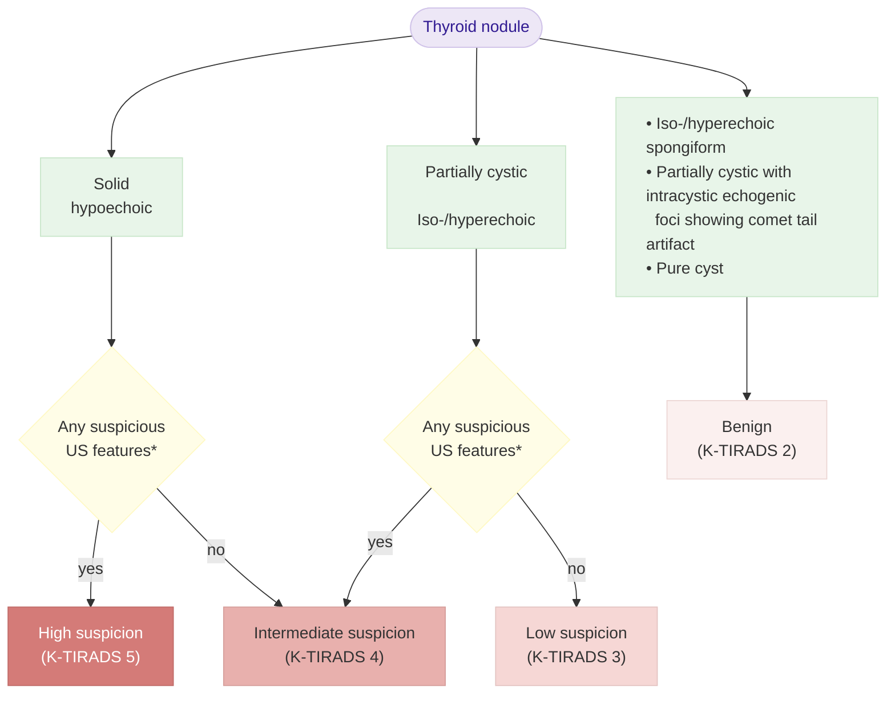

# 갑상선결절 Thyroid Nodule

## 일반 사항

* 초음파상 일반 인구의 68%까지 갑상선 결절이 관찰됨 \[미국]
* 여성, 고령, 비만, 요오드 섭취가 부족한 사람에서 흔함
* 촉진되는 결절이 항상 영상학적 이상 소견과 일치하는 것은 아님
* 일반적으로 ≥1 ㎝인 경우 암의 위험이 있음
* 경과 : 보통 변화 없이 지속, 간혹 서서히 성장 (5년 동안 ＞15%에서 성장)
* 갑상선 기능은 보통 정상(euthyroid)이며 간혹 항진 또는 저하를 보임
* 가족력이 있는 경우를 포함하여 일반인에 대한 선별 검사는 권고하지 않음; 선별 검사는 환자의 결과를 개선하지 못하며, 과잉 진단/과잉 치료와 이에 따른 부작용을 초래할 수 있음

### 악성 의심 임상 양상

* (1개월 이상) 지속되는 발성 장애, 삼킴곤란, 호흡 곤란
* 점차 커지는 nodule, 고정된 nodule; 단단함(firm or hard)
* 경부 adenopathy

## 원인 및 위험 인자

#### 양성

* (90% 이상 해당)
* multinodular(sporadic) goiter
* Hashimoto’s(chronic lymphocytic) thyroiditis
* cysts : colloid, simple, or hemorrhagic
* follicular adenoma : macro-follicular or micro-follicular adenoma, cellular adenoma
* Hürthle cell(oxyphil cell) adenoma : macro- or micro-follicular pattern

#### 악성

* papillary carcinoma
* follicular carcinoma : minimally or widely invasive, Hürthle cell type, noninvasive follicular thyroid neoplasm with papillary-like nuclear feature
* medullary carcinoma, anaplastic carcinoma, primary thyroid lymphoma
* metastatic carcinoma (breast, renal cell, others)

### 악성 위험 인자

* 유전, 가족력 : 갑상선암, MEN2형(medullary carcinoma),
* 두경부 방사선 조사(papillary carcinoma), 요오드 결핍(follicular carcinoma)
* ＜20세 또는 ＞70세에서 발견

## 진단

* 결절 발견 시 TSH 등 갑상선 기능 검사 → ① TSH↓ 시 thyroid scan 시행, ② TSH 정상 or ↑시 초음파 시행 → 악성 의심 시 FNA 시행

### Thyroid Scintigraphy

#### 대상

* TSH↓; 갑상선 기능이 정상인 경우 thyroid scan은 시행하지 않음
* ectopic thyroid tissue 또는 retro-sternal goiter 의심

#### 결과

* 열결절 (hot or hyperfunctioning nodule) : 악성 가능성 희박; FNA를 생략할 수 있음
* 냉결절 (cold or nonfunctioning nodule) : 악성 가능성 14\~22%

### 초음파 검사

#### 대상

* 비정상적으로 만져지는 갑상선결절 또는 다결절 갑상선종
* 갑상선 악성 종양 위험군
* 악성이 의심되는 림프절병증

#### 악성 의심 소견

* 폭보다 앞뒤가 긴 모양(taller than wide), nonparallel orientation
* 바늘모양(spiculated) 또는 불규칙한 경계(irregular margin)
* solid, hypoechoic, incomplete halo, central vascularity, 미세 석회화
* 경부 림프절 비대 동반

#### 양성 의심 소견

* spongiform, hyperechoic, peripheral vascularity, large/coarse calcifications(medullary cancer 제외)
* puff 또는 Napoleon pastry 모양
* comet tail shadowing

### 세침흡인세포검사 (fine needle aspiration cytology, FNAC)

#### K-TIRADS에 따른 갑상선 결절의 암 위험도 및 FNA 시행 기준

다음은 이미지에 있는 **K-TIRADS 갑상선 결절 초음파 분류표**를 표 형태로 정리한 것입니다.

| **카테고리**      | **초음파 유형**                                                                           | **암 위험도** | **FNA 시행 기준** |
| ------------- | ------------------------------------------------------------------------------------ | --------- | ------------- |
| **\[5] 높은의심** | 초음파상 악성 의심 소견 3개 중 1개 해당되는 저에코 고형결절 혹은 ① 초음파상 악성 의심 소견이 없는 저에코 고형결절 혹은 ② 완전히 석회화된 결절 | >60%      | >1 cm³        |
| **\[4] 중간의심** | 초음파상 악성 의심 소견이 있는 부분 낭성 혹은 iso/고에코 결절                                                | 10\~40%   | ≥1\~1.5 cm³   |
| **\[3] 낮은의심** | 초음파상 악성 의심 소견이 없는 부분 낭성 혹은 iso/고에코 결절                                                | 3\~10%    | ≥2 cm³        |
| **\[2] 양성**   | Iso/hyperechoic spongiform comet tail artifact & intracytic echogenic foci가 있는 부분 낭  | <3%       | 적용증 아님        |
| **\[1] 무결절**  | -                                                                                    | -         | -             |

K-TIRADS=Korean thyroid imaging reporting & data system. PTC = papillary thyroid carcinoma

1. punctate echogenic foci, nonparallel orientation, irregular margin
2. discrete nodule(PTC의 diffuse sclerosing variant 의심)이 없는 extensive parenchymal punctate echogenic
   \
   foci(microcalcification) 및 광범위 침윤성 병변(전이 또는 림프종 등 침윤성 악성 종양 의심)은 K-TIRADS 4로
   \
   간주
3. 악성 의심 소견의 존재와 상관 없음
4. 자궁 경부 림프절 전이 의심, 갑상선 외 인접 구조(기관, 후두, 인두, 반회후두신경, 갑상선 주위 혈관)로의 확장이
   \
   명백, 확인된 원격 전이, medullary Ca 의심 등 나쁜 예후 위험 인자가 있는 경우 결절에 크기 무관하게 FNA 시행
5. ＞0.5 ㎝ & ≤ 1 ㎝ : 즉시 수술이 필요한 고위험 microcarcinoma의 가능성을 고려하여 반회후두신경을 따라
   \
   post-med capsule 또는 기관에 접한 결절 등 고위험 특징이 있는 작은 K-TIRADS 5 결절에서 검사 고려; 성인의
   \
   관리 계획을 결정하기 위해 고위험 특징이 없는 작은 K-TIRADS 5 결절에 대하여 고려 가능
6. 초음파상 특징, 결절 위치, 임상 위험 인자, 환자 요인(나이, 동반 질환, 선호도)에 기초하여 결정
7. 일상적인 적응증은 아니지만 지속되고 유의미한 성장을 보이거나 이전에 ablation 또는 수술을 했던 결절에
   \
   대하여 시행할 수 있음
   \
   Ref. 대한갑상선학회. 2021 K-TIRADS and Imaging-based management of Thyroid nodules. Table 5.

\*Punctate echogenic foci (microcalcifications),
\
nonparallel orientation (taller than wide shape),
\
irregular margins.

갑상선 결절의 악성 위험 계층화 알고리즘
\
K-TIRADS = Korean Thyroid Imaging Reporting and Data System, US =ultrasonography
\
Ref. 대한갑상선학회. 2021 K-TIRADS and Imaging-based management of Thyroid nodules. Fig 9.

***

## Management

## 양성 결절

* 대부분 정상 갑상선 조직의 과성장
* 일률적인 약물 투여는 권고하지 않음; 약물 치료에 의한 크기 감소가 적으며 부작용을 고려

#### 추적 관찰

* 높은의심 초음파 소견 : 12개월 내 초음파 및 초음파유도 FNA 시행
* 낮은의심 또는 중간의심 초음파 소견 : 12\~24개월 내 초음파 시행 → 결절 크기 증가(적어도 두 방향에서 ≥2 ㎜ 이면서 ≥20%의 직경 증가 확인 or ≥50% 용적 증가) 또는 새로운 의심 소견 관찰 시 FNA 시행 또는 지속 관찰; 지속적인 크기 증가를 보이면 FNA 시행
* 낮은의심 초음파 소견(spongiform 결절 포함) : 24개월 이후 초음파 검사 시행 고려
* ＜1 ㎝ 낮은의심 초음파 소견(spongiform 결절 포함), 순수 낭종 : 초음파 추적 검사 시행 않음
* 반복적으로 추적 검사한 초음파유도 FNA에서 양성 시 초음파 검사는 더 이상 시행하지 않음

## 약물 치료

#### Levothyroxine

* 투여 고려 대상 : 요오드 섭취가 부족한 환자, ≥2 ㎝ & TSH 정상/↑
* 투여 제외 대상 : 오래된 goiter, TSH↓, ＜2 ㎝ & TSH 정상, 폐경 여성, ≥60세 남성, 골다공증, 허혈성 심장 질환 또는 전신 질환을 가지고 있는 경우
* 용량
  * 시작 : 50 ㎍/d \[씬지로이드]
  * 유지 : TSH를 약간(0.1\~0.8 mIU/L) 억제하는 수준으로 유지하며 최소한 매년 TSH 검사
  * ✽levothyroxine 투여 시 결절 성장이 줄었다는 보고가 있음 : 결절 성장- 투여 환자 29% vs 투여하지 않은 환자 56%; 새로운 결절 출현- 투여 환자 8% vs 투여하지 않은 환자 29%; 투여 환자에서 결절 성장이 50% 이상 감소한 경우는 20%

### 물리적 치료

* ＞4 ㎝으로 결절이 성장하면 증상이나 임상적 염려에 근거하여 수술적 제거 고려
* 재발하는 낭성 결절 또는 압박 증상이나 미용상의 문제가 있는 결절에 대하여 에탄올, 레이저, 고주파절제술 고려

## 악성 또는 악성 의심

* 수술적 제거
* 반복적 검사에도 악성 여부가 감별되지 않는 경우에도 수술적 절제 고려

### **질병코드**&#x20;

D34 갑상선의 양성 신생물

C73 갑상선의 악성 신생물
