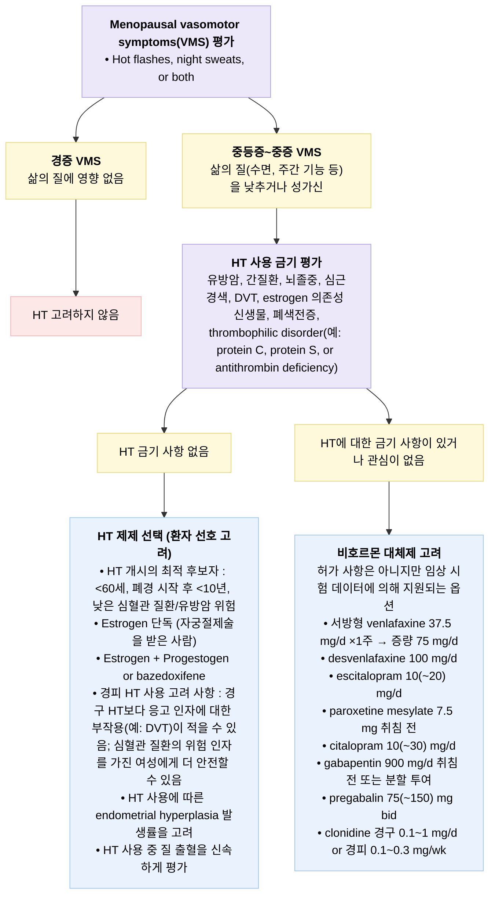
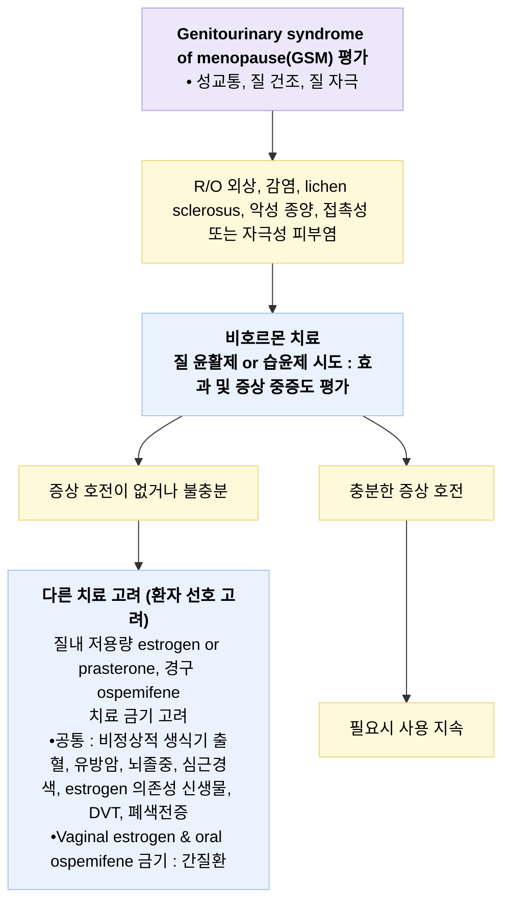

# 폐경기증후군 Menopause Syndrome

## <mark style="color:green;">일반 사항</mark>

* 폐경 : 병적 원인 없이 마지막 월경일로부터 12개월 이상 월경을 하지 않는 상태
* 다른 이름 : 갱년기증후군, climacteric syndrome
* 평균 폐경 연령 : 51세
* 의의 : 폐경은 생리적인 현상이지만 혈관운동 증상(vasomotor symptoms, VMS)에 의한 불편감과 심혈관 질환, 골다공증성 골절 등 의학적 문제를 증가시킴; 폐경기와 자녀들의 사춘기, 중년의 정체성 위기, 부부 갈등, 경제적 문제 등과 겹쳐지면 더욱 복잡한 문제를 일으킬 수 있음
* 조기 폐경 : ＜40세에서 불규칙 월경 또는 월경 중단; 모든 원인의 사망률 증가, 심혈관 질환, 당뇨병, 우울증, 골다공증과 연관; 원인 질환 감별 및 건강 관리를 요함

<mark style="color:cyan;">**STRAW (Staging of Reproductive Aging Workshop) staging system**</mark>

<table><thead><tr><th width="320.4761962890625">STRAW 단계</th><th width="429.5238037109375">정의</th></tr></thead><tbody><tr><td>Menopausal transition, stage -2 (early)</td><td>월경 주기 변화(정상 주기에서 ＞7일 변동); 평균 4년 후 폐경</td></tr><tr><td>Menopausal transition, stage -1 (late)</td><td>≥2 주기 및 ≥60일 무월경</td></tr><tr><td><em>— 마지막 월경일(FMP) —</em></td><td></td></tr><tr><td>Postmenopause, stage +1 (early)</td><td>최종 월경부터 ＜5년</td></tr><tr><td>Postmenopause, stage +2 (late)</td><td>최종 월경부터 ≥5년</td></tr></tbody></table>

**\[대한폐경학회]**

* 폐경이행기 : 월경 주기의 변동 증가\~마지막 월경일 직전
* 폐경주변기 : 폐경이행기\~마지막 월경 후 1년

## <mark style="color:green;">원인 및 위험 인자</mark>

* 연령 증가에 따른 난소 기능 상실
* 난소 절제, 자궁 절제
* 성염색체 이상(예: 터너증후군)

#### <mark style="color:$primary;">조기 폐경 위험 인자</mark>

* 조기 폐경 가족력, 유전적 소인(예: FMR1 premutation)
* 흡연(비흡연의 경우보다 2년 단축), 음주
* 자가면역질환(예: 갑상선염, 애디슨병)
* 정신적 스트레스(예: 우울)
* 화학요법, 방사선 치료, 1형 당뇨병
  * 임신과 모유 수유가 조기 폐경 위험을 낮춘다는 보고가 있음
  * ✽저체중과 조기 폐경의 연관 가능성이 일부 메타분석에서 제기되었으나 일관된 근거는 부족함; 비만과의 연관성은 더욱 근거가 약함

## <mark style="color:green;">임상 양상</mark>

* 불규칙 월경 : 기간 및 양의 불규칙, 과소 & 과다 월경 (☞ p.692 — _file-based cross-reference 확인 필요_)
* VMS : 돌발적 안면 홍조(hot flush, hot flash, 보통 2\~4분간 지속), 발한, 두근거림, 수면 장애; 중년 여성의 70%가 경험
  * stage -1\~+1 시기에 심하며 평균 4\~10년간 발생; ＞70세의 9%에서 지속
  * 폐경 전 난소 절제, 비만, 우울증, 낮은 경제/교육 수준, 흡연 여성에서 보다 심함
* 정신적 증상 : 우울, 불안, 불안정, 집중력 저하, 월경성 편두통 악화
  * 폐경 전에 비하여 우울 증상 발생이 최대 2.5배까지 증가한다는 보고가 있음
* 골다공증, 피부 건조, 탈모/머리카락 가늘어짐, 손톱 부서짐
  * VMS이 심할수록 골다공증 유병률이 높다는 보고가 있음

### <mark style="color:orange;">폐경기비뇨생식증후군(genitourinary syndrome of menopause, GSM)</mark>

* 폐경기 estrogen 감소에 따른 외음부 및 방광-요도의 위축성 변화; 폐경 여성의 약 50\~80%가 경험(문헌마다 편차 있음)
* 생식기 증상 : 건조, 작열, 가려움, 출혈, 질염; 성교통, 성욕 감퇴, 성 기능 저하
* 비뇨기 증상 : 절박뇨, 배뇨통, 반복 요로 감염
* 감별 : 외음부/요로 감염 (☞ p.622, p.658 — _file-based cross-reference 확인 필요_), 자극성 피부염(예: 향수, 탈취제, 비누, 윤활제, 패드, 팬티), 암, pelvic floor dysfunction

***

### <mark style="color:$danger;">🚩 Red Flags!</mark>

<mark style="color:$danger;">**즉각 조치 또는 의뢰**</mark> <mark style="color:$danger;">- 생명 위협 또는 즉각적 위해 가능성</mark>

* HRT(호르몬 치료) 사용 중 편측 하지 부종·통증·발적 → 심부정맥혈전증(DVT) 의심
* 급성 흉통, 호흡곤란, 객혈 → 폐색전증 의심 (특히 HRT 시작 1\~2년 이내)
* 급성 편측 위약, 안면 마비, 언어 장애, 갑작스런 심한 두통 → 뇌졸중 의심
* 흉통, 방사통, 발한을 동반한 급성 증상 → 급성 관상동맥증후군(불안정 협심증, 심근경색 포함) 의심
* 다량의 질출혈로 빈맥·저혈압 등 혈역학적 불안정 동반

<mark style="color:$warning;">**당일 또는 조기 의뢰**</mark>

* 폐경 후(마지막 월경 후 12개월 이상 무월경 이후) 발생한 질출혈 → 자궁내막암 감별 위해 산부인과 의뢰
* 유방 촉지 종괴, 유두 분비물, 피부 변화 등 유방암 의심 소견 → 유방외과 의뢰
* HRT 사용 중 지속되거나 반복되는 비정상 자궁 출혈 → 자궁내막 평가 위해 의뢰
* HRT를 고려 중이나 활동성 간질환, 미치료 고혈압, 정맥혈전증/동맥혈전증 병력 등 금기에 해당하는 경우 → 치료 방침 결정을 위한 전문의 협진
* ＜40세 조기 폐경 또는 무월경 → 원인 질환 감별 위해 부인과/내분비내과 의뢰

<mark style="color:$info;">**외래 추적 / 추가 평가 계획**</mark> <mark style="color:$info;">- 즉각 위험 낮으나 호전 없으면 의뢰</mark>

* 생활 습관 교정 및 1차 약물 치료 4\~8주 후에도 VMS 호전이 없는 경우
* 골다공증 위험 인자가 있는 폐경 여성의 골밀도(DXA) 검사 계획 및 추적
* GSM 증상이 국소 치료에 반응하지 않는 경우

***

## <mark style="color:green;">진단</mark>

* 신장, 몸무게, 혈압, 유방/골반 진찰
* 감별 질환 : 임신, 갑상선 항진/저하증, 공황장애, 당뇨병, 약물(antiestrogen, SERM), 종양, 기타 시상하부/부신/난소 이상

### <mark style="color:orange;">실험실 검사</mark>

* ≥45세 : 일반적으로 필요 없음; 갑상선항진증 의심 시 TSH 검사, 필요시 s-hCG
* 40\~45세 : s-hCG, prolactin, TSH, FSH
  * FSH : ≥1개월 간격 2번 시행; ＞30 mIU/㎖ 시 난소 부전; 일부 여성에서는 폐경 이행기 중 정상 수준을 보이기도 함
* ＜40세 : 난소 기능 평가
* 기타
  * progesterone challenge test : medroxyprogesterone 10\~20 ㎎ PO or progesterone 100 ㎎ IM 후 withdrawal bleeding이 없으면 hypoestrogenic state 추정
  * 골반 초음파
  * 골밀도(DXA) : ＞65세, 골다공증 위험 인자가 있는 ＜65세에서 시행 (☞ p.803 — _file-based cross-reference 확인 필요_)
  * mammogram : \[국가암검진] 40\~69세에서 2년마다; \[USPSTF] 50\~74세 여성에서 2년마다
  * 폐경기 관련 또는 연령에 따른 검사

### <mark style="color:orange;">HRT 관련 검사</mark>

* HRT 시행 전 및 시행 중 임상 증상과 위험 인자에 따라 1\~2년마다 시행
* mammogram : 50\~74세 여성에서 2년마다 권고 \[USPSTF]
* DXA 골밀도 검사 : ＞65세, 골다공증 위험 인자가 있는 ＜65세에서 시행 (☞ p.803 — _file-based cross-reference 확인 필요_)
* 대한폐경학회 권고 검사 항목
  * 기본 : 빈혈, 공복 혈당, LFT, RFT, 지질; mammography, BMD, Pap smear
  * 선택 : TFT, 유방 초음파, 자궁내막생검

***



<p align="center"><strong>폐경기 VMS 치료 접근 알고리듬</strong></p>

<p align="center"><em><mark style="color:$info;">paroxetine은 VMS 치료에 대하여 FDA 승인. HT = hormone therapy, DVT = deep vein thrombosis. Ref. Management of Menopausal Symptoms: A Review. JAMA. 2023;329(5):405–420. Fig 1.</mark></em></p>

<p align="center"><em><mark style="color:$info;">✽위 알고리듬은 원 출처(JAMA 2023) 그림을 그대로 옮긴 것으로 pregabalin이 포함되어 있으나, 2023년 The Menopause Society 비호르몬 치료 지침에서는 부작용(어지러움, 인지장애, 체중증가) 대비 근거 부족으로 pregabalin을 권고하지 않음에 유의</mark></em></p>



<p align="center"><strong>GSM 치료 접근 알고리듬</strong></p>

<p align="center"><em><mark style="color:$info;">Ref. Management of Menopausal Symptoms: A Review. JAMA. 2023;329(5):405–420. Fig 2.</mark></em></p>

***

## <mark style="background-color:$warning;">Management</mark>

### <mark style="color:orange;">치료 방침</mark>

* VMS 및 GSM에 대하여 estrogen 호르몬 치료가 1차 선택; 폐경 후 10년 이내 또는 60세 미만에서 시작하는 경우 위험도보다 이점이 더 많음
* 호르몬 치료가 곤란한 경우 비호르몬 치료(예: paroxetine, venlafaxine, fezolinetant, elinzanetant)를 선택


**폐경호르몬치료(HT) 라벨링 업데이트 (2025\~2026년 기준)**\
2025년 11월 미국 FDA는 2003년부터 유지되어 온 전신 및 질 국소 폐경호르몬치료제의 boxed warning(black box warning) 제거를 발표함(2026년 2월 첫 제품군 라벨 개정 승인). 이는 WHI 연구 참가자의 평균 연령이 실제 초기 폐경 임상 대상보다 높았고 사용된 CEE+MPA 조합도 현재 임상과 차이가 있었다는 재평가에 따른 것으로, 폐경 후 10년 이내 또는 60세 이전에 치료를 시작하는 경우(timing hypothesis) 총사망률 및 관상동맥질환 위험이 오히려 감소할 가능성이 제시됨(대한폐경학회 제65차 춘계연수강좌, 2026)\
✽다만 NICE NG23(2026 개정)은 여전히 **HRT를 심혈관질환의 1차/2차 예방 목적, 또는 치매 예방 목적으로 사용하지 말 것**을 명시하고 있어, HT의 심혈관·인지 관련 이득은 증상 치료의 부수적 효과로 해석해야 하며 예방적 적응증으로 확대 해석하지 않도록 주의\
국내 허가사항에는 자동으로 반영되지 않으므로, 실제 처방 시에는 국내 식약처 허가사항 및 대한폐경학회 최신 지침을 확인할 것


**※ Vasomotor symptoms(VMS)에 대한 치료 효과 비교 (역사적 비교 자료, 2011년 기준 — 아래 각주의 최신 권고와 함께 참고)**

<table data-header-hidden data-search="false"><thead><tr><th width="255"></th><th></th><th></th></tr></thead><tbody><tr><td><strong>Method</strong></td><td><strong>용량</strong></td><td><strong>완화 정도</strong></td></tr><tr><td><strong>Estrogen</strong></td><td></td><td>80~90%</td></tr><tr><td><strong>Progestogen</strong></td><td></td><td></td></tr><tr><td>megestrol <mark style="color:blue;">\[메게이스]</mark></td><td>40 mg/d</td><td>85%</td></tr><tr><td>MPA <mark style="color:blue;">\[프로베라]</mark></td><td>20 mg/d</td><td>85%</td></tr><tr><td>MPA (q2wk IM)</td><td>500 mg</td><td>85%</td></tr><tr><td>경피 progesterone</td><td>20 mg/d</td><td>85%</td></tr><tr><td><strong>Phytoestrogen</strong></td><td></td><td></td></tr><tr><td>soy</td><td></td><td>일부*</td></tr><tr><td>black cohosh <mark style="color:blue;">\[지노큐에스]</mark></td><td>40 mg/d</td><td>일부*</td></tr><tr><td><strong>항우울제</strong></td><td></td><td></td></tr><tr><td>fluoxetine <mark style="color:blue;">\[프로작]</mark></td><td>20 mg/d</td><td>50%</td></tr><tr><td>paroxetine <mark style="color:blue;">\[세로자트]</mark></td><td>12.5~25 mg/d</td><td>60~65%</td></tr><tr><td>venlafaxine <mark style="color:blue;">\[이팩사]</mark></td><td>75 mg/d</td><td>60%</td></tr><tr><td><strong>기타</strong></td><td></td><td></td></tr><tr><td>clonidine</td><td>0.1 mg/d</td><td>38~78%</td></tr><tr><td>gabapentin <mark style="color:blue;">\[뉴론틴]</mark></td><td>900 mg/d</td><td>45%</td></tr><tr><td>Vit E</td><td>800 IU/d</td><td>일부*</td></tr><tr><td>위약</td><td></td><td>20~50%</td></tr></tbody></table>

\*일부 환자에서 효과; 다만 2023년 The Menopause Society 비호르몬 치료 지침은 soy·black cohosh 등 phytoestrogen을 근거 부족으로 권고하지 않음(위 표는 2011년 자료로 병기 근거 수준이 이후 재평가되었음에 유의) Ref. AACE. Menopause guidelines, Endocr Pract. 2011;17(Suppl 6).

✽paroxetine은 표에 제시된 항우울제 중 VMS 치료에 대하여 미국 FDA 승인을 받은 유일한 비호르몬 약제임(저용량 제제, 상품명 Brisdelle)

***

## <mark style="color:green;">비-약물 치료 및 예방</mark>

#### <mark style="color:$primary;">안면 홍조 개선</mark>

* 충분한 수분 섭취, 홍조가 시작될 때 시원한 음료 섭취; 맵거나 뜨거운 음식 회피, 음주 회피
* 덥지 않게 함. 서늘한 방에서 취침, 면제품 침대 시트
* 면제품 옷 선택, 더울 때 적절히 옷을 벗을 수 있도록 여러 겹으로 착용; 조이는 옷 회피
* 평소 충분한 운동, 적절한 체중 유지, 명상
  * 주위 온도를 낮춤, 선풍기 사용, 운동, 유발 인자(예: 음주, 매운 음식) 회피 등의 효과 증거는 없음
* 폐경 특이적 인지행동치료(menopause-specific CBT) : HRT와 병용하거나, HRT가 금기이거나 원하지 않는 경우 VMS에 대한 근거 기반 치료 옵션으로 격상됨(NICE NG23, 2024년 개정; The Menopause Society 2023 Level I 근거)

#### <mark style="color:$primary;">수면 개선</mark>

(☞ p.138 — _file-based cross-reference 확인 필요, 예:_ [_불면증_](029_-insomnia-sleep-disorder.md))

* 규칙적 식사, 과식을 피하고 식사를 거르지 않음
* 늦은 밤 식사 또는 과한 스낵 섭취를 피함
* 카페인(커피, 차, 초콜릿, 콜라) 섭취 제한, 특히 오후 이후에는 피함
* 술에 의지하여 수면하지 않음

#### <mark style="color:$primary;">심혈관 질환 및 골다공증 예방</mark>

* 유산소 운동, 체중 부하 운동
* 금연, 음주 제한
* 건강식, 적정 체중 유지
* 이상지질혈증, 당뇨병, 고혈압 관리
* 칼슘 섭취(800\~1,200 ㎎/d), Vit D 섭취(800\~1200 IU/d) (☞ p.806 — _file-based cross-reference 확인 필요_)
  * ✽저용량 aspirin의 심혈관 1차 예방 목적 투여는 더 이상 일률적으로 권고되지 않음(USPSTF); 개별 심혈관 위험도에 따라 판단

## <mark style="color:green;">약물 치료</mark>

### <mark style="color:orange;">호르몬 치료(Hormone Therapy, HT) 및 호르몬 관련 치료</mark>

#### <mark style="color:$primary;">적응증</mark>

① VMS, ② 골 감소 예방, ③ estrogen 결핍(저에스트로겐 상태; 예: 조기 난소 부전), ④ GSM

#### <mark style="color:$primary;">위험과 이득</mark>

* 관상동맥병 : 복합제 투여 또는 폐경 ＞10년 또는 고령자에 국한하여 가능성 제기
  * estrogen 단독 투여 또는 ＜60세이나 폐경 10년 내 치료 시작 시 위험 증가 없음 (✽오히려 감소 가능성이 제기됨)
* 뇌졸중 : ＜60세 또는 폐경 ＜10년에서는 위험 증가 없음; 저용량 또는 경피 투여 시 보다 안전함
* 정맥혈전증 : 폐경 ＞10년 또는 고령자에서 위험 증가; 치료 시작 1\~2년간 증가하고 이후 감소
  * 아시아인에서의 VTE 발병은 매우 낮음
* 유방암
  * conjugated estrogen/medroxyprogesterone acetate(MPA) : 5년 투여 시 천 명 당 3명 증가
  * 합성 progestin(예: MPA)에서 증가; 천연 progesterone에서는 증가되지 않았음
  * ＜4년 사용에 대하여 증가되지 않음; ＞10년 사용 시 증가 추정 (✽estrogen-progestogen을 1\~4년간 투여한 경우에도 유방암이 증가하였다는 보고가 있음)
  * estrogen 단독 투여 시에는 증가하지 않음 (✽WHI 20년 누적 추적 결과 오히려 유방암 발생 및 사망률이 유의하게 감소하였다는 보고가 있음(HR 0.78))
  * 유방암 병력자에서는 전신 HRT는 일반적으로 권고되지 않음; 저용량 질 국소 estrogen은 비호르몬 치료(윤활제·보습제 등) 실패 시 종양내과와 상의(shared decision-making)하여 사용을 고려할 수 있음(ACOG, NAMS, AUA/SUFU/AUGS 공통 입장)
* 난소암 : estrogen 5년 단독 투여 시 천 명 당 0.7명 증가; 복합제는 증가 위험 없음
* 자궁내막암 : estrogen 단독 투여 시 증가 위험 있음; 복합제는 위험 증가 없으며 지속 투여 시 감소
* 대장암 : estrogen은 대장암에 영향 없음; 복합제는 대장암의 위험을 감소시킴
* 기타 위험 : 요실금, 담낭 질환, 안구 건조 증가
* 기타 이득 : 골다공증(✽low dose estrogen에서는 입증 안 됨), 골절, 관절염, 백내장, 녹내장, 수면, 질 위축, 요로 감염, 복부 지방 축적 등의 예방/감소; 삶의 질 향상
* 인지 기능 개선 또는 치매 예방 목적으로는 권고하지 않음(NAMS/Menopause Society, ACOG, JAMA 2023 review 공통 입장); 다만 폐경 초기(60세 미만 또는 폐경 10년 이내)에 시작한 경우 일부 관찰 연구에서 인지 기능에 대한 이득 가능성이 제기되었으나 근거는 일관되지 않으며, 심혈관질환 1차 예방 목적으로도 HT를 시작하지 않음
* HRT의 위험은 폐경 초기에 투여를 시작할 때 낮고, 폐경 경과 후 시작할수록 높음
* 치료 시작 3개월 후 및 매년 치료의 유효성, 내약성, 부작용 등을 평가하여 지속 투여 여부 결정

#### <mark style="color:$primary;">Estrogen 금기증</mark>

* 유방암 또는 estrogen 관련 악성 종양(예: 자궁내막암) 병력 또는 의심
* 치료되지 않은 자궁내막 과다 형성
* 원인 불명의 질 출혈
* 심부정맥혈전증이나 폐색전증 등 정맥혈전증 병력
* 조절되지 않는 중증 고혈압, 활동성 또는 최근의 동맥혈전증(예: 협심증, 심근경색)
* 활동성 간질환, 호르몬 치료와 관련된 과민증, 지연 피부 포르피린증
  * ✽담낭 질환은 절대 금기라기보다 상대적 주의 사항에 가까움(경구 estrogen이 담석 위험을 높일 수 있어 담낭 질환 병력자는 경피 제형을 우선 고려); 조절된 고혈압도 절대 금기는 아니며, 혈압 관리 하에 투여 가능

#### <mark style="color:$primary;">약제 종류</mark>

* 종류 : estrogen 및 progesterone 단독 또는 복합 (보험기준 ☞ p.1192 — _file-based cross-reference 확인 필요_)
  * body-identical 제제(예: estradiol, progesterone, testosterone)가 non-identical 제제(예: ethinyl estradiol, synthetic progestogen)보다 안전성이 더 우수할 가능성이 일부 연구에서 제시됨; 특히 micronized progesterone과 estradiol 조합이 합성 progestin에 비해 유방암 및 정맥혈전 위험이 낮을 가능성이 보고됨
* 용량 : 저용량으로 시작하여 최소 유효 용량 투여 (✽저용량 사용 시 부작용 발생이 감소함)

#### <mark style="color:$primary;">상황에 따른 선택 약제</mark>

* 자궁 적출 : estrogen 단독 요법
* 자궁 비적출, 자궁내막증/종양 병력 : 1주기 중 ≥14일 progesterone 복합 요법
* GSM만 있음 : 국소 estrogen, DHEA(dehydroepiandrosterone), ospemifene; 질 국소 호르몬제 사용 시 성 파트너의 흡수를 막기 위해 성 관계 12시간 이전에 적용
* 정맥혈전증 고위험, 고중성지방혈증, 비만, 흡연, 고혈압, ≥60세에서 시작 : 경피제

#### <mark style="color:$primary;">치료 시기 및 기간</mark>

* 시작 시기 : ＜60세 또는 폐경 후 ＜10년; 폐경 전후에 관련 증상이 나타나면 곧 시작
  * 조기 폐경 또는 난소 부전 시에는 증상에 관계없이 적어도 자연 폐경 연령까지 투여
* 투여 기간 : 이득과 위험에 대해 이해하고 있고 규칙적인 추적 관찰이 동반된다면 기간에 제한을 두지 않음(65세에 일률적으로 중단할 필요 없음). 필요시 경피 요법으로 변경할 수 있음 \[대한폐경학회]; 65세 이후에도 획일적 연령 기준으로 중단하기보다 개별 위험-이득 평가와 공동 의사결정을 거쳐 지속 여부를 정기적으로 재평가할 것을 권고 \[NICE NG23]

### <mark style="color:orange;">Estrogen</mark>

* 부작용 : (호르몬 치료의 위험 외) 두통, 유방통, 자궁내막 증식, 자궁 출혈, 소화불량
  * HRT 후 자궁 출혈 대처 : HRT 시작 후 첫 6개월 이내, 또는 용량·제제를 변경한 후 3개월 이내에 발생하는 소량의 출혈은 흔하며 그 자체로 자궁내막 조직검사가 필수적이지는 않음(NICE NG23, 2026년 개정); 이 기간을 벗어난 비정상 출혈은 즉시 평가 필요. 폐경 2년 이내에는 병합주기요법을 사용하다가 이후 병합지속요법으로 변경할 것을 권고; 자궁내막 sampling을 하지 못하거나 조직 검사상 불충분한 결과를 보였으나 초음파 검사로 확인이 안 되는 경우에는 자궁내막조직검사 등의 추가 검사 시행; 조직 검사에서 자궁내막의 병변을 배제하였으나 HRT 중 출혈이 지속되는 경우 저용량 estrogen 함유 제제를 사용하거나 tibolone 또는 TSEC 제제로의 변경 고려 \[폐경학회보]\(2021:30;76)

#### <mark style="color:$primary;">경구용</mark>

* 약제들 간의 효과 차이는 없음
* ethinylestradiol : 0.01\~0.02 ㎎/d
* conjugated equine estrogen(CEE) : 0.3 ㎎/d <mark style="color:blue;">\[프레미나]</mark>
* 17-β-estradiol : 0.5\~1 ㎎/d
* estradiol valerate : 1\~2 ㎎/d <mark style="color:blue;">\[프로기노바]</mark>
* estradiol hemihydrate : 1\~2 ㎎/d <mark style="color:blue;">\[프레다]</mark>

#### <mark style="color:$primary;">경피용 (겔, 패취)</mark>

* 경구 제제보다 경피 제제에서 정맥혈전색전증(VTE) 위험 증가가 낮은 것으로 알려짐
* 고혈압, 고중성지방혈증, 담석증, 혈전색전증(뇌경색, 관상동맥병) 위험이 있을 때 선택
* estradiol hemihydrate : 0.05\~0.1 ㎎/d 분비; 1매 주 1\~2회 부착

#### <mark style="color:$primary;">질 국소용</mark>

* 질 위축에 효과; 비가역적 변화가 발생하기 전에 투여를 시작하는 것이 효과적임
* 유방암 환자에서 사용 시 주의 필요(유방암 병력자도 종양내과와 상의 후 사용 가능한 경우가 있다는 최근 견해가 늘고 있음)
* 저용량 질 국소 estrogen은 전신 흡수가 미미하여 정기적인 자궁내막 검사(routine endometrial surveillance)가 권고되지 않음(NAMS, ACOG); 비정상 출혈 등 증상이 있을 때만 평가
* 2025 AUA/SUFU/AUGS GSM 임상지침 역시 저용량 질 에스트로겐이 유방암·자궁내막암 위험 증가와 관련이 없는 것으로 평가하며, 질 건조감·성교통에 가장 강한 권고 등급을 부여(대한폐경학회 제65차 춘계연수강좌, 2026)
* 자궁이 있는 경우에도 progesterone 병용은 필요 없음(NAMS/ACOG/AUA 공통 입장) — ✽다만 국내 임상에서는 병용을 고려하는 경우도 있어 개별 기관·의사의 판단 및 국내 지침을 함께 확인할 것
* 제형 : emulsion, 겔, 스프레이, 크림, 질정, vaginal ring; 흡수의 차이로 도포제보다 링 선호
* 용법 : 1\~2주간 매일 도포/삽입 → 이후 주 2회 지속
* estriol 질좌제 0.5 ㎎ <mark style="color:blue;">\[오베스틴 질좌제]</mark> : 취침 시 질 내 깊숙이 삽입; 증상 완화까지 통상 1일 1회(보통 3주), 유지요법은 주 2회 1개
* estradiol 질정 : 10 ㎍ 매일 ×2주, 이후 주 2회
* ✽estradiol hemihydrate 겔(예: 에스트레바 겔)은 전신 흡수를 목적으로 하는 경피(피부 도포)용 제제이며 질 국소 치료 용도가 아니므로 GSM 처방 시 혼동하지 않도록 주의

### <mark style="color:orange;">Progestogen</mark>

* VMS 완화에 유효
* estrogen 투여 시 자궁 부작용 예방을 위해 병합
* 부작용 : 성욕 감소, 월경 불순, 어지럼, 부종, 과민, 불면, 유방통, 유방암, 안면 홍조
* micronized progesterone이 보다 안전한 것으로 알려짐 — 합성 progestin에 비해 유방암 및 정맥혈전 위험이 낮을 가능성이 제기됨

#### <mark style="color:$primary;">경구용</mark>

* micronized progesterone : 100 ㎎\~200 ㎎/d ×10\~12d/m <mark style="color:blue;">\[유트로게스탄]</mark>
* medroxyprogesterone acetate(MPA) : 2.5 ㎎/d \[지속 요법]; 5\~10 ㎎을 월경 주기 제1일 또는 제16일에 시작하여 연속적으로 12\~14일간 투여 \[주기 요법] <mark style="color:blue;">\[프로베라]</mark>
* norethindrone acetate : 0.35 ㎎/d
* levonorgestrel : 0.075 ㎎/d
* drospirenone : 3 ㎎/d

#### <mark style="color:$primary;">질 국소용</mark>

* 전신 부작용이 적고 자궁내막 보호 효과가 있음
* <mark style="color:blue;">\[유트로게스탄 질좌제]</mark> progesterone 200 ㎎ 월경 주기 제14\~26일 저녁 질 내 삽입
* <mark style="color:blue;">\[크리논 겔]</mark> progesterone 8% 90 ㎎ qd\~bid 질 내 적용

### <mark style="color:orange;">Estrogen & Progestogen 병합 요법</mark>

* estrogen 단독 투여보다 자궁내막증과 자궁암 발생을 예방
* 자궁이 있는 여성은 estrogen 투여 시 반드시 progestogen을 함께 투여함

#### <mark style="color:$primary;">경구용 — progesterone 지속 요법</mark>

* 저용량 progesterone 지속 병합 요법 : 질 출혈은 감소하나 progesterone 부작용(예: 유방암 위험) 증가 논란; 천연 progesterone 또는 국소제를 사용하는 경우 부작용이 감소될 수 있음
* 초저용량 estradiol/progestogen 지속 요법 : 고용량 수준의 효과가 유지되며 부작용이 적음
* estradiol hemihydrate/drospirenone <mark style="color:blue;">\[안젤릭]</mark>
* estradiol valerate/MPA <mark style="color:blue;">\[인디비나]</mark>
* estradiol hemihydrate/norethisterone <mark style="color:blue;">\[에스디올 하프]</mark>, <mark style="color:blue;">\[크리안]</mark>

#### <mark style="color:$primary;">경구용 — progesterone 간헐 요법</mark>

* progesterone 간헐 병합 요법 : 자궁의 주기적 위축에 따른 질 출혈 발생
* long-cycle therapy : 병합 요법에서 3개월마다 14일간 progestogen 투여로 유방에 대한 progestogen 노출을 줄임. 자궁에 대한 영향은 정보가 부족함
* estradiol valerate/medroxyprogesterone acetate <mark style="color:blue;">\[디비나]</mark> (표시대로 21일간 복용 & 7일간 휴약)
* estradiol hemihydrate/dydrogesterone <mark style="color:blue;">\[페모스톤]</mark> (월경 첫날부터 색깔별로 14일 & 14일 지속 복용)

#### <mark style="color:$primary;">경피용</mark>

* estradiol/levonorgestrel, estradiol/norethindrone

### <mark style="color:orange;">Tibolone : Selective Tissue Estrogen Activity Regulator (STEAR)</mark>

* 체내 흡수되어 estrogen/progesterone/androgen 성질을 갖는 물질들로 전환
* 작용 : 조직 특이적으로 estrogen 수용체에 작용, 유방과 자궁내막 조직은 자극하지 않음; 약한 androgen 작용이 있음; 뼈와 질에서 estrogen, 자궁내막에서 progesterone, 간과 뇌에서 androgen 효과
  * 폐경 관련 증상 감소, 골밀도 증가, 근육량 증가, 성 기능 장애 개선
  * 일반 인구에서 심혈관 질환/자궁내막암/유방암의 위험 증가는 크지 않은 것으로 보고됨(estrogen/progesterone 복합체에 비하여 불규칙 질 출혈 및 유방 통증이 적음; 대장암 위험 감소 보고 있음); 다만 유방암 병력자에서는 재발 위험 증가가 명확히 확인되어 있음(LIBERATE 연구)
  * ≥60세에서 투여를 시작하는 경우 뇌졸중 증가 가능성이 있음
* 금기 : 유방암 병력(✽LIFT/LIBERATE 연구에서 재발 위험 증가가 확인되어 절대 금기)
* 용량 : 1.25\~2.5 ㎎/d <mark style="color:blue;">\[리비알]</mark> (국내 허가사항상 표준 유지 용량 2.5 ㎎/d; 저용량 요법 시 1.25 ㎎/d)

### <mark style="color:orange;">Selective Estrogen Response Modulator (SERM)</mark>

* 조직에서 선택적으로 estrogen 수용체를 자극하거나 억제
* 안면 홍조 완화, 골다공증 예방을 위한 복합 HRT 대체
* raloxifene : 60 ㎎ qd <mark style="color:blue;">\[에비스타]</mark>
* bazedoxifene : 20 ㎎ qd <mark style="color:blue;">\[비비안트]</mark>
* ospemifene : 60 ㎎ qd (✽질 위축, 질 건조, 성교통 예방 및 치료에 대하여 FDA 승인; 유방암 병력자에서는 일반적으로 권고되지 않음)
* ✽tamoxifen <mark style="color:blue;">\[놀바덱스]</mark>은 SERM 계열이나 유방암 치료·예방제이며 폐경 증상 자체의 치료 목적으로 사용하지 않음(오히려 안면 홍조를 유발하는 경우가 흔함)

#### <mark style="color:$primary;">Tissue Selective Estrogen Complex (TSEC)</mark>

* SERM인 bazedoxifene과 결합형 estrogen 복합제
* estrogen 수용체에 대하여 뼈에서는 agonist로, 자궁 및 유방에서는 antagonist로 작용하는 bazedoxifene의 특성으로 폐경 증상 완화 및 골밀도 증가 효과가 있고, 유방통과 질 출혈의 빈도는 낮고 자궁내막에 대한 안전성이 있음 (✽충분한 연구는 부족)
* 자궁을 절제하지 않은 여성에서 폐경과 관련된 VMS 치료 및 폐경 후 골다공증 예방
* bazedoxifene 20 ㎎/CEE 0.45 ㎎ qd 식사 무관 복용 <mark style="color:blue;">\[듀아비브]</mark>

### <mark style="color:orange;">Testosterone</mark>

* 질 위축(GSM) 자체의 1차 치료제가 아님 — 국소 estrogen, 보습제/윤활제 등 표준 치료 우선
* 적응증은 폐경 후 hypoactive sexual desire disorder(HSDD)로 제한됨; 적절한 병력 청취와 타 원인(관계 문제, 우울, 약물 부작용 등) 배제 후 전문의 평가 하에 고려 (☞ ISSWSH/NAMS 2019 global consensus position statement)
* 국내 여성용 허가 제제는 없으며 남성용 제제를 초저용량으로 오프라벨 사용하는 경우가 있어 신중한 용량 조절과 안드로겐 과다 부작용(다모증, 여드름, 남성형 탈모 등) 모니터링이 필요함
* ISSWSH/NAMS 2019 global consensus : 혈중 testosterone 농도를 정상 폐경 전 여성 범위 이상으로 올리는 치료는 권고하지 않음; 치료 전·후 혈중 농도 모니터링 권장

### <mark style="color:orange;">수술로 인한 폐경 시 호르몬 보충 요법</mark>

* 난소절제술로 인한 조기 폐경 시 금기가 아니면 최소 자연 폐경 연령까지 estrogen 보충 요법 시행
* conjugated estrogens 1.25 ㎎, estrone sulfate 1.25 ㎎, 또는 estradiol 2 ㎎을 매달 25일간 투여
* 45\~50세 이후 conjugated estrogen 0.625 ㎎ 또는 동등 용량 투여

### <mark style="color:orange;">비호르몬 약물 치료</mark>

* 부작용 문제로 HRT를 사용할 수 없는 환자에서 증상 완화를 위하여 비호르몬제 고려 (보험주의)
* 1차로 선택하지 않음(NICE NG23: SSRI/SNRI/clonidine을 VMS 단독 증상의 1차 치료로 일률적으로 제공하지 말 것을 권고)

#### <mark style="color:$primary;">항우울제 : SSRI, SNRI</mark>

(☞ p.1146 — _file-based cross-reference 확인 필요_)

* paroxetine : 7.5\~25 ㎎/d <mark style="color:blue;">\[세로자트]</mark> (✽VMS 치료에 대하여 FDA 승인)
* venlafaxine : 37.5(시작)\~150 ㎎/d <mark style="color:blue;">\[이팩사]</mark>
* desvenlafaxine : 시작 25\~50 ㎎/d, 유지 100\~150 ㎎/d <mark style="color:blue;">\[프리스틱]</mark>
* escitalopram : 10(시작)\~20 ㎎/d (민감 or 고령에서는 5 ㎎/d으로 시작) <mark style="color:blue;">\[렉사프로]</mark>

#### <mark style="color:$primary;">Centrally acting α-adrenergic blocking agent</mark>

* 안면 홍조 빈도를 줄일 수 있으나, 부작용 문제로 사용이 제한됨
* clonidine 경구 : 0.05\~0.1 ㎎ bid (또는 0.1 ㎎/d)
* clonidine 경피 패치 : 0.1\~0.3 ㎎/wk (주 1회 부착)
* NAMS에서는 권고 안 함
* 부작용 : 입마름, 졸음, 저혈압

#### <mark style="color:$primary;">항경련제</mark>

* gabapentin : 100\~300 ㎎ 야간으로 시작, 900\~2400 ㎎/d #3 <mark style="color:blue;">\[뉴론틴]</mark> (☞ p.13 — _file-based cross-reference 확인 필요_)

#### <mark style="color:$primary;">도파민 대항제</mark>

* veralipride : 100 ㎎ qd ×20d/m — ✽지연성 운동장애 등 추체외로 부작용 및 우울증·자살 위험 문제로 유럽 등에서 시장 철수(Obsolete)된 약제; 국내 임상에서도 사실상 사용되지 않으며 처방을 권장하지 않음

#### <mark style="color:$primary;">Neurokinin 수용체 대항제</mark>

* 체온 조절 경로(KNDy neuron)에 작용하여 안면 홍조 및 수면 질 개선; HRT를 할 수 없는 경우에 고려
* fezolinetant : NK3 수용체 단독 대항제; 45 ㎎/d qd; VMS에 대하여 2023년 미국 FDA 승인(국내 허가·시판 현황은 확인 필요); 영국 NICE는 중등도\~중증 VMS에서 HRT가 부적합한 경우의 치료 옵션으로 정식 채택(NICE TA1143, 2026)
  * 안면 홍조 60% 감소(위약 45%); 광범위한 근육 및 뼈 약화, 질 위축, 기분 변화에는 효과 없음
  * 부작용 : 복통, 설사, 불면증, 요통, 안면 홍조, 간 효소 수치 상승; 투여 전 기저 간기능 검사 후 투여 3, 6, 9개월째 정기적인 간기능 모니터링, 이후에는 임상적으로 필요 시 추가 검사(미국 처방정보 기준)
* elinzanetant : NK1/NK3 이중 수용체 대항제; 60 ㎎/d qd; 중등도\~중증 VMS에 대하여 2025년 10월 미국 FDA 승인(국내 미출시, 2026년 기준) (✽OASIS 1\~3 연구에서 12주째 VMS 빈도 약 74% 감소, 수면·기분·삶의 질 개선 효과 보고; 반감기가 길고 빠르게 흡수되는 약동학적 특징이 있으며 자궁내막·간 안전성에 대한 근거가 확보됨(대한폐경학회 제65차 춘계연수강좌, 2026); 유방암으로 내분비 치료 중인 환자에서의 사용은 현재 임상시험 단계이며 해당 적응증으로 승인된 것은 아님)

### <mark style="color:orange;">대체 요법</mark>

#### <mark style="color:$primary;">Phytoestrogen</mark>

* estrogen 작용제 특성을 가짐; 폐경 증상 완화 및 골격/심혈관계에 약간의 도움이 될 것으로 보임
* 장기적인 효과와 안전성이 확인되지 않음
* 환자가 원하는 경우 음식으로 섭취 권고; 콩, 두부, 아마씨, 참깨, 산딸기, 귀리, 보리, 말린 콩, 렌즈콩, 쌀, 녹두, 사과, 당근, 밀
* black cohosh(승마 추출물) <mark style="color:blue;">\[지노큐에스]</mark> — ✽2023년 The Menopause Society(구 NAMS) 비호르몬 치료 지침에서는 근거 부족으로 권고하지 않음(Level II/III); 처방 시 환자에게 근거 수준을 설명할 것

#### <mark style="color:$primary;">위약 이상의 효과가 없는 것으로 연구된 대체 요법</mark>

* 당귀, 달맞이꽃기름, 인삼, 야생 참마, 붉은 토끼풀

**※ VMS에 대한 비호르몬 치료 권고**

<table data-header-hidden data-search="false"><thead><tr><th></th><th></th><th></th><th></th></tr></thead><tbody><tr><td><strong>Treatment</strong></td><td><strong>권고</strong></td><td><strong>권고 안함</strong></td><td><strong>비고</strong></td></tr><tr><td><strong>생활 습관</strong></td><td></td><td></td><td></td></tr><tr><td>Cooling technique, Avoiding trigger, Exercise, Yoga</td><td></td><td>Level II</td><td>근거 부족</td></tr><tr><td>Dietary modification</td><td></td><td>Level III</td><td>근거 부족</td></tr><tr><td>Weight loss</td><td>Level II/III</td><td></td><td></td></tr><tr><td><strong>Mind-body technique</strong></td><td></td><td></td><td></td></tr><tr><td>Cognitive-behavioral therapy</td><td>Level I</td><td></td><td></td></tr><tr><td>Mindfulness-based interventions</td><td></td><td>Level II</td><td>근거 부족</td></tr><tr><td>Clinical hypnosis</td><td>Level I</td><td></td><td></td></tr><tr><td>Paced respiration</td><td></td><td>Level I</td><td>효과 없음</td></tr><tr><td>Relaxation</td><td></td><td>Level II</td><td>효과 없음</td></tr><tr><td><strong>약물 치료</strong></td><td></td><td></td><td></td></tr><tr><td>SSRIs/SNRIs</td><td>Level I</td><td></td><td></td></tr><tr><td>Gabapentin</td><td>Level I</td><td></td><td></td></tr><tr><td>Pregabalin</td><td></td><td>Level III</td><td>부작용¹</td></tr><tr><td>Clonidine</td><td></td><td>Level I/III</td><td>부작용, 효과 부족</td></tr><tr><td>Oxybutynin</td><td>Level I/II</td><td></td><td>인지 저하 부작용²</td></tr><tr><td>Suvorexant</td><td></td><td>Level II</td><td>근거 부족</td></tr><tr><td>Fezolinetant</td><td>Level I</td><td></td><td></td></tr><tr><td><strong>식이, 보충제</strong></td><td></td><td></td><td></td></tr><tr><td>Soy foods, extracts, metabolite equol</td><td></td><td>Level II</td><td>효과 부족</td></tr><tr><td>Supplements/Herbal remedies³</td><td></td><td>Level I/III</td><td>근거 부족</td></tr><tr><td>Cannabinoids</td><td></td><td>Level II</td><td>부작용</td></tr><tr><td><strong>기타</strong></td><td></td><td></td><td></td></tr><tr><td>Acupuncture</td><td></td><td>Level II</td><td>근거 부족</td></tr><tr><td>Stellate ganglion block</td><td>Level II/III</td><td></td><td>부작용 위험</td></tr><tr><td>Calibration of neural oscillation</td><td></td><td>Level II</td><td>근거 부족</td></tr><tr><td>Chiropractic intervention</td><td></td><td>Level II</td><td>근거 부족</td></tr></tbody></table>

1. Pregabalin은 VMS 감소 효과가 있으나 어지러움, 인지 장애, 체중 증가 등의 문제로 권고하지 않음
2. 노인에서 장기 사용 시 인지 기능 저하와 관련될 수 있음
3. Pollen extract, Ammonium succinate, Lactobacillus acidophilus, Rhubarb, Black cohosh, Wild yam, Dong quai, Evening primrose, Ginseng, Labisia pumila/Eurycoma longifolia, Chasteberry, Milk thistle, Omega-3 fatty acid, Vit E

**Level I**: good and consistent scientific evidence **Level II**: limited or inconsistent scientific evidence **Level III**: consensus and expert opinion

Ref. _The 2023 nonhormone therapy position statement of The Menopause Society (구 NAMS)._ Table 2.

### <mark style="color:orange;">모니터링</mark>

* 정기 검사 : Pap smear, 골반/유방 진찰, mammography, (비정상 출혈 시) 자궁 내막 검사
* 분비물이나 소퇴 출혈이 많은 경우 estrogen potency가 낮은 estradiol valerate로 교체 고려
* progestogen 투여 시작 시기의 부정 출혈 발생 시 estrogen 소퇴 출혈을 감안하여 estrogen 용량을 줄이거나 estradiol valerate로 교체 고려
* progesterone 투여 중 부정 출혈 발생 시 progesterone 증량, 고강도 progesterone 또는 tibolone으로 교체, progesterone-releasing IUD/endometrial ablation/hysterectomy 등 고려
* progesterone 투여 중 부종/여드름 발생 시 drospirenone으로 교체 고려, 어지럼증 발생 시 dydrogesterone(단일제는 수급이 제한적일 수 있으나 estradiol 복합제인 <mark style="color:blue;">\[페모스톤]</mark> 형태로는 국내 처방 가능)으로 교체 고려

## <mark style="color:green;">시술 및 기타 처치</mark>

* GSM 외음부 위축 증상 : 질 레이저 시술(예: CO₂ fractional laser)은 소규모 연구에서 증상 개선이 보고되었으나, **NICE NG23(2024)은 임상시험(RCT)의 일환이 아닌 한 질 레이저 치료를 제공하지 말 것을 권고**하며, 미국 FDA도 GSM 치료 목적의 승인·인가를 하지 않은 상태(ACOG Clinical Consensus No. 2, 2021)
  * ✽미용 목적의 "질 재생(vaginal rejuvenation)" 마케팅에 대해 FDA가 별도 안전성 경고를 발표한 바 있음; 표준 치료(국소 estrogen, 윤활제/보습제) 우선 시행 후에도 근거 수준이 낮은 선택지임을 환자에게 설명할 것

***

### <mark style="color:red;">질병코드</mark>

N95.1 폐경 및 여성의 갱년기 상태

N95.2 폐경후 위축성 질염

M81.0 폐경후골다공증

***

## <mark style="color:purple;">처방례</mark>

> **처방례 1. 자궁이 있는 폐경 초기 여성, 주기적 질 출혈 허용**
>
> ```
> 디비나정  1T  qd  (표시된 순서대로 21일간 복용 후 7일간 휴약)
> ```
>
> _✽estradiol valerate/MPA 주기적 병합 요법; 폐경 2년 이내에는 병합주기요법으로 시작하는 것이 일반적이며 이후 병합지속요법으로 전환을 고려_

> **처방례 2. 자궁 적출 상태**
>
> ```
> 프로기노바 1 ㎎/T  1T  qd
> ```
>
> _✽자궁을 적출한 경우 progestogen 병합 없이 estrogen 단독 요법 시행_

> **처방례 3. Estrogen 사용이 곤란하거나 estrogen 유사 작용을 원하는 경우**
>
> ```
> 리비알 2.5 ㎎/T  1T  qd
> ```
>
> _✽tibolone(STEAR); 유방과 자궁내막 자극이 적어 불규칙 질 출혈 및 유방 통증이 적음; 유방암 병력자는 금기_

> **처방례 4. GSM(질 위축)만 있는 경우 — 국소 요법**
>
> ```
> 오베스틴 질좌제 0.5 ㎎  취침 시 질내 삽입  매일 ×3주 → 이후 주 2회 유지
> ```
>
> _✽estriol 질좌제; 전신 흡수가 미미하여 자궁이 있는 경우에도 progesterone 병용이 필요하지 않으며, 정기적인 자궁내막 검사도 필요하지 않음(비정상 출혈 등 증상이 있을 때만 평가); estradiol hemihydrate 겔(에스트레바 겔 등)은 경피 흡수용 제제로 질 국소 치료에는 사용하지 않음_

> **처방례 5. HRT를 사용할 수 없거나 원하지 않는 경우 — 비호르몬 요법**
>
> ```
> 세로자트 20 ㎎/T  1T  qd  아침
> ```
>
> _✽paroxetine 7.5\~25 ㎎/d 범위 내에서 조정; VMS 치료에 대하여 FDA 승인된 유일한 항우울제 용량은 7.5 ㎎/d(브리스델)이며, 국내 실사용에서는 우울 증상 동반 여부에 따라 표준 항우울 용량 범위 내에서 처방하는 경우가 많음; SSRI/SNRI는 tamoxifen 복용 중인 유방암 환자에서 CYP2D6 억제로 인한 상호작용 가능성을 고려(특히 paroxetine, fluoxetine은 피하고 venlafaxine/escitalopram/citalopram 등 고려)_

***

### <mark style="color:$success;">핵심 복약 지도</mark>

> **HRT 복약 지도 — 복용 원칙**
>
> * 자궁이 있는 환자에게는 estrogen 단독 투여 금지; 반드시 progestogen을 병합하여 자궁내막 보호
> * 저용량으로 시작하여 최소 유효 용량을 유지하는 것이 부작용을 줄이는 원칙임을 설명
> * 효과는 대개 수 주 이내 나타나며, 3개월 후 및 매년 유효성·내약성·부작용을 재평가하여 지속 여부를 결정한다는 점을 안내
> * 정맥혈전증 위험 인자(비만, 흡연, 고중성지방혈증, ≥60세 시작)가 있는 경우 경피 제형이 경구 제형보다 안전할 수 있음을 설명

> **부정 출혈에 대한 대처**
>
> * HRT 시작 후 첫 6개월 이내, 또는 용량·제제를 변경한 후 3개월 이내에 발생하는 소량 부정 출혈은 흔히 발생하며 그 자체로 자궁내막 조직검사가 필수는 아님을 안내
> * 이 기간을 벗어나 지속되거나 새로 발생한 비정상 출혈은 반드시 재내원하여 평가받도록 안내(NICE NG23, 2026년 개정)

> **질 국소 제형 사용법**
>
> * 초기 1\~2주는 매일 도포 후 이후 주 2회로 감량하는 용법을 정확히 설명
> * 크림·겔 도포제보다 vaginal ring이 흡수가 일정하다는 점, 제형 간 선택은 환자 선호를 고려
> * 국소 호르몬제 사용 시 성 파트너의 의도치 않은 흡수를 막기 위해 성관계 최소 12시간 전에 적용하도록 안내

> **언제 다시 병원을 방문해야 하나요?**
>
> * 마지막 월경 후 12개월 이상 무월경 이후 새로 발생한 질 출혈 — 즉시 내원
> * HRT 사용 중 한쪽 다리의 부종·통증, 갑작스런 흉통·호흡곤란, 편측 위약·언어장애 — 즉시 내원 또는 응급실
> * 유방에서 새로 만져지는 종괴나 유두 분비물 — 즉시 내원
> * 표준 치료 4\~8주 후에도 안면 홍조 등 증상이 호전되지 않는 경우

### <mark style="color:blue;">환자 안내서</mark>


**폐경기증후군, 자연스러운 변화이지만 관리가 필요합니다**

폐경은 난소 기능이 줄어들면서 나타나는 자연스러운 노화 과정입니다. 다만 안면 홍조, 수면 장애, 기분 변화, 질 건조 같은 증상이 일상생활에 불편을 줄 수 있고, 장기적으로는 골다공증이나 심혈관 건강에도 영향을 줄 수 있어 적절한 관리가 필요합니다.


#### <mark style="color:$primary;">왜 이런 증상이 생기나요?</mark>

* 난소에서 만들어지던 여성호르몬(estrogen)이 줄어들면서 체온 조절, 질과 방광 점막, 뼈 건강 등에 영향을 줍니다.
* 안면 홍조와 식은땀(혈관운동 증상)은 평균 4\~10년 정도 지속될 수 있으며, 사람에 따라 정도와 기간이 다릅니다.

#### <mark style="color:$primary;">일상생활에서 어떻게 관리하나요?</mark>

* **맵고 뜨거운 음식, 카페인, 음주를 줄이십시오.** 안면 홍조를 유발하거나 악화시킬 수 있습니다.
* **얇게 겹쳐 입으십시오.** 열감이 느껴질 때 바로 옷을 벗어 체온을 낮출 수 있습니다.
* **규칙적으로 운동하고 적정 체중을 유지하십시오.** 골다공증과 심혈관 질환 예방에도 도움이 됩니다. 🚶‍♀️
* **카페인과 늦은 밤 식사를 피하십시오.** 수면의 질 개선에 도움이 됩니다. ☕🛏️
* **금연하고 음주를 줄이십시오.** 조기 폐경 및 심혈관 위험을 낮추는 데 도움이 됩니다.
* **칼슘과 비타민 D를 충분히 섭취하십시오.** 뼈 건강 유지에 필요합니다.

#### <mark style="color:$primary;">호르몬 치료는 어떻게 하나요?</mark>

* 호르몬 치료(HRT)는 안면 홍조와 질 건조 등 폐경 증상에 가장 효과적인 치료법이며, 폐경 후 10년 이내 또는 60세 이전에 시작하면 대체로 이득이 위험보다 큽니다.
* 자궁이 남아 있는 경우 반드시 두 가지 호르몬(estrogen + progesterone)을 함께 사용해야 하며, 자궁을 들어낸 경우는 estrogen만 사용할 수 있습니다.
* 치료 초기 소량의 불규칙 출혈은 흔하지만, 6개월 이후에도 출혈이 있으면 반드시 병원에 알려주십시오.
* 호르몬 치료가 어렵거나 원하지 않는 경우에도 비호르몬 약물, 생활 습관 교정 등 다른 선택지가 있으니 상담해 주십시오.

#### <mark style="color:$primary;">이럴 때는 즉시 병원을 방문하세요</mark>

* 마지막 월경 후 1년 이상 지난 뒤 다시 질 출혈이 있을 때
* 한쪽 다리가 붓고 아프거나, 갑자기 숨이 차고 가슴이 아플 때
* 갑자기 한쪽 팔다리에 힘이 빠지거나 말이 어눌해질 때
* 유방에서 만져지는 멍울이나 유두에서 분비물이 나올 때
