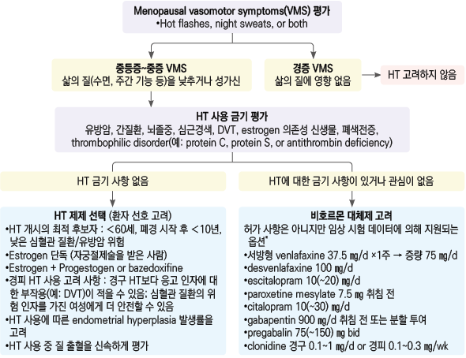
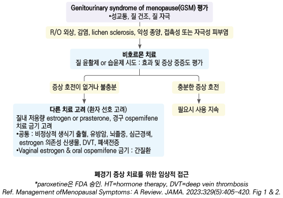
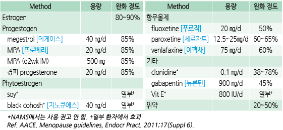
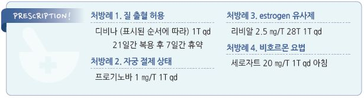

# 폐경기증후군 Menopause Syndrome


## 일반 사항

* 폐경 : 병적 원인 없이 마지막 월경일로부터 12개월 이상 월경을 하지 않는 상태
* 평균 폐경 연령 : 51세
*   폐경은 생리적인 현상이지만 혈관운동 증상(vasomotor Sx, VMS)에 의한 불편감과 심혈관 질환, 골다공증성 골절 등

    의학적 문제를 증가시킴; 폐경기와 자녀들의 사춘기, 중년의 정체성 위기, 부부 갈등, 경제적 문제 등과 겹쳐지면

    더욱 복잡한 문제를 일으킬 수 있음
* 월경 중단 6개월 이후 출혈이 발생하면 자궁내막암 감별을 요함
*   조기 폐경 : ＜40세에서 불규칙 월경 또는 월경 중단; 모든 원인의 사망률 증가, 심혈관 질환, 당뇨병, 우울증,

    골다공증과 연관; 원인 질환 감별 및 건강 관리를 요함

#### STRAW (staging of reproductive aging workshop) staging system

1. Menopausal transition

•stage -2 (early) : 월경 주기 변화(정상 주기에서 ＞7일 변동); 평균 4년 후 폐경

•stage -1 (late) : ≥2 주기 및 ≥60일 무월경

2. Postmenopause

•stages +1 (early) : 최종 월경부터 ＜5년

•stages +2 (late) : 최종 월경부터 ≥5년

\[대한폐경학회]

•폐경이행기: 월경 주기의 변동 증가\~마지막 월경일 직전

•폐경주변기: 폐경이행기\~마지막 월경 후 1년

## 원인

* 연령 증가에 따른 난소 기능 상실
* 난소 절제, 자궁 절제
* 성염색체 이상(예: 터너증후군)

### 조기 폐경 위험 인자

* 조기 폐경 가족력
* 흡연(비흡연의 경우보다 2년 단축), 음주, 비만
* 정신적 스트레스(예: 우울), 육체적 스트레스(예: 고산 지대 생활)
* 화학요법, 방사선 치료, 1형 당뇨병

> ✽임신과 모유 수유가 조기 폐경 위험을 낮춘다는 보고가 있음

## 임상 양상

* 불규칙 월경 : 기간 및 양의 불규칙, 과소 & 과다 월경 (☞ p.692)
*   VMS : 돌발적 안면 열성 홍조(보통 2\~4분간 지속), 발한, 두근거림, 수면 장애; 중년 여성의 70%가 경험

    •stage -1\~+1 시기에 심하며 평균 4\~10년간 발생; ＞70세의 9%에서 지속

    •폐경 전 난소 절제, 비만, 우울증, 낮은 경제/교육 수준, 흡연 여성에서 보다 심함
* 정신적 증상 : 우울, 불안, 불안정, 집중력 저하, 월경성 편두통 악화

> ✽폐경 전에 비하여 우울증이 2.5배 증가되었다는 보고가 있음

* 골다공증, 피부 건조, 탈모/머리카락 가늘어짐, 손톱 부서짐

> ✽VMS이 심할수록 골다공증 유병률이 높다는 보고가 있음

### 폐경기비뇨생식증후군(genitourinary syndrome of menopause, GSM)

* 폐경기 estrogen 감소에 따른 외음부 및 방광-요도의 위축성 변화; 폐경 여성의 ＞80%이 경험
* 생식기 증상 : 건조, 작열, 가려움, 출혈, 질염; 성교통, 성욕 감퇴, 성 기능 저하
* 비뇨기 증상 : 절박뇨, 배뇨통, 반복 요로 감염
*   감별 : 외음부/요로 감염 (☞ p.622, p.658), 자극성 피부염(예: 향수, 탈취제, 비누, 윤활제, 패드, 팬티), 암,

    pelvic floor dysfunction

>

## 진단

* 신장, 몸무게, 혈압, 유방/골반 진찰
* 감별 질환 : 임신, 갑상선 항진/저하증, 공황장애, 당뇨병, 약물(antiestrogen, SERM), 종양, 기타 시상하부/부신/난소 이상

### 실험실 검사

* ≥45세 : 일반적으로 필요 없음; 갑상선항진증 의심 시 TSH 검사, 필요시 s-hCG
*   40\~45세 : s-hCG, prolactin, TSH, FSH

    •FSH : ≥1개월 간격 2번 시행; ＞30 mIU/㎖ 시 난소 부전; 일부 여성에서는 폐경 이행기 중 정상 수준을 보이기도 함
* ＜40세 : 난소 기능 평가
*   기타

    •progesterone challenge test : medroxyprogesterone 10\~20 ㎎ PO or progesterone 100 ㎎ IM 후 withdrawal bleeding이 없으면

    hypoestrogenic state 추정

    •골반 초음파

    •골밀도(DXA) : ＞65세, 골다공증 위험 인자가 있는 ＜65세에서 시행 (☞ p.803)

    •mammogram : \[국가암검진] 40~~69세에서 2년마다; \[USPSTF] 50~~74세 여성에서 2년마다

    •폐경기 관련 또는 연령에 따른 검사

### HRT 관련 검사

* HRT 시행 전 및 시행 중 임상 증상과 위험 인자에 따라 1\~2년마다 시행
* mammogram : 50\~74세 여성에서 2년마다 권고 \[USPSTF]
* DXA 골밀도 검사 : ＞65세, 골다공증 위험 인자가 있는 ＜65세에서 시행 (☞ p.803)
*   대한폐경학회 권고 검사 항목

    •기본 : 빈혈, 공복 혈당, LFT, RFT, 지질; mammography, BMD, Pap smear

    •선택 : TFT, 유방 초음파, 자궁내막생검

***

## Management

## 치료 방침

*   VMS 및 GSM에 대하여 estrogen 호르몬 치료가 1차 선택; 폐경 후 10년 이내 또는 60세 미만서 시작하는 경우 위험도보다

    이점이 더 많음
* 호르몬 치료가 곤란한 경우 비호르몬 치료(예: paroxetine, venlafaxine)을 선택

## 비-약물 치료

#### 안면 홍조 개선

* 충분한 수분 섭취, 홍조가 시작될 때 시원한 음료 섭취; 맵거나 뜨거운 음식 회피, 음주 회피
* 덥지 않게 함. 서늘한 방에서 취침, 면제품 침대 시트
* 면제품 옷 선택, 더울 때 적절히 옷을 벗을 수 있도록 여러 겹으로 착용; 조이는 옷 회피
* 평소 충분한 운동, 적절한 체중 유지, 명상

> ✽주위 온도를 낮춤, 선풍기 사용, 운동, 유발 인자(예: 음주, 매운 움식) 회피 등의 효과 증거는 없음

#### 수면 개선

```
(☞ p.138)
```

* 규칙적 식사, 과식을 피하고 식사를 거르지 않음
* 늦은 밤 식사 또는 과한 스낵 섭취를 피함
* 카페인(커피, 차, 초콜릿, 콜라) 섭취 제한, 특히 오후 이후에는 피함
* 술에 의지하여 수면하지 않음

## 호르몬 치료 (Hormone replacement therapy) 및 호르몬 관련 치료

### 일반 사항

#### 폐경 호르몬 보충 요법 적응증

① VMS, ② 골 감소 예방, ③ hypoestrogenemia(예: 조기 난소 부전), ④ GSM

#### 호르몬 치료의 위험과 이득

*   관상동맥병 : 복합제 투여 또는 폐경 ＞10년 또는 고령자에 국한하여 가능성 제기

    •estrogen 단독 투여 또는 ＜60세이나 폐경 10년 내 치료 시작 시 위험 증가 없음 (✽오히려 감소 가능성이 제기됨)
* 뇌졸중 : ＜60세 또는 폐경 ＜10년에서는 위험 증가 없음; 저용량 또는 경피 투여 시 보다 안전함
* 정맥혈전증 : 폐경 ＞10년 또는 고령자에서 위험 증가; 치료 시작 1\~2년간 증가하고 이후 감소

> ✽아시아인에서의 VTE 발병은 매우 낮음

*   유방암

    •conjugated estrogen/medroxyprogesterone acetate(MPA) : 5년 투여 시 천 명 당 3명 증가

    •합성 progestin(예: MPA)에서 증가; 천연 progesterone에서는 증가되지 않았음

    •＜4년 사용에 대하여 증가되지 않음; ＞10년 사용 시 증가 추정 (✽estrogen-progestogen을 1\~4년간 투여한 경우에도

    유방암이 증가하였다는 보고가 있음)

    •estrogen 단독 투여 시에는 증가하지 않음 (✽유방암 발생이 오히려 감소하였다는 보고가 있음)

    •유방암 병력자에게는 경구 HRT를 권하지 않으며 estrogen 질 제제는 허용함
* 난소암 : estrogen 5년 단독 투여 시 천 명 당 0.7명 증가; 복합제는 증가 위험 없음
* 자궁내막암 : estrogen 단독 투여 시 증가 위험 있음; 복합제는 위험 증가 없으며 지속 투여 시 감소
* 대장암 : estrogen은 대장암에 영향 없음; 복합제는 대장암의 위험을 감소시킴
* 기타 위험 : 요실금, 담낭 질환, 안구 건조 증가
*   기타 이득 : 골다공증(✽low dose estrogen에서는 입증 안 됨), 골절, 관절염, 백내장, 녹내장, 수면, 질 위축, 요로 감염,

    복부 지방 축적 등의 예방/감소; 삶의 질 향상; 인지 기능 향상/치매 예방

> ```
> ( ✽논란; 폐경 초기부터 투여할 때 예방 효과가 있다는 보고가 있음)
> ```

* HRT의 위험은 폐경 초기에 투여를 시작할 때 낮고, 폐경 경과 후 시작할수록 높음
* 치료 시작 3개월 후 및 매년 치료의 유효성, 내약성, 부작용 등을 평가하여 지속 투여 여부 결정

#### Estrogen 금기증

* 유방암 또는 estrogen 관련 악성 종양(예: 자궁내막암) 병력 또는 의심
* 치료되지 않은 자궁내막 과다 형성
* 원인 불명의 질 출혈
* 심부정맥혈전증이나 폐색전증 등 정맥혈전증 병력
* 치료되지 않은 고혈압, 활동성 또는 최근의 동맥혈전증(예: 협심증, 심근경색)
* 활동성 간/담낭 질환, 호르몬 치료와 관련된 과민증, 지연 피부 포르피린증

#### 약제 종류

*   종류 : estrogen 및 progesterone 단독 또는 복합 (보험기준 ☞ p.1192)

    •body-identical 제제(예: estradiol, progesterone, testosterone)가 non-identical 제제(예: ethinyl estradiol,

    synthetic progestogen)보다 부작용이 적음
* 용량 : 저용량으로 시작하여 최소 유효 용량 투여 (✽저용량 사용 시 부작용 발생이 감소함)

#### 상황에 따른 선택 약제

* 자궁 적출 : estrogen 단독 요법
* 자궁 비적출, 자궁내막증/종양 병력 : 1주기 중 ≥14일 progesterone 복합 요법
*   GSM만 있음 : 국소 estrogen, DHEA(dehydroepiandrosterone), ospemifene;

    질 국소 호르몬제 사용 시 성 파트터의 흡수를 막기 위해 성 관계 12시간 이전에 적용
* 정맥혈전증 고위험, 고중성지방혈증, 비만, 흡연, 고혈압, ≥60세에서 시작 : 경피제

#### 치료 시기 및 기간

*   시작 시기 : ＜60세 또는 폐경 후 ＜10년; 폐경 전후에 관련 증상이 나타나면 곧 시작

    •조기 폐경 또는 난소 부전 시에는 증상에 관계없이 적어도 자연 폐경 연령까지 투여
*   투여 기간 : 이득과 위험에 대해 이해하고 있고 규칙적인 추적 관찰이 동반된다면 기간에 제한을 두지 않음

    (65세에 일률적으로 중단할 필요 없음). 필요시 경피 요법으로 변경할 수 있음 \[대한폐경학회];

    위험보다 장점이 크다는 것에 의사와 환자가 동의하면 65세까지 투여할 수 있음 \[NICE]

### Estrogen

* 부작용 : (호르몬 치료의 위험 외) 두통, 유방통, 자궁내막 증식, 자궁 출혈, 소화불량

> ✽HRT 후 자궁 출혈 대처 : HRT 시작 6개월 이내에는 소량의 출혈이 빈번하기 때문에 자궁내막 조직검사가 필수적이지는 않음. 폐경 2년 이내에는 병합주기요법을 사용하다가 이후 병합지속요법으로 변경할 것을 권고; 자궁내막 sampling을 하지 못하거나

> ```
> 조직 검사상 불충분한 결과를 보였으나 초음파 검사로 확인이 안 되는 경우에는 자궁내막조직검사 등의 추가 검사 시행;
> ```

> ```
> 조직 검사에서 자궁내막의 병변을 배제하였으나 HRT 중 출혈이 지속되는 경우 저용량 estrogen 함유 제제를 사용하거나
> ```

> ```
> tibolone 또는 TSEC 제제로의 변경 고려 [폐경학회보](2021:30;76)
> ```

#### 경구용

* 약제들 간의 효과 차이는 없음
* ethinylestradiol : 0.01\~0.02 ㎎/d
* conjugated equine estrogen(CEE) : 0.3 ㎎/d \[프레미나]
* 17-β-estradiol : 0.5\~1 ㎎/d
* estradiol valerate : 1\~2 ㎎/d \[프로기노바]
* estradiol hemihydrate : 1\~2 ㎎/d \[프레다]

#### 경피용 (겔, 패취)

* 경구 제제보다 경피 제제가 혈전 위험이 적음
* 고혈압, 고중성지방혈증, 담석증, 혈전색전증(뇌경색, 관상동맥병) 위험이 있을 때 선택
* estradiol hemihydrate : 0.05~~0.1 ㎎/d 분비; 1매 주 1~~2회 부착

#### 질 국소용

* 질 위축에 효과; 비가역적 변화가 발생하기 전에 투여를 시작하는 것이 효과적임
* 장기 투여에 대한 안전성 연구 부족; 유방암 환자에서 주의, 1년 사용 후 자궁내막 평가
* 자궁이 있는 경우에도 최소 1년간은 progesterone 사용은 필요 없음
* 제형 : emulsion, 겔, 스프레이, 크림, 질정, vaginal ring; 흡수의 차이로 도포제보다 링 선호
* 용법 : 1\~2주간 매일 도포 → 이후 주 2회 지속
* estradiol hemihydrate 0.1% \[에스트레바 겔]
* estradiol 질정 : 10 ㎍ 매일 ×2주, 이후 주 2회

### Progestogen

* VMS 완화에 유효
* estrogen 투여 시 자궁 부작용 예방을 위해 병합
* 부작용 : 성욕 감소, 월경 불순, 어지럼, 부종, 과민, 불면, 유방통, 유방암, 안면 홍조
* micronized progesterone이 보다 안전한 것으로 알려 짐

#### 경구용

* micronized progesterone : 100 ㎎~~200 ㎎/d ×10~~12d/m \[유트로게스탄]
*   medroxyprogesterone acetate(MPA) : 2.5 ㎎/d \[지속 요법]; 5\~10 ㎎을 월경 주기 제1일 또는 제16일에 시작하여

    연속적으로 12\~14일간 투여 \[주기 요법] \[프로베라]
* norethindrone acetate : 0.35 ㎎/d
* levonorgestrel : 0.075 ㎎/d
* drospirenone : 3 ㎎/d

#### 질 국소용

* 전신 부작용이 적고 자궁내막 보호 효과가 있음
* \[유트로게스탄 질좌제] progesterone 200 ㎎ 월경 주기 제14\~26일 저녁 질 내 삽입
* \[크리논 겔] progesterone 8% 90 ㎎ qd\~bid 질 내 적용

### Estrogen & Progestogen 병합 요법

* estrogen 단독 투여보다 자궁내막증과 자궁암 발생을 예방
* 자궁이 있는 여성은 estrogen 투여 시 반드시 progestogen을 함께 투여함

#### 경구용 progesterone 지속 요법

*   저용량 progesterone 지속 병합 요법 : 질 출혈은 감소하나 progesterone 부작용(예: 유방암 위험) 증가 논란;

    천연 progesterone 또는 국소제를 사용하는 경우 부작용이 감소될 수 있음
* 초저용량 estradiol/progestogen 지속 요법 : 고용량 수준의 효과가 유지되며 부작용이 적음
* estradiol hemihydrate/drospirenone \[안젤릭]
* estradiol valerate/MPA \[인디비나]
* estradiol hemihydrate/norethisterone \[에스디올 하프, 크리안]

#### 경구용 progesterone 간헐 요법

* progesterone 간헐 병합 요법 : 자궁의 주기적 위축에 따른 질 출혈 발생
*   long-cycle therapy : 병합 요법에서 3개월마다 14일간 progestogen 투여로 유방에 대한 progestogen 노출을 줄임.

    자궁에 대한 영향은 정보가 부족함
* estradiol valerate/medroxyprogesterone acetate \[디비나] (표시대로 21일간 복용 & 7일간 휴약)
* estradiol hemihydrate/dydrogesterone \[페모스톤] (월경 첫날부터 색깔별로 14일 & 14일 지속 복용)

#### 경피용

* estradiol/levonorgestrel, estradiol/norethindrone

### Tibolone : Selective tissue estrogen activity regulator (STEAR)

* 체내 흡수되어 estrogen/progesterone/androgen 성질을 갖는 물질들로 전환
*   작용 : 조직 특이적으로 estrogen 수용체에 작용, 유방과 자궁내막 조직은 자극하지 않음; 약한 androgen 작용이 있음;

    뼈와 질에서 estrogen, 자궁내막에서 progesterone, 간과 뇌에서 androgen 효과

    •폐경 관련 증상 감소, 골밀도 증가, 근육량 증가, 성 기능 장애 개선

    •심혈관 질환/자궁내막암/유방암 증가가 없는 것으로 알려짐, estrogen/progesterone 복합체에 비하여 불규칙 질 출혈 및

    유방 통증이 적음, 대장암 위험 감소 보고가 있음

    •≥60세에서 투여를 시작하는 경우 뇌졸중 증가 가능성이 있음
* 금기 : 유방암 병력 (✽유방암의 재발 증가 가능성이 있음)
* 용량 : 1.25\~5 ㎎/d \[리비알]

### Selective estrogen response modulator (SERM)

* 조직에서 선택적으로 estrogen 수용체를 자극하거나 억제
* 열성 홍조, 골다공증 예방을 위한 복합 HRT 대체
* raloxifene : 60 ㎎ qd \[에비스타]
* bazedoxifene : 20 ㎎ qd \[비비안트]
* tamoxifen : 10\~20 ㎎ bid \[놀바덱스]
* ospemifene : 60 ㎎ qd (✽질 위축, 질 건조, 성교통 예방 및 치료에 대하여 FDA 승인)

#### Tissue selective estrogen complex (TSEC)

* SERM인 bazedoxifene과 결합형 estrogen 복합제
*   estrogen 수용체에 대하여 뼈에서는 agonist로, 자궁 및 유방에서는 antagonist로 작용하는 bazedoxifene의 특성으로

    폐경 증상 완화 및 골밀도 증가 효과가 있고, 유방통과 질 출혈의 빈도는 낮고 자궁내막에 대한 안전성이 있음

> ```
> (✽충분한 연구는 부족)
> ```

* 자궁을 절제하지 않은 여성에서 폐경과 관련된 VMS 치료 및 폐경 후 골다공증 예방
* bazedoxifene 20 ㎎/CEE 0.45 ㎎ qd 식사 무관 복용 \[듀아비브]

### Testosterone

* 질 위축에 대하여 estrogen이 금기인 경우 testosterone propionate 1~~2% 크림 0.5~~1 g
* HRT 요법이 효과가 없는 성욕이 저하된 경우 testosterone 보충제 고려

### 모니터링

* 정기 검사 : Pap smear, 골반/유방 진찰, mammography, (비정상 출혈 시) 자궁 내막 검사
* 분비물이나 쇠퇴 출혈이 많은 경우 estrogen potency가 낮은 estradiol valerate로 교체 고려
*   progestogen 투여 시작 시기의 부정 출혈 발생 시 estrogen 쇠퇴 출혈을 감안하여 estrogen 용량을 줄이거나

    estradiol valerate로 교체 고려
*   progesterone 투여 중 부정 출혈 발생 시 progesterone 증량, 고강도 progesterone 또는 tibolone으로 교체,

    progesterone-releasing IUD/endometrial ablation/hysterectomy 등 고려
*   progesterone 투여 중 부종/여드름 발생시 drospirenone으로 교체 고려, 어지럼증 발생 시 dydrogeterone

    (시판 제품 없음)으로 교체 고려

## 비-호르몬 약물 치료

* 부작용 문제로 HRT를 사용할 수 없는 환자에서 증상 완화를 위하여 비호르몬제 고려 (보험주의)
* 1차로 선택하지 않음

### 항우울제 : SSRI, SNRI

```
(☞ p.1146)
```

* paroxetine : 7.5\~25 ㎎/d \[세로자트] (✽VMS 치료에 대하여 FDA 승인)
* venlafaxine : 37.5(시작)\~150 ㎎/d \[이팩사]
* desvenlafaxine : 100~~150 ㎎/d (시작 25~~50 ㎎/d \[프리스틱]
* escitalopram : 10(시작)\~20 ㎎/d (민감 or 고령에서는 5 ㎎/d으로 시작) \[렉사프로]

### Centrally acting α-adrenergic blocking agent

* 안면 홍조 빈도를 줄일 수 있으나, 부작용 문제로 사용이 제한 됨
* clonidine patch : 50 ㎍ bid, 100 ㎍/d (NAMS에서는 권고 안 함)
* 부작용 : 입마름, 졸음, 저혈압

### 항경련제

* gabapentin : 100~~300 ㎎ 야간으로 시작, 900~~2400 ㎎/d #3 \[뉴론틴] (☞ p.13)

### 도파민 대항제

* veralipride : 100 ㎎ qd ×20d/m

### Neurokinin B antagonist

* 체온 조절 경로에 작용하여 안면 홍조 및 수면 질 개선; 안면 홍조 60% 감소 (위약 45%)
* 광범위한 근육 및 뼈 약화, 질 위축, 기분 변화에는 효과 없음
* 부작용 : 복통, 설사, 불면증, 요통, 안면 홍조, 간 효소 수치 상승
* HRT를 할 수 없는 경우에 고려
* fezolinetant : 45 ㎎/d qd; VMS에 대하여 FDA 승인 (시판 제품 없음)

## 대체 요법

### Phytoestrogen

* estrogen 작용제 특성을 가짐; 폐경 증상 완화 및 골격/심혈관계에 약간의 도움이 될 것으로 보임
* 장기적인 효과와 안전성이 확인되지 않음
* 환자가 원하는 경우 음식으로 섭취 권고; 콩, 두부, 아마씨, 참깨, 산딸기, 귀리, 보리, 말린 콩, 렌

즈콩, 쌀, 녹두, 사과, 당근, 밀

* black cohosh(승마 추출물) \[지노큐에스]

### 위약 이상의 효과가 없는 것으로 연구된 대체 요법

* 당귀, 달맞이꽃기름, 인삼, 야생 참마, 붉은 토끼풀

## 특별한 경우의 관리

### 수술로 인한 폐경 시 호르몬 보충 요법

* 난소절제술로 인한 조기 폐경 시 금기가 아니면 최소 자연 폐경 연령까지 estrogen 보충 요법 시행
* conjugated estrogens 1.25 ㎎, estrone sulfate 1.25 ㎎, 또는 estradiol 2 ㎎을 매달 25일간 투여
* 45\~50세 이후 conjugated estrogen 0.625 ㎎ 또는 동등 용량 투여

### 폐경기비뇨생식증후군 (Genitourinary syndrome of the menopause)

* 외음부 위축 : 국소 estrogen, ospemifene(SERM), 국소 DHEA, 윤활제, 보습제; 레이저 시술
* 과민성 방광 : antimuscarinics & 국소 estrogen (☞ p.680)
* 전신 estrogen은 질 위축에는 유효하지만 요실금, 과민성 방광, 반복성 요로 감염에는 유효하지 않음
* 지속적인 성관계가 질 위축 예방에 도움이 될 수 있음
* 약제별 증상 중증도 개선 효과 : 저용량 vaginal estrogen- 60\~80%, 질 prasterone- 4%\~80%, 경구 ospemifene- 30%\~50%

### 폐경 환자에서의 심혈관 질환 및 골다공증 예방

* 유산소 운동, 체중 부하 운동
* 금연, 음주 제한
* 건강식, 적정 체중 유지
* 이상지질혈증, 당뇨병, 고혈압 관리
* 저용량 aspirin 복용, 칼슘 섭취(800~~1,200 ㎎/d), Vit D 섭취(800~~1200 IU/d) (☞ p.806)





**※ VMS에 대한 비호르몬 치료 권고**

```

```

**※ Vasomotor Sx에 대한 치료 효과 비교** 

> ***

> **질병코드** N95 폐경 및 기타 폐경전후 장애

M81.0 폐경후골다공증 질병코드


