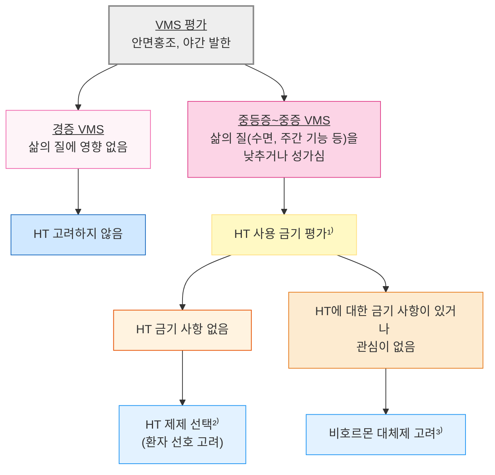
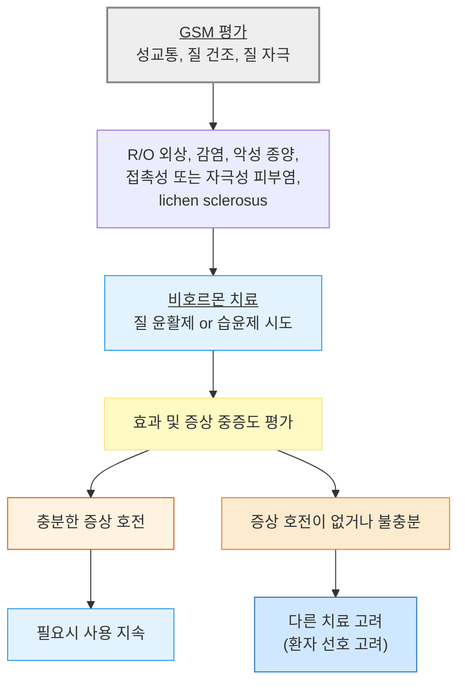

# 폐경기증후군 Menopause Syndrome

## <mark style="color:green;">일반 사항</mark>

* 폐경 : 병적 원인 없이 마지막 월경일로부터 12개월 이상 월경을 하지 않는 상태
* 다른 이름 : 갱년기증후군, climacteric syndrome
* 평균 폐경 연령 : 51세
* 의의 : 폐경은 생리적인 현상이지만 혈관운동 증상(vasomotor symptoms, VMS)에 의한 불편감과 심혈관 질환, 골다공증성 골절 등 의학적 문제를 증가시킴; 폐경기와 자녀들의 사춘기, 중년의 정체성 위기, 부부 갈등, 경제적 문제 등과 겹쳐지면 더욱 복잡한 문제를 일으킬 수 있음
* 조기난소부전(premature ovarian insufficiency, POI) : 40세 이전에 난소 기능이 소실되어 무월경·희발월경과 FSH 상승을 보이는 상태; 심혈관 질환, 골다공증, 우울증 등과 연관되므로 원인 평가와 장기 건강 관리가 필요
* 조기폐경(early menopause) : 40\~44세에 발생한 폐경

<mark style="color:cyan;">**STRAW (Staging of Reproductive Aging Workshop) staging system**</mark>

<table><thead><tr><th width="320.4761962890625">STRAW 단계</th><th width="429.5238037109375">정의</th></tr></thead><tbody><tr><td>Menopausal transition, stage -2 (early)</td><td>연속된 월경 주기의 길이가 7일 이상 차이 나는 변화가 반복됨</td></tr><tr><td>Menopausal transition, stage -1 (late)</td><td>무월경 간격 ≥60일</td></tr><tr><td><em>- 마지막 월경일(FMP) -</em></td><td></td></tr><tr><td>Postmenopause, stage +1 (early)</td><td>FMP 후 약 5\~8년(+1a, +1b, +1c)</td></tr><tr><td>Postmenopause, stage +2 (late)</td><td>초기 폐경 후기 이후</td></tr></tbody></table>

**\[대한폐경학회]**

* 폐경이행기 : 월경 주기의 변동 증가\~마지막 월경일 직전
* 폐경주변기 : 폐경이행기\~마지막 월경 후 1년

## <mark style="color:green;">원인 및 위험 인자</mark>

* 연령 증가에 따른 난소 기능 상실
* 난소 절제, 항암화학요법·골반 방사선치료 등 의인성 난소 기능 소실
  * 난소를 보존한 자궁절제술은 즉시 폐경을 일으키지는 않지만 월경력으로 폐경 시점을 판정할 수 없으며, 난소 기능 소실이 다소 빨라질 수 있음
* 성염색체 이상 (예: 터너증후군)

### <mark style="color:orange;">조기폐경 위험 인자</mark>

* 조기폐경 가족력, 유전적 소인 (예: FMR1 premutation)
* 흡연(폐경 시기를 앞당기는 가장 일관된 생활 습관 위험 인자); 과도한 음주는 연관 가능성이 있으나 근거는 일관되지 않음
* 자가면역질환 (예: 갑상선염, 애디슨병)
* 정신적 스트레스 (예: 우울)
* 화학요법, 방사선치료, 1형 당뇨병

- [ ] 임신과 모유 수유가 조기폐경 위험을 낮춘다는 보고가 있음
- [ ] 저체중과 조기폐경의 연관 가능성이 일부 메타분석에서 제기되었으나 일관된 근거는 부족함; 비만과의 연관성은 더욱 근거가 약함

## <mark style="color:green;">임상 양상</mark>

* 불규칙 월경 : 기간 및 양의 불규칙, 과소 & 과다 월경
* VMS(Vasomotor symptoms) : 돌발적 안면 홍조(hot flash, 보통 2\~4분간 지속), 야간발한; 두근거림과 수면 장애가 동반될 수 있음
  * 중년 여성의 약 70%가 경험하고 stage -1\~+1 시기에 심함; 지속 기간의 중앙값은 약 7년이나 개인차가 크며 일부에서는 70세 이후에도 지속
  * 폐경 전 난소 절제, 비만, 우울증, 낮은 경제/교육 수준, 흡연 여성에서 더 심함
* 정신적 증상 : 우울, 불안, 불안정, 집중력 저하, 월경성 편두통 악화
  * 폐경 전에 비하여 우울 증상 발생이 최대 2.5배까지 증가한다는 보고가 있음
* 골다공증, 피부 건조, 탈모/머리카락 가늘어짐, 손톱 부서짐
  * VMS가 심할수록 골다공증 유병률이 높다는 보고가 있음

### <mark style="color:orange;">폐경기비뇨생식증후군 (Genitourinary syndrome of menopause, GSM)</mark>

* 폐경기 estrogen 감소에 따른 외음부 및 방광-요도의 위축성 변화
* 폐경 여성의 약 50\~80%가 경험(문헌마다 편차 있음)
* 생식기 증상 : 건조, 작열, 가려움, 출혈, 질염; 성교통, 성욕 감퇴, 성 기능 저하
* 비뇨기 증상 : 절박뇨, 배뇨통, 반복 요로 감염
* 감별 : 외음부/요로 감염, 자극성 피부염(예: 향수, 탈취제, 비누, 윤활제, 패드, 팬티), 암, pelvic floor dysfunction

### <mark style="color:$danger;">🚩 Red Flags!</mark>

<mark style="color:$danger;">**즉각 조치 또는 의뢰**</mark>

* HT(Hormone Therapy) 중 편측 하지 부종·통증·발적 → 심부정맥혈전증
* 급성 흉통, 호흡곤란, 객혈 → 폐색전증(특히 HT 시작 1\~2년 이내)
* 급성 편측 위약, 안면 마비, 언어 장애, 갑작스런 심한 두통 → 뇌졸중
* 흉통, 방사통, 발한을 동반한 급성 증상 → 급성 관상동맥증후군(불안정 협심증, 심근경색)
* 다량의 질출혈로 빈맥·저혈압 등 혈역학적 불안정 동반

<mark style="color:$warning;">**당일~수일 내 평가**</mark>

* 폐경 후(마지막 월경 후 12개월 이상 무월경 이후) 발생한 질출혈 → 자궁내막암 등 기질적 병변 배제 필요
* 유방 촉지 종괴, 유두 분비물, 피부 변화 → 유방암
* HT 사용 중 지속되거나 반복되는 비정상 자궁 출혈
* HT를 고려 중이나 활동성 간질환, 미치료 고혈압, 정맥혈전증/동맥혈전증 병력 등 금기에 해당
* ＜40세 조기폐경 또는 무월경

<mark style="color:$info;">**조기 평가 및 추적**</mark> <mark style="color:$info;">- 즉각 위험 낮으나 호전 없으면 의뢰</mark>

* 생활 습관 교정 및 1차 약물 치료 4\~8주 후에도 VMS 호전이 없는 경우
* 골다공증 위험 인자가 있는 폐경 여성의 골밀도(DXA) 검사 계획 및 추적
* GSM 증상이 국소 치료에 반응하지 않는 경우

## <mark style="color:green;">진단</mark>

* 신장, 몸무게, 혈압, 유방/골반 진찰
* 감별 질환 : 임신, 갑상선 항진/저하증, 공황장애, 당뇨병, 약물(antiestrogen, SERM), 종양, 기타 시상하부/부신/난소 이상

### <mark style="color:orange;">실험실 검사</mark>

* ≥45세 : 전형적인 폐경 관련 증상과 월경 변화가 있으면 일반적으로 검사 없이 임상적으로 진단; 임신 가능성이 있으면 s-hCG, 갑상선질환이 의심되면 TSH 등 감별 목적의 검사 시행
* 40\~45세 : 폐경 관련 증상과 월경 변화가 있으면서 진단 확인이 필요한 경우 FSH 고려; s-hCG, prolactin, TSH는 임신 가능성 또는 해당 질환이 의심될 때 선택적으로 시행
* ＜40세 : POI 평가
  * 월경 불순 또는 무월경과 폐경 관련 증상을 확인하고 FSH를 4\~6주 간격으로 2회 측정하여 상승을 확인; AMH는 POI 진단을 위한 일률적 검사가 아님
  * 임신, 갑상선질환, 고프로락틴혈증 등 이차성 무월경 원인을 배제하고 필요시 염색체·FMR1 premutation·자가면역 원인 평가 및 전문의 의뢰
* 기타
  * 골반 초음파 : 비정상 자궁 출혈, 골반 종괴 또는 기타 기질적 질환이 의심될 때
  * 골밀도(DXA) : ＞65세, 골다공증 위험 인자가 있는 ＜65세에서 시행 (☞ [골다공증](../228_/149_-osteoporosis.md))
  * Mammogram : \[국가암검진] 40세 이상 여성에서 2년마다; \[USPSTF 2024] 평균 위험 여성 40\~74세에서 2년마다
  * 폐경기 관련 또는 연령에 따른 검사

### <mark style="color:orange;">HT 관련 검사</mark>

* HT 시행 전 병력, 혈압, 체중 및 심혈관·유방암·혈전·간질환 위험을 평가하고, 이후에는 임상 증상과 위험 인자에 따라 검사
* Mammogram : 국가암검진 및 개인 위험도에 따른 권고 주기로 시행; \[USPSTF 2024] 평균 위험 여성 40\~74세에서 2년마다
* DXA 골밀도 검사 : ＞65세, 골다공증 위험 인자가 있는 ＜65세에서 시행

**대한폐경학회 권고 검사 항목**

* 기본 : 빈혈, 공복 혈당, LFT, RFT, 지질; mammography, BMD, Pap smear
* 선택 : TFT, 유방 초음파, 자궁내막생검

***


```mermaid
flowchart TD
    A["<u>VMS 평가</u><br/>안면홍조, 야간 발한"]
    B1["<u>중등증~중증 VMS</u><br/>삶의 질(수면, 주간 기능 등)을<br/> 낮추거나 성가심"]
    B2["<u>경증 VMS</u><br/>삶의 질에 영향 없음"]
    B3["HT 고려하지 않음"]
    C["HT 사용 금기 평가¹⁾"]
    D1["HT 금기 사항 없음"]
    D2["HT에 대한 금기 사항이 있거나 <br/>관심이 없음"]
    E1["HT 제제 선택²⁾ <br/>(환자 선호 고려)"]
    E2["비호르몬 대체제 고려³⁾"]
    A --> B1
    A --> B2
    B2 --> B3
    B1 --> C
    C --> D1
    C --> D2
    D1 --> E1
    D2 --> E2

style A fill:#eeeeee,stroke:#888888,stroke-width:2px
style B2 fill:#fef4f8,stroke:#f06baf
style B1 fill:#fcd4e6,stroke:#e0448e
style B3 fill:#d0e8ff,stroke:#1a6abf
style C fill:#fff9c4,stroke:#ffe082
style D2 fill:#fdebd0,stroke:#e67e22
style D1 fill:#fff3e0,stroke:#e65100
classDef sky fill:#e3f2ff,stroke:#2196f3
class E1,E2 sky
```

_¹⁾ 유방암, 간질환, 뇌졸중, 심근경색, DVT, estrogen 의존성 신생물, 폐색전증, thrombophilic disorder(예: protein C, protein S, or antithrombin deficiency)_

_²⁾• HT 개시의 최적 후보자 :_ ＜_60세, 폐경 시작 후_ ＜_10년, 낮은 심혈관 질환/유방암 위험_\
_• Estrogen 단독 (자궁절제술을 받은 사람)_\
_• Estrogen + Progestogen or bazedoxifene_\
_• 경피 HT 사용 고려 사항 : 경구 HT보다 응고 인자에 대한 부작용(예: DVT)이 적을 수 있음; 심혈관 질환의 위험 인자를 가진 여성에게 더 안전할 수 있음_\
_• HT 사용에 따른 endometrial hyperplasia 발생률을 고려_\
_• HT 사용 중 질 출혈을 신속하게 평가_

_³⁾국내에서는 VMS 적응증이 허가되지 않은 약제가 대부분이므로 처방 전 국내 허가·급여 및 유통 상태 확인_\
_• 서방형 venlafaxine 37.5 ㎎/d ×1주 → 증량 75 ㎎/d_\
_• desvenlafaxine 100 ㎎/d_\
_• escitalopram 10(\~20) ㎎/d_\
_• paroxetine mesylate 7.5 ㎎ 취침 전_\
_• citalopram 10(\~30) ㎎/d_\
_• gabapentin 900 ㎎/d 취침 전 또는 분할 투여_\
_• fezolinetant 45 ㎎ qd 또는 elinzanetant 120 ㎎ 취침 전 qd: 미국 등에서 승인된 비호르몬 치료제이나 국내 허가·유통 여부 확인 필요_\
_• pregabalin과 clonidine은 효과 대비 부작용 문제로 The Menopause Society에서 권고하지 않음_

<p align="center"><strong>폐경기 VMS 치료 접근 알고리듬</strong><br><em><mark style="color:$info;">Ref. Management of Menopausal Symptoms: A Review. JAMA. 2023;329(5):405–420. Fig 1.</mark></em><br></p>


```mermaid
graph TD
    A["<u>GSM 평가</u><br/>성교통, 질 건조, 질 자극"]
    B["R/O 외상, 감염, 악성 종양,<br/>접촉성 또는 자극성 피부염, <br/>lichen sclerosus"]
    C["<u>비호르몬 치료</u><br/>질 윤활제 or 습윤제 시도"]
    C1[효과 및 증상 중증도 평가]
    D1["증상 호전이 없거나 불충분"]
    D2["충분한 증상 호전"]
    E1["다른 치료 고려 <br/>(환자 선호 고려)"]
    E2["필요시 사용 지속"]
    A --> B
    B --> C
    C --> C1
    C1 --> D2
 C1 --> D1
    D2 --> E2
    D1 --> E1
style A fill:#eeeeee,stroke:#888888,stroke-width:2px
style C1 fill:#fff9c4,stroke:#ffe082
classDef sky fill:#e3f2ff,stroke:#2196f3
class C,E2 sky
style E1 fill:#d0e8ff,stroke:#1a6abf
style D1 fill:#fdebd0,stroke:#e67e22
style D2 fill:#fff3e0,stroke:#e65100
```

<p align="center"><strong>GSM</strong>(Genitourinary syndrome of menopause) <strong>치료 접근 알고리듬</strong></p>

<p align="center"><em><mark style="color:$info;">Ref. Management of Menopausal Symptoms: A Review. JAMA. 2023;329(5):405–420. Fig 2.</mark></em></p>

***

## <mark style="background-color:$warning;">Management</mark>

### <mark style="color:orange;">치료 방침</mark>

* 중등도\~중증 VMS : 금기가 없는 경우 전신 HT가 가장 효과적인 치료; 일반적으로 건강하고 60세 미만이거나 폐경 후 10년 이내인 유증상 여성에서 이득-위험 비가 양호함
* GSM만 있는 경우 : 비호르몬 윤활제·보습제 또는 저용량 질 국소 estrogen을 사용하며, GSM만을 치료하기 위해 전신 HT를 시작하지 않음
* HT가 금기이거나 원하지 않는 경우 비호르몬 치료(예: SSRI/SNRI, gabapentin, fezolinetant, elinzanetant)를 선택


**폐경호르몬치료(HT) 미국 라벨링 업데이트** (2026년) : 2025년 11월 미국 FDA는 폐경호르몬치료제의 광범위한 boxed warning 제거를 추진한다고 발표했고, 2026년 2월 일부 전신·질 국소 제품의 개정 라벨을 처음 승인함. 다만 전신 estrogen 단독제의 자궁내막암 관련 boxed warning은 유지되며, 이러한 미국 규제 변경이 혈전·뇌졸중·유방암 등 개별 위험을 없애거나 국내 허가사항을 직접 변경하는 것은 아님. WHI 연구 참가자의 평균 연령과 사용 제제가 실제 초기 폐경 치료 대상과 달랐다는 재평가에 따라, 폐경 후 10년 이내 또는 60세 이전에 치료를 시작한 건강한 유증상 여성에서는 이득-위험 비가 더 양호하고 일부 분석에서 총사망률 및 관상동맥질환 위험 감소 가능성이 제시됨.\
NICE NG23(2026 개정)은 **HT를 심혈관질환의 1차·2차 예방 또는 치매 예방 목적으로 사용하지 말 것**을 명시하므로 예방적 적응증으로 확대 해석하지 않도록 주의.


<mark style="color:cyan;">**Vasomotor symptoms(VMS)에 대한 치료 효과 비교**</mark>

<table data-header-hidden data-search="false"><thead><tr><th width="255"></th><th></th><th></th></tr></thead><tbody><tr><td><strong>치료</strong></td><td><strong>대표 용량</strong></td><td><strong>비고</strong></td></tr><tr><td><strong>전신 estrogen</strong></td><td>제형별 최소 유효 용량</td><td>VMS에 가장 효과적; 자궁이 있으면 자궁내막 보호 필요</td></tr><tr><td><strong>SSRI/SNRI</strong></td><td></td><td>국내 VMS 적응증 허가 외 사용</td></tr><tr><td>paroxetine¹⁾ <mark style="color:blue;">[세로자트]</mark></td><td>7.5\~25 ㎎/d</td><td>저용량부터 시작; tamoxifen과 상호작용 주의</td></tr><tr><td>venlafaxine <mark style="color:blue;">[이팩사]</mark></td><td>37.5\~75 ㎎/d</td><td>혈압 및 중단 증상 주의</td></tr><tr><td>escitalopram <mark style="color:blue;">[렉사프로]</mark></td><td>10\~20 ㎎/d</td><td>고령·민감 환자는 5 ㎎/d 시작 고려</td></tr><tr><td>fluoxetine <mark style="color:blue;">[푸록틴]</mark></td><td>20 ㎎/d</td><td>효과 근거가 일관되지 않으며 tamoxifen 병용 회피</td></tr><tr><td><strong>Gabapentin</strong> <mark style="color:blue;">[뉴론틴]</mark></td><td>900 ㎎/d 분할 또는 취침 전 중심 투여</td><td>야간 VMS에 유용; 졸림·어지러움 주의</td></tr><tr><td><strong>Neurokinin 수용체 대항제</strong></td><td>fezolinetant 45 ㎎/d<br>elinzanetant 120 ㎎ 취침 전</td><td>미국 등에서 승인; 간기능 등 안전성 모니터링 및 국내 허가·유통 여부 확인</td></tr><tr><td><strong>권고하지 않는 치료</strong></td><td>경피 progesterone 크림, clonidine, pregabalin, vitamin E, soy·black cohosh 등</td><td>효과 부족, 안전성 또는 부작용 문제</td></tr></tbody></table>

_¹⁾ VMS에 대하여 FDA 승인된 SSRI는 paroxetine mesylate 7.5 ㎎ 제제이며, 국내 paroxetine 제제의 VMS 치료는 허가 외 사용임_

## <mark style="color:green;">비-약물 치료 및 예방</mark>

#### <mark style="color:$primary;">안면 홍조 개선</mark>

* 개인적으로 VMS를 유발하거나 악화시키는 맵고 뜨거운 음식, 카페인, 음주 등의 요인이 확인되면 조절
* 서늘한 실내 환경, 얇은 옷 겹쳐 입기, 시원한 음료 등은 편안함에 도움이 될 수 있으나 VMS 자체를 감소시키는 근거는 제한적
* 규칙적인 운동은 전반적인 건강에 권고하지만 VMS 자체의 치료 효과는 확립되지 않음; 과체중·비만 여성에서는 체중 감량이 VMS 개선에 도움이 될 수 있음
* 폐경 특이적 인지행동치료(menopause-specific CBT) : HT와 병용하거나, HT가 금기이거나 원하지 않는 경우 VMS에 대한 근거 기반 치료 옵션 (NICE NG23, 2024; The Menopause Society 2023)

#### <mark style="color:$primary;">수면 개선</mark>

* 규칙적 식사, 과식을 피하고 식사를 거르지 않음 (☞ [불면증](../221_/029_-insomnia-sleep-disorder.md))
* 늦은 밤 식사 또는 과한 스낵 섭취를 피함
* 카페인(커피, 차, 초콜릿, 콜라) 섭취 제한, 특히 오후 이후에는 피함
* 술에 의지하여 수면하지 않음

#### <mark style="color:$primary;">심혈관 질환 및 골다공증 예방</mark>

* 유산소 운동, 체중 부하 운동
* 금연, 음주 제한
* 건강식, 적정 체중 유지
* 이상지질혈증, 당뇨병, 고혈압 관리
* 칼슘은 음식 섭취를 포함한 총 섭취량과 골절 위험에 따라 조절하고, Vit D는 결핍 위험과 혈중 농도·골다공증 여부에 따라 보충(☞ [골다공증](../228_/149_-osteoporosis.md#ca-vit-d))

- [ ] 저용량 aspirin의 심혈관 1차 예방 목적 투여는 더 이상 일률적으로 권고하지 않음 \[USPSTF]; 개별 심혈관 위험도에 따라 판단

## <mark style="color:green;">약물 치료</mark>

### <mark style="color:orange;">호르몬 치료(Hormone Therapy, HT) 및 호르몬 관련 치료</mark>

#### <mark style="color:$primary;">적응증</mark>

* ① 중등도\~중증 VMS, ② 폐경 후 골 감소 예방이 필요한 고위험군, ③ estrogen 저하 상태(예: POI·조기폐경), ④ GSM(저용량 질 국소 estrogen)

#### <mark style="color:$primary;">위험과 이득</mark>

* 관상동맥병 : 건강하고 60세 미만이거나 폐경 후 10년 이내인 유증상 여성에서 시작하면 절대위험이 낮고 이득-위험 비가 양호함; 심혈관질환의 1차·2차 예방 목적으로 시작하지 않음
* 뇌졸중 : 경구 HT는 허혈성 뇌졸중 위험을 소폭 높일 수 있으나 젊은 폐경 여성에서는 절대위험이 낮음; 저용량 경피 estradiol은 위험이 더 낮을 가능성이 있음
* 정맥혈전색전증 : 경구 HT는 VTE 위험을 증가시키며 치료 초기 1\~2년에 가장 두드러짐; 연령·비만·흡연·혈전성향 등에 따라 절대위험이 증가하고 경피 estradiol은 경구제보다 위험이 낮을 가능성이 있음
* 유방암
  * Conjugated estrogen/medroxyprogesterone acetate(MPA) : 5년 투여 시 천 명 당 3명 증가
  * 유방암 위험은 제제·progestogen 종류·투여 기간에 따라 다름; micronized progesterone이 일부 합성 progestin보다 위험이 낮을 가능성이 있으나 장기 안전성이 확정된 것은 아님
  * 복합 HT는 3\~5년경부터 위험 증가가 관찰될 수 있으며 기간이 길수록 증가하는 경향; 치료 기간만으로 안전 여부를 단정하지 않음
  * WHI에서 자궁절제 여성의 CEE 단독요법은 장기 추적 시 유방암 발생과 사망 감소가 관찰되었으나, 이를 모든 estrogen 제제·대상자에게 일반화하지 않음
  * 유방암 병력자에서는 전신 HT는 일반적으로 권고되지 않음; 저용량 질 국소 estrogen은 비호르몬 치료(윤활제·보습제 등) 실패 시 종양 전문의와 상의(shared decision-making)하여 사용을 고려할 수 있음\[ACOG, NAMS, AUA/SUFU/AUGS]
* 난소암 : estrogen 단독 및 복합 HT 모두에서 절대위험은 매우 낮지만 소폭 증가할 가능성이 있어 개인 위험도를 고려
* 자궁내막암 : estrogen 단독 투여 시 증가 위험 있음; 복합제는 위험 증가 없으며 지속 투여 시 감소
* 대장암 위험 감소를 목적으로 HT를 사용하지 않음
* 기타 위험 : 요실금, 담낭 질환, 안구 건조 증가
* 기타 이득 : 치료 중 골 소실과 골절 위험 감소, VMS 관련 수면 장애 및 삶의 질 개선; 저용량 질 estrogen은 GSM과 반복 요로 감염 감소에 도움
* 인지 기능 개선 또는 치매 예방 목적으로는 권고하지 않음; 다만 폐경 초기(60세 미만 또는 폐경 10년 이내)에 시작한 경우 일부 관찰 연구에서 인지 기능에 대한 이득 가능성이 제기되었으나 근거는 일관되지 않으며, 심혈관질환 1차 예방 목적으로도 HT를 시작하지 않음
* HT의 위험은 폐경 초기에 투여를 시작할 때 낮고, 폐경 경과 후 시작할수록 높음
* 치료 시작 3개월 후 및 매년 치료의 유효성, 내약성, 부작용 등을 평가하여 지속 투여 여부를 결정

#### <mark style="color:$primary;">전신 HT 금기증 및 주의 사항</mark>

* 유방암 또는 estrogen 관련 악성 종양(예: 자궁내막암) 병력 또는 의심
* 치료되지 않은 자궁내막 과다 형성
* 원인 불명의 질 출혈
* 심부정맥혈전증이나 폐색전증 등 정맥혈전증 병력
* 조절되지 않는 중증 고혈압, 활동성 또는 최근의 동맥혈전증(예: 협심증, 심근경색)
* 활동성 간질환, 호르몬 치료와 관련된 과민증, 지연 피부 포르피린증
* 담낭 질환 : 주의; 경구 estrogen이 담석 위험을 높일 수 있어 담낭 질환 병력자는 경피 제형을 우선 고려
* 고혈압 : 주의; 목표혈압 관리 하에 투여 가능

#### <mark style="color:$primary;">약제 종류</mark>

* 종류 : estrogen 단독 또는 estrogen-progestogen 병합 (☞ [폐경 후 호르몬요법 인정기준](https://www.hira.or.kr/rc/insu/insuadtcrtr/InsuAdtCrtrPopup.do?mtgHmeDd=20130901\&sno=1\&mtgMtrRegSno=0023))
  * 허가된 estradiol과 micronized progesterone은 체내 호르몬과 화학적으로 동일함; 일부 관찰연구에서 micronized progesterone과 경피 estradiol 조합의 유방암·VTE 위험이 더 낮을 가능성이 제시되었으나 모든 위험에 대한 우월성이 확정된 것은 아님
* 용량 : 저용량으로 시작하여 최소 유효 용량 투여 (✽저용량 사용 시 부작용 발생이 감소함)

#### <mark style="color:$primary;">상황에 따른 선택 약제</mark>

* 자궁 적출 : estrogen 단독 요법
* 자궁이 있음 : 적절한 용량의 progestogen을 지속 또는 매 28일 중 12\~14일 병합하거나 CEE/bazedoxifene TSEC 사용
* 자궁내막증 병력 : 자궁절제 후에도 잔존 병변 가능성을 고려하여 전문의와 병합요법 여부 결정
* GSM만 있음 : 저용량 질 국소 estrogen, vaginal DHEA(prasterone), ospemifene 중 국내 허가·가용성과 환자 선호를 고려
* VTE 위험 인자, 고중성지방혈증, 비만, 흡연, 고혈압·담낭 질환 등이 있는 경우 : 경피 estradiol 우선 고려; 과거 VTE·뇌졸중·관상동맥질환 등 전신 HT 금기 여부를 먼저 평가

#### <mark style="color:$primary;">치료 시기 및 기간</mark>

* 시작 시기 : 폐경 전후에 치료가 필요한 증상이 나타나면 금기와 개인 위험도를 평가하여 시작; 건강하고 ＜60세 또는 폐경 후 ＜10년인 경우 이득-위험 비가 대체로 양호함
  * 폐경이행기에는 임신 가능성이 남아 있으며 HT는 피임제가 아님
  * 조기폐경 또는 난소 부전 시에는 증상에 관계없이 적어도 자연 폐경 연령까지 투여
* 투여 기간 : 이득과 위험에 대해 이해하고 있고 규칙적인 추적 관찰이 동반된다면 기간에 제한을 두지 않음(65세에 일률적으로 중단할 필요 없음). 필요시 경피 요법으로 변경할 수 있음 \[대한폐경학회]; 65세 이후에도 획일적 연령 기준으로 중단하기보다 개별 위험-이득 평가와 공동 의사결정을 거쳐 지속 여부를 정기적으로 재평가할 것을 권고 \[NICE NG23]

### <mark style="color:orange;">Estrogen</mark>

* 부작용 : (호르몬 치료의 위험 외) 두통, 유방통, 자궁내막 증식, 자궁 출혈, 소화불량
* HT 후 자궁 출혈 대처 : HT 시작 후 첫 6개월 이내, 또는 용량·제제를 변경한 후 3개월 이내에 발생하는 소량의 출혈은 흔하며 그 자체로 자궁내막 조직검사가 필수적이지는 않음(NICE NG23, 2026); 이 기간을 벗어난 비정상 출혈은 즉시 평가 필요
  * 폐경 2년 이내에는 병합주기요법을 사용하다가 이후 병합지속요법으로 변경할 것을 권고
  * 자궁내막 sampling을 하지 못하거나 조직 검사상 불충분한 결과를 보였으나 초음파 검사로 확인이 안 되는 경우에는 자궁내막조직검사 등의 추가 검사 시행
  * 조직 검사에서 자궁내막의 병변을 배제하였으나 HT 중 출혈이 지속되는 경우 저용량 estrogen 함유 제제를 사용하거나 tibolone 또는 TSEC 제제로의 변경 고려

#### <mark style="color:$primary;">경구용</mark>

* 약제들 간의 효과 차이는 없음
* Conjugated equine estrogen(CEE) : 0.3 ㎎/d <mark style="color:blue;">\[프레미나정]</mark>
* 17-β-estradiol : 0.5\~1 ㎎/d
* Estradiol valerate : 1\~2 ㎎/d <mark style="color:blue;">\[프로기노바]</mark>
* Estradiol hemihydrate : 1\~2 ㎎/d <mark style="color:blue;">\[프레다]</mark>

#### <mark style="color:$primary;">경피용 (겔, 패취)</mark>

* 경구 제제보다 경피 제제에서 정맥혈전색전증(VTE) 위험 증가가 낮은 것으로 알려짐
* 고혈압, 고중성지방혈증, 담석증, 혈전색전증(뇌경색, 관상동맥병) 위험이 있을 때 선택
* Estradiol 패취 : 제품별 방출량에 따라 1매를 주 1\~2회 피부에 부착
* Estradiol hemihydrate 겔 <mark style="color:blue;">\[에스트레바 겔]</mark> : 정량 펌프를 이용하여 1일 1회 피부에 도포; 제품 허가용량에 따라 조절
* Estradiol 0.1% 겔 <mark style="color:blue;">\[디비겔]</mark> : 포 단위 함량에 따라 1일 1회 피부에 도포

#### <mark style="color:$primary;">질 국소용</mark>

* 질 위축에 효과; 비가역적 변화가 발생하기 전에 투여를 시작하는 것이 효과적임
* 유방암 환자에서 사용 시 주의 필요; 유방암 병력자도 종양내과와 상의 후 사용 가능한 경우가 있다는 견해가 늘고 있음
* 저용량 질 국소 estrogen : 전신 흡수가 미미하고 관찰연구에서 유방암·자궁내막암 위험 증가와 관련되지 않았음; 장기 무작위시험 자료는 제한적이며 비정상 출혈이 있으면 평가
* 자궁이 있는 경우에도 저용량 질 국소 estrogen에는 progestogen 병용이나 정기적 자궁내막 검사가 필요하지 않음
* 제형 : 크림, 겔, 질정, vaginal ring 등; 효과, 사용 편의성, 환자 선호, 비용 및 국내 가용성에 따라 선택
* 용법 : 제품별 허가사항에 따라 초기 매일 투여 후 유지요법으로 감량; 모든 제형에 동일한 용법을 적용하지 않음
* Estriol 질좌제 0.5 ㎎ <mark style="color:blue;">\[오베스틴 질좌제]</mark> : 취침 시 질 내 깊숙이 삽입; 증상 완화까지 통상 1일 1회(보통 3주), 유지요법은 주 2회 1개
* Estriol 질크림 0.5 ㎎ <mark style="color:blue;">\[유센스 질크림]</mark> : 1일 1회 2\~3주 질내 투여 후 주 2회 유지
* Estriol 겔 <mark style="color:blue;">\[블리셀겔]</mark> : 저용량 국소 제형, 전신 흡수 미미
* Conjugated estrogen 질크림 0.625 ㎎/g <mark style="color:blue;">\[프레미나 질크림]</mark>
* Estradiol 질정 : 10 ㎍ 매일 ×2주, 이후 주 2회

- [ ] Estradiol hemihydrate 겔 <mark style="color:blue;">\[에스트레바 겔]</mark>, Estradiol 겔 <mark style="color:blue;">\[디비겔]</mark>은 전신 흡수를 목적으로 하는 경피(피부 도포)용 제제이며 질 국소 치료 용도가 아님

### <mark style="color:orange;">Progestogen</mark>

* VMS 완화에 유효
* Estrogen 투여 시 자궁 부작용 예방을 위해 병합
* 부작용 : 성욕 감소, 월경 불순, 어지럼, 부종, 과민, 불면, 유방통, 유방암, 안면 홍조
* Micronized progesterone이 더 안전한 것으로 알려짐 - 합성 progestin에 비해 유방암 및 정맥혈전 위험이 낮을 가능성이 제기됨

#### <mark style="color:$primary;">경구용</mark>

* Micronized progesterone <mark style="color:blue;">\[유트로게스탄]</mark> : 지속 요법 100 ㎎/d; 주기 요법 200 ㎎/d를 매 28일 중 12\~14일 투여
* Medroxyprogesterone acetate(MPA) <mark style="color:blue;">\[프로베라]</mark> : 지속 요법 2.5\~5 ㎎/d; 주기 요법 5\~10 ㎎/d를 매 28일 중 12\~14일 투여
* Estrogen 용량이 높을수록 충분한 progestogen 용량과 투여 기간이 필요하며, 개별 복합제의 허가용법을 따름

#### <mark style="color:$primary;">질 국소용</mark>

* 질 micronized progesterone은 전신 estrogen 사용 시 자궁내막 보호 목적으로 일부 허가 외 사용되지만, 적정 용량과 장기 안전성 근거가 제한적임
* 경구 progestogen을 견디기 어려운 경우에만 전문의 감독하에 고려하며, 생식보조용 progesterone 질제제를 폐경 HT의 표준 자궁내막 보호요법으로 사용하지 않음

### <mark style="color:orange;">Estrogen & Progestogen 병합 요법</mark>

* Estrogen 단독 투여에 따른 자궁내막증식증과 자궁내막암 위험을 감소
* 자궁이 있는 여성은 estrogen 투여 시 반드시 progestogen을 함께 투여함

#### <mark style="color:$primary;">경구용 - progesterone 지속 요법</mark>

* 지속 병합 요법 : 주기적 소퇴 출혈은 감소하지만 초기 부정 출혈이 생길 수 있음; progestogen 종류와 용량에 따라 내약성과 위험이 다름
* 저용량 estradiol/progestogen 지속 요법 : 최소 유효 용량을 사용하며 증상 반응과 출혈 양상을 추적
* Estradiol hemihydrate/drospirenone <mark style="color:blue;">\[안젤릭]</mark>
* Estradiol valerate/MPA <mark style="color:blue;">\[인디비나]</mark>
* Estradiol hemihydrate/norethisterone <mark style="color:blue;">\[에스디올 하프]</mark>, <mark style="color:blue;">\[크리안]</mark>

#### <mark style="color:$primary;">경구용 - progesterone 간헐 요법</mark>

* Progesterone 간헐 병합 요법 : 자궁의 주기적 위축에 따른 질 출혈 발생
* Long-cycle therapy : 3개월마다 progestogen을 투여하는 방법은 자궁내막 안전성 근거가 부족하므로 일반적으로 권고하지 않음
* Estradiol valerate/medroxyprogesterone acetate <mark style="color:blue;">\[디비나]</mark> (표시대로 21일간 복용 & 7일간 휴약)
* Estradiol hemihydrate/dydrogesterone <mark style="color:blue;">\[페모스톤]</mark> (월경 첫날부터 색깔별로 14일 & 14일 지속 복용)

#### <mark style="color:$primary;">경피용</mark>

* Estradiol/levonorgestrel, estradiol/norethindrone

### <mark style="color:orange;">Tibolone : Selective tissue estrogen activity regulator (STEAR)</mark>

* 체내 흡수되어 estrogen/progesterone/androgen 성질을 갖는 물질들로 전환
* 작용 : 조직 특이적으로 estrogen·progestogenic·androgenic 작용을 나타내며, 전통적 estrogen-progestogen 복합요법보다 유방통과 질 출혈이 적을 수 있음
  * VMS와 질 위축 증상을 완화하고 골밀도를 증가시키며 일부에서 성 기능 개선에 도움
  * 유방과 자궁내막을 전혀 자극하지 않는다고 단정할 수 없으며, 비정상 자궁 출혈 발생 시 평가 필요
  * 유방암 병력자에서는 재발 위험이 증가함
  * ≥60세에서 투여를 시작하는 경우 뇌졸중 증가 가능성이 있음
* 마지막 월경 후 적어도 12개월이 지난 폐경 여성에서 사용; 폐경이행기 또는 마지막 월경 후 12개월 이내 사용 시 불규칙 출혈 가능
* 금기 : 유방암·estrogen 의존성 종양 병력 또는 의심, 원인 불명 질출혈, VTE·동맥혈전질환 병력, 활동성 간질환 등
* 용량 : 1.25\~2.5 ㎎/d <mark style="color:blue;">\[리비알]</mark> (국내 허가사항상 표준 유지 용량 2.5 ㎎/d; 저용량 1.25 ㎎/d)

### <mark style="color:orange;">Selective estrogen response modulator (SERM)</mark>

* 조직에서 선택적으로 estrogen 수용체를 자극하거나 억제
* Raloxifene과 bazedoxifene 단독제는 폐경 후 골다공증 치료·예방에 사용하며 VMS 치료제가 아님; 안면 홍조를 유발하거나 악화할 수 있음
* Raloxifene : 60 ㎎ qd <mark style="color:blue;">\[에비스타]</mark>
* Bazedoxifene : 20 ㎎ qd <mark style="color:blue;">\[비비안트]</mark>
* Ospemifene : 60 ㎎ qd; 중등도\~중증 성교통 및 질 건조 치료에 FDA 승인된 경구 SERM으로 VMS 치료제는 아님; VTE 위험과 국내 허가·유통 여부를 확인하고 유방암 병력자에게는 일반적으로 권고하지 않음

- [ ] Tamoxifen <mark style="color:blue;">\[놀바덱스]</mark>은 SERM 계열이지만, 유방암 치료·예방에 적용하며 폐경 증상 자체의 치료 목적으로 사용하지 않음(오히려 안면 홍조를 유발하는 경우가 흔함)

#### <mark style="color:$primary;">Tissue selective estrogen complex (TSEC)</mark>

* SERM인 bazedoxifene과 결합형 estrogen 복합제
* estrogen 수용체에 대하여 뼈에서는 agonist로, 자궁 및 유방에서는 antagonist로 작용하는 bazedoxifene의 특성으로 폐경 증상 완화 및 골밀도 증가 효과가 있고, 유방통과 질 출혈의 빈도는 낮고 자궁내막에 대한 안전성이 있음 (✽충분한 연구는 부족)
* 자궁을 절제하지 않은 여성에서 폐경과 관련된 VMS 치료 및 폐경 후 골다공증 예방
* Bazedoxifene 20 ㎎ + CEE 0.45 ㎎ qd, 식사 무관 복용 <mark style="color:blue;">\[듀아비브]</mark>

### <mark style="color:orange;">Testosterone</mark>

* 질 위축(GSM) 자체의 1차 치료제는 아님 - 국소 estrogen, 보습제/윤활제 등이 우선 표준 치료
* 적응증은 폐경 후 hypoactive sexual desire disorder(HSDD)로 제한됨; 적절한 병력 청취와 타 원인(관계 문제, 우울, 약물 부작용 등) 배제 후 전문의 평가 하에 고려
* 국내 여성용 허가 제제는 없으며 남성용 제제를 초저용량으로 오프라벨 사용하는 경우가 있어 신중한 용량 조절과 안드로겐 과다 부작용(다모증, 여드름, 남성형 탈모 등) 모니터링이 필요함
* 혈중 testosterone 농도를 정상 폐경 전 여성 범위 이상으로 올리는 치료는 권고하지 않음 \[ISSWSH/NAMS 2019]; 치료 전·후 혈중 농도 모니터링 권고

### <mark style="color:orange;">수술로 인한 폐경 시 호르몬 보충 요법</mark>

* 난소절제술로 인한 조기폐경 시 금기가 아니면 최소 자연 폐경 연령까지 estrogen 보충 요법 시행
* 생리적 호르몬 대체를 목표로 충분한 용량의 전신 estrogen을 연속 투여하되, 증상·골건강·심혈관 위험과 선호에 따라 제형과 용량을 개별화
* 자궁이 있으면 적절한 progestogen을 병합하고, 자연 폐경 연령 이후에는 일반 폐경 여성과 같은 원칙으로 지속 여부와 용량을 재평가

### <mark style="color:orange;">비호르몬 약물 치료</mark>

* HT가 금기이거나 원하지 않는 환자에서는 근거 기반 비호르몬제를 1차 대안으로 선택할 수 있음(국내 허가·급여 주의)
* \[NICE NG23] SSRI/SNRI/clonidine을 VMS 단독 증상의 일률적인 최초 치료로 제공하지 말 것을 권고하지만, 개별 상황에서 SSRI/SNRI 등은 유효한 대안임

#### [<mark style="color:$primary;">항우울제</mark>](../231_/213_-antidepressants-and-anxiolytics.md) <mark style="color:$primary;">: SSRI, SNRI</mark>

* Paroxetine : 7.5\~25 ㎎/d <mark style="color:blue;">\[세로자트]</mark> (✽미국에서 VMS에 승인된 제제는 paroxetine mesylate 7.5 ㎎; 국내 제제의 VMS 치료는 허가 외 사용)
* Venlafaxine : 37.5(시작)\~150 ㎎/d <mark style="color:blue;">\[이팩사]</mark>
* Desvenlafaxine : 시작 25\~50 ㎎/d, 유지 100\~150 ㎎/d <mark style="color:blue;">\[프리스틱]</mark>
* Escitalopram : 10(시작)\~20 ㎎/d (민감 or 고령에서는 5 ㎎/d으로 시작) <mark style="color:blue;">\[렉사프로]</mark>

#### <mark style="color:$primary;">Centrally acting α-adrenergic blocking agent</mark>

* 안면 홍조 빈도를 줄일 수 있으나, 부작용 문제로 사용이 제한됨
* Clonidine 경구 : 0.05\~0.1 ㎎ bid (또는 0.1 ㎎/d)
* Clonidine 경피 패치 : 0.1\~0.3 ㎎/wk (주 1회 부착)
* NAMS에서는 권고 안 함
* 부작용 : 입마름, 졸음, 저혈압

#### <mark style="color:$primary;">항경련제</mark>

* Gabapentin : 100\~300 ㎎ 야간으로 시작, 900\~2400 ㎎/d #3 <mark style="color:blue;">\[뉴론틴]</mark> (☞ [항경련제](../220_/001_-pain.md#gabapentinoid-a2d-ligands))

#### <mark style="color:$primary;">Neurokinin 수용체 대항제</mark>

* 체온 조절 경로(KNDy neuron)에 작용하여 안면 홍조 및 수면 질 개선; HT를 할 수 없는 경우에 고려
* Fezolinetant : NK3 수용체 단독 대항제; 45 ㎎ qd; VMS에 대하여 FDA 승인; 영국 NICE는 중등도\~중증 VMS에서 HT가 부적합한 경우의 치료 옵션으로 채택; 국내 허가·유통 여부 확인 필요
  * 안면 홍조 60% 감소(위약 45%); 광범위한 근육 및 뼈 약화, 질 위축, 기분 변화에는 효과 없음
  * 중대한 간손상 위험 : 시작 전 ALT/AST/ALP 및 total/direct bilirubin을 측정하고 첫 3개월 매월, 이후 6개월과 9개월에 재검; 간경변, 중증 신장애·말기신장질환, CYP1A2 억제제 병용 시 금기
* Elinzanetant : NK1/NK3 이중 수용체 대항제; 120 ㎎(60 ㎎ 캡슐 2개) 취침 전 qd; 중등도\~중증 VMS에 대하여 FDA 승인; 국내 허가·유통 여부 확인 필요
  * 시작 전 간기능 검사 후 3개월에 재검; 졸림·어지러움·주간 기능 저하, 간 효소 상승 및 발작 위험에 주의하고 임신 중 사용 금기
  * 강한 CYP3A4 억제제와 grapefruit는 병용을 피하고, 중등도 CYP3A4 억제제 병용 시 60 ㎎ qd로 감량; 강한·중등도 CYP3A4 유도제 병용 회피

### <mark style="color:orange;">대체 요법</mark>

#### <mark style="color:$primary;">Phytoestrogen</mark>

* estrogen 작용제 특성을 가짐; 폐경 증상 완화 및 골격/심혈관계에 약간의 도움이 될 것으로 보임
* 장기적인 효과와 안전성이 확인되지 않음
* 환자가 원하는 경우 음식으로 섭취 권고; 콩, 두부, 아마씨, 참깨, 산딸기, 귀리, 보리, 말린 콩, 렌즈콩, 쌀, 녹두, 사과, 당근, 밀
* black cohosh(승마 추출물) <mark style="color:blue;">\[지노큐에스]</mark> - 2023년 The Menopause Society 지침에서는 근거 부족으로 권고하지 않음; 처방 시 환자에게 근거 수준을 설명할 것

#### <mark style="color:$primary;">위약 이상의 효과가 없는 것으로 연구된 대체 요법</mark>

* 당귀, 달맞이꽃기름, 인삼, 야생 참마, 붉은 토끼풀

***

<mark style="color:cyan;">**VMS에 대한 비호르몬 치료 권고**</mark>

<table data-header-hidden data-search="false"><thead><tr><th></th><th></th><th></th><th></th></tr></thead><tbody><tr><td><strong>Treatment</strong></td><td><strong>권고</strong></td><td><strong>권고 안함</strong></td><td><strong>비고</strong></td></tr><tr><td><strong>생활 습관</strong></td><td></td><td></td><td></td></tr><tr><td>Cooling technique, Avoiding trigger, Exercise, Yoga</td><td></td><td>Level II</td><td>근거 부족</td></tr><tr><td>Dietary modification</td><td></td><td>Level III</td><td>근거 부족</td></tr><tr><td>Weight loss</td><td>Level II/III</td><td></td><td></td></tr><tr><td><strong>Mind-body technique</strong></td><td></td><td></td><td></td></tr><tr><td>Cognitive-behavioral therapy</td><td>Level I</td><td></td><td></td></tr><tr><td>Mindfulness-based interventions</td><td></td><td>Level II</td><td>근거 부족</td></tr><tr><td>Clinical hypnosis</td><td>Level I</td><td></td><td></td></tr><tr><td>Paced respiration</td><td></td><td>Level I</td><td>효과 없음</td></tr><tr><td>Relaxation</td><td></td><td>Level II</td><td>효과 없음</td></tr><tr><td><strong>약물 치료</strong></td><td></td><td></td><td></td></tr><tr><td>SSRIs/SNRIs</td><td>Level I</td><td></td><td></td></tr><tr><td>Gabapentin</td><td>Level I</td><td></td><td></td></tr><tr><td>Pregabalin</td><td></td><td>Level III</td><td>부작용¹⁾</td></tr><tr><td>Clonidine</td><td></td><td>Level I/III</td><td>부작용, 효과 부족</td></tr><tr><td>Oxybutynin</td><td>Level I/II</td><td></td><td>인지 저하 부작용²⁾</td></tr><tr><td>Suvorexant</td><td></td><td>Level II</td><td>근거 부족</td></tr><tr><td>Fezolinetant</td><td>Level I</td><td></td><td></td></tr><tr><td><strong>식이, 보충제</strong></td><td></td><td></td><td></td></tr><tr><td>Soy foods, extracts, metabolite equol</td><td></td><td>Level II</td><td>효과 부족</td></tr><tr><td>Supplements/Herbal remedies³⁾</td><td></td><td>Level I/III</td><td>근거 부족</td></tr><tr><td>Cannabinoids</td><td></td><td>Level II</td><td>부작용</td></tr><tr><td><strong>기타</strong></td><td></td><td></td><td></td></tr><tr><td>Acupuncture</td><td></td><td>Level II</td><td>근거 부족</td></tr><tr><td>Stellate ganglion block</td><td>Level II/III</td><td></td><td>부작용 위험</td></tr><tr><td>Calibration of neural oscillation</td><td></td><td>Level II</td><td>근거 부족</td></tr><tr><td>Chiropractic intervention</td><td></td><td>Level II</td><td>근거 부족</td></tr></tbody></table>

_¹⁾ Pregabalin은 VMS 감소 효과가 있으나 어지러움, 인지 장애, 체중 증가 등의 문제로 권고하지 않음_\
_²⁾ 노인에서 장기 사용 시 인지 기능 저하와 관련될 수 있음_\
_³⁾ Pollen extract, Ammonium succinate, Lactobacillus acidophilus, Rhubarb, Black cohosh, Wild yam, Dong quai, Evening primrose, Maca, Ginseng, Labisia pumila/Eurycoma longifolia, Chasteberry, Milk thistle, Omega-3 fatty acid, Vit E_

_**Level I**: good and consistent scientific evidence **Level II**: limited or inconsistent scientific evidence **Level III**: consensus and expert opinion_

<p align="center"><em><mark style="color:$info;">Ref. The 2023 nonhormone therapy position statement of The Menopause Society. Table 2.</mark></em></p>

### <mark style="color:orange;">모니터링</mark>

* 치료 시작 3개월 후 효과·부작용·출혈 양상·순응도를 평가하고 이후 매년 재평가; 임상적 문제가 있으면 더 일찍 평가
* 국가 권고에 따른 자궁경부암·유방암 검진을 유지하고, 무증상 환자에서 HT 사용만을 이유로 일률적인 골반 초음파나 자궁내막 검사를 시행하지 않음
* 전신 HT 시작 후 첫 6개월 또는 제제·용량 변경 후 3개월 이내에는 부정 출혈이 흔함; 이 기간을 벗어나 새로 발생하거나 지속되는 출혈은 자궁내막 질환 평가
* 부정 출혈 평가에서 기질적 질환이 배제되면 estrogen-progestogen 용량·순응도·투여 방식의 균형을 조정하거나 다른 병합제·TSEC·tibolone 등을 고려
* progestogen 관련 부종·여드름·기분 변화·어지러움 등이 지속되면 용량·종류·투여 경로 변경을 고려

## <mark style="color:green;">시술 및 기타 처치</mark>

* GSM 외음부 위축 증상에 대하여 질 레이저 시술(예: CO₂ fractional laser)은 소규모 연구에서 증상 개선이 보고되었으나, NICE NG23(2024)은 임상시험의 일환이 아닌 한 질 레이저 치료를 제공하지 말 것을 권고하며, 미국 FDA도 GSM 치료 목적으로 승인·인가하지 않은 상태임

- [ ] 미용 목적의 "질 재생(vaginal rejuvenation)" 마케팅에 대해 FDA가 안전성 경고를 발표한 바 있음; 표준 치료(국소 estrogen, 윤활제/보습제) 우선 시행 후에도 근거 수준이 낮은 선택지임을 환자에게 설명할 것

***

### <mark style="color:red;">질병코드</mark>

N95.0 폐경후 출혈 Postmenopausal bleeding

N95.1 폐경 및 여성의 갱년기 상태 Menopausal and female climacteric states

N95.2 폐경후 위축성 질염 Postmenopausal atrophic vaginitis

E28.3 원발성 난소부전 Primary ovarian failure

M81.0 폐경후골다공증 Postmenopausal osteoporosis

***

## <mark style="color:purple;">처방례</mark>

> **처방례 1. 자궁이 있는 폐경 초기 여성, 주기적 질 출혈 허용**
>
> ```
> 디비나정  1T  qd  (표시된 순서대로 21일간 복용 후 7일간 휴약)
> ```
>
> _✽estradiol valerate/MPA 주기적 병합 요법; 폐경 2년 이내에는 병합주기요법으로 시작하는 것이 일반적이며 이후 병합지속요법으로 전환을 고려_

> **처방례 2. 자궁 적출 상태**
>
> ```
> 프로기노바 1 ㎎/T  1T  qd
> ```
>
> _✽자궁을 적출한 경우 progestogen 병합 없이 estrogen 단독 요법 시행_

> **처방례 3. 마지막 월경 후 12개월 이상 지난 여성에서 tibolone을 선택하는 경우**
>
> ```
> 리비알 2.5 ㎎/T  1T  qd
> ```
>
> _✽tibolone(STEAR); 전통적 병합 HT보다 불규칙 질 출혈과 유방 통증이 적을 수 있으나 전신 HT와 금기를 상당 부분 공유함; 유방암 병력자는 금기이며 ≥60세 시작 시 뇌졸중 위험에 주의_

> **처방례 4. GSM(질 위축)만 있는 경우 - 국소 요법**
>
> ```
> 오베스틴 질좌제 0.5 ㎎  취침 시 질내 삽입  매일 ×3주 → 이후 주 2회 유지
> ```
>
> _✽estriol 질좌제; 전신 흡수가 미미하여 자궁이 있는 경우에도 progesterone 병용이 필요하지 않으며, 정기적인 자궁내막 검사도 필요하지 않음(비정상 출혈 등 증상이 있을 때만 평가); estradiol 겔(에스트레바 겔, 디비겔 등)은 경피 흡수용 제제로 질 국소 치료에는 사용하지 않음_

> **처방례 5. HT를 사용할 수 없거나 원하지 않는 경우 - 비호르몬 요법**
>
> ```
> 세로자트 20 ㎎/T  1T  qd  아침
> ```
>
> _✽paroxetine 7.5\~25 ㎎/d 범위 내에서 조정; VMS 치료에 대하여 FDA 승인된 유일한 항우울제 용량은 7.5 ㎎/d(브리스델)이며, 국내 실사용에서는 우울 증상 동반 여부에 따라 표준 항우울 용량 범위 내에서 처방하는 경우가 많음; SSRI/SNRI는 tamoxifen 복용 중인 유방암 환자에서 CYP2D6 억제로 인한 상호작용 가능성을 고려(특히 paroxetine, fluoxetine은 피하고 venlafaxine/escitalopram/citalopram 등 고려)_

***

## <mark style="color:$success;">핵심 복약 지도</mark>

> **HT 복약 지도 - 복용 원칙**
>
> * 자궁이 있는 환자에게는 estrogen 단독 투여 금지; 반드시 progestogen을 병합하여 자궁내막 보호
> * 저용량으로 시작하여 최소 유효 용량을 유지하는 것이 부작용을 줄이는 원칙임을 설명
> * 효과는 대개 수 주 이내 나타나며, 3개월 후 및 매년 유효성·내약성·부작용을 재평가하여 지속 여부를 결정한다는 점을 안내
> * 정맥혈전증 위험 인자(비만, 흡연, 고중성지방혈증, ≥60세 시작)가 있는 경우 경피 제형이 경구 제형보다 안전할 수 있음을 설명

> **부정 출혈에 대한 대처**
>
> * HT 시작 후 첫 6개월 이내, 또는 용량·제제를 변경한 후 3개월 이내에 발생하는 소량 부정 출혈은 흔히 발생하며 그 자체로 자궁내막 조직검사가 필수는 아님을 안내
> * 이 기간을 벗어나 지속되거나 새로 발생한 비정상 출혈은 반드시 재내원하여 평가받도록 안내(NICE NG23, 2026년 개정)

> **질 국소 제형 사용법**
>
> * 초기 1\~2주는 매일 도포 후 이후 주 2회로 감량하는 용법을 정확히 설명
> * 크림·겔 도포제보다 vaginal ring이 흡수가 일정하다는 점, 제형 간 선택은 환자 선호를 고려
> * 성 파트너 노출 주의가 필요한 특정 크림 제형은 제품 설명서에 따른 적용 시점과 성관계 관련 주의사항을 안내

> **언제 다시 병원을 방문해야 하나요?**
>
> * 마지막 월경 후 12개월 이상 무월경 이후 새로 발생한 질 출혈 - 즉시 내원
> * HT 사용 중 한쪽 다리의 부종·통증, 갑작스런 흉통·호흡곤란, 편측 위약·언어장애 - 즉시 내원 또는 응급실
> * 유방에서 새로 만져지는 종괴나 유두 분비물 - 즉시 내원
> * 표준 치료 4\~8주 후에도 안면 홍조 등 증상이 호전되지 않는 경우

## <mark style="color:blue;">환자 안내서</mark>


**폐경기증후군, 자연스러운 변화이지만 관리가 필요합니다**

폐경은 난소 기능이 줄어들면서 나타나는 자연스러운 노화 과정입니다. 다만 안면 홍조, 수면 장애, 기분 변화, 질 건조 같은 증상이 일상생활에 불편을 줄 수 있고, 장기적으로는 골다공증이나 심혈관 건강에도 영향을 줄 수 있어 적절한 관리가 필요합니다.


#### <mark style="color:$primary;">왜 이런 증상이 생기나요?</mark>

* 난소에서 만들어지던 여성호르몬(estrogen)이 줄어들면서 체온 조절, 질과 방광 점막, 뼈 건강 등에 영향을 줍니다.
* 안면 홍조와 식은땀(혈관운동 증상)은 평균 4\~10년 정도 지속될 수 있으며, 사람에 따라 정도와 기간이 다릅니다.

#### <mark style="color:$primary;">일상생활에서 어떻게 관리하나요?</mark>

* **개인적으로 안면 홍조를 유발하는 요인을 확인하십시오.** 맵고 뜨거운 음식, 카페인, 음주가 증상을 악화시키는 경우 줄이십시오.
* **얇게 겹쳐 입으십시오.** 열감이 느껴질 때 바로 옷을 벗어 체온을 낮출 수 있습니다.
* **규칙적으로 운동하고 적정 체중을 유지하십시오.** 골다공증과 심혈관 질환 예방에도 도움이 됩니다. 🚶‍♀️
* **카페인과 늦은 밤 식사를 피하십시오.** 수면의 질 개선에 도움이 됩니다. ☕🛏️
* **금연하고 음주를 줄이십시오.** 조기폐경 및 심혈관 위험을 낮추는 데 도움이 됩니다.
* **칼슘과 비타민 D를 충분히 섭취하십시오.** 뼈 건강 유지에 필요합니다.

#### <mark style="color:$primary;">호르몬 치료는 어떻게 하나요?</mark>

* 호르몬 치료(HT)는 안면 홍조와 질 건조 등 폐경 증상에 가장 효과적인 치료법이며, 폐경 후 10년 이내 또는 60세 이전에 시작하면 대체로 이득이 위험보다 큽니다.
* 자궁이 남아 있는 경우에는 estrogen과 함께 자궁내막을 보호하는 progestogen을 사용해야 하며, 자궁을 모두 들어낸 경우는 대개 estrogen만 사용할 수 있습니다.
* 폐경이행기에도 임신이 가능하며 호르몬 치료는 피임약이 아니므로 필요한 경우 피임 방법을 상담하십시오.
* 치료 초기 소량의 불규칙 출혈은 흔하지만, 6개월 이후에도 출혈이 있으면 반드시 병원에 알려주십시오.
* 호르몬 치료가 어렵거나 원하지 않는 경우에도 비호르몬 약물, 생활 습관 교정 등 다른 선택지가 있으니 상담해 주십시오.

#### <mark style="color:$primary;">이럴 때는 즉시 병원을 방문하세요</mark>

* 마지막 월경 후 1년 이상 지난 뒤 다시 질 출혈이 있을 때
* 한쪽 다리가 붓고 아프거나, 갑자기 숨이 차고 가슴이 아플 때
* 갑자기 한쪽 팔다리에 힘이 빠지거나 말이 어눌해질 때
* 유방에서 만져지는 멍울이나 유두에서 분비물이 나올 때
