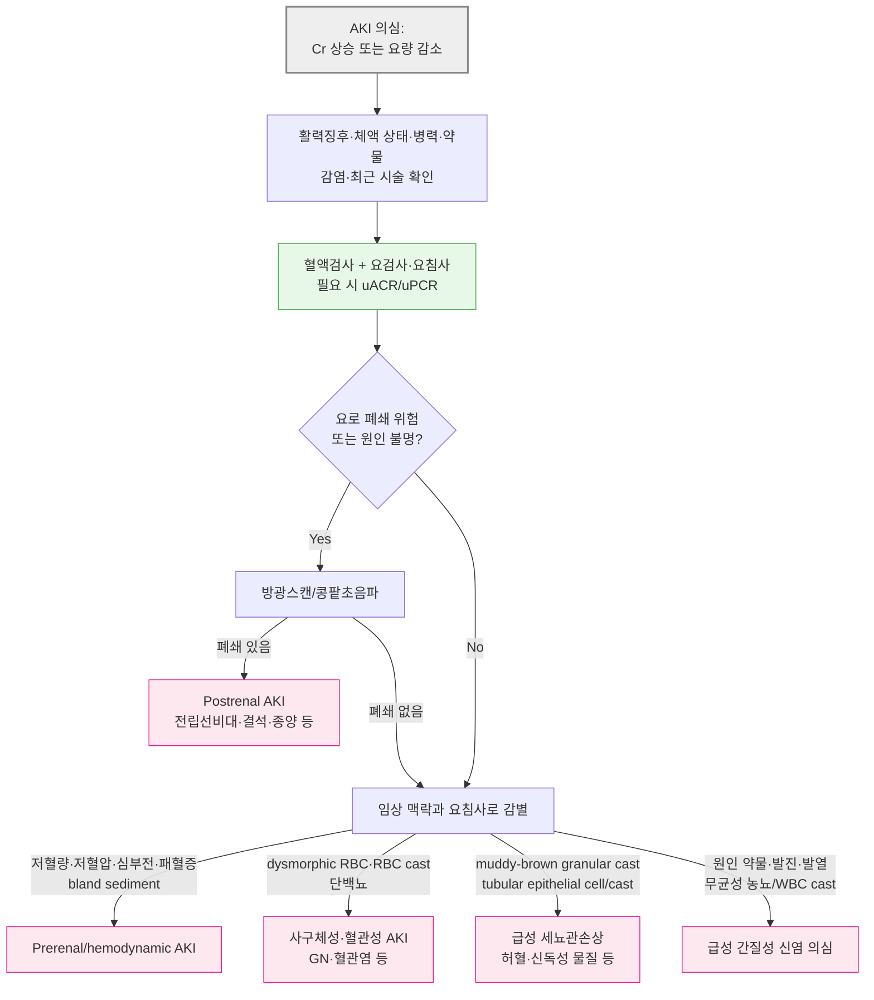

# 콩팥 질환의 진단

## <mark style="color:green;">일반 사항</mark>

* 본 챕터는 콩팥 질환 파트의 진단 도구 챕터로, 소변 검사·콩팥 기능 검사·영상 검사 등 콩팥 질환 전반에 공통으로 사용되는 진단 방법을 다룸
* 개별 질환의 임상 양상·Management·처방은 각 질환별 챕터 참조


**'콩팥' vs '신장 용어 선택** : 학회·정부기관 모두 "콩팥"으로 수렴하는 추세에 맞춰 질환명은 '콩팥'으로 기술하고(콩팥 질환, 콩팥병, 콩팥손상 등), 한자어가 굳어 있는 제도적 명칭은 '신장'으로 기술함(신장이식, 신대체요법, 신동맥협착 등)


### 질병코드

* 본 챕터는 콩팥 질환 전반의 진단 도구를 다루므로 단일 질병코드를 적용하지 않으며, 진단된 개별 질환의 질병코드는 해당 챕터 참조

### <mark style="color:$danger;">🚩 Red Flags!</mark>

<mark style="color:$danger;">**즉시 조치 또는 의뢰**</mark>

* 무뇨(anuria, ＜100 ㎖/day) 또는 AKI에 동반된 혈역학적 불안정·폐부종
* 육안적 혈뇨 + 하복부 팽만, 배뇨통, 방광 촉지 → 혈전에 의한 요로 폐쇄
* 고칼륨혈증(심전도 변화 동반) 또는 요독성 뇌병증·심낭염 징후(의식 변화, 흉통 + 심낭마찰음)
* 수일\~수주 내 Cr 급상승 + 혈뇨(erythrocyte cast) + 핍뇨 → 급속 진행성 사구체신염 의심

<mark style="color:$warning;">**당일~수일 내 평가**</mark>

* 혈청 Cr이 48시간 내 ≥0.3 ㎎/㎗ 상승하거나 7일 내 기저치 대비 ≥1.5배로 상승 → 급성콩팥손상(AKI) 가능성 평가(당일)
* 신규 발견된 eGFR ＜30 ㎖/분/1.73㎡(G4 이상), 특히 급성 저하 가능성이 있거나 증상·전해질 이상이 동반된 경우
* 지속적인 GFR ＞20% 감소(혈역학적 작용 약물 시작 후에는 ＞30% 감소) 또는 원인이 불명확한 빠른 기능 저하
* 고도 증가 알부민뇨(ACR ≥300 ㎎/g)와 혈뇨 동반, 지속적인 ACR ＞700 ㎎/g, 적혈구 원주 또는 설명되지 않는 지속적 RBC ＞20/HPF
* 4제 이상의 항고혈압제에도 조절되지 않는 CKD 동반 치료 저항성 고혈압
* 반복적으로 확인되는 혈청 칼륨 이상·산증 등 CKD 합병증
* 옆구리 통증 + 발열·오한·전신 증상 ± 농뇨 → 급성 신우신염
* 임신부의 증상성 UTI → 신우신염·조산 위험을 고려하여 신속 평가

<mark style="color:$info;">**조기 평가 및 추적**</mark> <mark style="color:$info;">- 즉각 위험은 낮으나 지속되면 원인 평가·의뢰</mark>

* 중등도 증가 알부민뇨(A2, uACR 30\~299 ㎎/g)의 첫 발견 또는 eGFR 60\~89(G2)이면서 다른 콩팥 손상 지표가 동반된 경우
* 무증상 현미경적 혈뇨(dysmorphic erythrocyte·cast 없음)
* 발열·운동 직후 발견된 경도 단백뇨

## <mark style="color:green;">진단</mark>

### <mark style="color:orange;">CKD·AKI 정의 및 진단 기준</mark> \[KDIGO]

* [만성콩팥병](112_-chronic-kidney-disease-ckd.md)(CKD) : 콩팥의 구조 또는 기능 이상이 3개월 이상 지속되며 건강에 영향을 미치는 경우; eGFR과 uACR(urine albumin-to-creatinine ratio) 두 축으로 병기 분류 (☞ [만성콩팥병](112_-chronic-kidney-disease-ckd.md#ckd-heat-map-g-a), [단백뇨](111_-proteinuria.md))
  * 구조·기능 이상에는 알부민뇨, 요침사 이상, 전해질 이상, 영상학적(구조적) 이상, 병리학적 이상, 콩팥 이식 병력 등이 포함됨
* 급성콩팥손상(AKI) 진단 기준 - 다음 중 하나 이상 해당
  * 혈청 Cr이 48시간 이내 ≥0.3 ㎎/㎗ 상승
  * 7일 이내 기저치 대비 ≥1.5배 상승
  * 요량 ＜0.5 ㎖/㎏/h가 6시간 이상 지속
* AKI 진단은 eGFR 감소가 아니라 혈청 Cr의 변화와 요량을 기준으로 판단 - eGFR 공식은 콩팥 기능이 안정된 상태(steady state)를 전제하므로 AKI에서는 부정확
* 급성콩팥병(AKD) : AKI를 포함하여 3개월 미만 지속되는 급성 또는 아급성 콩팥 구조·기능 이상; AKI 이후 7일을 넘어 이상이 지속되면 AKD 경과를 평가
* CKD·AKI 감별이 중요
  * 만성화를 시사하는 소견 : 빈혈, 부갑상선호르몬 상승, 초음파상 콩팥 크기 감소·피질 두께 감소·에코 증가

#### <mark style="color:$primary;">AKI 병기</mark>

<table><thead><tr><th width="90">병기</th><th width="330.47625732421875">혈청 Cr 기준</th><th>요량(㎖/㎏/h) 기준</th></tr></thead><tbody><tr><td>Stage 1</td><td>기저치 대비 1.5~1.9배 또는 ≥0.3 ㎎/㎗ 상승</td><td>6~12시간 동안 ＜0.5</td></tr><tr><td>Stage 2</td><td>기저치 대비 2.0~2.9배</td><td>≥12시간 동안 ＜0.5</td></tr><tr><td>Stage 3</td><td>기저치 대비 ≥3배 또는 혈청 Cr이 ≥4.0 ㎎/㎗에 도달하거나 신대체요법(RRT) 시작</td><td>≥24시간 동안 ＜0.3 또는 무뇨 ≥12시간</td></tr></tbody></table>

* Cr과 요량 기준 중 더 심한 병기를 적용
* Stage 3 또는 심한 고칼륨혈증·대사성산증·용적과다·요독 증상 동반 시 RRT 적응증 평가

#### <mark style="color:$primary;">CKD 병기</mark>

* 원인(Cause), GFR 병기(G1\~G5), 알부민뇨 병기(A1\~A3)를 함께 사용해 "CGA" 방식으로 분류
  * 원인(Cause)-GFR-알부민뇨(CGA) 표기 예 : diabetic kidney disease G3aA2
* 진행/합병증 위험은 GFR 병기와 알부민뇨 병기가 함께 낮을수록 낮고, 함께 높을수록 급격히 상승
* CKD G3\~G5에서는 검증된 콩팥기능상실 위험예측식(KFRE)을 활용할 수 있으며, 5년 콩팥대체요법 위험 ＞3\~5%는 신장내과 의뢰를 고려하는 기준 중 하나임

<table><thead><tr><th width="180.4761962890625">GFR 병기 (㎖/분/1.73㎡)</th><th width="139.5238037109375">A1 (＜30 ㎎/g)</th><th width="160.4761962890625">A2 (30~299 ㎎/g)</th><th width="149.84283447265625">A3 (≥300 ㎎/g)</th></tr></thead><tbody><tr><td>G1 (≥90)</td><td>저위험*</td><td>중등도 위험</td><td>고위험</td></tr><tr><td>G2 (60~89)</td><td>저위험*</td><td>중등도 위험</td><td>고위험</td></tr><tr><td>G3a (45~59)</td><td>중등도 위험</td><td>고위험</td><td>매우 고위험</td></tr><tr><td>G3b (30~44)</td><td>고위험</td><td>매우 고위험</td><td>매우 고위험</td></tr><tr><td>G4 (15~29)</td><td>매우 고위험</td><td>매우 고위험</td><td>매우 고위험</td></tr><tr><td>G5 (＜15)</td><td>매우 고위험</td><td>매우 고위험</td><td>매우 고위험</td></tr></tbody></table>

_\*요검사·영상 검사 등에서 다른 콩팥 손상 증거 없으면 CKD 아님_

***

<strong>AKI 원인 감별 알고리듬 (Prerenal / Intrinsic / Postrenal)</strong>

<em><mark style="color:$info;">저자 재구성(참고 문헌: KDIGO Clinical Practice Guideline for Acute Kidney Injury, 2012)</mark></em>


FeNa·FeUrea는 보조 검사로만 해석함. FeNa는 CKD, 이뇨제 사용, 패혈증, 사구체질환 등에서 진단 정확도가 낮고, 요중 호산구도 급성 간질성 신염의 확진 또는 배제 검사로 사용하지 않음.


***

### <mark style="color:orange;">소변 검사</mark>

#### <mark style="color:$primary;">초기 평가 원칙</mark>

* CKD 위험군(당뇨병, 고혈압, 심혈관질환, AKI 병력, CKD 가족력, 전신질환, 신독성 약물 장기 사용 등)은 혈청 Cr 기반 eGFR과 uACR을 함께 평가
* 우연히 발견된 낮은 eGFR, 알부민뇨 또는 혈뇨는 임상적 긴급도에 맞춰 재검하여 확인 - 단일 이상값만으로 CKD의 만성성을 단정하지 않음
* 시험지봉 잠혈 양성은 요현미경검사로 RBC 존재 여부를 확인하여 혈뇨와 hemoglobinuria·myoglobinuria를 구분
* 시험지봉 단백 양성은 가능한 경우 uACR 또는 uPCR로 정량

#### <mark style="color:$primary;">소변 채취 Tips</mark>

* 검사 전 과도한 신체 운동을 피하고, 월경·발열·증상성 UTI 등 일시적 알부민뇨·혈뇨를 유발할 상황을 확인
* 아침 첫 소변(또는 8시간 농축뇨, 불가피한 경우 임의뇨)의 중간뇨 채취
* 붕산(보릭) 등 소독제로 요도 입구를 닦지 않음
* 오염되지 않도록 남성은 포피를 뒤로 젖히고, 여성은 음순이 닿지 않게 하고 채취
* 채취 후 실온(15\~25℃)에서 보관하며 1\~2시간 내 검사, 불가피하게 검사가 지연되는 경우 냉장(2\~8℃) 보관
* 도뇨관을 통한 채취 : 배액백에서 채취하지 않고 무균적으로 소독한 검체 채취 포트에서 채취. 장기간 유지 중인 도뇨관 관련 UTI가 의심되어 교체 적응증이 있으면 새 도뇨관으로 교체한 뒤 채취

#### <mark style="color:$primary;">24시간 소변 채취 방법</mark>

1. 아침에 기상하여 방광을 완전히 비워 버림(첫 소변은 모으지 않음), 시간을 기록
2. 이후 나오는 모든 소변을 병에 모아 검사실 지침에 따라 냉장 또는 지정 보존 방법으로 보관
3. 배변할 때 배출되는 소변도 수집해야 함
4. 정확히 24시간 후 방광을 비운 마지막 소변까지 수집
5. 한 번이라도 소변을 누락하면 검사실에 알리고 필요하면 처음부터 다시 채취

#### <mark style="color:$primary;">배양 검사</mark>

* 대상 : 신우신염 또는 전신 UTI 의심, 임신, 남성, 복잡성 UTI, 재발성 UTI, 비전형적 증상, 초기 치료 실패, 내성균 위험, 도뇨관 관련 UTI가 의심되는 경우
* 고령 또는 도뇨관 유치 자체만으로 배양·항생제 치료를 결정하지 않으며, 국소 요로 증상이나 발열·혈역학적 불안정 등 전신 감염 소견을 함께 평가
* 임신부는 임신 초기에 소변배양으로 무증상 세균뇨를 선별하고 양성이면 치료하되, 무증상 세균뇨 자체는 응급 의뢰 기준이 아님

#### <mark style="color:$primary;">무균성 농뇨(Sterile Pyuria)의 원인</mark>

* 오염(용기, 질 분비물)
* chronic interstitial nephritis
* 콩팥 결석
* uroepithelial tumor
* 방광에 인접한 복강 내 염증
* painful bladder syndrome, interstitial cystitis
* atypical organism(예: Chlamydia, Ureaplasma urealyticum, 결핵)에 의한 감염
* STI(임질·클라미디아 등 성매개 감염)
* 약물 유발 급성 간질성 신염(AIN) - PPI, NSAIDs, 면역항암제(Immune Checkpoint Inhibitor) 등

#### <mark style="color:$primary;">예방적 소변 검사의 한계</mark>

* 소변 검사의 양성 결과와 질병 상태가 일치하지 않을 수 있음
* 다수의 사람에게서 불필요하거나 잠재적인 위해가 될 수 있음. 예) 유의미하지 않은 결과와 관련된 걱정, 불필요한 추가 검사 시행에 따른 비용 및 부작용
* 위험인자가 없는 무증상 일반 인구를 대상으로 한 일률적인 시험지봉 선별검사의 임상적 이득은 확립되어 있지 않음. 다만 CKD 고위험군에서는 eGFR과 uACR을 함께 평가

#### <mark style="color:$primary;">소변 시험지봉 검사의 해석</mark>

<table data-search="false"><thead><tr><th width="125">검사 항목</th><th>실제 양성의 주요 원인</th><th>위양성·간섭 요인</th><th>위음성·간섭 요인</th></tr></thead><tbody><tr><td>잠혈 Occult blood</td><td>혈뇨, hemoglobinuria, myoglobinuria</td><td>월경혈 오염, 산화제 오염, 격렬한 운동</td><td>고농도 Vit C, 높은 비중, 강한 산성뇨, 현저한 단백뇨</td></tr><tr><td>빌리루빈 Bilirubin</td><td>간세포질환, 담즙울체·담도폐쇄</td><td>색소 약물에 의한 판독 간섭</td><td>빛에 오래 노출된 검체, 고농도 Vit C, 아질산염</td></tr><tr><td>우로빌리노겐 Urobilinogen</td><td>용혈, 간세포질환</td><td>phenazopyridine 등 색소 약물</td><td>완전 담도폐쇄, 오래된 검체, 일부 항생제 사용</td></tr><tr><td>케톤 Ketone</td><td>당뇨병성케톤산증, 기아·저탄수화물식, 지속적 구토, 임신</td><td>일부 약물의 sulfhydryl기, 강한 색소뇨</td><td>오래된 검체; β-hydroxybutyrate 우세 시 과소평가</td></tr><tr><td>단백 Protein</td><td>사구체질환, 일시적 발열·운동·기립성 단백뇨, UTI</td><td>농축뇨, 강한 알칼리뇨, 혈뇨·농뇨, 소독제 오염</td><td>희석뇨, albumin 이외 단백질(경쇄·저분자량 단백질)</td></tr><tr><td>아질산염 Nitrite</td><td>질산염 환원 세균에 의한 세균뇨</td><td>오래되거나 오염된 검체, 시험지봉 공기 노출, 색소뇨</td><td>짧은 방광 저류시간, 질산염 섭취 부족, Vit C, 높은 비중·산성뇨, Enterococcus 등 질산염 비환원균</td></tr><tr><td>포도당 Glucose</td><td>고혈당, 임신, 신장성 당뇨·Fanconi 증후군, SGLT2 억제제 사용</td><td>산화제 오염</td><td>고농도 Vit C, 높은 비중, 오래된 검체</td></tr><tr><td>백혈구 Leukocyte esterase</td><td>UTI, 무균성 농뇨</td><td>질 분비물·산화제 오염, 색소뇨</td><td>높은 비중, 뇨당·단백뇨·케톤뇨, Vit C, 일부 항생제</td></tr></tbody></table>

* 포도당 검사에 있어서 과당, 유당, 갈락토오스 등은 검출 안 됨
* 빌리루빈(+) & 우로빌리노겐(-) : 폐색성/담즙울체 질환
* 빌리루빈(+) & 우로빌리노겐(+) : 간 실질 장애
* overhydration 시 소변이 희석되어 위음성을 초래할 수 있음
* leukocyte esterase와 nitrite가 모두 양성이면 UTI 가능성이 높아지나, nitrite 음성만으로 UTI를 배제하지 못함
* 고령 및 도뇨관 유치 환자에서는 무증상 세균뇨가 흔하므로 증상 없이 UTI 진단·항생제 투여를 목적으로 시험지봉 검사를 시행하지 않음
* 시험지봉의 부적당한 보관은 검사 결과에 영향을 미칠 수 있음

**pH**

* 산성 : 대사성·호흡성 산증, 당뇨병성케톤산증, 기아, 설사, 동물성 단백질 위주 식사
* 알칼리성 : urease 생성균 UTI, 구토, 원위 신세뇨관산증, 채소·과일 위주 식사, 식후 alkaline tide, 오래된 검체

**비중 (SG)**

* 증가 : 수분 섭취 제한, 탈수증, 당뇨병, 덱스트란용액, 조영제, 단백뇨, SIADH
* 감소 : 수분 과잉 섭취, 이뇨제 사용, 요붕증, 콩팥 농축능 저하(세뇨관간질질환·진행된 CKD 등); 알칼리뇨에서는 시험지봉 비중이 낮게 측정될 수 있음

#### <mark style="color:$primary;">요 알부민/크레아티닌 비율 (uACR)</mark>

* Spot urine uACR이 24시간 소변 채집보다 권장됨 - 환자 부담이 적고 신뢰도는 유사; 가능하면 아침 첫 소변으로 측정하는 것이 가장 권장됨
* 정상\~경도 증가(A1) ＜30 ㎎/g, 중등도 증가(A2) 30\~299 ㎎/g, 고도 증가(A3) ≥300 ㎎/g
* 무작위뇨에서 uACR ≥30 ㎎/g이면 가능하면 이후 아침 첫 중간뇨로 확인; 운동, 월경, 발열, 증상성 UTI, 혈뇨 등 일시적 증가 요인을 배제
* 요 시험지봉 단백 검사는 미세알부민뇨(중등도 증가 알부민뇨로 용어 변경 ☞ [단백뇨](111_-proteinuria.md)) 단계를 놓칠 수 있어, 당뇨병·고혈압 등 CKD 고위험군 선별에는 uACR을 우선 시행
* Dipstick은 albumin에 민감한 반면 저분자량 단백질(low molecular weight protein)은 놓칠 수 있음 - Bence-Jones protein, Fanconi 증후군, tubular proteinuria 등은 dipstick 음성일 수 있음

* 총 단백 배설 또는 비알부민 단백뇨가 의심되면 uPCR 및 원인별 검사를 고려
* 상세 평가·감별은 [단백뇨](111_-proteinuria.md) 챕터 참조

#### <mark style="color:$primary;">소변의 현미경적 소견과 관련 질환</mark>

<table data-search="false"><thead><tr><th width="335.2381591796875">현미경적 소견</th><th>관련 질환·해석</th></tr></thead><tbody><tr><td>fatty cast, oval fat body</td><td>신증후군 또는 현저한 지질뇨</td></tr><tr><td>백혈구 + bacteria, WBC cast</td><td>급성 신우신염 시사</td></tr><tr><td>WBC cast without bacteria</td><td>급성 간질성 신염, 일부 사구체신염 등</td></tr><tr><td>normal-shaped(isomorphic) erythrocyte</td><td>비사구체성 혈뇨(non-glomerular bleeding)</td></tr><tr><td>dysmorphic erythrocyte</td><td>사구체성 혈뇨(glomerular bleeding)</td></tr><tr><td>erythrocyte cast</td><td>사구체신염·혈관염 등 사구체성 질환</td></tr><tr><td>muddy-brown granular cast, tubular epithelial cell/cast</td><td>급성 세뇨관손상</td></tr><tr><td>waxy/broad cast</td><td>진행된 CKD 또는 심한 소변 정체</td></tr><tr><td>hyaline cast</td><td>정상에서도 소량 관찰 가능; 탈수·운동·발열·이뇨제 사용 등에서 증가</td></tr></tbody></table>

* 요중 호산구는 민감도·특이도가 낮아 급성 간질성 신염의 확진 또는 배제 검사로 사용하지 않음

#### <mark style="color:$primary;">소변의 색과 원인</mark>

<table data-search="false"><thead><tr><th width="114.28570556640625">소변 색</th><th>주요 원인</th></tr></thead><tbody><tr><td>무색</td><td>희석뇨, 과도한 수분 섭취, 다뇨</td></tr><tr><td>진한 황색</td><td>농축뇨, 탈수</td></tr><tr><td>혼탁</td><td>농뇨, 결정뇨, 인산염뇨, chyluria, 질 분비물 오염</td></tr><tr><td>오렌지색</td><td>phenazopyridine, rifampin, 농축뇨</td></tr><tr><td>갈색·차색</td><td>bilirubinuria, hemoglobinuria, myoglobinuria, 사구체성 혈뇨, 일부 약물</td></tr><tr><td>검은색</td><td>alkaptonuria, melanin, 오래된 혈액, 일부 약물</td></tr><tr><td>적색·분홍색</td><td>혈뇨, hemoglobinuria, myoglobinuria, 비트·블랙베리 등 음식, rifampin</td></tr><tr><td>청색·녹색</td><td>methylene blue, propofol, amitriptyline, 일부 색소·감염</td></tr></tbody></table>

* 자극적인 냄새 : 요로 감염, 농축뇨
* 거품 : 공기, 단백뇨

### <mark style="color:orange;">콩팥 기능 검사</mark>

#### <mark style="color:$primary;">BUN</mark>

* 간에서 합성되는 단백질 대사의 최종 산물; 사구체에서 여과되고 renal tubule에서 재흡수 됨
* 증가 : 체액 고갈(콩팥에서의 재흡수 증가), catabolism↑(예: 위장관 출혈, cell lysis, steroid 사용), 단백질 섭취↑, 콩팥 관류↓(예: 심부전, renal artery stenosis)
* 감소 : 중증 간질환, 영양실조, 단백질 섭취 부족, 수분 과다·SIADH
* BUN/Cr ratio : 정상=10\~20/1
  * ＞20/1인 경우 prerenal azotemia 시사; 단, 상부위장관 출혈·고단백 식이·고용량 steroid·이화항진 상태 등 prerenal 없이도 BUN만 상승하는 신외성 원인이 있으므로 병력을 참고하여 해석

#### <mark style="color:$primary;">크레아티닌 청소율 (Cr Clearance, Cockcroft-Gault)</mark>

* Cr : 근육 대사산물로서 사구체에서 여과되며, 콩팥 기능이 안정되면 일정하게 유지됨
* Cockcroft-Gault 공식은 특정 약물의 임상시험·허가사항·급여기준이 CrCl을 요구할 때 주로 사용하며, CKD 진단·병기 분류에는 검증된 eGFR 공식을 사용
* 근위세뇨관에서 Cr이 일부 분비되므로 CrCl은 실제 GFR을 과대평가할 수 있음. 정확한 평가가 임상 결정에 중요하면 eGFRcr-cys 또는 measured GFR을 고려
* [CrCl(㎖/분)](https://www.mdcalc.com/calc/43/creatinine-clearance-cockcroft-gault-equation) = {(140-연령) × 몸무게(㎏)} ÷ {72 × s-Cr} × 0.85(if female)
  * Cockcroft-Gault 공식은 체표면적(1.73㎡) 보정을 하지 않은 추정 CrCl(㎖/분)이며, MDRD·CKD-EPI(㎖/분/1.73㎡, 체표면적 보정)와 단위가 다름
  * 비만(BMI ≥30 ㎏/㎡) 또는 심한 부종 환자에서 실제 체중(actual body weight)을 그대로 대입하면 CrCl이 과대평가될 수 있음 - 이상 체중(IBW) 또는 조정 체중(ABW) 적용을 고려

**약물 용량 조절 기준 :** KDIGO 2024는 대부분의 환자와 임상 상황에서 검증된 혈청 Cr 기반 eGFR 공식을 약물 용량 결정에 사용할 수 있다고 제시함. 다만 DOAC 등 임상시험·허가사항이 CrCl 기반인 약물은 Cockcroft-Gault 공식을 따라야 하며, 국내 허가사항·HIRA 급여 기준을 약제별로 확인함. 체격이 매우 크거나 작고 약물의 치료범위가 좁으면 체표면적 보정을 해제한 eGFR(㎖/분), eGFRcr-cys 또는 measured GFR을 고려함.


#### <mark style="color:$primary;">Cystatin C</mark>

* cysteine protease inhibitor의 cystatin superfamily의 일종인 저분자량 단백질. 혈청 측정
* Cr과 병용하여 GFR과 CKD를 보다 정확하게 평가하는데 활용; 근육양이 많은 젊은 환자에서 s-Cr이 높게 측정되는 경우 또는 근육양이 적은 노인 환자에서 콩팥 기능 장애를 진단할 때 유용
* 측정 방법이 상대적으로 까다롭고 검사 비용이 높음
* 비-GFR 결정인자 : 비만, 흡연, 갑상선기능 이상, 고용량 glucocorticoid, 염증 등이 cystatin C에 영향을 줄 수 있어 임상 맥락과 함께 해석

#### <mark style="color:$primary;">사구체여과율 (GFR)</mark>

* 콩팥 기능 평가 도구로 활용; 콩팥의 여과 능력을 반영 (☞ [계산식](https://www.kidney.org/professionals/gfr_calculator))
* 초기 평가는 일반적으로 혈청 Cr과 검증된 공식으로 산출한 eGFRcr을 사용
  * 인종 계수를 사용하지 않으며 동일 지역 내에서 통일된 검증 공식을 사용하는 것이 원칙. 국내에서는 검사실이 보고하는 공식과 적용 기준을 확인
  * CKD-EPI 2021은 대표적인 인종 비보정 공식이며 IDMS-traceable(표준화) 크레아티닌 값을 전제로 개발됨
* 근육량·식이 등으로 eGFRcr이 부정확할 가능성이 있거나 GFR이 임상 결정에 중요한 경우 eGFRcr-cys를 사용하고, 이 역시 불확실하거나 매우 정확한 값이 필요한 경우 외인성 여과표지자를 이용한 measured GFR을 고려
* 급격한 콩팥 기능 변화에서는 steady state를 전제로 하는 eGFR 공식이 부정확하므로 Cr 변화·요량·임상 경과를 함께 평가

**CKD-EPI Creatinine equation (2021)** - 대표적인 인종 비보정 공식

* eGFR = 142 × min(Scr/κ, 1)α × max(Scr/κ, 1)-1.200 × 0.9938연령 \[× 1.012 if female]
  * κ= 여 0.7/남 0.9, α= 여 -0.241, 남 -0.302; min= Scr/κ or 1 중 최소값, max= Scr/κ or 1 중 최대값

**CKD-EPI Creatinine–Cystatin equation (2021)**

* Creatinine 단독 공식의 한계(근육량 의존성)를 보완하는 보다 정확한 보완적 추정식
* eGFRcr-cys = 135 × min(Scr/κ, 1)α × max(Scr/κ, 1)-0.544 × min(Scys/0.8, 1)-0.323 × max(Scys/0.8, 1)-0.778 × 0.9961연령 \[× 0.963 if female]
  * κ= 여 0.7/남 0.9, α= 여 -0.219/ 남 -0.144; min(Scr/κ, 1)= Scr/κ or 1.0 중 최소값, max(Scr/κ, 1)= Scr/κ or 1.0 중 최대값; min(Scys/0.8, 1)= Scys/0.8 or 1 중 최소값, max(Scys/0.8, 1)= Scys/0.8 or 1 중 최대값

**CKD-EPI Cystatin C equation (2012)**

* Cystatin C 단독 공식(CKD-EPI Cystatin C, 2012)도 존재하나, 가능하면 같은 검체에서 Cr을 함께 측정하여 eGFRcr-cys를 산출. Cr 해석이 매우 어려운 상황에서는 eGFRcys가 보조적으로 유용할 수 있으나 비-GFR 결정인자를 고려


**MDRD**는 CKD-EPI 이전에 널리 쓰였던 공식임. 현재는 검사실에서 보고하는 지역 내 검증·통일된 eGFR 공식을 우선하며, 서로 다른 공식으로 계산한 값을 추적 비교할 때 주의함.


### <mark style="color:orange;">영상 검사 - 초음파</mark>

<mark style="color:cyan;">**검사 대상**</mark>

* 재발성·비전형적 또는 복잡성 UTI
* 적절한 치료에도 반응하지 않는 UTI
* 배뇨 후 불완전 비움 증상 또는 촉지되는 방광
* 재발성 Proteus 감염(신결석 관련)
* 만성콩팥병 의심 시 만성화 평가(콩팥 크기 감소, 피질 두께 감소, 에코 증가) - AKI와의 감별에 유용
* 폐쇄성 요로병증(hydronephrosis) 평가 - 급성콩팥손상의 교정 가능한 원인 확인
* 다낭성 콩팥 질환 등 구조적 이상 평가
* 신동맥협착 의심 시 도플러 초음파 고려
* 요로 폐쇄 위험이 있거나 원인이 명확하지 않은 급성콩팥손상(AKI)
* 신동맥협착 의심 시 CT angiography 또는 MR angiography, 상부요로상피 종양 의심 시 CT urography, 콩팥 종괴 평가 시 조영증강 다중시기 CT 또는 MRI를 임상 상황과 콩팥 기능에 따라 선택

### <mark style="color:orange;">증상/병력에 따른 배뇨 문제의 감별</mark>

<table><thead><tr><th width="212.3809814453125">증상</th><th>감별 질환/원인</th></tr></thead><tbody><tr><td>배뇨통(dysuria)</td><td>요도염, 방광염, 전립선염, 질염, 성매개 감염, 외상, 종양</td></tr><tr><td>주저뇨·약한 요류·잔뇨감</td><td>전립선비대증, 요도협착, 신경인성 방광, 약물, 골반장기탈출증</td></tr><tr><td>옆구리 통증</td><td>신결석, 신우신염, 요로 폐쇄; 드물게 콩팥경색·출혈</td></tr><tr><td>빈뇨</td><td>요도염, 방광염, 질염, 방광 결석, 과민성 방광, 간질성 방광염, 불안</td></tr><tr><td>다뇨</td><td>과다 수분 섭취, 이뇨제, 당뇨병, 요붕증, 삼투성 이뇨</td></tr><tr><td>야간뇨</td><td>전립선비대증·방광 기능 저하, 야간다뇨, 심부전·말초부종, 수면무호흡증, 당뇨병·요붕증, 수면장애</td></tr></tbody></table>

#### <mark style="color:$primary;">Dysuria 감별 진단</mark>

<figure><figcaption>Dysuria 감별 진단 알고리듬</figcaption></figure>

***

## <mark style="color:blue;">환자 안내서</mark>

### <mark style="color:$primary;">왜 소변 검사와 콩팥 기능 검사를 하나요?</mark>

* 콩팥은 몸의 노폐물을 걸러내고 수분·전해질 균형을 맞추는 장기입니다. 초기에는 증상이 거의 없는 경우가 많아, 검사로 미리 확인하는 것이 중요합니다.
* 소변 검사와 혈액 크레아티닌으로 계산한 eGFR을 이용해 콩팥이 잘 일하고 있는지 확인합니다.

### <mark style="color:$primary;">검사 결과가 이상하다고 나오면 어떻게 하나요?</mark>

* 한 번의 이상 소견만으로 병이라고 단정하지 않습니다. 물을 충분히 마시지 않았거나, 운동 직후, 발열 시에도 일시적으로 이상 소견이 나올 수 있습니다.
* 검사 종류와 이상 정도에 따라 며칠~수개월 안에 재검할 수 있습니다. 3개월 이상 지속되는 콩팥 구조 또는 기능 이상은 만성콩팥병을 시사하지만, 한 번의 이상 검사만으로 3개월을 기다리는 것은 아닙니다.

### <mark style="color:$primary;">이런 증상이 있으면 바로 병원에 가세요</mark> 🚨

* 소변량이 갑자기 줄었거나 거의 나오지 않습니다
* 붉은 소변에 덩어리(혈전)가 섞여 나오면서 아랫배가 아프고 팽팽합니다
* 평소와 다르게 숨이 차거나 의식이 흐릿합니다

### <mark style="color:$primary;">콩팥을 보호하는 습관</mark>

* **NSAIDs(진통소염제)를 장기간 임의로 복용하지 마십시오.** 특히 콩팥 기능이 저하된 경우 NSAIDs가 콩팥 손상을 악화시킬 수 있습니다.

## 참고문헌

1. Kidney Disease: Improving Global Outcomes (KDIGO) CKD Work Group. KDIGO 2024 Clinical Practice Guideline for the Evaluation and Management of Chronic Kidney Disease. Kidney Int. 2024;105(Suppl 4S):S117-S314.
2. Kidney Disease: Improving Global Outcomes (KDIGO) Acute Kidney Injury Work Group. KDIGO Clinical Practice Guideline for Acute Kidney Injury. Kidney Int Suppl. 2012;2:1-138.
3. Nicolle LE, Gupta K, Bradley SF, et al. Clinical Practice Guideline for the Management of Asymptomatic Bacteriuria: 2019 Update by the Infectious Diseases Society of America. Clin Infect Dis. 2019;68:e83-e110.
