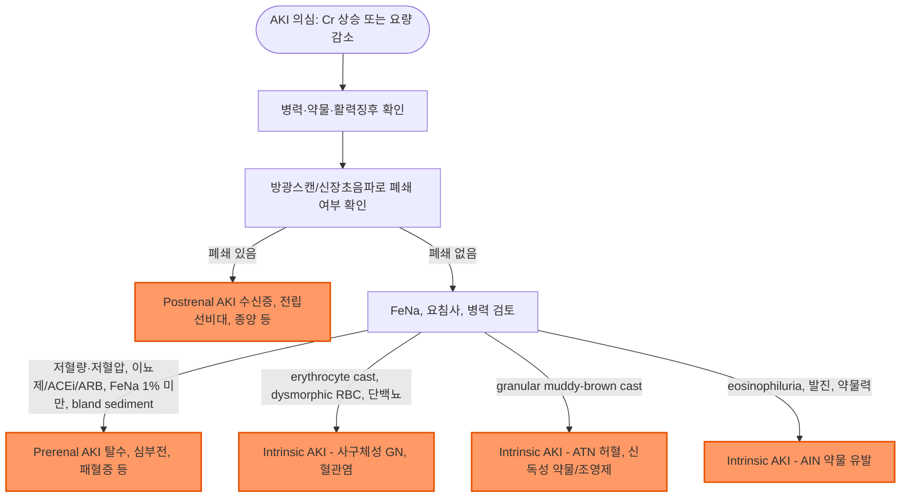

# 신장 질환의 진단

## <mark style="color:green;">일반 사항</mark>

* 본 챕터는 신장 질환 파트의 진단 도구 챕터로, 소변 검사·신장 기능 검사·영상 검사 등 신장 질환 전반에 공통으로 사용되는 진단 방법을 다룸
* 개별 질환의 임상 양상·Management·처방은 각 질환별 챕터 참조

### <mark style="color:$danger;">🚩 Red Flags!</mark>

<mark style="color:$danger;">**즉각 조치 또는 의뢰**</mark>

* 무뇨(anuria, ＜100 ㎖/day) 또는 급격한 Cr 상승(48시간 내 ≥0.3 ㎎/㎗ 상승 또는 7일 내 기저치 대비 ≥1.5배) → 급성 신손상(AKI)
* 육안적 혈뇨 + 하복부 팽만, 배뇨통, 방광 촉지 → 혈전에 의한 요로 폐쇄
* 고칼륨혈증(심전도 변화 동반) 또는 요독성 뇌병증·심낭염 징후(의식 변화, 흉통 + 심낭마찰음)
* 수일\~수주 내 Cr 급상승 + 혈뇨(erythrocyte cast) + 핍뇨 → 급속 진행성 사구체신염

<mark style="color:$warning;">**당일 또는 조기 의뢰**</mark>

* 신규 발견된 eGFR ＜30(G4 이상) 또는 3개월 내 eGFR ≥25% 급격한 저하
* 신규 발견된 중등도\~고도 알부민뇨(A3, UACR ＞300 ㎎/g)
* 이뇨제 포함 3종 이상 항고혈압제에도 조절되지 않거나, 4종 이상 항고혈압제를 복용 중인 치료 저항성 고혈압
* 반복적으로 확인되는 혈청 칼륨 이상(고칼륨혈증 등)
* 옆구리 통증 + 발열 + 백혈구·질산염 양성 → 신우신염
* 임신부의 무증상 세균뇨 또는 UTI → 신우신염, 조산 위험

<mark style="color:$info;">**외래 추적 / 추가 평가 계획**</mark> <mark style="color:$info;">- 즉각 위험 낮으나 호전 없으면 의뢰</mark>

* 경도\~중등도 알부민뇨(A2) 또는 eGFR 60\~89(G2)의 첫 발견
* 무증상 현미경적 혈뇨(dysmorphic erythrocyte·cast 없음)
* 발열·운동 직후 발견된 경도 단백뇨

## <mark style="color:green;">진단</mark>

### <mark style="color:orange;">CKD·AKI 정의 및 진단 기준</mark>

* 만성신장병 : 신장의 구조 또는 기능 이상이 3개월 이상 지속되며 건강에 영향을 미치는 경우; eGFR과 알부민뇨(ACR) 두 축으로 병기 분류 \[CKD, KDIGO 2024]
  * 구조·기능 이상에는 알부민뇨, 요침사 이상, 전해질 이상, 영상학적(구조적) 이상, 병리학적 이상, 신장이식 병력 등이 포함됨
* 급성 신손상(AKI) criteria - 다음 중 하나 \[KDIGO]
  * 혈청 Cr이 48시간 이내 ≥0.3 ㎎/㎗ 상승
  * 7일 이내 기저치 대비 ≥1.5배 상승
  * 요량 ＜0.5 ㎖/㎏/h가 6시간 이상 지속
* AKI 진단은 eGFR 감소가 아니라 혈청 Cr의 변화와 요량을 기준으로 판단 - eGFR 공식은 신기능이 안정된 상태(steady state)를 전제하므로 AKI에서는 부정확
* CKD·AKI 감별이 중요 - 만성화를 시사하는 소견 : 빈혈, 부갑상선호르몬 상승, 초음파상 신장 크기 감소·피질 두께 감소·에코 증가

<mark style="color:cyan;">**AKI 병기(KDIGO Stage 1\~3)**</mark> (2023년부터 개정 작업을 진행 중)

<table><thead><tr><th width="90">병기</th><th width="330.47625732421875">혈청 Cr 기준</th><th>요량(㎖/㎏/h) 기준</th></tr></thead><tbody><tr><td>Stage 1</td><td>기저치 대비 1.5~1.9배 또는 ≥0.3 ㎎/㎗ 상승</td><td>6~12시간 동안＜0.5</td></tr><tr><td>Stage 2</td><td>기저치 대비 2.0~2.9배</td><td>≥12시간 동안 ＜0.5</td></tr><tr><td>Stage 3</td><td>기저치 대비 ≥3배 또는 Cr ≥4.0 ㎎/㎗ 상승 또는 신대체요법(RRT) 시작</td><td>≥24시간 동안 ＜0.3 또는 무뇨 ≥12시간</td></tr></tbody></table>

* Cr과 요량 기준 중 더 심한 병기를 적용
* Stage 3 또는 심한 고칼륨혈증·대사성산증·용적과다·요독 증상 동반 시 RRT 적응증 평가

***

<strong>AKI 원인 감별 알고리듬 (Prerenal / Intrinsic / Postrenal)</strong>

<em><mark style="color:$info;">Ref. KDIGO Clinical Practice Guideline for Acute Kidney Injury (2012)</mark></em>

***


단백뇨·혈뇨의 상세 접근 알고리듬(Dipstick→UACR→UPCR→24시간 단백뇨 / 육안 혈뇨→현미경→RBC morphology→CT·비뇨기과 의뢰)은 [단백뇨](111_-proteinuria.md)·[혈뇨](110_-hematuria.md) 챕터에서 다룸


### <mark style="color:orange;">소변 검사</mark>

#### <mark style="color:$primary;">소변 채취 Tips</mark>

* 검사 전 3일간 과도한 신체 운동을 피함, 검사 전날 편향된 식이 섭취를 피함
* 아침 첫 소변(또는 8시간 농축뇨, 불가피한 경우 임의뇨)의 중간뇨 채취
* 붕산(보릭) 등 소독제로 요도 입구를 닦지 않음
* 오염되지 않도록 남성은 포피를 뒤로 젖히고, 여성은 음순이 닿지 않게 하고 채취
* 채취 후 실온(15\~25℃)에서 보관하며 1\~2시간 내 검사, 불가피하게 검사가 지연되는 경우 냉장(2\~8℃) 보관
* 도뇨관을 통한 채취 : 가능하다면 새로 시술한 관을 통해 채취, 도뇨관 속에 남아 있는 소변을 버리고 채취

#### <mark style="color:$primary;">24시간 소변 채취 방법</mark>

1. 아침에 기상하여 방광을 완전히 비워 버림(첫 소변은 모으지 않음), 시간을 기록
2. 이후 모든 소변을 병에 모음. 실온 또는 냉장 보관함
3. 배변할 때 배출되는 소변도 수집해야 함
4. 다음날 아침, 전 날 첫 번째 배뇨한 시간 전후 10분 이내에 배뇨하여 수거; 만약 20분 전에 요의를 느낀다면 잠시 참도록 함

#### <mark style="color:$primary;">배양 검사</mark>

* 대상 : 불확실한 진단, 비전형적 증상, complicated UTI 의심, 신우신염 의심, 임신, 남성, 초치료 실패, 재발, 항생제 내성균 의심, 도뇨관 유치, 증상이 있는 ＞65세에서 항생제 투여 결정 시(IDSA - 연령 자체가 아닌 증상 유무가 배양 적응증의 핵심)
  * 항생제 내성 위험군 : 비뇨생식기 이상, 신장 손상, 최근 6개월 동안 ＞7일 입원, 최근 내성 지역 여행, 이전 UTI 내성

#### <mark style="color:$primary;">무균성 농뇨(Sterile Pyuria)의 원인</mark>

* 오염(용기, 질 분비물)
* Chronic interstitial nephritis
* 신장 결석
* Uroepithelial tumor
* 방광에 인접한 복강 내 염증
* Painful bladder syndrome, interstitial cystitis
* Atypical organism(예: Chlamydia, Ureaplasma urealyticum, 결핵)에 의한 감염
* STI(임질·클라미디아 등 성매개 감염)
* 약물 유발 급성 간질성 신염(AIN) - PPI, NSAIDs, 면역항암제(Immune Checkpoint Inhibitor) 등

#### <mark style="color:$primary;">예방적 소변 검사의 한계</mark>

* 소변 검사의 양성 결과와 질병 상태가 일치하지 않을 수 있음
* 다수의 사람에게서 불필요하거나 잠재적인 위해가 될 수 있음. 예) 유의미하지 않은 결과와 관련된 걱정, 불필요한 추가 검사 시행에 따른 비용 및 부작용
* 무증상 성인 또는 소아에서 예방 관리 범주에서의 소변 검사는 추천하지 않음

#### <mark style="color:$primary;">소변 시험지봉 검사의 해석</mark>

<table data-search="false"><thead><tr><th width="130">검사 항목</th><th width="337.6190185546875">양성 (원인)</th><th>위음성 (원인)</th></tr></thead><tbody><tr><td>잠혈  Occult blood</td><td>요로 출혈; 탈수, 운동, 생리혈, hemoglobinuria, myoglobinuria, 산화오염물(차아염소산염, 포비돈, 세균이나 채소의 과산화효소), 질 내 유산균의 과산화효소</td><td>captopril, 비중 증가, pH ＜5.1, 단백뇨, Vit C</td></tr><tr><td>빌리루빈  Bilirubin</td><td>간염, 담도폐쇄; chlorpromazine, etodolac, rifampin, pyridinium, phenazopyridine</td><td>Vit C, 아질산염, 오래된 검체, 빛에 오래 노출, selenium</td></tr><tr><td>우로빌리노겐  Urobilinogen</td><td>용혈, 간질환(간염); 알칼리뇨, nitrite 증가, PAS, phosphobilinogen, sulfonamide, phenazopyridine</td><td>(음성) 완전 담도폐쇄, 장기간 항생제 사용, 심한 신장애, 오래된 검체</td></tr><tr><td>케톤  Ketone</td><td>당뇨병성케톤증, 고지방식, 저탄수화물식, 기아, 구토, 운동, 외상, 임신, 글리코겐축적병; 산성뇨, 비중 증가, L-DOPA, cephalosporin, captopril, mesna, phenolphthalein</td><td>오래된 검체</td></tr><tr><td>단백  Protein</td><td>신질환, 운동, 발열, 요로 감염증, 기립; 농축뇨(SG ＞1.015), 알칼리뇨(pH ＞7~8), 빌리루빈뇨, 소변 내 세포/세균, 오래된 검체, phenazopyridine, ammonia 화합물</td><td>산성뇨(pH ＜3), 희석뇨(SG ＜1.005), 저분자량 단백질(nonalbumin protein)</td></tr><tr><td>질산염  Nitrite</td><td>아질산염 생산 세균 감염; 오염, dipstick 공기 노출, 육안 혈뇨, phenazopyridine</td><td>구토, 기아, 질산염 식품 섭취 부족, 질산염 비환원 세균(Group B Strep), 비중 증가, 우로빌리노겐 증가, 산성뇨, 짧은 방광 내 저류(4시간 이내), Vit C, 오래된 검체</td></tr><tr><td>포도당  Glucose</td><td>당뇨병, 신장성 당뇨병, 판코니증후군, 임신, 중금속 중독, 신장염, 신증후군; Vit D 과잉 투여</td><td>높은 비중, 오래된 검체, 케톤, 과량의 Vit C, L-DOPA, aspirin</td></tr><tr><td>백혈구  Leukocyte esterase</td><td>요로 감염, 무균성 농뇨; 질액 오염, 산화제 오염</td><td>고농도 옥살산, 뇨당, 단백뇨, 케톤뇨, Vit C, 높은 비중, 산화 약물(cepha계, tetracycline, nitrofurantoin, gentamicin)</td></tr></tbody></table>

* 포도당 검사에 있어서 과당, 유당, 갈락토오스 등은 검출 안 됨
* 빌리루빈(+) & 우로빌리노겐(-) : 폐색성/담즙울체 질환
* 빌리루빈(+) & 우로빌리노겐(+) : 간 실질 장애
* overhydration 시 소변이 희석되어 위음성을 초래할 수 있음
* leukocyte와 nitrite 모두 양성일 경우 감염 예측 수준을 높임
* 고령 및 도뇨관 유치 환자에서는 무증상 세균뇨가 흔하므로 시험지봉 검사를 시행하지 않음
* 시험지봉의 부적당한 보관은 검사 결과에 영향을 미칠 수 있음

<mark style="color:cyan;">**pH**</mark>

* 산성 : 중증 당뇨병, 통풍, 기아, 신장염, 탈수증, 결석증, 동물성 식사, 발열, 설사, 격렬한 운동, 수면, 시험지봉을 장시간 담금
* 알칼리성 : 요로 감염증, 결석증, 과호흡, 구토, 신세뇨관산증, 식물성 식사, 식사 직후 채취, 오전 채취, 오래된 검체

<mark style="color:cyan;">**비중 (SG)**</mark>

* 증가 : 수분 섭취 제한, 탈수증, 당뇨병, 덱스트란용액, 조영제, 단백뇨, SIADH
* 감소 : 신부전, 수분 과잉 섭취, 이뇨제 사용, 요붕증, 부신저하증, 알도스테론증, 신우신염, 알칼리뇨, 오래된 검체

#### <mark style="color:$primary;">요 알부민/크레아티닌 비율 (UACR)</mark>

* KDIGO 2024는 CKD 진단·병기 분류를 eGFR과 알부민뇨(Albumin-Creatinine Ratio, ACR) 두 축으로 정의
* Spot urine ACR이 24시간 소변 채집보다 권장됨 - 환자 부담이 적고 신뢰도는 유사; 가능하면 아침 첫 소변으로 측정하는 것이 가장 권장됨 \[KDIGO 2024]
* 정상\~경도 증가(A1) ＜30 ㎎/g, 중등도 증가(A2) 30\~300 ㎎/g, 고도 증가(A3) ＞300 ㎎/g
* 요 시험지봉 단백 검사는 초기 알부민뇨(미세알부민뇨) 단계를 놓칠 수 있어, 당뇨병·고혈압 등 CKD 고위험군 선별에는 ACR을 우선 시행
* Dipstick은 albumin에 민감한 반면 저분자량 단백질(low molecular weight protein)은 놓칠 수 있음 - Bence-Jones protein, Fanconi 증후군, tubular proteinuria 등은 dipstick 음성일 수 있음

- [ ] 상세 평가·감별은 [단백뇨](111_-proteinuria.md) 챕터 참조

#### <mark style="color:$primary;">소변의 현미경적 소견과 관련 질환</mark>

<table data-search="false"><thead><tr><th width="335.2381591796875">현미경적 소견</th><th>관련 질환</th></tr></thead><tbody><tr><td>fatty cast</td><td>단백뇨(＞3.5 g/d)</td></tr><tr><td>백혈구, leukocyte cast with bacteria</td><td>요로 감염</td></tr><tr><td>백혈구, leukocyte cast without bacteria</td><td>신장 조직 내 질환</td></tr><tr><td>normal-shaped(isomorphic) erythrocyte</td><td>비사구체성 혈뇨(non-glomerular bleeding)</td></tr><tr><td>dysmorphic erythrocyte</td><td>사구체성 혈뇨(glomerular bleeding)</td></tr><tr><td>erythrocyte cast</td><td>사구체 질환</td></tr><tr><td>waxy, granular or cellular cast</td><td>진행된 만성 신장 질환</td></tr><tr><td>eosinophiluria</td><td>약물 유발성 급성 신장 조직 내 질환 의심(Hansel stain으로 확인) - 단, 민감도·특이도가 낮아 참고 소견 정도이며 진단적 가치는 제한적</td></tr><tr><td>hyaline cast</td><td>비-신장 질환 : 탈수, 이뇨제 원인 의심</td></tr></tbody></table>

#### <mark style="color:$primary;">소변의 색과 원인</mark>

<table data-search="false"><thead><tr><th width="114.28570556640625">소변 색</th><th>원인</th></tr></thead><tbody><tr><td>무색</td><td>심한 희석뇨, 과다 수분 보충</td></tr><tr><td>흐린 색</td><td>인산뇨(알칼리), 농뇨, chyluria, purine 많은 음식, lipiduria, hyperoxaluria</td></tr><tr><td>노란색</td><td>농축뇨, 당근, cascara</td></tr><tr><td>오렌지색</td><td>탈수, phenazopyridine, sulfasalazine, 요산</td></tr><tr><td>갈색</td><td>탈수, urobilinogen(간/담도 질환), porphyria, 알로에, fava bean, chloroquine, primaquine</td></tr><tr><td>검은 갈색</td><td>alkaptonuria(homogentisic aciduria), 혈뇨, melanin, tyrosinosis, cascara, senna, sorbitol</td></tr><tr><td>적색/분홍색</td><td>혈뇨, 헤모글로빈뇨, 미오글로빈뇨, 신생아뇨(요산), 붉은 근대, 블랙베리, 납/수은 중독, rifampin</td></tr><tr><td>파란색</td><td>tryptophan malabsorption</td></tr><tr><td>청록색</td><td>amitriptyline, IV cimetidine, triamterene; 임상에서 가장 흔한 원인은 methylene blue, propofol</td></tr><tr><td>혼탁뇨</td><td>농뇨, 알칼리뇨</td></tr></tbody></table>

* 자극적인 냄새 : 요로 감염, 농축뇨
* 거품 : 공기, 단백뇨

### <mark style="color:orange;">신장 기능 검사</mark>

#### <mark style="color:$primary;">BUN</mark>

* 간에서 합성되는 단백질 대사의 최종 산물; 사구체에서 여과되고 renal tubule에서 재흡수 됨
* 증가 : 체액 고갈(신장에서의 재흡수 증가), catabolism↑(예: 위장관 출혈, cell lysis, steroid 사용), 단백질 섭취↑, 신장 관류↓(예: 심부전, renal artery stenosis)
* 감소 : 간질환, 영양실조, sickle cell anemia, SIADH
* BUN/Cr ratio : 정상=10\~20/1&#x20;
  * ＞20/1인 경우 prerenal azotemia 시사; 단, 상부위장관 출혈·고단백 식이·고용량 steroid·이화항진 상태 등 prerenal 없이도 BUN만 상승하는 신외성 원인이 있으므로 병력을 참고하여 해석

#### <mark style="color:$primary;">크레아티닌 청소율 (Cr Clearance, Cockcroft-Gault)</mark>

* Cr : 근육 대사산물로서 사구체에서 여과되며, 신장 기능이 안정되면 일정하게 유지됨
* eGFR을 사용할 수 없을 때 적용; MDRD보다 부정확
* 근위세뇨관에서 일부 분비(secretion)되므로, CrCl은 실제 GFR을 약 10\~20% 과대평가하는 경향이 있음 → 정밀한 평가가 필요하면 Cystatin C 병용 또는 eGFR 계산식 사용
* [CrCl(㎖/분)](https://www.mdcalc.com/calc/43/creatinine-clearance-cockcroft-gault-equation) = {(140-연령) × 몸무게(㎏)} ÷ {72 × s-Cr} × 0.85(if female)
  * Cockcroft-Gault 공식은 체표면적(1.73㎡) 보정을 하지 않는 실측 청소율(㎖/분)이며, MDRD·CKD-EPI(㎖/분/1.73㎡, 체표면적 보정)와 단위가 다름
  * 비만(BMI ≥30 ㎏/㎡) 또는 심한 부종 환자에서 실제 체중(actual body weight)을 그대로 대입하면 CrCl이 과대평가될 수 있음 - 이상 체중(IBW) 또는 조정 체중(ABW) 적용을 고려
* 건강한 젊은 남성- 120, 여성- 100; 중년 이후 점차 감소(0.8/yr)


**약물 용량 조절 기준 :** FDA 2020년 개정 가이던스 이후, 대부분의 약물은 신기능 저하 시 용량 조절 기준으로 Cockcroft-Gault CrCl 대신 **eGFR(CKD-EPI)**&#xC744; 사용하도록 권장됨. 다만 DOAC(예: dabigatran) 등 임상시험이 CrCl 기반으로 설계된 일부 약물은 여전히 Cockcroft-Gault 공식을 따라야 하며, 국내 실무에서는 HIRA 급여 기준·약제 첨부문서가 CrCl(Cockcroft-Gault)을 요구하는 경우가 있음(약제별 기준을 개별 확인 필요).


#### <mark style="color:$primary;">Cystatin C</mark>

* Cysteine protease inhibitor의 cystatin superfamily의 일종인 저분자량 단백질. 혈청 측정
* Cr과 병용하여 GFR과 CKD를 보다 정확하게 평가하는데 활용; 근육양이 많은 젊은 환자에서 s-Cr이 높게 측정되는 경우 또는 근육양이 적은 노인 환자에서 신장 기능 장애를 진단할 때 유용
* 측정 방법이 상대적으로 까다롭고 검사 비용이 높음

#### <mark style="color:$primary;">사구체여과율 (GFR)</mark>

* 신장 기능 평가 도구로 활용; 신장의 여과 능력을 반영 (☞ [계산식](https://www.kidney.org/professionals/gfr_calculator))
* 일반적으로는 Cr을 기초로 하는 계산식에 의해 산출한 eGFR을 사용
  * 현재(NKF-ASN 2021 합의, KDIGO 2024)는 인종 보정을 제거한 CKD-EPI 2021 크레아티닌 공식을 1차 권장식으로 사용 (MDRD는 과거 표준식)
  * CKD-EPI 2021 공식은 IDMS-traceable(표준화) 크레아티닌 값을 전제로 개발되었으며 국내 대부분의 검사실이 IDMS-traceable 측정법을 사용(Jaffe/IDMS-traceable 계수 구분은 MDRD 공식에만 해당)
* 다음의 경우에는 직접 측정 : 초고령층, 매우 큰 체구, 심한 비만이나 영양실조, 골격근 질환, 하반신 또는 사지 마비, 채식주의자, 급격한 신 기능 변화, 요 배설 약물 복용

**CKD-EPI Creatinine equation (2021)** - 현재 1차 권장식

* eGFR = 142 × min(Scr/κ, 1)^α × max(Scr/κ, 1)^-1.200 × 0.9938^연령 \[× 1.012 if female]
  * κ= 여 0.7/남 0.9, α= 여 -0.241, 남 -0.302; min= Scr/κ or 1 중 최소값, max= Scr/κ or 1 중 최대값

**CKD-EPI Creatinine–Cystatin equation (2021)**

* Creatinine 단독 공식의 한계(근육량 의존성)를 보완하고, 인종 보정 없이도 정확도를 확보하는 현재의 확진용 표준 공식
* eGFRcr-cys = 135 × min(Scr/κ, 1)^α × max(Scr/κ, 1)^-0.544 × min(Scys/0.8, 1)^-0.323 × max(Scys/0.8, 1)^-0.778 × 0.9961^연령 \[× 0.963 if female]
  * κ= 여 0.7/남 0.9, α= 여 -0.219/ 남 -0.144; min(Scr/κ, 1)= Scr/κ or 1.0 중 최소값, max(Scr/κ, 1)= Scr/κ or 1.0 중 최대값; min(Scys/0.8, 1)= Scys/0.8 or 1 중 최소값, max(Scys/0.8, 1)= Scys/0.8 or 1 중 최대값

**CKD-EPI Cystatin C equation (2012)**

* Cystatin C 단독 공식(CKD-EPI Cystatin C, 2012)도 존재하나, 실무에서는 대부분 아래 Creatinine–Cystatin 병용 공식으로 보고되며 단독 공식이 쓰이는 경우는 제한적임 - 절단·마비 등으로 크레아티닌 해석 자체가 불가능한 특수 상황에서만 고려


**MDRD 공식 (역사적 참고용)**\
MDRD는 CKD-EPI 이전에 널리 쓰였던 공식으로, 현재는 CKD-EPI 2021이 1차 권장식으로 대체되었으며 MDRD는 참고 수준으로만 남아 있음.\
· Cr을 Jaffe법으로 측정 시 : eGFR (㎖/분/1.73㎡) = 186 × Scr(㎎/㎗)^-1.154 × 연령^-0.203 × \[0.742 if female] (한국인 보정 시 결과에 1.09825을 곱하는 것이 제안됨; Ref. 이충식 외. 한국인의 MDRD 공식에 의한 추정 사구체여과율에 대한 계수. J Korean Med. 2010 Nov;25(11):1616\~25)\
· Cr을 IDMS-traceable(표준화) 방법으로 측정 시 : eGFR (㎖/분/1.73㎡) = 175 × Scr^-1.154 × 연령^-0.203 \[× 0.742 if female]


#### <mark style="color:$primary;">CKD 병기 분류</mark>&#x20;

* 원인(Cause), GFR 병기(G1\~G5), 알부민뇨 병기(A1\~A3)를 함께 사용해 "CGA" 방식으로 분류 \[KDIGO 2024]
  * 원인(Cause)-GFR-알부민뇨(CGA) 형식으로 표기. 예) diabetic kidney disease G3aA2
* 진행/합병증 위험은 GFR 병기와 알부민뇨 병기가 함께 낮을수록 낮고, 함께 높을수록 급격히 상승
* G3a\~A2 이상에 해당하면 신장내과 의뢰를 고려

<table><thead><tr><th width="180.4761962890625">GFR 병기 (㎖/분/1.73㎡)</th><th width="139.5238037109375">A1 (＜30 ㎎/g)</th><th width="160.4761962890625">A2 (30~300 ㎎/g)</th><th width="149.84283447265625">A3 (＞300 ㎎/g)</th></tr></thead><tbody><tr><td>G1 (≥90)</td><td>저위험*</td><td>중등도 위험</td><td>고위험</td></tr><tr><td>G2 (60~89)</td><td>저위험*</td><td>중등도 위험</td><td>고위험</td></tr><tr><td>G3a (45~59)</td><td>중등도 위험</td><td>고위험</td><td>매우 고위험</td></tr><tr><td>G3b (30~44)</td><td>고위험</td><td>매우 고위험</td><td>매우 고위험</td></tr><tr><td>G4 (15~29)</td><td>매우 고위험</td><td>매우 고위험</td><td>매우 고위험</td></tr><tr><td>G5 (＜15)</td><td>매우 고위험</td><td>매우 고위험</td><td>매우 고위험</td></tr></tbody></table>

_\*요검사·영상 검사 등에서 다른 신장 손상 증거 없으면 CKD 아님_

### <mark style="color:orange;">영상 검사 - 초음파</mark>

#### <mark style="color:$primary;">검사 대상</mark>

* 매우 빈번한 감염
* 치료에 반응하지 않음
* 배뇨 후 불완전 비움 증상 또는 촉지되는 방광
* 재발성 Proteus 감염(신결석 관련)
* 만성신장병 의심 시 만성화 평가(신장 크기 감소, 피질 두께 감소, 에코 증가) - AKI와의 감별에 유용
* 폐쇄성 요로병증(hydronephrosis) 평가 - 급성 신손상의 교정 가능한 원인 확인
* 다낭성 신질환 등 구조적 이상 평가
* 신동맥협착 의심 시 도플러 초음파 고려
* 원인 불명의 급성 신손상(AKI) - 거의 항상 초음파 적응증
* 초음파로 원인이 불명확한 신동맥협착·종양 병기 평가 시 CT urography 또는 MR angiography 추가 고려

### <mark style="color:orange;">증상/병력에 따른 배뇨 문제의 감별</mark>

<table><thead><tr><th width="212.3809814453125">증상</th><th>감별 질환/원인</th></tr></thead><tbody><tr><td>배뇨 곤란, 배뇨통(dysuria)</td><td>요도염, 방광염, 전립선염, 질염, 성매개 감염, 외상, 종양</td></tr><tr><td>옆구리 통증</td><td>신결석, 신우신염</td></tr><tr><td>빈뇨</td><td>요도염, 방광염, 질염, 방광 결석, 과다 수분 섭취, 배뇨근 불안정, 이뇨제, 당뇨병, 불안</td></tr><tr><td>야간뇨</td><td>요로 감염, 고령, 불면, 전립선비대증, 방광 기능 부전</td></tr></tbody></table>

#### <mark style="color:$primary;">Dysuria 감별 진단</mark>

<figure><figcaption></figcaption></figure>

***

### <mark style="color:blue;">환자 안내서</mark>

#### <mark style="color:$primary;">왜 소변 검사와 신장 기능 검사를 하나요?</mark>

* 신장은 몸의 노폐물을 걸러내고 수분·전해질 균형을 맞추는 장기입니다. 초기에는 증상이 거의 없는 경우가 많아, 검사로 미리 확인하는 것이 중요합니다.
* 소변 검사와 혈액 속 크레아티닌 수치(eGFR)로 신장이 잘 일하고 있는지 확인합니다.

#### <mark style="color:$primary;">검사 결과가 이상하다고 나오면 어떻게 하나요?</mark>

* 한 번의 이상 소견만으로 병이라고 단정하지 않습니다. 물을 충분히 마시지 않았거나, 운동 직후, 발열 시에도 일시적으로 이상 소견이 나올 수 있습니다.
* 담당의사가 재검사나 추가 검사(소변 알부민 비율, 초음파 등)를 권할 수 있으며, **재검은 보통 3개월 간격**으로 시행하고, 그 이상 이상 소견이 지속되면 만성 신장병을 의심하게 됩니다.

#### <mark style="color:$primary;">이런 증상이 있으면 바로 병원에 가세요</mark> 🚨

* 소변량이 갑자기 줄었거나 거의 나오지 않습니다
* 붉은 소변에 덩어리(혈전)가 섞여 나오면서 아랫배가 아프고 팽팽합니다
* 평소와 다르게 숨이 차거나 의식이 흐릿합니다

#### <mark style="color:$primary;">신장을 보호하는 습관</mark>

* **NSAIDs(진통소염제)를 장기간 임의로 복용하지 마십시오.** 특히 신장 기능이 저하된 경우 NSAIDs가 신장 손상을 악화시킬 수 있습니다.
