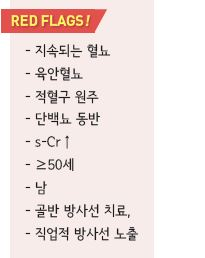
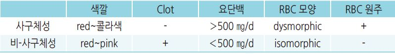
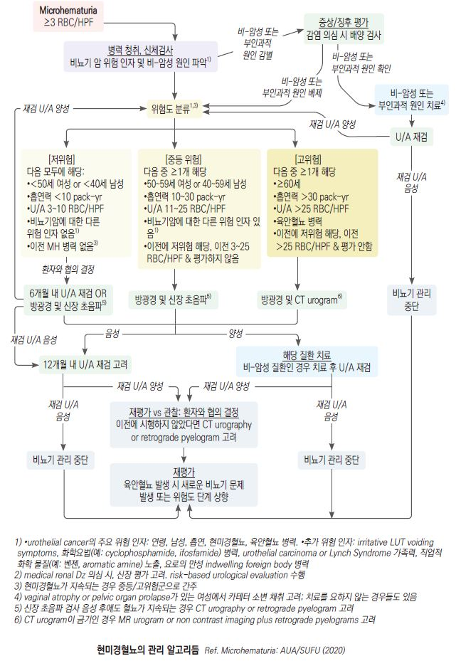

# 혈뇨 Hematuria


## 일반 사항

*   의미 있는 혈뇨 : 적절하게 채집하여 3번 시행한 시험지봉 검사에서 잠혈 양성 ≥2회 또는

    현미경 고배율 시야 검사(HPF)에서 한 번이라도 RBC ≥3(소아 ≥5)
*   microhematuria는 시험지봉 검사 결과만으로 진단하지 않음. 시험지봉 검사에서 혈뇨(+)인 경우에 현미경 검사로

    확인해야 함
* 혈뇨는 원인이 입증될 때까지 악성 가능성을 고려해야 하며 ≥50세의 혈뇨는 암에 대한 선별 검사를 요함

### 무증상 현미경혈뇨

* 명백한 원인 없는 ≥3 RBC/HPF
* 경과 : 대부분 양성; 최종적으로 간혹 신장 이상이나 드물게 요로 악성 종양이 발견됨
*   방광경 검사 대상 : ≥35세(＜35세에서는 검사 고려), 악성 종양 위험 인자가 있는 경우

    •악성 종양 위험 인자 : 자극성 배뇨 증상 병력, 흡연력, 화학 물질 노출
*   F/U : 다른 이상이 없으면서 무증상 현미경혈뇨만 지속되는 경우 매년 U/A 시행

    •악성 종양 고위험군에서는 소변 세포 검사를 포함한 경과 관찰을 주기적으로(3년마다) 시행하고 상태 변화 발생 시 재평가

## 원인

* glomerular hematuria : 사구체신염(IgA 신증, 유전성 신증), thin glomerular basement membrane Dz
*   non-glomerular hematuria

    •upper tract : 요로 결석, 신우신염, 신세포암, 이행세포암, 요로 폐쇄, 양성 혈뇨(발열)

    •lower tract : 세균성 방광염(UTI), BPH, 심한 운동(마라톤), 이행 세포암, 요로 조작, 양성 혈뇨(interstitial cystitis, trigonitis),

    가짜 혈뇨(월경), 성관계
*   heme-negative red urine

    •약물 : doxorubicin, chloroquine, deferoxamine, ibuprofen, iron sorbitol, nitrofurantoin, phenazopyridine, phenolphthalein,

    rifampin

    •식품 : 블랙베리, 식품 첨가제

    •대사 산물 : bile pigment, homogentisic acid, melanin, methemoglobin, porphyrin, urate, tyrosinosis
* 일시적 혈뇨 : 발열, 감염, 외상, 운동



## 진단

### 검사

#### 소변 시험지봉 검사

```
(☞ p.605)
```

* 민감도 91~~100%, 특이도 65~~99%
*   위양성 : 탈수, 심한 운동, hemoglobinuria, myoglobinuria, 월경, semen,

    산화제(소독액) 오염
* 위음성 : 산성뇨(pH＜5.1), 단백뇨, 비중 증가, captopril 복용, Vit C 복용

#### 소변 현미경 검사

* 신선하지 않은 검체에서는 dysmorphic RBC가 관찰될 수 있음
*   시험지봉 검사(+) & 현미경 검사(-) 시 현미경 검사 3회 반복

    → 현미경 검사에서 1번이라도 (+) 시 양성으로 판정

    

#### 기타

* s-BUN/Cr, eGFR : 원인 감별 및 조영제 사용 검사 가능 여부를 판단하기 위하여 시행
* CBC, 전해질
* 소변 배양 검사 : 감염 의심 시 고려
* 방광경, CT : 특히 육안혈뇨에서 시행

### 추적 검사

* 월경, 가벼운 외상, 운동, 약물 사용 시 중단 48시간 후 재검
* 축구 등 격렬한 운동 또는 외상 후 발생한 경우에는 중단 4\~6주 후 시행
* 요로 감염이 원인이었던 경우에는 2\~6주 후 재검
* 요로 결석이 원인이었던 경우에는 배출 후 재검

### 감별

* 작열감, 절박뇨, 빈뇨 → UTI - 관절통, 관절염, 발진 → lupus, 혈관염, HS purpura
* 진한 콜라색 소변 → 사구체성 - 옆구리 통증 → 결석, 경색, 신우신염
* 피덩이 → extra-glomerular - 체중 감소 → 종양
* 최근 여행 → schistosomiasis
* 최근 상기도 감염 증상 발생 또는 동반 → PSGN, IgA nephropathy, 결핵
* 혈뇨 가족력 → hereditary nephritis, sickle cell, polycystic, IgA nephropathy



> **질병코드** R31 상세불명의 혈뇨
