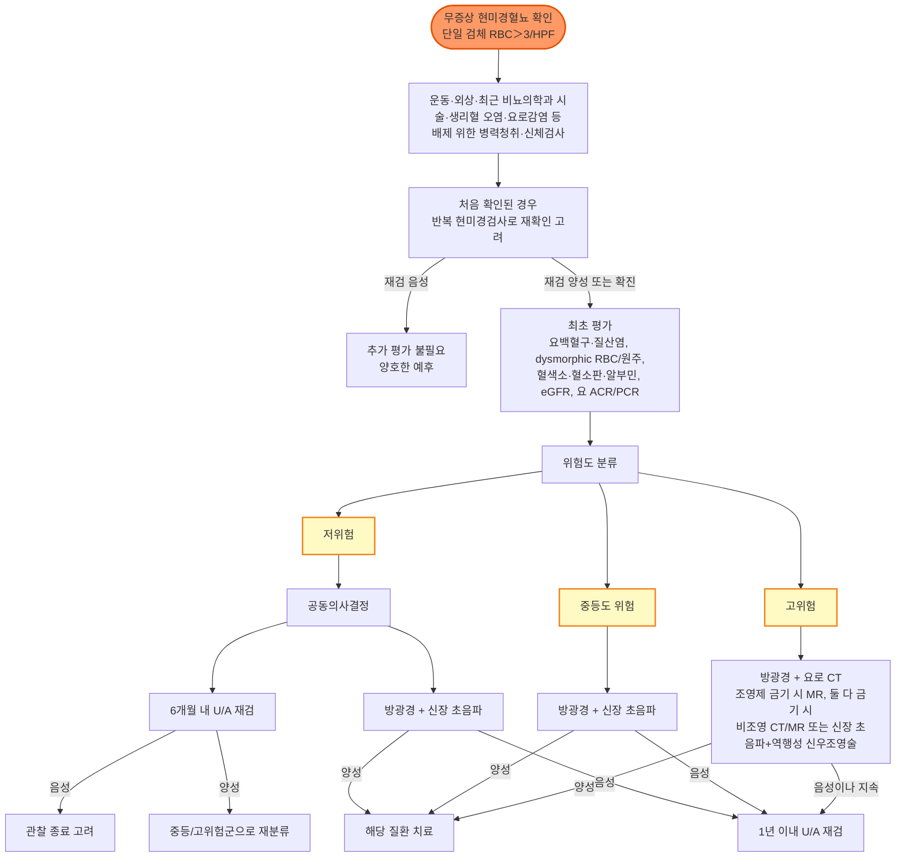

# 혈뇨 Hematuria

## <mark style="color:green;">일반 사항</mark>

* 소변에 적혈구가 비정상적으로 섞여 나오는 상태 — 육안적 혈뇨(gross hematuria)와 무증상 현미경적 혈뇨(asymptomatic microhematuria, MH)로 구분
* MH의 정의 (AUA/SUFU, 2020/2025) : 중간뇨(mid-stream clean-catch)로 적절히 채집한 **단일** 요검체의 현미경 검사에서, 다른 명백한 원인 없이 RBC ＞3/HPF \[Strong Recommendation; Grade C]
  * 시험지봉(딥스틱) 검사 단독으로는 MH를 진단하지 않음; trace 이상의 시험지봉 양성 소견이 있으면 반드시 현미경 검사로 확인 \[Strong Recommendation; Grade C]
  * ✽과거 국내에서 흔히 쓰이던 "3회 검사 중 시험지봉 양성 ≥2회" 기준은 현행 정의와 다름 — 원칙적으로 단일 요검체의 현미경 검사(RBC＞3/HPF)로 MH가 성립됨
  * 다만 대한신장학회 2023 현미경혈뇨 진료지침은 처음 확인된 무증상 현미경혈뇨는 반복 현미경 검사로 재확인할 것을 권고(조건부 권고, 근거 수준 매우 낮음) — 첫 검사에서 혈뇨가 확인된 환자 중 30\~62%가 재검에서 음전되며, 이 경우 예후가 양호함
  * 소아는 별도 기준 적용(관행적으로 RBC ≥5/HPF); 이 챕터의 위험도 분류는 성인 기준
* 혈뇨는 원인이 입증될 때까지 비뇨기암 가능성을 염두에 두어야 하며, **육안혈뇨는 연령과 무관하게 적극적 평가가 필요**하고, 현미경혈뇨는 아래 위험도 분류에 따라 접근
* 항혈소판제·항응고제 복용 중인 환자에서 혈뇨가 발견되어도 복용하지 않는 환자와 동일하게 평가 — 약물이 혈뇨의 원인이 아니라 암 등 기저 질환을 드러내는 계기일 수 있음

## <mark style="color:green;">원인</mark>

#### <mark style="color:$primary;">사구체성 혈뇨 (Glomerular hematuria)</mark>

* 사구체신염 : IgA 신증, 감염후 사구체신염(PSGN), lupus nephritis, ANCA 연관 혈관염, 항사구체기저막병
* 유전성 신증 : Alport 증후군, thin basement membrane disease

#### <mark style="color:$primary;">비사구체성 혈뇨 (Non-glomerular hematuria)</mark>

* 상부요로 : 요로 결석(☞ [요로결석](133_-urolithiasis.md)), 신우신염(☞ [급성 신우신염](119_-acute-pyelonephritis-uncomplicated.md)), 신세포암, 신우\~요관 이행세포암, 요로 폐쇄, 다낭신, 신경색
* 하부요로 : 세균성 방광염(UTI)(☞ [급성 방광염](118_-acute-cystitis.md)), 방광암(이행세포암), 전립선비대증(BPH), 급성 전립선염, 요도염(☞ [요도염](115_-urethritis.md)), 심한 운동(마라톤 등), 요로 조작(카테터 삽입·최근 시술), 출혈성 방광염(cyclophosphamide·골반 방사선 치료·BK 바이러스 등), 응고장애 또는 항응고제·항혈소판제 복용
* 양성 혈뇨 : 발열성 혈뇨, interstitial cystitis, trigonitis
* 가짜 혈뇨(pseudohematuria) : 월경, 성관계 직후, 질 출혈(vaginal bleeding) 오염, 치핵 출혈(hemorrhoidal bleeding) 오염 — 외래에서 흔한 오염원이므로 병력상 반드시 확인

#### <mark style="color:$primary;">Heme-negative red urine (적색뇨이나 혈뇨 아님)</mark>

* 대사 산물 : porphyria(포르피린증), bile pigment, homogentisic acid, melanin, urate — methemoglobinuria는 상대적으로 드묾
* 식품 : 비트(beeturia), 블랙베리, 식용 색소
* 약물 : rifampin, phenazopyridine, doxorubicin, chloroquine, deferoxamine, ibuprofen, iron sorbitol, nitrofurantoin, phenolphthalein

#### <mark style="color:$primary;">일시적 혈뇨</mark>

* 발열, 감염, 외상, 심한 운동 — 유발 요인 소실 후 재검으로 확인

## <mark style="color:green;">임상 양상</mark>

* 육안혈뇨의 배뇨 시점은 병소 국소화에 도움
  * 초기 혈뇨(initial hematuria) : 배뇨 시작 시에만 두드러짐 → 요도 병변 시사
  * 종말 혈뇨(terminal hematuria) : 배뇨 말기에 두드러짐 → 방광경부·삼각부·전립선 병변 시사
  * 전 배뇨 혈뇨(total hematuria) : 배뇨 전 과정에 걸쳐 균일 → 방광 또는 상부요로 병변 시사
* 응괴(clot)의 모양도 단서 : 지렁이 모양의 긴 응괴는 요관·상부요로 기원을, 무정형의 큰 응괴는 방광 기원을 시사

### <mark style="color:$danger;">🚩 Red Flags!</mark>

<mark style="color:$danger;">**즉각 조치 또는 의뢰**</mark>

* 응괴에 의한 급성 요폐(clot retention) 또는 심한 출혈로 인한 혈역학적 불안정(빈맥·저혈압)
* 급격한 s-Cr 상승 또는 핍뇨\~무뇨를 동반하는 혈뇨 → 급성 신손상 의심(단, 혈뇨 단독 소견만으로는 급성 신손상을 진단하지 않으며 s-Cr·요량 등 신기능 지표를 함께 확인)
* 발열·심한 옆구리 통증을 동반하는 폐쇄성 요로 결석 → 폐쇄성 요로패혈증 의심, 즉시 비뇨기과 의뢰

<mark style="color:$warning;">**당일 또는 조기 의뢰**</mark>

* 새로 발생한 무통성 육안혈뇨 → 연령과 무관하게 비뇨기암 배제를 위한 비뇨기과 의뢰
* 적혈구 원주 또는 dysmorphic RBC(특히 acanthocyte ≥5%), 유의한 알부민뇨(ACR ≥300 ㎎/g 또는 단백뇨 ≥0.3 g/day 상당), 새로 동반된 고혈압을 동반하는 혈뇨 → 사구체신염 의심, 신장내과 의뢰
* 급성은 아니나 s-Cr 상승을 동반하는 경우 → 신장 평가 필요

<mark style="color:$info;">**외래 추적 / 추가 평가 계획**</mark> <mark style="color:$info;">- 즉각 위험 낮으나 호전 없으면 의뢰</mark>

* 원인 미상의 무증상 현미경혈뇨가 지속되는 경우 → 위험도 분류에 따른 비뇨기과적 평가
* 골반 방사선 치료 병력 또는 직업적 화학물질(벤젠, aromatic amine) 노출력 → 정기적 추적
* 비뇨기암 위험 인자가 있는 성인에서 새로 발생한 무증상 현미경혈뇨 → 위험도 분류에 따른 선별 평가 계획

## <mark style="color:green;">진단</mark>

### <mark style="color:orange;">검사</mark>


**시험지봉·현미경·소변색으로 보는 3단계 감별**

1. 시험지봉(+) / 현미경 RBC(+) : 진성 혈뇨(true hematuria)
2. 시험지봉(+) / 현미경 RBC(-) : heme 양성 비적혈구뇨(hemoglobinuria, myoglobinuria)
3. 시험지봉(-) / 적색뇨 : heme 음성 적색뇨(비트, rifampin, phenazopyridine, porphyria 등)


#### <mark style="color:$primary;">소변 시험지봉 검사</mark>

* 민감도 91\~100%, 특이도 65\~99% (☞ [신장질환의진단](109_.md#undefined-2))
* 위양성 : 탈수, 심한 운동, hemoglobinuria, myoglobinuria, 월경, semen, 산화제(소독액) 오염
* 위음성 : 산성뇨(pH＜5.1), 단백뇨, 비중 증가, captopril 복용, Vit C 복용
* trace 이상 양성이면 반드시 현미경 검사로 확인 — 시험지봉 단독으로 MH 진단 금지

#### <mark style="color:$primary;">소변 현미경 검사</mark>

* 신선하지 않은 검체에서는 dysmorphic RBC가 관찰될 수 있어 위양성 해석에 주의(반드시 신선한 검체로 판정)
* 시험지봉 검사(+) & 현미경 검사(-)인 경우, 진단이 애매하면 임상 판단에 따라 새 검체로 재검할 수 있음 — 처음 확인된 무증상 현미경혈뇨는 반복 현미경 검사로 재확인을 고려(대한신장학회 2023; 조건부 권고)
* 전체 적혈구 중 dysmorphic RBC ＞50\~80%이거나 acanthocyte(고리 모양 세포막 돌출을 가진 적혈구) ≥5%이면 사구체성 혈뇨를 강하게 시사

<table><thead><tr><th width="100">구분</th><th width="150">색깔</th><th width="60">Clot</th><th width="120">단백뇨</th><th width="110">RBC 모양</th><th>RBC 원주</th></tr></thead><tbody><tr><td>사구체성</td><td>선홍색\~갈색(cola-colored)</td><td>-</td><td>있음(대개 ACR ≥300 ㎎/g)</td><td>dysmorphic</td><td>+</td></tr><tr><td>비사구체성</td><td>선홍색(red)\~분홍색(pink)</td><td>+</td><td>경미하거나 없음</td><td>isomorphic</td><td>-</td></tr></tbody></table>

*✽전통적으로 24시간 요단백 ≥500 ㎎/day를 사구체성 혈뇨의 기준으로 인용해 왔으나, 외래에서는 24시간 소변 채집이 드물게 시행되므로 spot 요 알부민/크레아티닌 비(ACR) 또는 단백/크레아티닌 비(PCR)가 실제 활용도가 높음*

#### <mark style="color:$primary;">기타 검사</mark>

* 초기 검사(대한신장학회 2023; 전문가 합의 권고) : 혈압 측정을 포함한 신체검사, 요백혈구·질산염(감염 배제), dysmorphic RBC, 적혈구·백혈구 원주, 혈색소·혈소판, 혈청 알부민, s-Cr을 통한 eGFR, 요 ACR 또는 PCR
* s-BUN/Cr, eGFR : 원인 감별 및 조영제 사용 검사 가능 여부 판단을 위해 시행
* 원인이 불분명한 가임기 여성에서는 요 beta-hCG 검사 고려(임신 관련 출혈 감별 및 이후 영상검사 선택에 영향)
* 소변 배양 검사 : 감염 증상이 있거나 농뇨(pyuria)가 동반될 때 시행
* 방광경, CT urography : 특히 육안혈뇨 또는 고위험군에서 시행

#### <mark style="color:$primary;">육안혈뇨의 평가 순서</mark>

* ①시험지봉·현미경 검사로 확인(위양성 배제) → ②소변 현미경에서 RBC 형태(dysmorphic vs isomorphic)·원주 동반 여부로 사구체성/비사구체성 감별(위 표 참고) → ③사구체성 소견이면 신장내과 의뢰, 비사구체성이거나 감별이 불명확하면 방광경 + CT urography(고위험군과 동일한 영상 기준 적용)를 통한 비뇨기과 의뢰
* 육안혈뇨는 위 순서와 무관하게 연령·위험인자에 상관없이 반드시 평가 대상이며, 무증상 현미경혈뇨의 위험도 분류표(저\~고위험)를 적용하지 않음

### <mark style="color:orange;">무증상 현미경혈뇨의 위험도 분류 (대한신장학회 2023 진료지침)</mark>


**국내 진료지침과 미국 최신판의 차이**
대한신장학회·대한소아신장학회·대한비뇨의학회·대한비뇨생식영상의학회가 공동 제정한 2023년 현미경혈뇨 근거기반 진료지침(2023.12)은 2020년 AUA/SUFU 기준을 국내 상황에 맞게 수용개작한 것으로, 아래 표가 현재 국내에서 통용되는 기준입니다. 이후 미국에서는 2025년 AUA/SUFU 개정판(Amendment)이 발표되어 저위험군 명칭이 "저위험/무시할 수 있는 위험"으로 바뀌고 여성의 연령 기준이 ＜60세/≥60세로 상향되었으며(단, 여성은 연령만으로 고위험군에 분류하지 않음), 중등위험군에서 방광경 대신 요세포검사·요종양표지자로 의사결정을 보조하는 항목이 추가되었습니다. 국내 진료지침은 아직 이 2025년 개정 내용을 반영하지 않았으므로, 향후 개정판 발표 시 확인이 필요합니다.


<table><thead><tr><th width="150">위험군</th><th width="80">기준</th><th width="160">연령</th><th width="130">흡연력</th><th width="180">단일 현미경검사 소견</th><th>비뇨기암 추가 위험인자</th></tr></thead><tbody><tr><td>저위험 (다기관 코호트 기준 malignancy 0.4%)</td><td>모두 해당</td><td>여성 ＜50세 남성 ＜40세</td><td>비흡연 또는 ＜10갑년</td><td>3\~10 RBC/HPF (한 차례)</td><td>없음</td></tr><tr><td>중등도 위험 (malignancy 1.0%)</td><td>1개 이상 해당</td><td>여성 50\~59세 남성 40\~59세</td><td>10\~30갑년</td><td>11\~25 RBC/HPF (한 차례)</td><td>있음</td></tr><tr><td>고위험 (malignancy 6.3%)</td><td>1개 이상 해당</td><td>여성 또는 남성 ≥60세</td><td>＞30갑년</td><td>＞25 RBC/HPF (한 차례) 또는 육안혈뇨 병력</td><td>-</td></tr></tbody></table>

*✽악성종양 발생률은 연구 코호트에 따라 편차가 크며(예: Woldu 등의 다기관 코호트는 저위험 0.4%·중등도 1.0%·고위험 6.3%), 위 수치는 대표값 예시임*

*✽표의 "육안혈뇨 병력"은 과거에 육안혈뇨를 경험했던 병력을 위험인자로 반영한 것 — 현재 진행 중인 육안혈뇨는 이 위험도 분류를 적용하지 않고 아래 "육안혈뇨의 평가 순서"에 따라 즉시 평가*

* 비뇨기암 주요 위험 인자 : 연령, 남성, 흡연력, 현미경혈뇨의 정도, 육안혈뇨 병력
* 추가 위험 인자 : 하부요로 자극 증상, 골반 방사선 치료 과거력, cyclophosphamide/ifosfamide 항암제 치료력, 요로암 가족력 또는 Lynch 증후군, 벤젠·방향족 아민 직업적 노출력, 만성 유치 이물 병력
* 저위험군 : 공동의사결정을 거쳐 ①6개월 이내 소변검사 재검 또는 ②방광경+신장 초음파 중 선택 \[조건부 권고, 근거 수준 낮음]
* 중등도 위험군 : 방광경 + 신장 초음파 \[강한 권고]; 고위험군 : 방광경 + 요로 CT(CT urography) \[강한 권고]
  * 조영증강 CT 금기(만성콩팥병, 요오드 조영제 알레르기 등) → 요로조영 MR 시행
  * 조영증강 CT·MR 모두 금기 → 비조영 CT/MR 또는 신장 초음파 + 역행성 신우조영술(retrograde pyelography)
  * 임신 중인 환자 → 신장 초음파를 우선 시행하고, CT/MR은 출산 후로 연기
* 신세포암 가족력, 유전성 신장 종양 증후군이 있는 경우 위험군과 무관하게 상부요로 영상 검사 시행을 고려
* 소변세포검사(urine cytology)는 초기 선별검사로 일률 시행하지 않으며, 비뇨기암 위험 인자가 있거나 현미경혈뇨가 지속될 때 다른 진단 검사와 함께 선택적으로 고려 \[조건부 권고, 근거 수준 낮음]

### <mark style="color:orange;">감별</mark>

<table><thead><tr><th width="150">단서</th><th>시사하는 질환</th></tr></thead><tbody><tr><td>작열감, 절박뇨, 빈뇨</td><td>UTI(☞ [요로감염](113_-urinary-tract-infection.md))</td></tr><tr><td>관절통, 관절염, 발진</td><td>루푸스, 혈관염, HS purpura</td></tr><tr><td>진한 콜라색 소변, 원주 동반</td><td>사구체성 혈뇨</td></tr><tr><td>옆구리 통증(산통성)</td><td>요로 결석, 신경색, 신우신염</td></tr><tr><td>피덩이(clot)</td><td>비사구체성 혈뇨</td></tr><tr><td>체중 감소, 전신 증상</td><td>비뇨기암</td></tr><tr><td>최근 여행력(유행 지역)</td><td>schistosomiasis(국내에서는 드묾, 해외 유행지역 여행력 시 고려)</td></tr><tr><td>상기도 감염과 거의 동시(synpharyngitic)에 발생하는 혈뇨</td><td>IgA 신증</td></tr><tr><td>상기도 감염 후 1\~3주 지나 발생하는 혈뇨(잠복기)</td><td>PSGN</td></tr><tr><td>풍토 지역 방문 후 발열·객혈 동반</td><td>결핵(국내에서도 발생률이 높아 배제 필요)</td></tr><tr><td>혈뇨 가족력</td><td>Alport 증후군, 겸상적혈구병, 다낭신, IgA 신증</td></tr></tbody></table>

### <mark style="color:orange;">추적 검사</mark>

* 월경, 가벼운 외상, 약물 사용이 원인으로 의심되면 해당 요인 중단 48시간 후 재검
* 격렬한 운동(마라톤 등)이 원인으로 의심되면 운동 중단 48\~72시간 후 재검 — 대부분 이 기간 내 소실됨; 2주 이상 지속되면 사구체 질환 감별 필요
* 외상 후 발생한 경우 손상 정도에 따라 수 주(대개 4\~6주)에 걸쳐 재검
* 요로 감염이 원인이었던 경우 치료 2\~6주 후 재검(☞ [요로감염](113_-urinary-tract-infection.md))
* 요로 결석이 원인이었던 경우 결석 배출 후 재검(☞ [요로결석](133_-urolithiasis.md))
* 평가에서 특이 소견이 없었던 무증상 현미경혈뇨는 1년 이내 소변검사 재시행을 고려하고, 이때 혈압·단백뇨·eGFR을 함께 평가 — 2회 연속 음성이면 추적 종결을 고려하고, 지속·재발하면 재평가 필요성을 환자와 공유의사결정

***

```mermaid
graph TD
    A([무증상 현미경혈뇨 확인<br>단일 검체 RBC＞3/HPF]) --> B[운동·외상·최근 비뇨의학과 시술·생리혈 오염·요로감염 등<br>배제 위한 병력청취·신체검사]
    B --> C[처음 확인된 경우<br>반복 현미경검사로 재확인 고려]
    C -->|재검 음성| C1[추가 평가 불필요<br>양호한 예후]
    C -->|재검 양성 또는 확진| D0[최초 평가<br>요백혈구·질산염, dysmorphic RBC/원주,<br>혈색소·혈소판·알부민, eGFR, 요 ACR/PCR]
    D0 --> D[위험도 분류]

    D --> E[저위험]
    D --> F[중등도 위험]
    D --> G[고위험]

    E --> E1[공동의사결정]
    E1 --> E2[6개월 내 U/A 재검]
    E1 --> E3[방광경 + 신장 초음파]
    E2 -->|음성| E4[관찰 종료 고려]
    E2 -->|양성| G0[중등/고위험군으로 재분류]
    E3 -->|양성| H1[해당 질환 치료]
    E3 -->|음성| F2[1년 이내 U/A 재검]

    F --> F1[방광경 + 신장 초음파]
    F1 -->|양성| H1
    F1 -->|음성| F2

    G --> G1[방광경 + 요로 CT<br>조영제 금기 시 MR, 둘 다 금기 시<br>비조영 CT/MR 또는 신장 초음파+역행성 신우조영술]
    G1 -->|양성| H1
    G1 -->|음성이나 지속| F2

    style A fill:#f96,stroke:#e65100,stroke-width:2px
    style E fill:#fff9c4,stroke:#f57f17,stroke-width:2px
    style F fill:#fff9c4,stroke:#f57f17,stroke-width:2px
    style G fill:#fff9c4,stroke:#f57f17,stroke-width:2px
```

<strong>무증상 현미경혈뇨의 위험도 기반 평가 알고리듬</strong>

<em><mark style="color:$info;">Ref. 대한신장학회 진료지침위원회. 2023 현미경혈뇨 근거기반 진료지침. (2020 AUA/SUFU 지침 수용개작)</mark></em>

***

## <mark style="background-color:$warning;">Management</mark>


**혈뇨 자체는 진단명이 아니라 소견입니다**
원인 질환을 확인하고 그에 따라 치료하는 것이 원칙이며, 이 챕터는 원인 감별과 위험도 기반 평가·의뢰 기준을 제공합니다.


### <mark style="color:orange;">치료 방침</mark>

* 육안혈뇨, 응괴에 의한 요폐, 혈역학적 불안정 → 즉시 비뇨기과 의뢰(방광 세척·유치 도뇨 등 응급 처치 필요할 수 있음)
* 사구체성 혈뇨(적혈구 원주, dysmorphic RBC, 유의한 단백뇨 동반) → 신장내과 의뢰; 원인 질환별 치료(☞ [신장질환의진단](109_.md))
* 비사구체성 혈뇨 중 원인이 명확한 경우(UTI(☞ [요로감염](113_-urinary-tract-infection.md)), 요로 결석(☞ [요로결석](133_-urolithiasis.md)) 등) → 해당 질환 치료 후 F/U 요검사로 확인
* 무증상 현미경혈뇨는 위험도 분류에 따라 비뇨기과 평가 여부와 시기를 결정 — 환자와 공동 의사결정 원칙
* 항응고제·항혈소판제 복용 중인 환자도 혈뇨가 있으면 동일하게 평가; 약물 복용 자체가 평가를 대체하지 않으며, 약물 중단 여부는 임의로 결정하지 말고 반드시 처방의와 상의

### <mark style="color:orange;">의뢰 기준</mark>

* 비뇨기과 의뢰 : 중등\~고위험 무증상 현미경혈뇨, 모든 육안혈뇨, 요폐/응괴, 신세포암 가족력·유전성 신장종양 증후군·Lynch 증후군 의심
* 신장내과 의뢰 : 사구체성 소견(적혈구 원주, dysmorphic RBC, 단백뇨 동반), 고혈압 동반, s-Cr 상승, 급성 신손상 의심

***

### <mark style="color:red;">질병코드</mark>

R31 상세불명의 혈뇨

***

### <mark style="color:$success;">핵심 복약 지도</mark>

> **재검 요검사 타이밍 안내**
>
> * 월경, 가벼운 외상, 약물 복용이 원인으로 의심되면 해당 요인 중단 48시간 후 재검
> * 마라톤 등 격렬한 운동 직후라면 48\~72시간 후 재검(대부분 이 기간 내 소실)
> * 외상 직후라면 손상 정도에 따라 수 주(대개 4\~6주)에 걸쳐 재검
> * 요로 감염 치료 후에는 2\~6주 후 재검
> * 요로 결석은 결석 배출 후 재검

> **항응고제·항혈소판제 복용 환자**
>
> * 혈뇨가 있다고 해서 항응고제를 임의로 중단하지 않도록 안내 — 중단 여부는 처방의(순환기내과 등)와 상의 후 결정
> * 약물 복용은 혈뇨의 "원인"이 아니라 "출혈 경향을 드러내는 계기"일 수 있으므로 동일하게 원인 평가 진행

> **언제 다시 병원을 방문해야 하나요?**
>
> * 소변에 피가 섞이거나 붉게 보이는 육안혈뇨가 새로 발생한 경우
> * 옆구리·아랫배의 심한 통증, 발열이 동반되는 경우 — 즉시 내원
> * 소변을 보기 힘들거나(핍뇨\~무뇨) 덩어리(응괴)가 나오는 경우 — 즉시 내원
> * 정기 추적 요검사에서 혈뇨가 지속되거나 새로운 증상(체중 감소 등)이 생긴 경우

***

### <mark style="color:blue;">환자 안내서</mark>


**혈뇨, 소변에 피가 섞여 나오는 것을 말합니다**

눈에 보이지 않을 정도로 소량의 피가 섞인 경우(현미경적 혈뇨)와 눈으로 봐도 붉거나 콜라색으로 보이는 경우(육안적 혈뇨)가 있습니다. 혈뇨가 한 번만 있었다고 해서 모두 암은 아니며, 대부분은 방광염이나 요로 결석처럼 흔하고 치료 가능한 원인입니다. 그러나 통증이 없는 혈뇨는 반드시 원인을 확인해야 합니다.


#### <mark style="color:$primary;">왜 혈뇨가 생기나요?</mark>

* 방광염 등 요로 감염, 요로 결석, 전립선비대증처럼 비교적 흔하고 치료 가능한 원인이 대부분입니다
* 신장 자체의 염증(사구체신염)이나 드물게는 신장·방광의 종양이 원인일 수 있어, 원인이 확인될 때까지는 정밀 검사가 필요합니다
* 심한 운동, 월경, 최근의 성관계처럼 일시적이고 걱정할 필요 없는 원인도 있습니다

#### <mark style="color:$primary;">어떤 검사를 받게 되나요?</mark>

* 소변 검사(현미경 검사 포함)를 반복해서 혈뇨가 실제로 있는지, 지속되는지 확인합니다
* 나이, 흡연력, 혈뇨의 정도에 따라 초음파, 방광 내시경(방광경), CT 등의 추가 검사가 필요할 수 있습니다
* 검사에서 특별한 이상이 없더라도 일정 기간 후 소변 검사를 다시 받아야 할 수 있습니다

#### <mark style="color:$primary;">이럴 때는 즉시 병원을 방문하세요</mark>

* **소변이 선명한 붉은색이거나 덩어리(핏덩이)가 섞여 나올 때**
* **소변을 보기 어렵거나 전혀 나오지 않을 때**
* 옆구리나 아랫배의 심한 통증, 발열이 함께 있을 때
* 어지럼증, 가슴 두근거림 등 출혈에 의한 전신 증상이 있을 때
