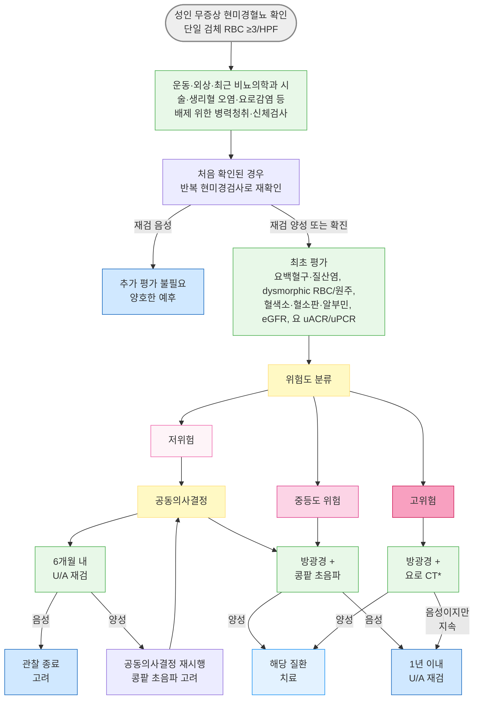

# 혈뇨 Hematuria

## <mark style="color:green;">일반 사항</mark>

* 소변에 적혈구가 비정상적으로 섞여 나오는 상태
  * 육안적 혈뇨(gross hematuria)와 무증상 현미경적 혈뇨(asymptomatic microhematuria, MH)로 구분
* **성인 MH의 정의** : 중간뇨(mid-stream clean-catch)로 적절히 채집한 단일 요검체의 현미경 검사에서, 다른 명백한 원인 없이 RBC ≥3/HPF
  * 시험지봉(딥스틱) 검사 단독으로는 MH를 진단하지 않음; trace 이상의 시험지봉 양성 소견이 있으면 반드시 현미경 검사로 확인
  * 단일 요검체에서 RBC ≥3/HPF이면 MH 정의에 해당하지만, 대한신장학회 2023 지침은 처음 확인된 무증상 MH를 반복 현미경 검사로 재확인할 수 있다고 권고함(조건부 권고, 근거 수준 매우 낮음) - 첫 검사에서 확인된 혈뇨의 30\~62%가 재검에서 음전되며 이 경우 예후가 양호함
* **소아청소년 현미경적 혈뇨의 정의** : 고배율 시야(×400)에서 RBC ≥5/HPF
  * 적어도 2주 간격으로 시행한 현미경 검사에서 3회 이상 연속 확인되면 지속 혈뇨로 보고 원인을 평가함
* 혈뇨의 원인은 연령·증상·사구체성 여부·요로암 위험도에 따라 평가함
  * 성인의 무통성 육안혈뇨는 요로 악성종양 가능성을 반드시 평가하고, 성인 무증상 MH는 [위험도](#무증상-현미경혈뇨의-위험도-분류-대한신장학회-2023)에 따라 접근
  * 소아청소년은 요로암 위험도 분류를 적용하지 않으며, 신장·방광 초음파를 우선하는 별도 평가 원칙을 적용
* 항혈소판제·항응고제 복용 중인 환자에서 혈뇨 발견 시 복용하지 않는 환자와 동일하게 평가 - 약물이 혈뇨의 원인이 아니라 암 등 기저 질환을 드러내는 계기일 수 있음

## <mark style="color:green;">원인</mark>

#### <mark style="color:$primary;">사구체성 혈뇨 (Glomerular hematuria)</mark>

* 사구체신염 : IgA 신증, 감염후 사구체신염(PSGN), lupus nephritis, ANCA 연관 혈관염, 항사구체기저막병
* 유전성 신증 : Alport 증후군, 얇은기저막병(thin basement membrane disease). 과거의 "양성 가족성 혈뇨" 중 일부는 COL4A3/COL4A4 관련 상염색체우성 Alport 증후군에 해당하며 추후 단백뇨·콩팥기능 저하가 나타날 수 있음

#### <mark style="color:$primary;">비사구체성 혈뇨 (Non-glomerular hematuria)</mark>

* 상부요로 : [요로결석](133_-urolithiasis.md), [신우신염](119_-acute-pyelonephritis-uncomplicated.md), 신세포암, 신우\~요관 이행세포암, 요로 폐쇄, 다낭신, 신경색
* 하부요로 : [세균성 방광염](118_-acute-cystitis.md)(UTI), 방광암(이행세포암), 전립선비대증(BPH), 급성 전립선염, [요도염](115_-urethritis.md), 심한 운동(마라톤 등), 요로 조작(카테터 삽입·최근 시술), 출혈성 방광염(cyclophosphamide·골반 방사선 치료·BK 바이러스 등), 응고장애 또는 항응고제·항혈소판제 복용
* 기타 비종양성 원인 : 발열과 동반된 일시적 혈뇨, interstitial cystitis/bladder pain syndrome, trigonitis
* 가짜 혈뇨(pseudohematuria) : 월경, 성관계 직후, 질 출혈(vaginal bleeding) 오염, 치핵 출혈(hemorrhoidal bleeding) 오염 - 외래에서 흔한 오염원이므로 병력상 반드시 확인

#### <mark style="color:$primary;">Heme-negative red urine</mark>

* 적색뇨이지만 소변 현미경에서 적혈구가 확인되지 않고 시험지봉 heme 반응도 음성인 경우

- 대사 산물·색소 : porphyria(포르피린증), bile pigment, homogentisic acid, melanin, urate
- 식품 : 비트(beeturia), 블랙베리, 식용 색소
- 약물 : rifampin, phenazopyridine, doxorubicin, chloroquine, deferoxamine, ibuprofen, iron sorbitol, nitrofurantoin, phenolphthalein

#### <mark style="color:$primary;">일시적 혈뇨</mark>

* 발열, 감염, 외상, 심한 운동 → 유발 요인 소실 후 재검으로 확인

## <mark style="color:green;">임상 양상</mark>

* 육안혈뇨의 배뇨 시점은 병소 국소화에 도움
  * 초기 혈뇨(initial hematuria) : 배뇨 시작 시에만 두드러짐 → 요도 병변 시사
  * 종말 혈뇨(terminal hematuria) : 배뇨 말기에 두드러짐 → 방광경부·삼각부·전립선 병변 시사
  * 전 배뇨 혈뇨(total hematuria) : 배뇨 전 과정에 걸쳐 균일 → 방광 또는 상부요로 병변 시사
* 응괴(clot)의 모양도 단서 : 지렁이 모양의 긴 응괴는 요관·상부요로 기원을, 무정형의 큰 응괴는 방광 기원을 시사

### <mark style="color:$danger;">🚩 Red Flags!</mark>

<mark style="color:$danger;">**즉각 조치 또는 의뢰**</mark>

* 응괴에 의한 급성 요폐(clot retention) 또는 심한 출혈로 인한 혈역학적 불안정(빈맥·저혈압)
* 급격한 s-Cr 상승 또는 핍뇨\~무뇨를 동반하는 혈뇨 → 급성콩팥손상
* 발열·심한 옆구리 통증을 동반하는 폐쇄성 요로 결석 → 폐쇄성 요로패혈증

<mark style="color:$warning;">**당일 또는 조기 의뢰**</mark>

* 성인에서 새로 발생한 무통성 육안혈뇨 → 단 한 번이라도 요로 악성종양 배제를 위한 신속한 비뇨기과 평가
* 소아청소년 육안혈뇨 → 사구체성·비사구체성 원인을 평가하고 신장·방광 초음파를 우선 시행; 반복되거나 검사 이상이 있으면 소아신장·소아비뇨의학과 의뢰
* 적혈구 원주, dysmorphic RBC(특히 acanthocyte 약 5% 이상), 단백뇨·알부민뇨 또는 새로 동반된 고혈압 → 사구체질환을 고려하여 신장내과 또는 소아신장 전문가 의뢰
* 급성은 아니지만 s-Cr 상승을 동반

<mark style="color:$info;">**외래 추적 / 추가 평가 계획**</mark> <mark style="color:$info;">- 즉각 위험 낮으나 호전 없으면 의뢰</mark>

* 원인 미상의 무증상 현미경혈뇨가 지속; 소아청소년은 적어도 2주 간격으로 3회 이상 지속되면 소아신장 전문가 의뢰
* 골반 방사선 치료 병력 또는 직업적 화학 물질(벤젠, aromatic amine) 노출력
* 비뇨기암 위험 인자가 있는 성인에서 새로 발생한 무증상 현미경혈뇨


**비뇨기암 주요 위험 인자** : 연령, 남성, 흡연력, 현미경혈뇨의 정도, 육안혈뇨 병력

**추가 위험 인자** : 하부요로 자극 증상, 골반 방사선 치료 과거력, cyclophosphamide/ifosfamide 항암제 치료력, 요로암 가족력 또는 Lynch 증후군, 벤젠·방향족 아민 직업적 노출력, 만성 유치 이물 병력


## <mark style="color:green;">진단</mark>

### <mark style="color:orange;">검사</mark>

**시험지봉·현미경·소변색으로 보는 3단계 감별**

1. 시험지봉(+) / 현미경 RBC(+) : 진성 혈뇨(true hematuria)
2. 시험지봉(+) / 현미경 RBC(-) : heme 양성 비적혈구뇨(hemoglobinuria, myoglobinuria)
3. 시험지봉(-) / 적색뇨 : heme 음성 적색뇨(비트, rifampin, phenazopyridine, porphyria)

#### <mark style="color:$primary;">소변 시험지봉 검사</mark>

* 민감도 91\~100%, 특이도 65\~99% (☞ [콩팥질환의진단](109_.md#undefined-2))
* 위양성 : 탈수, 심한 운동, hemoglobinuria, myoglobinuria, 월경, semen, 산화제(소독액) 오염
* 위음성 : 산성뇨(pH＜5.1), 단백뇨, 비중 증가, captopril 복용, Vit C 복용
* trace 이상 양성이면 반드시 현미경 검사로 확인; 시험지봉 단독으로 MH 진단 금지

#### <mark style="color:$primary;">소변 현미경 검사</mark>

* 신선하지 않은 검체에서는 dysmorphic RBC가 관찰될 수 있으므로 위양성에 주의(반드시 신선한 검체로 판정)
* 시험지봉 검사(+) & 현미경 검사(-)인 경우, 진단이 애매하면 임상 판단에 따라 새 검체로 재검할 수 있음 - 처음 확인된 MH는 반복 현미경 검사로 재확인을 고려
* 전체 적혈구 중 dysmorphic RBC가 ＞50\~80%이거나 acanthocyte(고리 모양 세포막 돌출을 가진 적혈구)가 ≥5%이면 사구체성 혈뇨를 강하게 시사
* 응괴(clot)는 사구체 출혈보다는 요로 출혈 가능성이 높음

<table><thead><tr><th width="100">구분</th><th width="134.7618408203125">색깔</th><th width="69.5238037109375">Clot</th><th width="133.333251953125">단백뇨</th><th width="125.238037109375">RBC 모양</th><th width="92.7464599609375">RBC 원주</th></tr></thead><tbody><tr><td>사구체성</td><td>적갈색·차색·콜라색이 흔함</td><td>대개 없음</td><td>동반될 수 있으며, 동반 시 사구체질환 가능성이 증가함; 단독 혈뇨도 가능</td><td><strong>dysmorphic</strong></td><td><strong>관찰될 수 있음</strong></td></tr><tr><td>비사구체성</td><td>선홍색(red)~분홍색(pink)</td><td><strong>동반 가능</strong></td><td>대개 없거나 경미함</td><td>isomorphic</td><td>없음</td></tr></tbody></table>

_✽사구체성 혈뇨를 판단하는 단일 단백뇨 문턱은 없음. 혈뇨에 단백뇨·알부민뇨가 동반되면 사구체질환 가능성이 높아지므로, 외래에서는 임의뇨 uACR 또는 uPCR로 정량함._

#### <mark style="color:$primary;">기타 검사</mark>

* 초기 검사 : 신체검사(혈압 포함), 요백혈구·질산염(감염 배제), dysmorphic RBC, 적혈구·백혈구 원주, 혈색소·혈소판, 혈청 알부민, s-Cr을 통한 eGFR, 소변 uACR 또는 uPCR
* s-BUN/Cr, eGFR : 원인 감별 및 조영제 사용 검사 가능 여부 판단을 위해 시행
* 원인이 불분명한 가임기 여성에서는 소변 β-hCG 검사 고려
* 소변 배양 검사 : 감염 증상이 있거나 농뇨(pyuria)가 동반될 때 시행
* 방광경, CT urography : 성인 육안혈뇨 또는 고위험 MH에서 고려; 소아청소년은 신장·방광 초음파를 우선하고 일률적으로 시행하지 않음

#### <mark style="color:$primary;">육안혈뇨의 평가 순서</mark>

1. 활력징후, 혈역학적 안정성, 소변 배출 여부와 응괴 동반 여부를 먼저 평가
2. 시험지봉·현미경 검사로 혈뇨를 확인하고 색소뇨·오염을 배제
3. RBC 형태·원주·단백뇨·콩팥기능으로 사구체성/비사구체성 원인을 감별
4. 성인, 특히 무통성 육안혈뇨는 요로 악성종양을 배제하도록 비뇨기과 평가; 사구체성 소견이 있으면 신장내과 평가를 병행
5. 소아청소년은 신장·방광 초음파를 우선하고, 반복 혈뇨·단백뇨·고혈압·콩팥기능 저하·구조 이상 등에 따라 소아신장 또는 소아비뇨의학과에 의뢰

### <mark style="color:orange;">무증상 현미경혈뇨의 위험도 분류 \[대한신장학회 2023]</mark>

<table><thead><tr><th width="177.61907958984375">위험군¹⁾</th><th width="88.5714111328125">기준</th><th width="124.7618408203125">연령</th><th width="103.3333740234375">흡연력</th><th width="140.952392578125">단일 현미경검사 소견</th><th width="100.36529541015625">비뇨기암 추가 위험인자</th></tr></thead><tbody><tr><td>저위험  (malignancy 0.4%)</td><td>모두 해당</td><td>여성 ＜50세 남성 ＜40세</td><td>비흡연 또는 ＜10갑년</td><td>3~10 RBC/HPF (한 차례)</td><td>없음</td></tr><tr><td>중등도 위험 (malignancy 1.0%)</td><td>1개 이상 해당</td><td>여성 50~59세 남성 40~59세</td><td>10~30갑년</td><td>11~25 RBC/HPF (한 차례)</td><td>있음</td></tr><tr><td>고위험 (malignancy 6.3%)</td><td>1개 이상 해당</td><td>여성 또는 남성 ≥60세</td><td>＞30갑년</td><td>＞25 RBC/HPF (한 차례) 또는 육안혈뇨 병력²⁾</td><td>-</td></tr></tbody></table>

¹⁾ _악성종양 발생률은 연구 코호트에 따라 편차가 크며(예: Woldu 등의 다기관 코호트는 저위험 0.4%·중등도 1.0%·고위험 6.3%), 위 수치는 대표값 예시임_\
²⁾ _육안혈뇨 병력은 과거에 육안혈뇨를 경험했던 병력을 위험 인자로 반영한 것 - 현재 진행 중인 육안혈뇨는 이 위험도 분류를 적용하지 않고 위의 "육안혈뇨의 평가 순서"에 따라 즉시 평가_


**국내 지침과 미국 지침 차이** : 대한신장학회·대한소아신장학회·대한비뇨의학회·대한비뇨생식영상의학회가 공동 제정한 2023년 현미경혈뇨 근거기반 진료지침은 2020년 AUA/SUFU 지침을 수용개작하여 국내 실정에 맞게 개발되었음. 이 챕터의 성인 주 알고리듬은 국내 2023 지침을 따름. \
미국 AUA/SUFU 2025 개정판은 저위험군을 "저위험/무시할 수 있는 위험"으로 변경하고, 이 군에서는 즉시 방광경·영상검사보다 6개월 이내 재검을 권고함. 재검에서도 MH가 지속되면 정도와 위험인자에 따라 중등도 또는 고위험군으로 재분류함. 여성의 저위험 연령 기준은 60세 미만으로 상향되었고, 여성은 60세 이상이라는 이유만으로 고위험군이 되지 않음. 중등위험군이 방광경을 원하지 않으면 상담 후 요세포검사 또는 검증된 요종양표지자를 이용하여 방광경 시행 여부를 결정할 수 있으나 콩팥·방광 초음파는 시행함.


### <mark style="color:orange;">감별</mark>

<table data-search="false"><thead><tr><th width="355.71429443359375">단서</th><th>시사하는 질환</th></tr></thead><tbody><tr><td>작열감, 절박뇨, 빈뇨</td><td>UTI</td></tr><tr><td>관절통, 관절염, 발진</td><td>루푸스, 혈관염, HS purpura</td></tr><tr><td>진한 콜라색 소변, 원주 동반</td><td>사구체성 혈뇨</td></tr><tr><td>옆구리 통증(산통성)</td><td>요로 결석, 신경색, 신우신염</td></tr><tr><td>피덩이(clot)</td><td>비사구체성 혈뇨</td></tr><tr><td>체중 감소, 전신 증상</td><td>비뇨기암</td></tr><tr><td>최근 여행력(유행 지역)</td><td>schistosomiasis(국내에서는 드묾, 해외 유행지역 여행력 시 고려)</td></tr><tr><td>상기도 감염과 거의 동시(synpharyngitic)에 발생하는 혈뇨</td><td>IgA 신증</td></tr><tr><td>상기도 감염 후 1~3주 지나 발생하는 혈뇨(잠복기)</td><td>PSGN</td></tr><tr><td>풍토 지역 방문 후 발열·객혈 동반</td><td>결핵(국내에서도 발생률이 높아 배제 필요)</td></tr><tr><td>혈뇨 가족력</td><td>Alport 증후군, 겸상적혈구병, 다낭신, IgA 신증</td></tr></tbody></table>

### <mark style="color:orange;">추적 검사</mark>

* 월경·질 출혈에 의한 오염이 의심되면 출혈이 끝난 뒤 적절히 채취한 검체로 재검
* 격렬한 운동(마라톤 등)이 원인으로 의심되면 운동 중단 48\~72시간 후 재검 - 대부분 이 기간 내 소실됨; 2주 이상 지속되면 사구체 질환 감별 필요
* 외상 후 혈뇨는 재검 시기를 정하기 전에 손상 기전·혈역학적 상태·옆구리 통증과 복부 진찰에 따라 응급 영상검사 및 비뇨기과 평가 필요성을 먼저 판단
* 요로 감염이 원인이었던 경우 적절히 치료한 뒤 소변검사로 혈뇨 소실을 확인 (☞ [요로감염](113_-urinary-tract-infection.md))
* 요로 결석이 원인이었던 경우 결석 배출 후 재검 (☞ [요로결석](133_-urolithiasis.md))
* 약물 관련 가능성을 검토하되 처방약을 임의로 중단하지 않음. 항응고제·항혈소판제 복용 환자도 동일하게 원인을 평가하고 중단·조정은 처방의와 결정
* 평가에서 특이 소견이 없었던 성인 무증상 MH는 1년 이내 소변검사 재시행을 고려하고 혈압·단백뇨·eGFR을 함께 평가 - 후속 검사에서 혈뇨가 소실되면 공동의사결정으로 추적 종결을 고려하고, 지속·재발하면 재평가 필요성을 결정

***

```mermaid
graph TD
    A([성인 무증상 현미경혈뇨 확인<br>단일 검체 RBC ≥3/HPF]) --> B[운동·외상·최근 비뇨의학과 시술·생리혈 오염·요로감염 등<br>배제 위한 병력청취·신체검사]
    B --> C[처음 확인된 경우<br>반복 현미경검사로 재확인]
    C -->|재검 음성| C1[추가 평가 불필요<br>양호한 예후]
    C -->|재검 양성 또는 확진| D0[최초 평가<br>요백혈구·질산염, dysmorphic RBC/원주,<br>혈색소·혈소판·알부민, eGFR, 요 uACR/uPCR]
    D0 --> D[위험도 분류]
    D --> E[저위험]
    D --> F[중등도 위험]
    D --> G[고위험]

    E --> E1[공동의사결정]
    E1 --> E2[6개월 내 <br>U/A 재검]
    E1 --> CYS[방광경 + <br>콩팥 초음파]
    E2 -->|음성| E4[관찰 종료 <br>고려]
    E2 -->|양성| E3[공동의사결정 재시행<br>콩팥 초음파 고려]
    E3 --> E1
    F --> CYS
    CYS -->|양성| H1[해당 질환 <br>치료]
    CYS -->|음성| F2[1년 이내 <br>U/A 재검]

    G --> G1[방광경 + <br>요로 CT*]
    G1 -->|양성| H1
    G1 -->|음성이지만 <br>지속| F2

style A fill:#eeeeee,stroke:#888888,stroke-width:2px
classDef lightGreen fill:#e8f8e8,stroke:#4caf50
class B,D0,E2,E4,CYS,G1 lightGreen
classDef blue fill:#d0e8ff,stroke:#1a6abf
class C1,E4,F2 blue
classDef sky fill:#e3f2ff,stroke:#2196f3
class H1 sky
classDef yellow fill:#fff9c4,stroke:#ffe082
class E1,D yellow
style E fill:#fef4f8,stroke:#f06baf
style F fill:#fcd4e6,stroke:#e0448e
style G fill:#f8a0c0,stroke:#d01f5a
```

_\*CT 조영제 금기 시 MR; CT·MR 조영제 모두 금기 시 비조영 CT/MR 또는 콩팥 초음파+역행성 신우조영술_

<strong>무증상 현미경혈뇨의 위험도 기반 평가 알고리듬</strong>

<em><mark style="color:$info;">Ref. 대한신장학회 진료지침위원회. 2023 현미경혈뇨 근거기반 진료지침.</mark></em>

***

### <mark style="color:orange;">소아청소년 혈뇨</mark>

#### <mark style="color:$primary;">정의와 지속성</mark>

* 소아청소년의 현미경적 혈뇨는 고배율 시야(×400)에서 **RBC ≥5/HPF**로 정의함
* 요시험지봉 잠혈 1+ 이상이면 현미경 검사로 적혈구를 확인함. 학교 요검사에서 한 번 잠혈 양성인 것만으로 지속 혈뇨를 진단하지 않음
* 적어도 2주 간격으로 시행한 현미경 검사에서 **3회 이상 연속** 혈뇨가 확인되면 지속 혈뇨로 보고 원인을 평가함
* 단백뇨가 동반되지 않은 경우 단독 현미경적 혈뇨(isolated microscopic hematuria)로 분류함

#### <mark style="color:$primary;">초기 평가</mark>

* 병력 : 발열·감염·격렬한 운동·외상·월경, 배뇨통·빈뇨·옆구리 통증, 부종·발진·자반·관절통·복통/혈변, 소변량 감소, 약물·칼슘·비타민 D 복용
* 가족력 : 혈뇨, 만성콩팥병·말기콩팥병, 사구체신염, 난청·시력 이상, 신결석증, 다낭콩팥병, 응고장애. 필요하면 부모 소변검사를 고려
* 신체검사 : 혈압, 키·체중과 성장곡선, 부종, 피부·관절, 복부 종괴·압통 및 늑골척추각 압통
* 소변 : 현미경 검사(RBC 형태·원주·결정), 기상 직후 첫 소변 uPCR 또는 uACR, 소변 calcium/creatinine ratio, 감염 의심 시 소변배양
* 혈액 : BUN, creatinine와 소아 eGFR; 임상 소견에 따라 CBC, albumin, C3/C4, ANA·anti-dsDNA·ANCA 등 추가

<table><thead><tr><th>소아청소년 임의뇨 정량검사</th><th>이상 기준</th></tr></thead><tbody><tr><td><strong>첫 아침 소변 uPCR</strong></td><td>2세 이상 ≥0.2 mg/mg; 2세 미만 ≥0.5 mg/mg</td></tr><tr><td><strong>첫 아침 소변 uACR</strong></td><td>≥30 μg/mg Cr(=30 mg/g Cr)</td></tr><tr><td><strong>소변 calcium/creatinine ratio</strong></td><td>2세 이상 ≥0.2; 1~2세 ≥0.4; 6~12개월 ≥0.6; 6개월 미만 ≥0.8 mg/mg</td></tr></tbody></table>


소아청소년은 기립성 단백뇨가 흔하므로 단백뇨·알부민뇨는 **기상 직후 첫 소변**으로 평가한다. 혈뇨에 단백뇨·알부민뇨가 동반되면 치료가 필요한 사구체질환 가능성이 높아진다.


#### <mark style="color:$primary;">영상검사</mark>

* **무증상 육안혈뇨** : 신장·방광 초음파를 권고함(강한 권고, 근거 수준 낮음)
* **원인이 밝혀지지 않은 지속 무증상 현미경적 혈뇨** : 신장·방광 초음파를 고려할 수 있음(조건부 권고, 근거 수준 낮음)
* 초음파는 양쪽 신장과 방광을 모두 평가함. 결석, 선천 신·요로기형, 낭성콩팥병, 종양, 수신증 및 필요 시 도플러로 호두까기증후군 등을 확인
* 방사선 노출을 고려하여 CT를 일차검사로 사용하지 않음. 초음파로 진단되지 않는 결석, 반복 육안혈뇨 또는 종양·구조 이상이 의심되는 선택된 환자에서 전문가 판단으로 CT/MR을 고려

#### <mark style="color:$primary;">신장조직검사·방광경 및 치료</mark>

* 다른 병력·가족력·증상·징후가 없는 **지속 무증상 단독 현미경적 혈뇨에는 신장조직검사를 권고하지 않음**
* 지속 혈뇨에 단백뇨·알부민뇨, 고혈압, 콩팥기능 저하 또는 전신질환에 의한 이차성 신질환 등 만성 사구체질환을 시사하는 소견이 동반되면 소아신장 전문가가 신장조직검사 또는 유전자검사를 고려
* 소아청소년 무증상 현미경적 혈뇨에는 방광경을 권고하지 않음. 반복 육안혈뇨 또는 영상검사 이상이 있을 때 소아비뇨의학과 판단으로 선택
* 원인이 밝혀지지 않은 무증상 단독 혈뇨에 ACE inhibitor·ARB 또는 steroid를 투여하지 않음. 원인 질환과 단백뇨·고혈압이 확인된 경우 해당 질환 지침에 따라 치료

#### <mark style="color:$primary;">전문의 의뢰와 추적</mark>

* 다음 중 하나이면 소아신장 전문가에게 조기 의뢰
  * 단백뇨·알부민뇨, 고혈압, 성장부진, eGFR <90 mL/min/1.73 m² 또는 지속적인 콩팥기능 감소
  * 적혈구 원주·dysmorphic RBC 등 사구체성 소견, 혈청 C3 감소 또는 전신질환 소견
  * 만성콩팥병·사구체신염·말기콩팥병·난청의 가족력
  * 원인 미상의 혈뇨가 적어도 2주 간격으로 3회 이상 지속
* 결석, 수신증, 선천 신·요로기형, 낭성콩팥병, 종양 등 구조적 이상은 소아신장·소아비뇨의학과에 의뢰
* 원인이 밝혀지지 않은 무증상 단독 혈뇨가 지속되면 **매년 키·체중, 혈압, 소변 현미경 검사와 첫 아침 소변 단백 정량검사**를 시행함

<em><mark style="color:$info;">Ref. 대한소아신장학회. 소아청소년 혈뇨의 근거 기반 진료권고안. 2023.</mark></em>

***

## <mark style="background-color:$warning;">Management</mark>

* 혈뇨 자체는 진단명이 아니라 소견이므로 원인 질환을 확인하고 그에 따라 치료하는 것이 원칙임

### <mark style="color:orange;">치료 방침</mark>

* 응괴에 의한 요폐 또는 혈역학적 불안정 → 즉시 응급실·비뇨기과 의뢰
* 성인 육안혈뇨, 특히 무통성 육안혈뇨 → 단 한 번이라도 요로 악성종양을 배제하도록 비뇨기과 평가
* 소아청소년 육안혈뇨 → 신장·방광 초음파 우선; 임상·검사 소견에 따라 소아신장·소아비뇨의학과 의뢰
* 사구체성 혈뇨 → 신장내과 또는 소아신장 전문가 의뢰; 원인 질환 치료 (☞ [콩팥질환의진단](109_.md))
* 비사구체성 혈뇨 중 원인이 명확한 경우([UTI](113_-urinary-tract-infection.md), [요로결석](133_-urolithiasis.md) 등) → 해당 질환 치료 후 F/U
* 무증상 현미경혈뇨의 위험도별 대응
  * 저위험군 : 공동의사결정을 거쳐 ① 6개월 이내 U/A 재검 또는 ② 방광경+콩팥 초음파 중 선택 \[조건부 권고]
    * 재검에서도 MH가 지속되면 국내 2023 지침에 따라 공동의사결정을 다시 시행하고 콩팥 초음파를 고려
  * 중등도 위험군 : 방광경+콩팥 초음파 \[강한 권고]
  * 고위험군 : 방광경+요로 CT \[강한 권고]; 조영증강 CT 금기 시 MR, 둘 다 금기 시 비조영 CT/MR 또는 초음파+역행성 신우조영술; 임신부는 초음파 우선, CT/MR은 출산 후 연기
  * 신세포암 가족력·유전성 콩팥종양 증후군 → 위험군과 무관하게 상부요로 영상 고려
  * 소변세포검사는 초기 선별에 일률 시행하지 않고, 위험인자 있거나 지속 시 선택적으로 고려 \[조건부 권고]
* 항응고제·항혈소판제 복용 중인 환자도 동일하게 평가; 중단 여부는 임의 결정 말고 처방의와 상의

### <mark style="color:orange;">의뢰 기준</mark>

* 비뇨기과 : 성인 육안혈뇨, 중등\~고위험 성인 무증상 MH, 요폐/응괴, 신세포암 가족력·유전성 콩팥종양 증후군·Lynch 증후군 의심
* 신장내과 : 단백뇨·알부민뇨, dysmorphic RBC·세포원주 등 사구체성 소견, 고혈압, s-Cr 상승 또는 급성콩팥손상 의심
* 소아신장·소아비뇨의학과 : 소아청소년 지속 혈뇨, 단백뇨·고혈압·성장부진·콩팥기능 저하·C3 감소·관련 가족력 또는 구조적 이상

***

### 질병코드

<mark style="color:red;">R31</mark> 상세불명의 혈뇨

***

### <mark style="color:$success;">핵심 복약 지도</mark>

> **재검 요검사 타이밍 안내**
>
> * 월경·질 출혈 오염이 의심되면 출혈이 끝난 뒤 적절히 채취한 소변으로 재검
> * 마라톤 등 격렬한 운동 직후라면 48\~72시간 후 재검(대부분 이 기간 내 소실)
> * 외상 후 혈뇨는 기다리지 말고 손상 정도에 따른 응급검사 필요성을 먼저 평가
> * 요로 감염 치료 후에는 소변검사로 혈뇨가 소실되었는지 확인
> * 요로 결석은 결석 배출 후 재검
> * 처방약은 임의로 중단하지 않음

> **항응고제·항혈소판제 복용 환자**
>
> * 혈뇨가 있다고 해서 항응고제를 임의로 중단하지 않도록 안내 - 중단 여부는 처방의(순환기내과 등)와 상의 후 결정
> * 약물 복용은 혈뇨의 "원인"이 아니라 "출혈 경향을 드러내는 계기"일 수 있으므로 동일하게 원인 평가 진행

> **언제 다시 병원을 방문해야 하나요?**
>
> * 소변에 피가 섞이거나 붉게 보이는 육안혈뇨가 새로 발생한 경우
> * 옆구리·아랫배의 심한 통증, 발열이 동반되는 경우 - 즉시 내원
> * 소변을 보기 힘들거나(핍뇨\~무뇨) 덩어리(응괴)가 나오는 경우 - 즉시 내원
> * 정기 추적 요검사에서 혈뇨가 지속되거나 새로운 증상(체중 감소 등)이 생긴 경우

***

### <mark style="color:blue;">환자 안내서</mark>


**혈뇨, 소변에 피가 섞여 나오는 것을 말합니다**

눈에 보이지 않을 정도로 소량의 피가 섞인 경우(현미경적 혈뇨)와 눈으로 봐도 붉거나 콜라색으로 보이는 경우(육안적 혈뇨)가 있습니다. 혈뇨가 한 번만 있었다고 해서 모두 암은 아니며, 감염·결석·일시적인 변화 등 치료하거나 관찰할 수 있는 원인이 많습니다. 다만 성인의 통증 없는 육안혈뇨는 반드시 원인을 확인해야 하며, 소아청소년은 성인과 다른 원인과 검사 원칙을 적용합니다.


#### <mark style="color:$primary;">왜 혈뇨가 생기나요?</mark>

* 방광염 등 요로 감염, 요로 결석, 성인의 전립선비대증처럼 비교적 흔하고 치료 가능한 원인이 많습니다
* 콩팥 자체의 염증(사구체신염)이나 드물게 콩팥·요로의 종양이 원인일 수 있습니다. 필요한 검사는 나이, 증상, 흡연력, 혈뇨의 정도와 동반 검사 결과에 따라 달라집니다
* 심한 운동, 월경, 최근의 성관계처럼 일시적이고 걱정할 필요 없는 원인도 있습니다

#### <mark style="color:$primary;">어떤 검사를 받게 되나요?</mark>

* 소변 검사(현미경 검사 포함)를 반복해서 혈뇨가 실제로 있는지, 지속되는지 확인합니다
* 성인은 나이, 흡연력, 혈뇨의 정도에 따라 초음파, 방광 내시경(방광경), CT 등의 추가 검사가 필요할 수 있습니다
* 소아청소년은 신장·방광 초음파를 우선하며, 방광경과 CT를 모든 환자에게 시행하지는 않습니다
* 검사에서 특별한 이상이 없더라도 일정 기간 후 소변 검사를 다시 받아야 할 수 있습니다

#### <mark style="color:$primary;">이럴 때는 즉시 병원을 방문하세요</mark>

* **소변이 선명한 붉은색이거나 덩어리(핏덩이)가 섞여 나올 때**
* **소변을 보기 어렵거나 전혀 나오지 않을 때**
* 옆구리나 아랫배의 심한 통증, 발열이 함께 있을 때
* 어지럼증, 가슴 두근거림 등 출혈에 의한 전신 증상이 있을 때

## <mark style="color:green;">Reference</mark>

* 대한신장학회 진료지침위원회. **2023 현미경혈뇨 근거기반 진료지침**. 2023.
* 대한소아신장학회 진료지침위원회. **소아청소년 혈뇨의 근거 기반 진료권고안**. 2023.
* Barocas DA, et al. **Microhematuria: AUA/SUFU Guideline (2025 Amendment)**. J Urol. 2025.
