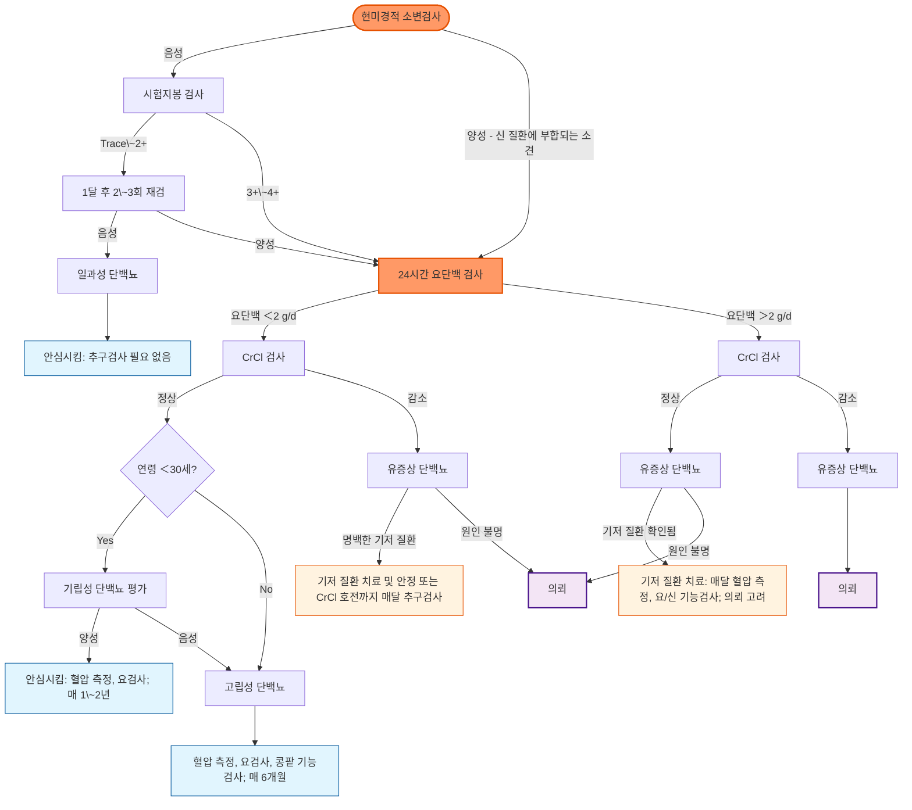

# 단백뇨 Proteinuria

## <mark style="color:green;">일반 사항</mark>

* 사구체 여과장벽 손상, 세뇨관 재흡수 장애, 또는 저분자 단백질의 과잉 생성으로 소변에 단백질이 비정상적으로 많이 배설되는 상태
* 신용어로는 알부민뇨(albuminuria)가 단백뇨 중 알부민 성분만을 지칭하는 좁은 개념이며, KDIGO 2024 만성콩팥병 진료지침은 콩팥손상의 주된 표지자로 알부민뇨(UACR)를 우선 사용할 것을 권고함

### <mark style="color:orange;">단백뇨 및 알부민뇨의 정의</mark>

<table><thead><tr><th width="140">구분</th><th width="140">정상\~경도 증가 (A1)</th><th width="140">중등도 증가 (A2)</th><th>고도 증가 (A3)</th></tr></thead><tbody><tr><td><strong>ACR (㎎/g)</strong></td><td>＜30</td><td>30\~300</td><td>＞300</td></tr><tr><td><strong>PCR (㎎/g)</strong></td><td>＜150</td><td>150\~500</td><td>＞500</td></tr><tr><td><strong>요 시험지봉 검사</strong></td><td>\~±(trace)</td><td>±\~1+</td><td>＞1+</td></tr></tbody></table>

_ACR=u/Alb/Cr ratio, PCR=u/Prot/Cr ratio; A1\~A3 등급은 KDIGO 2024 만성콩팥병(CKD) 진료지침의 알부민뇨(UACR) 분류와 동일한 구간을 따름. KDIGO는 A1\~A3를 ACR로만 공식 정의하며, 표의 PCR 구간은 KDIGO 공식 분류가 아니라 임상 대응을 위한 참고 기준임_

<p align="center"><em><mark style="color:$info;">Ref. 대한의학회, 일차의료용 근거기반 만성콩팥병 임상진료지침, 2022, 표 2; KDIGO 2024 CKD Guideline.</mark></em></p>

#### <mark style="color:$primary;">중등도 증가 알부민뇨 (Moderately increased albuminuria, A2)</mark>

* 구용어 : microalbuminuria(미세알부민뇨) - KDIGO 2024, ADA 2026 기준 더 이상 사용하지 않는 용어이며, 중등도 증가 알부민뇨(A2)로 통일; 다만 국내 일부 교과서·보험 기준에는 "미세알부민뇨" 표기가 아직 남아있어 환자·타과 협진 시 혼용될 수 있음
* 기준 : 임의뇨 Alb/Cr ratio 0.03\~0.3(30\~300 ㎎/g) 또는 24시간뇨 알부민 30\~300 ㎎
* 진단 : 3\~6개월 간격으로 시행한 3번의 임의뇨 검사에서 ≥2번 A2 기준에 해당
* 의의 : 당뇨병콩팥병증 조기 진단 및 신부전 예측 지표, 고혈압 환자의 심혈관 사망 위험 인자; KDIGO 2024는 eGFR 수준과 무관하게 알부민뇨 증가 자체가 심혈관·콩팥 예후 악화와 비례 관계임을 강조

#### <mark style="color:$primary;">고립성 단백뇨 (Isolated proteinuria)</mark>

* 정의 : GFR 감소가 없고 혈뇨 없이(＜3 RBC/HPF) 단백뇨만 발생; 보통 ＜3.5 g/d
* 보통 자각 증상 없음

### <mark style="color:orange;">예후</mark>

* 합병증 : 신부전, 고콜레스테롤혈증, 응고 경향 증가, 감염 위험 증가(신증후군)
* 많은 양의 단백뇨는 GFR에 관계없이 사망 위험 증가, 심근경색, 신부전으로 진행될 가능성이 높음
* 지속되는 단백뇨는 기저 원인에 따라 다양한 경과를 보임
* 일시적, 기립성 단백뇨는 양성 상태로 나쁜 예후를 보이지 않음
* 알부민뇨는 eGFR 감소 여부와 독립적으로 심혈관 사망·말기신부전 위험을 높이는 예후 인자이며, 알부민뇨 감소 자체가 치료 반응의 대리 지표로 활용됨(KDIGO 2024)

## <mark style="color:green;">원인 및 분류</mark>

#### <mark style="color:$primary;">기능성 단백뇨 (Functional proteinuria)</mark>

* 양성 경과의 일과성 단백뇨
* 원인 : 급성 질환, 발열, 심한 활동/운동, 기립 자세, 탈수, 정신적 스트레스, 임신, 추위 노출, 염증 상태, 심부전, 고혈압, 약물
* 요단백 양 : ＜1 g/d (✽＞1 g/d의 요단백은 보통 사구체 질환에 의함)
* 건강한 사람에서 검출되는 단백뇨는 추적 검사 시 대개 소실됨
* 치료 : 필요 없음


**Tip. 운동 후 단백뇨**\
격렬한 운동 직후에는 일시적 단백뇨가 흔하므로, 운동과 무관한 24\~48시간 후 아침 첫 소변으로 재검하는 것이 감별에 유용함


##### <mark style="color:$primary;">기립성 또는 자세 단백뇨 (Orthostatic or Postural proteinuria)</mark>

* 진단 원리 : 누운 자세로 밤새 휴식한 후의 아침 첫 소변에서는 단백뇨가 없거나 정상 범위이나, 기립 자세로 활동한 주간 소변에서는 단백뇨가 양성으로 나타남(split urine collection으로 확인)
* 요단백 양 : 아침 첫 소변에서는 정상(대략 ＜50 ㎎ 수준)이며 주간 소변에서만 증가
* 보통 ＜30세에서 호발
* 기전 : 불명; 기립 중의 혈류 역학 변화, 사구체 변화 등으로 추정
* 경과 : 일과성 또는 지속 경과를 보이지만 콩팥 기능에 영향을 주지 않으며 대부분 자연 소실됨
* 치료 : 필요 없음

##### <mark style="color:$primary;">소아 및 청소년에서의 단백뇨</mark>

* 원인 : 대부분 발열, 운동 등에 의한 일과성 단백뇨
* 선별 검사 양성 시 채뇨 유의 사항을 지켜 재검 → 1주 간격으로 3회 검사에서 최소 2번 단백뇨 검출 시 콩팥 질환에 대한 추가 검사 시행

#### <mark style="color:$primary;">Overload proteinuria</mark>

* 기전 : 혈중 순환하고 여과되는 저분자 단백질의 생성 및 배설 증가. 예) hemoglobinuria, myoglobinuria
* 원인 : myeloma, acute leukemia, rhabdomyolysis, hemolysis

#### <mark style="color:$primary;">Glomerular proteinuria</mark>

* 기전 : 사구체에서의 단백질 투과 증가
* 1차성 : minimal change Dz, 선천성 신증후군, focal segmental glomerular sclerosis, IgA nephropathy(Berger's Dz), membranoproliferative glomerulonephritis, membranous nephropathy, Alport syndrome
* 2차성 : PSGN, 당뇨병, SLE, Henoch-Schönlein purpura

#### <mark style="color:$primary;">Tubular proteinuria</mark>

* 기전 : 세뇨관에서의 단백질 재흡수 감소
* 1차성 : cystinosis, Dent's syndrome, Wilson's Dz, Lowe's syndrome, polycystic kidney Dz, mitochondrial disorder
* 2차성 : 중금속 중독, tubular necrosis, tubulointerstitial nephritis, obstructive uropathy

#### <mark style="color:$primary;">신증후군 (Nephrotic syndrome)</mark>

* 정의 : ① 심한 단백뇨(＞3.5 g/24h), ② 저알부민혈증(＜3 g/㎗), ③ 말초 부종의 3주징이 발생한 상태
* 관련 원인 질환 : 당뇨병, amyloidosis, SLE, 사구체 질환
* 치료 : ACEI/ARB, Na 섭취 제한, loop diuretics

### <mark style="color:$danger;">🚩 Red Flags!</mark>

<mark style="color:$danger;">**즉각 조치 또는 의뢰**</mark>

* 신증후군에 심한 전신 부종·복수와 함께 호흡곤란·저산소증 동반(폐부종, 흉막삼출 의심)
* 심한 단백뇨·저알부민혈증 상태에서 갑작스런 편측 하지 부종통, 흉통, 호흡곤란(신정맥혈전증·폐색전증 의심 - 신증후군의 과응고 상태)
* 육안적 혈뇨 + 단백뇨 + 급격한 콩팥 기능 저하 동반(급속진행사구체신염, RPGN 의심) → 즉시 신장내과 응급 의뢰
* 심한 고혈압(SBP ≥180 또는 DBP ≥120 ㎜Hg, 고혈압 위기 수준)이 단백뇨와 함께 발생한 경우
* 발열·복통을 동반한 신증후군 환자(자발성 세균성 복막염 유사 감염 의심)

<mark style="color:$warning;">**당일 또는 조기 의뢰**</mark>

* 신증후군 3주징(단백뇨 ＞3.5 g/24h, 저알부민혈증 ＜3 g/㎗, 말초 부종)의 신규 발생
* 단백뇨와 혈뇨가 함께 확인되는 경우(ACR ≥300 ㎎/g 또는 단백뇨 ≥0.3 g/day 상당의 유의한 단백뇨 + 혈뇨 - 사구체 질환 강력 의심) → 신장내과 의뢰 (☞ [혈뇨](110_-hematuria.md) 챕터의 사구체성 혈뇨 의뢰 기준과 동일)
* 임신부에서 신규 단백뇨 발생, 특히 고혈압 동반 시(전자간증 의심) → 즉시 산부인과/고위험임신 의뢰
* eGFR 급격한 저하(CrCl 감소)를 동반한 유증상 단백뇨로 원인이 불명확한 경우

<mark style="color:$info;">**외래 추적 / 추가 평가 계획**</mark> <mark style="color:$info;">- 즉각 위험 낮으나 호전 없으면 의뢰</mark>

* 시험지봉 검사 1+ 이상의 단백뇨가 확인되어 정량 검사(UACR/UPCR) 예정인 경우
* 경도\~중등도 단백뇨(A2, 30\~300 ㎎/g)가 지속되며 eGFR·혈압이 안정적인 경우 - 3\~6개월 간격 추적
* 당뇨병·고혈압 등 만성콩팥병 위험이 높은 환자에서 매년 정기 UACR 선별 검사 시행 예정

## <mark style="color:green;">임상 양상</mark>

* 대부분 무증상이며 정기 검진의 요검사에서 우연히 발견됨
* 신증후군 수준의 단백뇨에서는 안면·하지 부종, 거품뇨(foamy urine), 체중 증가가 나타날 수 있음
* 저알부민혈증이 심하면 복수, 흉막삼출 등 체강내 삼출이 동반될 수 있음
* 기저 사구체 질환에 따라 육안적 혈뇨, 고혈압이 동반될 수 있음

## <mark style="color:green;">진단</mark>

* 단백뇨·혈뇨의 단계별 상세 접근(Dipstick → UACR → UPCR → 24시간 단백뇨의 정량 흐름, 및 혈뇨의 현미경 검사 → RBC morphology → 비뇨기과/신장내과 의뢰 흐름)는 (☞ [콩팥 질환의 진단](109_.md)) 챕터에서 총괄적으로 다루며, 본 챕터의 아래 진단 원칙 및 알고리듬은 단백뇨에 특화된 실전 접근을 정리한 것임 (☞ [혈뇨](110_-hematuria.md) 챕터도 함께 참조)

### <mark style="color:orange;">신체검사</mark>

* 혈압, 체중
* 말초 부종, 안구 주위/안면 부종, 복수
* 콩팥, 폐, 심장 진찰 : CHF 징후 관찰

### <mark style="color:orange;">소변 검사</mark>

* 채뇨 방법 : 검사일 전날 밤 취침 시 배뇨 후 아침 첫 소변 채취 (☞ [콩팥 질환의 진단](109_.md) 챕터의 "소변 채취 Tips" 참조)

#### <mark style="color:$primary;">시험지봉 검사</mark>

* 글로불린, Bence-Jones 단백 등 알부민 외 단백질은 검출할 수 없음 → 세뇨관성 단백뇨(Tubular proteinuria), 범람성 단백뇨(Overload proteinuria, 예: myeloma의 Bence-Jones protein)에서는 실제 단백뇨가 상당함에도 위음성(Negative\~Trace)이 나올 수 있음 - 이런 임상 상황이 의심되면 dipstick 음성이어도 UACR/UPCR 정량 검사를 시행
* 위양성 : 육안혈뇨, 심한 농축뇨(SG ＞1.025), 알칼리 소변(pH＞8.0)

<mark style="color:cyan;">**Urine stick 검사 결과에 따른 추정 단백량**</mark>

<table data-header-hidden data-search="false"><thead><tr><th></th><th></th><th></th></tr></thead><tbody><tr><td><strong>시험지봉 검사 결과</strong></td><td><strong>추정 요단백 농도 (㎎/㎗)</strong></td><td><strong>추정 1일 배출 단백량 (g/d)</strong></td></tr><tr><td><strong>Negative</strong></td><td>＜15</td><td>＜0.5</td></tr><tr><td><strong>Trace</strong></td><td>15\~30</td><td>＜0.5</td></tr><tr><td><strong>1+</strong></td><td>30\~100</td><td>0.3\~1</td></tr><tr><td><strong>2+</strong></td><td>100\~300</td><td>1\~2</td></tr><tr><td><strong>3+</strong></td><td>300\~1,000</td><td>2\~5</td></tr><tr><td><strong>4+</strong></td><td>≥1,000</td><td>≥5</td></tr></tbody></table>

_✽시험지봉 검사는 소변 농축도에 영향을 받는 반정량 선별검사이며, KDIGO 2024는 dipstick을 정량적 판단(A1\~A3 등급 확정)에 사용하지 말 것을 명시적으로 강조함(농축뇨에서는 A1임에도 1+가 나올 수 있고, 희석뇨에서는 A3임에도 trace로 나올 수 있음) - 위 추정치는 선별 목적의 대략적 참고값일 뿐이며, 등급 확정은 반드시 UACR로 함_

#### <mark style="color:$primary;">소변 단백 정량 검사</mark>

* 임의뇨 Alb/Cr ratio(UACR) 측정 - 알부민뇨 평가의 1차 검사
  * 채뇨 우선순위(KDIGO 2024) : ① 아침 첫 소변(first morning void, 중간뇨) 우선 ② 여의치 않으면 무작위(random) 소변으로 초기 선별 후 ACR ≥30 ㎎/g이면 아침 첫 소변으로 확인 검사
  * UACR이 매우 높은 경우(예: ＞500 ㎎/g)에는 총 단백량 평가를 위해 UPCR을 함께 측정할 수 있음
  * 근육량이 너무 많거나 적으면 크레아티닌 보정에 오차 발생 가능
  * KDIGO 2024는 검사 간 생물학적 변이를 고려해 eGFR ＞20% 변화 또는 UACR 2배 이상 변화가 있을 때만 유의한 변화로 해석할 것을 권고
* 정량 검사 우선순위(KDIGO 2024) : UACR → (필요시) UPCR → 24시간뇨(특수한 경우) - 24시간 소변 수집은 임신, 극단적 근육량, 영양 평가처럼 정확한 시간당 배설량이 꼭 필요한 특수 상황에 한해 사용하며, 일상적인 알부민뇨 평가에는 권장하지 않음
  * 24시간뇨 (미세알부민 검사 보험기준 ☞ p.1192)

### <mark style="color:orange;">소변 외 검사</mark>

* CBC, ferritin, 철분, ESR, LFT, 혈당, 전해질, 지질, prothrombin time
* anti-phospholipase A2 receptor Ab, ANA, antistreptolysin O titer, complement C3/C4
* HIV, 매독, 간염

### <mark style="color:orange;">선별 검사</mark>

* 시험지봉 검사상 단백뇨가 1+ 이상 : 3개월 내 단백뇨 정량 검사 실시 → 정량 검사에서 단백뇨 진단 시 1\~2주 간격으로 재검 → 연속적으로 양성 시 관리
* 시험지봉 검사상 단백뇨이면서 Prot/Cr ratio 정상 : 주기적 추적 관찰
* 만성콩팥병 위험도가 높은 환자(예: 당뇨병, 고혈압) : 처음부터 단백뇨 정량 검사(UACR) 실시 → 단백뇨 진단 시 만성 콩팥 질환에 대한 평가
  * ✽이는 고위험군 대상 표적 선별검사이며, 무증상 저위험 일반 인구에서의 예방적 소변 검사는 권장하지 않음 (☞ [콩팥 질환의 진단](109_.md) 챕터의 "예방적 소변 검사의 한계" 참조)
  * 필요시 사구체성, 세뇨관성, 또는 범람성 단백뇨 감별을 위한 소변 단백 전기영동검사 시행

***



<p align="center"><strong>단백뇨 관리 알고리듬 (고전적 접근)</strong></p>

<p align="center"><em><mark style="color:$info;">Ref. Carroll MF, et al. Proteinuria in adults: A diagnostic approach, Fig1. AFP. 2000;15;62(6). 현미경검사→시험지봉→24시간뇨 순서의 전통적 흐름으로, 개념적 골격은 여전히 유효하나 실제로는 아래의 UACR 중심 흐름을 우선 사용함.</mark></em></p>

```mermaid
graph TD
    D1[시험지봉 양성 또는 UACR 선별 지표] --> U1[UACR 측정]
    U1 -->|A1, ＜30 ㎎/g| Reassure3[정상 - 위험군은 매년 재선별]
    U1 -->|A2\~A3, ≥30 ㎎/g| Persist{3\~6개월 내 재검하여 지속되는가?}
    Persist -->|아니오, 1회성| Reassure4[일과성 알부민뇨 - 추가 조치 불필요]
    Persist -->|예, 지속됨| CKDeval[CKD 평가: eGFR + UACR 위험도 분류(heat map)]
    CKDeval --> Tx[치료: ACEI/ARB + SGLT2 억제제 ± ns-MRA/GLP-1RA + 위험인자 관리]
    Tx --> FU[정기 추적: UACR·eGFR로 치료 반응 평가]

    style U1 fill:#f96,stroke:#e65100,stroke-width:2px
    style CKDeval fill:#f96,stroke:#e65100,stroke-width:2px
    style Reassure3 fill:#e1f5fe,stroke:#01579b
    style Reassure4 fill:#e1f5fe,stroke:#01579b
    style Tx fill:#fff3e0,stroke:#e65100,stroke-width:2px
```

<p align="center"><strong>단백뇨(알부민뇨) 평가 알고리듬 (KDIGO 2024 기반, 현행)</strong></p>

<p align="center"><em><mark style="color:$info;">Ref. KDIGO 2024 Clinical Practice Guideline for the Evaluation and Management of CKD. 상세 단계별 흐름은 (☞ [콩팥 질환의 진단](109_.md)) 챕터 참조.</mark></em></p>

***

## <mark style="background-color:$warning;">Management</mark>

### <mark style="color:orange;">치료 방침</mark>

* 원인 치료, 혈압/당뇨병 관리
* 관리 목표 : 모든 환자에서 일률적인 절대치보다 "가능한 한 알부민뇨(UACR) 감소"가 원칙(KDIGO 2024); 단, IgA nephropathy 등 일부 사구체 질환에서는 단백뇨 ＜0.5\~1 g/d 같은 질환별 구체적 목표가 별도로 제시됨
* 혈압 목표 : KDIGO 2024는 표준화된 진료실 혈압 측정을 전제로 수축기혈압(SBP) ＜120 ㎜Hg를 제시(2B); 실제 일차의료 현장에서는 표준화 측정이 어려운 경우가 많아 ≤140/90 ㎜Hg를 실질적 목표로 삼는 경우가 흔하며, 고령·허약·기립성 저혈압 위험군에서는 130\~139/80\~89 ㎜Hg 수준의 완화된 목표를 예시로 개별화함 (☞ [고혈압](../225_/095_-hypertension.md))
* 필요한 것 외의 약제 사용을 피함, 특히 콩팥 독성 약물 사용을 피함(예: NSAID, aminoglycoside)
* KDIGO 2024 원칙 : 알부민뇨 정도(A1\~A3)와 eGFR(G1\~G5)을 함께 고려한 위험도(heat map) 기반 치료 강도 결정; 알부민뇨 감소 자체를 치료 반응의 목표로 추적

## <mark style="color:green;">비-약물 치료 및 예방</mark>

* 단백질 섭취 제한 : CKD G3\~G5(eGFR ＜60) 시 단백질 섭취 0.8 g/㎏/d 유지 권고(KDIGO 2024, 2C); 진행 위험이 있는 경우 1.3 g/㎏/d 초과 섭취는 피함
* Na 섭취 제한 : ＜2 g/d(소금으로 5 g/d) (☞ [고혈압](../225_/095_-hypertension.md))
* 적당한 수분 섭취 : 목표 소변량 \~2 L/d
* 금연, 적정 체중 유지
* 심한 부종·신증후군 동반 시 침상 휴식(supine posture) 고려 - 모든 환자에게 일률적으로 권고하는 항목은 아님
* 심한 운동 삼가
* 과도한 커피 섭취 삼가

## <mark style="color:green;">약물 치료</mark>

### <mark style="color:orange;">RAAS 억제제(ACEI/ARB) - 1차 선택제</mark>

* ACEI 또는 ARB : 1차 선택제; 정상 혈압이 유지되는 최대 내약 용량 적용 (☞ p.486)
* KDIGO 2024 권고 : 알부민뇨 A3(＞300 ㎎/g) 환자는 당뇨병 유무와 관계없이 ACEI/ARB 시작 권고(1B); A2(30\~300 ㎎/g)는 당뇨병 동반 시 시작 권고(1B), 비동반 시 시작 고려(2C)
* ACEI, ARB, direct renin inhibitor(DRI)의 3제 병용은 피함(1B)
* 정상 혈압이며 알부민뇨 A1인 환자에서는 예방 목적의 ACEI/ARB 시작을 권고하지 않음(고혈압·심부전 등 다른 적응증이 있으면 시작 가능)
* 시작·증량 후 2\~4주 이내 혈압, 혈청 크레아티닌, 칼륨 재확인

### <mark style="color:orange;">non-DHP CCB</mark>

* diltiazem <mark style="color:blue;">\[헤르벤]</mark>, verapamil <mark style="color:blue;">\[이솦틴]</mark>

### <mark style="color:orange;">SGLT2 억제제</mark>

* KDIGO 2024 권고 : 2형 당뇨병 동반 CKD, eGFR ≥20 mL/min/1.73㎡ 환자에서 SGLT2 억제제 치료 권고(1A); 단백뇨를 동반한 CKD는 당뇨병 동반 여부와 무관하게 병용 고려(콩팥 기능·알부민뇨 감소, 심신 보호 효과)
* 성분명 : dapagliflozin, empagliflozin - 국내 유통 상품명은 제네릭 출시·적응증 승계 등으로 계속 변동 중이므로, 처방 전 최신 허가·급여 정보를 확인하는 것을 원칙으로 함
* 일단 시작 후에는 eGFR이 위 기준 아래로 떨어져도 투석 시작 전까지 유지 가능(practice point); 심한 탈수·수술·조영제 사용 등 급성 질환 시에는 일시 중단(sick day rule) 고려
* 급여 기준은 당뇨병 동반 여부, 병용 약제 조합에 따라 상이하므로 처방 전 최신 HIRA 고시 확인 필요

### <mark style="color:orange;">비스테로이드성 무기질코르티코이드 수용체 길항제(ns-MRA)</mark>

* finerenone <mark style="color:blue;">\[케렌디아]</mark> : 2형 당뇨병 동반 만성콩팥병에서 ACEI/ARB 병용 시 알부민뇨 감소 및 콩팥·심혈관 사건 위험 감소(FIDELIO-DKD, FIGARO-DKD, FIDELITY 통합분석)
* 국내 허가·급여 : 2형 당뇨병을 동반한 성인 만성콩팥병 환자에서 ACEI 또는 ARB를 최대 내약 용량으로 4주 이상 안정적으로 투여 중이며, ① UACR ＞300 ㎎/g 또는 요 시험지봉 검사 1+ 이상, ② eGFR 25\~＜75 mL/min/1.73㎡ 조건을 모두 만족할 때 병용 급여
* 주의 : 고칼륨혈증 발생률이 위약 대비 높음(FIDELITY 약 14% vs 7%) - 시작 전·후 혈청 칼륨, eGFR 모니터링 필수
* ACEI/ARB, SGLT2 억제제와의 3제 병용(CONFIDENCE 연구 등) 효과가 보고되고 있으나 국내 급여 인정 여부는 처방 전 확인 필요

### <mark style="color:orange;">GLP-1 수용체 작용제</mark>

* semaglutide : 2형 당뇨병 동반 만성콩팥병 환자에서 주요 콩팥 사건 위험 감소(FLOW trial, NEJM 2024) - eGFR slope 개선, 알부민뇨 감소 효과가 SGLT2 억제제 병용 여부와 무관하게 확인됨
* 2형 당뇨병 동반 시 심신보호 효과가 입증된 GLP-1 수용체 작용제를 혈당 조절과 함께 신보호 목적으로 우선 고려 가능 (☞ 당뇨병 약물치료 챕터)

***

### <mark style="color:red;">질병코드</mark>

N04 신증후군

N39.1 상세불명의 지속성 단백뇨

N39.2 상세불명의 기립성 단백뇨

N08 달리 분류된 질환에서의 사구체 장애 (당뇨병콩팥병증 등 연계용)

R80 고립된 단백뇨

***

## <mark style="color:purple;">처방례</mark>

> **처방례 1. 경도 단백뇨(A2), 고혈압 동반**
>
> ```
> 로살탄 50 ㎎/T  1T  qd
> ※ 2\~4주 후 혈압·혈청 크레아티닌·칼륨 재검 후 최대 내약 용량까지 증량
> ```
>
> _✽정상 혈압이라도 알부민뇨 A2 이상이면 신보호 목적으로 ACEI/ARB 시작을 고려_

> **처방례 2. 2형 당뇨병 동반 단백뇨(A3), ACEI/ARB 최대 용량 사용 중**
>
> ```
> 케렌디아 10 ㎎/T  1T  qd (콩팥 기능에 따라 20 ㎎까지 증량)
> ※ 시작 전 혈청 칼륨 확인(＞5.0 mEq/L이면 시작 보류); 시작 4주 후 재검
> ※ ACEI/ARB, SGLT2 억제제와 병용 가능; 급여기준(UACR＞300 ㎎/g 또는 dipstick ≥1+, eGFR 25\~＜75) 충족 확인
> ```
>
> _✽고칼륨혈증 위험으로 K 보존 이뇨제·칼륨 보충제 병용에 주의_

> **처방례 3. 신증후군 초기, 부종 동반**
>
> ```
> 발살탄 80 ㎎/T  1T  qd
> 푸로세미드 20 ㎎/T  1T  qd, 부종 정도에 따라 조절
> ```
>
> _✽Na 섭취 제한(＜2 g/d)과 병행; 저알부민혈증이 심하면(＜2 g/㎗) 이뇨제 반응이 저하될 수 있어 신장내과 협진 고려_

***

### <mark style="color:$success;">핵심 복약 지도</mark>

> **ACEI/ARB, 어떻게 관리할까요?**
>
> * 시작·증량 2\~4주 후 반드시 혈압, 혈청 크레아티닌, 칼륨을 재검하십시오 — eGFR이 일시적으로 최대 30%까지 감소할 수 있으나 이는 사구체내압 감소에 의한 예상된 반응으로, 대부분 지속 투여가 가능합니다
> * 임신 중이거나 임신 계획이 있는 경우 즉시 중단하고 대체 약제로 변경해야 합니다
> * NSAID 병용은 콩팥 기능 저하 위험을 높이므로 가능한 피하십시오

> **finerenone(케렌디아) 처방 시 확인할 점**
>
> * 시작 전 혈청 칼륨이 5.0 mEq/L을 초과하면 시작을 보류하십시오
> * ACEI/ARB와 병용하되, DRI(direct renin inhibitor)와의 3제 병용은 금기입니다
> * 급여 기준(2형 당뇨병 동반, UACR/dipstick 기준, eGFR 범위)을 처방 전 매번 확인하십시오 — 기준은 변경될 수 있습니다

> **언제 다시 병원을 방문해야 하나요?**
>
> * 부종이 갑자기 심해지거나 호흡곤란이 동반되는 경우 — 즉시 내원
> * 소변량이 눈에 띄게 줄어드는 경우
> * ACEI/ARB, finerenone 복용 중 다리 저림, 근력 저하 등 고칼륨혈증 의심 증상이 나타나는 경우
> * 정기 추적 검사에서 단백뇨가 악화되거나 콩팥 기능이 저하되는 경우

***

### <mark style="color:blue;">환자 안내서</mark>


**단백뇨, 소변에 거품이 많다면 확인이 필요합니다**

단백뇨는 콩팥의 여과 기능에 이상이 생겨 소변으로 단백질이 새어 나오는 상태입니다. 대부분 특별한 증상이 없어 건강검진에서 우연히 발견되는 경우가 많습니다.


#### <mark style="color:$primary;">왜 단백뇨가 생기나요?</mark>

* 발열, 심한 운동, 오래 서 있기, 탈수처럼 일시적인 원인으로 생기는 경우가 가장 흔하며, 이런 경우 특별한 치료 없이 저절로 없어집니다
* 당뇨병, 고혈압, 콩팥 자체의 염증성 질환 등이 지속적인 단백뇨의 원인이 될 수 있습니다
* 소변에 거품이 있다고 해서 반드시 단백뇨는 아닙니다 - 소변 농도나 배뇨 속도, 변기 물 상태 등에 의해서도 거품이 생길 수 있어 거품뇨만으로는 진단할 수 없으며, 반드시 소변 검사로 확인해야 합니다

#### <mark style="color:$primary;">일상생활에서 어떻게 관리하나요?</mark>

* **짠 음식을 줄이십시오.** 소금 섭취가 많으면 단백뇨와 부종이 악화될 수 있습니다
* **금연하고 적정 체중을 유지하십시오.** 콩팥 기능 보호에 도움이 됩니다
* **처방받지 않은 소염진통제(NSAID)를 임의로 장기 복용하지 마십시오.** 콩팥에 부담을 줄 수 있습니다
* **정기적으로 소변 검사와 혈압을 확인하십시오.** 단백뇨는 증상이 없어도 진행할 수 있어 추적 검사가 중요합니다

#### <mark style="color:$primary;">약은 어떻게 써야 하나요?</mark>

* 혈압약(ACEI/ARB 계열)은 혈압을 낮추는 효과 외에 단백뇨 자체를 줄여 콩팥을 보호하는 효과가 있어, 혈압이 정상이어도 처방될 수 있습니다
* 약 복용을 임의로 중단하지 마시고, 처방받은 대로 꾸준히 복용하십시오

#### <mark style="color:$primary;">이럴 때는 즉시 병원을 방문하세요</mark>

* 얼굴이나 다리가 갑자기 심하게 붓는 경우
* 소변에 거품이 눈에 띄게 늘거나 소변량이 줄어드는 경우
* 숨이 차거나 체중이 갑자기 증가하는 경우
