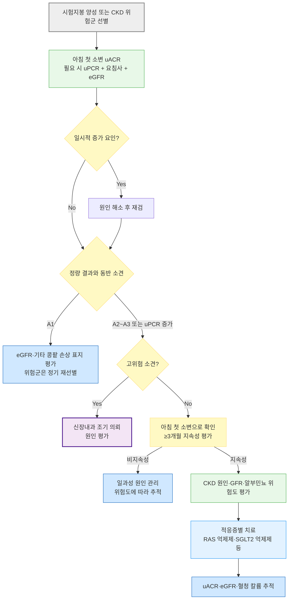

# 단백뇨 Proteinuria

## <mark style="color:green;">일반 사항</mark>

### <mark style="color:orange;">단백뇨 및 알부민뇨의 정의</mark>

* 단백뇨 : 사구체 여과 장벽 손상, 세뇨관 재흡수 장애, 또는 저분자 단백질의 과잉 생성으로 소변에 단백질이 비정상적으로 많이 배설되는 상태
* 알부민뇨(albuminuria) : 단백뇨 중 알부민 성분만을 지칭하는 좁은 개념; KDIGO 2024 지침은 콩팥 손상의 주된 표지자로 uACR(알부민뇨 수준)을 우선 사용할 것을 권고함

<table><thead><tr><th>구분</th><th>uACR (㎎/g)</th><th>uPCR (㎎/g)</th><th>요 시험지봉 검사</th></tr></thead><tbody><tr><td><strong>정상~경도 증가 (A1)</strong></td><td>＜30</td><td>＜150</td><td>~±(trace)</td></tr><tr><td><strong>중등도 증가 (A2)</strong></td><td>30~300</td><td>150~500</td><td>±~1+</td></tr><tr><td><strong>고도 증가 (A3)</strong></td><td>＞300</td><td>＞500</td><td>＞1+</td></tr></tbody></table>

_uACR=소변 Alb/Cr ratio, uPCR=소변 Prot/Cr ratio; A1\~A3 등급은 KDIGO 2024 만성콩팥병(CKD) 진료지침의 알부민뇨(uACR) 분류와 동일한 구간을 따름. KDIGO는 A1\~A3를 uACR로만 공식 정의하며, 표의 uPCR 구간은 KDIGO 공식 분류가 아니라 임상 대응을 위한 참고 기준임_

<p align="center"><em><mark style="color:$info;">Ref. 대한의학회, 일차의료용 근거기반 만성콩팥병 임상진료지침, 2022, 표 2; KDIGO 2012 CKD Guideline, Chapter 1, Table 7(PCR·요 시험지봉 환산 참고 기준); KDIGO 2024 CKD Guideline.</mark></em></p>

#### <mark style="color:$primary;">중등도 증가 알부민뇨 (Moderately increased albuminuria, A2)</mark>

* 구용어 : microalbuminuria(미세알부민뇨) - KDIGO 2024, ADA 2026 지침에서는 사용하지 않으며, '중등도 증가 알부민뇨(A2)'로 통일; 다만 국내 일부 문헌과 법령에는 "미세알부민뇨" 표기가 아직 남아있음
* 기준 : 임의뇨 Alb/Cr ratio 30\~300 ㎎/g 또는 24시간뇨 알부민 30\~300 ㎎
* 지속성 확인 : 일시적 증가 요인을 배제하고 3\~6개월 동안 시행한 3회 검사 중 ≥2회에서 uACR ≥30 ㎎/g이면 지속성 알부민뇨로 판단; 단, A3·콩팥 기능 저하·활성 요침사 등 고위험 소견이 있으면 반복 확인을 기다리지 않고 평가·의뢰
* 의의 : 당뇨병콩팥병증 조기 진단 및 신부전 예측 지표, 고혈압 환자의 심혈관 사망 위험 인자; KDIGO는 eGFR 수준과 무관하게 알부민뇨 증가 자체가 심혈관·콩팥 예후 악화와 비례 관계임을 강조

#### <mark style="color:$primary;">고립성 단백뇨 (Isolated proteinuria)</mark>

* 정의 : 전신질환의 증거, 고혈압, GFR 감소 또는 비정상 요침사 없이 단백뇨만 발생하는 상태; 대개 ＜2 g/d
* 보통 자각 증상 없음

### <mark style="color:orange;">예후</mark>

* 합병증 : 신부전, 고콜레스테롤혈증, 응고 경향 증가, 감염 위험 증가(신증후군)
* 많은 양의 단백뇨는 GFR에 관계없이 사망 위험 증가, 심근경색, 신부전으로 진행될 가능성이 높음
* 지속되는 단백뇨는 기저 원인에 따라 다양한 경과를 보임
* 일시적, 기립성 단백뇨는 양성 상태로 나쁜 예후를 보이지 않음
* 알부민뇨는 eGFR 감소 여부와 독립적으로 심혈관 사망·말기신부전 위험을 높이는 예후 인자이며, 알부민뇨 감소 자체가 치료 반응의 대리 지표로 활용됨

## <mark style="color:green;">원인 및 분류</mark>

#### <mark style="color:$primary;">기능성 단백뇨 (Functional proteinuria)</mark>

* 양성 경과의 일과성 단백뇨
* 원인 : 급성 발열성 질환, 격렬한 운동, 탈수, 정신적 스트레스, 추위 노출 등
* 요단백 양 : ＜1 g/d (✽＞1 g/d의 요단백은 보통 사구체 질환에 의함)
* 건강한 사람에서 검출되는 단백뇨는 추적 검사 시 대개 소실됨
* 치료 : 필요 없음

_✽임신, 심부전, 고혈압 또는 약물 노출과 동반된 단백뇨는 기능성 단백뇨로 단정하지 말고 임신성 고혈압질환, 지속성 콩팥 손상 및 약물유발 콩팥질환 등을 평가_


**운동 후 단백뇨** : 격렬한 운동 직후에는 일시적 단백뇨가 흔하므로, 운동과 무관한 24\~48시간 후 아침 첫 소변으로 재검하는 것이 감별에 유용함


<mark style="color:$primary;">**기립성 또는 자세 단백뇨 (Orthostatic or Postural proteinuria)**</mark>

* 누운 자세로 밤새 휴식한 후의 아침 첫 소변에서는 단백뇨가 없으며, 기립 자세로 활동한 주간 소변에서만 단백뇨가 나타남
* 전통적으로는 split urine collection(주간 16시간 + 야간 8시간 분리 채취; 야간뇨 단백량 ＜50 ㎎/8hr을 기준)으로 진단하였으나, 최근에는 아침 첫 소변의 uPCR(또는 uACR)이 정상 범위(uPCR ＜200 ㎎/g)이면서 주간 소변에서만 증가하는지로 확인하는 것이 일반적임
* 소아·청소년과 젊은 성인(대개 30세 미만)에서 흔함
* 기전 : 불명; 기립 중의 혈역학 변화, 사구체 변화 등으로 추정
* 경과 : 일과성 또는 수년간 지속될 수 있으나 콩팥 기능에 영향을 주지 않으며 대부분 자연 소실됨(장기 예후는 양호)
* 치료 : 필요 없음

<mark style="color:$primary;">**소아 및 청소년에서의 단백뇨**</mark>

* 원인 : 대부분 발열, 운동, 탈수 등에 의한 일과성 단백뇨 또는 기립성 단백뇨
* 시험지봉 검사 trace : 첫아침 소변으로 재검 → 첫아침 소변도 trace 또는 음성이면 일과성 단백뇨로 판단, 1년 후 재검 고려
* 시험지봉 검사 1+ 이상 : 첫아침 소변으로 uPCR과 uACR, 요검사를 함께 시행
  * 2세 이상에서 uPCR ≤200 ㎎/g이고 uACR ＜30 ㎎/g이며 요검사가 정상이면 일과성 또는 기립성 단백뇨 가능성이 높으므로 1년 후 재검 고려
  * uPCR ＞200 ㎎/g, 또는 혈뇨 등 이상 동반 시 추가 평가

- [ ] 국내 학교 집단 소변검사 후 재검을 안내받는 경우, 1주 간격 3회 검사 중 2회 이상 양성을 기준으로 하는 학교검진 운영지침을 적용하기도 함

#### <mark style="color:$primary;">Overload proteinuria</mark>

* 기전 : 혈중 순환하고 여과되는 저분자 단백질의 생성 및 배설 증가. 예) hemoglobinuria, myoglobinuria
* 원인 : myeloma, acute leukemia, rhabdomyolysis, hemolysis

#### <mark style="color:$primary;">Glomerular proteinuria</mark>

* 기전 : 사구체에서의 단백질 투과 증가
* 1차성 : minimal change Dz, 선천성 신증후군, focal segmental glomerular sclerosis, IgA nephropathy(Berger's Dz), membranoproliferative glomerulonephritis, membranous nephropathy, Alport syndrome
* 2차성 : PSGN, 당뇨병, SLE, Henoch-Schönlein purpura

#### <mark style="color:$primary;">Tubular proteinuria</mark>

* 기전 : 세뇨관에서의 단백질 재흡수 감소
* 1차성 : cystinosis, Dent's syndrome, Wilson's Dz, Lowe's syndrome, polycystic kidney Dz, mitochondrial disorder
* 2차성 : 중금속 중독, tubular necrosis, tubulointerstitial nephritis, obstructive uropathy

#### <mark style="color:$primary;">신증후군 (Nephrotic syndrome)</mark>

* 정의 : 다음의 3주징이 발생한 상태
  * ① 심한 단백뇨(＞3.5 g/24h), ② 저알부민혈증(＜3 g/㎗), ③ 말초 부종
* 관련 원인 질환 : 당뇨병, amyloidosis, SLE, 사구체 질환
* 신증후군 범위 단백뇨만으로 신증후군을 진단하지 않으며, 저알부민혈증·부종과 기저질환을 함께 평가
* 치료 : 원인질환 평가·치료가 우선이며, 체액 상태에 따라 Na 섭취 제한·loop diuretics를 사용하고 혈압·eGFR·혈청 칼륨을 고려해 ACEI/ARB 적용; 신규 발생 시 신장내과 조기 의뢰

### <mark style="color:$danger;">🚩 Red Flags!</mark>

<mark style="color:$danger;">**즉시 평가 및 의뢰**</mark>

* 신증후군에 심한 전신 부종·복수와 함께 호흡곤란·저산소증 동반  → 폐부종, 흉막삼출
* 심한 단백뇨·저알부민혈증 상태에서 갑작스런 편측 하지 부종통, 흉통, 호흡곤란 → 신정맥혈전증·폐색전증
* 육안적 혈뇨 + 단백뇨 + 급격한 콩팥 기능 저하 동반 → 급속진행사구체신염, RPGN
* SBP ≥180 또는 DBP ≥120 ㎜Hg이면서 급성 표적장기손상(신경학적 이상, 흉통·폐부종, 급격한 콩팥 기능 저하 등)이 의심되는 경우 → 고혈압응급
* 신증후군 환자에서 발열·심한 복통·복막자극징후 또는 패혈증 소견 → 복막염 등 중증 감염

<mark style="color:$warning;">**당일~수일 내 평가**</mark>

* 신증후군 3주징의 신규 발생
* 혈뇨와 함께 uACR ≥300 ㎎/g 또는 uPCR ≥500 ㎎/g(단백뇨 ≥0.5 g/d 상당)이 확인되는 경우 → 사구체 질환 강력 의심
* 지속적으로 uACR ＞700 ㎎/g이거나, 적혈구원주 또는 설명되지 않는 RBC ＞20/HPF가 지속되는 경우
* 임신부에서 신규 단백뇨 발생, 특히 고혈압 동반 시 → 전자간증
* eGFR의 급격한 저하를 동반한 유증상 단백뇨
* SBP ≥180 또는 DBP ≥120 ㎜Hg이지만 급성 표적장기손상이 명확하지 않은 경우 → 안정 후 재측정하고 당일 평가

<mark style="color:$info;">**조기 평가 및 추적**</mark>

* 시험지봉 검사 1+ 이상의 단백뇨가 확인되어 정량 검사(uACR/uPCR) 예정인 경우
* 경도\~중등도 단백뇨(A2, 30\~300 ㎎/g)가 지속되며 eGFR·혈압이 안정적인 경우 - 3\~6개월 간격 추적
* 당뇨병·고혈압 등 만성콩팥병 위험이 높은 환자에서 매년 정기 uACR 선별 검사 시행 예정

## <mark style="color:green;">임상 양상</mark>

* 대부분 무증상이며 정기 검진의 요검사에서 우연히 발견됨
* 신증후군 수준의 단백뇨에서는 안면·하지 부종, 거품뇨(foamy urine), 체중 증가가 나타날 수 있음
* 저알부민혈증이 심하면 복수, 흉막삼출 등 체강내 삼출이 동반될 수 있음
* 기저 사구체 질환에 따라 육안적 혈뇨, 고혈압이 동반될 수 있음

## <mark style="color:green;">진단</mark>

* 단백뇨·혈뇨의 단계별 상세 접근(Dipstick → uACR/uPCR → 24시간 단백뇨의 정량 흐름 및 혈뇨의 현미경 검사 → RBC morphology → 의뢰)은 [콩팥 질환의 진단](109_.md), [혈뇨](110_-hematuria.md) 챕터에서 총괄적으로 다루며, 본 챕터의 아래 진단 원칙 및 알고리듬은 단백뇨에 특화된 실전 접근을 정리한 것임

### <mark style="color:orange;">신체검사</mark>

* 혈압, 체중
* 말초 부종, 안구 주위/안면 부종, 복수
* 콩팥, 폐, 심장 진찰 : CHF 징후 관찰

### <mark style="color:orange;">소변 검사</mark>

* 채뇨 방법 : 검사일 전날 밤 취침 시 배뇨 후 아침 첫 소변 채취 (☞ [소변 채취 Tips](109_.md#tips))

#### <mark style="color:$primary;">시험지봉 검사</mark>

* 시험지봉 검사는 주로 알부민에 민감하며, 글로불린·면역글로불린 경쇄(Bence-Jones 단백) 등 비알부민 단백에는 민감도가 낮음
* 세뇨관성 단백뇨(tubular proteinuria), 범람성 단백뇨(overload proteinuria, 예: 다발골수종의 Bence-Jones protein)에서는 실제 단백뇨가 상당함에도 위음성(Negative\~Trace)이 나올 수 있음 - 의심되면 dipstick 또는 uACR이 낮더라도 uPCR을 측정하고, 임상 상황에 따라 혈청 유리경쇄와 혈청·소변 단백전기영동/면역고정검사를 시행
* 위양성 : 육안혈뇨, 심한 농축뇨(SG ＞1.025), 알칼리 소변(pH＞8.0)

**시험지봉 검사 결과별 대략적인 요단백 농도**

<table data-header-hidden data-search="false"><thead><tr><th></th><th></th></tr></thead><tbody><tr><td><strong>시험지봉 검사 결과</strong></td><td><strong>대략적인 요단백 농도 (㎎/㎗)</strong></td></tr><tr><td><strong>Negative</strong></td><td>＜15</td></tr><tr><td><strong>Trace</strong></td><td>15~30</td></tr><tr><td><strong>1+</strong></td><td>30~100</td></tr><tr><td><strong>2+</strong></td><td>100~300</td></tr><tr><td><strong>3+</strong></td><td>300~1,000</td></tr><tr><td><strong>4+</strong></td><td>≥1,000</td></tr></tbody></table>

_✽시험지봉 검사는 소변 농축도와 제품별 판독 기준에 영향을 받는 반정량 선별검사이며, 1일 단백 배출량으로 환산할 수 없음. 농축뇨에서는 A1임에도 1+가 나올 수 있고 희석뇨에서는 A3임에도 trace로 나올 수 있으므로, 양성 결과는 uACR 또는 임상 목적에 따른 uPCR로 확인_

#### <mark style="color:$primary;">소변 단백 정량 검사</mark>

* 임의뇨 Alb/Cr ratio(uACR) 측정 - 알부민뇨 평가의 1차 검사
  * 채뇨 우선 순위 : ① 아침 첫 소변(중간뇨) 우선 ② 여의치 않으면 random 소변으로 초기 선별 후 uACR ≥30 ㎎/g이면 아침 첫 소변으로 확인 검사
  * uACR이 매우 높은 경우(예: ＞500 ㎎/g)에는 총 단백량 평가를 위해 uPCR을 함께 측정할 수 있음
  * 근육량이 너무 많거나 적으면 크레아티닌 보정에 오차 발생 가능
  * 확진된 CKD 추적 중 eGFR ＞20% 변화 또는 uACR 2배 이상 변화는 생물학적·검사실 변동 범위를 넘어설 가능성이 있어 원인 평가가 필요함 \[KDIGO]
* 정량 검사 우선 순위 : uACR → (필요시) uPCR → 시간뇨(특수한 경우) - 임의뇨 비율검사 결과가 임상상과 불일치하거나 정확한 시간당 배설량이 치료 결정에 반드시 필요한 경우 제한적으로 사용하며, 임신을 포함한 일상적인 알부민뇨·단백뇨 평가에는 통상 필요하지 않음
  * [ ] [미량알부민 검사의 급여기준](https://www.hira.or.kr/rc/insu/insuadtcrtr/InsuAdtCrtrPopup.do?mtgHmeDd=20180531\&sno=5\&mtgMtrRegSno=0001)

### <mark style="color:orange;">소변 외 검사</mark>

* 기본 검사 : 혈청 Cr/eGFR, 전해질, 알부민·총단백, 혈당/HbA1c, 지질, CBC, 요침사
* 임상 소견에 따른 원인 검사
  * 사구체 질환 의심 : ANA, C3/C4, anti-phospholipase A2 receptor Ab, ANCA, anti-GBM Ab 등
  * 감염 연관 의심 : HBV, HCV, HIV; 필요 시 antistreptolysin O titer 등
  * 단클론감마글로불린병증 의심 : 혈청 유리경쇄, 혈청·소변 단백전기영동 및 면역고정검사
  * ferritin·철분, ESR/CRP, LFT, prothrombin time, 매독검사 등은 임상 적응증에 따라 선택

### <mark style="color:orange;">선별 검사</mark>

* 시험지봉 검사상 단백뇨가 1+ 이상 : 가능한 시기에 아침 첫 소변 uACR 또는 임상 목적에 따른 uPCR로 정량 확인
  * 발열, 격렬한 운동, UTI, 월경, 탈수 등 일시적 증가 요인이 있으면 해소 후 재검
  * CKD 진단 목적이면 최소 3개월 이상의 지속성을 확인하되, A3·혈뇨·eGFR 저하·신증후군 등 고위험 소견이 있으면 반복 확인을 기다리지 않고 평가·의뢰
* 시험지봉 검사상 단백뇨이지만 uACR/uPCR이 정상이면 소변 농축도와 검사 오차를 확인하고, 위험도에 따라 아침 첫 소변으로 재검
* 만성콩팥병 위험도가 높은 환자(예: 당뇨병, 고혈압) : 처음부터 단백뇨 정량 검사(uACR) 실시 → 단백뇨 진단 시 만성 콩팥 질환에 대한 평가
  * 필요시 사구체성, 세뇨관성, 또는 범람성 단백뇨 감별을 위한 소변 단백 전기영동검사 시행
  * 무증상 저위험 일반 인구에서의 예방적 소변 검사는 권장하지 않음 (☞ [예방적 소변 검사의 한계](109_.md#undefined-4))

***



<p align="center"><strong>단백뇨(알부민뇨) 평가 알고리듬</strong></p>

<p align="center"><em><mark style="color:$info;">저자 재구성 (참고 문헌: KDIGO 2024 Clinical Practice Guideline for the Evaluation and Management of CKD).</mark></em></p>

***

## <mark style="background-color:$warning;">Management</mark>

### <mark style="color:orange;">치료 방침</mark>

* 원인 치료, 혈압/당뇨병 관리
* 관리 목표 : 알부민뇨 감소를 치료 반응과 위험 감소를 평가하는 지표로 사용하되, 모든 환자에게 하나의 절대 목표를 적용하지 않음; IgA nephropathy 등 일부 사구체 질환에서는 질환별 단백뇨 목표를 적용
  * \[KDIGO] 알부민뇨 정도(A1\~A3)와 eGFR(G1\~G5)을 함께 고려한 위험도(heat map) 기반으로 치료 강도와 추적 간격 결정
* 혈압 목표 : KDIGO는 표준화된 진료실 혈압 측정을 전제로 내약 가능한 경우 SBP ＜120 ㎜Hg를 제시(2B); 국내 지침, 실제 혈압 측정법, 연령·허약·기립성 저혈압 및 낙상 위험을 함께 고려하여 개별화 (☞ [고혈압](../225_/095_-hypertension.md))
* 필요한 것 외의 약제 사용을 피함, 특히 콩팥 독성 약물 사용을 피함 (예: NSAID, aminoglycoside)

## <mark style="color:green;">비-약물 치료 및 예방</mark>

* 단백질 섭취 : CKD G3\~G5에서 0.8 g/㎏/d 유지 권고; 진행 위험이 있는 경우 1.3 g/㎏/d 초과 섭취는 피함. 고령·허약·근감소증 환자는 영양 상태에 따라 단백질·열량 목표를 상향 조정
* Na 섭취 제한 : ＜2 g/d(소금으로 5 g/d) (☞ [고혈압](../225_/095_-hypertension.md))
* 수분 섭취 : 갈증과 체액 상태에 따라 적절히 섭취하며, 부종·심부전·저나트륨혈증에서는 개별화
* 금연, 적정 체중 유지
* 안정된 환자에서는 일반적인 신체활동을 권장하되, 단백뇨 확인 검사 전에는 격렬한 운동을 피함

## <mark style="color:green;">약물 치료</mark>

### <mark style="color:orange;">RAAS 억제제(ACEI/ARB) - 1차 선택제</mark>

* ACEI 또는 ARB : 임상시험에서 효과가 확인된 최고 허가 용량 중 내약 가능한 용량 적용 (☞ [고혈압](../225_/095_-hypertension.md#renin-angiotensin))
* CKD G1\~G4에서 알부민뇨 A3(＞300 ㎎/g)는 당뇨병 유무와 관계없이 ACEI/ARB 시작 권고; A2(30\~300 ㎎/g)는 당뇨병 동반 시 시작 권고, 비동반 시 시작 고려
* ACEI, ARB 및 direct renin inhibitor(DRI) 중 두 가지 이상을 병용하지 않음
* 정상 혈압이며 알부민뇨 A1인 환자에서는 예방 목적의 ACEI/ARB 시작을 권고하지 않음 (✽ 고혈압·심부전 등 다른 적응증이 있으면 시작 가능)
* 시작·증량 후 2\~4주 이내 혈압, 혈청 크레아티닌, 칼륨 재확인

### <mark style="color:orange;">non-DHP CCB</mark>

* diltiazem <mark style="color:blue;">\[헤르벤]</mark>, verapamil <mark style="color:blue;">\[이솦틴]</mark> (☞ [고혈압](../225_/095_-hypertension.md#calcium-channel-blocker-ccb))
* 혈압 추가 조절이 필요하거나 RAAS 억제제 사용이 제한되는 경우 선택적으로 고려할 수 있으나, ACEI/ARB를 대체하는 일률적인 1차 신보호 치료는 아님; 서맥·방실차단·심부전 등에 주의

### <mark style="color:orange;">SGLT2 억제제</mark>

* 2형 당뇨병 동반 CKD, eGFR ≥20 환자에서 SGLT2 억제제 치료 권고
* 성인 CKD에서 당뇨병 유무와 관계없이 다음 중 하나이면 치료 권고
  * eGFR ≥20 mL/min/1.73㎡이면서 uACR ≥200 ㎎/g
  * 심부전 동반(알부민뇨 수준과 무관)
* eGFR 20\~45 mL/min/1.73㎡이면서 uACR ＜200 ㎎/g인 성인 CKD에서도 치료 고려
* 종류 : dapagliflozin <mark style="color:blue;">\[다파론]</mark>, empagliflozin <mark style="color:blue;">\[자디앙]</mark> (☞ [당뇨병](../226_/101_.md#sglt2i-sodium-glucose-cotransporter-2-inhibitor))
* 투여 시작 후에는 eGFR이 위 기준 아래로 떨어져도 투석 시작 전까지 유지 가능(practice point); 장기 금식, 수술 또는 중증 급성질환처럼 케톤증 위험이 증가하는 상황에서는 일시 중단 고려
* 급여 기준 : [dapagliflozin](https://www.hira.or.kr/rc/insu/insuadtcrtr/InsuAdtCrtrPopup.do?mtgHmeDd=20250701\&sno=2\&mtgMtrRegSno=0031), [empagliflozin](https://www.hira.or.kr/rc/insu/insuadtcrtr/InsuAdtCrtrPopup.do?mtgHmeDd=20251024\&sno=1\&mtgMtrRegSno=0002)

### <mark style="color:orange;">비스테로이드성 무기질코르티코이드 수용체 길항제 (ns-MRA)</mark>

* finerenone <mark style="color:blue;">\[케렌디아]</mark> : 최대 내약 용량 ACEI 또는 ARB를 사용 중인데도 알부민뇨(＞30 ㎎/g)가 지속되는 2형 당뇨병 동반 CKD(eGFR ＞25 mL/min/1.73㎡, 정상 혈청 칼륨)에서 콩팥·심혈관 사건 위험 감소
* 주의 : 고칼륨혈증 - 시작 전·후 혈청 칼륨, eGFR 모니터링 필수
* finerenone은 ACEI 또는 ARB 및 SGLT2 억제제에 추가할 수 있음(급여 기준과 고칼륨혈증 위험 확인)
* [급여 기준](https://www.hira.or.kr/rc/insu/insuadtcrtr/InsuAdtCrtrPopup.do?mtgHmeDd=20240201\&sno=4\&mtgMtrRegSno=0002) : 2형 당뇨병 동반 만성콩팥병 환자에서 ACEI/ARB를 투여 중이며, ① uACR ＞300 ㎎/g 또는 요 시험지봉 검사 1+ 이상, ② eGFR 25\~＜75 mL/min/1.73㎡ 조건을 모두 만족할 때 병용 급여

### <mark style="color:orange;">GLP-1 수용체 작용제</mark>

* semaglutide : 2형 당뇨병 동반 CKD 환자에서 주요 콩팥 사건 위험 감소가 확인되었으며, SGLT2 억제제 사용 여부에 따른 하위군에서도 효과 방향이 대체로 일관됨
* 2형 당뇨병 동반 CKD에서 metformin·SGLT2 억제제로 개별 혈당 목표에 도달하지 못했거나 이들 약제를 사용할 수 없는 경우, 심혈관 이득이 입증된 장시간형 GLP-1 수용체 작용제 사용을 권고; 비만·심혈관질환·콩팥 위험을 함께 고려하여 개별화

***

### <mark style="color:red;">질병코드</mark>

N04.9 상세불명의 신증후군 Nephrotic syndrome, unspecified

N39.1 상세불명의 지속성 단백뇨 Persistent proteinuria, unspecified

N39.2 상세불명의 기립성 단백뇨 Orthostatic proteinuria, unspecified

N08.3 당뇨병에서의 사구체 장애 Glomerular disorders in diabetes mellitus

_✽N08.3은 기저 당뇨병의 콩팥 합병증 코드를 우선 입력하고 함께 사용하는 발현 코드로, 단독 사용하지 않음_

R80 고립된 단백뇨 Isolated proteinuria

***

## <mark style="color:purple;">처방례</mark>

> **처방례 1. 경도 단백뇨(A2), 고혈압 동반**
>
> ```
> 로살탄 50 ㎎/T  1T  qd
> ※ 2\~4주 후 혈압·혈청 크레아티닌·칼륨 재검 후 최대 내약 용량까지 증량
> ```
>
> _✽지속성 CKD A2 이상에서는 정상 혈압이라도 신보호 목적으로 ACEI/ARB 시작을 고려하되, 저혈압·고칼륨혈증·AKI 위험을 평가_

> **처방례 2. 2형 당뇨병 동반 CKD(A3), eGFR 25\~＜60, ACEI 또는 ARB 최대 내약 용량 사용 중**
>
> ```
> 케렌디아 10 ㎎/T  1T  qd (4주 후 K·eGFR에 따라 20 ㎎까지 증량)
> ※ eGFR ≥60이면 20 ㎎ qd로 시작; eGFR ＜25이면 시작 권장하지 않음
> ※ 시작 전 혈청 칼륨 확인(＞5.0 mEq/L이면 시작하지 않음); 시작 또는 증량 4주 후 재검
> ※ ACEI/ARB, SGLT2 억제제와 병용 가능; 급여기준(uACR＞300 ㎎/g 또는 dipstick ≥1+, eGFR 25\~＜75) 충족 확인
> ```
>
> _✽고칼륨혈증 위험으로 K 보존 이뇨제·칼륨 보충제 병용에 주의_


**신규 신증후군은 정형화된 외래 처방보다 원인 평가와 신장내과 조기 의뢰가 우선이다.** 심한 저알부민혈증에서는 유효순환혈액량 감소가 동반될 수 있으므로, 체액 상태·혈압·eGFR·전해질을 확인하지 않고 ACEI/ARB와 이뇨제를 일률적으로 시작하지 않는다.


***

### <mark style="color:$success;">핵심 복약 지도</mark>

> **ACEI/ARB, 어떻게 관리할까요?**
>
> * 시작·증량 2\~4주 후 반드시 혈압, 혈청 크레아티닌, 칼륨을 재검하십시오 - 혈청 크레아티닌의 경미한 상승은 사구체내압 감소에 따른 예상 반응일 수 있으나, 4주 이내 ＞30% 상승하면 체액량 감소·NSAID 병용·콩팥동맥협착 등 원인을 평가하십시오
> * 임신 중이거나 임신 계획이 있는 경우 즉시 중단하고 대체 약제로 변경해야 합니다
> * NSAID 병용은 콩팥 기능 저하 위험을 높이므로 가능한 피하십시오

> **finerenone(케렌디아) 처방 시 확인할 점**
>
> * 시작 전 혈청 칼륨이 5.0 mEq/L을 초과하면 시작을 보류하십시오
> * ACEI 또는 ARB 한 가지와 병용하며, ACEI·ARB·DRI 중 두 가지 이상을 함께 사용하지 마십시오
> * 급여 기준(2형 당뇨병 동반, uACR/dipstick 기준, eGFR 범위)을 처방 전 매번 확인하십시오 - 기준은 변경될 수 있습니다

> **언제 다시 병원을 방문해야 하나요?**
>
> * 부종이 갑자기 심해지거나 호흡곤란이 동반되는 경우 - 즉시 내원
> * 소변량이 눈에 띄게 줄어드는 경우
> * ACEI/ARB, finerenone 복용 중 다리 저림, 근력 저하 등 고칼륨혈증 의심 증상이 나타나는 경우
> * 정기 추적 검사에서 단백뇨가 악화되거나 콩팥 기능이 저하되는 경우

***

## <mark style="color:blue;">환자 안내서</mark>


**단백뇨, 소변에 거품이 많다면 확인이 필요합니다**

단백뇨는 콩팥질환이나 다른 원인으로 소변에 단백질이 비정상적으로 많이 배설되는 상태입니다. 대부분 특별한 증상이 없어 건강검진에서 우연히 발견되는 경우가 많습니다.


### <mark style="color:orange;">왜 단백뇨가 생기나요?</mark>

* 발열, 심한 운동, 오래 서 있기, 탈수처럼 일시적인 원인으로 생길 수 있으며, 이런 경우 원인이 해소되면 없어지기도 합니다
* 당뇨병, 고혈압, 콩팥 자체의 염증성 질환 등이 지속적인 단백뇨의 원인이 될 수 있습니다
* 소변에 거품이 있다고 해서 반드시 단백뇨는 아닙니다 - 소변 농도나 배뇨 속도, 변기 물 상태 등에 의해서도 거품이 생길 수 있어 거품뇨만으로는 진단할 수 없으며, 반드시 소변 검사로 확인해야 합니다

### <mark style="color:orange;">일상생활에서 어떻게 관리하나요?</mark>

* **짠 음식을 줄이십시오.** 소금 섭취가 많으면 단백뇨와 부종이 악화될 수 있습니다
* **금연하고 적정 체중을 유지하십시오.** 콩팥 기능 보호에 도움이 됩니다
* **처방받지 않은 소염진통제(NSAID)를 임의로 장기 복용하지 마십시오.** 콩팥에 부담을 줄 수 있습니다
* **정기적으로 소변 검사와 혈압을 확인하십시오.** 단백뇨는 증상이 없어도 진행할 수 있어 추적 검사가 중요합니다

### <mark style="color:orange;">약은 어떻게 써야 하나요?</mark>

* 혈압약(ACEI/ARB 계열)은 혈압을 낮추는 효과 외에 단백뇨 자체를 줄여 콩팥을 보호하는 효과가 있어, 혈압이 정상이어도 처방될 수 있습니다
* 약 복용을 임의로 중단하지 마시고, 처방받은 대로 꾸준히 복용하십시오

### <mark style="color:orange;">이럴 때는 즉시 병원을 방문하세요</mark>

* 얼굴이나 다리가 갑자기 심하게 붓는 경우
* 소변량이 눈에 띄게 줄어드는 경우
* 숨이 차거나 흉통이 생기거나 체중이 갑자기 증가하는 경우
