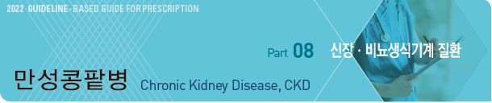
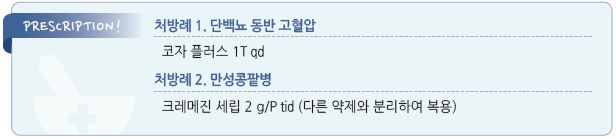

# 만성콩팥병 Chronic Kidney Disease, CKD



## 일반 사항

* 콩팥 질환의 원인과는 상관없이 콩팥 손상 또는 콩팥 기능의 감소가 ＞3개월 지속되는 상태

•콩팥 손상 : 사구체여과율에 관계없이 구조적 또는 기능적 이상을 포함하며 소변 검사 이상(알부민뇨 또는 적혈구,

```
백혈구 원주 등의 소변 침전물), 콩팥 조직 검사 이상(사구체, 세뇨관간질, 혈관의 병리 소견), 영상 검사 이상(초음파,

CT 검사 등), 콩팥 이식 상태
```

•콩팥 기능의 감소 : 사구체여과율 이 ＜60 ㎖/분/1.73㎡으로 감소한 상태

* 신부전 (kidney failure) : eGFR ＜15 또는 투석 등 신장 대치 요법이 필요한 상태
*   진행되면 nephron이 파괴되고, GFR이 점차 떨어지고 s-Cr이 상승하고 빈혈 발생(erythropoietin 감소).

    GFR이 ＜20\~25가 되면 hyperkalemia 발생
* 일반적으로 CKD는 서서히 진행되기 때문에 GFR 감소에 대한 작은 치료 효과로도 말기 신질환의 시작을 수 년 지연시킬 수 있음

#### 원인 및 위험 인자

* 고혈압, 당뇨병(가장 흔함), 심혈관질환
* ›65세
* 만성콩팥병의 가족력
* 콩팥 독성 약물 노출, 급성 콩팥 손상 병력
* 요로 감염, 요로 결석, 요로 폐쇄, 저체중 출산, 전신 감염, 자가 면역 질환
* 단일 콩팥 혹은 콩팥 실질 감소

## 임상 양상(mechanism)

* nitrogen 대사 산물 축적(GFR 감소)
* acidosis(ammonia 합성 감소, bicarbonate 재흡수 장애, acid 순 배설 감소)
* Na 저류(renin 과다 생성, 핍뇨) 또는 Na 소모(Na diuresis, tubular damage)
* 소변 농축 결손, 배뇨 횟수 변화(핍뇨 or 다뇨), 야뇨, 혈뇨(solute diuresis, tubular damage)
* hyperkalemia(GFR 감소, 대사성 산증, K 과다 섭취, hyporeninemic hypoaldosteronism)
* 신성 골형성장애(25(OH)D 생성 장애, hyperphosphatemia, hypocalcemia, 2ndary hyperparathyroidism)
* 쇠약(열량 섭취 부족, renal osteodystrophy, 대사성 산증, 빈혈, 성장호르몬 저항성)
* 빈혈(erythropoietin 생성 감소, 철 결핍, 엽산 결핍, Vit B12 결핍, 적혈구 생존률 감소)
* 출혈 경향, 점상 출혈(혈소판 기능 결함)
* 감염(granulocyte 기능 결함, 세포 면역 기능 장애, 투석 카테터 유치)
* 신경학적 증상(예: 피로, 집중력/기억력 저하, 두통, 졸림, 발작, 말초신경병증, asterixis, claudication, restless legs)(요독증, Al 독성, 고혈압)
* GI 증상(예: feeding intolerance, 복통, 구역/구토)(GE reflux, GI motility 감소, 전해질 불균형, 산도 이상, 중독 물질 누적, 체액 과부하)
* 고혈압, 부종, 호흡 곤란(volume overload, renin 과다 생성)
* 고지혈증(plasma lipoprotein lipase 활성 감소)
* 심낭염, 심근병증(요독증, 고혈압, fluid overload)
* 암모니아 냄새 소변, 쇠맛, 가려움(요독증)
* 당 불내성, 당뇨병(조직 인슐린 저항성)
* 우울, 불안, 스트레스

※ 1\~3단계에서는 보통 무증상

## 진단

* 선별 검사 : 위험 인자가 있는 경우 혈압, eGFR, 소변 검사 시행

•소변 검사 : 임의뇨 Alb/Cr ratio, 소변 침전물, 소변 시험지봉을 이용한 RBC 및 WBC 검사;

u-Alb/Cr ratio 측정이 용이하지 않은 경우 u-Prot/Cr ratio 측정으로 대치

### 실험실 검사

* BUN, Cr; eGFR 산출 (☞ p.604)
* 소변 검사 : U/A(시험지봉), u-ACR(＞500 ㎎/g) or u-PCR(＞1,000 ㎎/g), 소변 침사 검사
* 혈청 전해질 : Na, K(↑), Cl, bicarbonate(↓), Ca (↓), P (↑), Glc (↑), uric acid (↑)
* stage 3a 이상에서 Ca, P, PTH, ALP, 25(OH)D 검사 고려
* 선택적 검사 : s-/u-immunoelectrophoresis(multiple myeloma), s-free light chains(monoclonal gammopathy), antinuclear Ab(SLE)

#### CKD 표식자로서의 단백뇨 및 소변 침사 검사 이상의 해석

```

```

### 기타 검사

* 신장 초움파, 복부 X선 검사
* 혈관 석회화 검사 : stage 3 이상 환자에서 CT, 복부 측면 X선, 심장초음파 고려
* 골밀도 검사 : 골다공증 위험이 있는 stage 3 이상 환자에서 BMD 고려
* 조직 검사 : 원인 미상의 급성 신 질환 시 고려

### 추적 관찰

* 모든 CKD 환자에서 혈압, eGFR, 단백뇨 추적 관찰
*   1, 2단계에서는 CKD의 원인 질환 조절 및 악화 요인에 대하여 감시, 3단계 이후부터는 빈혈, 골대사(부갑상선 호르몬,

    칼슘, 인), 전해질 이상, 고지혈증 및 심혈관계 질환 등 합병증 관찰

#### CKD 단계 및 eGFR 측정 간격

```

```

#### CKD 단계에 따른 검사 종목별 추적 관찰 권고 기간

```

```

## 의뢰

1. stage 4,5 환자
2. stage 3 환자 중 다음 합병증에 대한 치료가 필요할 경우

① 치료되지 않는 빈혈(Hb ＜11 g/㎗)

② Vit D 치료에도 지속되는 부갑상선항진증(iPTH ＞70 pg/㎖)

③ 불응성 고혈압

3. 다음의 경우 stage와 무관

① 단백뇨 ＞1 g/24시간 또는 임의뇨 Prot/Cr ratio ＞1

② 육안혈뇨

③ 현미경혈뇨 환자에서 콩팥 기능 저하(eGFR ＜60) 또는 단백뇨(＞0.5 g/d)가 동반된 경우

④ 전신 질환 혹은 유전 질환이 의심되는 경우

⑤ 산 염기 대사 및 전해질 이상

⑥ 급성 신 손상 또는 급격한 사구체여과율 감소

* 신장 전문의의 진료 이후 치료 계획이 수립된 환자는 1차 의료기관에서 정기적인 추적을 담당할 수 있음

> **Management**

### 치료 방침

* 관련 인자(특히 단백뇨) 및 동반 질환(특히 당뇨병, 고혈압) 관리
* 약물 사용 주의 : 신장 독성이 입증되지 않은 약제라도 꼭 필요하지 않은 약물(특히 한약, 생약제)은 삼가

## 관련 인자 관리

#### 부종

* 단백뇨(-) 및 당뇨(-) CKD 환자의 부종에 대하여 이뇨제 단독 투여
* 저염식 : 금기가 아닌 한 Na ＜2 g/d(소금 5 g/d)로 섭취 제한 (☞ p.483)
* 수분 섭취 제한 : 부종, volume overload 시 시행

#### 단백뇨

* 목표 단백뇨 : ＜1 g/d (☞ p.612)
*   단백질 섭취 제한 : 0.8 g/㎏/d

    •CKD 초기에서의 단백질 섭취 제한 필요성은 논란

    •stage 3,4 시 0.6\~0.8 g/㎏/d, stage 5 또는 투석 시 1.2 g/㎏/d 섭취

> ✽당뇨병성신증 환자에서 초기부터 엄격한 단백질 제한은 필요치 않으나 많은 섭취(＞1.5 g/㎏/d)는 피함. 투석 환자나 진행된 당뇨병성 신증 환자는 영양실조의 위험이 있으므로 더 높은 수준의 단백질 섭취가 필요할 수 있음

* 단백질 섭취의 50% 이상을 식물성 단백질(과일, 야채, 견과류, 콩류, 씨앗 등)로 섭취 권고
* CKD with ≥300 ㎎/d albuminuria, diabetic CKD with 30\~300 ㎎/d albuminuria 환자에서 ACEI or ARB 권고

#### 혈압

* 목표 혈압 : CKD 단백뇨(-) 시 ＜140/90 ㎜Hg; CKD 단백뇨(+) 시 ＜130/80 ㎜Hg (☞ p.482)
* 치료 : 특히 고령자에서는 약제 사용에 주의가 필요하며 저용량으로 시작

•ACEI or ARB : 1차 선택제; 항고혈압, 단백뇨 감소, 콩팥 기능 보호 효과; 고칼륨혈증 주의. 저용량으로 시작, 단계적 증량;

```
급성 신 손상, 임신 시 삼가 (☞ p.486)
```

•이뇨제 : 필요시 ACEI 또는 ARB에 추가; mineralocorticoid 차단제(예: spironolactone)가 단백뇨 감소에 유효;

```
thiazide는 eGFR ≥30 시 허용, loop diuretics는 eGFR ＜30시 권고
```

•(non-DHP) CCB : 혈압 조절되지 않는 경우, 지속적인 s-Cr 상승이 있는 경우 고려

#### 혈당

* 공복 혈당 90\~130 ㎎/㎗, 당화혈색소 ＜7% 유지 (☞ p.543)
* s-Cr 증가(남 ≥1.5, 여 ≥1.4 ㎎/㎗) 시 metformin 사용 주의

> ```
> (✽FDA는 metformin에 의한 lactic acidosis 발생이 매우 드물기 때문에 이 금기 사항을 삭제함)
> ```

#### 빈혈

* CKD 초기에 발생할 수 있고, CKD가 진행할수록 심해짐
*   빈혈(남 Hb ＜13 g/㎗, 여 ＜12 g/ ㎗) 시 다음 검사를 고려

    ① CBC(Hb, RBC indices, WBC with diff, Plt)

    ② 절대 망상적혈구 수

    ③ ferritin

    ④ transferrin saturation(TSAT)

    ⑤ Vit B12, folate
*   철분 : 철결핍빈혈로 진단된 경우. TSAT ≤30% & s-ferritin ≤500 ng/㎖ 시 투여 고려;

    비투석 CKD 환자에서는 경구 철분제 투약을 우선 고려(1\~3개월간 시도) (☞ p.1026)
*   erythropoietin-stimulating agent : Hb ＜10 g/㎗ 시 투여 고려 (☞ p.1023)

    •조절 목표 : Hb 10\~11 g/㎗ (＜11.5 g/㎗\*)

\*과도한 교정은 고혈압의 악화, 위장관 장애(경구제), 심부전/뇌졸중(조혈 호르몬) 위험을 높일 수 있음

* 제제 : ferrous sulfate, erythropoietin-stimulating agent

#### 요독증

*   Spherical adsorptive carbon

    •작용 : 장내 요독소(indole) 또는 요독소의 전구체를 흡착하여 대변으로 배출

    •효과 : 요독증 증상 개선 및 투석 개시 지연

    •부작용 : 변비, 식욕 감퇴, 구토, 설사, 복통, 가려움; 타 약제 흡수 장애 유발

    •주의/금기 : 소화관 궤양, 식도성 정맥류, 소화관 통과 장애

    •용법 : 2 g tid \[크레메진] (보험기준 : 투석 전 진행성 CKD 환자 중 s-Cr 2\~5 ㎎/㎗인 환자)

#### 기타

* 금연, 적정 체중 유지, 음주 제한
* K, P : 정상 범위 유지
* PTH 상승 시 교정 가능한 인자 평가
* Vit D : 일반인과 동일한 방법 적용(☞ p.806); 장에서의 인 흡수를 증가시킬 수 있으므로 인 조절이 안 되는 경우에는 주의
* LDL-C 조절 : coronary heart Dz 수준으로 조절; ＜70\~100 ㎎/㎗ (☞ p.527)
* 골다공증 : 필요시 bisphosphonate 투여 (☞ p.807)
* 다른 약물 용량 조절 (☞ [Renal dosing database](http://www.globalrph.com/renaldosing2.htm))
* 한약제(감초, aristolochic acid 함유제 등), 안전성이 확인되지 않은 건강 식품 회피
*   신장 독성 약제 주의

    •항생제 : aminoglycosides, amphotericin B, cephalosporins, penicillins, beta-lactamase inhibitors, quinolones,

    rifampin, sulfonamides, vancomycin

    •항바이러스제 : acyclovir, adefovir, gancyclovir, atazanavir, indinavir, tenofovir

    •항암제 : alkylating agents, cisplatin, methotrexate, mitomycin, interferon-alpha, proteasome inhibitors,

    vascular endothelial growth factor (VEGF) inhibitors, checkpoint inhibitors

    •진통해열제(NSAID, 고용량의 aspirin), PPI, 요오드화 조영제, allopurinol, gold Na thiomalate, lithium, quinine,

    Na phosphate, bisphosphonates(pamidronate, zoledronic acid), calcineurin 억제제(cyclosporine, tacrolimus),

    이뇨제(loop diuretic, thiazides, triamterene)
* 운동 : 유산소 운동과 저항성 운동 병행; eGFR, Cr, 혈압 개선 효과가 있음

### 만성콩팥병 예방과 관리를 위한 생활 요법

1. 싱겁게 먹고 단백질 섭취를 줄인다.
2. 칼륨이 많은 음식의 지나친 섭취를 피한다.
3. 콩팥의 상태에 따라 수분을 적절히 섭취한다.
4. 금연하며 술은 하루에 한두 잔 이하로 줄인다.
5. 적정 체중을 유지한다.
6. 주 3일 이상, 30분\~1시간/일 정도 운동 한다.
7. 고혈압, 당뇨병을 적절히 조절한다.
8. 정기적으로 소변 단백질과 혈액 크레아티닌을 검사한다.
9. 약물은 꼭 필요한 약만, 콩팥 기능에 맞게 조절하여 복용한다.

#### 칼륨이 많은 음식

* 곡류군 : 현미, 흑미, 콩류, 팥, 감자, 고구마, 토란, 옥수수, 밤, 땅콩버터, 율무, 은행
* 어육류군 : 참치살, 삼치, 명태, 방어, 잉어, 미꾸라지, 우럭, 새우, 굴, 생오징어, 갑오징어
* 우유군 : 우유, 두유, 치즈, 아이스크림, 요구르트
* 채소군 : 고춧잎, 아욱, 근대, 취나물, 미나리, 시금치, 부추, 쑥, 쑥갓, 죽순, 늙은 호박, 무말랭이, 물미역
* 과일군 : 곶감, 앵두, 참외, 천도복숭아, 토마토, 키위, 멜론, 바나나, 말린 과일
* 기타 : 커피, 코코아, 초콜릿, 흑설탕, 호두, 땅콩, 잣

※ 고칼륨혈증의 위험이 있는 경우에만 K 섭취 제한

> **질병코드** N18 만성 신장병


