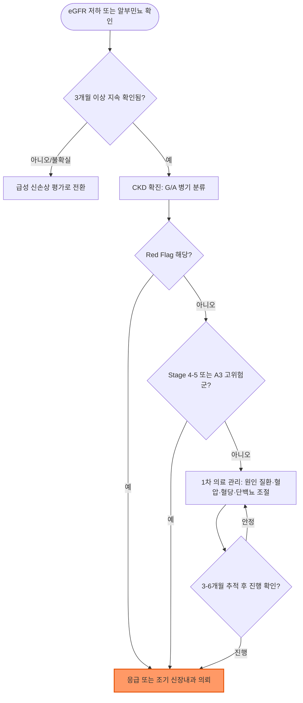

# 만성콩팥병 (만성신부전) Chronic Kidney Disease (CKD)

## <mark style="color:green;">일반 사항</mark>

* 콩팥 질환의 원인과는 상관없이 콩팥 손상 또는 콩팥 기능의 감소가 ＞3개월 지속되는 상태
  * 콩팥 손상 : 사구체여과율에 관계없이 구조적 또는 기능적 이상을 포함하며 소변 검사 이상(알부민뇨 또는 적혈구, 백혈구 원주 등의 소변 침전물), 콩팥 조직 검사 이상(사구체, 세뇨관간질, 혈관의 병리 소견), 영상 검사 이상(초음파, CT 검사 등), 콩팥 이식 상태
  * 콩팥 기능의 감소 : 사구체여과율(eGFR) ＜60 ㎖/분/1.73㎡가 3개월 이상 지속되는 상태
* 신부전(kidney failure) : KDIGO에서는 G5(eGFR ＜15)와 동의어로 사용하되, 투석·이식 등 신대체요법(KRT)이 필요한지 여부는 별도로 명시함
* 분류(KDIGO 2024) : 원인 질환(Cause) + 사구체여과율 병기(GFR category, G1\~G5) + 알부민뇨 병기(Albuminuria category, A1\~A3)의 **CGA 분류 체계**로 예후를 평가 (☞ 아래 예후 heat map 표)
* 진행 기전 : nephron 파괴 → GFR 점진적 감소 및 s-Cr 상승 → 빈혈 발생(erythropoietin 생성 감소); eGFR가 감소할수록 hyperkalemia 위험이 증가하며, 특히 G4\~G5 또는 ACEI/ARB/MRA 등 RAAS 차단제 병용 시 흔함
* 임상적 의의 : CKD는 서서히 진행되는 경우가 많아 GFR 감소에 대한 작은 치료 효과로도 말기 신질환 도달을 수 년 지연시킬 수 있음
* 유병률(질병관리청, 국민건강영양조사 2023) : 19세 이상 연령표준화 유병률 5.5%; 70대 이상 25.1%로 고령에서 급격히 증가

#### <mark style="color:$primary;">CKD 예후 Heat Map (G × A 병기)</mark>

<table><thead><tr><th width="130">G 단계 (eGFR, ㎖/분/1.73㎡)</th><th width="150">A1 (＜30 ㎎/g)</th><th width="150">A2 (30\~300 ㎎/g)</th><th>A3 (＞300 ㎎/g)</th></tr></thead><tbody><tr><td>G1 (≥90)</td><td>저위험</td><td>중등도위험</td><td>고위험</td></tr><tr><td>G2 (60\~89)</td><td>저위험</td><td>중등도위험</td><td>고위험</td></tr><tr><td>G3a (45\~59)</td><td>중등도위험</td><td>고위험</td><td>매우고위험</td></tr><tr><td>G3b (30\~44)</td><td>고위험</td><td>매우고위험</td><td>매우고위험</td></tr><tr><td>G4 (15\~29)</td><td>매우고위험</td><td>매우고위험</td><td>매우고위험</td></tr><tr><td>G5 (＜15)</td><td>매우고위험</td><td>매우고위험</td><td>매우고위험</td></tr></tbody></table>

<p align="center"><em><mark style="color:$info;">Ref. KDIGO 2024 Clinical Practice Guideline for the Evaluation and Management of CKD</mark></em></p>

✽이 Heat map(위험도)은 말기 신부전 진행 위험뿐 아니라 **심혈관 질환 위험도 및 사망 위험도**까지 함께 반영한 것임(KDIGO 2024) - 색이 짙어질수록 신장·심혈관 예후 모두가 나쁨을 의미

## <mark style="color:green;">원인 및 위험 인자</mark>

* 고혈압, 당뇨병(가장 흔함), 심혈관 질환
* 고령(특히 65세 이상)
* 만성콩팥병의 가족력
* 콩팥 독성 약물 노출, 급성 콩팥 손상 병력
* 요로 감염, 요로 결석, 요로 폐쇄, 저체중 출산, 전신 감염, 자가 면역 질환
* 단일 콩팥 혹은 콩팥 실질 감소

## <mark style="color:green;">임상 양상</mark>

* nitrogen 대사 산물 축적(GFR 감소)
* acidosis(ammonia 합성 감소, bicarbonate 재흡수 장애, acid 순 배설 감소)
* Na 저류(renin 과다 생성, 핍뇨) 또는 Na 소모(Na diuresis, tubular damage)
* 소변 농축 결손, 배뇨 횟수 변화(핍뇨 or 다뇨), 야뇨, 혈뇨(solute diuresis, tubular damage)
* hyperkalemia(GFR 감소, 대사성 산증, K 과다 섭취, hyporeninemic hypoaldosteronism)
* 신성 골형성장애(25(OH)D 생성 장애, hyperphosphatemia, hypocalcemia, 2ndary hyperparathyroidism)
* 쇠약(열량 섭취 부족, renal osteodystrophy, 대사성 산증, 빈혈, 성장호르몬 저항성)
* 빈혈(erythropoietin 생성 감소, 철 결핍, 엽산 결핍, Vit B12 결핍, 적혈구 생존률 감소)
* 출혈 경향, 점상 출혈(혈소판 기능 결함)
* 감염(granulocyte 기능 결함, 세포 면역 기능 장애, 투석 카테터 유치)
* 신경학적 증상(예: 피로, 집중력/기억력 저하, 두통, 졸림, 발작, 말초신경병증, asterixis, claudication, restless legs)(요독증, Al 독성, 고혈압)
* GI 증상(예: feeding intolerance, 복통, 구역/구토)(위장관 운동 저하 및 요독증, 전해질 불균형, 산도 이상, 중독 물질 누적, 체액 과부하)
* 고혈압, 부종, 호흡 곤란(volume overload, renin 과다 생성)
* 고지혈증(plasma lipoprotein lipase 활성 감소)
* 심낭염, 심근병증(요독증, 고혈압, fluid overload)
* 요독성 입 냄새(uremic fetor), 쇠맛, 가려움(요독증)
* 당 불내성 및 인슐린 저항성
* 우울, 불안, 스트레스

✽Stage 1\~3에서는 뚜렷한 증상 없이 비특이적이거나 경미한 소견(예: 미세 알부민뇨, 경도의 혈압 상승)만 있는 경우가 많으며, 위 증상들은 대개 stage 4\~5에서 뚜렷해짐 - 선별 검사 없이는 진행 후에야 발견되는 경우가 많음

### <mark style="color:$danger;">🚩 Red Flags!</mark>

<mark style="color:$danger;">**즉각 조치 또는 의뢰**</mark>

* 수일\~수주 내 급격한 s-Cr 상승 또는 eGFR 감소 (→ 급성 신손상 의심, 만성 경과와 감별 필요)
* 중증 고칼륨혈증(K ≥6.5 mEq/L) 또는 심전도 이상(peaked T wave, widened QRS 등) 동반 고칼륨혈증
* 체액 과다에 의한 급성 폐부종/호흡 곤란
* 요독성 뇌증(의식 변화, 발작) 또는 요독성 심낭염 의심
* 중증 대사성 산증

<mark style="color:$warning;">**당일 또는 조기 의뢰**</mark>

* Stage 4, 5 신규 발견(eGFR ＜30)
* 육안 혈뇨
* 단백뇨 ＞1 g/24시간 또는 임의뇨 Prot/Cr ratio ＞1
* 약물 병용 요법에도 조절되지 않는 불응성 고혈압
* 급격한 사구체여과율 감소(예: 이전 검사 대비 단기간 내 뚜렷한 저하 추세)
* 전신 질환 또는 유전 질환이 의심되는 소견 동반(예: SLE, ANCA 관련 혈관염 시사 소견)
* 갑자기 발생한 신증후군(nephrotic syndrome, 심한 단백뇨 + 저알부민혈증 + 부종)
* 산-염기 대사 및 전해질 이상

<mark style="color:$info;">**외래 추적 / 추가 평가 계획**</mark> <mark style="color:$info;">- 즉각 위험 낮으나 호전 없으면 의뢰</mark>

* Stage 3 중 치료되지 않는 빈혈(Hb ＜11 g/㎗) 지속
* Vit D 치료에도 지속되는 이차성 부갑상선기능항진증(iPTH ＞70 pg/㎖)
* 현미경적 혈뇨 환자에서 콩팥 기능 저하(eGFR ＜60) 또는 단백뇨(＞0.5 g/d) 동반

✽신장 전문의 진료 이후 치료 계획이 수립된 환자는 1차 의료기관에서 정기적인 추적을 담당할 수 있음

✽정량적 위험 예측 도구인 **KFRE(Kidney Failure Risk Equation)** - 연령, 성별, eGFR, uACR로 산출 - 를 함께 활용하면 도움이 됨: 5년 신부전 위험도 3\~5% 이상을 위 기준과 함께 신장내과 의뢰 여부 판단에 참고할 수 있음(KDIGO 2024). Stage 3 이상에서 사용 가능하며, eGFR ＞60인 경우에는 적용하지 않음

## <mark style="color:green;">진단</mark>

* 선별 검사 : 위험 인자가 있는 경우 혈압, eGFR, 소변 검사 시행
  * 소변 검사 : 임의뇨 Alb/Cr ratio, 소변 침전물, 소변 시험지봉을 이용한 RBC 및 WBC 검사; u-Alb/Cr ratio 측정이 용이하지 않은 경우 u-Prot/Cr ratio 측정으로 대치

### <mark style="color:orange;">실험실 검사</mark>

* BUN, Cr; eGFR 산출(CKD-EPI 공식 권장)
* 소변 검사 : U/A(시험지봉), u-ACR을 우선 사용하며 다량의 단백뇨에서는 u-PCR을 함께 사용할 수 있음, 소변 침사 검사
* 혈청 전해질 : Na, K(↑), Cl, bicarbonate(↓), Ca(↓), P(↑), Glc(↑), uric acid(↑)
* stage 3a 이상에서 Ca, P, PTH, ALP, 25(OH)D 검사 고려
* 선택적 검사 : s-/u-immunoelectrophoresis(multiple myeloma), s-free light chains(monoclonal gammopathy), antinuclear Ab(SLE)

#### <mark style="color:$primary;">CKD 표식자로서의 단백뇨 및 소변 침사 검사 이상의 해석</mark>

<table data-header-hidden data-search="false"><thead><tr><th width="72"></th><th width="74"></th><th width="68"></th><th width="78"></th><th width="170"></th><th></th></tr></thead><tbody><tr><td><strong>RBC</strong></td><td><strong>RBC 원주</strong></td><td><strong>WBC</strong></td><td><strong>WBC 원주</strong></td><td><strong>임의뇨 Prot/Cr ratio</strong></td><td><strong>관련 신장병</strong></td></tr><tr><td>+(dysmorphic)</td><td>+</td><td></td><td></td><td></td><td>증식성 사구체신염 또는 유전성 신장병</td></tr><tr><td>+(dysmorphic)</td><td>-</td><td></td><td></td><td></td><td>유전성 신장병 또는 미세혈관병</td></tr><tr><td>±</td><td>-</td><td>+</td><td>+</td><td>200\~1,000 ㎎/g</td><td>세뇨관간질염</td></tr><tr><td>+(isomorphic)</td><td>-</td><td></td><td></td><td>＜200 ㎎/g</td><td>신장을 제외한 요로계 병변</td></tr><tr><td>-</td><td>-</td><td></td><td></td><td>＞1,000 ㎎/g</td><td>당뇨병콩팥병증, 비염증성 사구체 질환</td></tr><tr><td>-</td><td>-</td><td></td><td></td><td>200\~1,000 ㎎/g</td><td>비염증성 사구체 질환, 비염증성 세뇨관간질성 질환, 중간 크기 혈관을 침범하는 혈관염</td></tr></tbody></table>

### <mark style="color:orange;">기타 검사</mark>

* 신장 초음파, 복부 X선 검사
* 혈관 석회화 검사 : stage 3 이상 환자에서 CT, 복부 측면 X선, 심장초음파 고려
* 골밀도 검사 : 골다공증 위험이 있는 stage 3 이상 환자에서 BMD 고려
* 조직 검사 : 원인 미상의 급성 신 질환 시 고려

### <mark style="color:orange;">감별 진단</mark>

* 새로 발견된 신기능 저하는 만성(CKD) 여부를 확인하는 것이 우선 - 과거 검사 기록이 없다면 아래 소견으로 감별

<table><thead><tr><th width="130">감별 포인트</th><th width="260">만성콩팥병(CKD) 시사</th><th>급성 신손상(AKI) 시사</th></tr></thead><tbody><tr><td>과거 검사 기록</td><td>3개월 이전부터 s-Cr 상승/eGFR 저하 확인됨</td><td>수일\~수주 전까지 정상 또는 기저치 확인됨</td></tr><tr><td>신장 초음파 크기</td><td>양측 신장 위축(다낭콩팥병 등 예외 있음)</td><td>정상 또는 증대된 크기</td></tr><tr><td>빈혈</td><td>정상적혈구성 빈혈 동반 흔함</td><td>초기에는 드물지만, 장기화되면 CKD와 유사하게 나타날 수 있음</td></tr><tr><td>이차성 부갑상선기능항진증</td><td>Ca↓, P↑, PTH↑ 동반 흔함</td><td>초기에는 드물지만, 장기화되면 CKD와 유사하게 나타날 수 있음</td></tr><tr><td>진행 속도</td><td>수개월\~수년에 걸친 완만한 저하</td><td>수시간\~수일의 급격한 저하</td></tr></tbody></table>

* 감별이 불명확하거나 원인 미상의 급격한 악화 시 → 신장내과 의뢰 (☞ Red Flags 참조)

### <mark style="color:orange;">추적 관찰</mark>

* 모든 CKD 환자에서 혈압, eGFR, 단백뇨 추적 관찰
* Stage 1, 2에서는 CKD 원인 질환 조절 및 악화 요인 감시; stage 3 이후부터는 빈혈, 골대사(부갑상선호르몬, 칼슘, 인), 전해질 이상, 이상지질혈증 및 심혈관계 질환 등 합병증 관찰
* 아래 표는 G 병기(eGFR) 기준이며, KDIGO 2024의 CGA 분류에서는 **A 병기(알부민뇨)도 함께 고려** - 같은 G 병기라도 알부민뇨가 많을수록(A2, A3) 더 자주 추적함(☞ 위 예후 heat map 참조)

#### <mark style="color:$primary;">CKD 단계 및 eGFR 측정 간격</mark>

<table><thead><tr><th width="70">Stage</th><th width="110">eGFR</th><th width="140">설명</th><th width="220">치료 계획</th><th>측정 간격</th></tr></thead><tbody><tr><td>1</td><td>≥90</td><td>정상 또는 높음</td><td>동반 질환 치료, 심혈관 질환 및 위험 인자 관리</td><td>매년</td></tr><tr><td>2</td><td>60\~89</td><td>경도 감소</td><td>진행 정도 검사</td><td>매년</td></tr><tr><td>3a</td><td>45\~59</td><td>경도\~중등도 감소</td><td>합병증 평가 및 치료</td><td>3\~6개월</td></tr><tr><td>3b</td><td>30\~44</td><td>중등도\~고도 감소</td><td>합병증 평가 및 치료</td><td>3\~6개월</td></tr><tr><td>4</td><td>15\~29</td><td>고도 감소</td><td>신장 대체 요법 준비</td><td>1\~3개월</td></tr><tr><td>5</td><td>＜15 (or 투석)</td><td>신부전</td><td>신장 대체 요법(요독 증상 발생 시)</td><td>6주</td></tr></tbody></table>

<p align="center"><em><mark style="color:$info;">Ref. KDOQI Guidelines, 2017; 대한의학회, 일차의료용 근거기반 만성콩팥병 임상진료지침, 2022.</mark></em></p>

#### <mark style="color:$primary;">CKD 단계에 따른 검사 종목별 추적 관찰 권고 기간</mark>

<table><thead><tr><th width="90">CKD 단계</th><th width="130">Cr, Hb, 지질¹⁾</th><th width="170">임의뇨 Prot/Cr ratio²⁾</th><th width="110">iPTH</th><th>칼슘, 인</th></tr></thead><tbody><tr><td>stage 1, 2</td><td>매년</td><td>매년</td><td>-</td><td>-</td></tr><tr><td>stage 3</td><td>3\~6개월</td><td>3\~6개월</td><td>12개월</td><td>6\~12개월</td></tr><tr><td>stage 4</td><td>1\~3개월</td><td>1\~3개월</td><td>6\~12개월</td><td>3\~6개월</td></tr></tbody></table>

* 모든 CKD 환자는 내원 시마다 **혈압 측정**
* 추적 관찰 기간은 환자의 **동반 질환**이나 **개별 상태**에 따라 단축될 수 있음
* ¹⁾ **지질 검사 항목**: 총콜레스테롤, LDL-C, HDL-C, 중성지방
* ²⁾ **단백뇨 vs 알부민뇨**: 알부민뇨가 예후와 더 밀접하지만, 비용 문제로 단백뇨 측정이 더 흔함

<p align="center"><em><mark style="color:$info;">Ref. 대한의학회, 일차의료용 근거기반 만성콩팥병 임상진료지침, 2022. 표 3.</mark></em></p>

***


```mermaid
graph TD
    A([eGFR 저하 또는 알부민뇨 확인]) --> B{3개월 이상 지속 확인됨?}
    B -- 아니오/불확실 --> C[급성 신손상 평가로 전환]
    B -- 예 --> D[CKD 확진: G/A 병기 분류]
    D --> E{Red Flag 해당?}
    E -- 예 --> F[응급 또는 조기 신장내과 의뢰]
    E -- 아니오 --> G{Stage 4-5 또는 A3 고위험군?}
    G -- 예 --> F
    G -- 아니오 --> H[1차 의료 관리: 원인 질환·혈압·혈당·단백뇨 조절]
    H --> I{3-6개월 추적 후 진행 확인?}
    I -- 진행 --> F
    I -- 안정 --> H

    style F fill:#f96,stroke:#e65100,stroke-width:2px
```

<p align="center"><strong>CKD 병기 분류 및 신장내과 의뢰 알고리듬</strong></p>

<p align="center"><em><mark style="color:$info;">Ref. KDIGO 2024 CKD Guideline; 대한의학회, 일차의료용 근거기반 만성콩팥병 임상진료지침, 2022.</mark></em></p>

***

## <mark style="background-color:$warning;">Management</mark>

### <mark style="color:orange;">치료 방침</mark>

* 관련 인자(특히 단백뇨) 및 동반 질환(특히 당뇨병, 고혈압) 관리가 핵심
* RAAS 차단제 + SGLT2 억제제(± 비스테로이드성 MRA)의 **다각적 병용 요법**이 현재의 표준(KDIGO 2024) - 신장 보호 효과가 각각 상가적으로 작용
* 약물 사용 주의 : 신장 독성이 입증되지 않은 약제라도 꼭 필요하지 않은 약물(특히 한약, 생약제)은 삼가


**단계별 접근**\
① 원인 질환 및 위험 인자 조절 → ② RAAS 차단제로 혈압·단백뇨 관리 → ③ SGLT2 억제제 병용 고려(RAAS 차단제 이후 순차 추가가 아니라, 적응증을 만족하면 초기부터 병용을 적극 고려 - KDIGO 2024) → ④ (당뇨병성 CKD의 경우) 비스테로이드성 MRA 추가(SGLT2 억제제와 동시 병용도 가능) → ⑤ 합병증(빈혈, 골대사이상, 고칼륨혈증, 요독증)별 관리 → ⑥ Stage 4\~5에서 신장 대체 요법 준비


## <mark style="color:green;">비-약물 치료 및 예방</mark>

1. 싱겁게 먹고 단백질 섭취를 줄인다.
2. 칼륨이 많은 음식의 지나친 섭취를 피한다(고칼륨혈증 위험이 있는 경우에 한함).
3. 콩팥의 상태에 따라 수분을 적절히 섭취한다.
4. 금연하며 술은 하루에 한두 잔 이하로 줄인다.
5. 적정 체중을 유지한다.
6. 주 3일 이상, 30분\~1시간/일 정도 운동한다(유산소 운동과 저항성 운동 병행 - eGFR, Cr, 혈압 개선 효과 확인).
7. 고혈압, 당뇨병을 적절히 조절한다.
8. 정기적으로 소변 단백질과 혈액 크레아티닌을 검사한다.
9. 약물은 꼭 필요한 약만, 콩팥 기능에 맞게 조절하여 복용한다.

### <mark style="color:orange;">저염식 및 수분 관리</mark>

* 저염식 : 금기가 아닌 한 Na ＜2 g/d(소금 5 g/d)로 섭취 제한
* 수분 섭취 제한 : 부종, volume overload 시 시행

### <mark style="color:orange;">단백질 섭취</mark>

* 목표 단백뇨 : ＜1 g/d
* 단백질 섭취 제한 : 0.8 g/㎏/d
  * CKD 초기에서의 단백질 섭취 제한 필요성은 논란
  * stage 3, 4 시 0.6\~0.8 g/㎏/d, stage 5 또는 투석 시 1.2 g/㎏/d 섭취
* 단백질 섭취의 50% 이상을 식물성 단백질(과일, 야채, 견과류, 콩류, 씨앗 등)로 섭취 권고
* ✽위 수치는 일반적 기준이며, 고령·영양실조 위험군에서는 개별 영양 상태에 따라 더 유연하게 조정해야 함(과도한 단백질 제한은 근감소·영양실조 위험을 높일 수 있음)

✽당뇨병성신증 환자에서 초기부터 엄격한 단백질 제한은 필요치 않으나 많은 섭취(＞1.5 g/㎏/d)는 피함. 투석 환자나 진행된 당뇨병성 신증 환자는 영양실조 위험이 있으므로 더 높은 수준의 단백질 섭취가 필요할 수 있음

### <mark style="color:orange;">칼륨 섭취 관리</mark>

* 고칼륨혈증의 위험이 있는 경우에만 K 섭취 제한(무증상 CKD에서 일률적 제한은 불필요)

#### <mark style="color:$primary;">칼륨이 많은 음식</mark>

* 곡류군 : 현미, 흑미, 콩류, 팥, 감자, 고구마, 토란, 옥수수, 밤, 땅콩버터, 율무, 은행
* 어육류군 : 참치살, 삼치, 명태, 방어, 잉어, 미꾸라지, 우럭, 새우, 굴, 생오징어, 갑오징어
* 우유군 : 우유, 두유, 치즈, 아이스크림, 요구르트
* 채소군 : 고춧잎, 아욱, 근대, 취나물, 미나리, 시금치, 부추, 쑥, 쑥갓, 죽순, 늙은 호박, 무말랭이, 물미역
* 과일군 : 곶감, 앵두, 참외, 천도복숭아, 토마토, 키위, 멜론, 바나나, 말린 과일
* 기타 : 커피, 코코아, 초콜릿, 흑설탕, 호두, 땅콩, 잣

## <mark style="color:green;">약물 치료</mark>

### <mark style="color:orange;">혈압 및 단백뇨 - RAAS 차단제</mark>

* 목표 혈압(KDIGO 2024) : 내약 시 **표준화된 진료실 혈압 측정(standardized office BP measurement)** 기준 **수축기 혈압 ＜120 ㎜Hg** 목표; 노쇠, 낙상 위험, 기대여명이 짧은 경우 등은 완화된 목표 적용
  * ✽"표준화된 진료실 혈압 측정"이란 환자가 진료실에서 5분 이상 안정을 취한 뒤 자동혈압계로 측정한 값을 의미하며, 일상 진료에서 흔히 재는 수동 혈압(전통적 기준 130/80 ㎜Hg에 해당)보다 낮게 측정되는 경향이 있어 단순 비교 시 혼란이 있을 수 있음
  * ✽기존 국내 지침(대한신장학회 등)의 CKD 단백뇨(-) ＜140/90 ㎜Hg, 단백뇨(+) ＜130/80 ㎜Hg 목표에서 KDIGO 2024 개정으로 강화되었으므로, 개별 환자의 내약성·노쇠도를 함께 고려하여 적용
* ACEI or ARB : 1차 선택제; 항고혈압, 단백뇨 감소, 콩팥 기능 보호 효과; 고칼륨혈증 주의. 저용량으로 시작, 단계적 증량; 급성 신 손상, 임신 시 삼가
* 이뇨제 : 필요시 ACEI 또는 ARB에 추가; mineralocorticoid 차단제(예: spironolactone)가 단백뇨 감소에 유효; thiazide는 eGFR ≥30 시 허용, loop diuretics는 eGFR ＜30 시 권고
* (non-DHP) CCB : 혈압 조절되지 않는 경우, 지속적인 s-Cr 상승이 있는 경우 고려
* 단백뇨(-) 및 당뇨(-) CKD 환자의 부종에 대하여 이뇨제 단독 투여 고려
* 비당뇨병성 CKD의 **A3(중증 알부민뇨)**, 당뇨병성 CKD의 **A2 이상(중등도 알부민뇨 이상)**에서 ACEI or ARB 권고(KDIGO 2024)

### <mark style="color:orange;">SGLT2 억제제 - 병인과 무관한 신장 보호 (2025 급여 확대)</mark>

* dapagliflozin <mark style="color:blue;">\[다파엔]</mark>, empagliflozin <mark style="color:blue;">\[자디앙]</mark> : 당뇨병 동반 여부와 무관하게 CKD 진행 지연 효과 확인(DAPA-CKD, EMPA-KIDNEY)
* KDIGO 2024는 개별 약제보다 **계열 효과(class effect)**로 접근할 것을 권고 - 허가 및 급여 범위 내에서는 계열 효과로 이해할 수 있음
* (☞ [보험기준](https://www.hira.or.kr/rc/insu/insuadtcrtr/InsuAdtCrtrPopup.do?mtgHmeDd=20250701\&sno=2\&mtgMtrRegSno=0031)) (보험기준 : ①ACEI 또는 ARB를 최대 내약 용량으로 4주 이상 안정적으로 투여 중, ②eGFR 25\~75 ㎖/분/1.73㎡, ③요 dipstick ≥1+ 또는 u-ACR ≥200 ㎎/g 중 하나를 만족하는 비당뇨성 만성 신장병 환자; 2025.7.1. 고시 기준 - 정확한 급여 기준은 HIRA 고시를 반드시 확인할 것(기준 변경 가능))
* eGFR ＜20\~25 미만에서 **신규 시작(initiation)**은 일반적으로 권장되지 않음(제품별 허가사항 확인). 다만 **이미 투여 중인 경우**, 내약성이 양호하고 투석·이식(KRT)을 시작하기 전까지는 eGFR이 20 미만으로 떨어지더라도 중단 없이 **지속(continuation)** 투여를 권장(KDIGO 2024) - 시작 기준과 지속 기준을 구분할 것
* 부작용 : 생식기 진균 감염, 드물게 정상혈당 당뇨병성 케톤산증(euglycemic DKA) - 급성 질환·수술 전 sick-day rule 교육 필요

### <mark style="color:orange;">비스테로이드성 MRA - 당뇨병성 신장병</mark>

* finerenone <mark style="color:blue;">\[케렌디아]</mark> : 제2형 당뇨병을 동반한 성인 CKD 환자에서 ACEI/ARB 표준 치료에 추가 시 신장 및 심혈관 복합 사건 위험 감소(FIDELIO-DKD, FIGARO-DKD)
* 용량 : 초기 용량은 eGFR에 따라 결정(제품 허가사항 참조); 고칼륨혈증 및 eGFR 저하 여부를 정기 모니터링
* (☞ 보험기준 : 제2형 당뇨병 동반 성인 CKD 환자로 ACEI 또는 ARB 표준 치료 병용 시 급여 인정, 2024.2.1. 고시 기준 - 정확한 급여 기준은 HIRA 고시 확인)
* SGLT2 억제제와 작용 기전이 달라(항염증·항섬유화) 병용 가능; CONFIDENCE trial(2025)에서 SGLT2 억제제와의 동시 병용이 각 단독 요법보다 알부민뇨를 더 크게 감소시켰고, 병용군의 고칼륨혈증 발생률이 finerenone 단독군보다 오히려 낮게 보고됨 - 다만 K 및 eGFR은 병용 시에도 정기 모니터링 필요

### <mark style="color:orange;">혈당 관리</mark>

* 공복 혈당 90\~130 ㎎/㎗, 당화혈색소 ＜7% 유지(개별화 가능)
* metformin : 현재는 eGFR 기반으로 용량을 조절하며, 혈청 creatinine 단독 기준은 사용하지 않음(예: eGFR 30\~45에서 감량, eGFR ＜30에서 중단 고려; 개별 제품 허가사항 확인)
* SGLT2 억제제, GLP-1 수용체 작용제는 혈당 조절과 별개로 신장·심혈관 보호 효과가 있어 당뇨병 동반 CKD에서 우선 고려되는 계열임
* GLP-1 수용체 작용제(특히 semaglutide)는 단순 혈당 조절제를 넘어, metformin + SGLT2 억제제 투여 후에도 목표 혈당에 도달하지 못하거나 알부민뇨가 지속될 때 심혈관·신장 보호를 목적으로 추가할 수 있는 약제로 위상이 격상됨 - 당뇨병 동반 CKD 환자에서 신장 및 심혈관 복합 사건 위험 감소 확인(FLOW trial, 2024)

### <mark style="color:orange;">고칼륨혈증 관리</mark>

* K, P : 정상 범위 유지
* 저칼륨 식이, 이뇨제 조정이 1차 조치이나, RAAS 차단제·SGLT2 억제제·비스테로이드성 MRA 등 신장 보호 약물을 고칼륨혈증을 이유로 감량·중단하기보다 **칼륨 결합제 병용으로 최적 용량을 유지**하는 전략이 권고됨(KDIGO 2024; 대한신장학회 2025 고혈압·콩팥병 진료지침)
* 칼륨 결합제
  * calcium polystyrene sulfonate <mark style="color:blue;">\[카리메이트]</mark> : 국내에서 오래 사용되어 온 1차 선택; 변비 등 위장관 부작용
  * sodium zirconium cyclosilicate(SZC) <mark style="color:blue;">\[로켈마]</mark> : 국내 신규 도입(2025년); 만성 관리 목적(RAAS 차단제 유지)에 우선 고려 가능하나 효과 발현까지 다소 시간이 걸려, 생명을 위협하는 **급성** 고칼륨혈증에는 단독 응급 치료제로 사용하지 말고 칼슘 정맥 주사·인슐린/포도당 등 표준 응급 치료와 **병용**해야 함(KDIGO 2024)

### <mark style="color:orange;">신성 빈혈</mark>

* CKD 초기에 발생할 수 있고, CKD가 진행할수록 심해짐
* 빈혈(남 Hb ＜13 g/㎗, 여 ＜12 g/㎗) 시 다음 검사를 고려
  1. CBC(Hb, RBC indices, WBC with diff, Plt)
  2. 절대 망상적혈구 수
  3. ferritin
  4. transferrin saturation(TSAT)
  5. Vit B12, folate
* 철분 : 철결핍빈혈로 진단된 경우, TSAT ≤30% & s-ferritin ≤500 ng/㎖ 시 투여 고려; 비투석 CKD 환자에서는 경구 철분제 투약을 우선 고려(1\~3개월간 시도)
* erythropoietin-stimulating agent(ESA) : Hb ＜10 g/㎗ 시 투여 고려
  * 조절 목표 : Hb 10\~11.5 g/㎗ (11.5 g/㎗ 초과로 올리지 않음)
  * ✽과도한 교정은 고혈압 악화, 위장관 장애(경구 철분제), 심부전/뇌졸중(ESA) 위험을 높일 수 있음
* 제제 : ferrous sulfate, ESA(epoetin alfa, darbepoetin alfa 등)

### <mark style="color:orange;">요독증</mark>

* Spherical adsorptive carbon
  * 작용 : 장내 요독소(indole) 또는 요독소의 전구체를 흡착하여 대변으로 배출
  * 효과 : 요독증 증상 개선 및 투석 개시 지연
  * 부작용 : 변비, 식욕 감퇴, 구토, 설사, 복통, 가려움; 타 약제 흡수 장애 유발
  * 주의/금기 : 소화관 궤양, 식도성 정맥류, 소화관 통과 장애
  * 용법 : 2 g tid <mark style="color:blue;">\[크레메진]</mark> (보험기준 : 투석 전 진행성 CKD 환자 중 s-Cr 2\~5 ㎎/㎗인 환자)

### <mark style="color:orange;">CKD-MBD(골, 미네랄 대사이상)</mark>

* PTH 상승 시 교정 가능한 인자(칼슘, 인, Vit D 부족) 우선 평가
* 일반 Vit D(콜레칼시페롤 등) : 일반인과 동일한 방법으로 부족분 보충; 장에서의 인 흡수를 증가시킬 수 있으므로 인 조절이 안 되는 경우 주의
* 활성형 Vit D(calcitriol 등) : KDIGO 2024는 **일률적(routine) 사용을 권장하지 않으며**, 중증·진행성 이차성 부갑상선기능항진증(SHPT)에서 선택적으로 고려
* Calcimimetic(cinacalcet 등) : 활성형 Vit D로 조절되지 않는 SHPT에 추가 옵션이나, 국내외 허가·주된 사용 근거는 **투석 중인 환자(G5D)** 위주이며 비투석 CKD에서는 허가 외 사용에 해당하고 저칼슘혈증 위험이 있어 신장내과와 상의 후 사용
* 골다공증 : 필요시 bisphosphonate 투여(eGFR에 따른 용량 조절 및 사용 가능 여부 확인 필요)

### <mark style="color:orange;">이상지질혈증</mark>

* KDIGO는 CKD에서 특정 LDL-C 목표치를 제시하지 않으며, **심혈관 위험도에 기반한 statin 치료 여부 결정**을 원칙으로 함(구체적 목표 수치·약제 선택은 이상지질혈증 챕터 참조)

### <mark style="color:orange;">신장 독성 약물 회피</mark>

* 다른 약물 용량 조절 필요(신기능에 따른 용량 조정 원칙 적용)
* 한약제(감초, aristolochic acid 함유제 등), 안전성이 확인되지 않은 건강 식품 회피
* 신장 독성 약제 주의
  * 항생제 : aminoglycosides, amphotericin B, cephalosporins, penicillins, beta-lactamase inhibitors, quinolones, rifampin, sulfonamides, vancomycin
  * 항바이러스제 : acyclovir, adefovir, gancyclovir, atazanavir, indinavir, tenofovir
  * 항암제 : alkylating agents, cisplatin, methotrexate, mitomycin, interferon-alpha, proteasome inhibitors, VEGF inhibitors, checkpoint inhibitors
  * 진통해열제(NSAID, 고용량 aspirin), PPI(장기간 사용 시 CKD 위험 증가 가능성이 보고되어 있어 불필요한 장기 처방은 지양), 요오드화 조영제, allopurinol, gold Na thiomalate, lithium, quinine, Na phosphate, bisphosphonates(pamidronate, zoledronic acid), calcineurin 억제제(cyclosporine, tacrolimus), 이뇨제(loop diuretic, thiazides, triamterene)
* 조영제 사용이 불가피한 경우 : 검사 전후 충분한 수액 공급, 최소 용량 사용, 신독성 약물 일시 중단 등 조영제 유발 급성 신손상 예방 조치 고려
* 일반의약품(OTC, NSAID 포함)의 자가 복용을 피하도록 교육 - 처방전 없이 구입 가능한 진통제·감기약에도 신장에 부담을 줄 수 있는 성분이 포함될 수 있음

### <mark style="color:orange;">기타</mark>

* 금연, 적정 체중 유지, 음주 제한
* 운동 : 유산소 운동과 저항성 운동 병행; eGFR, Cr, 혈압 개선 효과가 있음

### <mark style="color:orange;">신대체요법(투석·이식) 환자가 다른 질환으로 내원했을 때의 고려사항</mark>

* 투석·이식 등 신대체요법 자체의 시행과 관리는 전문 분야이므로 본서에서 다루지 않음. 다만 이미 신대체요법을 받고 있는 환자가 당뇨병, 고혈압, 수술 및 시술, 조영제 검사, 통증 관리, 호흡기 질환, 감염 등 **다른 문제로 1차 의료기관에 내원했을 때** 감별·처방에서 유의할 점을 정리함

#### <mark style="color:$primary;">공통 원칙</mark>

* 잔여 신기능이 남아있는 경우가 많으므로, 완전 무뇨가 아니라면 신장 독성 약물 회피 원칙은 계속 적용
* 약물 용량은 투석 여부·방식(혈액투석/복막투석)에 따라 조정이 필요한 경우가 많음 - 확신이 서지 않으면 담당 신장내과 또는 투석실에 문의
* 요독증 및(이식의 경우) 면역억제로 인해 감염에 취약하고, 발열 등 전형적 징후가 약화되어 나타날 수 있음 - 통상보다 낮은 문턱으로 적극 평가
* 상태가 애매하거나 처치가 신대체요법 자체에 영향을 줄 수 있는 경우 담당 신장내과·투석실·이식팀과 상시 소통

#### <mark style="color:$primary;">혈액투석 환자</mark>

* 혈관통로(AVF/AVG)가 있는 팔에서는 혈압 측정, 정맥주사, 채혈을 하지 않음
* 체액 상태가 투석 전후로 크게 변동하므로, 혈압을 해석할 때는 진료 시점이 투석 전인지 후인지 함께 고려
* 무뇨 환자에서는 이뇨제가 효과가 없을 수 있음

#### <mark style="color:$primary;">복막투석 환자</mark>

* 복통, 투석액 혼탁 등이 있으면 복막염 가능성을 감별하고 즉시 담당 신장내과·투석실에 연락
* 카테터 출구·터널 부위 감염을 통상적인 피부 연조직염과 감별

#### <mark style="color:$primary;">신장 이식 환자</mark>

* 면역억제제(calcineurin 억제제 : cyclosporine, tacrolimus)와의 약물 상호작용에 특히 주의
  * 혈중 농도 **상승**(독성 위험) : azole계 항진균제(fluconazole, itraconazole), macrolide(clarithromycin, erythromycin) 등 - azithromycin은 상대적으로 영향이 적어 대안으로 고려 가능
  * 혈중 농도 **저하**(거부반응 위험) : rifampin 등 CYP3A4 유도제
* NSAID는 신독성 및 calcineurin 억제제와의 상승 작용으로 가능한 회피
* 생백신(홍역·볼거리·풍진, 대상포진 생백신, 황열, 경구 소아마비 등)은 금기; 사백신(인플루엔자, 폐렴구균, 재조합 대상포진 백신 등)은 접종 권장
* 피부암 등 악성종양 위험이 증가하므로 새로 생긴 피부 병변은 적극적으로 평가하고 자외선 차단을 교육
* 불명열 등 감염이 의심되면 낮은 문턱으로 이식 코디네이터·이식내과에 연락

#### <mark style="color:$primary;">동반 질환별 고려사항</mark>

**당뇨병**

* HbA1c는 빈혈 및 적혈구 생존 기간 단축 등으로 신뢰도가 떨어질 수 있어 해석에 주의(필요시 glycated albumin 등 보조 지표 고려)
* 인슐린의 신 배설 감소로 작용이 길어져 저혈당 위험이 증가 - 용량 조정 필요
* metformin : 투석 환자에서는 금기
* SGLT2 억제제 : 혈당 강하 효과보다 신장·심혈관 보호 효과가 더 크지만, 지속 여부의 기준은 **eGFR 수치 자체가 아니라 투석/이식(KRT) 개시 여부**임(☞ 약물 치료 - SGLT2 억제제 항목 참조) - 이미 투석을 시작한 환자는 여과할 신장 기능이 없어 일반적으로 중단함

**고혈압**

* 혈액투석 환자는 투석 전후 체액량에 따라 혈압 변동이 크므로, 혈압 상승이 항상 약물 조절 실패를 의미하지 않고 체액 과다(건체중 초과)의 신호일 수 있음 - 필요시 투석 처방(제거량) 조정을 위해 투석실에 문의
* 무뇨 환자에서 이뇨제 추가는 효과가 없을 수 있음
* ACEI/ARB를 새로 시작하거나 용량을 조정한 경우 2\~4주 내 K(잔여 신기능이 있다면 s-Cr도 함께)를 재검(KDIGO)
* 난치성 고혈압, 반복되는 고칼륨혈증, 빠른 eGFR 감소(잔여 신기능이 있는 경우)는 신장내과 의뢰를 고려

**수술 및 시술**

* 수술 전 eGFR을 확인하고 신독성 약물(NSAID, 조영제 등) 사용 여부를 검토
* ACEI/ARB, SGLT2 억제제, metformin 등은 급성 질환·금식·수술 전후에 일시 중단 여부를 확인(이른바 "sick-day" 원칙)
* **투석 환자는 수술 일정과 투석 일정을 함께 조정함** - 혈액투석 환자는 수술 전후 투석 일정을, 복막투석 환자는 수술 부위·종류에 따라 일시적 중단 및 대체 투석 필요 여부를 투석실·신장내과와 사전 협의

**조영제 검사**

* **조영 CT가 반드시 필요한 경우, CKD가 있다는 이유만으로 검사를 포기하지 않음** - 위험도를 평가하고 예방적 조치를 함께 시행하는 것이 원칙
* 잔여 신기능이 남아있는 경우 조영제 유발 급성 신손상 위험을 평가(무뇨 혈액투석 환자는 상대적으로 위험이 낮으나 여전히 주의)
* 필요한 경우 검사 전후 충분한 수액 공급, NSAID 등 신독성 약물의 일시 중단을 고려
* metformin은 조영제 검사 전후 eGFR에 따라 일시 중단 여부 확인(투석 환자에서는 애초에 사용하지 않음)

**통증 관리**

* acetaminophen을 1차로 고려
* NSAID는 잔여 신기능 저하 및(이식의 경우) 이식신 손상 위험이 있어 가능한 회피
* gabapentin, pregabalin은 신기능(투석 환자는 투석 제거율)에 따라 감량하고, 투석 스케줄에 맞추어 투여 시점을 조정(예: 투석 후 복용)
* opioid는 신기능에 따른 용량 조절이 필요 - morphine은 활성 대사산물이 축적될 수 있어 상대적으로 피하고 대안을 신중히 고려

**호흡기 질환**

* 체액 과다로 인한 폐부종이 폐렴 등 감염성 질환과 임상적으로 혼동될 수 있어 흉부 영상과 체액 상태를 함께 평가
* 요독증(및 이식 환자의 면역억제)으로 결핵 등 만성 감염 위험이 일반인보다 높음 - 의심 소견 시 적극적으로 검사
* 동반되는 탈수·급성 신손상 위험에 대해서는 아래 "감염" 항목의 sick-day 원칙을 함께 참조

**감염(피부 감염 포함)**

* 항생제는 신기능(eGFR) 및 투석 여부에 맞게 용량·투여 시점을 조정 - aminoglycoside는 가능하면 회피, vancomycin은 혈중 농도(TDM) 모니터링 하에 용량·간격 조정
* 피부·요로·호흡기 감염 모두 탈수와 급성 신손상을 악화시킬 수 있어 수분 상태를 함께 평가
* 혈관통로 또는 복막투석 카테터 주변 감염은 전신 패혈증으로 진행할 수 있어 통상적인 연조직염보다 낮은 문턱으로 신장내과·투석실에 연락
* 요독성 소양감(uremic pruritus)과 감염성 피부 질환을 감별
* 이식 환자에서는 면역억제로 감염이 발열 없이 경미하게 나타날 수 있어 통상 기준보다 적극적으로 평가하고, 상처 치유가 지연될 수 있음을 고려
* 탈수(발열, 구토, 설사 등)가 동반되면 sick-day medication 원칙에 따라 ACEI/ARB, SGLT2 억제제, 이뇨제, metformin 등의 일시 중단 여부를 확인

**예방접종**

* Influenza(매년), pneumococcal, hepatitis B, COVID-19, 재조합 대상포진 백신(RZV)을 우선 고려 - 요독증 및(이식의 경우) 면역억제로 감염·백신 반응이 저하될 수 있어 시기를 놓치지 않는 것이 중요
* 이식 환자는 생백신 금기 원칙 재확인(☞ 위 "신장 이식 환자" 항목 참조)

**심혈관질환**

* CKD·투석·이식 환자 모두 죽상경화성 심혈관질환(ASCVD)의 고위험군이며, CKD 환자의 주된 사망 원인이 심혈관질환임
* 흉통은 적극적으로 평가하고, 심부전(체액 과다)과의 감별이 필요
* troponin은 만성적으로 상승되어 있는 경우가 많아 절대치보다 **추세(변화 양상)**로 급성 관동맥증후군 여부를 판단

**신장 이식·투석 관련 특이사항**

* ☞ 위 "혈액투석 환자", "복막투석 환자", "신장 이식 환자" 항목(혈관통로 보호, 약물 상호작용, 백신 등) 참조

***

### <mark style="color:red;">질병코드</mark>

N18 만성 신장병

N18.1 만성 신장병, 1기

N18.2 만성 신장병, 2기(경도)

N18.3 만성 신장병, 3기(중등도)

N18.4 만성 신장병, 4기(중증)

N18.5 만성 신장병, 5기

N18.6 말기 신질환

N18.9 만성 신장병, 상세불명

***

## <mark style="color:purple;">처방례</mark>

> **처방례 1. 단백뇨 동반 고혈압 - RAAS 차단제**
>
> ```
> 코자 플러스 1T　qd
> ```
>
> _✽ARB/ACEI는 강압 효과 외에 사구체내압 감소를 통한 단백뇨 감소 및 콩팥 기능 보호 효과가 있음. 시작 후 1\~2주 내 s-Cr, K 재검 권장; s-Cr이 기저치 대비 ＞30% 상승하거나 중증 고칼륨혈증 발생 시 감량 또는 중단_
>
> _✽코자 플러스는 thiazide(hydrochlorothiazide) 복합제로, eGFR ＜30 ㎖/분/1.73㎡(stage 4 이상)에서는 항고혈압·부종 조절 효과가 현저히 감소하므로 loop 이뇨제(furosemide, torsemide 등)가 포함된 처방으로 교체 고려_

> **처방례 2. 비당뇨병성 만성콩팥병 - SGLT2 억제제 추가**
>
> ```
> 다파엔정 10 ㎎/T　1T　qd
> ```
>
> _✽ACEI 또는 ARB를 최대 내약 용량으로 4주 이상 투여 중이며 eGFR 25\~75, 요 dipstick ≥1+ 또는 u-ACR ≥200 ㎎/g인 경우 급여 인정(2025.7.1. 고시 기준). 당뇨병 유무와 무관하게 신질환 진행 지연 효과 확인(DAPA-CKD, EMPA-KIDNEY)_

> **처방례 3. 제2형 당뇨병 동반 만성콩팥병 - 비스테로이드성 MRA 추가**
>
> ```
> 케렌디아정 10 ㎎/T　1T　qd
> ```
>
> _✽제2형 당뇨병 동반 성인 CKD 환자에서 ACEI/ARB 표준 치료에 추가. 초기 용량은 eGFR에 따라 결정(제품 허가사항 참조). K 및 eGFR 정기 모니터링 필요(FIDELIO-DKD, FIGARO-DKD)_

> **처방례 4. RAAS 차단제 유지 중 고칼륨혈증 동반**
>
> ```
> 로켈마 산 10 g　tid (교정기, 최대 48시간)
> ※ 이후 유지 용량 5\~15 g qd로 조정
> ```
>
> _✽RAAS 차단제를 고칼륨혈증을 이유로 감량·중단하기보다 칼륨 결합제 병용으로 최적 용량을 유지하는 것이 콩팥·심혈관 예후에 유리함. 생명을 위협하는 급성 고칼륨혈증의 단독 응급 치료로는 부적합(효과 발현에 시간 소요)_

> **처방례 5. 요독증 증상 동반**
>
> ```
> 크레메진 세립 2 g/포　tid
> ※ 다른 약제와 2시간 이상 간격을 두고 복용
> ```
>
> _✽s-Cr 2\~5 ㎎/㎗ 범위의 투석 전 진행성 CKD 환자에서 보험 인정. 변비, 식욕 감퇴 등 위장관 부작용 및 타 약물 흡수 저해 가능하므로 복용 간격 교육 필요_

***

### <mark style="color:$success;">핵심 복약 지도</mark>

> **RAAS 차단제(ACEI/ARB) 복용**
>
> * 시작 또는 증량 1\~2주 후 s-Cr, K 재검이 필요합니다.
> * s-Cr이 기저치 대비 30% 이상 상승하거나 중증 고칼륨혈증이 확인되면 감량 또는 중단을 고려합니다.
> * 임신 중이거나 임신 계획이 있는 경우 즉시 알려야 합니다(임신 시 금기).

> **SGLT2 억제제 복용**
>
> * 급성 질환, 수술, 금식 등으로 탈수 위험이 있을 때는 **일시 중단**하는 sick-day rule을 안내합니다.
> * 생식기 부위 청결을 유지하고, 가려움이나 분비물 등 진균 감염 증상 발생 시 알리도록 합니다.
> * 드물지만 혈당이 정상이어도 케톤산증이 발생할 수 있어(euglycemic DKA), 구역·구토·복통·과호흡 시 즉시 내원하도록 안내합니다.

> **칼륨 결합제(카리메이트, 로켈마) 복용**
>
> * 다른 경구 약물과는 최소 2\~3시간 간격을 두고 복용해야 흡수 방해를 줄일 수 있습니다.
> * 로켈마는 응급 상황의 즉효성 치료제가 아니므로, 심한 고칼륨혈증의 응급 처치로는 사용하지 않습니다.

> **크레메진(구형흡착탄) 복용**
>
> * 다른 약물과 반드시 2시간 이상 간격을 두고 복용해야 다른 약물의 흡수를 방해하지 않습니다.
> * 변비, 식욕 감퇴가 흔하므로 충분한 수분 섭취와 함께 복용하도록 안내합니다.

> **언제 다시 병원을 방문해야 하나요?**
>
> * 갑작스러운 부종 악화, 소변량 급격한 감소, 숨참이 발생하는 경우 - 즉시 내원
> * 육안으로 보이는 혈뇨가 발생하는 경우 - 즉시 내원
> * 어지럼, 근력 저하, 심계항진 등 고칼륨혈증이 의심되는 증상이 있는 경우 - 즉시 내원
> * 정기 검사에서 신기능이 예상보다 빠르게 나빠지는 경우 - 조기 내원

***

### <mark style="color:blue;">환자 안내서</mark>


**만성콩팥병, 조기에 발견하고 꾸준히 관리하면 진행을 늦출 수 있습니다**

콩팥은 우리 몸의 노폐물을 걸러내고 수분과 전해질 균형을 맞추는 장기입니다. 만성콩팥병은 이러한 콩팥의 기능이 3개월 이상 서서히 떨어지는 상태로, 초기에는 특별한 증상이 없는 경우가 대부분입니다. 꾸준한 약물 치료와 생활 습관 관리로 병의 진행 속도를 크게 늦출 수 있습니다.


#### <mark style="color:$primary;">왜 콩팥이 나빠지나요?</mark>

* 가장 흔한 원인은 당뇨병과 고혈압입니다. 두 질환 모두 콩팥의 작은 혈관을 서서히 손상시킵니다.
* 콩팥 기능은 한번 나빠지면 대부분 원래대로 되돌리기 어렵지만, 남아있는 기능을 최대한 오래 보존하는 것이 치료의 목표입니다.

#### <mark style="color:$primary;">일상생활에서 어떻게 관리하나요?</mark>

* **음식을 싱겁게 드십시오.** 짠 음식은 혈압을 높이고 콩팥에 부담을 줍니다.
* **단백질을 적당히 섭취하십시오.** 의료진이 안내한 양을 지키고, 콩류·견과류 등 식물성 단백질 비중을 늘리는 것이 도움이 됩니다.
* **고혈압, 당뇨병이 있다면 목표 수치까지 꾸준히 조절하십시오.** 콩팥병 진행을 늦추는 가장 중요한 방법입니다.
* **담배는 끊고, 술은 하루 한두 잔 이하로 줄이십시오.**
* **체중을 적정하게 유지하고, 주 3회 이상 규칙적으로 운동하십시오.**
* **정기적으로 소변 검사와 혈액 검사를 받으십시오.** 증상이 없어도 병이 진행할 수 있기 때문입니다.
* **의사와 상의 없이 진통제, 한약, 건강 기능 식품을 함부로 복용하지 마십시오.** 콩팥에 부담을 주는 성분이 포함될 수 있습니다.
* 고칼륨혈증이 있다고 진단받은 경우에만 바나나, 토마토, 감자, 참외 등 칼륨이 많은 음식을 제한하십시오. 그렇지 않다면 무리하게 제한할 필요는 없습니다.

#### <mark style="color:$primary;">약은 어떻게 복용해야 하나요?</mark>

* 혈압약(특히 ACEI/ARB 계열)은 콩팥을 보호하는 효과가 있어 혈압이 정상이어도 임의로 중단하지 않아야 합니다.
* 최근에는 당뇨병 여부와 관계없이 콩팥 기능 저하를 늦추는 새로운 약(SGLT2 억제제 등)이 함께 처방되는 경우가 늘고 있습니다. 의료진이 안내한 대로 꾸준히 복용하십시오.
* 새로 처방받은 약이나 다른 병원에서 처방받은 약을 복용하기 전에는 반드시 담당 의료진에게 알리십시오.
* **조영제를 사용하는 CT 검사나 심혈관 시술이 예정되어 있다면, 콩팥병이 있다는 사실을 검사·시술 담당 의료진에게 반드시 미리 알리십시오.** 조영제가 콩팥에 부담을 줄 수 있어 사전 대비가 필요합니다.

#### <mark style="color:$primary;">이럴 때는 즉시 병원을 방문하세요</mark>

* 다리나 얼굴이 갑자기 붓거나, 소변량이 눈에 띄게 줄어드는 경우
* 숨이 차서 눕기 힘든 경우
* 소변에 피가 섞여 나오는 경우
* 어지럼, 심한 무기력, 두근거림 등이 새로 나타나는 경우
