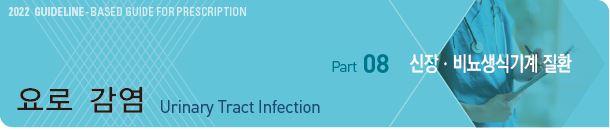
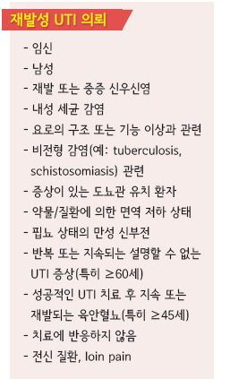
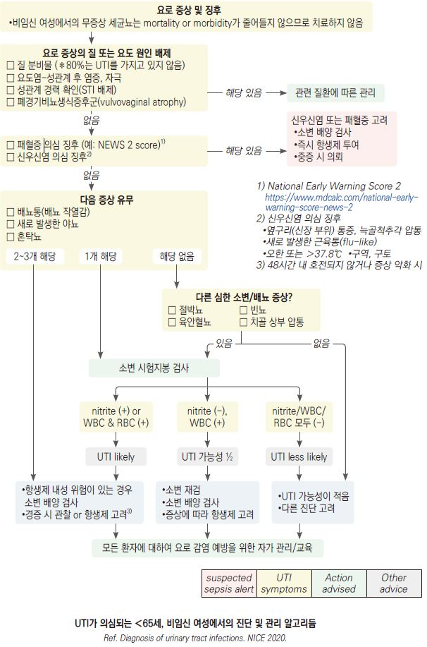
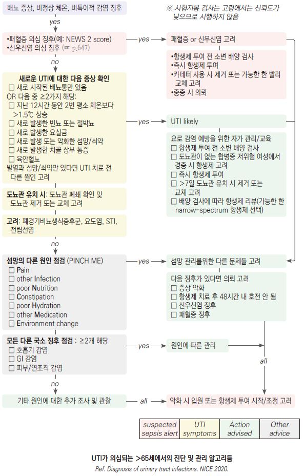
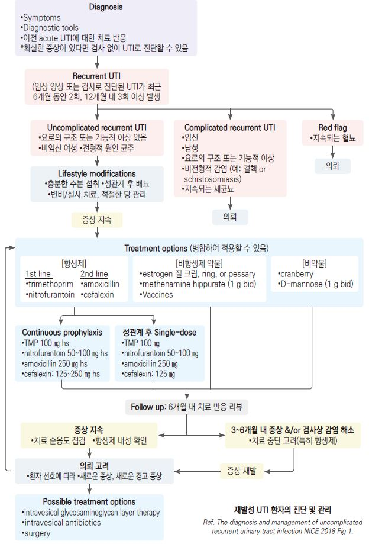

# 요로 감염 Urinary Tract Infection



## 일반 사항

* 요로 감염의 종류 : 신우신염, 방광염, 전립선염, 요도염, 무증상 세균뇨
*   발생률 : 연간 여성의 12.6%, 남성의 3%에서 발생

    •전체 여성의 ½이 일생 동안 1회 이상의 UTI를 경험
*   Uncomplicated UTI : 요로 폐쇄가 없고 도뇨관 삽입 등의 요로 조작 병력이 없는 일반적인 사람에서 발생한,

    하부 요로에 국한된 감염 및 증상; 보통 적절한 항생제 치료에 반응함
*   Complicated UTI : 해부학적/기능적 이상이나 요로 조작 병력이 있는 사람에서 발생한 요로 감염 또는 방광을 넘어선

    요로 감염(신우신염을 포함)
* Recurrent UTI(rUTI) : 6개월 동안 2회 또는 12개월 내 3회 이상 증상이 있는 UTI가 발생; 대부분 재감염에 의함
* Asymptomatic bacteriuria : 소변에 WBC와 inflammatory cytokine이 존재하지만 감염에 의한 임상 증상이 없음

## 원인

* 감염 경로 : 회음부 분변 균주의 상향 이동(대부분), 혈행성(간혹)
*   원인균 : E. coli (uncomplicated cystitis의 80% 차지), S. saprophyticus, Klebsiella, Proteus, Enterobacter,

    Pseudomonas , Candida (특히 여성, 병원 내 감염)

### 위험 인자

* UTI 과거력(특히 15세 이전 발생)
* 요로 감염 가족력
* 여성, 임신, estrogen 결핍(폐경)
* ＞50세인 남성
* 수분 섭취 부족
* 당뇨병, 비만, 면역 저하
* 최근 항생제 사용
* 도뇨관 유치, 최근 비뇨기계 수술 병력
* 복잡한/빈번한 성관계, 살정자제/diaphragm 사용, 불결한 위생
* 요로 이상 : 종양, 결석, 협착, 방광류, 잔뇨, 요실금, 신경인성 방광, BPH, 포경

### Complicated UTI 관련 인자

* 면역 저하
* 다제약물 내성 세균 감염
* 소아 요로 감염력
* 임신, 사춘기 또는 폐경기
* 당뇨병 등 대사 질환 동반
* 요로의 해부학적 또는 기능적 이상. 예) 결석, 스텐트, 도뇨관 유치, 신경원성 방광, 다낭신장병

## 임상 양상

* 상부 UTI : 발열/늑골 척추각 압통
* 하부 UTI : 배뇨통, 빈뇨, 치골 상부 압통, 절박뇨, 혈뇨; 잔뇨감, 야뇨, 요실금, 요도 통증, 하복부 통증, 요통, 성교통
* 혈뇨, 소변 악취

※ 인지 장애가 있는 환자들은 증상 호소가 정확하지 않을 수 있음을 주의

## 진단

* 여성에서 전형적인 하부 UTI 증상을 보이는 경우에는 검사 없이 진단 가능
* 재발의 경우 과거 acute UTI에서의 항생제 치료에 대한 반응 참조
* 소변 검사
* 영상 검사
* 필요시 성 매개 질환 검사 : HIV, 임질, 매독, 클라미디아, HBV, HCV

### 소변 검사

```
(☞ p.604)
```

* U/A : 세균뇨, 농뇨(WBC ≥10/HPF), 혈뇨(RBC ≥5/HPF)
* 시험지봉 검사 : leukocyte esterase & nitrite(+)
*   배양 검사 : 다음의 경우에 고려- 불확실한 진단, 신우신염 의심, 재발, 내성균 의심, 임신, 여성, 도뇨관 유치,

    증상이 있는 ＞65세; 반드시 항균제 투여 전에 시행해야 함

    •uncomplicated UTI에서 소변 배양 검사는 보통 유용하지 않음

    •장기 요양 환자에서 비-국소적인 UTI 증상이 있는 경우 일률적인 소변 배양 검사는 권하지 않음

#### 소변 배양 검사 UTI 진단 기준

* 결과는 증상과 비교하여 해석함; 불확실한 경우 재검
* 일반적 기준 : 10^4~~10^5 cfu/㎖(10^7~~10^8 cfu/L; 증상이 있는 경우 보다 낮은 수준에서도 진단
* 확실한 증상이 있는 여성 : 1회 ≥10^2 cfu/㎖
* 남성 : pure or predominant organism ≥10^3 cfu/㎖
* 단일 organism ≥10^4 cfu/㎖
* E. coli or S. saprophyticus : ≥10^3 cfu/㎖
* 하나의 predominant organism이 있는 mixed growth : ≥10^5 cfu/㎖
* 도뇨관 유치 : ≥10^2 cfu/㎖

### 영상 검사

* 대상 : complicated UTI, 재발, 48\~72시간의 적절한 항균제 치료에 반응 안 함
* 초음파, IVP, 배뇨방광요도조영술, 방광경, CT, MRI

### 증상에 따른 감별

#### 배뇨 시 통증 또는 작열감이 있음

* 혼탁뇨, 발열 또는 요통 → 신우신염
* 허리 또는 서혜부의 심한 통증 → 요로 결석
* 허리 또는 서혜부의 심한 통증은 없음 → 방광염
* 고환 밑 통증 → 전립선염
* 요도 끝에 분비물이 있는 남성 → 요도염

#### 평소보다 많은 소변량

* 물을 많이 마심, 체중 감소 있음 → 당뇨
* 체중 감소 없음 → 과다 수분 섭취, 추위, 카페인, 음주, 약물

#### 기타

* 절박뇨가 있으면서 실제 1회 배뇨량은 적음 → 방광염, 요로 결석
* 여성에서 기침/재채기 후 소변이 찔끔 새어 나옴 → 긴장성 요실금
* 남성에서 배뇨 후 소변이 새어나옴 또는 몇 방울 떨어짐 → 전립선 비대
* 혈뇨 → 요로 결석, 방광염, 비뇨기계 외상, 종양, 출혈성 질환 (☞ p.609)

## 당뇨병 환자에서의 UTI

* 비-당뇨병 환자와 같은 증상. 발열이 보다 흔함
* 신우신염, 양측 침범이 보다 흔함
* 신농양, emphysematous cystitis, 중증 패혈증 등의 가능성이 큼
* 진단 : 비-당뇨병 환자와 동일. 영상 검사 고려
* 치료 : 7일간 치료 고려 (☞ p.643)

## 도뇨관 유치 환자에서의 UTI

### 임상 양상

* 새로 발생하거나 악화되는 발열, 오한, 의식 변화, 전신 권태, 원인 모르는 기면
* 옆구리 통증, 늑골척추각 압통, 골반 통증, 급성 혈뇨
* 도뇨관이 제거된 환자의 배뇨 곤란, 빈뇨, 절박뇨, 치골위 통증

### 진단

* 배양 검사 : 도뇨관 유치 중 또는 제거 후 48시간 이내의 청결 채취 소변에서 1회 이상 ≥10^2 cfu/㎖

### 치료

* UTI 증상이 있는 경우 광범위 항생제 투여 및 배양 검사 결과에 따라 조정
* 요로 감염 의심 또는 관리 문제가 있는 경우 도뇨관 제거 또는 교환
* 도뇨관 삽입 빈도 및 유치 기간을 줄임
*   방광 세척 : 권고 안 함; 세척을 통한 예방 효과가 없으며 자극 증상 등 부작용 가능성이 있어 도뇨관의 폐쇄가 있지 않는 한

    권하지 않음
* 예방적 항균 요법 : 도뇨관 유치 환자에서 권하지 않음(효과는 불분명하고 내성 문제 등 발생)

## 남성에서의 UTI

* 시험지봉 검사로 감염을 배제하는 것이 어려움
* 증상이 가볍고 nitrite 및 leucocyte 모두 (-) 시 UTI 가능성은 낮음
* UTI 의심 시 배양 검사 후 항생제 투여를 시작하고 배양 검사 결과에 따라 조정
* 발열이나 전신 증상이 있는 요로 증상 시 전립선 이환 또는 신우신염 의심
* 남성에서 재발성 UTI는 드묾; 남성에서의 재발성 UTI 시 의뢰 고려



## 재발성 UTI

* 정의 : 6개월 동안 ≥2회 또는 12개월 동안 ≥3회 발생
*   여성에서 흔함; 초감염 여성의 25\~30%, 모든 여성의 44%,

    ＞55세 여성의 55%에서 12개월 내 재감염 발생
* 적절히 치료하지 않으면 신장 손상이 유발될 수 있음

#### 평가(여성)

* 병력 청취, 골반 진찰
* 이전의 소변 배양 검사 결과 확인
*   소변 검체의 오염이 의심될 때에는 다시 채취하여 검사해야 하며 도뇨관

    이용을 고려함
*   다른 문제가 없는 rUTI 여성 환자에서 일률적인 방광경 및 상부 요로 영상

    검사는 권고 안 함
*   rUTI 환자에서 증상이 있는 급성 방광염 episode가 발생할 때마다

    치료 시작 전 U/A, 소변 배양 및 감수성 검사를 시행하며, 소변 배양 검사

    진행 중 치료를 시작할 수 있음

#### Uncomplicated infection 치료

* nitrofurantoin 5일, TMP/SMX 3일, fosfomycin 1회 (☞ p.634)

***

## Management

## 약물 치료

> ☞ 무증상 세균뇨 p.630, 요도염 p.632, 급성 방광염 p.642, 급성 신우신염 p.645, 전립선염 p.647

## 예방

### 비-항생제 요법

* 충분한 수분 섭취(＞1.5 L/d)
* 방광을 자주 완전히 비움, 과도하게 소변을 참지 않음
* 성관계 전/후 배뇨
* 조이는 옷 회피
* 남성에서 청결한 포피 세척
* 당뇨병, 변비, 설사 등 기저 질환 관리
* 거품 목욕 회피
* 배변 후 앞에서 뒤로 닦음, 비데 사용 주의 (✽비데 사용으로 외음부 및 요로 감염이 증가할 수 있음)
* 여성에서 성관계 시 질이 건조한 경우 윤활제 사용
* 재발 시 살정자제/diaphragm 사용 회피
*   estrogen : 폐경 여성에 대하여 금기가 아닌 경우 estrogen 질 크림 고려. 항생제 예방 투여에 앞서 고려;

    0.5 g 취침 전 ×2주, 이후 2회/주 (☞ p.599)
*   methenamine hippurate : 소변 산성화 및 직접적인 항균 작용 추정; 1 g bid, 6개월 사용 후 검토

    •통풍, 중증 신/간 장애, 탈수 시 금기; 3개월마다 간 기능 검사
* Vit C : 소변 산성화에 기여 가능성; methenamine hippurate 병용 고려
* d-mannose : glycosylation 과정에서 enteric bacteria와 결합; 당뇨병 환자에서 주의; 1 g bid
*   cranberry : 유효 성분- proanthocyanidin; 소변 산성화에 기여하고 세균의 urothelial cell 수용체 부착을 방해. UTI 위험 및

    여성의 재발성 요로 감염이 감소되었다는 보고들이 있음; 증거가 충분하지 않으며, 용량과 효과 연관성 모름;

    warfarin에 영향을 줄 수 있음
* probiotics : 증거 부족

### 예방적 항생제 요법

* 이익-위험 및 다른 대안에 대하여 검토한 후 향후 UTI 위험을 줄이기 위하여 예방적 항생제를 투여할 수 있음
* 투여 전 결석, 역류, 누관 등 해부학적 이상 감별을 요함
* 6개월 시도에서 UTI 빈도에 유의미한 감소가 없으면 실패로 판정

#### 1회 투여 요법

* 다른 인자 없이 성관계가 유일한 유발 인자인 경우 유용; 달리기, 사이클 선수 등에서도 적용할 수 있음
* 성관계 후 2시간 내 투여
* 3개월 간 감염이 없으면 중단, 재발 반복 시 재개

#### 저용량 지속 투여 요법

* 1회 복용 항생제 요법의 ½ 용량을 성교 후에 투여
* 3\~6개월간 지속 투여 후 중단, 재발 반복 시 재개; 단발적 UTI 때는 재개하지 않음
* 한계 : 투여 기간 동안에만 예방 효과가 있음
*   항생제 예방 투여 중 UTI 발생 시 : 예방 요법 중단 및 소변 배양 검사/항생제 내성 검사, 다른 약제로 acute UTI 치료

    → 내성이 발생하지 않았다면 기존 예방 요법제로 재투여할 수 있음

#### 약제 및 용량

*   1차 선택 \[NICE]

    •trimethoprim : \[노출 후 1회] 200 ㎎; \[지속] 100 ㎎ 야간 \[셉트린]

    •nitrofurantoin : \[노출 후 1회] 100 ㎎; \[지속] 50\~100 ㎎ 야간
*   2차 선택제

    •amoxicillin : \[노출 후 1회] 500 ㎎; \[지속] 250 ㎎ 야간 \[파목신]

    •cephalexin : \[노출 후 1회] 500 ㎎; \[지속] 125 ㎎ 야간 \[팔렉신]

> **질병코드** N39.0 부위가 명시되지 않은 요로감염






