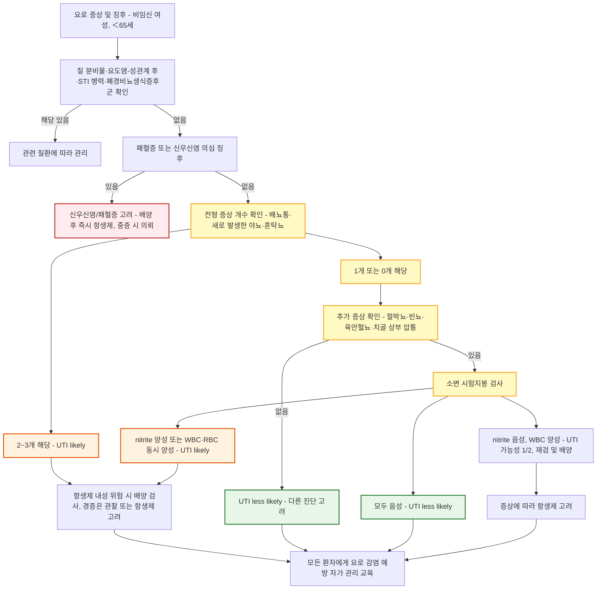
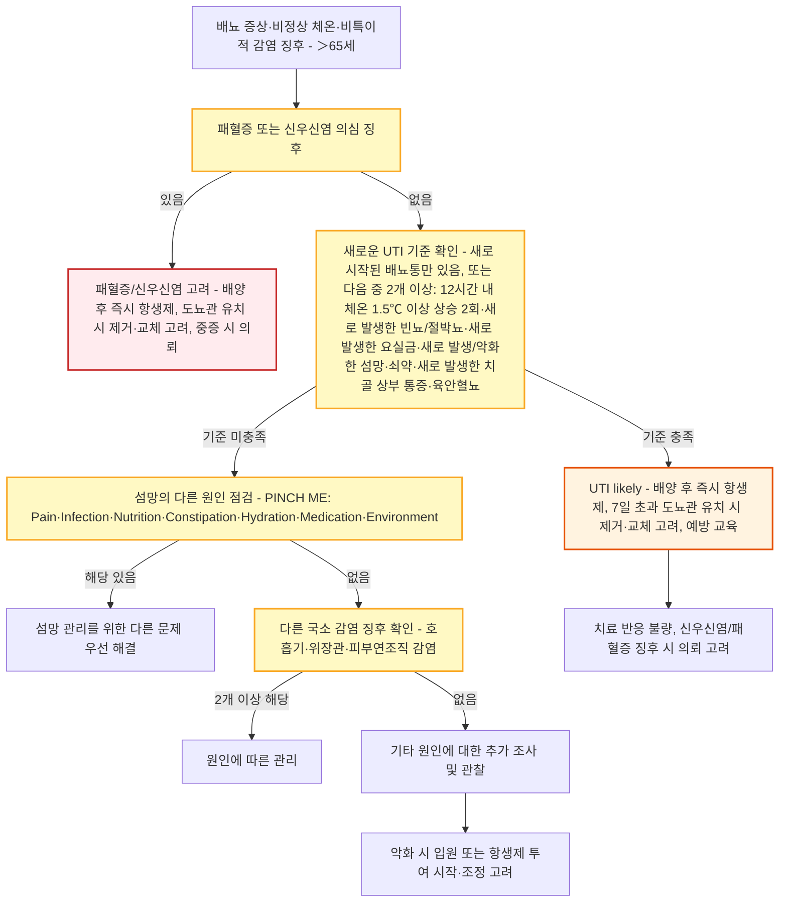
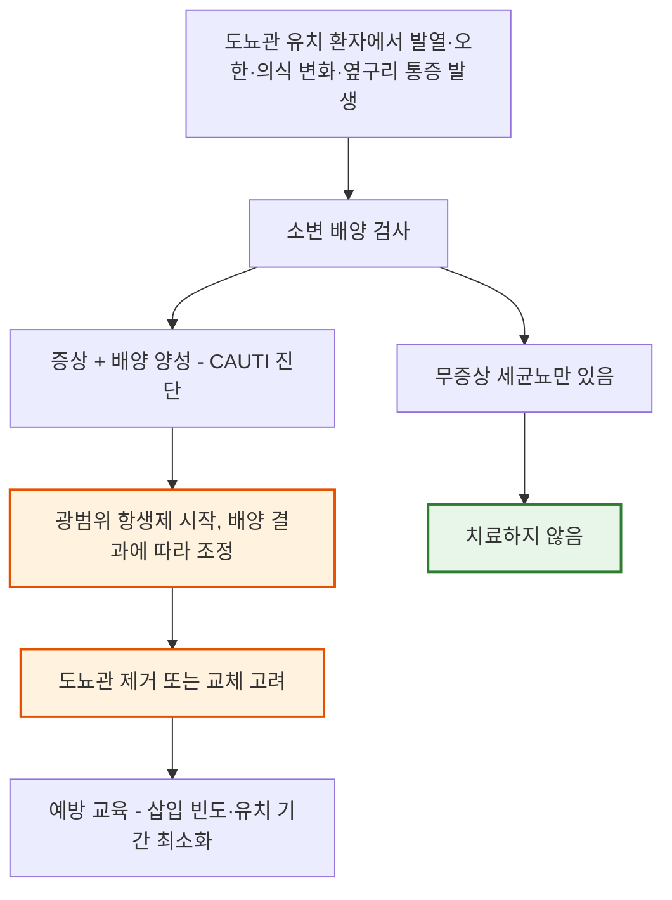
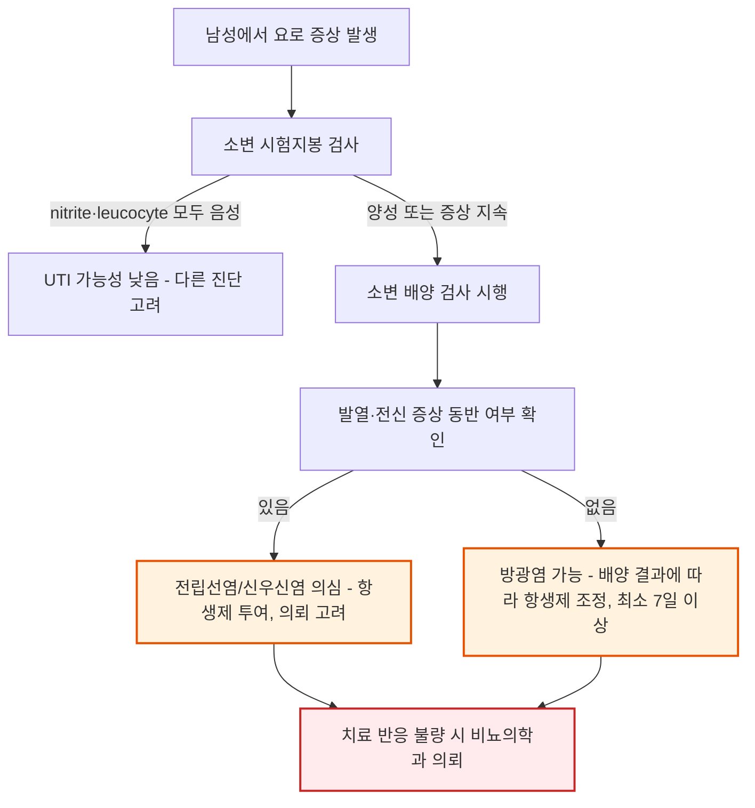
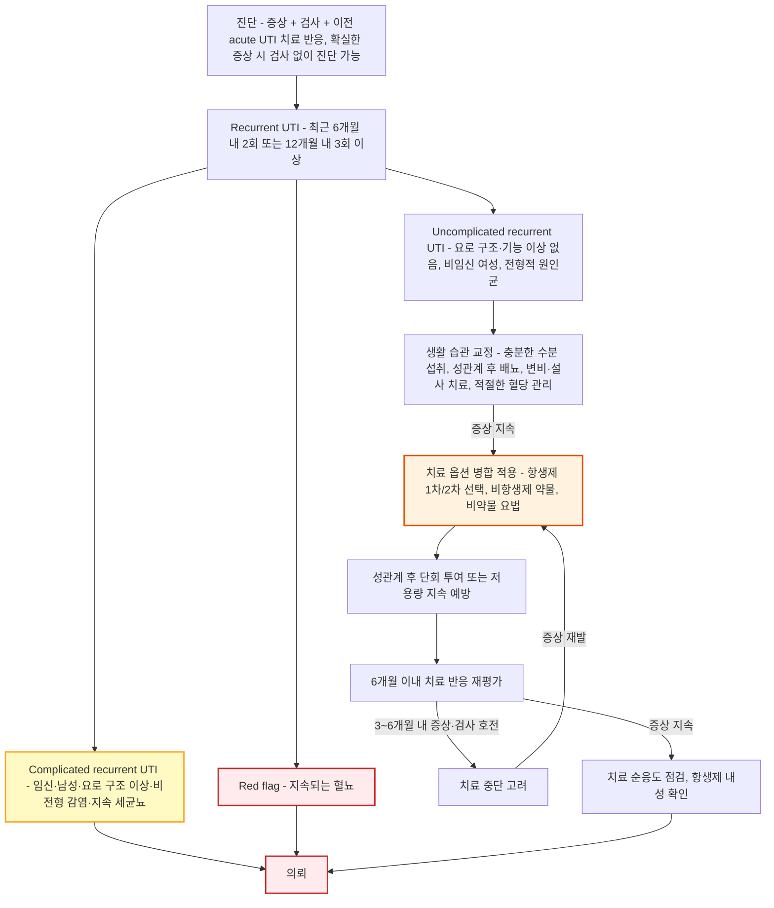

# 요로 감염 Urinary Tract Infection

## <mark style="color:green;">일반 사항</mark>

* 신장, 요관, 방광, 요도 등 요로의 세균 감염
* 분류 : 신우신염, 방광염, 전립선염, 요도염, 무증상 세균뇨
* 발생률 : 연간 여성의 12.6%, 남성의 3%에서 발생; 재발·재감염이 흔함 (☞ [재발](113_-urinary-tract-infection.md#uti-3))
  * 전체 여성의 ½이 일생 동안 1회 이상의 UTI를 경험

### <mark style="color:orange;">전통적 분류</mark>

* Uncomplicated UTI : 요로 폐쇄가 없고 도뇨관 삽입 등의 요로 조작 병력이 없는 일반적인 사람에서 발생한, 하부 요로에 국한된 감염 및 증상; 보통 적절한 항생제 치료에 반응함
* Complicated UTI : 해부학적·기능적 이상, 면역 저하 등 치료 실패 위험 인자가 있는 환자에서 발생한 요로 감염; 신우신염 자체가 곧 complicated를 의미하는 것은 아님 - 예를 들어 요로 이상이 없는 젊은 여성의 급성 신우신염은 uncomplicated pyelonephritis로 분류되며, 위험 인자 유무로 판단함
* Recurrent UTI(rUTI) : 6개월 동안 2회 또는 12개월 내 3회 이상 증상이 있는 UTI가 발생; 대부분 재감염에 의함
* Asymptomatic bacteriuria(ASB) : 요로 감염을 시사하는 증상 없이 유의한 세균뇨가 존재하는 상태; 농뇨가 동반될 수도 있으나 진단 기준은 아님


**EAU 2025\~2026 새로운 UTI 분류 체계** : European Association of Urology 요로 감염 지침은 2025년부터 "uncomplicated/complicated" 대신 임상 징후 중심의 "localized(국소형)/systemic(전신형)" UTI 분류를 도입함; 전신 감염 징후(발열, 오한, 옆구리 통증, 전신 증상) 유무로 치료 강도를 결정하는 것이 핵심 취지임. 다만 1차 진료 현장에서는 전통적 분류가 여전히 널리 쓰이고 있어, 본 챕터는 전통적 분류를 기본으로 서술하였음


## <mark style="color:green;">원인</mark>

* 감염 경로 : 회음부 분변 균주의 상향 이동(대부분), 혈행성(간혹)
* 원인균 : _E. coli_(uncomplicated cystitis의 80% 차지), _S. saprophyticus_, _Klebsiella_, _Proteus_, _Enterobacter_, _Pseudomonas_, _Candida_(장기간 도뇨관 유치, 면역 저하, 광범위 항생제 사용, 병원 내 감염에서 흔함)

### <mark style="color:orange;">위험 인자</mark>

* UTI 과거력 (특히 15세 이전 발생)
* 요로 감염 가족력
* 여성, 임신, estrogen 결핍 (폐경)
* ＞50세인 남성
* 수분 섭취 부족 (특히 재발성 UTI)
* 당뇨병, 비만, 면역 저하
* 최근 항생제 사용
* 도뇨관 유치, 최근 비뇨기계 수술 병력
* 복잡한/빈번한 성관계, 살정자제/diaphragm 사용, 불결한 위생
* 요로 이상 : 종양, 결석, 협착, 방광류, 잔뇨, 요실금, 신경인성 방광, BPH, 포경

### <mark style="color:orange;">Complicated UTI 관련 인자</mark>

* 면역 저하
* 다제약물 내성 세균 감염
* 소아 요로 감염력
* 임신, 사춘기 또는 폐경기
* 당뇨병 등 대사 질환 동반
* 요로의 해부학적 또는 기능적 이상. 예) 결석, 스텐트, 도뇨관 유치, 신경원성 방광, 다낭신장병

## <mark style="color:green;">임상 양상</mark>

* 상부 UTI 증상: 발열/늑골 척추각 압통
* 하부 UTI 증상 : 배뇨통, 치골 상부 압통, 혈뇨, 빈뇨, 야뇨, 절박뇨, 잔뇨감, 요실금, 요도 통증, 하복부 통증, 요통, 성교통
* 혈뇨, 소변 악취
* 인지 장애가 있는 환자들은 증상 호소가 정확하지 않을 수 있음을 주의; 고령자에서는 국소 증상 없이 섬망·전신 쇠약만으로 나타날 수 있음 (☞ ＞65세 알고리듬)

### <mark style="color:$danger;">🚩 Red Flags!</mark>

<mark style="color:$danger;">**즉각 조치 또는 의뢰**</mark>

* qSOFA ≥2, NEWS2 고위험군, 저혈압·빈맥·빈호흡·의식 저하를 동반한 발열) → 패혈증
* 결석에 의한 폐쇄성 신우신염) → 신우신염 + 요로 폐쇄
* 급성 요폐 또는 무뇨 동반
* 항암 치료 중, 이식 후, 호중구감소증 등면역 저하 상태에서의 발열성 UTI

<mark style="color:$warning;">**당일 또는 조기 의뢰**</mark>

* 옆구리 통증, 늑골척추각 압통, 발열/오한, 오심·구토)가 있으나 패혈증 징후는 없는 경우 → 신우신염 (당일 소변 배양 후 항생제 투여, 48\~72시간 내 반응 확인)
* 임신 중 UTI (무증상 세균뇨 포함)
* 남성의 UTI 의심
* 도뇨관 유치 환자에서 새로 발생한 발열, 의식 변화, 옆구리 통증
* 요로 결석·협착 등 폐쇄 소견이 의심되나 응급 징후는 없는 경우

<mark style="color:$info;">**외래 추적 / 추가 평가 계획**</mark> <mark style="color:$info;">- 즉각 위험 낮으나 호전 없으면 의뢰</mark>

* 48\~72시간의 적절한 항균제 치료에도 호전 없음
* 재발성 UTI (6개월 내 ≥2회 또는 12개월 내 ≥3회)
* 무증상 세균뇨 (비임신, 시술 예정 없는 대상)
* 치료 후에도 지속되거나 재발하는 육안적 혈뇨(특히 ＞45세)

## <mark style="color:green;">진단</mark>

* 여성에서 전형적인 하부 UTI 증상을 보이는 경우에는 검사 없이 진단 가능
* 재발의 경우 과거 acute UTI에서의 항생제 치료에 대한 반응 참조
* 소변 검사
* 영상 검사
* 요도염이 의심되는 경우 임질·클라미디아 검사가 핵심; HIV, 매독, HBV, HCV는 고위험 노출력이 있는 경우에 한해 선별

### <mark style="color:orange;">소변 검사</mark>

* U/A : 세균뇨, 농뇨(WBC ≥10/HPF), 혈뇨(RBC ≥5/HPF)
* 시험지봉 검사 : leukocyte esterase & nitrite(+)
* 배양 검사 : 다음의 경우에 고려 - 불확실한 진단, 신우신염 의심, 재발, 내성균 의심, 임신, 도뇨관 유치, 증상이 있는 ＞65세
  * 배양 검사는 반드시 항균제 투여 전에 시행해야 함
  * uncomplicated UTI에서 소변 배양 검사는 보통 유용하지 않음
  * 장기 요양 환자에서 비-국소적인 UTI 증상이 있는 경우 일률적인 소변 배양 검사는 권하지 않음

#### <mark style="color:$primary;">소변 배양 검사 UTI 진단 기준</mark>

* 결과는 증상과 비교하여 해석함; 불확실한 경우 재검
* 증상이 있는 환자는 무증상 세균뇨 선별 기준보다 낮은 균수에서도 진단 가능하며, 상황별 구체적 기준은 아래 표를 따름

<table><thead><tr><th width="332.3809814453125">임상 상황</th><th>진단 기준</th></tr></thead><tbody><tr><td>증상이 있는 여성</td><td>≥10² cfu/㎖</td></tr><tr><td>증상이 있는 남성</td><td>≥10³ cfu/㎖</td></tr><tr><td>도뇨관 유치(증상 동반)</td><td>≥10²~10³ cfu/㎖ (EAU ≥10², IDSA ≥10³)</td></tr><tr><td>무증상 세균뇨 선별 - 여성</td><td>2회 연속 배양에서 동일 균종 ≥10⁵ cfu/㎖</td></tr><tr><td>무증상 세균뇨 선별 - 남성 또는 도뇨관 채취</td><td>1회 배양에서 ≥10⁵ cfu/㎖</td></tr></tbody></table>

### <mark style="color:orange;">영상 검사</mark>

* 대상 : complicated UTI, 재발, 48\~72시간의 적절한 항균제 치료에 반응 안 함
* 초음파, IVP, 배뇨방광요도조영술, 방광경, CT, MRI

### <mark style="color:orange;">감별</mark>

<table data-search="false"><thead><tr><th width="340.4761962890625">동반 소견</th><th>시사 질환</th></tr></thead><tbody><tr><td>혼탁뇨, 발열 또는 요통</td><td>신우신염</td></tr><tr><td>허리 또는 서혜부의 심한 통증</td><td>요로 결석</td></tr><tr><td>고환 밑 통증</td><td>전립선염</td></tr><tr><td>요도 끝 분비물(남성)</td><td>요도염</td></tr><tr><td>물을 많이 마심 + 체중 감소</td><td>당뇨병</td></tr><tr><td>체중 감소 없는 다뇨</td><td>과다 수분 섭취, 추위, 카페인, 음주, 약물</td></tr><tr><td>절박뇨 + 실제 1회 배뇨량은 적음</td><td>방광염, 요로 결석</td></tr><tr><td>기침·재채기 후 소변 누출(여성)</td><td>긴장성 요실금</td></tr><tr><td>배뇨 후 소변이 새어나옴·몇 방울 떨어짐(남성)</td><td>전립선 비대</td></tr><tr><td>혈뇨</td><td>요로 결석, 방광염, 비뇨기계 외상, 종양, 출혈성 질환</td></tr></tbody></table>

***


```mermaid
graph TD
    A["요로 증상 및 징후 - 비임신 여성, ＜65세"] --> B["질 분비물·요도염-성관계 후·STI 병력·폐경비뇨생식증후군 확인"]
    B -->|해당 있음| B1["관련 질환에 따라 관리"]
    B -->|없음| C["패혈증 또는 신우신염 의심 징후"]
    C -->|있음| C1["신우신염/패혈증 고려 - 배양 후 즉시 항생제, 중증 시 의뢰"]
    C -->|없음| D["전형 증상 개수 확인 - 배뇨통·새로 발생한 야뇨·혼탁뇨"]
    D --> E["2~3개 해당 - UTI likely"]
    D --> F["1개 또는 0개 해당"]
    F --> G["추가 증상 확인 - 절박뇨·빈뇨·육안혈뇨·치골 상부 압통"]
    G -->|없음| H["UTI less likely - 다른 진단 고려"]
    G -->|있음| I["소변 시험지봉 검사"]
    I --> J["nitrite 양성 또는 WBC·RBC 동시 양성 - UTI likely"]
    I --> K["nitrite 음성, WBC 양성 - UTI 가능성 1/2, 재검 및 배양"]
    I --> L["모두 음성 - UTI less likely"]
    E --> M["항생제 내성 위험 시 배양 검사, 경증은 관찰 또는 항생제 고려"]
    J --> M
    K --> N["증상에 따라 항생제 고려"]
    M --> O["모든 환자에게 요로 감염 예방 자가 관리 교육"]
    H --> O
    L --> O
    N --> O

    style C1 fill:#ffebee,stroke:#c62828,stroke-width:2px
    style D fill:#fff9c4,stroke:#f9a825,stroke-width:2px
    style F fill:#fff9c4,stroke:#f9a825,stroke-width:2px
    style G fill:#fff9c4,stroke:#f9a825,stroke-width:2px
    style I fill:#fff9c4,stroke:#f9a825,stroke-width:2px
    style E fill:#fff3e0,stroke:#e65100,stroke-width:2px
    style J fill:#fff3e0,stroke:#e65100,stroke-width:2px
    style H fill:#e8f5e9,stroke:#2e7d32,stroke-width:2px
    style L fill:#e8f5e9,stroke:#2e7d32,stroke-width:2px
```

<p align="center"><strong>UTI가 의심되는 ＜65세, 비임신 여성에서의 진단 및 관리 알고리듬</strong></p>

<p align="center"><em><mark style="color:$info;">Ref. Diagnosis of urinary tract infections. NICE, 2020.</mark></em></p>

***


```mermaid
graph TD
    A["배뇨 증상·비정상 체온·비특이적 감염 징후 - ＞65세"] --> B["패혈증 또는 신우신염 의심 징후"]
    B -->|있음| B1["패혈증/신우신염 고려 - 배양 후 즉시 항생제, 도뇨관 유치 시 제거·교체 고려, 중증 시 의뢰"]
    B -->|없음| C["새로운 UTI 기준 확인 - 새로 시작된 배뇨통만 있음, 또는 다음 중 2개 이상: 12시간 내 체온 1.5℃ 이상 상승 2회·새로 발생한 빈뇨/절박뇨·새로 발생한 요실금·새로 발생/악화한 섬망·쇠약·새로 발생한 치골 상부 통증·육안혈뇨"]
    C -->|기준 충족| D["UTI likely - 배양 후 즉시 항생제, 7일 초과 도뇨관 유치 시 제거·교체 고려, 예방 교육"]
    C -->|기준 미충족| E["섬망의 다른 원인 점검 - PINCH ME: Pain·Infection·Nutrition·Constipation·Hydration·Medication·Environment"]
    E -->|해당 있음| E1["섬망 관리를 위한 다른 문제 우선 해결"]
    E -->|없음| F["다른 국소 감염 징후 확인 - 호흡기·위장관·피부연조직 감염"]
    F -->|2개 이상 해당| F1["원인에 따른 관리"]
    F -->|없음| G["기타 원인에 대한 추가 조사 및 관찰"]
    D --> H["치료 반응 불량, 신우신염/패혈증 징후 시 의뢰 고려"]
    G --> I["악화 시 입원 또는 항생제 투여 시작·조정 고려"]

    style B fill:#fff9c4,stroke:#f9a825,stroke-width:2px
    style C fill:#fff9c4,stroke:#f9a825,stroke-width:2px
    style E fill:#fff9c4,stroke:#f9a825,stroke-width:2px
    style F fill:#fff9c4,stroke:#f9a825,stroke-width:2px
    style B1 fill:#ffebee,stroke:#c62828,stroke-width:2px
    style D fill:#fff3e0,stroke:#e65100,stroke-width:2px
```

<p align="center"><strong>UTI가 의심되는 ＞65세에서의 진단 및 관리 알고리듬</strong></p>

<p align="center"><em><mark style="color:$info;">Ref. Diagnosis of urinary tract infections. NICE, 2020.</mark></em> </p>

<p align="center"><em><mark style="color:$info;">발열과 섬망/쇠약만 있는 경우 UTI 치료 전 다른 원인을 먼저 고려;</mark></em> <br><em><mark style="color:$info;">시험지봉 검사는 고령에서 신뢰도가 낮으므로 권고되지 않음</mark></em></p>

***

## <mark style="background-color:$warning;">Management</mark>


본 챕터는 UTI의 개념·위험 인자·진단 원칙과 특수 상황(당뇨병, 도뇨관 유치, 남성, 재발성 UTI)의 관리 및 재발 예방에 초점을 둠 (급성 방광염, 급성 신우신염, 요도염, 전립선염, 무증상 세균뇨의 상세 항생제 처방은 각 질환별 챕터 참조)



**Delayed antibiotic prescription (EAU 2025)** : 경증의 uncomplicated cystitis에서는 즉시 항생제 처방 대신, 24\~48시간 지연 처방(증상이 지속·악화될 때만 조제) 또는 진통제 등을 이용한 대증 치료 후 경과 관찰을 환자와의 공유 의사 결정을 거쳐 선택할 수 있음; 항생제 사용량 감소가 목적이며, 신우신염 의심 징후나 위험 인자가 있는 경우에는 적용하지 않음. 구체적 적용 기준과 처방은 급성 방광염 챕터 참조


### <mark style="color:orange;">당뇨병 환자에서의 UTI</mark>

* 비-당뇨병 환자와 같은 증상; 발열이 보다 흔함
* 신우신염, 양측 침범이 더 흔함
* 신농양, emphysematous cystitis, 중증 패혈증 등의 가능성이 큼
* 진단 : 비-당뇨병 환자와 동일. 영상 검사 고려
* 치료 기간은 감염 부위와 중증도에 따라 일반 환자와 동일하게 결정하며, 당뇨병 자체가 치료 기간 연장의 근거는 아님; complicated UTI에 해당하는 경우 연장이 필요할 수 있음

### <mark style="color:orange;">도뇨관 유치 환자에서의 UTI (CAUTI, Catheter-Associated UTI)</mark>

#### <mark style="color:$primary;">임상 양상</mark>

* 새로 발생하거나 악화되는 발열, 오한, 의식 변화, 전신 권태, 원인 모르는 기면
* 옆구리 통증, 늑골척추각 압통, 골반 통증, 급성 혈뇨
* 도뇨관이 제거된 환자의 배뇨 곤란, 빈뇨, 절박뇨, 치골위 통증

#### <mark style="color:$primary;">진단</mark>

* 배양 검사 : 도뇨관 유치 중 또는 제거 후 48시간 이내의 청결 채취 소변에서 1회 이상 ≥10²\~10³ cfu/㎖ (EAU 기준 ≥10², IDSA 기준 ≥10³ - 학회별 기준에 차이가 있음)
* 무증상 세균뇨만으로는 CAUTI를 진단하지 않으며, 치료도 권고하지 않음(CDC/IDSA)

#### <mark style="color:$primary;">치료</mark>

* UTI 증상이 있는 경우 광범위 항생제 투여 및 배양 검사 결과에 따라 조정
* 요로 감염 의심 또는 관리 문제가 있는 경우 도뇨관 제거 또는 교환
* 도뇨관 삽입 빈도 및 유치 기간을 줄임
* 방광 세척 : 권고 안 함; 세척을 통한 예방 효과가 없으며 자극 증상 등 부작용 가능성이 있어 도뇨관의 폐쇄가 있지 않는 한 권하지 않음
* 예방적 항균 요법 : 도뇨관 유치 환자에서 권하지 않음 (효과는 불분명하고 내성 문제 등 발생)


```mermaid
graph TD
    A["도뇨관 유치 환자에서 발열·오한·의식 변화·옆구리 통증 발생"] --> B["소변 배양 검사"]
    B --> C["증상 + 배양 양성 - CAUTI 진단"]
    B --> G["무증상 세균뇨만 있음"]
    C --> D["광범위 항생제 시작, 배양 결과에 따라 조정"]
    D --> E["도뇨관 제거 또는 교체 고려"]
    E --> F["예방 교육 - 삽입 빈도·유치 기간 최소화"]
    G --> H["치료하지 않음"]

    style D fill:#fff3e0,stroke:#e65100,stroke-width:2px
    style E fill:#fff3e0,stroke:#e65100,stroke-width:2px
    style H fill:#e8f5e9,stroke:#2e7d32,stroke-width:2px
```

<p align="center"><em><mark style="color:$info;">핵심 : 무증상 세균뇨는 치료하지 않음이 원칙이며, 예방적 항균 요법·방광 세척은 권고되지 않음</mark></em></p>

### <mark style="color:orange;">남성에서의 UTI</mark>

* 시험지봉 검사로 감염을 배제하는 것이 어려움
* 증상이 가볍고 nitrite 및 leucocyte 모두 (-) 시 UTI 가능성은 낮음
* UTI 의심 시 배양 검사 후 항생제 투여를 시작하고 배양 검사 결과에 따라 조정
* 발열이나 전신 증상이 있는 요로 증상 시 전립선 이환 또는 신우신염 의심
* 남성에서 재발성 UTI는 드묾; 남성의 재발성 UTI는 의뢰를 고려
* 첫 UTI라도 전립선 침범 가능성을 항상 고려할 것
* 여성에서 흔히 쓰이는 3일 단기 요법(예: TMP/SMX 3일)을 남성에게 그대로 적용해서는 안 되며, 최소 7일 이상의 치료 기간이 필요함

- [ ] EAU 2025 분류에서는 전립선 침범·기타 위험 인자가 없는 남성의 방광염을 "localized UTI(국소형)"으로 다룰 수 있다고 제안하지만 전립선 침범을 배제하기 어려워 실제로는 여전히 신중한 접근이 권고됨 (배양 검사 선행, 7일 이상 치료)


```mermaid
graph TD
    A["남성에서 요로 증상 발생"] --> B["소변 시험지봉 검사"]
    B -->|nitrite·leucocyte 모두 음성| C["UTI 가능성 낮음 - 다른 진단 고려"]
    B -->|양성 또는 증상 지속| D["소변 배양 검사 시행"]
    D --> E["발열·전신 증상 동반 여부 확인"]
    E -->|있음| F["전립선염/신우신염 의심 - 항생제 투여, 의뢰 고려"]
    E -->|없음| G["방광염 가능 - 배양 결과에 따라 항생제 조정, 최소 7일 이상"]
    F --> H["치료 반응 불량 시 비뇨의학과 의뢰"]
    G --> H

    style F fill:#fff3e0,stroke:#e65100,stroke-width:2px
    style G fill:#fff3e0,stroke:#e65100,stroke-width:2px
    style H fill:#ffebee,stroke:#c62828,stroke-width:2px
```

<p align="center"><em><mark style="color:$info;">핵심 : 남성은 첫 UTI라도 전립선 침범 가능성을 항상 고려해야 하며, 배양 검사 선행이 필수임</mark></em></p>

### <mark style="color:orange;">재발성 UTI</mark>

* 정의 : 6개월 동안 ≥2회 또는 12개월 동안 ≥3회 발생
* 여성에서 흔함; 첫 UTI 여성의 약 25\~30%가 6\~12개월 내 재발함
* 적절히 치료하지 않으면 신장 손상이 유발될 수 있음

#### <mark style="color:$primary;">의뢰가 필요한 재발성 UTI</mark>

* 임신
* 남성
* 재발 또는 중증 신우신염
* 내성 세균 감염
* 요로의 구조 또는 기능 이상과 관련
* 비전형 감염(예: tuberculosis, schistosomiasis) 관련
* 증상이 있는 도뇨관 유치 환자
* 약물/질환에 의한 면역 저하 상태
* 핍뇨 상태의 만성 신부전
* 반복 또는 지속되는 설명할 수 없는 UTI 증상(특히 ≥60세)
* 성공적인 UTI 치료 후 지속 또는 재발되는 육안혈뇨(특히 ≥45세)
* 치료에 반응하지 않음
* 전신 질환, loin pain

#### <mark style="color:$primary;">평가(여성)</mark>

* 병력 청취, 골반 진찰
* 이전의 소변 배양 검사 결과 확인
* 소변 검체의 오염이 의심될 때에는 다시 채취하여 검사해야 하며 도뇨관 이용을 고려함
* 다른 문제가 없는 rUTI 여성 환자에서 일률적인 방광경 및 상부 요로 영상 검사는 권고 안 함
* rUTI 환자에서 증상이 있는 급성 방광염 episode가 발생할 때마다 치료 시작 전 U/A, 소변 배양 및 감수성 검사를 시행하며, 소변 배양 검사 진행 중 치료를 시작할 수 있음

#### <mark style="color:$primary;">Uncomplicated infection 치료</mark>

* nitrofurantoin 5일, TMP/SMX 3일, fosfomycin 1회 (해당 질환 챕터 참조)


```mermaid
graph TD
    A["진단 - 증상 + 검사 + 이전 acute UTI 치료 반응, 확실한 증상 시 검사 없이 진단 가능"] --> B["Recurrent UTI - 최근 6개월 내 2회 또는 12개월 내 3회 이상"]
    B --> C["Uncomplicated recurrent UTI - 요로 구조·기능 이상 없음, 비임신 여성, 전형적 원인균"]
    B --> D["Complicated recurrent UTI - 임신·남성·요로 구조 이상·비전형 감염·지속 세균뇨"]
    B --> E["Red flag - 지속되는 혈뇨"]
    D --> F["의뢰"]
    E --> F
    C --> G["생활 습관 교정 - 충분한 수분 섭취, 성관계 후 배뇨, 변비·설사 치료, 적절한 혈당 관리"]
    G -->|증상 지속| H["치료 옵션 병합 적용 - 항생제 1차/2차 선택, 비항생제 약물, 비약물 요법"]
    H --> I["성관계 후 단회 투여 또는 저용량 지속 예방"]
    I --> J["6개월 이내 치료 반응 재평가"]
    J -->|3~6개월 내 증상·검사 호전| K["치료 중단 고려"]
    J -->|증상 지속| L["치료 순응도 점검, 항생제 내성 확인"]
    K -->|증상 재발| H
    L --> F

    style D fill:#fff9c4,stroke:#f9a825,stroke-width:2px
    style E fill:#ffebee,stroke:#c62828,stroke-width:2px
    style F fill:#ffebee,stroke:#c62828,stroke-width:2px
    style H fill:#fff3e0,stroke:#e65100,stroke-width:2px
```

<p align="center"><strong>재발성 UTI 환자의 진단 및 관리</strong></p>

<p align="center"><em><mark style="color:$info;">Ref. The diagnosis and management of uncomplicated recurrent urinary tract infection. NICE, 2018 Fig 1.</mark></em></p>

***

## <mark style="color:green;">비-약물 치료 및 예방</mark>

* 충분한 수분 섭취 (＞1.5 L/d)
* 방광을 자주 완전히 비움, 과도하게 소변을 참지 않음
* 성관계 전/후 배뇨
* 조이는 옷 회피
* 남성에서 청결한 포피 세척
* 당뇨병, 변비, 설사 등 기저 질환 관리
* 거품 목욕 회피
* 배변 후 앞에서 뒤로 닦음; 비데는 과도한 수압이나 불결한 노즐 사용을 피하도록 교육
* 여성에서 성관계 시 질이 건조한 경우 윤활제 사용
* 재발 시 살정자제/diaphragm 사용 회피

***

## <mark style="color:green;">약물 치료</mark>

> ☞ 무증상 세균뇨, 요도염, 급성 방광염, 급성 신우신염, 전립선염의 항생제 처방은 각 질환별 챕터 참조

### <mark style="color:orange;">재발성 UTI의 예방적 약물 요법</mark>

* 이익-위험 및 다른 대안에 대하여 검토한 후 향후 UTI 위험을 줄이기 위하여 예방적 항생제를 투여할 수 있음
* 투여 전 결석, 역류, 누관 등 해부학적 이상 감별을 요함
* 6개월 시도에서 UTI 빈도에 유의미한 감소가 없으면 실패로 판정

#### <mark style="color:$primary;">비-항생제 예방 약물</mark>

* estrogen : 폐경 여성에 대하여 금기가 아닌 경우 estrogen 질 크림 고려. 항생제 예방 투여에 앞서 고려; 0.5 g 취침 전 ×2주, 이후 2회/주
  * 국소 질 estrogen은 재발성 UTI 예방 효과가 있으나, 전신 estrogen 요법은 UTI 예방 목적으로는 권고되지 않음(EAU)
* methenamine hippurate : 소변 산성화 및 직접적인 항균 작용 추정; 1 g bid, 6개월 사용 후 검토
  * 통풍, 중증 신/간 장애, 탈수 시 금기; 3개월마다 간 기능 검사
  * ALTAR 무작위 비열등성 시험(BMJ, 2022)에서 저용량 지속 항생제 예방 요법과 비교하여 UTI 재발 방지에 비열등한 결과를 보임; 항생제 사용을 줄이려는 환자에서 대안으로 고려 가능
  * Vitamin C 병용은 최근 EAU/AUA 지침에서 권고되지 않음(methenamine 단독으로 충분)
* 면역조절 백신(OM-89/경구, MV140/설하) : EAU 2025 지침에서 재발성 UTI에 대한 근거가 갱신됨(중등도 수준의 근거로 조건부 권고); 2026년 현재 국내 미도입 상태로 처방 불가

#### <mark style="color:$primary;">영양 요법</mark>

* d-mannose : 과거 일부 소규모 연구에서 유효성이 보고되었으나, 이후 대규모 위약-대조 연구에서 효과가 확인되지 않음(MERIT 시험, JAMA Intern Med 2024 — 영국 1차 진료 재발성 UTI 여성 598명 대상, 위약 대비 UTI 재발 감소 효과 없음); 현재는 예방 목적의 사용을 권장하지 않음
* cranberry : 유효 성분 - proanthocyanidin(PAC); fimbriae를 통한 urothelial cell 부착을 억제하는 것이 주 기전(소변 산성화 효과는 인정되지 않음). 비임신 여성의 재발성 요로 감염 감소에 대한 보고들이 있으나 효과 크기는 불명확하며, 조건부 권고(conditional recommendation) 수준임; 용량-효과 관계도 불명확하고 도뇨관 유치·고령자에서는 효과가 확인되지 않음; warfarin에 영향을 줄 수 있음
* probiotics(경구 lactobacilli 단독) : EAU 2025 지침 기준으로도 위약 대비 우월성이 확인되지 않아 단독 요법으로는 권장하지 않음

#### <mark style="color:$primary;">1회 투여 요법(성관계 후)</mark>

* 다른 인자 없이 성관계가 유일한 유발 인자인 경우 유용; 달리기, 사이클 선수 등에서도 적용할 수 있음
* 성관계 후 2시간 내 투여
* 3개월 간 감염이 없으면 중단, 재발 반복 시 재개

#### <mark style="color:$primary;">저용량 지속 투여 요법</mark>

* 1회 복용 항생제 요법의 ½ 용량을 매일 야간에 투여
* 3\~6개월간 지속 투여 후 중단, 재발 반복 시 재개; 단발적 UTI 때는 재개하지 않음
* 한계 : 투여 기간 동안에만 예방 효과가 있음
* 항생제 예방 투여 중 UTI 발생 시 : 예방 요법 중단 및 소변 배양 검사/항생제 내성 검사, 다른 약제로 acute UTI 치료 → 내성이 발생하지 않았다면 기존 예방 요법제로 재투여할 수 있음

#### <mark style="color:$primary;">약제 및 용량</mark>

* 1차 선택 \[NICE]
  * trimethoprim : \[노출 후 1회] 200 ㎎; \[지속] 100 ㎎ 야간 \[셉트린]
  * nitrofurantoin : \[노출 후 1회] 100 ㎎; \[지속] 50\~100 ㎎ 야간
* 2차 선택제
  * amoxicillin : \[노출 후 1회] 500 ㎎; \[지속] 250 ㎎ 야간 \[파목신]
  * cephalexin : \[노출 후 1회] 500 ㎎; \[지속] 125 ㎎ 야간 \[팔렉신]


**⚠️ 니트로푸란토인 장기 예방 투여 시 주의**\
니트로푸란토인을 6개월 이상 장기 연속 투여하는 경우 폐 독성(간질성 폐질환·폐섬유증) 및 간 독성의 위험이 보고되어 있음; 장기 예방 목적으로 사용할 때는 주기적인 간 기능 검사와 호흡기 증상 모니터링이 필요함



**⚠️ 플루오로퀴놀론계 사용 제한**\
플루오로퀴놀론은 심각한 비가역적 부작용(건 파열, 말초신경병증, 대동맥류·박리 위험 등)의 우려가 있어, 단순 요로 감염에서는 이득보다 위해가 커 1차 치료 및 예방적 요법으로 권고되지 않음; 다만 다제내성균 감염 등 다른 적절한 대체 약제가 없는 예외적 상황에서는 제한적으로 사용을 고려할 수 있음


***

### <mark style="color:red;">질병코드</mark>

N39.0 부위가 명시되지 않은 요로감염

(급성 방광염·급성 신우신염·요도염·전립선염 등 개별 질환의 질병코드는 각 질환별 챕터 참조)

***

## <mark style="color:purple;">처방례</mark>

> **처방례 1. 성관계 유발 재발성 방광염 - 성관계 후 1회 예방 투여**
>
> ```
> 니트로푸란토인 100 ㎎/캡슐  1캡슐  성관계 후 2시간 이내 1회
> ```
>
> _✽ 성관계가 유일한 확인된 유발 인자인 경우에 적합; 3개월간 재발이 없으면 중단, 재발 반복 시 재개_

> **처방례 2. 저용량 지속 예방 요법**
>
> ```
> 트리메토프림 100 ㎎/정  1정  취침 전 (야간 1회)
> ```
>
> _✽ 3\~6개월 지속 투여 후 중단 시도; 재발 반복 시 재개. 6개월 시도 후에도 UTI 빈도 감소가 없으면 실패로 판정하고 대안(estrogen, methenamine 등)을 검토_

> **처방례 3. 폐경 후 재발성 방광염 - estrogen 질 크림 병용**
>
> ```
> estrogen 질 크림 0.5 g  취침 전  ×2주, 이후 주 2회
> ```
>
> _✽ 폐경비뇨생식증후군(vulvovaginal atrophy)이 동반된 경우 항생제 예방 투여에 앞서 우선 고려; 금기(예: 유방암 병력) 여부 확인 필요_

> **처방례 4. 항생제 사용을 최소화하고 싶은 재발성 UTI - methenamine 병용**
>
> ```
> methenamine hippurate 1 g/정  1정  bid
> ```
>
> _✽ 6개월 사용 후 재평가; 통풍, 중증 신·간 장애, 탈수 시 금기이며 3개월마다 간 기능 검사 시행. ALTAR 시험(BMJ 2022)에서 저용량 지속 항생제 예방과 UTI 재발 방지 효과가 비열등함이 확인됨. Vitamin C 병용은 최근 지침에서 권고되지 않아 생략함_

***

### <mark style="color:$success;">핵심 복약 지도</mark>

> **예방적 항생제, 왜 정해진 방식대로 복용해야 하나요?**
>
> 1. 성관계 후 1회 요법과 매일 저용량 지속 요법 중 환자의 생활 패턴에 맞는 방법을 선택함
> 2. 지속 요법은 복용 중에만 예방 효과가 있으며, 임의로 중단하면 예방 효과가 즉시 사라짐
> 3. 3\~6개월 사용 후 재발이 없으면 중단을 시도해 볼 수 있음
> 4. 예방 요법 중 UTI 증상이 발생하면 예방약 복용을 중단하고 소변 배양 검사 후 다른 항생제로 급성기 치료를 시행함 - 내성이 확인되지 않았다면 이후 동일한 예방약으로 재개 가능

> **estrogen 질 크림을 함께 쓰는 이유**
>
> * 폐경 후 질·요도 점막 위축이 재발성 방광염의 주요 위험 인자이므로, 국소 estrogen으로 점막을 회복시키는 것이 항생제 예방보다 우선 고려될 수 있음을 설명
> * 전신 흡수가 적어 전신 호르몬 요법과는 부작용 프로파일이 다름을 안내

> **methenamine hippurate 사용 시 주의사항**
>
> * 소변을 산성화하여 항균 효과를 내므로 자몽 등 알칼리화 식품/제산제와의 병용은 효과를 줄일 수 있음을 안내
> * 통풍, 심한 신·간 기능 저하, 탈수 상태에서는 사용하지 않음

> **언제 다시 병원을 방문해야 하나요?**
>
> * 발열, 옆구리 통증, 오한이 동반되는 경우 - 즉시 내원(신우신염/패혈증 가능성)
> * 48\~72시간 항생제 치료 후에도 증상이 호전되지 않는 경우
> * 예방 요법 중에도 UTI 증상이 재발하는 경우
> * 치료 후에도 육안적 혈뇨가 지속되는 경우 - 즉시 내원

***

### <mark style="color:blue;">환자 안내서</mark>


**요로 감염, 흔하지만 대부분 잘 관리할 수 있습니다**\
방광염은 여성에서 매우 흔한 질환으로, 평생 한 번 이상 겪는 여성이 절반에 이릅니다. 원인과 생활 습관을 이해하면 재발을 상당히 줄일 수 있습니다.


#### <mark style="color:$primary;">왜 요로 감염이 생기나요?</mark>

* 대부분 대장에 있는 세균(대표적으로 대장균)이 요도를 통해 방광으로 거슬러 올라가면서 생깁니다.
* 여성은 요도가 짧고 항문과 가까워 남성보다 훨씬 잘 걸립니다.
* 성관계, 폐경으로 인한 점막 약화, 당뇨병, 수분 섭취 부족, 소변을 오래 참는 습관 등이 위험을 높입니다.

#### <mark style="color:$primary;">일상생활에서 어떻게 예방하나요?</mark>

* **하루 1.5리터 이상 물을 충분히 드십시오.** 소변으로 세균이 씻겨 나가는 데 도움이 됩니다.
* **소변을 오래 참지 말고 방광을 충분히 비우십시오.**
* **성관계 전후에는 소변을 보십시오.** 요도로 들어간 세균을 씻어내는 데 도움이 됩니다.
* **배변 후에는 앞에서 뒤로 닦으십시오.** 반대 방향으로 닦으면 세균이 요도 쪽으로 옮겨갈 수 있습니다.
* **비데 사용은 주의하십시오.** 오히려 외음부·요로 감염 위험을 높일 수 있습니다.
* **거품 목욕이나 몸에 꽉 끼는 옷은 피하십시오.**
* 당뇨병, 변비, 설사가 있다면 함께 관리하는 것이 재발 예방에 도움이 됩니다.

#### <mark style="color:$primary;">예방 약은 어떻게 복용하나요?</mark>

* 처방받은 예방적 항생제나 estrogen 질 크림은 의사가 안내한 기간과 방법대로 꾸준히 사용하십시오.
* 성관계 후 1회만 복용하는 방법인지, 매일 밤 복용하는 방법인지 확인하고 헷갈리지 않도록 하십시오.
* d-mannose나 유산균만으로는 재발 방지 효과가 충분히 입증되지 않았으므로, 이를 단독으로 믿고 처방된 예방 요법을 임의로 중단하지 마십시오.
* 항생제를 복용한다고 해서 증상이 바로 없어지지 않더라도, 처방받은 기간 동안은 임의로 중단하지 마십시오.

#### <mark style="color:$primary;">이럴 때는 즉시 병원을 방문하세요</mark>

* **고열, 옆구리 통증, 오한**이 함께 나타나는 경우
* 소변에 **피가 섞여 나오는 것이 지속**되는 경우
* 항생제를 복용해도 2\~3일 이상 증상이 호전되지 않는 경우
* 소변을 전혀 보지 못하는 경우
