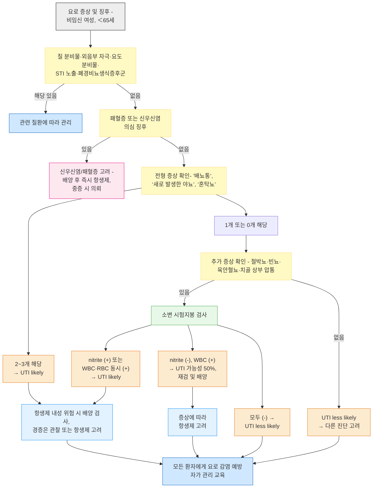
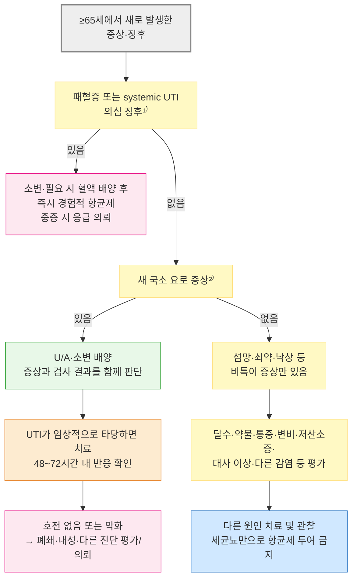
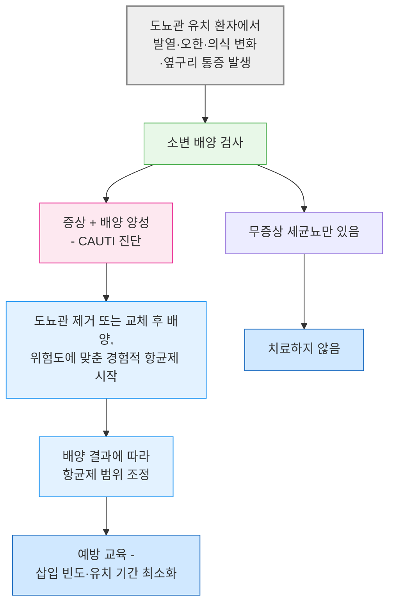
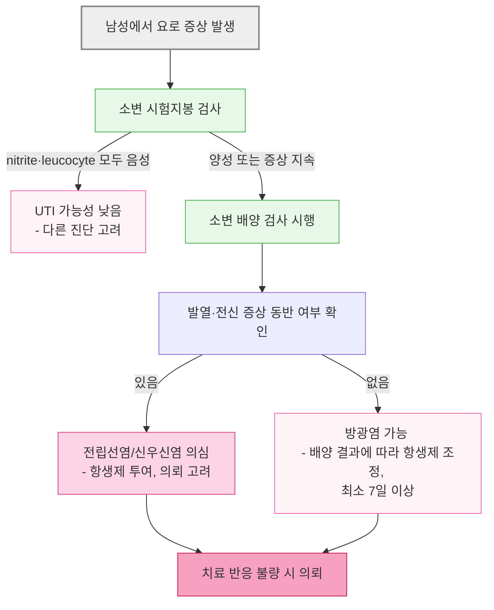
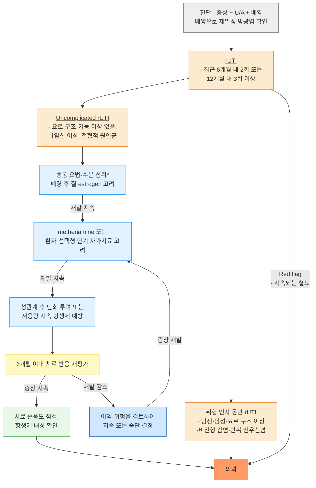

# 요로 감염 Urinary Tract Infection

## <mark style="color:green;">일반 사항</mark>

* 신장, 요관, 방광, 요도 등 요로의 세균 감염
* 분류 : 신우신염, 방광염, 전립선염, 요도염, 무증상 세균뇨
* 발생률은 연령·성별·연구 환경에 따라 차이가 크며 여성에서 훨씬 흔함; 재발·재감염이 흔함 (☞ [재발](113_-urinary-tract-infection.md#uti-3))
  * 전체 여성의 ½이 일생 동안 1회 이상의 UTI를 경험

### <mark style="color:orange;">전통적 분류</mark>

* Uncomplicated UTI : 전통적으로 요로의 구조·기능 이상이나 중대한 동반 질환이 없는 건강한 비임신 여성에서 발생한 UTI를 의미함
* Complicated UTI : 임신, 요로의 해부학적·기능적 이상, 도뇨관·최근 요로 조작, 면역 저하 등 치료 실패 또는 중증 경과 위험 인자가 있는 환자의 UTI를 의미함; 다만 정의가 지침마다 달라 임상 적용에 한계가 있음
* Recurrent UTI(rUTI) : 6개월 동안 2회 또는 12개월 내 3회 이상 증상이 있는 UTI가 발생; 대부분 재감염에 의함
* Asymptomatic bacteriuria(ASB) : 요로 감염을 시사하는 증상 없이 유의한 세균뇨가 존재하는 상태; 농뇨가 동반될 수도 있으나 진단 기준은 아님


**EAU 2025\~2026 새로운 UTI 분류 체계** : European Association of Urology 요로 감염 지침은 2025년부터 "uncomplicated/complicated" 대신 임상 징후 중심의 "localized(국소형)/systemic(전신형)" UTI 분류를 도입함; 전신 감염 징후(발열, 오한, 옆구리 통증, 전신 증상) 유무로 치료 강도를 결정하는 것이 핵심 취지임. 다만 1차 진료 현장에서는 전통적 분류가 여전히 널리 쓰이고 있어, 본 챕터는 전통적 분류를 기본으로 서술하였음


## <mark style="color:green;">원인</mark>

* 감염 경로 : 회음부 분변 균주의 상향 이동(대부분), 혈행성(간혹)
* 주요 세균 : _E. coli_(uncomplicated cystitis의 약 75\~95%), _S. saprophyticus_, _Klebsiella_, _Proteus_, _Enterobacter_, _Pseudomonas_
* _Candida_는 세균성 UTI와 구분되는 candiduria/진균성 UTI의 원인으로, 장기간 도뇨관 유치·면역 저하·광범위 항생제 사용·병원 내 감염에서 주로 고려함

### <mark style="color:orange;">위험 인자</mark>

* UTI 과거력 (특히 15세 이전 발생)
* 요로 감염 가족력
* 여성, 임신, estrogen 결핍 (폐경)
* 남성의 전립선비대·배뇨장애·잔뇨
* 수분 섭취 부족 (특히 재발성 UTI)
* 당뇨병, 비만, 면역 저하
* 최근 항생제 사용
* 도뇨관 유치, 최근 비뇨기계 수술 병력
* 빈번한 성관계, 새로운 성 파트너, 살정자제/diaphragm 사용
* 요로 이상 : 종양, 결석, 협착, 방광류, 잔뇨, 요실금, 신경인성 방광, BPH, 포경

### <mark style="color:orange;">Complicated UTI 관련 인자</mark>

* 면역 저하
* 내성균 감염 또는 최근 항생제 사용
* 임신
* 조절되지 않는 당뇨병, 신기능 저하 등 치료 실패 위험을 높이는 동반 질환
* 요로의 해부학적 또는 기능적 이상. 예) 결석, 스텐트, 도뇨관 유치, 신경원성 방광, 다낭신장병

## <mark style="color:green;">임상 양상</mark>

* 상부 UTI 증상: 발열/늑골 척추각 압통
* 하부 UTI 증상 : 배뇨통, 치골 상부 압통, 혈뇨, 빈뇨, 야뇨, 절박뇨, 잔뇨감, 요실금, 요도 통증, 하복부 통증, 요통, 성교통
* 혈뇨가 동반될 수 있음; 소변 악취·혼탁뇨만으로 UTI를 진단하거나 배양 검사를 시행하지 않음
* 인지 장애가 있는 환자는 증상 호소가 정확하지 않을 수 있음. 고령자에서 섬망·전신 쇠약이 나타날 수 있으나 UTI에 특이적이지 않으므로, 새로 발생한 국소 요로 증상이나 전신 감염 징후가 없다면 다른 원인을 우선 평가함 (☞ ≥65세 알고리듬)

### <mark style="color:$danger;">🚩 Red Flags!</mark>

<mark style="color:$danger;">**즉각 조치 또는 의뢰**</mark>

* 저혈압·빈맥·빈호흡·의식 저하, NEWS2 고위험군 또는 qSOFA ≥2 등 패혈증 고위험 신호(qSOFA 단독으로 패혈증을 진단하거나 배제하지 않음)
* 결석 등에 의한 폐쇄성 신우신염 의심
* 급성 요폐 또는 무뇨 동반
* 항암 치료 중, 이식 후, 호중구감소증 등 면역 저하 상태에서의 발열성 UTI

<mark style="color:$warning;">**당일~수일 내 평가**</mark>

* 옆구리 통증, 늑골척추각 압통, 발열/오한, 오심·구토가 있으나 패혈증 징후는 없는 경우 → 신우신염 (당일 소변 배양 후 항생제 투여, 48\~72시간 내 반응 확인)
* 임신 중 UTI (무증상 세균뇨 포함)
* 남성에서 발열·오한·회음부 통증·요폐 등 전립선염 또는 systemic UTI 의심
* 도뇨관 유치 환자에서 새로 발생한 발열, 의식 변화, 옆구리 통증
* 요로 결석·협착 등 폐쇄 소견이 의심되나 응급 징후는 없는 경우

<mark style="color:$info;">**조기 평가 및 추적**</mark> <mark style="color:$info;">- 즉각 위험은 낮으나 평가·추적 필요</mark>

* 48\~72시간의 적절한 항균제 치료에도 호전 없음
* 재발성 UTI (6개월 내 ≥2회 또는 12개월 내 ≥3회)
* 치료 후에도 지속되거나 재발하는 육안적 혈뇨(특히 ＞45세)

## <mark style="color:green;">진단</mark>

* 여성에서 전형적인 하부 UTI 증상을 보이는 경우에는 검사 없이 진단 가능
* 재발의 경우 과거 acute UTI에서의 항생제 치료에 대한 반응 참조
* 소변 검사
* 영상 검사
* 요도염이 의심되는 경우 임질·클라미디아 NAAT가 핵심이며, HIV·매독 등 동반 STI 검사는 요도염/STI 챕터의 기준에 따름

### <mark style="color:orange;">소변 검사</mark>

* U/A : 세균뇨, 농뇨, 혈뇨를 확인하되 각각은 UTI에 특이적이지 않으며 검사법·검사실별 기준과 임상 증상을 함께 해석함
* 시험지봉 검사 : leukocyte esterase & nitrite(+)
* 배양 검사 : 다음의 경우에 고려 - 불확실한 진단, 신우신염 의심, 재발, 내성균 의심, 임신, 도뇨관 유치, 남성, 고령·취약 환자의 증상성 UTI
  * 가능하면 항균제 투여 전에 시행하되 패혈증 또는 중증 systemic UTI에서 배양 채취 때문에 항균제 투여를 지연하지 않음
  * 건강한 비임신 여성의 첫 전형적 급성 방광염에서는 소변 배양을 생략할 수 있음
  * 장기 요양 환자에서 비-국소적인 UTI 증상이 있는 경우 일률적인 소변 배양 검사는 권하지 않음

#### <mark style="color:$primary;">소변 배양 검사 UTI 진단 기준</mark>

* 결과는 증상과 비교하여 해석함; 불확실한 경우 재검
* 증상이 있는 환자는 무증상 세균뇨 선별 기준보다 낮은 균수에서도 진단 가능하며, 상황별 구체적 기준은 아래 표를 따름

<table><thead><tr><th width="332.3809814453125">임상 상황</th><th>해석 기준</th></tr></thead><tbody><tr><td>증상이 있는 여성</td><td>전형적 증상과 농뇨가 있고 단일 요로병원균이 검출된 선택된 환자에서는 ≥10² cfu/㎖도 임상적으로 의미가 있을 수 있음</td></tr><tr><td>증상이 있는 남성</td><td>≥10³ cfu/㎖를 임상 증상과 함께 해석</td></tr><tr><td>도뇨관 유치 또는 제거 후 48시간 이내(증상 동반)</td><td>단일 도뇨관 소변 또는 중간뇨 검체에서 1종 이상 세균 ≥10³ cfu/㎖</td></tr><tr><td>무증상 세균뇨 - 여성</td><td>중간뇨 2회 연속 배양에서 동일 균종 ≥10⁵ cfu/㎖</td></tr><tr><td>무증상 세균뇨 - 남성</td><td>중간뇨 1회 배양에서 ≥10⁵ cfu/㎖</td></tr></tbody></table>

### <mark style="color:orange;">영상 검사</mark>

* 대상 : 요로 폐쇄·결석·농양·해부학적 이상이 의심되는 경우, 중증 systemic UTI, 반복되는 신우신염 또는 비전형 재발, 48\~72시간의 적절한 항균제 치료에도 호전되지 않는 경우
* 임상 상황에 따라 초음파 또는 CT를 선택함; 방광경은 종양·결석·누공 등 특정 병변이 의심될 때 별도로 고려하며 단순 재발성 방광염에서 일률적으로 시행하지 않음

### <mark style="color:orange;">감별</mark>

<table data-search="false"><thead><tr><th width="340.4761962890625">동반 소견</th><th>시사 질환</th></tr></thead><tbody><tr><td>발열·오한, 옆구리 통증 또는 늑골척추각 압통</td><td>신우신염/systemic UTI</td></tr><tr><td>옆구리에서 서혜부로 방사되는 산통</td><td>요로 결석</td></tr><tr><td>회음부·치골 상부 통증, 발열, 배뇨 곤란</td><td>전립선염</td></tr><tr><td>요도 분비물, 새로운 성 파트너 또는 STI 노출</td><td>요도염</td></tr><tr><td>질 분비물·자극 증상</td><td>질염, 자궁경부염</td></tr><tr><td>다갈 + 다뇨 + 체중 감소</td><td>당뇨병</td></tr><tr><td>절박뇨 + 실제 1회 배뇨량은 적음</td><td>방광염, 과민성 방광, 요로 결석</td></tr><tr><td>기침·재채기 후 소변 누출(여성)</td><td>복압성 요실금</td></tr><tr><td>배뇨 지연·약한 요줄기·잔뇨감(남성)</td><td>전립선비대증/방광출구폐쇄</td></tr><tr><td>지속 또는 재발하는 혈뇨</td><td>요로 결석, 종양, 사구체 질환, 비뇨기계 외상 등</td></tr></tbody></table>

***


```mermaid
graph TD
    A["요로 증상 및 징후 - <br/>비임신 여성, ＜65세"] --> 
B["질 분비물·외음부 자극·요도 분비물·<br/>STI 노출·폐경비뇨생식증후군"]
    B -->|해당 있음| B1["관련 질환에 따라 관리"]
    B -->|없음| C["패혈증 또는 신우신염 <br/>의심 징후"]
    C -->|있음| C1["신우신염/패혈증 고려 - <br/>배양 후 즉시 항생제, <br/>중증 시 의뢰"]
    C -->|없음| D["전형 증상 확인- ’배뇨통’, <br/>‘새로 발생한 야뇨’, ‘혼탁뇨’"]
    D --> E["2~3개 해당 <br/>→ UTI likely"]
    D --> F["1개 또는 0개 해당"]
    F --> G["추가 증상 확인 - 절박뇨·빈뇨·<br/>육안혈뇨·치골 상부 압통"]
    G -->|있음| I["소변 시험지봉 검사"]
    I --> J["nitrite (+) 또는 <br/>WBC·RBC 동시 (+)<br/>→ UTI likely"]
    I --> K["nitrite (-), WBC (+) <br/>→ UTI 가능성 50%, <br/>재검 및 배양"]
    I --> L["모두 (-) →<br/>UTI less likely"]
    E --> M["항생제 내성 위험 시 배양 검사, <br/>경증은 관찰 또는 항생제 고려"]
    J --> M
    K --> N["증상에 따라 <br/>항생제 고려"]
    M --> O["모든 환자에게 요로 감염 예방<br/> 자가 관리 교육"]
    H --> O
    L --> O
    N --> O
    G -->|없음| H["UTI less likely <br/>→ 다른 진단 고려"]
style A fill:#eeeeee,stroke:#888888,stroke-width:2px
classDef yellow fill:#fff9c4,stroke:#ffe082
class B,C,D,G yellow
classDef lightGreen fill:#e8f8e8,stroke:#4caf50
class I lightGreen
classDef blue fill:#d0e8ff,stroke:#1a6abf
class B1,O blue
classDef pink fill:#fde8f0,stroke:#e91e8c
class C1 pink
classDef orange fill:#fdebd0,stroke:#e67e22
class E,H,J,K,L orange
classDef sky fill:#e3f2ff,stroke:#2196f3
class N,M sky
```

<p align="center"><strong>UTI가 의심되는 ＜65세, 비임신 여성에서의 진단 및 관리 알고리듬</strong></p>

<p align="center"><em><mark style="color:$info;">Ref. Diagnosis of urinary tract infections. NICE, 2020.</mark></em></p>

***


```mermaid
graph TD
    A["≥65세에서 새로 발생한<br/>증상·징후"] --> B["패혈증 또는 systemic UTI<br/>의심 징후¹⁾"]
    B -->|있음| B1["소변·필요 시 혈액 배양 후<br/>즉시 경험적 항균제<br/>중증 시 응급 의뢰"]
    B --->|없음| C["새 국소 요로 증상²⁾"]
    C -->|있음| D["U/A·소변 배양<br/>증상과 검사 결과를 함께 판단"]
    C -->|없음| E["섬망·쇠약·낙상 등<br/>비특이 증상만 있음"]
    E --> F["탈수·약물·통증·변비·저산소증·<br/>대사 이상·다른 감염 등 평가"]
    F --> G["다른 원인 치료 및 관찰<br/>세균뇨만으로 항균제 투여 금지"]
    D --> H["UTI가 임상적으로 타당하면 치료<br/>48~72시간 내 반응 확인"]
    H --> I["호전 없음 또는 악화<br/>→ 폐쇄·내성·다른 진단 평가/의뢰"]

style A fill:#eeeeee,stroke:#888888,stroke-width:2px
classDef yellow fill:#fff9c4,stroke:#ffe082
    class B,C,E,F yellow
classDef pink fill:#fde8f0,stroke:#e91e8c
    class B1,I pink
classDef blue fill:#d0e8ff,stroke:#1a6abf
    class G blue
    style D fill:#e8f8e8,stroke:#4caf50
    style H fill:#fdebd0,stroke:#e67e22
```

_¹⁾ 발열 또는 저체온, 오한, 저혈압, 빈맥, 빈호흡, 의식 저하, 옆구리 통증/늑골척추각 압통_\
_²⁾ 새로 발생한 배뇨통·빈뇨·절박뇨·치골 상부 통증·육안혈뇨; 도뇨관 제거 후에는 이들 증상을 확인_

<p align="center"><strong>UTI가 의심되는 ≥65세에서의 진단 및 관리 알고리듬</strong></p>

<p align="center"><em><mark style="color:$info;">저자 재구성 (참고 문헌: Diagnosis of urinary tract infections. NICE, 2020; IDSA Asymptomatic Bacteriuria Guideline, 2019)</mark></em></p>

<p align="center"><em><mark style="color:$info;">섬망·쇠약·낙상만 있고 국소 요로 증상이나 전신 감염 징후가 없으면 다른 원인을 우선 평가;</mark></em><br><em><mark style="color:$info;">시험지봉 검사 또는 세균뇨 양성만으로 UTI를 진단하지 않음</mark></em></p>

***

## <mark style="background-color:$warning;">Management</mark>


본 챕터는 UTI의 개념·위험 인자·진단 원칙과 특수 상황(당뇨병, 도뇨관 유치, 남성, 재발성 UTI)의 관리 및 재발 예방에 초점을 둠 (급성 방광염, 급성 신우신염, 요도염, 전립선염, 무증상 세균뇨의 상세 항생제 처방은 각 질환별 챕터 참조)



**항생제 절감 전략(EAU 2026)** : 비고령의 경증 국소형 방광염에서는 즉시 항생제 대신 비항생제 대증 치료와 경과 관찰을 공유 의사 결정을 거쳐 선택할 수 있음. 다만 항생제보다 증상 소실률이 낮고 추가 항생제 사용이나 신우신염 위험이 증가할 수 있음을 설명해야 하며, systemic UTI 의심 징후나 치료 실패 위험 인자가 있으면 적용하지 않음. 지연 처방의 구체적 시간 기준은 국내 진료 환경과 급성 방광염 챕터의 원칙에 따름


### <mark style="color:orange;">당뇨병 환자에서의 UTI</mark>

* 비-당뇨병 환자와 같은 증상; 발열이 보다 흔함
* 신우신염, 양측 침범이 더 흔함
* 신농양, emphysematous cystitis, 중증 패혈증 등의 가능성이 큼
* 진단 : 비-당뇨병 환자와 동일. 영상 검사 고려
* 치료 기간은 감염 부위와 중증도에 따라 일반 환자와 동일하게 결정하며, 당뇨병 자체가 치료 기간 연장의 근거는 아님; complicated UTI에 해당하는 경우 연장이 필요할 수 있음

### <mark style="color:orange;">도뇨관 유치 환자에서의 UTI (CAUTI, Catheter-Associated UTI)</mark>

#### <mark style="color:$primary;">임상 양상</mark>

* 새로 발생하거나 악화되는 발열, 오한, 의식 변화, 전신 권태, 원인 모르는 기면(비특이 증상만 있을 때에는 다른 원인을 함께 평가)
* 옆구리 통증, 늑골척추각 압통, 골반 통증, 급성 혈뇨
* 도뇨관이 제거된 환자의 배뇨 곤란, 빈뇨, 절박뇨, 치골위 통증

#### <mark style="color:$primary;">진단</mark>

* 배양 검사 : 도뇨관 유치 중 또는 제거 후 48시간 이내의 단일 도뇨관 소변 또는 중간뇨 검체에서 1종 이상 세균 ≥10³ cfu/㎖
* 도뇨관 환자에서 농뇨는 흔하므로 농뇨의 유무나 정도만으로 CAUTI와 무증상 세균뇨를 구분하지 않음
* 무증상 세균뇨만으로는 CAUTI를 진단하지 않으며, 치료도 권고하지 않음(CDC/IDSA)

#### <mark style="color:$primary;">치료</mark>

* UTI 증상이 있는 경우 중증도, 이전 배양 결과, 내성 위험 및 지역 감수성 자료에 따라 경험적 항균제를 시작하고 배양 결과에 따라 좁은 범위로 조정
* 가능하면 항균제 투여 전 도뇨관을 제거하거나 교환한 뒤 새 도뇨관에서 소변 배양 검체를 채취함
* 감염 발생 시점에 도뇨관이 2주 이상 유치되었고 계속 필요하면 교환하며, 더 이상 필요하지 않으면 제거함
* 도뇨관 삽입 빈도 및 유치 기간을 줄임
* 방광 세척 : 권고 안 함; 세척을 통한 예방 효과가 없으며 자극 증상 등 부작용 가능성이 있어 도뇨관의 폐쇄가 있지 않는 한 권하지 않음
* 예방적 항균 요법 : 도뇨관 유치 환자에서 권하지 않음 (효과는 불분명하고 내성 문제 등 발생)


```mermaid
graph TD
    A["도뇨관 유치 환자에서 <br/>발열·오한·의식 변화<br/>·옆구리 통증 발생"] 
--> B["소변 배양 검사"]
    B --> C["증상 + 배양 양성 <br/>- CAUTI 진단"]
    B --> G["무증상 세균뇨만 있음"]
    C --> D["도뇨관 제거 또는 교체 후 배양,<br/>위험도에 맞춘 경험적 항균제 시작"]
    D --> E["배양 결과에 따라<br/>항균제 범위 조정"]
    E --> F["예방 교육 - <br/>삽입 빈도·유치 기간 최소화"]
    G --> H["치료하지 않음"]
style A fill:#eeeeee,stroke:#888888,stroke-width:2px
style B fill:#e8f8e8,stroke:#4caf50
style C fill:#fde8f0,stroke:#e91e8c
classDef sky fill:#e3f2ff,stroke:#2196f3
class D,E sky
classDef blue fill:#d0e8ff,stroke:#1a6abf
class H,F blue
```

_CAUTI=Catheter-Associated UTI_

_\*무증상 세균뇨는 치료하지 않음이 원칙이며, 예방적 항균 요법 또는 방광 세척은 권고하지 않음_

### <mark style="color:orange;">남성에서의 UTI</mark>

* 시험지봉 검사로 감염을 배제하는 것이 어려움
* 증상이 가볍고 nitrite 및 leucocyte 모두 (-) 시 UTI 가능성은 낮음
* UTI 의심 시 배양 검사 후 항생제 투여를 시작하고 배양 검사 결과에 따라 조정
* 발열이나 전신 증상이 있는 요로 증상 시 전립선 이환 또는 신우신염 의심
* 남성에서 재발성 UTI는 드묾; 남성의 재발성 UTI는 의뢰를 고려
* 첫 UTI라도 발열·회음부 통증·요폐·전립선 압통 등이 있으면 전립선 침범을 고려함
* 남성의 국소형 방광염은 전립선 침범 여부, 선택 약제와 임상 반응에 따라 보통 7일 치료하며, 발열성/systemic UTI 또는 전립선 침범이 의심되면 더 긴 치료가 필요할 수 있음


EAU 2026 분류에서는 전신 감염 징후가 없는 남성의 방광염도 localized UTI(국소형)로 분류함. 안정적인 국소형 감염은 외래에서 치료할 수 있으나, 소변 배양을 시행하고 전립선 침범 여부를 평가함



```mermaid
graph TD
    A["남성에서 요로 증상 발생"] --> B["소변 시험지봉 검사"]
    B -->|nitrite·leucocyte 모두 음성| C["UTI 가능성 낮음 <br/>- 다른 진단 고려"]
    B -->|양성 또는 증상 지속| D["소변 배양 검사 시행"]
    D --> E["발열·전신 증상 동반 여부 확인"]
    E -->|있음| F["전립선염/신우신염 의심 <br/>- 항생제 투여, 의뢰 고려"]
    E -->|없음| G["방광염 가능 <br/>- 배양 결과에 따라 항생제 조정, <br/>최소 7일 이상"]
    F --> H["치료 반응 불량 시 의뢰"]
    G --> H

style A fill:#eeeeee,stroke:#888888,stroke-width:2px
classDef lightGreen fill:#e8f8e8,stroke:#4caf50
class B,D lightGreen
style C fill:#fef4f8,stroke:#f06baf
style G fill:#fef4f8,stroke:#f06baf
style F fill:#fcd4e6,stroke:#e0448e
style H fill:#f8a0c0,stroke:#d01f5a
```

_\*남성 UTI에서는 가능하면 항균제 투여 전 배양 검사를 시행하고 전립선 침범 및 systemic UTI 징후를 확인함_

### <mark style="color:orange;">재발성 UTI</mark>

* 정의 : 6개월 동안 ≥2회 또는 12개월 동안 ≥3회 발생
* 여성에서 흔함; 첫 UTI 여성의 약 25\~30%가 6\~12개월 내 재발함
* 단순 재발성 방광염 자체는 일반적으로 신장 손상을 유발하지 않지만, 반복되는 신우신염이나 요로 폐쇄·역류 등 위험 인자가 있으면 신장 합병증을 평가함

#### <mark style="color:$primary;">의뢰가 필요한 재발성 UTI</mark>

* 임신
* 남성
* 재발 또는 중증 신우신염
* 내성 세균 감염
* 요로의 구조 또는 기능 이상과 관련
* 비전형 감염(예: tuberculosis, schistosomiasis) 관련
* 증상이 있는 도뇨관 유치 환자
* 약물/질환에 의한 면역 저하 상태
* 핍뇨 상태의 만성 신부전
* 반복 또는 지속되는 설명할 수 없는 UTI 증상(특히 ≥60세)
* 성공적인 UTI 치료 후 지속 또는 재발되는 육안혈뇨(특히 ≥45세)
* 치료에 반응하지 않음
* 전신 질환, loin pain

#### <mark style="color:$primary;">평가(여성)</mark>

* 병력 청취, 골반 진찰
* 이전의 소변 배양 검사 결과 확인
* 소변 검체의 오염이 의심될 때에는 다시 채취하여 검사해야 하며 도뇨관 이용을 고려함
* 다른 문제가 없는 rUTI 여성 환자에서 일률적인 방광경 및 상부 요로 영상 검사는 권고 안 함
* rUTI 환자에서 증상이 있는 급성 방광염 episode가 발생할 때마다 치료 시작 전 U/A, 소변 배양 및 감수성 검사를 시행하며, 소변 배양 검사 진행 중 치료를 시작할 수 있음

#### <mark style="color:$primary;">Uncomplicated infection 치료</mark>

* nitrofurantoin 5일, TMP/SMX 3일, fosfomycin 1회 (해당 질환 챕터 참조)


```mermaid
graph TD
    A["진단 - 증상 + U/A + 배양<br/>배양으로 재발성 방광염 확인"] 
--> B["<u>rUTI</u> <br/>- 최근 6개월 내 2회 또는 <br/>12개월 내 3회 이상"]
    B --> C["<u>Uncomplicated rUTI</u> <br/>- 요로 구조·기능 이상 없음, <br/>비임신 여성, 전형적 원인균"]
    B --> D["위험 인자 동반 rUTI <br/>- 임신·남성·요로 구조 이상<br/>·비전형 감염·반복 신우신염"]
    
    D --> F["의뢰"]
    B --> |Red flag <br/>- 지속되는 혈뇨| F
    C --> G["행동 요법·수분 섭취*<br/>폐경 후 질 estrogen 고려"]
    G -->|재발 지속| H["methenamine 또는<br/>환자 선택형 단기 자가치료 고려"]
    H -->|재발 지속| I["성관계 후 단회 투여 또는 <br/>저용량 지속 항생제 예방"]
    I --> J["6개월 이내 치료 반응 재평가"]
    J -->|증상 지속| L["치료 순응도 점검, <br/>항생제 내성 확인"]
    J -->|재발 감소| K["이익·위험을 검토하여<br/>지속 또는 중단 결정"]
    K -->|증상 재발| H
    L --> F
style A fill:#eeeeee,stroke:#888888,stroke-width:2px
classDef orange fill:#fdebd0,stroke:#e67e22
class B,C,D orange
classDef sky fill:#e3f2ff,stroke:#2196f3
class G,H,I sky
style K fill:#d0e8ff,stroke:#1a6abf
style J fill:#fff9c4,stroke:#ffe082
style L fill:#e8f8e8,stroke:#4caf50
style F fill:#ff9966,stroke:#cc5500
```

rUTI=Recurrent UTI

\*충분한 수분 섭취, 성관계 후 배뇨, 변비·설사 치료, 적절한 혈당 관리

<p align="center"><strong>재발성 UTI 환자의 진단 및 관리</strong></p>

<p align="center"><em><mark style="color:$info;">저자 재구성 (참고 문헌: EAU Guidelines on Urological Infections, 2026; NICE Recurrent UTI antimicrobial prescribing, NG112)</mark></em></p>

***

## <mark style="color:green;">비-약물 치료 및 예방</mark>

* 충분한 수분 섭취 - 특히 하루 수분 섭취량이 1.5 L 미만인 폐경 전 여성은 금기가 없다면 하루 약 1.5 L의 물을 추가로 마시는 것이 재발성 UTI 감소에 도움이 될 수 있음
* 방광을 자주 완전히 비움, 과도하게 소변을 참지 않음
* 성관계 전/후 배뇨
* 폐쇄성 속옷·지나치게 조이는 옷 회피(근거는 제한적)
* 남성에서 청결한 포피 세척
* 당뇨병, 변비, 설사 등 기저 질환 관리
* 질 세정(douching)과 자극성 거품 목욕 회피(근거는 제한적)
* 배변 후 앞에서 뒤로 닦음; 비데를 사용할 때에는 과도한 수압과 오염된 노즐을 피함(재발 예방 효과에 대한 직접 근거는 제한적)
* 여성에서 성관계 시 질이 건조한 경우 윤활제 사용
* 재발 시 살정자제/diaphragm 사용 회피

## <mark style="color:green;">약물 치료</mark>

☞ 무증상 세균뇨, 요도염, 급성 방광염, 급성 신우신염, 전립선염의 항생제 처방은 각 질환별 챕터 참조

### <mark style="color:orange;">재발성 UTI의 예방적 약물 요법</mark>

* 이익-위험 및 다른 대안에 대하여 검토한 후 향후 UTI 위험을 줄이기 위하여 예방적 항생제를 투여할 수 있음
* 병력·진찰에서 결석, 잔뇨, 폐쇄, 누공 등 요로 이상이 의심될 때 추가 평가함; 모든 환자에게 영상검사나 방광경을 일률적으로 시행하지 않음
* 시작 후 6개월 이내에 효과·부작용·배양 결과를 재평가하고 지속 여부를 개별 결정함

#### <mark style="color:$primary;">비-항생제 예방 약물</mark>

* estrogen : 폐경 여성에서 국소 질 estrogen을 항생제 예방 투여에 앞서 고려 (☞ [폐경기증후군](../226_/108_-menopause-syndrome.md#undefined-19))
  * estriol 1 ㎎/g 질크림 <mark style="color:blue;">\[유센스질크림]</mark> 또는 conjugated estrogen 0.625 ㎎/g 질크림 <mark style="color:blue;">\[프레미나질크림]</mark> : 0.5 g 취침 전 ×2\~3주, 이후 주 2회 유지
  * 국소 질 estrogen은 재발성 UTI 예방 효과가 있으나, 전신 estrogen 요법은 UTI 예방 목적으로는 권고되지 않음(EAU)
  * 유방암 병력은 일률적인 절대금기로 단정하지 않으며, 비호르몬 요법에 반응하지 않으면 종양 담당의와 상의하여 재발 위험·치료제를 고려해 개별 결정함
* methenamine hippurate 1 g/정 : 1정 bid, 6개월 이내 효과와 안전성을 검토(국내 허가·유통 제품 여부 확인 필요)
  * 중증 신기능·간기능 장애 또는 중증 탈수에서는 사용하지 않음
  * potassium citrate·sodium citrate 등 요 알칼리화제는 효과를 낮출 수 있으므로 병용하지 않음
  * sulfonamide와 병용하면 요로 내 침전·결정뇨 위험이 있어 병용하지 않음
  * ALTAR 무작위 비열등성 시험에서 12개월간 저용량 지속 항생제 예방 요법과 비교하여 UTI 재발 방지에 비열등한 결과를 보임; 항생제 사용을 줄이려는 환자에서 대안으로 고려 가능
  * 일률적인 Vitamin C 병용이나 식품 제한은 권고하지 않음
* 면역조절제(OM-89/경구, MV140/설하) : EAU 2026은 근거의 불확실성 때문에 잘 관리되는 임상시험 환경에서만 약하게 권고함; 국내 미도입(2026년)

#### <mark style="color:$primary;">영양 요법</mark>

* d-mannose : 과거 일부 소규모 연구에서 유효성이 보고되었으나, 이후 대규모 위약-대조 연구에서 효과가 확인되지 않음; 현재는 예방 목적의 사용을 권장하지 않음
* cranberry : 유효 성분 - proanthocyanidin; fimbriae를 통한 urothelial cell 부착을 억제하는 것이 주 기전(소변 산성화 효과는 인정되지 않음). 비임신 여성의 재발성 요로 감염 감소에 대한 보고들이 있으나 효과 크기는 불명확. 용량-효과 관계도 불명확하고 도뇨관 유치·고령자에서는 효과가 확인되지 않음 \[조건부 권고]; warfarin에 영향을 줄 수 있음
* [probiotics](../224_/073_.md#probiotics) : 균주·투여 경로별 결과가 일관되지 않으며 최적 용량과 기간이 확립되지 않아 일반적인 경구 lactobacilli 단독 요법은 권장하지 않음

#### <mark style="color:$primary;">1회 투여 요법 - 성관계 후</mark>

* 다른 인자 없이 성관계가 유일한 유발 인자인 경우 유용
* 성관계 후 2시간 내 투여
* 6개월 이내 효과·부작용을 재평가하고 지속 또는 중단을 개별 결정

#### <mark style="color:$primary;">저용량 지속 투여 요법</mark>

* 약제별로 검증된 저용량을 매일 야간에 투여하며 급성기 치료 용량을 단순히 절반으로 계산하지 않음
* 연구에서는 주로 3\~12개월 사용되었으며 최적 기간은 확립되지 않음; 6개월 이내 재평가 후 지속 또는 중단을 개별 결정
* 한계 : 투여 기간 동안에만 예방 효과가 있음
* 항생제 예방 투여 중 UTI 발생 시 : 예방 요법 중단 및 소변 배양 검사/항생제 내성 검사, 다른 약제로 acute UTI 치료 → 내성이 발생하지 않았다면 기존 예방 요법제로 재투여할 수 있음

#### <mark style="color:$primary;">약제 및 용량</mark>

**주요 선택지**

* nitrofurantoin : \[노출 후 1회] 100 ㎎; \[지속] 50\~100 ㎎ 야간 <mark style="color:blue;">\[보령니트로푸란토인캡슐 50 ㎎]</mark>
  * 장기 예방에는 일반적으로 eGFR ≥45 ㎖/min/1.73 ㎡에서 고려하고 신기능을 정기적으로 확인
* fosfomycin trometamol : \[지속] 3 g 주 1회 <mark style="color:blue;">\[모누롤산]</mark>; 배양 감수성·재발 양상과 국내 내성 현황을 고려

**배양 감수성에 따른 대안**

* cephalexin : \[노출 후 1회] 500 ㎎; \[지속] 125 ㎎ 야간 <mark style="color:blue;">\[팔렉신]</mark>
* amoxicillin : \[노출 후 1회] 500 ㎎; \[지속] 250 ㎎ 야간 <mark style="color:blue;">\[파목신]</mark> - 감수성이 확인된 경우에만 고려


**국내 처방 주의** : trimethoprim 100 ㎎ 단일제는 국내에서 일반적으로 처방 가능한 제품이 아니며, 셉트린정은 trimethoprim/sulfamethoxazole 복합제이므로 trimethoprim 단일제 용량에 대응시켜 처방하지 않음



**니트로푸란토인 장기 예방 투여 시 주의** : 6개월 이상 장기 연속 투여하는 경우 폐 독성(간질성 폐질환·폐섬유증) 및 간 독성의 위험이 보고됨; 장기 예방 목적으로 사용할 때는 주기적인 간 기능 검사와 호흡기 증상 모니터링이 필요



**플루오로퀴놀론계 사용 제한** : 플루오로퀴놀론은 심각한 비가역적 부작용(건 파열, 말초신경병증, 대동맥류·박리 위험 등)의 우려가 있어, 단순 요로 감염에서는 이득보다 위해가 커 1차 치료 및 예방적 요법으로 권고되지 않음; 다만 다제내성균 감염 등 다른 적절한 대체 약제가 없는 예외적 상황에서는 제한적으로 사용을 고려할 수 있음


***

### <mark style="color:red;">질병코드</mark>

N39.0 부위가 명시되지 않은 요로감염 Urinary tract infection, site not specified

(급성 방광염·급성 신우신염·요도염·전립선염 등 개별 질환의 질병코드는 각 질환별 챕터 참조)

***

## <mark style="color:purple;">처방례</mark>

> **처방례 1. 성관계 유발 재발성 방광염 - 성관계 후 1회 예방 투여**
>
> ```
> 보령니트로푸란토인 50 ㎎/C  2C  성관계 후 2시간 이내 1회
> ```
>
> _✽ 성관계가 유일한 확인된 유발 인자인 경우에 적합; 6개월 이내 효과·부작용을 재평가하고 지속 또는 중단을 개별 결정_

> **처방례 2. 저용량 지속 예방 요법**
>
> ```
> 보령니트로푸란토인 50 ㎎/C  1C  취침 전
> ```
>
> _✽ eGFR ≥45 ㎖/min/1.73 ㎡인지 확인하고, 장기 투여 중 간 기능과 새로 발생하는 기침·호흡곤란 등 폐 독성 증상을 모니터링. 6개월 이내 효과·부작용을 재평가_

> **처방례 3. 폐경 후 재발성 방광염 - 국소 질 estrogen**
>
> ```
> 유센스질크림 0.5 g  취침 전  ×2\~3주, 이후 주 2회
> ```
>
> _✽ 폐경비뇨생식증후군이 동반된 경우 항생제 예방 투여에 앞서 우선 고려. 유방암 병력이 있으면 비호르몬 요법 반응과 종양 치료제를 고려하여 종양 담당의와 상의 후 개별 결정_

***

### <mark style="color:$success;">핵심 복약 지도</mark>

> **예방적 항생제, 왜 정해진 방식대로 복용해야 하나요?**
>
> 1. 성관계 후 1회 요법과 매일 저용량 지속 요법 중 환자의 생활 패턴에 맞는 방법을 선택함
> 2. 지속 요법은 복용 중에만 예방 효과가 있으며, 임의로 중단하면 예방 효과가 즉시 사라짐
> 3. 시작 후 6개월 이내 효과·부작용을 평가하고 지속 또는 중단 여부를 의사와 상의함
> 4. 예방 요법 중 UTI 증상이 발생하면 예방약 복용을 중단하고 소변 배양 검사 후 다른 항생제로 급성기 치료를 시행함 - 내성이 확인되지 않았다면 이후 동일한 예방약으로 재개 가능

> **estrogen 질 크림을 사용하는 이유**
>
> * 폐경 후 질·요도 점막 위축이 재발성 방광염의 주요 위험 인자이므로, 국소 estrogen으로 점막을 회복시키는 것이 항생제 예방보다 우선 고려될 수 있음을 설명
> * 전신 흡수가 적어 전신 호르몬 요법과는 부작용 프로파일이 다름을 안내

> **methenamine hippurate 사용 시 주의사항**
>
> * potassium citrate·sodium citrate가 포함된 요 알칼리화제는 효과를 낮출 수 있으므로 함께 복용하지 않음
> * sulfonamide계 항균제와 병용하지 않으며, 중증 신·간 기능 저하 또는 중증 탈수 상태에서는 사용하지 않음
> * 국내 허가·유통 제품 여부를 확인한 후 적용함

> **언제 다시 병원을 방문해야 하나요?**
>
> * 발열, 옆구리 통증, 오한이 동반되는 경우 - 즉시 내원(신우신염/패혈증 가능성)
> * 48\~72시간 항생제 치료 후에도 증상이 호전되지 않는 경우
> * 예방 요법 중에도 UTI 증상이 재발하는 경우
> * 치료 후에도 육안적 혈뇨가 지속되거나 다시 나타나는 경우 - 조기 평가

***

## <mark style="color:blue;">환자 안내서</mark>


**요로 감염, 흔하지만 대부분 잘 관리할 수 있습니다**\
방광염은 여성에서 매우 흔한 질환으로, 평생 한 번 이상 겪는 여성이 절반에 이릅니다. 원인과 생활 습관을 이해하면 재발을 상당히 줄일 수 있습니다.


### <mark style="color:$primary;">왜 요로 감염이 생기나요?</mark>

* 대부분 대장에 있는 세균(대표적으로 대장균)이 요도를 통해 방광으로 거슬러 올라가면서 생깁니다.
* 여성은 요도가 짧고 항문과 가까워 남성보다 훨씬 잘 걸립니다.
* 성관계, 폐경으로 인한 점막 약화, 당뇨병, 수분 섭취 부족, 소변을 오래 참는 습관 등이 위험을 높입니다.

### <mark style="color:$primary;">일상생활에서 어떻게 예방하나요?</mark>

* **평소보다 물을 더 많이 드십시오.** 평소 하루 수분 섭취량이 1.5 L 미만이라면 하루 약 1.5 L의 물을 추가로 마시는 것이 방광염 재발을 줄이는 데 도움이 될 수 있습니다. 다만 심부전·콩팥병 등으로 수분 제한이 필요하면 먼저 의사와 상의하십시오.
* **소변을 오래 참지 말고 방광을 충분히 비우십시오.** 성관계 후 배뇨, 배변 후 앞에서 뒤로 닦기, 질 세정 피하기도 시도할 수 있으나 재발 예방 근거는 제한적입니다.
* **비데는 청결하게 사용하십시오.** 과도한 수압과 오염된 노즐은 피하십시오.
* 자극성 거품 목욕이나 지나치게 조이는 옷은 피할 수 있으나 예방 효과에 대한 근거는 제한적입니다.
* 당뇨병, 변비, 설사가 있다면 함께 관리하는 것이 재발 예방에 도움이 됩니다.

### <mark style="color:$primary;">예방 약은 어떻게 복용하나요?</mark>

* 처방받은 예방적 항생제나 estrogen 질 크림은 의사가 안내한 기간과 방법대로 꾸준히 사용하십시오.
* 성관계 후 1회만 복용하는 방법인지, 매일 밤 복용하는 방법인지 확인하고 헷갈리지 않도록 하십시오.
* d-mannose나 유산균만으로는 재발 방지 효과가 충분히 입증되지 않았으므로, 이를 단독으로 믿고 처방된 예방 요법을 임의로 중단하지 마십시오.
* 항생제를 복용한다고 해서 증상이 바로 없어지지 않더라도, 처방받은 기간 동안은 임의로 중단하지 마십시오.

### <mark style="color:$primary;">이럴 때는 다시 진료받으세요</mark>

* **고열, 옆구리 통증, 오한**이 함께 나타나는 경우
* 소변에 **피가 많이 섞이거나 혈전이 나오면서 소변을 보기 어려운 경우**에는 즉시 진료받고, 치료 후에도 혈뇨가 지속되거나 재발하면 조기에 평가받으십시오.
* 항생제를 복용해도 2\~3일 이상 증상이 호전되지 않는 경우
* 소변을 전혀 보지 못하는 경우
