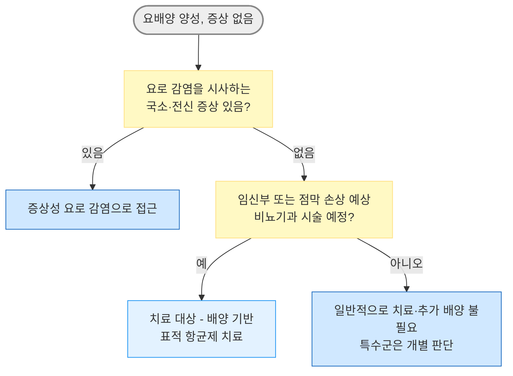

# 무증상 세균뇨 Asymptomatic Bacteriuria

## <mark style="color:green;">일반 사항</mark>

* 요로 감염을 시사하는 증상 없이 소변 배양 검사에서 유의한 세균이 검출되는 상태
* 정의 \[IDSA, 2019] : 발열, 배뇨 곤란, 빈뇨/절박뇨, 육안혈뇨, 치골상부 통증 또는 늑척추각 통증·압통 등 급성 요로 감염을 시사하는 국소·전신 증상이 없으면서 정량적 배양 기준을 충족하는 세균뇨
  * 소변에 염증세포(WBC) 및 inflammatory cytokine이 존재할 수 있으나 이는 진단 기준이 아님
* 농뇨(pyuria)가 동반되더라도 증상이 없으면 항균제 치료의 적응증이 아님
* 유병률 : 건강한 폐경 전 여성 1\~5%, 건강한 폐경 후 여성 2.8\~8.6%; ＞65세 남성 5\~10%; 요양 시설 장기 체류 남성 15\~40%, 여성 25\~50%; 도뇨관 장기 유치 시 \~100% \[IDSA]
* 극히 일부 대상(임신부, 침습적 비뇨기과 시술 예정자)을 제외하고는 치료 이득이 입증되지 않아 치료하지 않음 - 불필요한 치료는 부작용·내성 발생 등 이득보다 위해가 큼

## <mark style="color:green;">원인</mark>

* 원인균 : 요도/질/항문 주위 상재균 (_E. coli_ 등 장내세균이 흔함)

### <mark style="color:orange;">위험 인자</mark>

* 고령, 여성, 임신
* 당뇨병, 면역 저하, 혈액 투석
* 척수 손상, 신경인성 방광, 소변 저류
* 도뇨관 유치(단기·장기)
* 보호 시설 체류

## <mark style="color:green;">임상 양상</mark>

* 발열, 배뇨 곤란, 빈뇨/절박뇨, 치골상부·늑척추각 통증 또는 압통, 육안혈뇨 등 급성 요로 감염을 시사하는 국소 또는 전신 증상이 없음

### <mark style="color:$danger;">🚩 Red Flags!</mark>

<mark style="color:$danger;">**즉시 조치 또는 의뢰**</mark>

* 발열, 오한, 빈맥, 저혈압 등 패혈증을 시사하는 소견 동반 → 급성 신우신염·요로패혈증
* 임신부에서 발열, 오한, 옆구리 통증 또는 늑척추각 압통 동반 → 급성 신우신염·요로패혈증 평가 및 산과적 합병증 동시 확인

<mark style="color:$warning;">**당일~수일 내 평가**</mark>

* 배뇨 곤란, 빈뇨, 절박뇨, 치골상부 압통 등 국소 요로 증상이 새로 발생
* 요로 폐쇄 또는 요로결석이 의심
* 점막 손상이 예상되는 내시경 비뇨기과 시술을 앞둔 세균뇨

<mark style="color:$info;">**조기 평가 및 추적**</mark>

* 임신부에서 치료 후 반복 요배양을 시행한 경우의 재양성(치료 실패 또는 재발 가능성 평가)
* 당뇨병, 신장이식, 도뇨관 유치 등 위험 인자를 가진 무증상 환자 → 증상 교육 및 임상 경과 관찰; 무증상 상태의 반복 요배양은 일반적으로 시행하지 않음

## <mark style="color:green;">진단</mark>

* U/A : 농뇨, leukocyte esterase 및 nitrite 양성 소견이 동반될 수 있으나 그 자체로는 진단 기준이 아니며, 정량적 배양 검사로 확진함 \[IDSA]

<table><thead><tr><th width="230">검체 유형</th><th width="140">기준 균수</th><th>비고</th></tr></thead><tbody><tr><td>청결 채취 자연 배뇨, 여성</td><td>≥10⁵ cfu/㎖</td><td>연속 2회(가급적 2주 이내), 동일 균종</td></tr><tr><td>청결 채취 자연 배뇨, 남성</td><td>≥10⁵ cfu/㎖</td><td>1회로 진단</td></tr><tr><td>단회 도뇨 또는 새 도뇨관 삽입 직후, 남녀 공통</td><td>≥10² cfu/㎖</td><td>실제 세균뇨를 시사할 수 있으나, 무증상 환자에서 낮은 균수의 임상적 의미는 확립되지 않음</td></tr><tr><td>유치 도뇨관 보유</td><td>≥10⁵ cfu/㎖</td><td>낮은 균수·다균종은 도뇨관 생물막 오염 가능성; 무증상이면 선별·치료하지 않음</td></tr></tbody></table>

* 위 표는 일반적인 IDSA 정의임. 임신부 산전 선별은 청결 채취 중간뇨 배양 1회에서 단일 요로병원균 ≥10⁵ cfu/㎖이면 임상적으로 유의한 ASB로 판단하여 치료함 \[ACOG, 2023]

* 장기 유치 도뇨관 보유 환자는 세균뇨가 거의 보편적(\~100%)이므로, 무증상 상태에서는 선별 목적의 요배양 검사를 시행하지 않음 (증상 발생 시 또는 침습적 시술 전 등 배양이 필요한 상황은 제외)

### <mark style="color:orange;">선별 검사</mark>

* 증상이 없는 일반 인구에 대한 ASB(Asymptomatic Bacteriuria) 선별 검사는 권고하지 않음
* 선별 검사 권고 대상 : 모든 임신부 - 임신 초기 산전 진료 시 1회 소변배양검사를 시행(USPSTF: 임신 12\~16주 또는 더 이른 첫 산전 방문); 점막 손상이 예상되는 내시경 비뇨기과 시술 예정자

***



<p align="center"><strong>무증상 세균뇨 접근 알고리듬</strong></p>

<p align="center"><em><mark style="color:$info;">Ref. Nicolle LE, et al. IDSA Clinical Practice Guideline for the Management of Asymptomatic Bacteriuria: 2019 Update</mark></em></p>

***

## <mark style="background-color:$warning;">Management</mark>


* 대부분의 환자에서 치료 필요 없음 : 무증상 세균뇨는 항균제 치료의 이득이 입증된 임신부와 점막 손상이 예상되는 내시경 비뇨기과 시술 예정자를 제외하고는 치료하지 않음. 불필요한 치료는 위장관 부작용, _C. difficile_ 감염, 항균제 내성 유발 등 위해가 이득보다 큼 \[IDSA]

### <mark style="color:orange;">치료 대상</mark>

* 임신부
* 점막 손상이 예상되는 내시경 비뇨기과 시술(경요도 전립선절제술 등) 예정자


요양시설 거주 고령자 등에서 발열·혈역학적 불안정이나 국소 요로 증상 없이 섬망, 낙상, 정신 상태 변화만 나타난 경우 ASB를 요로 감염으로 오인하여 항생제를 투여하지 않도록 주의. 탈수·약물 등 다른 원인을 평가하고 주의 깊게 관찰함. 패혈증 소견이 있고 다른 감염원이 확인되지 않으면 요로를 포함한 감염원을 평가하면서 경험적 항균제 치료를 고려함.


### <mark style="color:orange;">치료하지 않는 대상 (근거 기반)</mark>

* 다음에서는 선별 검사와 치료 모두 권고 안 함 : 건강한 폐경 전/후 여성, 당뇨병 환자, 고령/요양시설 거주자(기능 저하 동반 포함), 척수 손상, 신경인성 방광, 단기 또는 장기 도뇨관 유치 중, 신장이식 후 1개월 이후, 기타 고형 장기 이식
* 도뇨관 제거 시점 : ASB 선별·치료의 이득에 대한 근거가 부족하여 권고 없음(No recommendation). 일부 환자에서 도뇨관 제거 시 예방적 항균제가 증상성 UTI를 줄일 가능성이 있으나, 이는 ASB 선별 후 치료하는 전략과는 다름
* 신장이식 후 1개월 이내 : 근거 부족으로 권고 등급 없음(No recommendation) - 개별 판단 필요
* 고위험 호중구감소증(ANC ＜100/㎣, ≥7일 예상) : 선별·치료에 대한 근거 부족으로 권고 없음(No recommendation); 저위험 호중구감소증은 일반 비호중구감소 환자와 동일하게 접근
* 비뇨기과가 아닌 수술(관절 치환술 등) 예정자 : 수술 전 ASB 치료 권고 안 함

## <mark style="color:green;">약물 치료</mark>

### <mark style="color:orange;">임신부</mark>

* 배양·감수성 결과에 따른 표적 항균제를 선택함. 치료 기간은 일반적으로 5\~7일이며, fosfomycin 3 g 단회요법은 예외임 \[ACOG, 2023]
* nitrofurantoin : 50\~100 ㎎ qid ×5\~7d <mark style="color:blue;">\[보령 니트로푸란토인 캡슐 50 ㎎]</mark>
  * 국내 유통 50 ㎎ 캡슐의 허가 용법은 1회 50\~100 ㎎, 1일 4회 식후 및 취침 시 투여임. 해외의 100 ㎎ bid 요법은 monohydrate/macrocrystals 복합 제형에 해당하므로 국내 50 ㎎ 캡슐에 그대로 적용하지 않음
  * 임신 후기에도 사용할 수 있으나, G6PD 결핍 환자 및 임신 38\~42주·분만 또는 출산 시에는 신생아 용혈 위험으로 금기. 국내 허가사항상 CrCl ＜60 ㎖/min인 신기능 장애에도 금기
  * 최근 대규모 코호트 연구에서는 1삼분기 사용과 관련한 유의한 기형 위험이 확인되지 않았으며, ACOG(2023)는 1삼분기에도 다른 적절한 대안이 없다면 사용이 합리적이라고 명시
* amoxicillin/clav. : 500/125 ㎎ tid ×5\~7d <mark style="color:blue;">\[오구멘틴]</mark>
* cephalexin : 500 ㎎ qid ×5\~7d <mark style="color:blue;">\[팔렉신]</mark>
* cefpodoxime : 100 ㎎ bid ×5\~7d <mark style="color:blue;">\[바난]</mark>
* fosfomycin : 3 g ×1회 - 감수성 확인 시 임신부 ASB의 단회 치료 선택지이며, ESBL(Extended-spectrum beta-lactamases) 생성균에도 감수성이 있으면 고려 <mark style="color:blue;">\[모누롤]</mark>
* nitrofurantoin과 fosfomycin은 신실질 농도가 충분하지 않으므로 발열·옆구리 통증 등 신우신염이 의심되면 사용하지 않음

#### 임신부의 B군 연쇄상구균 세균뇨

* 무증상이고 GBS(Group B Streptococcus) ≥10⁵ cfu/㎖ : 임신 중 표적 항균제 치료
* GBS ＜10⁵ cfu/㎖ : 무증상이라면 임신 중 항균제 치료는 하지 않으나, 균수와 관계없이 분만 중 GBS 예방적 항균제 투여 적응증이므로 의무기록에 명시
* 증상성 요로 감염이면 균수와 관계없이 치료


**Trimethoprim-sulfamethoxazole은 대안이 있다면 피해야 함.** 엽산 대사 길항 작용이 있으며, 최근 대규모 관찰연구에서 1삼분기 사용이 β-lactam 대비 심장 기형·구순구개열 등 일부 선천성 기형 위험 증가와 연관되어 대안이 있으면 회피함. 만삭에 근접해서는 신생아 고빌리루빈혈증·핵황달의 이론적 위험 때문에 회피.


### <mark style="color:orange;">침습적 비뇨기과 시술 예정자</mark>

* 시술 전 소변 배양검사를 시행하고 감수성 결과에 따른 표적 항균제로 1회 또는 2회 단기요법을 선택하며, 시술 30\~60분 전 초회 투여
* 가능한 한 가장 좁은 스펙트럼의 항균제를 선택하며, 약제와 투여경로는 배양·감수성 결과, 시술 종류 및 기관별 예방적 항균제 지침에 따라 결정
* 점막 손상이 예상되지 않는 저위험 시술(단순 진단적 방광경 검사 등)은 치료 대상이 아님

***

### 질병코드

<mark style="color:red;">R82.7 요의 미생물학적 검사상 이상소견 Abnormal findings on microbiological examination of urine</mark>

***

## <mark style="color:purple;">처방례</mark>

> **처방례 1. 임신부 ASB, cephalexin 감수성 확인**
>
> ```
> 팔렉신 500 ㎎/cap  1cap  qid × 5일
> ```
>
> _✽배양·감수성 결과에 근거하여 선택; β-lactam 계열은 임신 전 기간에 걸쳐 안전성 자료가 풍부함_

> **처방례 2. 임신부, 1삼분기, 적절한 대안이 없는 경우**
>
> ```
> 보령 니트로푸란토인 캡슐 50 ㎎/cap  1cap  qid × 5~7일
> ```
>
> _✽대안이 없을 때 1삼분기에도 사용 가능; G6PD 결핍, 국내 허가사항상 CrCl ＜60 ㎖/min, 임신 38~42주·분만 또는 출산 시에는 금기_

> **처방례 3. 침습적 비뇨기과 시술(경요도 전립선절제술 등) 예정**
>
> ```
> 배양·감수성 결과에 기반한 표적 항균제를 시술 30~60분 전 단회 투여
> (필요하면 시술 종류와 기관 지침에 따라 2회째 투여)
> ```
>
> _✽약제와 투여경로는 배양·감수성 결과, 시술 종류 및 기관별 예방적 항균제 지침에 따라 결정_

> **처방례 4. 임신부 ASB, fosfomycin 감수성 확인 시 단회요법**
>
> ```
> 모누롤 3 g/포  1포  1회 복용
> ```
>
> _✽ESBL 생성균에도 감수성이 있으면 고려할 수 있음. 발열·옆구리 통증 등 신우신염이 의심되면 사용하지 않음_

***

## <mark style="color:$success;">핵심 복약 지도</mark>

> **왜 대부분 치료하지 않나요?**
>
> * ASB는 임신부와 점막 손상이 예상되는 내시경 비뇨기과 시술 예정자를 제외하면 항균제 치료로 얻는 임상적 이득이 입증되지 않았습니다.
> * 불필요한 항균제 사용은 위장관 부작용, C. difficile 감염, 내성균 발생 위험을 높입니다.
> * 요배양 결과만으로 항생제를 처방하지 말고, 반드시 국소 요로 증상(배뇨 곤란, 빈뇨, 절박뇨, 치골상부 압통 등) 유무를 먼저 확인하십시오.
> * 소변이 탁하거나 냄새가 난다는 이유만으로 항생제가 필요한 것은 아닙니다 - 외래에서 가장 흔한 오해 중 하나입니다.

> **임신부 치료 시 주의점**
>
> * 처방된 기간(보통 5\~7일)은 증상이 없더라도 끝까지 복용하도록 안내합니다.
> * 1삼분기에는 β-lactam 계열(cephalexin, amoxicillin/clavulanate)을 우선 고려하고, nitrofurantoin은 적절한 대안이 없을 때 사용합니다.
> * nitrofurantoin은 임신 38\~42주, 분만 또는 출산 시에는 금기입니다.
> * trimethoprim-sulfamethoxazole은 1삼분기 기형 위험 및 만삭 근접 시 신생아 핵황달 위험으로 권장하지 않습니다.
> * 치료 후 1\~2주 내 반복 요배양을 고려할 수 있으나, 모든 임신부에서 반드시 시행해야 한다는 근거는 충분하지 않습니다.

> **언제 다시 병원을 방문해야 하나요?**
>
> * 발열, 옆구리 통증, 오한 등 **신우신염을 시사하는 증상**이 나타나는 경우 - 즉시 내원
> * 배뇨 곤란, 빈뇨, 절박뇨 등 **새로운 요로 증상**이 발생하는 경우
> * 임신부에서 배가 자주 뭉치거나 조기진통 징후가 있는 경우 - 즉시 산과 평가

***

## <mark style="color:blue;">환자 안내서</mark>


**소변 검사에서 세균이 나왔지만 증상이 없다면, 대부분 치료가 필요 없습니다**

소변 배양 검사에서 세균이 자랐다고 해서 모두 방광염이나 요로 감염은 아닙니다. 열이 나거나 소변볼 때 아프거나 자주 마려운 증상이 전혀 없다면 이는 '무증상 세균뇨'이며, 대부분의 경우 치료 없이도 문제가 되지 않습니다.


### <mark style="color:$primary;">왜 치료하지 않는 경우가 많나요?</mark>

* 증상이 없는 세균뇨를 항생제로 치료해도 이후 방광염 발생을 줄이거나 신장을 보호한다는 근거가 없습니다.
* 오히려 불필요한 항생제 사용은 설사, 알레르기 반응 등 부작용을 일으키고, 내성균이 생기는 원인이 됩니다.
* 그래서 건강한 성인, 당뇨병 환자, 고령자, 도뇨관을 가지고 계신 분들은 증상이 없다면 소변 배양 검사 자체를 권하지 않습니다.
* 임신부의 산전 선별검사와 특정 비뇨기과 시술 전 검사를 제외하면, 증상이 없는 상태에서 요배양검사를 반복할 필요는 없습니다.
* 소변 냄새나 색깔만으로는 치료가 필요한 상태가 아닙니다.

### <mark style="color:$primary;">그렇다면 언제 치료가 필요한가요?</mark>

* **임신 중이신 경우** - 임신 중에는 증상이 없어도 신장 감염(신우신염)이나 조산으로 이어질 위험이 있어 치료합니다.
* **점막 손상이 예상되는 비뇨기과 내시경 시술을 앞두고 계신 경우** - 시술 중 세균이 혈액으로 들어가는 것을 막기 위해 시술 직전 짧게 항생제를 사용합니다.

### <mark style="color:$primary;">약은 어떻게 써야 하나요?</mark>

* 처방받은 항생제는 **증상이 없더라도 처방된 날짜만큼 끝까지** 복용하십시오.
* 복용 중 발진, 심한 설사 등이 생기면 병원에 알려주십시오.

### <mark style="color:$primary;">이럴 때는 즉시 병원을 방문하세요</mark>

* **열이 나거나 옆구리(등 쪽)가 아픈 경우**
* **소변볼 때 아프거나, 소변을 자주/급하게 보게 되는 경우**
* 임신 중이신데 배가 자주 뭉치거나 평소와 다른 느낌이 드는 경우
