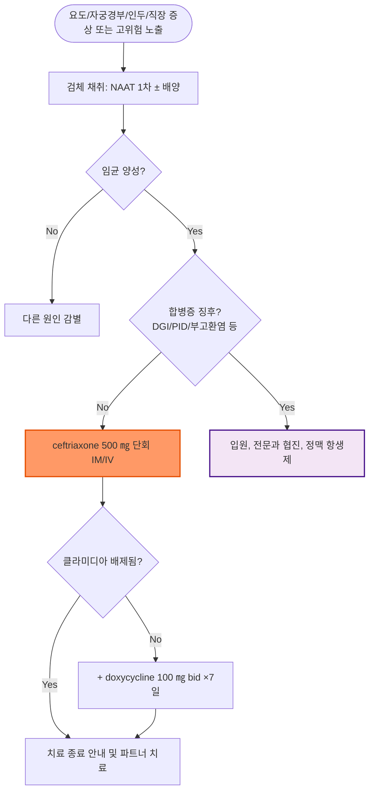

# 임질 Gonorrhea

## <mark style="color:green;">일반 사항</mark>

* 원인균 : Neisseria gonorrhoeae
* 감염 시 남성에서는 요도염, 여성에서는 자궁경부염이 흔함
* 국내 신고 현황상 20대 남성에서 발생 빈도가 높은 편
* 성관계 금지 : 치료 시작 후 7일간, 그리고 환자와 파트너 모두 치료를 완료할 때까지 성관계를 피함
* 파트너 검사 : 증상 발생 또는 진단 60일 이내 관계한 성 파트너에 대한 평가를 요함; 마지막 성접촉이 60일 이전이라도 가장 최근 파트너는 평가 및 치료
* STI 검사 : 임질이 진단된 환자는 다른 성 매개 질환(HIV, 매독, 클라미디아 등)에 대한 검사를 요함
* 합병증 : 부고환염, 골반염(PID), 파종성 임균 감염(DGI), 불임 등

## <mark style="color:green;">원인 및 위험 요인</mark>

* 무방비 성관계(질, 항문, 구강 성교)를 통한 직접 접촉으로 전파
* 위험 요인 : 다수의 성 파트너, 새로운 성 파트너, 콘돔 미사용, 과거 STI 병력, 성매개감염 고위험군(성매매 종사자, MSM 등), 젊은 연령
* 수직 감염 : 분만 시 산도를 통해 신생아에게 전파 → 신생아 결막염, 패혈증 유발 가능

## <mark style="color:green;">임상 양상</mark>

* 흔히 무증상; 남성 요도 감염의 10% 내외, 자궁 경부 감염의 50\~80%, 인두 감염의 90% 이상에서 무증상

#### <mark style="color:$primary;">남성 요도 감염</mark>

* 노출 2\~5일 후 증상 발생
* 화농성 성기 분비물, 배뇨통, 요도 발적, 고환 압통(편측 부고환염이 가장 흔한 합병증)

#### <mark style="color:$primary;">여성 자궁 경부 감염</mark>

* 노출 5\~10일 후 증상 발생
* 점액농성 분비물, 배뇨통, 외음부 가려움, 골반통, 성교통, 자궁 경부 내 발적
* 합병증으로 PID 발생, \~90%에서 요도염 동반

#### <mark style="color:$primary;">인두염</mark>

* 삼출성 인두염, 인후통, 편도 삼출물, 전경부 adenopathy

#### <mark style="color:$primary;">직장 감염</mark>

* 대부분 무증상
* 증상이 있는 경우 : 항문 소양감, 점액농성 분비물, 후중감(tenesmus), 직장 출혈

#### <mark style="color:$primary;">파종성 임균 감염 (Disseminated Gonococcal Infection, DGI)</mark>

* 원발 감염의 일부에서 균혈성 파종으로 발생
* 3대 소견 : 피부 병변(사지 원위부의 소수의 통증성 구진·농포·출혈성 병변), 건초염(tenosynovitis), 이동성 다발 관절통 ± 화농성 단관절염(무릎 등 대관절)
* 발열, 오한 동반 가능; 여성, 생리 중, 임신 중 위험 증가
* 원발 생식기 감염의 증상이 없거나 경미한 경우도 흔해 진단이 지연되기 쉬움

#### <mark style="color:$primary;">성인 임균성 결막염</mark>

* 드묾; 생식기 분비물의 자가 접종 또는 산도를 통한 신생아 수직감염으로 발생
* 심한 화농성 분비물, 결막 충혈; 각막 침범 시 실명 위험

***

### <mark style="color:$danger;">🚩 Red Flags!</mark>

<mark style="color:$danger;">**즉각 조치 또는 의뢰**</mark>

* 파종성 임균 감염(DGI) 의심 소견(발열 + 피부 병변 + 건초염/이동성 다발 관절통) → 입원, 정맥 항생제 치료
* 심한 하복부 통증 + 발열 + 복막자극징후 → 중증 PID, 골반 농양 의심 → 응급 평가
* 신생아 임균성 결막염(수직감염) → 실명 위험, 즉시 의뢰

<mark style="color:$warning;">**당일 또는 조기 의뢰**</mark>

* 편측 고환·부고환의 심한 압통 및 종창 + 발열 → 급성 부고환염, 고환염전 감별을 위해 비뇨의학과 당일 의뢰
* 임신부에서 진단된 경우 → 산과 협진
* 결막 충혈 + 화농성 분비물(성인 임균성 결막염 의심) → 안과 의뢰(실명 위험)

<mark style="color:$info;">**외래 추적 / 추가 평가 계획**</mark> <mark style="color:$info;">- 즉각 위험 낮으나 호전 없으면 의뢰</mark>

* 치료 후에도 증상이 지속되는 경우 → 치료 실패 및 재감염 감별 위한 재검사
* 파트너가 치료를 완료하지 못한 경우 → 재감염 위험, 치료 3개월 후 재검사

***

## <mark style="color:green;">진단</mark>

### <mark style="color:orange;">검사</mark>

* 소변, 자궁 경부/요도/인두/직장 분비물(swab)에 대하여 검사
* 그람염색 : G(-) intracellular diplococci, WBC
* NAAT(PCR) : 요도·자궁경부·질·직장·인두 감염의 1차 검사
* 배양 검사 : 항생제 내성 의심, 치료 실패, 내성 감시(surveillance) 목적으로 시행
* 재감염이 흔하므로 치료 3개월 후 재검사 시행(증상 유무와 무관하게 시행)

### <mark style="color:orange;">치료 실패</mark>

* 치료 후 3\~5일이 지나도 증상이 지속되거나 NAAT 양성이 확인되면 치료 실패 또는 재감염을 고려

### <mark style="color:orange;">감별 진단</mark>

* 요도염·자궁경부염·질염 증상을 일으킬 수 있는 다른 원인들과의 감별

<table><thead><tr><th width="150">질환</th><th width="220">임질과의 차이</th><th>감별 포인트</th></tr></thead><tbody><tr><td>비임균성 요도염(NGU, 클라미디아·마이코플라스마 등)</td><td>잠복기가 상대적으로 김(1\~3주)</td><td>그람염색에서 diplococci 미관찰; NAAT로 원인균 확인</td></tr><tr><td>트리코모나스 질염 / 세균성 질염</td><td>화농성보다는 악취 동반 분비물, 소양감 두드러짐</td><td>생리식염수 습식도말에서 편모충 관찰; 임질 배양·NAAT 음성</td></tr><tr><td>반응성 관절염(Reactive arthritis)</td><td>결막염·요도염·관절염 triad</td><td>임균 배양·NAAT 음성; 최근 요도염/장염 병력</td></tr></tbody></table>

***



<p align="center"><strong>진단 및 치료 알고리듬</strong></p>

<p align="center"><em><mark style="color:$info;">Ref. 질병관리청·대한요로생식기감염학회, 성매개감염 진료지침(2023); CDC STI Treatment Guidelines(2021)</mark></em></p>

***

## <mark style="background-color:$warning;">Management</mark>


**치료 원칙**\
합병증이 없는 요도·자궁경부·직장·인두 감염은 ceftriaxone 단회 근육/정맥주사로 치료하며, 클라미디아 동반 여부가 확인되지 않은 경우 doxycycline을 추가한다.


## <mark style="color:green;">비-약물 치료 및 예방</mark>

* 콘돔을 이용한 안전한 성관계
* 최근 60일 이내 성 파트너에 대한 동시 검사 및 치료
* 치료 시작 후 7일간, 그리고 파트너 치료가 완료될 때까지 성관계 금지
* 치료 3개월 후 재검사(증상 유무와 무관)

✽일부 국가에서는 파트너를 직접 진료하지 않고 처방하는 Expedited Partner Therapy(EPT)를 시행하나, 국내에서는 일반적으로 시행하지 않음


**Doxy-PEP(노출 후 예방요법)** — 세균성 STI(매독·클라미디아·임질) 공통 예방 전략으로 (☞ [성매개질환 총론](115-1_-STD.md)) 참조


## <mark style="color:green;">약물 치료</mark>

### <mark style="color:orange;">합병증이 없는 자궁경부·요도·직장 감염</mark>

#### <mark style="color:$primary;">1차 선택제 (합병증이 없는 인두 감염 포함)</mark>

* ceftriaxone : 500 ㎎ ×1회 IM(체중 150 ㎏ 미만) <mark style="color:blue;">\[트리악손]</mark>
* 체중 150 ㎏ 이상인 경우 : ceftriaxone 1 g ×1회 IV 권장(국내 성매개감염 진료지침 2023)

✽CDC 2021은 1 g 용량도 IM 투여를 권고하고 있어 국내 지침과 차이가 있음. 근육주사 시 통증 문제로 국내에서는 고용량에서 정맥주사를 권장함

#### <mark style="color:$primary;">대체제</mark>

* spectinomycin 2 g IM ×1회 (국내 지침의 공식 대체요법이나 실제 상용 유통이 거의 되지 않아 사용이 제한적; 인두 감염에는 효과가 낮음(치료 성공률 50% 내외로 보고)—인두 감염에는 권장되지 않음)
* gentamicin 240 ㎎ IM ×1회 <mark style="color:blue;">\[겐타마이신 주]</mark> plus azithromycin 2 g ×1회 <mark style="color:blue;">\[지스로맥스]</mark>
* cefixime : 800 ㎎ ×1회 <mark style="color:blue;">\[슈프락스]</mark> (ceftriaxone 투여가 어려운 경우; cefixime 단독은 항임균 효과가 상대적으로 낮으므로 클라미디아 배제가 안 된 경우 doxycycline을 추가 — azithromycin 병용을 일반적으로 권장하지 않음. 인두 감염 완치율이 낮아(약 92% 미만) 인두 감염에는 권장되지 않음)

※ Chlamydia 감염이 배제되지 않은 경우 doxycycline 100 ㎎ bid ×7d 투여 <mark style="color:blue;">\[독시사이클린]</mark>

### <mark style="color:orange;">인두 감염</mark>

* 1차 선택제와 동일 (☞ 위 1차 선택제 참고)
* 신뢰할 만한 대체 요법이 없어 반드시 ceftriaxone으로 치료
* 치료 후 확인 검사 시행 (☞ 아래 '치료 후 검사' 참고)

### <mark style="color:orange;">임신부 감염</mark>

* 1차 선택제와 동일한 ceftriaxone 요법으로 치료
* 클라미디아 배제 안 된 경우 doxycycline 대신 azithromycin 1 g 단회 경구 사용 (임신 중 doxycycline 금기)

### <mark style="color:orange;">급성 부고환염</mark>

* Chlamydia 및 Gonorrhea 감염에 대하여 치료 (☞ [급성 부고환염](121_-acute-epididymitis.md))

### <mark style="color:orange;">파종성 임균 감염 (DGI)</mark>

* 입원 후 ceftriaxone 1 g IV/IM 24시간마다 투여, 임상 호전 후 24\~48시간 추가 투여 후 경구 항생제(예: cefixime 400 ㎎ bid)로 전환하여 총 치료 기간 7일 이상 유지
* 화농성 관절염 동반 시 정형외과 또는 감염내과 협진, 관절천자 고려

### <mark style="color:orange;">성인 임균성 결막염</mark>

* ceftriaxone 근육/정맥주사 및 생리식염수 세척; 안과 응급 의뢰
* 안과 평가 전까지 반복적인 생리식염수 세척을 고려

### <mark style="color:orange;">치료 후 검사</mark>

* 합병증이 없는 비뇨생식기, 직장 임균 감염의 경우 치료 후 확인 검사는 필요 없음
* 인두 감염을 치료한 경우 사용 약제와 무관하게 치료 7\~14일 후 검사(NAAT 또는 배양) 시행

***

### <mark style="color:red;">질병코드</mark>

A54 임균감염

A54.0 하부 비뇨생식기의 임균성 감염

A54.2 임균성 골반복막염 및 기타 임균성 비뇨생식기 감염

A54.3 임균성 눈질환

A54.4 임균성 관절병증

A54.5 임균성 인두염

A54.6 항문 및 직장의 임균성 감염

A54.9 상세불명 임균감염

***

## <mark style="color:purple;">처방례</mark>

> **처방례 1. 합병증이 없는 임균성 요도염**
>
> ```
> 트리악손 주 500 ㎎  IM  1회
> ```
>
> _✽클라미디아 동반이 배제되지 않은 경우 doxycycline 100 ㎎/T 1T bid ×7일 추가 (임신부는 azithromycin 1 g 단회로 대체)_

> **처방례 2. 세팔로스포린 중증 알레르기(아나필락시스 등)**
>
> ```
> 겐타마이신 주 240 ㎎  IM  1회
> 지스로맥스 250 ㎎/T  8T(총 2 g)  1회
> ```
>
> _✽단순 발진·위장장애 정도는 ceftriaxone 사용이 가능한 경우가 많음 — 중증 알레르기(아나필락시스, Stevens-Johnson 등)로 확인된 경우에만 적용. gemifloxacin+azithromycin 병용요법은 가용성·비용·항생제 스튜어드십 문제로 더 이상 권장 대체요법이 아님(CDC 2021). Azithromycin 2 g 단회 복용 시 구토 등 위장관 불내성이 매우 흔해 필요시 진토제 병용을 고려할 수 있으며, 겐타마이신+아지스로마이신은 효과가 ceftriaxone보다 떨어지므로 가능하면 감염내과 협진을 권장_

> **처방례 3. 인두 임질**
>
> ```
> 트리악손 주 500 ㎎  IM  1회
> ```
>
> _✽치료 7\~14일 후 NAAT 또는 배양으로 치료 확인 검사 시행(사용 약제와 무관하게 시행); 인두 감염은 신뢰할 만한 대체 요법이 없어 반드시 ceftriaxone으로 치료_

***

### <mark style="color:$success;">핵심 복약 지도</mark>

> **트리악손(ceftriaxone) 근육주사 안내**
>
> * 근육주사 1회로 대부분 치료가 완료됩니다.
> * 클라미디아 동반 여부가 확인되지 않은 경우 독시사이클린을 7일간 규칙적으로 복용하도록 안내합니다(1일 2회, 충분한 물과 함께 복용, 복용 후 바로 눕지 않기).
> * 치료 종료 후 7일간은 성관계를 금하도록 설명합니다.
> * 최근 60일 이내 성 파트너에게도 반드시 검사 및 동시 치료가 필요함을 설명합니다.
>
> **언제 다시 병원을 방문해야 하나요?**
>
> * 치료 후에도 분비물, 배뇨통 등 증상이 지속되는 경우
> * 발열, 피부 발진, 관절통이 새로 발생하는 경우 — 파종성 임균 감염 감별 위해 즉시 내원
> * 심한 하복부 통증 또는 발열이 동반되는 경우 — 즉시 내원
> * 치료 3개월 후 재검사를 반드시 시행

***

### <mark style="color:blue;">환자 안내서</mark>


**임질, 항생제 주사 한 번으로 대부분 치료됩니다**

임질은 성 접촉으로 전파되는 세균 감염입니다. 적절히 치료하면 대부분 완치되지만, 치료하지 않으면 골반 염증, 불임 등 합병증으로 이어질 수 있습니다.


#### <mark style="color:$primary;">왜 생기나요?</mark>

* 임균이라는 세균이 성 접촉(질, 항문, 구강 성교)을 통해 전파됩니다.
* 증상이 없는 경우도 많아(특히 여성, 인두 감염) 본인도 모르게 다른 사람에게 옮길 수 있습니다.

#### <mark style="color:$primary;">치료는 어떻게 받나요?</mark>

* 대부분 항생제 근육주사 1회로 치료가 끝납니다.
* 다른 감염(클라미디아 등)이 함께 있을 가능성이 있으면 먹는 항생제를 추가로 7일간 복용하게 됩니다. 처방받은 기간을 반드시 채워 복용하십시오.

#### <mark style="color:$primary;">일상생활에서 무엇을 지켜야 하나요?</mark>

* **치료가 끝난 뒤 7일간, 그리고 파트너가 치료를 완료할 때까지 성관계를 하지 마십시오.** 이 기간이 지나기 전에 성관계를 하면 파트너에게 옮기거나 재감염될 수 있습니다.
* **최근 60일 이내 성 파트너도 반드시 검사와 치료를 받아야 합니다.**
* 콘돔을 사용하면 재감염과 다른 성매개감염 예방에 도움이 됩니다.
* 치료 3개월 후에는 재감염 여부를 확인하기 위한 검사를 다시 받으십시오.

#### <mark style="color:$primary;">이럴 때는 즉시 병원을 방문하세요</mark>

* 치료 후에도 분비물, 배뇨통이 계속되는 경우
* 열이 나면서 피부에 발진이나 물집 같은 병변이 생기고 관절이 아픈 경우
* 여성에서 심한 아랫배 통증이나 발열이 동반되는 경우
* 임신 중인 경우 반드시 산전 검사 및 치료를 완료하십시오(출산 시 신생아에게 결막염이 전파될 수 있습니다)
