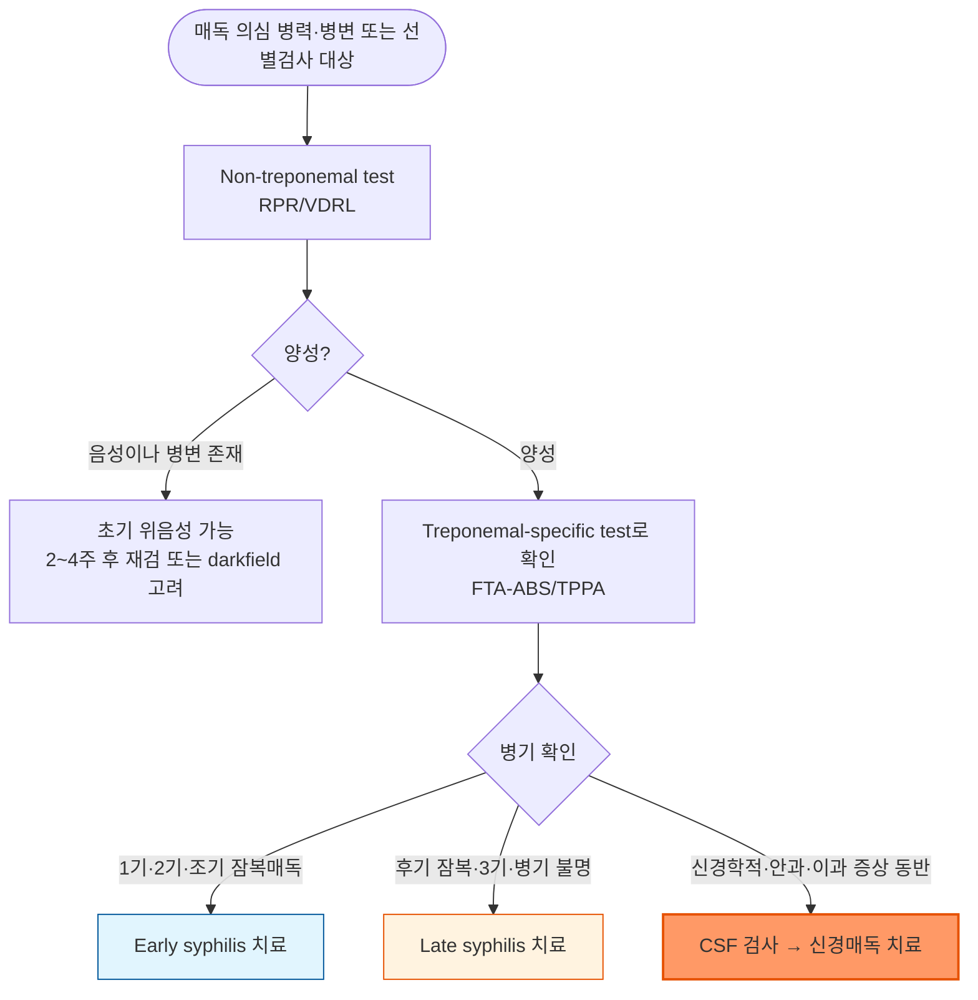

# 매독 (매독균 감염증) Syphilis

## <mark style="color:green;">일반 사항</mark>

* 정의 (CDC STI Treatment Guidelines, 2021) : *Treponema pallidum* 감염에 의한 만성 전신성 성매개질환
* 다른 이름 : lues
* 전염 경로 : 감염 병소에 대한 직접 접촉(성관계), 감염 산모의 경태반 수직감염(대부분) — 출산 중 산도 접촉에 의한 감염은 드묾
  * 수혈에 의한 전염은 극히 드묾 (✽공여자의 혈액을 4℃ 냉장 저장 시 대개 24\~48시간 이내 사멸하나, 접종균량에 따라 최대 96시간까지 생존이 보고된 연구도 있음)
* 법정감염병 : 3급(전수감시) — 2024년 1월부터 표본감시에서 전수감시로 전환되어 모든 의료기관이 진단 후 24시간 이내 신고해야 함
* 유병률 (국내, 질병관리청 2024년 매독 역학적 특성 보고) : 연간 신고 2,790명(인구 10만 명당 5.4명); 남성이 78.0%로 여성 대비 발생률 약 3.5배; 20\~30대가 58.6% 차지; 병기별로는 조기 잠복매독(43.7%) > 1기(35.2%) > 2기(18.8%) > 3기(1.8%) > 선천매독(0.4%) 순
  * ✽2024년은 전수감시 전환 첫해로, 이전 표본감시 시기 자료와의 직접적인 추세 비교는 방법론적으로 부적절함

### <mark style="color:orange;">분류</mark>

#### <mark style="color:$primary;">Early syphilis</mark>

* primary syphilis, secondary syphilis, early latent syphilis를 포함
* 1기 병변(굳은궤양) 잠복기 : 평균 약 3주(10\~90일)

#### <mark style="color:$primary;">Late syphilis</mark>

* late latent syphilis, tertiary syphilis를 포함 (neurosyphilis는 병기와 무관하게 조기·후기 어느 시기에서나 발생 가능하여 별도로 분류)
* 초기 단계에서 치료되지 않으면 무증상의 late latent syphilis 또는 감염 합병증 단계(tertiary syphilis)로 진행
* 초감염 후 어느 시기(1\~30년)에서나 다양한 조직에서 증상이 발현될 수 있음

## <mark style="color:green;">원인 및 위험 인자</mark>

* 원인균 : *Treponema pallidum* subsp. *pallidum* — 나선형 스피로헤타(spirochete); 표준 배지에서 배양되지 않아 암시야 현미경 또는 분자 진단으로만 직접 확인 가능
* 위험 요인
  * 콘돔 미사용 성관계, 다수의 성 파트너, 성매매 관련 접촉
  * 남성 동성 간 성접촉(MSM) — 국내외 모두 주요 위험군
  * HIV 감염 또는 기타 성매개질환(임질, 클라미디아 등) 동반
  * 최근 1년 내 세균성 성매개질환 진단 병력

## <mark style="color:green;">임상 양상</mark>

### <mark style="color:orange;">1기 매독 (Primary syphilis)</mark>

* 굳은 궤양(Chancre) : 통증 없는 한 개의 papule로 시작 → 곧 침식되고 단단해져 촉진상 연골 느낌의 바닥 및 둘레를 가지는 궤양으로 진행
* 구강, 항문, 음경, 질 등에서 감염 후 2\~3주에 발생할 수 있으며 치료하지 않으면 몇 주간 지속될 수 있음
  * 구강 병변은 무통성인 경우가 많아 아프타성 궤양·인후염 등으로 오인되어 진단이 지연되기 쉬움
* 국소 림프절 종대 : 궤양 발생 1\~2주 후 주로 양측 서혜부에 무통성·고무 같고 단단한(rubbery) 양상으로 촉지됨(압통 없음)

### <mark style="color:orange;">2기 매독 (Secondary syphilis)</mark>

* 피부 발진 : 반, 구진, 구진비늘, 농포 등 다양한 형태; 손/발바닥 및 전신 분포; 가려움 없음
* 편평콘딜로마(Condylomata lata) : 분홍색 또는 회백색, 넓고 짓무른 papules or plaques; 전염성이 높으며 2기 매독 환자의 10%에서 발생
* 전신 증상 : 발열, malaise, 인후통, 두통, 근육통, 관절통, 전신 림프절병증, 체중 감소, 탈모
* 신질환(사구체신염, 신증후군), 간질환(간염) 발생 가능

### <mark style="color:orange;">3기 매독 (Tertiary syphilis)</mark>

* 치료받지 않은 환자에서의 late syphilis; cardiovascular syphilis, gummatous syphilis를 포함한 증상 발생
* 고무종(Gumma) : 다양한 크기와 부위(피부, 피하, 골, 내장)의 결절; 궤양과 피부 괴사를 일으킬 수 있음

### <mark style="color:orange;">잠복매독 (Latent syphilis)</mark>

* 치료받지 않은 환자에서, 매독 혈청 검사는 양성이지만 CSF 검사는 정상이고 임상 증상은 없는 상태
* 조기 잠복매독 : 초감염 후 1년까지
* 후기 잠복매독 : 1년이 지나거나 감염 시기가 미상인 경우

### <mark style="color:orange;">신경매독 (Neurosyphilis)</mark>

* 감염 경과 중 어느 시기에나 발생 가능

#### <mark style="color:$primary;">조기 신경매독 (Early neurosyphilis)</mark>

* 뇌막염, 뇌혈관 질환(예: 수막염, 뇌졸중) : 두통, 혼돈, 구역, 구토, 경부 강직
* 시력 손실(홍채염, 포도막염), 청력 손실

✽ 안매독·이매독(시력저하·포도막염·이명·난청 등)은 CSF 검사 결과와 무관하게 신경매독과 동일한 aqueous penicillin G IV 요법을 시행함(CDC 2021)

#### <mark style="color:$primary;">만기 신경매독 (Late neurosyphilis)</mark>

* 뇌/척수 이환 : 치매, general paresis, tabes dorsalis

### <mark style="color:orange;">선천매독 (Congenital syphilis)</mark>

* 미치료 매독 임산부에서 태반을 통해 태아로 수직감염; 임신 시기·모체 병기와 무관하게 임신 전 기간에 걸쳐 발생 가능
* 조기 선천매독(생후 2년 이내) : 간·비장비대, 황달, 피부·점막 병변(수포성 발진, 비강 분비물[snuffles]), 골연골염, 빈혈·혈소판감소증
* 후기 선천매독(2세 이후, 미치료 시) : Hutchinson 삼징후(간질성 각막염, 감각신경성 난청, Hutchinson 치아), 안장코(saddle nose), 검상경(sabre shin)
* 대부분 임신부 선별검사와 조기 치료로 예방 가능 (☞ Management의 '임신부 매독' 참조)

***

### <mark style="color:$danger;">🚩 Red Flags!</mark>

<mark style="color:$danger;">**즉각 조치 또는 의뢰**</mark>

* 급성 시력 저하·안통(포도막염·망막염 의심), 급성 청력 소실 → 안과/이비인후과 응급 협진 + 신경매독 평가
* 두통 + 발열 + 경부 강직, 또는 급성 신경학적 결손(뇌졸중 유사) → 조기 신경매독 의심 → 즉시 신경과 의뢰 및 CSF 검사
* 임신부의 활동성 매독 확진 + 조기진통 또는 태아 이상 소견 → 즉시 산과 의뢰
* 신생아에서 선천매독 의심 소견(간비대, 황달, 피부병변, 비강 분비물 등) + 모체 매독 병력 → 즉시 신생아과/소아감염 협진
* 치료 시작 24시간 내 고열·저혈압(Jarisch-Herxheimer 반응)이 심한 경우, 특히 신경매독·임신부 → 즉시 관찰 및 대증치료

<mark style="color:$warning;">**당일 또는 조기 의뢰**</mark>

* 서서히 진행하는 시력·청력 변화 또는 인지기능 저하 → 신경매독/안매독/이과매독 의심 → 신경과 협진 및 CSF 검사 계획
* HIV 선별검사 양성 → 감염내과 의뢰
* 3기 매독 소견(심혈관계 증상, 고무종) → 관련 전문과 협진
* 임신부에서 매독 확진(응급 소견 없어도) → 산과 협진 — 수직감염 예방을 위한 조기 치료 필요
* 모체가 임신 중 매독 치료를 받지 않았거나 치료 반응이 불충분했던 신생아(출생 시 무증상 포함) → 소아과 협진 및 선천매독 평가

<mark style="color:$info;">**외래 추적 / 추가 평가 계획**</mark> <mark style="color:$info;">- 즉각 위험 낮으나 호전 없으면 의뢰</mark>

* 치료 후 6·12개월(late syphilis는 24개월까지) non-treponemal test 역가가 4배 이상 감소하지 않음 → 치료 실패 의심, 재치료 및 HIV 감염 감별
* Serofast state(치료 후에도 낮은 역가로 지속 양성) — 정기 추적

## <mark style="color:green;">진단</mark>

* 단일 검사로 확진되지 않으며 non-treponemal test와 treponemal-specific test를 조합해 해석
* 모든 매독 환자는 진단 시 반드시 HIV 검사를 시행함 — 결과에 따라 후속 진단·추적 전략이 달라짐

### <mark style="color:orange;">비-트레포네마 검사 (Non-treponemal test)</mark>

* RPR, VDRL
* cardiolipin-lecithin-cholesterol Ag 복합체에 대한 IgG 및 IgM Ab 측정
* 역가가 4배 이상 지속적으로 증가하면 재감염 또는 치료 실패를 시사; 4배 이상 감소하면 치료 반응으로 해석
* 항체가와 질병 활성도에 상관관계가 있어 치료 반응 평가에 활용


**진단 주의 : 전대 현상(Prozone phenomenon)**\
2기 매독처럼 항체가가 매우 높은 경우 검체를 희석하지 않으면 비-트레포네마 검사(RPR/VDRL)가 오히려 위음성으로 나올 수 있음. 2기 매독의 임상 증상이 뚜렷한데 RPR/VDRL이 음성이면 검사실에 혈청 희석 후 재검사를 요청해야 함.


### <mark style="color:orange;">트레포네마 특이 검사 (Treponemal-specific test)</mark>

* FTA-ABS, TPPA, ICS, EIA
* 항체가와 질병 활성도의 상관관계는 없음
* 초기 위음성 가능; 치료 후에도 대부분 평생 양성으로 남아 과거 감염을 반영하므로 치료 반응 평가에는 사용할 수 없음 — 해석 시 임상 경과와 함께 판단


**Reverse sequence screening**\
최근 다수의 대형 검사실은 treponemal test(EIA/CIA)를 먼저 시행하고 양성인 경우에만 non-treponemal test로 확인하는 역순 알고리듬을 사용함. 두 검사 결과가 불일치하면(예: treponemal 양성 + non-treponemal 음성) 두 번째 treponemal test(TPPA 등)로 재확인 필요.\
✽국내 다수 1차 의료기관 검사실은 아직 non-treponemal test 우선 알고리듬을 사용하므로, 검사실 정책 확인 후 해석 필요


### <mark style="color:orange;">암시야 현미경 검사</mark>

* Darkfield microscopy of skin lesion : 병변에서 직접 균을 확인; 병변 초기 혈청검사 위음성 구간에서 유용

### <mark style="color:orange;">단계별 검사 민감도</mark>

<table><thead><tr><th width="140">병기</th><th width="150">Non-treponemal test</th><th width="150">Treponemal-specific test</th><th>Darkfield</th></tr></thead><tbody><tr><td>1기</td><td>78\~86%</td><td>76\~84%</td><td>80%</td></tr><tr><td>2기</td><td>100%</td><td>100%</td><td>80%</td></tr><tr><td>3기</td><td>71\~73%</td><td>94\~96%</td><td>—</td></tr><tr><td>잠복매독</td><td>95\~100%</td><td>97\~100%</td><td>—</td></tr></tbody></table>

### <mark style="color:orange;">CSF 검사 (신경매독 평가)</mark>

* 검사 대상
  * 신경 증상(청력 질환, 뇌신경 기능 이상, 수막염, 뇌졸중, 의식 변화, 진동 감각 상실)
  * 안과 증상(홍채염, 포도막염)
  * 활동성 3기 매독 증거(대동맥염, 고무종)
  * Serologic treatment failure
* 신경학적 증상이 있으면 반드시 시행하며, HIV 감염에서 CD4 ≤350/㎣ 또는 non-treponemal titer ≥1:32인 경우 검사 역치를 낮춰 고려할 수 있음(단, 무증상 환자에서 이 기준만으로 시행할 임상적 이득은 확립되지 않음, CDC 2021)

### <mark style="color:orange;">감별 진단</mark>

* 생식기 궤양·전신 발진을 일으키는 질환과의 감별

<table><thead><tr><th width="130">질환</th><th width="230">병변 특징</th><th>구분 포인트</th></tr></thead><tbody><tr><td>생식기 헤르페스</td><td>유통성 다발성 수포·궤양</td><td>재발성, 국소 림프절 압통</td></tr><tr><td>연성하감</td><td>유통성 궤양, 화농성 기저부</td><td>서혜부 림프절병증(bubo) 동반, 국내 드묾</td></tr><tr><td>첨규콘딜롬(HPV)</td><td>사마귀양 병변</td><td>편평콘딜로마와 병변 형태로 구분(생검 필요시)</td></tr></tbody></table>

***



<p align="center"><strong>진단 및 병기별 치료 알고리듬</strong></p>

<p align="center"><em><mark style="color:$info;">Ref. CDC Sexually Transmitted Infections Treatment Guidelines, 2021</mark></em></p>

***

## <mark style="background-color:$warning;">Management</mark>


**⚠️ Jarisch-Herxheimer 반응**\
치료 시작 24시간 이내 발열, 오한, 근육통, 두통이 나타날 수 있으며 페니실린 알레르기 반응이 아닌 치료에 대한 급성 반응임. 알레르기가 아니므로 이후 페니실린 재투여의 금기 사유가 되지 않음. 특히 조기 매독·신경매독·임신부에서 흔하며, 임신부에서는 조기진통을 유발할 수 있어 사전 안내가 필요함.



**페니실린이 모든 병기에서 1차 선택제**\
Benzathine penicillin G가 표준 치료이며, 다른 항생제를 추가해도 효과가 더해지지 않음. 페니실린 알레르기·임신·신경매독 등 상황에 따라 대체 요법 또는 탈감작 후 페니실린 치료를 고려.


### <mark style="color:orange;">Early syphilis (1기·2기·조기 잠복매독)</mark>

**1차 선택제**

* benzathine penicillin G 240만 U IM 1회 (다른 항생제 추가 효과는 없음) <mark style="color:blue;">\[마이신 주]</mark>

**대체제** (페니실린 사용 불가 시; 비임신 환자에 한함)

* doxycycline 100 ㎎ bid ×14일
* tetracycline 500 ㎎ qid ×14일 (doxycycline 대비 위장관 부작용 많아 순응도 낮음)
* ceftriaxone 1 g qd IM/IV ×10\~14일 (최적 용량·기간은 확립되지 않음)


**⚠️ Azithromycin은 매독 치료에 권장되지 않음**\
과거 azithromycin 2 g 단회 요법이 대체제로 쓰인 적이 있으나 현재는 권장되지 않음. *T. pallidum*의 macrolide 내성이 광범위하게 보고되어 CDC 2021 지침은 다른 대체제(doxycycline, ceftriaxone)를 모두 사용할 수 없는 극히 예외적 상황에서만 고려하도록 제한함. 사용 시 밀착 혈청 추적이 필수.


**모니터링**

* 치료 후 6개월 및 12개월째 임상 및 혈청학적 평가
* non-treponemal test 역가가 4배 이상 감소(예: VDRL 1:32 → 1:8)하지 않으면 치료 실패로 판정하고 재치료 및 HIV 감염 감별

✽ 조기 매독에서 benzathine penicillin G 단회 투여는 3회 반복 투여 대비 치료 성적 차이가 없으며, 이는 HIV 감염 여부와 무관함이 대규모 RCT로 확인됨(NEJM, 2025)

✽ Serofast state : 적절히 치료되어 역가가 4배 이상 감소했음에도 낮은 역가(대개 ≤1:4\~1:8)로 평생 양성이 지속되는 상태. 새로운 노출·재감염 증상이 없다면 치료 실패가 아닌 혈청학적 흉터(serologic scar)로 해석하며, 추가 재치료 없이 정기 추적만 시행

### <mark style="color:orange;">Late syphilis (후기 잠복·3기 매독)</mark>

**1차 선택제**

* benzathine penicillin G 240만 U qwk IM ×3주 (총 720만 U) <mark style="color:blue;">\[마이신 주]</mark>

**대체제**

* doxycycline 100 ㎎ bid ×4주
* ceftriaxone 2 g qd IM/IV ×10\~14일 (early syphilis와 마찬가지로 최적 용량·기간에 대한 근거는 제한적)

**모니터링**

* 치료 후 6, 12, 24개월째 non-treponemal test 시행
* 다음의 경우 CSF 검사 시행 : 역가 4배 증가, 초기 높은 역가(≥1:32)에서 12\~24개월 내 4배 이상 감소 실패, 매독 증상 발생

✽ 재투여 간격 : 최적 간격은 7\~9일; 비임신 성인은 10\~14일까지 허용되나 초과 시 전체 요법 재시작 고려; 임신부는 9일을 초과하면 예외 없이 처음부터 전체 3회 요법을 재시작해야 함

### <mark style="color:orange;">신경매독</mark>

**1차 선택제**

* aqueous penicillin G 1,800\~2,400만 U/일 지속 점적, 또는 300\~400만 U q4hr IV ×10\~14일
* procaine penicillin G 240만 U/일 IM + probenecid 500 ㎎ qid ×10\~14일


**⚠️ Procaine penicillin은 반드시 근육주사(IM)로 투여**\
정맥으로 잘못 주입되면 급성 정신증·경련 등(Hoigne syndrome)을 유발할 수 있음.


**대체제**

* ceftriaxone 2 g qd IV ×10\~14일

**모니터링**

* non-treponemal test 추적
* CSF 검사 재시행(정상화될 때까지 통상 6개월 간격) — 단, HIV 미감염이거나 HIV 감염이라도 ART 복용 중이며 혈청학적·임상적 반응이 충분하면 반복 CSF 검사는 불필요(CDC 2021)

### <mark style="color:orange;">HIV 동반 매독</mark>

* 치료 원칙은 HIV 음성 환자와 동일 — early syphilis에서 benzathine penicillin G 240만 U 단회 IM이 HIV 감염 여부와 무관하게 효과적임 (NEJM, 2025)
* 혈청학적 반응이 늦거나 불완전할 수 있어 3, 6, 9, 12, 24개월로 추적 간격을 더 촘촘히 설정
* CD4 ≤350/㎣ 또는 non-treponemal titer ≥1:32인 경우 무증상 신경매독 위험이 높아 CSF 검사 역치를 낮춰 고려 (☞ 진단 - CSF 검사 참조)
* 매독 진단 시 미검사자는 반드시 HIV 검사 시행, 고위험군은 정기 재검 권고

### <mark style="color:orange;">임신부 매독</mark>

* 산전 선별검사 : 모든 임신부는 첫 산전 방문 시 매독 선별검사 시행; 매독 유병률이 높은 지역이나 고위험군은 임신 28주경 및 분만 시 재검
* 치료 원칙 : 병기에 따른 표준 benzathine penicillin G 요법이 유일하게 검증된 치료 — doxycycline·tetracycline은 임신 중 금기
* 페니실린 알레르기가 확인되어도 탈감작(desensitization) 후 페니실린 투여가 원칙(대체 요법의 태아 매독 예방 효과는 확립되지 않음)
* 치료 후 Jarisch-Herxheimer 반응이 조기진통·태아 심박수 이상을 유발할 수 있어 특히 임신 후반기에는 치료 후 관찰이 필요
* 치료 후에도 매월 non-treponemal test로 추적하여 재감염·치료 실패를 조기에 발견

### <mark style="color:orange;">성 파트너 관리</mark>

* mucocutaneous syphilitic lesion이 존재할 때 전염력이 있음

**평가 대상**

* 1기 매독 환자와 3개월 내 접촉자
* 2기 매독 환자와 6개월 내 접촉자
* 조기 잠복매독 환자와 1년 내 접촉자

**조치**

* 진단 전 90일 내 접촉 시 : 혈청 검사가 음성인 경우에도 조기 잠복매독으로 간주하고 치료
* 진단 전 90일 이전 접촉 시 : 혈청 검사 음성이면 치료 불필요; 검사 결과를 즉시 확인할 수 없거나 추적 방문이 불확실한 경우 조기 잠복매독으로 간주하고 치료
* 파트너 추적이 어려운 경우 관할 보건소 등 공중보건기관에 협조 요청 가능

## <mark style="color:green;">비-약물 치료 및 예방</mark>

* 병변이 완전히 치유되고 치료가 끝날 때까지 성관계를 피하도록 안내
* 최근 성 파트너는 위 기준에 따라 검사·치료
* 진단 시 HIV·기타 성매개질환 동시 검사 권고
* 콘돔 사용으로 전파 위험 감소(단, 병변이 콘돔으로 덮이지 않는 부위에 있으면 예방 효과 제한적)


**Doxy-PEP(노출 후 예방요법)** — 세균성 STI(매독·클라미디아·임질) 공통 예방 전략으로, 매독에서도 유의한 감염 감소 효과가 보고됨 (☞ [성매개질환 총론](115-1_-STD.md)) 참조


***

### <mark style="color:red;">질병코드</mark>

A50 선천매독

A50.9 상세불명의 선천매독

A51 조기매독

A51.0 1기 생식기매독

A51.3 2기 매독의 피부 및 점막병변

A51.5 조기 잠복매독

A52 후기매독

A52.1 증상성 신경매독

A52.8 잠복성 후기매독

A52.9 상세불명의 후기매독

A53 기타 및 상세불명의 매독

A53.9 상세불명의 매독

***

## <mark style="color:purple;">처방례</mark>

> **처방례 1.** Early syphilis (1기·2기·조기 잠복매독) 표준 치료
>
> ```
> 마이신 주 120만 U/V  2V  1회 IM
> ```
>
> _✽ 좌우 둔부에 나누어 주사(1V씩); 주사 후 30분간 관찰(아나필락시스 대비); 치료 시작 24시간 이내 발열 등 Jarisch-Herxheimer 반응 가능함을 사전 안내_

> **처방례 2.** Early syphilis, 페니실린 사용 불가 시(비임신)
>
> ```
> 독시사이클린 100 ㎎/C  2C  #2 ×14일
> ```
>
> _✽ 임신부는 doxycycline 금기 — 페니실린 탈감작 후 투여가 원칙; 순응도 확보를 위해 복용 완료까지 추적 안내_

> **처방례 3.** Late syphilis (후기 잠복매독, 병기 불명)
>
> ```
> 마이신 주 120만 U/V  2V  1주 간격 IM ×3회 (총 6V)
> ```
>
> _✽ 1주 간격이 원칙(최적 7\~9일); 비임신 성인은 14일 초과, 임신부는 9일 초과 시 전체 요법 재시작_

> **처방례 4.** 신경매독 의심 시
>
> ```
> 입원 후 aqueous penicillin G 정주 요법 시행
> ```
>
> _✽ 신경매독은 외래 경구 요법 대상이 아니며, CSF 검사 확인 후 입원하여 정주 페니실린 요법을 시행하는 것이 원칙 — 상급 의료기관 의뢰_

> **처방례 5.** 임신부, 페니실린 알레르기(탈감작 후)
>
> ```
> 알레르기내과/감염내과 협진 하 페니실린 탈감작 프로토콜 시행 후
> 마이신 주 120만 U/V  2V  1회 IM (병기에 따라 반복)
> ```
>
> _✽ 임신 중 doxycycline·tetracycline은 금기이며 대체 요법의 태아 매독 예방 효과가 입증되지 않아, 페니실린 알레르기가 확인되어도 탈감작 후 페니실린 치료가 원칙; 탈감작은 입원 또는 모니터링 가능한 환경에서 시행_

***

### <mark style="color:$success;">핵심 복약 지도</mark>

> **페니실린 주사 전후 안내**
>
> 1. 주사 전 페니실린 알레르기 기왕력을 반드시 확인하십시오.
> 2. 주사 후 24시간 이내 발열·오한·근육통이 발생할 수 있음(Jarisch-Herxheimer 반응)을 미리 안내하고, 해열제로 대증 조절 가능함을 설명하십시오.
> 3. 이 반응은 알레르기가 아니므로 이후 페니실린 재투여의 금기 사유가 되지 않습니다.
> 4. **임신부에서는 이 반응이 조기진통을 유발할 수 있어** 산과와 사전 협의가 필요합니다.

> **doxycycline 대체 요법 시**
>
> * 14일(후기 매독은 4주) 요법을 끝까지 복용하도록 강조 — 임의 중단 시 치료 실패 위험
> * 음식과 함께, 충분한 물과 함께 복용하고 복용 후 바로 눕지 않도록 안내

> **언제 다시 병원을 방문해야 하나요?**
>
> * 치료 후 6\~12개월 추적 혈청검사에서 역가가 충분히 감소하지 않는 경우
> * 새로운 신경학적 증상(시력·청력 변화, 심한 두통)이 발생하는 경우 — 즉시 내원
> * 임신 중이거나 임신 계획이 있는 경우 — 즉시 산과 협진

***

### <mark style="color:blue;">환자 안내서</mark>


**매독, 조기에 발견하면 페니실린 주사로 완치할 수 있습니다**

매독은 성 접촉으로 전파되는 세균 감염증으로, 초기에 궤양이나 발진이 생겼다가 저절로 없어지기도 합니다. 하지만 치료하지 않으면 수년 뒤 신경계나 심장 등 여러 장기에 심각한 합병증을 일으킬 수 있어, 증상이 사라져도 반드시 진단·치료가 필요합니다.


#### <mark style="color:$primary;">왜 매독에 걸리나요?</mark>

* 매독균이 감염 부위와의 직접 접촉(성 접촉)으로 전파됩니다.
* 초기 궤양은 통증이 없어 모르고 지나치기 쉽습니다.
* 임신 중 치료하지 않으면 태아에게도 감염될 수 있어(선천매독), 임신부는 반드시 선별검사와 치료가 필요합니다.

#### <mark style="color:$primary;">치료는 어떻게 하나요?</mark>

* 대부분 페니실린 주사 1회(병기에 따라 1\~3회)로 치료합니다.
* 주사 후 하루 이내 열이나 몸살 기운이 있을 수 있으나, 이는 치료에 대한 몸의 반응이며 알레르기가 아닙니다.

#### <mark style="color:$primary;">치료 후 무엇을 확인하나요?</mark>

* 치료가 잘 되었는지 확인하기 위해 6\~12개월 후 혈액검사를 다시 받아야 합니다.
* 최근 성 파트너도 함께 검사·치료를 받아야 재감염을 막을 수 있습니다.
* 병변이 다 나을 때까지, 그리고 치료가 끝날 때까지 성관계를 피하십시오.

#### <mark style="color:$primary;">이럴 때는 즉시 병원을 방문하세요</mark>

* 시력이나 청력에 변화가 생기는 경우
* 심한 두통이나 목이 뻣뻣해지는 느낌이 동반되는 경우
* 임신 중이거나 임신을 계획 중인 경우
