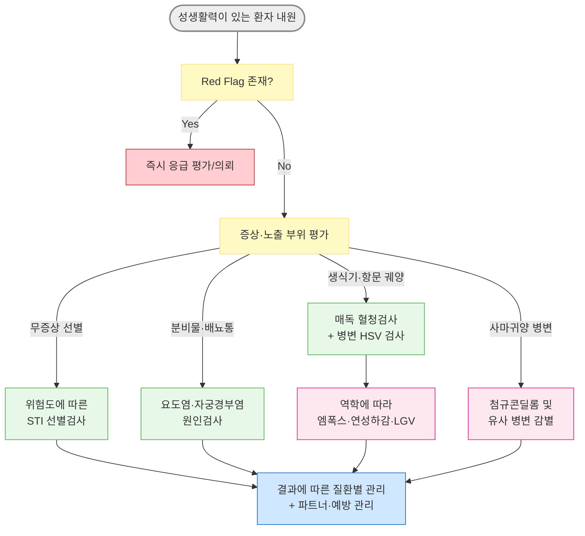

# 성매개감염병 Sexually Transmitted Infections, STIs

## <mark style="color:green;">일반 사항</mark>

* 성 접촉(질·항문·구강 성교, 피부·점막 접촉 포함)을 통해 전파되는 감염병의 총칭
  * 현재는 '성병'(성매개질환, STD, sexually transmitted disease)보다 무증상 감염을 포함하는 STI가 표준 용어로 사용됨
* 세균, 바이러스, 원충, 기생충 등 다양한 병원체에 의해 발생하며, 무증상 감염이 흔해 진단 없이 전파가 지속될 수 있음
* 병원체별 분류
  * 세균성 : [매독](115_-3.syphilis.md), [임질](115_-2.gonorrhea.md), [클라미디아감염증](115_-4.chlamydia.md), [연성하감](115_-1.STI.md#chancroid)
  * 바이러스성 : [생식기 단순포진](../229_/181_-herpes-simplex.md#herpes-genitalis)(HSV), 첨규콘딜롬(HPV), HIV, [B형간염](../224_/091_b-hepatitis-b-viral-infection.md)
  * 원충성 : [트리코모나스증](115_-1.STI.md#trichomoniasis)
  * 기생충성 : [사면발이](../229_/185_-pediculosis-lice.md), [옴](../229_/184_-scabies.md)
* 질병관리청 법정감염병 분류(2026년 기준)
  * 3급(전수감시) : 후천성면역결핍증(AIDS), 매독, 엠폭스
  * 4급(표본감시) : 임질, 클라미디아감염증, 연성하감, 성기단순포진, 첨규콘딜롬, 사람유두종바이러스 감염증
  - [ ] 감염병 신고 시기 : 1급은 즉시, 2·3급은 24시간 이내; 4급은 지정된 표본감시기관에서 7일 이내 신고(☞ [방역통합정보시스템](https://eid.kdca.go.kr/))
* 역학 : 국내 표본감시 신고에서 클라미디아감염증이 세균성 성매개감염병 중 높은 비중을 차지함. 다만 전수감시와 표본감시 자료를 직접 비교하여 실제 발생률로 해석해서는 안 됨
* 합병증 : 골반염(PID), 불임, 만성 골반통, 자궁외임신, 신생아 감염(수직감염), HIV 감염 위험 상승

## <mark style="color:green;">원인 및 위험 인자</mark>

* 콘돔 미사용 성관계
* 다수의 성 파트너 또는 새로운 파트너
* STI 기왕력 또는 STI가 있는 파트너
* STI 유행 지역·집단과의 접촉
* 성매매, 물질 사용 동반 성관계
* 면역저하 상태(HIV 감염 등) - 다른 STI 이환 위험을 높이고 중증도를 악화시킴

## <mark style="color:green;">임상 양상</mark>

* 무증상 : 상당수(특히 클라미디아감염증)에서 증상이 없으며, 증상이 없어도 전파가 가능하므로 위험군에서는 증상과 무관하게 정기 선별검사가 필요
* 요도염·자궁경부염형 : 배뇨통, 이상 분비물
* 궤양형 : 생식기·항문 주위 궤양 또는 수포
* 사마귀양형 : 생식기·항문 주위 구진·사마귀
* 전신 증상 동반형 : 발열, 발진, 관절통 등 - 파종성 임균감염, 2기 매독, 급성 HIV 감염 등 전신 감염 시사

### <mark style="color:$danger;">🚩 Red Flags!</mark>

<mark style="color:$danger;">**즉각 조치 또는 의뢰**</mark>

* 갑작스러운 편측 음낭 통증, 오심·구토, 고환 상승 또는 비정상 방향 → 고환염전 우선 배제, 즉시 응급 평가
* 하복통·골반 압통과 함께 혈역학적 불안정, 복막자극징후, 중증 전신증상 또는 난관-난소농양·파열 의심 → 중증 골반염(PID) 또는 외과적 응급질환
* 발열 + 다발 관절통/관절염 + 피부 병변(농포성 발진) → 파종성 임균감염
* 시력 저하, 청력 저하, 뇌막염 유사 증상, 신경학적 결손 → 신경매독/안매독/이과매독
* 임신 후기 또는 분만 시점의 활동성 생식기 궤양·수포성 병변 → 즉시 산과 평가
* 음낭·회음부 통증·부종 + 전신 독성 소견(빈맥, 저혈압, 피부 괴사·염발음) → Fournier 괴사근막염
* HIV 감염 가능성이 있는 성접촉 후 72시간 이내 내원 → HIV 노출 후 예방요법(PEP) 적응증 즉시 평가

<mark style="color:$warning;">**당일~수일 내 평가**</mark>

* HIV 선별검사 반응성 → 보충 확진검사 및 신속한 진료 연계(선별검사만으로 확진하지 않음)
* 매독 혈청검사 양성 또는 감염 시기·병기 불명확
* 임신부에서 STI 확진
* 성폭력 피해 정황이 동반된 경우 → HIV PEP, 응급피임, B형간염 예방 및 증거 채취 가능 시한을 고려하여 가능한 한 당일 평가(☞ [해바라기센터](https://www.sunflowercenter.or.kr/))
* 발열을 동반한 급성 생식기·항문 주위 궤양 + 림프절병증 또는 엠폭스 환자와의 접촉력
* 점진적인 편측 음낭 통증·압통 + 발열(고환염전을 배제한 경우) → [급성 부고환염](121_-acute-epididymitis.md)/고환염 평가

<mark style="color:$info;">**조기 평가 및 추적**</mark>

* 표준 치료 후에도 증상이 지속되거나 재발
* 파트너 미치료로 인한 재감염 가능성
* 반복적인 성매개감염병 진단 → HIV PrEP 및 Doxy-PEP 적응증을 포함한 예방 전략 재평가

## <mark style="color:green;">진단</mark>

### <mark style="color:orange;">성생활력 및 노출 평가</mark>

* 비판단적이고 비밀이 보장되는 환경에서 최근 및 과거 파트너(partners), 성접촉 방법과 노출 부위(practices), 감염 예방 방법(protection), STI 과거력(past history), 임신 가능성과 계획(pregnancy intention)을 확인
* 검사할 해부학적 부위는 성정체성이나 성적 지향만으로 정하지 않고 실제 노출 부위(요도/질·자궁경부/인두/직장)에 따라 결정
* 최근 노출 후 창기간에 검사한 경우 초기 음성 결과만으로 감염을 배제하지 말고 병원체별 적정 시점에 반복검사 계획

### <mark style="color:orange;">선별검사 원칙</mark>

* 성 활동이 있는 25세 미만 여성 : 매년 클라미디아·임질 선별검사; 25세 이상이라도 새 파트너·다수 파트너 등 위험 인자가 있으면 매년 선별검사
* 성생활을 하는 MSM : 최소 연 1회 노출 부위별 임질·클라미디아검사와 매독·HIV 검사
  * HIV PrEP 사용, HIV 감염, 본인 또는 파트너의 다수 파트너 등 위험이 증가한 경우 : 3\~6개월 간격 고려
* 그 밖의 위험군(다수 파트너, 성매매, 반복 STI 등) : 성행동, 과거 감염 및 지역 역학에 따라 검사 항목과 간격을 개별화
* 임신부
  * 임신 초기 : 매독·HIV·B형간염(HBsAg) 선별
  * 25세 미만 또는 위험 인자가 있는 임신부 : 클라미디아·임질 선별 및 필요 시 임신 후기 반복검사
  * 임신 중 클라미디아감염증 : 치료 약 4주 후 치료 확인(test of cure), 치료 후 약 3개월에 재검사
* 한 가지 STI 진단 시 HIV 검사를 시행하고, 노출력과 진단된 감염에 따라 매독, 임질·클라미디아, HBV·HCV 등 동반 감염을 함께 평가
* 반복 STI 또는 고위험 노출 : HBV 면역 여부, HIV PrEP 적응증 및 예방접종 상태 평가

### <mark style="color:orange;">검체 및 검사법</mark>

* NAAT(핵산증폭검사) : 임질·클라미디아 진단의 우선 검사; 실제 노출 부위에 따라 첫소변, 질·자궁경부, 인후 또는 직장 검체를 선택
  * 인후·직장 등 생식기 외 검체는 검사실에서 해당 검체가 검증된 검사인지 확인
* 트리코모나스증 : NAAT가 가장 민감함. 습식 도말은 현장 진단이 가능하지만 민감도가 낮고 채취 직후 검사하지 않으면 더 감소
* 매독 : 비트레포네마검사(RPR/VDRL)와 트레포네마검사(TPHA/TPPA 등)를 조합하여 진단; 전통적 알고리듬 또는 역순 알고리듬 사용
* HIV : 4세대 항원·항체 선별검사 후 반응성이면 보충 확진검사; 최근 고위험 노출 또는 급성 HIV 의심 시 HIV RNA 검사와 반복검사 고려
* 생식기·항문 주위 궤양 : 임상 모양만으로 원인을 확정하지 말고 매독 혈청검사와 병변 HSV-1/2 NAAT 또는 배양을 기본으로 시행; 역학에 따라 엠폭스·연성하감·LGV 평가

### <mark style="color:orange;">파트너 관리</mark>

* 파트너의 평가·검사·치료 범위는 진단된 감염병과 감염 시기에 따라 결정
  * 임질·클라미디아감염증 : 일반적으로 증상 발생 또는 진단 전 60일 이내 파트너; 60일 이내 파트너가 없다면 가장 최근 파트너
  * 트리코모나스증 : 현재 성 파트너 모두 추정 치료
  * 연성하감 : 증상 발생 전 10일 이내 파트너를 검사·치료
  * 매독 : 병기에 따라 접촉자 평가 기간이 다르므로 [매독](115_-3.syphilis.md) 챕터 참조
* 국내에서는 EPT(Expedited Partner Therapy, 파트너 간접처방)가 표준화·제도화되어 있지 않으므로 파트너가 직접 진료받도록 안내

### <mark style="color:orange;">재검사와 치료 확인</mark>

* 임질·클라미디아감염증 : 재감염 위험이 높아 치료 후 약 3개월에 재검사
* 트리코모나스증 : 성생활을 하는 여성은 치료 후 약 3개월에 재검사; 남성의 일률적 재검사는 근거 부족
* 치료 확인(test of cure)은 모든 STI에서 일률적으로 시행하지 않으며, 임신 중 클라미디아감염증, 인두 임질, 증상 지속·재발 등 질환별 적응증에 따라 시행

### <mark style="color:orange;">증후군별 감별</mark>

* STI는 증상이 없는 경우가 흔하므로, 아래는 증상이 있을 때의 감별 접근

<table><thead><tr><th width="170">주요 증후군</th><th width="570.4761962890625">주요 원인 질환</th></tr></thead><tbody><tr><td>요도염·자궁경부염, 이상 분비물</td><td>임질, 클라미디아감염증, 트리코모나스증, <em>Mycoplasma genitalium</em> 감염 등</td></tr><tr><td>생식기·항문 주위 궤양</td><td>매독, 생식기 헤르페스, 연성하감(국내 드묾), LGV, 엠폭스 등. 통증 여부·개수·모양만으로 확진하지 않음</td></tr><tr><td>직장염</td><td>임질, 클라미디아감염증/LGV, HSV, 매독, 엠폭스 등</td></tr><tr><td>사마귀양 병변</td><td>첨규콘딜롬(HPV), 전염성 연속종, 편평콘딜롬(2기 매독) 등</td></tr></tbody></table>

***



<p align="center"><strong>성매개감염병 증상·노출 부위별 평가 알고리듬</strong></p>

<p align="center"><em><mark style="color:$info;">저자 재구성(참고 문헌 : 질병관리청·대한요로생식기감염학회 성매개감염 진료지침 2023; CDC Sexually Transmitted Infections Treatment Guidelines 2021)</mark></em></p>

***

## <mark style="background-color:$warning;">Management</mark>

* **성매개감염병 관리의 공통 원칙** : ① 질환별 기준에 따른 파트너 평가·치료, ② 신고 대상 감염병은 해당 감시체계와 신고기한에 따라 신고, ③ HIV 검사 및 노출력에 따른 동반 STI 검사, ④ 질환별 성관계 재개 시점 안내, ⑤ 재발·재감염 여부를 확인할 추적 계획

### <mark style="color:orange;">연성하감 Chancroid</mark>

* 원인균 : _Haemophilus ducreyi_(그람음성 간균)
* 잠복기 : 3\~14일(통상 4\~10일)
* 임상 양상 : 통증이 심한 생식기 궤양(1개 또는 다발성), 불규칙하고 화농성인 궤양 기저부, 편측성 압통성 서혜부 림프절병증(bubo) 동반 가능
* 진단 : 확진에는 특수 배양 또는 검증된 NAAT가 필요하지만 국내에서는 시행이 제한적임. 다음을 모두 충족할 때 추정 진단
  * 1개 이상의 통증성 생식기 궤양과 연성하감에 합당한 임상 양상
  * 궤양 발생 7\~14일 이후 시행한 매독 혈청검사 또는 병변 검사에서 매독 근거가 없음
  * 병변 HSV-1/2 NAAT 또는 배양 음성
* 치료 : 처방례 1 참조
* 추적 : 치료 시작 3\~7일 후 재평가; 호전이 없으면 진단 오류, 동반 STI, HIV 감염, 복약 불이행 또는 항균제 내성을 재검토
  * 변동성 bubo는 바늘흡인 또는 절개·배농이 필요할 수 있음
* 파트너 : 증상 발생 전 10일 이내 성 파트너를 증상 유무와 관계없이 검사·치료

### <mark style="color:orange;">트리코모나스증 Trichomoniasis</mark>

* 원인 병원체 : _Trichomonas vaginalis_(편모충, 원충)
* 잠복기 : 5\~28일
* 임상 양상 : 여성 - 악취를 동반할 수 있는 황록색 질분비물, 외음부 소양감, 딸기 모양 자궁경부(strawberry cervix); 남성 - 대부분 무증상이거나 경미한 요도염
  * 전형적 증상·징후만으로 진단할 수 없으며 상당수는 무증상
* 진단 : NAAT가 가장 민감함. 습식 도말에서 운동성 원충을 관찰할 수 있으나 민감도가 낮아 검체 채취 직후 시행하고, 음성이더라도 의심되면 NAAT 시행
* 치료 : 여성은 처방례 2, 남성은 처방례 3 참조
* 파트너 : 현재 성 파트너를 증상 유무와 관계없이 동시에 추정 치료하며, 성별에 맞는 표준요법 적용
* 성관계 : 본인과 파트너가 모두 치료를 완료하고 증상이 소실될 때까지 피함
* 재검사 : 성생활을 하는 여성은 치료 후 약 3개월에 재검사; 남성의 일률적 재검사는 권고 근거 부족
  * 지속·재발 감염에서 NAAT를 사용할 경우 잔존 핵산에 의한 위양성을 피하기 위해 치료 완료 후 3주 이전에는 시행하지 않음

### <mark style="color:orange;">성접촉 후 HIV PEP</mark>

* HIV 감염 가능성이 있는 성접촉은 시간 민감성 응급상황으로, 노출 후 가능한 한 빨리 평가
* 노출 후 72시간 이내이고 적응증이 있으면 HIV 검사 결과를 기다리느라 지연하지 말고 28일간 PEP를 시작; 기초 HIV 검사, 임신검사(해당 시), 신·간기능, 노출 부위별 임질·클라미디아검사, 매독·HBV·HCV 검사를 함께 시행
* 반복적 노출 위험이 있으면 PEP 종료 후 HIV PrEP로의 전환을 평가
* 구체적인 약제 선택과 추적검사는 HIV 전문 진료 또는 최신 HIV PEP 지침에 따름

## <mark style="color:green;">비-약물 치료 및 예방</mark>

* 콘돔의 일관되고 올바른 사용 - 재감염 및 신규 감염 위험 감소; 다만 피부·점막 접촉으로 전파되는 HSV·HPV·매독 등은 콘돔으로 덮이지 않는 부위에서 전파 가능
* 성관계 재개 시점은 감염병과 치료법에 따라 다르므로, 본인과 파트너의 권고 치료가 완료될 때까지 질환별 지침에 따름
* HPV 예방접종
  * 성 활동 개시 전 접종이 가장 효과적이며 기존 HPV 감염을 치료하지는 않음
  * 미접종자는 26세까지 따라잡기 접종; 27\~45세는 개인별 위험과 기대효과를 고려하여 공유 의사결정
  * 국내 국가예방접종 지원 대상과 백신별 허가 연령은 최신 기준 확인
* B형간염 예방접종 - 미접종 또는 면역이 없는 성인에서 위험도에 따라 접종
* HIV 음성이면서 반복적인 STI 진단, MSM 등 HIV 고위험군에서는 HIV PrEP 적응증 평가
* STI는 치료되더라도 다시 노출되면 재감염될 수 있으므로 반복 감염 예방 교육과 정기 선별검사가 중요

<a id="doxy-pep"></a>


**Doxycycline 노출 후 예방요법(Doxy-PEP, CDC 2024)** : 최근 12개월 내 세균성 STI(매독, 클라미디아감염증, 임질) 진단 병력이 있는 남성과 성관계를 하는 남성(MSM) 및 트랜스젠더 여성(TGW)에게 공유 의사결정을 통해 고려. 구강·질·항문 성접촉 후 가능한 한 빨리, 늦어도 72시간 이내에 doxycycline 200 ㎎을 1회 복용하며 24시간당 200 ㎎을 초과하지 않음. 무작위대조시험에서 매독·클라미디아감염증은 70% 이상, 임질은 약 50% 감소. 기존 예방법(콘돔, 예방접종, 정기 선별검사, HIV PrEP 등)을 대체하지 않으며, 처방 전과 이후 3\~6개월마다 노출 부위별 세균성 STI 검사와 지속 필요성을 재평가함

* 충분한 물과 함께 복용하고 식도 자극을 줄이기 위해 복용 후 30분 이상 눕지 않음
* 제산제와 철분·칼슘·마그네슘 함유 제제는 doxycycline 흡수를 감소시킬 수 있으므로 시간 간격을 둠
* 광과민, 위장관 이상, 식도염과 장기적 항균제 내성·미생물군 영향에 대해 상담
* Doxycycline 과민증 또는 임신 중에는 사용하지 않음

✽국내 가이드라인에는 아직 정식 반영되지 않았고 국내 임상 경험이 부족하며, 항생제 내성 확산 우려가 있어 대상군 선정에 신중을 요함


***

### <mark style="color:red;">질병코드</mark>

A57 연성하감 Chancroid

A59.0 비뇨생식기 트리코모나스증 Urogenital trichomoniasis

Z11.3 성매개감염병에 대한 특수 선별검사 Special screening examination for infections with a predominantly sexual mode of transmission

Z20.2 성매개감염병 접촉 및 노출 Contact with and exposure to infections with a predominantly sexual mode of transmission

***

## <mark style="color:purple;">처방례</mark>

> **처방례 1. 연성하감 표준 치료**
>
> ```
> 지스로맥스 250 ㎎/T  4T(총 1 g)  1회 경구
> ```
>
> _✽ 단회 경구 투여로 치료 순응도 확보; 임신부에서도 사용 가능. 대안 : ceftriaxone 250 ㎎ 근주 1회(국내 유통 제형은 주로 1 g 바이알이므로 조제 시 250 ㎎만 정확히 분할하여 사용) 또는 ciprofloxacin 500 ㎎ bid 3일(임신·수유 중에는 다른 약제 선택)_

> **처방례 2. 트리코모나스증(여성)**
>
> ```
> 후라시닐 250 ㎎/T  2T bid  7일간
> ```
>
> _✽ 여성에서는 단회 2 g 요법보다 500 ㎎ bid 7일 요법의 치료 성공률이 더 높음. 국내 후라시닐정 첨부문서에 따라 치료 중 및 치료 종료 후 최소 3일(72시간)간 금주_

> **처방례 3. 트리코모나스증(남성 또는 여성 환자의 남성 파트너)**
>
> ```
> 후라시닐 250 ㎎/T  8T(총 2 g)  1회 경구
> ```
>
> _✽ 남성은 단회 요법이 표준. 감염된 남성의 여성 파트너에게는 처방례 2의 여성 표준요법을 적용하며, 현재 성 파트너를 동시에 치료해야 재감염을 줄일 수 있음_

***

### <mark style="color:$success;">핵심 복약 지도</mark>

> **성매개감염병 치료 시 공통 안내**
>
> 1. 처방된 항균제는 증상이 호전되어도 정해진 용량·기간까지 모두 복용하십시오.
> 2. 성관계를 다시 시작할 수 있는 시점은 감염병과 치료법에 따라 다릅니다. 본인과 파트너의 치료가 모두 완료될 때까지 담당 의사의 안내를 따르십시오.
> 3. 검사·치료가 필요한 파트너의 범위는 감염병마다 다르므로 최근 파트너에 관한 정보를 의료진에게 알려주십시오.
> 4. 매독·HIV 등은 초기에 증상이 없을 수 있으므로 권고받은 동반 검사를 시행하십시오.
> 5. 메트로니다졸 복용 중·복용 후 최소 3일(72시간)은 음주를 피하십시오(국내 첨부문서 기준).

> **언제 다시 병원을 방문해야 하나요?**
>
> * 치료 후에도 증상이 지속되거나 재발하는 경우
> * 발열, 심한 하복통 또는 갑작스러운 음낭 통증이 새로 생기는 경우 - 즉시 내원
> * 임신 중이거나 임신 계획이 있는 경우 - 사전 상담 필요
> * HIV 감염 가능성이 있는 성접촉 후 72시간이 지나지 않은 경우 - 즉시 내원

***

## <mark style="color:blue;">환자 안내서</mark>


**성매개감염병(성병), 조기 발견과 파트너 관리가 중요합니다**

성매개감염병은 증상이 없는 경우도 많아 본인도 모르게 다른 사람에게 전파할 수 있습니다. 정확한 진단과 함께 감염병별 기준에 따라 성 파트너도 검사·치료를 받아야 재감염과 추가 전파를 줄일 수 있습니다.


### <mark style="color:$primary;">왜 성매개감염병에 걸리나요?</mark>

* 세균, 바이러스, 원충 등 다양한 병원체가 성 접촉(질·항문·구강 성교와 피부·점막 접촉)을 통해 전파됩니다.
* 증상이 없어도 감염되어 있을 수 있고, 이 경우에도 다른 사람에게 전파할 수 있습니다.
* HIV는 별도의 전문적인 관리와 추적이 필요하므로 선별검사에서 반응성이 확인되면 확진검사와 전문 진료를 신속히 연계합니다.

### <mark style="color:$primary;">일상생활에서 어떻게 관리하나요?</mark>

* 콘돔을 처음부터 끝까지 일관되고 올바르게 사용하면 감염 위험을 낮출 수 있지만 모든 STI를 100% 예방하지는 못합니다.
* 본인과 파트너의 치료가 완료되고 의료진이 안내한 시점까지 성관계를 피하십시오.
* 새 파트너가 생기거나 반복 노출 위험이 있으면 증상이 없어도 정기적인 선별검사를 상담하십시오.
* HPV와 B형간염은 예방접종으로 예방할 수 있으므로 접종력을 확인하십시오.
* HIV 감염 가능성이 있는 성접촉 후 72시간 이내라면 증상이 없어도 즉시 의료기관을 방문하여 PEP가 필요한지 상담하십시오.
* 완치 후에도 다시 노출되면 재감염될 수 있습니다. 치료가 끝났다고 해서 대부분의 STI에 면역이 생기는 것은 아닙니다.
