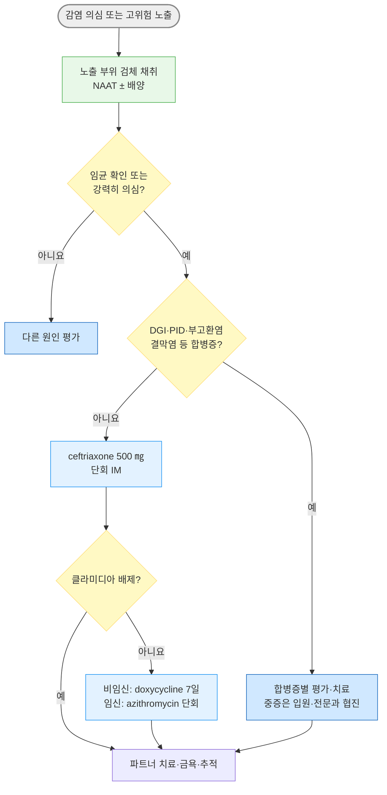

# 임질 Gonorrhea

## <mark style="color:green;">일반 사항</mark>

* 원인균 : _Neisseria gonorrhoeae_
* 감염 시 남성에서는 요도염, 여성에서는 자궁경부염이 흔함
* 법정감염병 : 4급 감염병 (표본감시) (☞ [성매개감염병](115_-1.STI.md))
* 국내 신고 현황상 20대 남성에서 발생 빈도가 높은 편
* 성관계 금지 : 환자와 성 파트너가 각각 치료를 마친 후 최소 7일이 지나고 증상이 소실될 때까지 성관계를 피함
* 파트너 관리 : 증상 발생 또는 진단 전 60일 이내 성접촉한 파트너에게 평가·검사 및 경험적 치료를 권고; 그 기간에 성접촉이 없었다면 가장 최근 파트너를 평가·치료
* STI 검사 : 임질이 진단된 환자는 다른 STI(HIV, 매독, 클라미디아 등)에 대한 검사를 요함
* 합병증 : 부고환염, 골반염(PID), 파종성 임균 감염(DGI), 불임

## <mark style="color:green;">원인</mark>

* 무방비 성관계(질, 항문, 구강 성교)를 통한 직접 접촉으로 전파
* 수직 감염 : 분만 시 산도를 통해 신생아에게 전파 → 신생아 결막염, 패혈증 유발

### <mark style="color:orange;">위험 요인</mark>

* 다수의 성 파트너, 새로운 성 파트너
* 콘돔 미사용
* 과거 STI 병력, STI 고위험군(성매매 종사자, MSM 등)
* 젊은 연령

## <mark style="color:green;">임상 양상</mark>

* 흔히 무증상; 남성 요도 감염의 10% 내외, 여성 자궁경부 감염의 70\~80%에서 무증상이며 인두 감염도 대부분 무증상

**남성 요도 감염**

* 노출 2\~5일 후 증상 발생
* 화농성 성기 분비물, 배뇨통, 요도 발적, 고환 압통 (편측 부고환염이 가장 흔한 합병증)

**여성 자궁 경부 감염**

* 노출 5\~10일 후 증상 발생
* 점액농성 분비물, 배뇨통, 외음부 가려움, 골반통, 성교통, 자궁 경부 내 발적
* 상행 감염 시 PID, 난관 불임, 자궁외 임신 등의 위험이 증가

**인두염**

* 삼출성 인두염, 인후통, 편도 삼출물, 전경부 adenopathy

**직장 감염**

* 대부분 무증상
* 증상이 있는 경우 : 항문 소양감, 점액농성 분비물, 후중감(tenesmus), 직장 출혈

**파종성 임균 감염 (Disseminated Gonococcal Infection, DGI)**

* 원발 감염의 일부에서 균혈성 파종으로 발생
* 대표 소견 : 사지 원위부의 점상출혈·농포성 피부 병변, 건초염(tenosynovitis), 비대칭성 이동성 다발 관절통 또는 화농성 관절염; 모든 소견이 함께 나타날 필요는 없음
* 발열, 오한 동반 가능; 여성, 생리 중, 임신 중 위험 증가
* 원발 생식기 감염의 증상이 없거나 경미한 경우도 흔해 진단이 지연되기 쉬움

**성인 임균성 결막염**

* 드묾; 감염된 분비물의 눈 접촉 등으로 발생. 신생아는 출생 시 산도 노출로 감염될 수 있음
* 심한 화농성 분비물, 결막 충혈; 각막 침범 시 실명 위험

### <mark style="color:$danger;">🚩 Red Flags!</mark>

<mark style="color:$danger;">**즉각 조치**</mark>

* 발열·피부 병변·건초염·이동성 관절통 또는 화농성 관절염 중 파종성 감염을 시사하는 소견 → 파종성 임균 감염(DGI) 평가
* 심한 하복부 통증 + 발열 + 복막자극징후 → 중증 PID, 골반 농양
* 신생아 임균성 결막염(수직감염)
* 갑자기 시작한 심한 편측 고환통·종창 → 고환염전 즉시 배제
* 심한 화농성 분비물을 동반한 결막염 → 각막 손상 위험, 즉시 안과 평가

<mark style="color:$warning;">**당일~수일 내 평가**</mark>

* 급성 부고환염이 의심되나 고환염전 가능성이 낮은 고환·부고환 압통 또는 종창 → 당일 평가 및 치료
* 임신부에서 임질 진단 → 당일 치료·산과 연계 및 감염 부위에 따른 추적검사 계획(인두 감염은 완치판정 필요)

<mark style="color:$info;">**외래 추적**</mark>

* 치료 후 증상이 지속되면 조기에 재평가하고 재감염·다른 원인·치료 실패를 확인
* 파트너가 치료를 완료하지 못하면 재노출을 막고 파트너 진료를 연계

## <mark style="color:green;">진단</mark>

### <mark style="color:orange;">검사</mark>

* 검체 : 남성은 첫 소변(first-catch urine), 여성은 질 swab을 우선 고려; 증상·성접촉 부위에 따라 요도·자궁경부·인두·직장 검체를 추가
* 그람염색 : 증상이 있는 남성의 요도 분비물에서 백혈구 내 그람음성 쌍구균은 진단에 유용. 무증상 남성의 음성 결과로 배제할 수 없고 여성 자궁경부·인두·직장에서는 민감도가 낮음
* NAAT(핵산증폭검사) : 생식기 검체의 선호 검사. 인두·직장 검체는 검사실에서 해당 부위에 대해 성능을 검증한 방법을 사용; 국내 2023 지침의 검체 표는 이 부위에 배양을 권고하나 CDC는 적합한 NAAT도 허용
* 배양 및 항생제 감수성 검사 : 내성·치료 실패 의심 시 재치료 전 해당 감염 부위에서 시행. NAAT만으로는 감수성을 알 수 없음
* 재감염이 흔하므로 치료 약 3개월 후 노출 부위 재검사 시행(증상 유무와 무관; 완치판정 검사와 구분)

### <mark style="color:orange;">치료 실패</mark>

* 적절한 치료 후 성접촉이 없는데 3\~5일 내 증상이 호전되지 않거나, 치료 72시간 초과 후 배양 양성 또는 7일 초과 후 NAAT 양성이면 치료 실패를 의심
* 지속 증상이나 재양성에서는 새 성접촉·파트너 치료 여부를 확인하여 흔한 재감염을 먼저 평가; 실제 치료 실패가 의심되면 재치료 전 배양·감수성 검사 및 전문과 협진

### <mark style="color:orange;">감별</mark>

* 요도염·자궁경부염·질염 증상을 일으킬 수 있는 다른 원인들과의 감별

<table><thead><tr><th>질환</th><th>감별 단서</th><th>확인 검사·주의점</th></tr></thead><tbody><tr><td>비임균성 요도염(NGU; 클라미디아·마이코플라스마 등)</td><td>점액성 분비물 등으로 나타날 수 있으나 증상만으로 임질과 구분하기 어려움</td><td>임균·클라미디아 NAAT를 함께 고려; 임균과 동시 감염 가능</td></tr><tr><td>트리코모나스 질염 /<br>세균성 질염</td><td>악취, 질 자극감·소양감 등이 동반될 수 있음</td><td>질 분비물 검사·NAAT 등으로 평가; 임질 동시 감염을 배제하지 않음</td></tr><tr><td>반응성 관절염(Reactive arthritis)</td><td>선행 요도염·장염 후 발생한 비화농성 관절염</td><td>발열·급성 관절 종창이 있으면 관절천자 등으로 화농성 관절염/DGI를 우선 배제</td></tr></tbody></table>

***



<p align="center"><strong>진단 및 치료 알고리듬</strong></p>

<p align="center"><em><mark style="color:$info;">Ref. 질병관리청·대한요로생식기감염학회, 성매개감염 진료지침(2023);</mark></em><br><em><mark style="color:$info;">CDC STI Treatment Guidelines(2021)</mark></em></p>

***

## <mark style="background-color:$warning;">Management</mark>

* 치료 원칙 : 합병증이 없는 요도·자궁경부·직장·인두 감염은 ceftriaxone 단회 주사로 치료. 생식기·직장 감염에서 클라미디아가 배제되지 않은 비임신 환자는 doxycycline을 추가하고, 인두 감염은 아래의 별도 설명을 참고. PID·부고환염·DGI 등에는 각 합병증의 치료 요법을 적용

## <mark style="color:green;">비-약물 치료 및 예방</mark>

* 콘돔을 이용한 안전한 성관계
* 최근 60일 이내 성 파트너에 대한 평가·검사 및 경험적 치료; 그 기간에 성접촉이 없었다면 가장 최근 파트너 평가
* 환자와 파트너가 각각 치료를 마친 후 최소 7일이 지나고 증상이 소실될 때까지 성관계 금지. 클라미디아 동시 감염에서는 그 치료도 완료되어야 함
* 치료 약 3개월 후 재감염 검사(증상 유무와 무관)

- [ ] 일부 국가에서는 파트너를 직접 진료하지 않고 처방하는 Expedited Partner Therapy(EPT)를 시행하나, 국내에서는 일반적으로 시행하지 않음


**Doxy-PEP(노출 후 예방요법)** - CDC 2024 권고는 최근 12개월 내 세균성 STI를 진단받은 MSM·트랜스젠더 여성 등을 대상으로 개별 상담 후 고려. 임질 예방효과는 매독·클라미디아보다 작고 연구에 따라 다르며, 임질의 치료를 대신하지 않음 (☞ [성매개감염병](115_-1.STI.md))


## <mark style="color:green;">약물 치료</mark>

#### <mark style="color:$primary;">합병증이 없는 자궁경부·요도·직장 감염</mark>

**1차 선택제 (합병증이 없는 인두 감염 포함)**

* ceftriaxone : 체중 150 ㎏ 미만에서 500 ㎎ ×1회 IM <mark style="color:blue;">\[트리악손]</mark>
  * 체중 150 ㎏ 이상에서는 1 g ×1회 투여(CDC는 IM 권고); 국내 지침은 체중 기준과 별개로 500 ㎎ IM/IV 또는 1 g IV 단회 요법을 제시

- [ ] 1 g 투여 경로를 결정할 때 국내 지침의 IV 요법과 CDC의 IM 요법을 구분하여 적용

* 생식기·직장 감염에서 클라미디아가 배제되지 않은 비임신 환자에게 ceftriaxone 또는 cefixime을 사용하면 doxycycline 100 ㎎ 경구 bid ×7일을 추가 <mark style="color:blue;">\[독시사이클린]</mark>; 인두 감염은 아래 기준을 참고. Gentamicin+azithromycin 2 g 요법에는 일률적으로 추가하지 않고 클라미디아 검사 결과와 임상 상황에 따라 판단

**대체제**

* spectinomycin : 2 g IM ×1회; 국내 유통 여부 확인 필요
  * 인두 감염에는 효과가 낮아 권장하지 않음
* gentamicin 240 ㎎ IM ×1회 <mark style="color:blue;">\[겐타마이신 주]</mark> _plus_ azithromycin 2 g 경구 ×1회 <mark style="color:blue;">\[지스로맥스]</mark> (세팔로스포린 중증 알레르기에서 제한적으로 고려)
* cefixime : 800 ㎎ 경구 ×1회 <mark style="color:blue;">\[슈프락스]</mark> (ceftriaxone 투여가 불가능할 때 고려하는 CDC 대체요법; 국내 2023 치료표의 대체제에는 없음)
  * cefixime 단독은 항임균 효과가 상대적으로 낮으므로 클라미디아 배제가 안 된 경우 doxycycline을 추가 - 일반적으로 azithromycin 병용은 권장하지 않음
  * 인두 감염 완치율이 낮아(약 92%) 인두 감염에는 권장하지 않음

#### <mark style="color:$primary;">인두 감염</mark>

* 1차 선택제와 동일 (☞ 위 1차 선택제 참고)
* 신뢰할 만한 대체 요법이 없음; ceftriaxone 중증 과민반응이 있으면 감염내과와 상의하여 치료 결정
* 인두 검체에서 클라미디아가 확인되면 doxycycline 100 ㎎ 경구 bid ×7일을 추가(임신부는 azithromycin 1 g 경구 단회); 다른 부위의 클라미디아 감염도 평가
* 치료 후 확인 검사 시행 (☞ 아래 '치료 후 검사' 참고)

#### <mark style="color:$primary;">임신부 감염</mark>

* 1차 선택제와 동일한 ceftriaxone 요법으로 치료
* 클라미디아 배제 안 된 경우 doxycycline 대신 azithromycin 1 g 단회 경구 사용 (임신 중 doxycycline은 사용하지 않음)
* 산과 진료와 연계하여 감염 부위·치료 반응 및 동반 클라미디아 감염에 따른 추적검사를 계획. 인두 임질은 치료 7\~14일 후 완치판정검사를 시행. 합병증 없는 자궁경부·요도·직장 임질은 권장 요법 후 증상이 소실되면 임신 자체만을 이유로 일률적인 임질 완치판정검사를 시행할 필요는 없음. 임질 재감염 검사는 치료 약 3개월 후 시행하고, 동반 클라미디아가 확인된 임신부는 해당 감염에 대해 치료 완료 약 4주 후 NAAT 완치판정검사를 시행

#### <mark style="color:$primary;">급성 부고환염</mark>

* Chlamydia 및 Gonorrhea 감염에 대하여 치료 (☞ [급성 부고환염](121_-acute-epididymitis.md))

#### <mark style="color:$primary;">파종성 임균 감염 (DGI)</mark>

* 입원·감염내과 협진 후 관절염·피부염형에서는 ceftriaxone 1 g IV/IM 24시간마다 시작. 임상적으로 충분히 호전된 뒤 24\~48시간이 지나고 감수성 검사에서 효과가 확인된 경구제가 있으면 전환을 고려; 총 치료 기간은 최소 7일(CDC 및 국내 지침 상세 설명), 국내 지침 치료 요약표는 최소 10일로 표기하므로 병형·경과에 따라 전문과와 결정
* 수막염 동반 시 비경구 치료 10\~14일, 심내막염 동반 시 비경구 치료 4주 이상을 고려하여 전문과에서 치료
* 파종 부위와 노출된 점막 부위의 배양·NAAT 검체 및 감수성 검사를 확보하고, 클라미디아가 배제되지 않으면 적절히 치료. 화농성 관절염에서는 관절천자·배액 여부를 평가

#### <mark style="color:$primary;">성인 임균성 결막염</mark>

* 즉시 안과 평가; ceftriaxone 1 g IM ×1회(국내 지침은 IV도 허용)를 투여하고, 생리식염수로 감염된 눈을 1회 세척하는 것을 고려

### <mark style="color:orange;">치료 후 검사</mark>

* 합병증이 없는 비뇨생식기·직장 감염에서 권장 요법을 받고 증상이 소실되면 임신부를 포함하여 임질 완치판정검사는 일반적으로 필요 없음. 증상 지속·재발 또는 치료 실패 의심 시에는 재노출 여부를 확인하고 배양·감수성 검사를 포함한 별도 평가를 시행; 인두 이외 부위에서 NAAT 완치판정검사를 시행한다면 잔존 핵산에 의한 위양성을 고려하여 국내 지침상 일반적으로 치료 종료 3주 이후에 시행
* 인두 감염은 사용 약제와 관계없이 치료 7\~14일 후 배양 또는 NAAT로 완치판정; 초기 NAAT 양성은 잔존 핵산에 의한 위양성 가능성이 있어 재치료 전 배양으로 확인하고 분리균의 감수성을 검사
* 치료 약 3개월 후 노출 부위 재검사는 완치판정과 별개로 재감염을 확인하기 위한 검사

***

### <mark style="color:red;">질병코드</mark>

A54 임균감염

A54.0 하부 비뇨생식기의 임균성 감염

A54.2 임균성 골반복막염 및 기타 임균성 비뇨생식기 감염

A54.3 임균성 눈질환

A54.4 임균성 관절병증

A54.5 임균성 인두염

A54.6 항문 및 직장의 임균성 감염

A54.9 상세불명 임균감염

***

## <mark style="color:purple;">처방례</mark>

> **처방례 1. 합병증이 없는 임균성 요도염**
>
> ```
> 트리악손 주 500 ㎎  IM  1회
> ```
>
> _✽클라미디아 동반이 배제되지 않으면 doxycycline 100 ㎎/T 1T 경구 bid ×7일 추가._

> **처방례 2. 세팔로스포린 중증 알레르기(아나필락시스 등)**
>
> ```
> 겐타마이신 주 240 ㎎  IM  1회
> 지스로맥스 250 ㎎/T  8T(총 2 g)  경구 1회
> ```
>
> _✽세팔로스포린 중증 과민반응의 병력과 유형을 확인한 뒤 선택. Azithromycin 2 g은 복용 직후 구토가 발생할 수 있어 관찰 및 재치료 필요성을 판단. 특히 인두 감염에서는 신뢰할 만한 대체요법이 없으므로 감염내과 협진이 필요. 클라미디아 추가 치료 여부는 검사 결과와 임상 상황에 따라 결정._

> **처방례 3. 인두 임질**
>
> ```
> 트리악손 주 500 ㎎  IM  1회
> ```
>
> _✽치료 7\~14일 후 NAAT 또는 배양으로 완치판정 검사를 시행. NAAT 양성이면 재치료 전 배양 및 감수성 검사를 고려. 중증 ceftriaxone 과민반응이 있으면 감염내과 협진._

***

### <mark style="color:$success;">핵심 복약 지도</mark>

> **트리악손(ceftriaxone) 근육주사 안내**
>
> * 근육주사 1회로 대부분 치료가 완료됩니다.
> * 클라미디아 동반 여부가 확인되지 않은 비임신 환자는 처방된 독시사이클린을 7일간 규칙적으로 복용하도록 안내합니다(1일 2회, 충분한 물과 함께 복용, 복용 후 바로 눕지 않기).
> * 환자와 파트너가 각각 치료를 마친 후 최소 7일이 지나고 증상이 사라질 때까지 성관계를 피하도록 설명합니다.
> * 최근 60일 이내 성 파트너에게도 평가·검사와 치료가 필요함을 설명합니다.
>
> **언제 다시 병원을 방문해야 하나요?**
>
> * 치료 후에도 분비물, 배뇨통 등 증상이 지속되는 경우
> * 발열, 피부 발진, 관절통이 새로 발생하는 경우 - 파종성 임균 감염 감별 위해 즉시 내원
> * 심한 하복부 통증 또는 발열이 동반되는 경우 - 즉시 내원
> * 인두 감염은 치료 7\~14일 후 완치판정검사가 필요합니다. 임신부도 감염 부위에 따라 검사 계획을 세우고, 동반 클라미디아가 확인되면 해당 감염의 완치판정검사도 받습니다. 모든 환자는 약 3개월 후 임질 재감염 검사를 받습니다.

***

## <mark style="color:blue;">환자 안내서</mark>


**임질, 항생제 주사 한 번으로 대부분 치료됩니다**

임질은 성 접촉으로 전파되는 세균 감염입니다. 적절히 치료하면 대부분 완치되지만, 치료하지 않으면 골반 염증, 불임 등 합병증으로 이어질 수 있습니다.


#### <mark style="color:$primary;">왜 생기나요?</mark>

* 임균이라는 세균이 성 접촉(질, 항문, 구강 성교)을 통해 전파됩니다.
* 증상이 없는 경우도 많아(특히 여성, 인두 감염) 본인도 모르게 다른 사람에게 옮길 수 있습니다.

#### <mark style="color:$primary;">치료는 어떻게 받나요?</mark>

* 대부분 항생제 근육주사 1회로 치료가 끝납니다.
* 클라미디아 감염이 배제되지 않은 경우에는 먹는 항생제를 추가할 수 있습니다. 처방받은 기간을 반드시 채워 복용하십시오. 임신 중에는 약제와 추적검사 계획이 달라집니다.

#### <mark style="color:$primary;">일상생활에서 무엇을 지켜야 하나요?</mark>

* **본인과 파트너가 각각 치료를 마친 후 최소 7일이 지나고 증상이 사라질 때까지 성관계를 하지 마십시오.** 그전에 성관계를 하면 전파되거나 재감염될 수 있습니다.
* **최근 60일 이내 성 파트너에게 알려 검사와 치료를 받도록 하십시오.** 그 기간에 성접촉이 없었다면 가장 최근 파트너에게 알리십시오.
* 콘돔을 사용하면 재감염과 다른 성매개감염 예방에 도움이 됩니다.
* 인두 감염은 임신 여부와 관계없이 치료 7\~14일 후 완치판정 검사가 필요합니다. 임신 중 동반 클라미디아 감염이 확인되었다면 담당 의사가 안내하는 클라미디아 완치판정검사도 받으십시오.
* 치료 약 3개월 후에는 증상이 없어도 재감염 여부를 확인하기 위한 검사를 다시 받으십시오.

#### <mark style="color:$primary;">이럴 때는 즉시 병원을 방문하세요</mark>

* 치료 후에도 분비물, 배뇨통이 지속되거나 다시 나타나는 경우
* 열이 나면서 피부에 발진이나 물집 같은 병변이 생기고 관절이 아픈 경우
* 심한 아랫배 통증·발열, 갑자기 시작한 심한 고환통, 눈의 심한 충혈과 고름성 분비물이 생긴 경우

임신 중 임질이 진단되면 지체하지 말고 치료와 산과 진료를 받으십시오. 출산 시 아기에게 전파될 수 있습니다.
