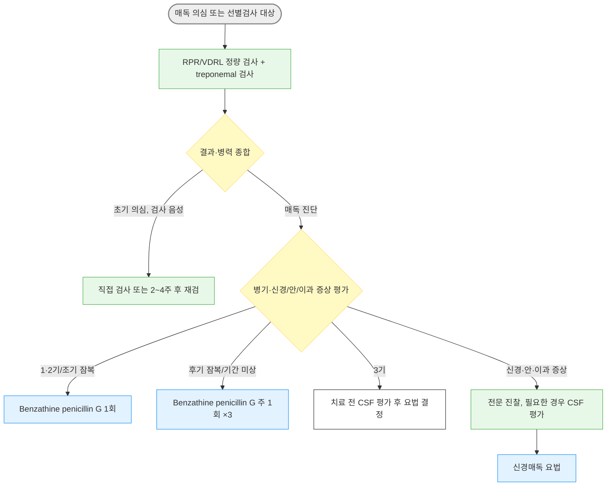

# 매독 Syphilis

## <mark style="color:green;">일반 사항</mark>

* 정의 : _Treponema pallidum_ 감염에 의한 만성 전신성 성매개질환
* 전염 경로 : 감염 병소에 대한 직접 접촉(성관계), 감염 산모의 경태반 수직감염(출산 중 산도 접촉에 의한 감염은 드묾); 수혈을 통한 전파는 극히 드묾
* 법정감염병 : 3급 (전수감시). 1기·2기·3기·조기 잠복·선천매독은 진단 후 24시간 이내 신고 대상 (☞ [성매개감염병](115_-1.STI.md))
* 국내 신고 현황 : 2024년 2,790명(인구 10만 명당 신고율 5.4명); 남성 78.0%, 20\~30대 58.6%; 병기별 조기 잠복매독 43.7%, 1기 35.2%, 2기 18.8%, 3기 1.8%, 선천매독 0.4%. 2025년에는 2,211명 신고. ✽2024년 전수감시 전환 및 신고 병기 확대 전후의 신고 건수는 단순 비교하지 않음

### <mark style="color:orange;">분류</mark>

<mark style="color:cyan;">**Early syphilis**</mark>

* primary syphilis, secondary syphilis, early latent syphilis를 포함
* 1기 병변(굳은궤양) 잠복기 : 평균 약 3주(10\~90일)

<mark style="color:cyan;">**Late syphilis**</mark>

* late latent syphilis, tertiary syphilis를 포함 (neurosyphilis는 병기와 무관하게 조기·후기 어느 시기에서나 발생 가능하여 별도로 분류)
* 초기 단계에서 치료되지 않으면 무증상의 late latent syphilis 또는 감염 합병증 단계(tertiary syphilis)로 진행
* 초감염 후 어느 시기(1\~30년)에서나 다양한 조직에서 증상이 발현될 수 있음

## <mark style="color:green;">원인 및 위험 인자</mark>

* 원인균 : _Treponema pallidum_ subsp. _pallidum_ - 나선형 스피로헤타(spirochete); 표준 배지에서 배양되지 않으며 병변의 직접 확인에는 암시야 현미경, 분자 진단 등을 이용
* 위험 요인
  * 콘돔 미사용 성관계, 다수의 성 파트너, 성매매 관련 접촉
  * 남성 동성 간 성접촉(MSM) - 국내외 모두 주요 위험군
  * HIV 감염 또는 기타 성매개질환(임질, 클라미디아 등) 동반
  * 최근 1년 내 세균성 성매개질환 진단 병력

## <mark style="color:green;">임상 양상</mark>

#### <mark style="color:$primary;">1기 매독 (Primary syphilis)</mark>

* 굳은 궤양(Chancre) : 대개 단일 무통성 papule로 시작 → 침식되고 단단한 바닥과 경계를 가진 궤양으로 진행. 다발성 또는 통증이 있는 병변도 가능
* 구강, 항문, 음경, 질 등에서 감염 후 2\~3주에 발생할 수 있으며 치료하지 않으면 몇 주간 지속될 수 있음
  * 구강 병변은 무통성인 경우가 많아 아프타성 궤양·인후염 등으로 오인되어 진단이 지연되기 쉬움
* 국소 림프절 종대 : 궤양 발생 1\~2주 후 주로 양측 서혜부에 무통성·고무 같고 단단한(rubbery) 양상으로 촉지됨(압통 없음)

#### <mark style="color:$primary;">2기 매독 (Secondary syphilis)</mark>

* 피부 발진 : 반, 구진, 구진비늘, 농포 등 다양한 형태; 손/발바닥 및 전신 분포; 대개 가려움이 없으나 예외 가능
* 편평콘딜로마(Condylomata lata) : 분홍색 또는 회백색, 넓고 짓무른 papules or plaques; 전염성이 높으며 2기 매독 환자의 10%에서 발생
* 전신 증상 : 발열, malaise, 인후통, 두통, 근육통, 관절통, 전신 림프절병증, 체중 감소, 탈모
* 신질환(사구체신염, 신증후군), 간질환(간염) 발생 가능

#### <mark style="color:$primary;">3기 매독 (Tertiary syphilis)</mark>

* 치료받지 않은 환자에서의 late syphilis; cardiovascular syphilis, gummatous syphilis를 포함한 증상 발생
* 고무종(Gumma) : 다양한 크기와 부위(피부, 피하, 골, 내장)의 결절; 궤양과 피부 괴사를 일으킬 수 있음

#### <mark style="color:$primary;">잠복매독 (Latent syphilis)</mark>

* 매독 혈청 검사는 양성이지만 1·2기 또는 3기 매독의 임상 증상이 없는 상태. 정의에 CSF 검사 결과는 포함되지 않음
* 조기 잠복매독 : 진단 전 1년 이내의 혈청전환, 이전 치료자에서 지속적인 역가 4배 상승, 명확한 1·2기 매독 증상 또는 조기 매독 파트너와의 접촉 등으로 최근 1년 내 감염을 뒷받침할 수 있는 경우
* 후기 잠복매독 : 감염 기간이 1년을 넘는 경우. 최근 1년 내 감염 근거가 없고 감염 시기를 알 수 없는 경우는 '기간 미상 잠복매독'으로 분류하고 후기 잠복매독과 같은 요법으로 치료. 역가만으로 조기 잠복매독을 판정하지 않음

#### <mark style="color:$primary;">신경매독 (Neurosyphilis)</mark>

* 감염 경과 중 어느 시기에나 발생 가능

<mark style="color:cyan;">**조기 신경매독 (Early neurosyphilis)**</mark>

* 뇌막염, 뇌혈관 질환(예: 수막염, 뇌졸중) : 두통, 혼돈, 구역, 구토, 경부 강직
* 시력 손실(홍채염, 포도막염), 청력 손실

<mark style="color:cyan;">**만기 신경매독 (Late neurosyphilis)**</mark>

* 뇌/척수 이환 : 치매, general paresis, tabes dorsalis

#### <mark style="color:$primary;">선천매독 (Congenital syphilis)</mark>

* 미치료 매독 임산부에서 태반을 통해 태아로 수직감염; 임신 시기·모체 병기와 무관하게 임신 전 기간에 걸쳐 발생 가능
* 조기 선천매독(생후 2년 이내) : 간·비장비대, 황달, 피부·점막 병변(수포성 발진, 비강 분비물\[snuffles]), 골연골염, 빈혈·혈소판감소증
* 후기 선천매독(2세 이후, 미치료 시) : Hutchinson 삼징후(간질성 각막염, 감각신경성 난청, Hutchinson 치아), 안장코(saddle nose), 검상경(sabre shin)
* 대부분 임신부 선별검사와 조기 치료로 예방 가능

### <mark style="color:$danger;">🚩 Red Flags!</mark>

<mark style="color:$danger;">**즉각 조치 또는 의뢰**</mark>

* 급성 시력 저하·안통(포도막염·망막염 의심), 급성 청력 소실
* 두통 + 발열 + 경부 강직, 또는 급성 신경학적 결손(뇌졸중 유사) → 조기 신경매독
* 임신부의 활동성 매독 확진 + 조기진통 또는 태아 이상 소견
* 신생아에서 선천매독 의심 소견(간비대, 황달, 피부병변, 비강 분비물 등) + 모체 매독 병력
* 치료 후 고열·저혈압·호흡곤란이 발생한 경우 : 심한 Jarisch-Herxheimer 반응 외에 아나필락시스·다른 급성 원인을 즉시 감별; 특히 임신부와 신경매독 환자

<mark style="color:$warning;">**당일~수일 내 평가**</mark>

* 서서히 진행하는 시력·청력 변화 또는 인지기능 저하 → 신경매독/안매독/이과매독
* HIV 선별검사 양성
* 3기 매독 소견(심혈관계 증상, 고무종)
* 임신부에서 매독 확진(응급 소견 무관)
* 모체가 임신 중 매독 치료를 받지 않았거나 치료 반응이 불충분했던 신생아(출생 시 무증상 포함)

<mark style="color:$info;">**외래 추적 / 추가 평가 계획**</mark> <mark style="color:$info;">- 즉각 위험 낮으나 호전 없으면 의뢰</mark>

* 치료 후 추적 역가의 감소가 불충분한 경우 : 병기·치료 전 역가·재노출·증상 등을 함께 평가하고 추적 계획 수립
* 적절한 치료 후 낮은 역가가 지속되는 serofast 상태 : 재노출·역가 상승 여부에 따라 평가

## <mark style="color:green;">진단</mark>

* 단일 검사로 확진되지 않으며 non-treponemal test와 treponemal-specific test를 조합해 해석
* 모든 매독 환자는 진단 시 반드시 HIV 검사를 시행함 - 결과에 따라 후속 진단·추적 전략이 달라짐

### <mark style="color:orange;">혈청 검사</mark>

#### <mark style="color:$primary;">Non-treponemal test</mark>

* RPR, VDRL
* cardiolipin-lecithin-cholesterol Ag 복합체에 대한 IgG 및 IgM Ab 측정
* 항체가와 질병 활성도에 상관관계가 있으므로 치료 반응 평가에 활용
* 같은 검사법의 역가가 2주 이상 지속하여 4배 이상 증가하면 재감염 또는 치료 실패를 시사. 4배 감소는 치료 반응 평가에 활용하되, 감소가 늦다는 이유만으로 즉시 실패로 판정하지 않음
* 치료 전 정량 RPR 또는 VDRL 역가를 기준값으로 확보하고, 추적에는 같은 검사법(가능하면 같은 검사실)을 사용. RPR과 VDRL 역가는 서로 직접 비교하지 않음


**Prozone phenomenon 주의** : 2기 매독처럼 항체가가 매우 높은 경우 검체를 희석하지 않으면 비-트레포네마 검사(RPR/VDRL)가 오히려 위음성으로 나올 수 있음. 2기 매독의 임상 증상이 뚜렷한데 RPR/VDRL이 음성이면 검사실에 혈청 희석 후 재검사를 시행


#### <mark style="color:$primary;">Treponemal-specific test</mark>

* FTA-ABS, TPPA, ICS, EIA
* 질병 활성도와 항체가의 상관관계는 없음
* 초기 위음성 가능
* 치료 후에도 대부분 평생 양성으로 남아 과거 감염을 반영하므로 치료 반응 평가에는 사용할 수 없음 - 해석 시 임상 경과와 함께 판단


**Reverse sequence screening** : EIA/CIA 양성이면 정량 RPR/VDRL을 시행하고, 음성이면 최초 검사와 다른 treponemal test(가급적 TPPA)로 확인. TPPA도 양성이면 과거 치료력·재노출·최근 감염 가능성을 확인하고, 치료력이 없으며 최근 감염 근거가 없으면 기간 미상 잠복매독으로 치료. TPPA 음성이고 임상적·역학적 가능성이 낮으면 추가 평가·치료가 불필요할 수 있음. ✽국내 지침은 두 종류의 혈청검사를 함께 시행하도록 제시하며, 실제 검사실의 선별 순서와 반사검사 정책을 확인


### <mark style="color:orange;">암시야 현미경 검사</mark>

* Darkfield microscopy of 생식기·항문 병변 : 병변에서 균을 직접 확인; 초기 혈청 검사 위음성 구간에서 유용. 구강 병변은 비병원성 스피로헤타와 구별이 어려워 통상 권장되지 않음


검사 민감도는 병기뿐 아니라 검사 종류, 병변의 지속 기간 및 비교 기준에 따라 달라진다. 특히 초기 1기 매독에서는 두 종류의 혈청검사가 모두 음성일 수 있고, 후기 잠복매독에서는 비-트레포네마 검사 민감도가 감소할 수 있다. 병변·노출력이 강하게 의심되면 초기 음성만으로 배제하지 않고 직접 검사 또는 2\~4주 후 재검을 고려한다.


### <mark style="color:orange;">CSF 검사 (신경매독 평가)</mark>

* CSF 평가가 필요한 경우 : 매독 환자의 뇌신경 이상, 수막염, 뇌졸중, 인지·의식 변화, 운동·감각 이상 등 신경학적 징후; 3기 매독의 치료 전 평가. 치료 후 재감염·치료 실패가 의심되며 신경학적 징후가 있거나 임상 상황상 신경매독 평가가 필요한 경우에도 고려
* 안과 증상 + 양성 매독 혈청검사 : 즉시 안과 진찰(뇌신경 검사 포함). 안매독이 확인되고 다른 신경학적 이상이 없다면 치료 전 CSF 검사는 필수가 아님. 뇌신경 이상이 있으면 CSF 평가
* 고립된 이과 증상 + 양성 혈청검사 + 정상 신경학적 진찰 : 이비인후과 협진; 치료 전 CSF 검사는 통상 불필요
* HIV 감염에서 CD4 ≤350/㎣ 또는 RPR ≥1:32라는 수치만으로 무증상 환자의 CSF 검사를 시행하지 않음. 신경·안·이과 진찰 소견에 따라 결정

### <mark style="color:orange;">감별</mark>

* 생식기 궤양·전신 발진을 일으키는 질환과의 감별

<table><thead><tr><th width="144.28570556640625">질환</th><th width="230">병변 특징</th><th>구분 포인트</th></tr></thead><tbody><tr><td><a href="../229_/181_-herpes-simplex.md#herpes-genitalis">생식기 헤르페스</a></td><td>유통성 다발성 수포·궤양</td><td>재발성, 국소 림프절 압통</td></tr><tr><td><a href="115_-1.STI.md#chancroid">연성하감</a></td><td>유통성 궤양, 화농성 기저부</td><td>서혜부 림프절병증(bubo) 동반, 국내 드묾</td></tr><tr><td>첨규콘딜롬(HPV)</td><td>사마귀양 병변</td><td>편평콘딜로마와 병변 형태로 구분(생검 필요시)</td></tr></tbody></table>

***



<p align="center"><strong>진단 및 병기별 치료 알고리듬</strong></p>

<p align="center"><em><mark style="color:$info;">Ref. 성매개감염 진료지침 2023; CDC STI Treatment Guidelines, 2021</mark></em></p>

***

## <mark style="background-color:$warning;">Management</mark>

* **병기에 따른 페니실린 제형 선택** : 신경·안·이매독이 없는 1·2기 및 잠복매독에는 benzathine penicillin G 근육주사가 표준. 신경·안·이매독에는 CSF에 도달하는 aqueous crystalline penicillin G 정맥주사 요법이 표준이며, benzathine 제형만으로 치료하지 않음. 3기 매독은 치료 전 CSF 평가 결과에 따라 요법 결정
* **Jarisch-Herxheimer 반응** : 치료 시작 24시간 이내 발열, 오한, 근육통, 두통이 나타날 수 있으며 페니실린 알레르기 반응이 아닌 치료에 대한 급성 반응임. 알레르기가 아니므로 이후 페니실린 재투여의 금기 사유가 되지 않음. 특히 조기 매독·신경매독·임신부에서 흔하며, 임신부에서는 조기진통을 유발할 수 있으므로 환자에게 사전 안내가 필요
* **Azithromycin은 매독 치료에 사용하지 않음** : _T. pallidum_의 macrolide 내성 및 치료 실패가 보고되어 대체제로 권장되지 않음

### <mark style="color:orange;">Early syphilis (1기·2기·조기 잠복매독)</mark>

**1차 선택제**

* benzathine penicillin G : 240만 U IM 1회 <mark style="color:blue;">[한올마이신주120만단위]</mark>
  * 비임신 조기 매독에서는 HIV 감염 여부와 무관하게 1회가 표준이며, 반복 투여로 치료 효과가 개선되지 않음. 임신부의 태아 치료를 위한 2차 투여 고려는 아래 별도 기술

**대체제** (페니실린 사용 불가 시; 비임신 환자에 한함)

* doxycycline : 100 ㎎ bid ×14일
* tetracycline : 500 ㎎ qid ×14일 (doxycycline 대비 위장관 부작용이 많아 순응도 낮음)
* ceftriaxone : 1 g qd IM/IV ×10일 (1·2기 매독에서 고려; 최적 용량·기간은 확립되지 않았으므로 전문의와 상의하고 밀착 추적)

**모니터링**

* 국내 지침 : 치료 후 1, 3, 6, 12개월에 임상 및 정량 비-트레포네마 검사 추적. CDC는 1·2기 매독에서 6, 12개월 평가를 권고하며, 재감염 위험이나 추적 소실 우려가 있으면 더 자주 검사
* 지속·재발 증상 또는 2주 이상 지속하는 역가 4배 증가(예: 1:8 → 1:32) 시 재감염/치료 실패를 평가하고 HIV 재검. 신경학적 소견 및 최근 성접촉력에 따라 CSF 평가 또는 재치료 결정
* 12개월에 역가가 4배 감소하지 않아도 자동으로 치료 실패는 아님(적절히 치료받은 1·2기 환자의 약 10\~20%에서 관찰). 초기 저역가·과거 치료력 등을 고려해 신경학적 진찰, 임상·혈청학적 추적을 지속하고 추적 불가능하거나 신경학적 소견이 있으면 추가 평가·재치료 고려
* Serofast state : 적절한 치료 후 역가가 낮은 수준에서 안정적으로 지속 양성인 상태. 반드시 먼저 4배 감소해야만 정의되는 것은 아니며, 과거 치료·기준 역가·재노출·증상·역가 추이를 함께 보고 재치료 여부 결정

### <mark style="color:orange;">Late syphilis (후기 잠복·3기 매독)</mark>

**1차 선택제**

* benzathine penicillin G : 240만 U qwk IM ×3주 (총 720만 U) <mark style="color:blue;">[한올마이신주120만단위]</mark>. 3기 매독에서는 치료 전 CSF 검사 결과가 정상인 경우에 적용; CSF 이상 시 신경매독 요법으로 치료

**페니실린 알레르기 시**

* 후기 잠복매독 또는 기간 미상 잠복매독(비임신) : doxycycline 100 ㎎ bid ×28일 또는 tetracycline 500 ㎎ qid ×28일. 밀착 임상·혈청 추적이 가능해야 하며, 순응도/추적이 불확실하면 탈감작 후 페니실린 고려
* Ceftriaxone은 후기 잠복매독에서 최적 용량·기간이 확립되지 않아 전문의와 상의. 3기 매독의 페니실린 대체 치료도 근거가 부족하므로 감염내과 등과 협의

**모니터링**

* 치료 후 6, 12, 24개월째 non-treponemal test 시행
* 역가가 2주 이상 지속하여 4배 상승하거나 증상이 재발하면 재감염·치료 실패를 평가하고 HIV 재검. CSF 검사는 신경학적 징후 등이 있으면 시행; 단순 역가 상승만으로 일률적으로 시행하지 않음
* 초기 역가가 높았고 24개월에도 충분히 감소하지 않으면 추적 가능성·병기·재노출 등을 검토해 재치료를 고려. 초기 저역가 환자에서는 감소 폭만으로 실패를 판정하지 않음
* 재투여 간격 : 최적 간격은 7\~9일
  * 비임신 성인은 10\~14일까지 허용되나 초과 시 전체 요법 재시작 고려
  * 임신부는 9일을 초과하면 예외 없이 처음부터 전체 3회 요법을 재시작해야 함

### <mark style="color:orange;">신경매독</mark>

**1차 선택제**

* aqueous penicillin G : 1,800\~2,400만 U/d 지속 점적, 또는 300\~400만 U q4hr IV ×10\~14일
* procaine penicillin G : 240만 U/d IM + probenecid 500 ㎎ PO qid, 각각 ×10\~14일 (투약 순응도를 보장할 수 있는 경우의 대안)

* 안매독·이매독(시력저하·포도막염·이명·난청 등)은 CSF 검사 결과와 무관하게 신경매독 요법과 동일하게 치료
* Procaine penicillin은 반드시 근육주사로 투여. 혈관 내 투여 시 중증 신경·정신 증상이 발생할 수 있음

**대체제**

* ceftriaxone : 1\~2 g qd IM/IV ×10\~14일 (페니실린 알레르기 시 전문의와 협의; 근거 제한)

**모니터링**

* non-treponemal test 추적
* HIV 미감염자 또는 효과적인 ART를 복용 중인 HIV 감염자에서 임상·혈청학적 반응이 충분하면 통상 CSF 재검사는 불필요. 반응이 불충분하거나 증상이 지속·재발하면 전문의와 재평가

### <mark style="color:orange;">HIV 동반 매독</mark>

* 치료 원칙은 HIV 음성 환자와 동일 - early syphilis에서 benzathine penicillin G 240만 U 단회 IM이 HIV 감염 여부와 무관하게 효과적임
* 1·2기 매독은 치료 후 3, 6, 9, 12, 24개월, 잠복매독은 6, 12, 18, 24개월에 임상·혈청학적 추적(CDC 기준)
* 신경·안·이과 진찰을 시행. CD4 ≤350/㎣ 또는 RPR ≥1:32만으로 무증상 환자의 CSF 검사를 시행하지 않음
* 매독 진단 시 미검사자는 반드시 HIV 검사 시행, 고위험군은 정기 재검 권고

### <mark style="color:orange;">임신부 매독</mark>

* 산전 선별검사 : 모든 임신부는 첫 산전 방문 시 매독 선별검사 시행; 매독 유병률이 높은 지역 또는 고위험군은 임신 28주경 및 분만 시 재검
* 치료 원칙 : 태아 치료와 선천매독 예방에 효과가 입증된 약제는 페니실린 G. 병기에 맞춰 benzathine penicillin G를 투여하며, 신경·안·이매독에서는 aqueous crystalline penicillin G 정맥주사 요법을 적용. 임신 중 doxycycline·tetracycline은 사용하지 않음
* 1·2기·조기 잠복매독에서는 태아 치료를 위해 최초 240만 U 투여 1주 후 240만 U IM 추가 투여를 고려할 수 있음. 임신 후반기 진단 시 태아 초음파 평가를 시행하되 치료를 지연하지 않음
* 페니실린 알레르기가 확인되어도 탈감작(desensitization) 후 페니실린 투여가 원칙(대체 요법의 태아 매독 예방 효과는 확립되지 않음)
* 치료 후 Jarisch-Herxheimer 반응이 조기진통·태아 심박수 이상을 유발할 수 있어 특히 임신 후반기에는 치료 후 관찰이 필요
* 임신 24주 이전 치료 시 치료 약 8주 후와 분만 시, 24주 이후 치료 시 분만 시 정량 역가 확인(CDC 기준). 재감염·치료 실패가 의심되면 더 일찍 검사. 분만 전 4배 감소가 없다는 사실만으로 치료 실패로 판정하지 않음
* 모체가 분만 30일 이내에 치료받았거나 치료가 불충분하면 신생아의 선천매독 평가가 필요. 모체 치료력, 분만 시 모자 정량 역가, 신생아 진찰을 바탕으로 신생아과/감염 전문가와 협의

### <mark style="color:orange;">성 파트너 관리</mark>

* mucocutaneous syphilitic lesion이 존재할 때 전염력이 있음

**평가 대상**

* 1기 매독 환자와 3개월 + 증상 지속 기간 내 접촉자
* 2기 매독 환자와 6개월 + 증상 지속 기간 내 접촉자
* 조기 잠복매독 환자와 1년 내 접촉자
* 후기 잠복매독 환자의 장기 성 파트너 : 임상·혈청학적 평가

**조치**

* 1기·2기·조기 잠복매독 환자의 진단 전 90일 이내 접촉자 : 혈청 검사가 음성이어도 조기 매독에 대한 추정 치료
* 90일 이전 접촉자 : 혈청 검사 음성이면 치료 불필요; 검사 결과를 즉시 확인할 수 없고 추적 방문도 불확실하면 조기 매독에 대한 추정 치료. 양성이면 파트너의 임상 소견과 병기에 따라 치료
* 파트너 추적이 어려운 경우 관할 보건소 등 공중보건기관에 협조 요청 가능

## <mark style="color:green;">비-약물 치료 및 예방</mark>

* 병변이 완전히 치유되고 치료가 끝날 때까지 성관계를 피하도록 안내
* 최근 성 파트너는 위 기준에 따라 검사·치료
* 진단 시 HIV·기타 성매개질환 동시 검사 권고
* 콘돔 사용으로 전파 위험 감소 (단, 병변이 콘돔으로 덮이지 않는 부위에 있으면 예방 효과 제한적)


**Doxy-PEP(노출 후 예방요법)** - CDC 2024 지침은 최근 12개월 내 매독·클라미디아·임질 진단 병력이 있는 MSM 및 트랜스젠더 여성에게 이득·위험을 상담하고 공동 의사결정으로 제공하도록 권고. 성관계 후 72시간 이내 doxycycline 200 ㎎ 1회(24시간 내 200 ㎎ 초과 금지); 정기 STI 검사와 내성·이상반응 평가 병행. 전체 환자에게 일률적으로 적용하는 예방책은 아님 (☞ [성매개감염병](115_-1.STI.md#doxy-pep))


***

## <mark style="color:red;">질병코드</mark>

A50 선천매독

A51 조기매독

A51.0 1기 생식기매독

A51.3 2기 매독의 피부 및 점막병변

A51.5 조기 잠복매독

A52 후기매독

A52.1 증상성 신경매독

A52.8 잠복성 후기매독

A53 기타 및 상세불명의 매독

A53.9 상세불명의 매독

***

## <mark style="color:purple;">처방례</mark>

> **처방례 1. Early syphilis (1기·2기·조기 잠복매독) 표준 치료**
>
> ```
> 한올마이신주120만단위  2V  1회 IM
> ```
>
> _✽ 240만 U 근육주사. 주사 부위·방법은 해당 제품 허가사항과 기관 지침에 따름; 주사 후 과민반응 관찰 및 Jarisch-Herxheimer 반응 사전 안내. 실제 공급 제품의 명칭·함량을 확인_

> **처방례 2. Early syphilis, 페니실린 사용 불가 시(비임신)**
>
> ```
> 독시사이클린 100 ㎎/C  2C  #2 ×14일
> ```
>
> _✽ 임신부는 doxycycline 금기 - 페니실린 탈감작 후 투여가 원칙; 순응도 확보를 위해 복용 완료까지 추적 안내_

> **처방례 3. Late syphilis (후기 잠복매독, 병기 불명)**
>
> ```
> 한올마이신주120만단위  2V  1주 간격 IM ×3회 (총 6V)
> ```
>
> _✽ 후기 잠복·기간 미상 잠복매독, 또는 치료 전 CSF 결과가 정상인 3기 매독에 적용. 1주 간격이 원칙(가능하면 7\~9일); 비임신 성인은 10\~14일 간격까지 허용 가능하나 더 지연되면 재시작 고려, 임신부는 9일 초과 시 처음부터 재시작_

> **처방례 4. 신경매독 의심 시**
>
> ```
> 입원 후 aqueous penicillin G 정주 요법 시행
> ```
>
> _✽ 신경학적 징후가 있으면 CSF 평가와 신속한 전문 치료를 위해 의뢰. 확인된 안매독 또는 고립된 이매독은 CSF 검사를 치료의 선행 조건으로 삼지 않으며 신경매독 요법으로 치료_

> **처방례 5. 임신부, 페니실린 알레르기(탈감작 후)**
>
> ```
> 알레르기내과/감염내과 협진 하 페니실린 탈감작 프로토콜 시행 후
> 한올마이신주120만단위  2V  1회 IM (병기에 따라 반복)
> ```
>
> _✽ 임신 중 doxycycline·tetracycline은 사용하지 않으며, 대체 요법의 태아 매독 예방 효과가 입증되지 않아 탈감작 후 페니실린 치료가 원칙. 탈감작은 모니터링 가능한 환경에서 시행; 1·2기·조기 잠복매독에서는 태아 치료를 위한 1주 후 추가 240만 U 투여를 고려_

***

### <mark style="color:$success;">핵심 복약 지도</mark>

> **페니실린 주사 전후 안내**
>
> 1. 주사 전 페니실린 알레르기 기왕력을 반드시 확인하십시오.
> 2. 주사 후 24시간 이내 발열·오한·근육통이 발생할 수 있음(Jarisch-Herxheimer 반응)을 미리 안내하고, 해열제로 대증 조절 가능함을 설명하십시오.
> 3. 전형적인 Jarisch-Herxheimer 반응은 알레르기가 아니므로 이후 페니실린 재투여의 금기 사유가 되지 않습니다. 두드러기·호흡곤란·저혈압이 나타나면 아나필락시스를 포함해 즉시 평가하십시오.
> 4. **임신부에서는 이 반응이 조기진통을 유발할 수 있어** 산과와 사전 협의가 필요합니다.

> **doxycycline 대체 요법 시**
>
> * 조기 매독은 14일, 후기 잠복·기간 미상 잠복매독은 28일 요법을 끝까지 복용하도록 강조 - 임의 중단 시 치료 실패 위험
> * 음식과 함께, 충분한 물과 함께 복용하고 복용 후 바로 눕지 않도록 안내

> **언제 다시 병원을 방문해야 하나요?**
>
> * 병기에 따라 예약된 정량 혈청검사에서 역가 변화 확인이 필요한 경우(치료 반응 평가 시점을 놓치지 않도록 예약)
> * 새로운 신경학적 증상(시력·청력 변화, 심한 두통)이 발생하는 경우 - 즉시 내원
> * 임신 중이거나 임신 계획이 있는 경우 - 즉시 산과 협진

***

## <mark style="color:blue;">환자 안내서</mark>


**매독, 조기에 발견하면 페니실린 주사로 완치할 수 있습니다**

매독은 성 접촉으로 전파되는 세균 감염증으로, 초기에 궤양이나 발진이 생겼다가 저절로 없어지기도 합니다. 하지만 치료하지 않으면 수년 뒤 신경계나 심장 등 여러 장기에 심각한 합병증을 일으킬 수 있어, 증상이 사라져도 반드시 진단·치료가 필요합니다.


### <mark style="color:$primary;">왜 매독에 걸리나요?</mark>

* 매독균이 감염 부위와의 직접 접촉(성 접촉)으로 전파됩니다.
* 초기 궤양은 통증이 없어 모르고 지나치기 쉽습니다.
* 임신 중 치료하지 않으면 태아에게도 감염될 수 있어(선천매독), 임신부는 반드시 선별검사와 치료가 필요합니다.

### <mark style="color:$primary;">치료는 어떻게 하나요?</mark>

* 일반적인 매독은 병기에 따라 페니실린 근육주사 1회 또는 1주 간격 3회로 치료합니다. 눈·귀·신경계에 침범한 경우에는 다른 주사 치료가 필요합니다.
* 주사 후 하루 이내 열이나 몸살 기운이 있을 수 있습니다. 두드러기·호흡곤란·어지럼과 함께 혈압이 떨어지는 느낌이 들면 즉시 진료받으십시오.

### <mark style="color:$primary;">치료 후 무엇을 확인하나요?</mark>

* 치료 후 정해진 날짜에 혈액검사를 반복해야 합니다. 조기 매독은 국내 지침에 따라 보통 1·3·6·12개월, 후기 잠복매독은 6·12·24개월에 확인합니다.
* 최근 성 파트너도 함께 검사·치료를 받아야 재감염을 막을 수 있습니다.
* 병변이 다 나을 때까지, 그리고 치료가 끝날 때까지 성관계를 피하십시오.

### <mark style="color:$primary;">이럴 때는 즉시 병원을 방문하세요</mark>

* 시력이나 청력에 변화가 생기는 경우
* 심한 두통이나 목이 뻣뻣해지는 느낌이 동반되는 경우
* 임신 중이거나 임신을 계획 중인 경우

***

## <mark style="color:green;">참고문헌</mark>

* 질병관리청·대한요로생식기감염학회. [성매개감염 진료지침 2023: 매독](https://stiguide.kr/%EB%A7%A4%EB%8F%85-syphilis/).
* CDC. [Sexually Transmitted Infections Treatment Guidelines: Syphilis](https://www.cdc.gov/std/treatment-guidelines/syphilis.htm), [Primary and Secondary Syphilis](https://www.cdc.gov/std/treatment-guidelines/p-and-s-syphilis.htm), [Latent Syphilis](https://www.cdc.gov/std/treatment-guidelines/latent-syphilis.htm), [Neurosyphilis, Ocular Syphilis, and Otosyphilis](https://www.cdc.gov/std/treatment-guidelines/neurosyphilis.htm), [Syphilis During Pregnancy](https://www.cdc.gov/std/treatment-guidelines/syphilis-pregnancy.htm).
* CDC. [Laboratory Recommendations for Syphilis Testing, United States, 2024](https://www.cdc.gov/mmwr/volumes/73/rr/rr7301a1.htm); [Doxycycline Postexposure Prophylaxis Guidelines, 2024](https://www.cdc.gov/mmwr/volumes/73/rr/rr7302a1.htm).
* 질병관리청. [매독 전수감시체계 전환 및 신고 현황(2026.8.19.)](https://kdca.go.kr/bbs/kdca/43/309126/download.do).
