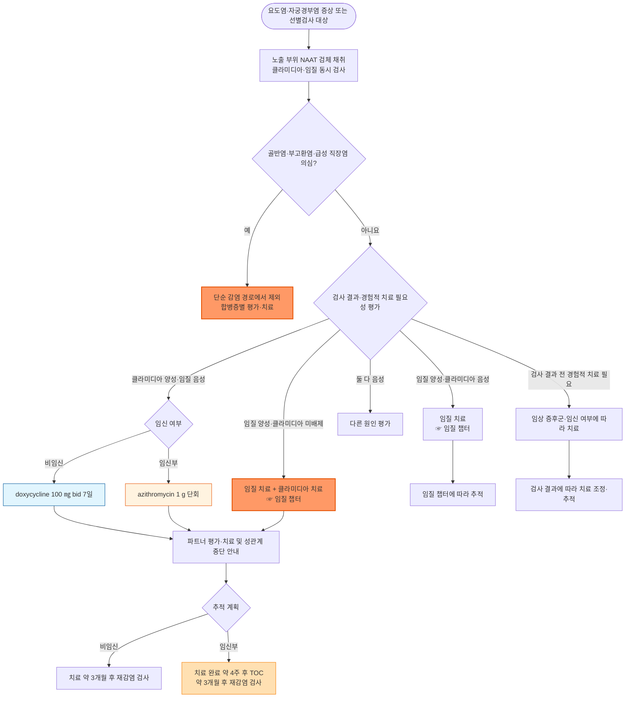

# 클라미디아감염증 Chlamydia Infection

## <mark style="color:green;">일반 사항</mark>

* 세포 내 기생 세균인 _Chlamydia trachomatis_(혈청형 D\~K)에 의한 비뇨생식기(요도염·자궁경부염)·직장·인두 감염; 성매개 세균 감염증이며 무증상 감염이 매우 흔함
* 법정감염병 : 4급 감염병 (표본감시) (☞ [성매개감염병](115_-1.STI.md))
* 역학 : \[우리나라] 표본감시 자료만으로 정확한 발생률 산출은 제한적이며, 클라미디아는 비임균성 요도염(NGU)의 주요 원인이고 25세 미만 성 활동 여성에서 흔함; \[미국 CDC] 2023년 신고율은 인구 10만 명당 492.2건으로 신고된 세균성 성매개감염 중 가장 많음
* 합병증 : 골반염(PID), 불임, 자궁외임신, 만성 골반통, Fitz-Hugh-Curtis 증후군(간주위염), 반응성 관절염, 신생아 결막염·폐렴(분만 중 수직감염)

## <mark style="color:green;">원인 및 위험 인자</mark>

* 원인균 : _Chlamydia trachomatis_ (혈청형 D\~K)
  * 혈청형 L1\~L3에 의한 성병림프육아종(lymphogranuloma venereum, LGV)은 별도 임상 질환으로 취급
* 전파 : 질·항문·구강 성교; 분만 시 산모에서 신생아로 수직감염
* 잠복기 : 1\~5주 (더 길게 보고되기도 함)

#### <mark style="color:$primary;">위험 인자</mark>

* 25세 미만 성 활동 여성
* 다수 성 파트너 또는 새 파트너
* 콘돔 미사용
* 성매개질환 기왕력
* 남성 동성 간 성접촉(직장감염 위험)

## <mark style="color:green;">임상 양상</mark>

* 여성 : 대부분(70\~90%) 무증상; 증상 시 점액농성 자궁경부염, 성교 후 출혈, 비정상 질출혈, 배뇨통
* 남성 : 요도염(투명\~점액성 분비물, 배뇨통); 약 50%는 무증상
* 직장 감염 : 대개 무증상이지만 직장통·분비물·출혈을 동반한 직장염 가능; 여성에서는 항문성교력이 없어도 비뇨생식기 감염과 함께 발견될 수 있음
  * 심한 직장통·혈성 분비물·후중감(tenesmus) 또는 궤양을 동반한 직장염, 혹은 심한 서혜부 림프절병증 시 → LGV(혈청형 L1\~L3) 고려(특히 MSM); 두 양상이 반드시 함께 나타나지는 않음
* 인두 감염 : 대개 무증상
* 결막염 : 자가접종(autoinoculation, 눈-손 접촉)으로 발생 가능
* 신생아 결막염(생후 5\~12일), 폐렴(생후 1\~3개월) : 산모 감염에서 분만 중 수직감염; 신생아 예방적 erythromycin 안연고는 임균성 결막염 예방 목적이며 클라미디아 결막염을 예방하지 못함

### <mark style="color:$danger;">🚩 Red Flags!</mark>

<mark style="color:$danger;">**즉각 조치 또는 의뢰**</mark>

* 심한 골반·하복부 통증, 복막자극징후 또는 전신상태 악화 → 골반염(PID), 난관-난소농양 등 응급 평가; 발열이 없어도 골반염 가능
* 임신 가능성 또는 임신 반응 양성 + 복통·질출혈·실신 중 하나 → 자궁외임신 배제

<mark style="color:$warning;">**당일~수일 내 평가**</mark>

* 골반·하복부 통증과 자궁경부 움직임 압통·자궁 압통·부속기 압통 중 하나 → 골반염 평가(당일); 발열은 필수 조건이 아님
* 상복부, 특히 우상복부 통증과 골반염 의심 소견 → Fitz-Hugh-Curtis 증후군 평가(당일)
* 생후 수 주 영아의 결막염 또는 1\~3개월 영아의 폐렴 → 산모 감염력이 확인되지 않아도 소아과 평가(당일)
* 새로 발생한 관절염, 특히 최근 요도염·자궁경부염·결막염 병력 → 반응성 관절염 평가; 세 증상이 모두 필요한 것은 아님
* 임신부에서 확진 → 치료를 지연하지 말고 산전 진료와 연계(당일)
* 혈성 분비물·후중감·궤양을 동반한 직장염 또는 심한 서혜부 림프절병증(특히 MSM) → LGV 평가 및 경험적 치료 고려(당일)
* 표준 치료 후 증상 지속·재발 → 재노출, 복약, 골반염·부고환염 및 다른 원인 평가

<mark style="color:$info;">**외래 추적**</mark>

* 임신부 : 치료 완료 약 4주 후 NAAT 완치판정검사, 치료 약 3개월 후 재감염 검사
* 비임신 환자 : 치료 약 3개월 후 재감염 검사(완치판정검사와 구분)

## <mark style="color:green;">진단</mark>

* NAAT(핵산증폭검사)가 표준&#x20;
  * 검체 채취 방법 : 남성 - 첫 소변(first-catch urine) 또는 요도 면봉; 여성 - 질 면봉(자가 채취 포함, 민감도 우수)
* 직장 노출 또는 직장염 증상이 있으면 직장 검체 NAAT를 고려; 여성의 직장 감염은 항문성교력이 없어도 동반될 수 있음. 소변 검사만으로 직장 감염은 배제되지 않음
* 무증상 인두 클라미디아의 일상 선별검사는 권고되지 않음. 인두 임질 검사에서 클라미디아가 함께 검출되면 치료하고, 인두 증상이 있으면 임상 상황과 사용 가능한 검사를 고려
* 임질 동시 검사 권고 - 공동감염이 흔함
* HIV·매독 동시 검사 권고 - STI 발생 시 다른 STI 감염 위험도 함께 상승
* 선별검사 대상 : 25세 미만 성 활동 여성(매년), 25세 이상 위험 요인이 있는 여성 등; 첫 산전 방문에서는 25세 미만 전원과 25세 이상 위험군을 선별하고 이 대상은 임신 3분기에 재검사
* 고위험 MSM : 위험도에 따라 요도·직장 등 해당 부위의 3\~6개월 간격 검사 고려; 무증상 인두 클라미디아 검사만을 정기적으로 시행하지는 않음

### <mark style="color:orange;">감별</mark>

* 요도염·자궁경부염을 일으키는 다른 원인과의 감별

<table><thead><tr><th width="246.19049072265625">핵심 소견</th><th width="155.238037109375">시사 질환</th><th>구분 포인트</th></tr></thead><tbody><tr><td>그람 염색에서 그람음성 쌍구균 확인, 화농성 분비물</td><td>임질</td><td>클라미디아보다 잠복기가 짧고(3\~9일) 증상이 뚜렷한 경우가 많음</td></tr><tr><td>거품성·악취 분비물</td><td>트리코모나스 질염</td><td>습식도말에서 운동성 원충</td></tr><tr><td>무통성 단일 궤양 선행력</td><td>매독</td><td>혈청검사로 확인</td></tr><tr><td>혈성 분비물·후중감·궤양을 동반한 직장염 또는 심한 서혜부 림프절병증(특히 MSM)</td><td>LGV, 혈청형 L1~L3</td><td>일반 클라미디아 NAAT로 LGV 여부를 구분할 수 없음; 임상적 의심 시 유전자형 검사 가능 기관과 협의하되 치료 지연은 피함</td></tr></tbody></table>

***



<p align="center"><strong>진단 및 치료 알고리듬</strong></p>

<p align="center"><em><mark style="color:$info;">Ref. 질병관리청·대한요로생식기감염학회, 성매개감염 진료지침 2023; CDC Sexually Transmitted Infections Treatment Guidelines, 2021; 2025 European Guideline on the Management of Chlamydia trachomatis Infections (IUSTI)</mark></em></p>

***

## <mark style="background-color:$warning;">Management</mark>


* 단순 감염의 권고 1차 치료제 : 비임신 성인·청소년은 doxycycline 100 ㎎ bid 7일. 특히 직장 감염에서 azithromycin 1 g 단회보다 치료 성공률이 높아 우선 권고됨; azithromycin은 순응도가 우려되는 비임신 환자의 대안 또는 임신부의 1차 치료제 \[국내 지침 2023, CDC 2021, IUSTI 2025]
* 골반염·부고환염·급성 직장염·LGV 등 합병증이나 별도 증후군이 의심되면 아래 단순 감염 7일 요법을 그대로 적용하지 않고 해당 질환의 치료 지침을 따름

<table><thead><tr><th width="213.33331298828125">대상</th><th width="225.71435546875">1차 치료</th><th>대안·주의</th></tr></thead><tbody><tr><td>비임신 성인·청소년의 단순 감염</td><td>doxycycline 100 ㎎ bid 7일</td><td>azithromycin 1 g 단회(7일 요법 순응도가 크게 우려될 때); 직장 감염에 대한 치료 효과가 낮을 수 있음</td></tr><tr><td>임신부의 단순 감염</td><td>azithromycin 1 g 단회</td><td>amoxicillin 500 ㎎ tid 7일</td></tr><tr><td>임질 양성이고 클라미디아가 확인되었거나 배제되지 않은 경우</td><td>임질 치료 + 해당 클라미디아 치료</td><td>클라미디아 음성 확인 시 임질 치료만 시행. ☞ <a href="115_-2.gonorrhea.md">임질</a></td></tr></tbody></table>

## <mark style="color:green;">비-약물 치료 및 예방</mark>

* 성관계 금지 기간 : doxycycline 7일 요법은 치료를 모두 마칠 때까지, azithromycin 단회 요법은 복용 후 7일까지, 그리고 모든 파트너의 치료가 완료되고 증상이 소실될 때까지 성관계를 피함. 임질 동시 감염에서는 임질 치료 후 최소 7일 경과 조건도 충족해야 함
* 국내·CDC 지침에 따라 증상 시작 또는 진단 전 60일 이내 성 파트너는 증상 유무와 관계없이 평가·검사 및 경험적 치료; 60일 내 접촉이 없었다면 그 이전의 가장 최근 파트너도 평가·치료. 파트너가 직접 진료받도록 안내
* 콘돔 사용으로 재감염 위험 감소
* 치료 약 3개월 후 재검사 권고(재감염 확인 목적). 비임신 환자는 완치판정검사를 통상 시행하지 않지만, 복약 불확실·증상 지속·재감염 의심 시 고려하며 시행할 때는 치료 완료 4주 이전의 NAAT를 피함

✽ IUSTI 2025는 파트너를 검사하고 양성 또는 검사 창기간 노출 시 치료하도록 제시하여 국내·CDC의 최근 60일 파트너 경험적 치료 권고와 접근이 다름. 위 파트너 관리 문구는 국내·CDC 지침을 기준으로 함.


**Doxy-PEP(노출 후 예방요법)** - 모든 환자에게 적용하는 예방요법은 아님. CDC 2024는 최근 12개월 내 세균성 STI가 있었던 MSM 및 트랜스젠더 여성에서 상담과 공유 의사결정을 권고함. 해당 대상에서 성접촉 후 72시간 이내 doxycycline 200 ㎎을 사용하며 24시간에 200 ㎎을 초과하지 않음 (☞ [성매개감염병](115_-1.STI.md))


## <mark style="color:green;">약물 치료</mark>

**1차 선택제**

* doxycycline : 100 ㎎ bid 7일 <mark style="color:blue;">\[독시사이클린]</mark>; 비임신 성인·청소년의 단순 비뇨생식기·직장·인두 감염에 1차로 권고됨. azithromycin 대비 우월성은 특히 직장 감염에서 분명함

**대안 및 임신부**

* azithromycin <mark style="color:blue;">\[지스로맥스]</mark>: 1 g 단회; 임신부 1차, 또는 치료 순응도가 우려되는 비임신 환자의 대안(직접 복용 확인 가능 시)&#x20;
* amoxicillin : 500 ㎎ tid 7일; 임신부에서 azithromycin 사용이 어려운 경우 대안

***

### <mark style="color:red;">질병코드</mark>

A56.0 하부 비뇨생식기의 클라미디아 감염

A56.1 골반 및 기타 비뇨생식기관의 클라미디아 감염

A56.2 비뇨생식기의 상세불명 부위의 클라미디아 감염

A56.3 항문 및 직장의 클라미디아 감염

A56.4 인두의 클라미디아 감염

A56.8 기타 부위의 성행위로 전파되는 클라미디아 감염

A55 성병림프육아종(LGV)

***

## <mark style="color:purple;">처방례</mark>

> **처방례 1. 비임신 성인 표준 치료**
>
> ```
> 독시사이클린 100 ㎎/T  1T bid  7일간
> ```
>
> _✽ 충분한 물과 함께 복용하고 복용 후 최소 30분간 눕지 않도록 안내(식도 자극 예방). 속이 불편하면 음식과 함께 복용할 수 있음; 특히 직장 감염에서 azithromycin보다 치료 성공률이 높음._

> **처방례 2.** **임신부**
>
> ```
> 지스로맥스 250 ㎎/T  4T(총 1 g)  1회 경구
> ```
>
> _✽ 국내 성매개감염 진료지침은 임신 중 클라미디아 치료에 doxycycline을 권장하지 않으며 azithromycin 단회 요법을 1차로 권고함. CDC는 doxycycline을 치아 착색 위험 때문에 임신 2·3분기 금기로 명시함. 치료 완료 약 4주 후 NAAT 완치판정검사 및 약 3개월 후 재검사를 계획._

> **처방례 3. 임질 확인·의심 + 클라미디아 확인 또는 아직 배제되지 않은 비임신 성인**
>
> ```
> 트리악손 주 500 ㎎  IM  1회
> 독시사이클린 100 ㎎/T  1T bid  7일간
> ```
>
> _✽ 체중 ≥150 ㎏이면 ceftriaxone 1 g IM 사용(☞ [임질](115_-2.gonorrhea.md)). 클라미디아가 음성으로 확인되었으면 독시사이클린을 추가하지 않음. 임신부에서 클라미디아가 확인되었거나 배제되지 않은 경우에는 ceftriaxone 500 ㎎ IM(체중 ≥150 ㎏이면 1 g) + azithromycin 1 g 단회 경구를 고려. 골반염·부고환염·급성 직장염 의심 시에는 해당 증후군의 치료 지침을 따름._

> **처방례 4. 치료 순응도가 우려되는 경우(추적 어려운 환자)**
>
> ```
> 지스로맥스 250 ㎎/T  4T(총 1 g)  1회 경구, 진료실 내 직접 복용 확인(DOT)
> ```
>
> _✽ 7일 요법 완주가 어려울 것으로 예상되는 환자에서 단회 요법으로 순응도 확보; 직장 감염이 있거나 배제되지 않은 경우 doxycycline 대비 치료 실패 위험이 높음을 설명하고 치료 후 증상·재노출·복약 상황을 확인._

> **처방례 5. 성병성 림프육아종증(LGV) 의심 또는 확인**
>
> ```
> 독시사이클린 100 ㎎/T  1T bid  21일간
> ```
>
> _✽ 표준 7일 요법이 아닌 21일 요법이 필요(CDC 2021, 국내 지침 2023); 혈성 분비물·후중감·궤양을 동반한 직장염 또는 심한 서혜부 림프절병증 등 LGV가 임상적으로 의심되면 유전자형 검사 결과를 기다리느라 치료를 지연하지 않음. 성매개감염 전문 진료기관 협진 권장._

***

### <mark style="color:$success;">핵심 복약 지도</mark>

> **독시사이클린 복용 안내**
>
> 1. 충분한 물(최소 한 컵)과 함께 복용하십시오. 속이 불편하면 음식과 함께 복용할 수 있습니다.
> 2. 복용 후 최소 30분간 눕지 마십시오 - 식도 자극·궤양 예방. 취침 직전에는 복용하지 마십시오.
> 3. 복용 기간 중 강한 직사광선 노출을 피하고 자외선 차단제를 사용하십시오(광과민 반응 가능).
> 4. 유제품·제산제·철분제·칼슘/마그네슘 영양제·아연 함유 종합비타민과 함께 복용하지 마십시오(2가/3가 금속 이온에 의한 흡수 저하) - 2시간 이상 간격을 두십시오.

> **공통 안내**
>
> * 증상이 좋아져도 처방된 기간까지 약을 모두 복용하십시오.
> * 7일 요법은 치료를 모두 마칠 때까지, 단회요법은 복용 후 7일까지 성관계를 피하십시오. 파트너도 치료를 마치고 증상이 있다면 소실될 때까지 피해야 합니다.
> * 증상 시작 또는 진단 전 60일 이내 성 파트너는 증상이 없어도 평가·검사 및 치료를 받아야 합니다. 그동안 접촉이 없었다면 가장 최근 파트너도 진료받도록 안내하십시오.
> * 치료 후 3개월 뒤 재검사를 권장합니다(대부분 치료 실패보다 재감염 확인 목적).
> * 임신부는 치료 완료 약 4주 후 완치판정검사도 받아야 합니다.

> **언제 다시 병원을 방문해야 하나요?**
>
> * 새로 심한 아랫배 통증, 복막자극 증상, 심한 음낭 통증 또는 전신상태 악화가 생기면 즉시 진료받으십시오.
> * 치료 후에도 증상이 지속되거나 다시 나타나면 조기에 재평가받으십시오(재노출·복약 불이행·골반염·부고환염 및 다른 원인 감별).
> * 임신 중이거나 임신 계획이 있다면 처방 전 알리십시오.
> * 파트너가 아직 치료받지 못했다면 성관계를 피하고 파트너가 직접 진료·치료받도록 안내하십시오.

***

### <mark style="color:blue;">환자 안내서</mark>


**클라미디아감염증, 증상이 없어도 치료가 필요합니다**

클라미디아는 흔한 성매개 세균 감염 중 하나이며, 특히 여성의 상당수는 아무 증상이 없습니다. 증상이 없다고 해서 안전한 것은 아니며, 방치하면 골반염이나 불임 같은 합병증으로 이어질 수 있습니다.


#### <mark style="color:$primary;">왜 클라미디아에 걸리나요?</mark>

* 클라미디아균이 성 접촉(질·항문·구강)을 통해 전파됩니다.
* 감염되어도 증상이 없는 경우가 많아, 본인도 모르게 다른 사람에게 옮길 수 있습니다.
* 항문성교를 했거나 직장 증상이 있다면 직장 검사가 필요한지 상담하십시오. 소변 검사만으로 직장 감염을 확인할 수 없습니다. 목의 클라미디아는 증상이 없을 때 일률적으로 검사하지 않으며, 검사 필요성은 진료 상황에 따라 판단합니다.

#### <mark style="color:$primary;">일상생활에서 어떻게 관리하나요?</mark>

* **7일 복용 약은 복용을 마칠 때까지, 단회 복용 약은 복용 후 7일간 성관계를 피하십시오. 파트너의 치료가 끝나고 증상도 없어져야 합니다.**
* 치료를 받았더라도 이전 성 파트너가 치료받지 않으면 다시 감염될 수 있습니다. 최근 성 파트너도 함께 검사·치료를 받아야 재감염을 막을 수 있습니다.
* 치료 후 3개월 뒤 다시 검사받는 것이 좋습니다(치료가 실패해서가 아니라, 다시 노출되어 재감염되는 경우가 많기 때문입니다).

#### <mark style="color:$primary;">약은 어떻게 써야 하나요?</mark>

* 처방된 항생제는 증상이 없어져도 끝까지 복용하십시오.
* 독시사이클린은 충분한 물과 함께 복용하고, 복용 후 바로 눕지 마십시오. 속이 불편하면 음식과 함께 복용할 수 있습니다. 취침 직전에는 복용하지 마십시오.

#### <mark style="color:$primary;">이럴 때는 즉시 병원을 방문하세요</mark>

* 심한 아랫배 통증, 어지럼·실신, 심한 음낭 통증 또는 전신상태 악화가 생기는 경우(열이 없어도 해당)
* 임신 가능성이 있거나 임신 중인데 아랫배 통증·질출혈이 생기는 경우

치료 후에도 증상이 좋아지지 않거나 다시 나타나면 조기에 진료받으십시오. 임신 중 확진되었다면 치료 완료 약 4주 후 완치 여부를 확인하고 약 3개월 후 재검사를 받으십시오.
