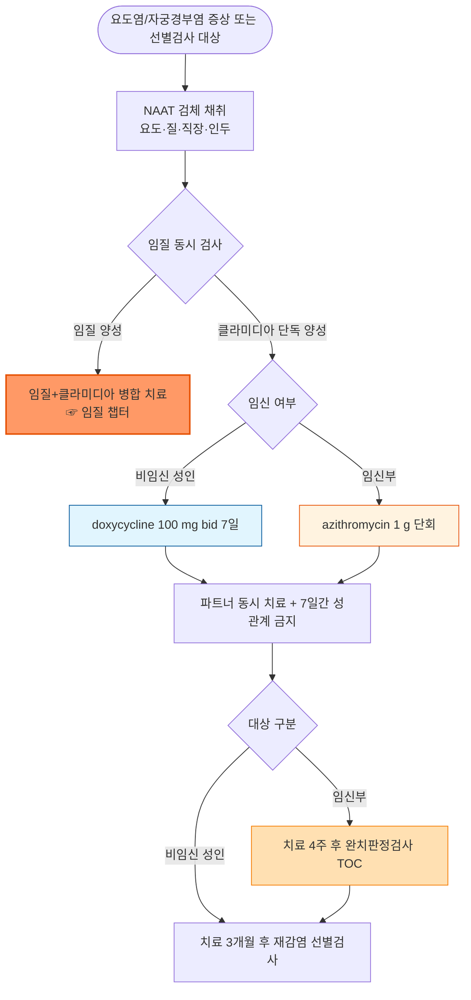

# 클라미디아 Chlamydia

## <mark style="color:green;">일반 사항</mark>

* _Chlamydia trachomati&#x73;_&#xC5D0; 의한 성매개 세균 감염증으로, 요도염·자궁경부염을 주로 일으키며 무증상 감염이 매우 흔함
* 다른 이름 : chlamydial infection, genital chlamydia
* 정의 (CDC STI Treatment Guidelines, 2021) : 세포 내 기생 세균인 _C. trachomatis_(혈청형 D\~K)에 의한 비뇨생식기·직장·인두 감염. 혈청형 L1\~L3에 의한 성병성 림프육아종증(LGV)은 별도 질환으로 취급
* 분류 : 비임균성 요도염(NGU)의 최다 원인균; 무증상형(대다수) vs 증상형
* 유병률 : 국내외를 막론하고 보고되는 세균성 성매개감염 가운데 가장 흔함; 25세 미만 성 활동 여성에서 특히 흔함
* 합병증 : 골반염(PID), 불임, 자궁외임신, 만성 골반통, Fitz-Hugh-Curtis 증후군(간주위염), 반응성 관절염, 신생아 결막염·폐렴(분만 중 수직감염)
* 법정감염병 : 4급 감염병(표본감시)

## <mark style="color:green;">원인 및 위험 인자</mark>

* 원인균 : _Chlamydia trachomatis_ (혈청형 D\~K)
* 전파 : 질·항문·구강 성교; 분만 시 산모에서 신생아로 수직감염
* 잠복기 : 1\~5주 (더 길게 보고되기도 함)

#### <mark style="color:$primary;">위험 인자</mark>

* 25세 미만 성 활동 여성
* 다수 성 파트너 또는 새 파트너
* 콘돔 미사용
* 성매개질환 기왕력
* 남성 동성 간 성접촉(직장감염 위험)

## <mark style="color:green;">임상 양상</mark>

* 여성 : 대부분(70\~90%) 무증상; 증상 시 점액농성 자궁경부염, 성교 후 출혈, 비정상 질출혈, 배뇨통
* 남성 : 요도염(투명\~점액성 분비물, 배뇨통); 약 50%는 무증상
* 직장 감염 : 대개 무증상이나 직장통·분비물·출혈을 동반한 직장염 가능(항문성교자)
  * 심한 직장통·혈성 분비물·후중감(tenesmus) + 서혜부 림프절병증 동반 시 → 통상적 클라미디아 직장염과 달리 LGV(혈청형 L1\~L3)에 의한 출혈성 직장결장염 가능성 고려(특히 MSM에서 보고 증가)
* 인두 감염 : 대개 무증상
* 신생아 : 결막염(생후 5\~12일), 폐렴(생후 1\~3개월) - 산모 감염에서 분만 중 수직감염; 신생아 예방적 안연고(erythromycin)는 임균성 결막염 예방 목적이며 클라미디아 결막염을 완전히 예방하지 못함
* 성인 결막염 : 자가접종(autoinoculation, 눈-손 접촉)으로 발생 가능

***

### <mark style="color:$danger;">🚩 Red Flags!</mark>

<mark style="color:$danger;">**즉각 조치 또는 의뢰**</mark>

* 하복통 + 발열 + 부속기 압통 → 골반염(PID), 난관-난소농양 의심 → 즉시 부인과 평가
* 우상복부 통증 동반 → Fitz-Hugh-Curtis 증후군(간주위염) 의심
* 임신 반응 양성 + 질출혈 + 복통 → 자궁외임신 감별 필요 → 즉시 산부인과 의뢰

<mark style="color:$warning;">**당일 또는 조기 의뢰**</mark>

* 생후 수 주 영아의 결막염 또는 폐렴 + 산모 클라미디아 감염력 → 소아과 의뢰
* 관절염 + 결막염 + 요도염(triad) → 반응성 관절염 의심 → 류마티스내과 협진
* 임신부에서 확진 → 산과 협진(수직감염 예방)
* 심한 직장통·혈성 분비물·서혜부 림프절병증(특히 MSM) → LGV 의심 → 성매개감염 전문 진료기관 의뢰(혈청형 확인 및 장기 치료 필요)

<mark style="color:$info;">**외래 추적 / 추가 평가 계획**</mark> <mark style="color:$info;">- 즉각 위험 낮으나 호전 없으면 의뢰</mark>

* 치료 후 3개월 재검사 미시행 - 대부분 치료 실패보다 재감염(재노출) 확인 목적으로 안내
* 임신부는 치료 4주 후 test-of-cure 시행. 비임신 성인은 원칙적으로 시행하지 않으며, 순응도 불량·증상 지속·재감염 의심 시에만 고려
* 표준 치료 후에도 증상 지속 - 재감염·치료 실패·M. genitalium 등 동반감염 감별

## <mark style="color:green;">진단</mark>

* NAAT(핵산증폭검사)가 표준 : 남성은 first-catch urine 또는 요도 swab, 여성은 질 swab(자가 채취 포함, 민감도 우수)으로 검체 채취
* 직장·인두 노출력이 있으면 해당 부위도 함께 검사 - 소변 검사만으로는 직장·인두 감염이 배제되지 않음
* 임질 동시 검사 권고 - 공동감염이 흔함
* HIV·매독 동시 선별검사 권고 - 성매개질환 확진 시 다른 성매개감염 위험도 함께 상승
* 선별검사 대상 : 25세 미만 성 활동 여성(매년), 고위험군, 산전 검사(초기 방문 시 전원 선별; 25세 미만이거나 위험 요인이 있으면 임신 3분기에 재검사)
* 고위험 MSM : 노출 부위(요도·직장·인두)에 대해 3\~6개월 간격 정기 선별 고려

### <mark style="color:orange;">감별 진단</mark>

* 요도염·자궁경부염을 일으키는 다른 원인과의 감별

<table><thead><tr><th width="170">핵심 소견</th><th width="200">시사 질환</th><th>구분 포인트</th></tr></thead><tbody><tr><td>그람 염색에서 그람음성 쌍구균 확인, 화농성 분비물</td><td>임질</td><td>클라미디아보다 잠복기 짧고(3\~9일) 증상 뚜렷한 경우多</td></tr><tr><td>거품성·악취 분비물</td><td>트리코모나스 질염</td><td>습식도말에서 운동성 원충</td></tr><tr><td>무통성 단일 궤양 선행력</td><td>매독</td><td>혈청검사로 확인</td></tr><tr><td>심한 직장통·혈성 분비물+서혜부 림프절병증(주로 MSM)</td><td>성병성 림프육아종증(LGV, 혈청형 L1\~L3)</td><td>일반 NAAT은 LGV 여부를 구분하지 못함 - 임상적으로 의심되면 유전자형 검사 가능 기관 의뢰 (☞ 처방례 5)</td></tr></tbody></table>

***



<p align="center"><strong>진단 및 치료 알고리듬</strong></p>

<p align="center"><em><mark style="color:$info;">Ref. CDC Sexually Transmitted Infections Treatment Guidelines, 2021; 2025 European Guideline on the Management of Chlamydia trachomatis Infections (IUSTI)</mark></em></p>

***

## <mark style="background-color:$warning;">Management</mark>


**1차 치료제가 바뀌었습니다 (2021년 CDC 지침, 2025년 유럽 IUSTI 지침에서도 재확인)**

과거 1차로 쓰이던 azithromycin 단회 요법은 직장 감염을 포함한 전체 감염 부위에서 doxycycline 대비 치료 실패율이 높다는 근거가 축적되어, 현재는 **doxycycline 100 ㎎ bid 7일**이 비임신 성인의 1차 선택제이고 azithromycin은 대안(순응도 문제 시) 또는 임신부 1차로 위치가 바뀌었습니다. 2025년 유럽(IUSTI) 클라미디아 관리 지침에서도 요도·자궁경부·직장·인두 감염 전반에서 doxycycline을 azithromycin보다 우선하도록 권고해 이 원칙을 재확인했습니다.


<table><thead><tr><th width="140">대상</th><th width="220">1차 치료</th><th>대안</th></tr></thead><tbody><tr><td>비임신 성인·청소년</td><td>doxycycline 100 ㎎ bid 7일</td><td>azithromycin 1 g 단회 (순응도 우려 시)</td></tr><tr><td>임신부</td><td>azithromycin 1 g 단회</td><td>amoxicillin 500 ㎎ tid 7일</td></tr><tr><td>임질이 확인되었거나 경험적으로 배제되지 않는 경우</td><td>임질 치료 + 위 클라미디아 치료 병행</td><td>(☞ 임질 챕터)</td></tr></tbody></table>

## <mark style="color:green;">비-약물 치료 및 예방</mark>

* 성관계 금지 기간 : 7일 요법(doxycycline)은 치료를 모두 마칠 때까지, 단회요법(azithromycin)은 복용 후 7일까지, 그리고 파트너의 치료가 완료될 때까지 성관계를 피함
* 최근 60일 이내 성 파트너는 증상 유무와 관계없이 검사·동시 치료
* 콘돔 사용으로 재감염 위험 감소
* 치료 후 3개월 재검사 권고(대부분 치료 실패보다 재감염 확인 목적; 치료 실패 확인이 아님)


**Doxy-PEP(노출 후 예방요법)** - 세균성 STI(매독·클라미디아·임질) 공통 예방 전략으로, 클라미디아 감염 감소 효과가 가장 크게 보고됨 (☞ [성매개질환 총론](115_-1.STI.md)) 참조


## <mark style="color:green;">약물 치료</mark>

### <mark style="color:orange;">1차 선택제</mark>

* doxycycline 100 ㎎ bid 7일 : 전 감염 부위(요도·자궁경부·직장·인두)에서 azithromycin보다 치료 성공률이 높아 1차로 권고됨 <mark style="color:blue;">\[독시사이클린]</mark>

### <mark style="color:orange;">대안 및 임신부</mark>

* azithromycin 1 g 단회 : 임신부 1차, 또는 치료 순응도가 우려되는 비임신 환자의 대안(직접 복용 확인 가능 시) <mark style="color:blue;">\[지스로맥스]</mark>
* amoxicillin 500 ㎎ tid 7일 : 임신부에서 azithromycin 사용이 어려운 경우 대안

***

### <mark style="color:red;">질병코드</mark>

A56.0 하부 비뇨생식기의 클라미디아 감염

A56.1 골반 및 기타 비뇨생식기관의 클라미디아 감염

A56.2 비뇨생식기의 상세불명 부위의 클라미디아 감염

A56.3 항문 및 직장의 클라미디아 감염

A56.4 인두의 클라미디아 감염

***

## <mark style="color:purple;">처방례</mark>

> **처방례 1.** 비임신 성인 표준 치료
>
> ```
> 독시사이클린 100 ㎎/T  1T bid  7일간
> ```
>
> _✽ 음식과 함께 복용, 충분한 물과 함께 복용 후 최소 30분간 눕지 않도록 안내(식도 자극 예방); 직장·인두 감염을 포함해 azithromycin보다 치료 성공률이 높음(CDC 2021)_

> **처방례 2.** 임신부
>
> ```
> 지스로맥스 250 ㎎/T  4T(총 1 g)  1회 경구
> ```
>
> _✽ doxycycline은 임신 중 금기(치아·골격 영향); 임신부는 azithromycin 단회 요법이 1차_

> **처방례 3.** 임질 동시 감염 의심 또는 배제되지 않은 경우
>
> ```
> 트리악손 주 500 ㎎  IM  1회
> 독시사이클린 100 ㎎/T  1T bid  7일간
> ```
>
> _✽ 체중 ≥150 ㎏이면 용량이 달라짐 (☞_ [_임질_](115_-2.gonorrhea.md) _챕터 참조); 임질과 클라미디아 공동감염이 흔해 동시 치료 원칙_ _✽ 임신부의 임질 공동감염 : doxycycline은 임신 중 금기이므로 세프트리악손 500 ㎎ IM + azithromycin 1 g 단회 경구 조합으로 치환_

> **처방례 4.** 치료 순응도가 우려되는 경우(추적 어려운 환자)
>
> ```
> 지스로맥스 250 ㎎/T  4T(총 1 g)  1회 경구, 진료실 내 직접 복용 확인(DOT)
> ```
>
> _✽ 7일 요법 완주가 어려울 것으로 예상되는 환자에서 단회 요법으로 순응도 확보; 직장 감염이 배제되지 않은 경우 doxycycline 대비 치료 실패 위험이 높음을 설명_

> **처방례 5.** 성병성 림프육아종증(LGV) 의심 또는 확인
>
> ```
> 독시사이클린 100 ㎎/T  1T bid  21일간
> ```
>
> _✽ 표준 7일 요법이 아닌 21일 요법이 필요(CDC 2021, IUSTI); 서혜부 림프절병증·출혈성 직장염 등 임상적으로 LGV가 의심되면 검사 결과(혈청형 확인)를 기다리지 않고 경험적으로 치료 시작 고려; 성매개감염 전문 진료기관 협진 권장_

***

### <mark style="color:$success;">핵심 복약 지도</mark>

> **독시사이클린 복용 안내**
>
> 1. 반드시 음식과 함께, 충분한 물(최소 한 컵)과 함께 복용하십시오.
> 2. 복용 후 최소 30분간 눕지 마십시오 - 식도 자극·궤양 예방. 취침 직전에는 복용하지 마십시오.
> 3. 복용 기간 중 강한 직사광선 노출을 피하고 자외선 차단제를 사용하십시오(광과민 반응 가능).
> 4. 유제품·제산제·철분제·칼슘/마그네슘 영양제·아연 함유 종합비타민과 함께 복용하지 마십시오(2가/3가 금속 이온에 의한 흡수 저하) - 2시간 이상 간격을 두십시오.

> **공통 안내**
>
> * 증상이 좋아져도 처방된 기간까지 약을 모두 복용하십시오.
> * 7일 요법은 치료를 모두 마칠 때까지, 단회요법은 복용 후 7일까지, 그리고 파트너의 치료가 완료될 때까지 성관계를 피하십시오.
> * 최근 60일 이내 성 파트너는 증상이 없어도 함께 검사·치료를 받아야 합니다.
> * 치료 후 3개월 뒤 재검사를 권장합니다(대부분 치료 실패보다 재감염 확인 목적).

> **언제 다시 병원을 방문해야 하나요?**
>
> * 치료 후에도 증상이 지속되거나 새로 심한 아랫배 통증·발열이 생기는 경우 - 즉시 내원(재감염·치료 실패·M. genitalium 등 동반감염 감별 필요)
> * 임신 중이거나 임신 계획이 있는 경우 - 사전 상담
> * 파트너가 아직 치료받지 못한 경우

***

### <mark style="color:blue;">환자 안내서</mark>


**클라미디아감염증, 증상이 없어도 치료가 필요합니다**

클라미디아는 성매개 세균 감염 중 가장 흔한 질환이며, 특히 여성의 상당수는 아무 증상이 없습니다. 증상이 없다고 해서 안전한 것은 아니며, 방치하면 골반염이나 불임 같은 합병증으로 이어질 수 있습니다.


#### <mark style="color:$primary;">왜 클라미디아에 걸리나요?</mark>

* 클라미디아균이 성 접촉(질·항문·구강)을 통해 전파됩니다.
* 감염되어도 증상이 없는 경우가 많아, 본인도 모르게 다른 사람에게 옮길 수 있습니다.
* 구강성교나 항문성교를 하신 경우, 소변 검사만으로는 목이나 직장의 감염 여부를 알 수 없으므로 해당 부위 검사도 함께 받으시기 바랍니다.

#### <mark style="color:$primary;">일상생활에서 어떻게 관리하나요?</mark>

* **치료가 끝날 때까지(단회 복용 약은 복용 후 7일간) 성관계를 피하십시오.**
* 치료를 받았더라도 이전 성 파트너가 치료받지 않으면 다시 감염될 수 있습니다. 최근 성 파트너도 함께 검사·치료를 받아야 재감염을 막을 수 있습니다.
* 치료 후 3개월 뒤 다시 검사받는 것이 좋습니다(치료가 실패해서가 아니라, 다시 노출되어 재감염되는 경우가 많기 때문입니다).

#### <mark style="color:$primary;">약은 어떻게 써야 하나요?</mark>

* 처방된 항생제는 증상이 없어져도 끝까지 복용하십시오.
* 독시사이클린은 반드시 음식과 충분한 물과 함께 복용하고, 복용 후 바로 눕지 마십시오. 취침 직전에는 복용하지 마십시오.

#### <mark style="color:$primary;">이럴 때는 즉시 병원을 방문하세요</mark>

* 심한 아랫배 통증과 발열이 함께 나타나는 경우
* 치료 후에도 증상이 좋아지지 않는 경우
* 임신 중이거나 임신을 계획 중인 경우
* 임신 중 확진되었다면, 치료 4주 후 완치 여부를 확인하는 추가 검사를 받으셔야 합니다.
