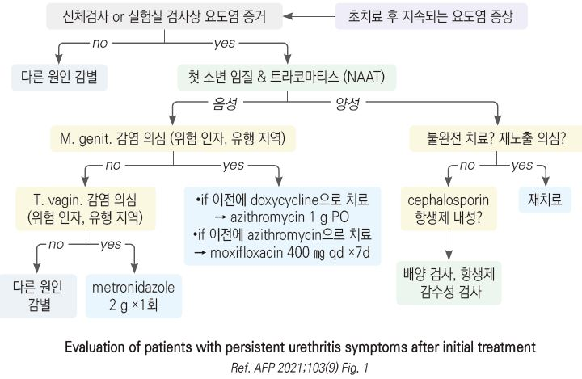
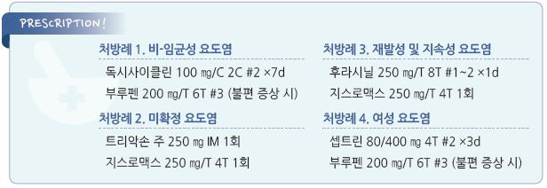

# 요도염 Urethritis

## 일반 사항

* 요도의 감염성(보다 흔함) 또는 비-감염성 염증
* 보통 균 노출 1\~3주 후 증상 발생; 임질은 1주 내 증상 발생

#### Chlamydia

* 세균성 STI(성매개감염) 중 가장 흔함
* 전염 경로 : 성관계, 질식 분만 수직 감염
* 대부분 무증상(특히 여성에서)으로 진단 받지 않은 감염자들이 적지 않을 것으로 사료됨
* 유병률 : 0.5%(미국); 여성, 20\~24세에서 높음
*   유발 질환 : \[여성] 자궁경부염, 요도중후군, 자궁내막염, PID → 자궁외임신, 불임, 만성골반통; \[남성] 부고환염, 전립선염;

    \[신생아] 결막염, 폐렴

#### 여성요도증후군 (Female urethral syndrome)

* 비뇨기계 감염 또는 확인된 이상 없이 빈뇨, 배뇨통, 잔뇨감 등 전형적인 하부 요로 감염에서와 같은 증상이 발생하는 증후군
* 원인 : 불명; 호르몬 불균형, Skene gland 염증, 음식, 환경 자극(예: 뒷물, 거품 목욕), 요로 감염 후 과민 등 추정
* 종종 악화와 완화가 반복되어 비뇨기계 증상 뿐 아니라 불안 등의 심리적 증상을 초래함

## 원인

#### 감염성

* 임균 : N. gonorrhoeae (☞ p.636)
*   비-임균 : Chlamydia trachomatis (가장 흔함), Mycoplasma genitalium (지속/재발 NGU의 가장 흔한 원인),

    Trichomonas vaginalis , Candida

#### 비-감염성

* 화학적 자극 : 비누, 샴푸, 질 세척, 살정자제
* 이물, 요도 기구

### 위험 인자

* 불결한 성관계, 다수의 성 파트너
* 성 매개 질환 병력
* 부적절한 콘돔 사용
* 여성, 동성애자 남성

## 임상 양상

* 흔히 무증상(남 \~40%, 여 \~75%)
* 점진적 진행 : 7일 이상 된 증상은 방광염보다 요도염의 가능성이 높음
* 빈뇨, 배뇨통(작열감)
* 요도 가려움 : 여성 칸디다성 요도염에서 보다 흔함
* 점액성\~농성 요도 분비물
* 혈뇨
* 여성에서는 질염 증상이 동반될 수 있음

## 진단

### 진단 기준

* 점액 농성 또는 농성 요도 분비물
* urethral swab 그람염색 : WBC ≥2/HPF
* 아침 첫 소변 WBC ≥10/HPF 또는 leukocyte esterase(+)

### 추가 검사

* 배양 검사
* 분비물/소변에 대한 NAAT(nucleic acid amplification test; PCR, TMA)
* 다른 성매개질환에 대하여 검사 : 매독, HIV, HBV, HCV
* urethrocystoscopy : 이물, 요도 협착 의심 시 고려

### STI 선별 검사 대상

* 모든 성인(청소년 포함) : HIV
*   성관계를 하는 ＜26세 여성, 새로운 또는 복수의 성 파트너가 있거나 콘돔을 사용하지 않은 ≥26세 여성 :

    매년 Gonorrhea 및 Chlamydia
* 일정하지 않은 파트너 또는 복수의 파트너가 있는 남녀 : HBV
* 요도염이 있는 모든 남성 : Gonorrhea 및 Chlamydia
* 1945년\~1965년 사이에 태어난 모든 사람, C형 감염자와 성관계한 모든 사람 : HCV
* 임신부 : 매독, Chlamydia , HIV, HBV
* 동성애 남성 : 1년에 1회 이상 HAV, HBV, HCV, HIV, 매독, Chlamydia , Gonorrhea
* HIV 감염자 : A, B, C형간염; 1년에 1회 이상 매독, Chlamydia , Gonorrhea
* HIV 감염 여성 : 1년에 1회 이상 trichomonas
* HIV 감염 남성과 성관계를 가진 남자 : 1년에 1회 이상 HCV

### 감별

* 남성에서 증상은 지속되나 요도 감염의 증거가 없는 경우 → 만성 전립선염
* 여성에서 배뇨통은 있으나 농뇨가 없는 경우 → 질염
* 검사상 요도염의 증거는 없고 증상만 지속 또는 재발하는 경우 → 기능적 문제
* 배뇨 곤란 증상만 존재 → Chlamydia
* 통증성 생식기 궤양 → HSV

***

## Management

### 치료 방침

* 성관계 파트너 검사 : 증상 발생 또는 진단 60일 이내 관계한 성 파트너에 대하여 평가
* 성관계 금지 : 1회 요법제 복용 후 7일간 또는 7일 요법제 복용 완료까지
*   항생제 치료 : 임균 감염이 배제되지 않거나 추적 평가를 할 수 없는 상태의 감염 또는 고위험 남성에서는

    Chlamydia 및 Gonorrhea 모두에 해당되는 약제 선택
* 예방 (☞ p.625)

## 약물 치료

#### 1차 선택제

*   doxycycline : 100 ㎎ bid ×7d \[독시사이클린]

    plus (임균 감염이 배제되지 않은 경우)
* ceftriaxone : 500 ㎎ ×1회 IM \[트리악손]

#### 대체제

* azithromycin : 500 ㎎ ×1d & 250 ㎎ qd ×4d OR 1 g 1회 \[지스로맥스]; 임신 위험 category B, 수유 중 투여 가능
* levofloxacin : 500 ㎎ qd ×7d \[크라비트]
* ofloxacin : 300 ㎎ bid ×7d \[오플록사신]

#### 재발성 및 지속성 요도염

* doxycycline으로 치료 실패 → azithromycin 1 g ×1회 \[지스로맥스]
*   M. genitalium

    •macrolide sensitive : doxy. 100 ㎎ bid ×7d 이어서 azith. 1 g 1회 & 500 ㎎ qd ×3d

    •macrolide 내성 또는 내성 검사 불가 : doxy. 100 ㎎ bid ×7d 이어서 moxifloxacin 400 ㎎ qd ×7d \[아벨록스]
*   T. vaginalis 가 흔한 지역

    •metronidazole : 2 g ×1회. 복용 중 금주 \[후라시닐]

    •tinidazole : 2 g ×1회 \[티니다진]
* 남성에서 불완전하게 치료했거나 치료하지 않은 파트너에 재노출 → 초치료법으로 재치료

#### 여성 요도염, 요도증후군 (Urethritis & Urethral syndrome in women)

* nitrofurantoin : 100 ㎎ bid ×5d
* TMP/SMX : 160/800 ㎎ bid ×3d; 내성 가능성이 있거나 3개월 내 UTI 치료로 사용된 적이 있으면 피함 \[셉트린]
* fosfomycin : 다른 제제에 비하여 효과 떨어짐; 3 g ×1회 \[모누롤]
* pivmecillinam : 다른 제제에 비하여 효과 떨어짐; 400 ㎎ bid ×5d \[셀렉시드]

## 모니터링

* 치료 후 3주 이내에는 위양성 가능성이 있음
* 완치 판정을 위한 일률적인 검사는 권하지 않음
* 다음의 경우 치료 3\~4주 후 추적 검사 : 임신, 증상 지속, 불완전한 치료, 재감염 의심
* 다음의 경우 치료 3개월 후에 추적 검사 : STI(Chlamydia, Gonorrhea )

### 지속 또는 재발성 non-gonococcal urethritis(NGU)

* M. genitalium 에 대한 NAAT 검사 및 macrolide 저항성 검사 고려
* 유행 지역이라면 Trichomonas vaginalis 에 대한 NAAT 검사 고려
* 요도염에 대한 명확한 증상 또는 증거가 있는 경우에만 치료

질병코드

N34　요도염 및 요도증후군

A54　임균감염

A64　상세불명의 성매개질환

A56　 기타 성행위로 전파되는 클라미디아질환

