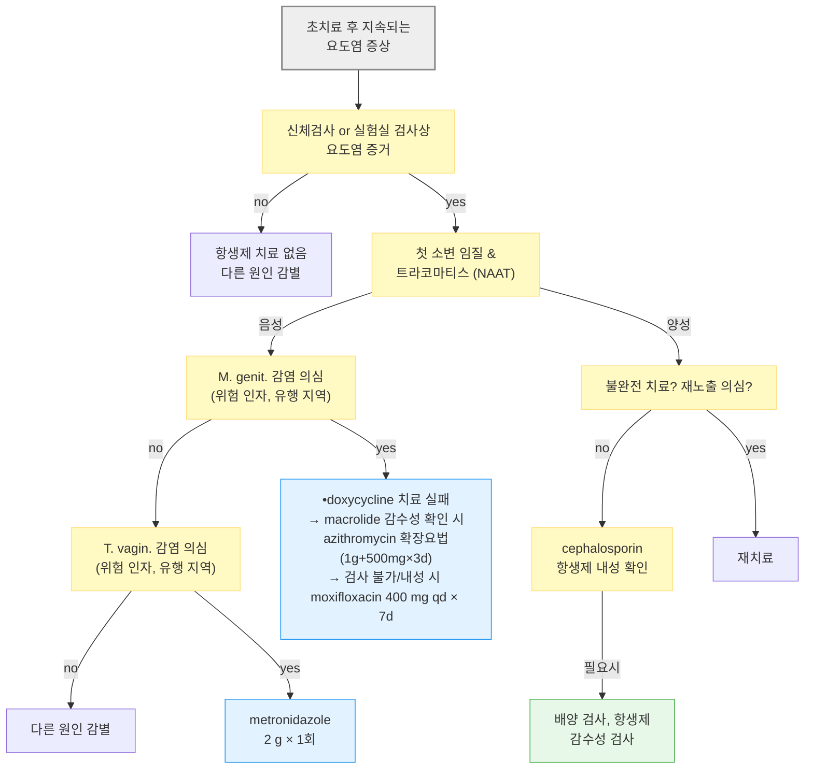

# 요도염 Urethritis

## <mark style="color:green;">일반 사항</mark>

* 요도의 감염성(더 흔함) 또는 비-감염성 염증
* 감염성의 경우 보통 균 노출 1\~3주 후 증상 발생; 임질은 1주 내 증상 발생
* 비-감염성 요도염은 대개 원인 노출 후 수 시간 내로 증상이 나타나거나 자극이 지속되는 동안 증상이 이어짐
* 분류 : 임균성 요도염(gonococcal urethritis, GU), 비임균성 요도염(nongonococcal urethritis, NGU)

#### <mark style="color:$primary;">Chlamydia 감염</mark>

* 세균성 STI(성매개감염) 중 가장 흔함
* 전염 경로 : 성관계, 질식 분만 수직 감염
* 대부분 무증상(특히 여성에서)으로, 진단 받지 않은 감염자들이 적지 않을 것으로 사료됨
* 유병률 : 0.5%(미국); 여성, 20\~24세에서 높음
* 유발 질환 : \[여성] 자궁경부염, 요도증후군, 자궁내막염, PID → 자궁외임신, 불임, 만성골반통; \[남성] 부고환염, 전립선염; \[신생아] 결막염, 폐렴

#### <mark style="color:$primary;">여성 요도증후군 (Female urethral syndrome)</mark>

* 비뇨기계 감염 또는 확인된 이상 없이 "빈뇨, 배뇨통, 잔뇨감" 등 전형적인 하부 요로 감염에서와 같은 증상이 발생하는 증후군
* 원인 : 불명
  * 폐경 후 에스트로겐 감소, Skene gland dysfunction, pelvic floor dysfunction, 과민방광, 이전 UTI 병력, 환경 자극(예: 뒷물, 거품 목욕, 향이 강한 여성청결제) 등이 추정됨
* 기능적 요인이 의심되면 배뇨 일지, 요속 검사(uroflowmetry) 등 평가를 고려
* 종종 악화와 완화가 반복되어 비뇨기계 증상 뿐 아니라 불안 등의 심리적 증상을 초래함

## <mark style="color:green;">원인</mark>

#### <mark style="color:$primary;">감염성</mark>

* 임균 : _N. gonorrhoeae_ (☞ [임질](115_-2.gonorrhea.md))
* 비-임균 : _Chlamydia trachomatis_(가장 흔함), _Mycoplasma genitalium_(지속/재발 NGU의 가장 흔한 원인), _Trichomonas vaginalis, Ureaplasma urealyticum_(일부 증례에서 원인균으로 보고되나 병원성은 제한적; _U. parvu&#x6D;_&#xC740; 정상 상재균인 경우가 많아 제외), HSV, Adenovirus(특히 구강성교 관련)

#### <mark style="color:$primary;">비-감염성</mark>

* 화학적 자극 : 비누, 샴푸, 질 세척, 살정자제
* 이물, 요도 기구

### <mark style="color:orange;">위험 인자</mark>

* 콘돔 없는 성관계, 다수의 성 파트너
* 성 매개 질환 병력
* 새로운 파트너, 25세 미만
* 동성애자 남성(MSM)

## <mark style="color:green;">임상 양상</mark>

* 흔히 무증상 (남 \~40%, 여 \~75%)
* 점진적 진행 : 7일 이상 된 증상은 방광염보다 요도염의 가능성이 높음
* 빈뇨, 배뇨통(작열감)
* 요도 가려움 : 요도구 주변의 _Candid&#x61;_&#xC131; 귀두염·외음부염이 동반되면 요도 가려움을 호소할 수 있음; _Candida_ 자체는 확립된 요도염 원인균은 아님
* 점액성\~농성 요도 분비물
* 드물게 혈뇨
* 여성에서는 질염 증상이 동반될 수 있음

### <mark style="color:$danger;">🚩 Red Flags!</mark>

<mark style="color:$danger;">**즉각 조치 또는 의뢰**</mark>

* 고열, 오한, 옆구리 통증 동반 → 상행 요로 감염(신우신염)
* 발열, 이동성 다발관절통, 건초염, 농포성 피부 병변 동반 → 파종성 임균 감염
* 급성 음낭통·부종과 함께 고환 거상, cremasteric reflex 소실 → 고환 염전

<mark style="color:$warning;">**당일 또는 조기 의뢰**</mark>

* 음낭통·압통·부종 (발열은 없거나 경미) → 급성 부고환염
* 하복부 통증을 동반한 여성(본인 또는 파트너) → 골반염(PID)
* 임신부 또는 임신 가능성이 있는 여성 파트너 노출
* 요도 협착·이물 등 해부학적 이상이 의심

<mark style="color:$info;">**외래 추적 / 추가 평가 계획**</mark> <mark style="color:$info;">- 즉각 위험 낮으나 호전 없으면 의뢰</mark>

* 적절한 1차 치료 후에도 7일 이상 증상 지속 또는 재발
* 파트너의 불완전한 치료 또는 재노출 병력
* 반복적 요도염

## <mark style="color:green;">진단</mark>

### <mark style="color:orange;">진단 기준</mark>

* 점액 농성 또는 농성 요도 분비물
* urethral swab 그람염색 : ≥2 WBC/oil immersion field(고유병률 세팅, 예: 성병클리닉) 또는 ≥5 WBC/oil immersion field(저유병률 세팅, 예: 일반 1차 진료)
* 아침 첫 소변 WBC ≥10/HPF 또는 leukocyte esterase(+)

### <mark style="color:orange;">추가 검사</mark>

* 배양 검사
* 분비물/소변에 대한 NAAT(nucleic acid amplification test; PCR, TMA)
* 다른 성매개질환에 대하여 검사 : 매독, HIV, HBV, HCV
* urethrocystoscopy : 이물, 요도 협착 의심 시 고려

### <mark style="color:orange;">STI 선별 검사 대상</mark>

* 13\~64세 모든 사람 : 최소 1회 HIV 선별검사 (이후 위험군은 매년, MSM은 3\~6개월마다 고려 \[CDC]; 국내 진료 현장에서는 현실적으로 연 1회가 주로 적용됨)
* 성관계를 하는 ＜26세 여성, 새로운 또는 복수의 성 파트너가 있거나 콘돔을 사용하지 않은 ≥26세 여성 : 매년 Gonorrhea 및 Chlamydia
* 일정하지 않은 파트너 또는 복수의 파트너가 있는 남녀 : HBV
* 요도염이 있는 모든 남성 : Gonorrhea 및 Chlamydia
* 모든 18세 이상 : 평생 1회 HCV 선별검사; 위험 인자(정맥 마약 사용, 투석, HIV 감염 등)가 있으면 반복 검사
* 임신부 : 매독, Chlamydia, HIV, HBV
* 동성애 남성 : 1년에 1회 이상 HAV, HBV, HCV, HIV, 매독, Chlamydia, Gonorrhea
* HIV 감염자 : A, B, C형간염; 1년에 1회 이상 매독, Chlamydia, Gonorrhea
* HIV 감염 여성 : 1년에 1회 이상 trichomonas
* HIV 감염 MSM : 1년에 1회 이상 HCV

### <mark style="color:orange;">감별</mark>

* 배뇨통·요도 증상의 감별

<table><thead><tr><th width="448.57147216796875">임상 상황</th><th>시사 질환</th></tr></thead><tbody><tr><td>남성에서 증상은 지속되나 요도 감염의 증거가 없는 경우</td><td>만성 전립선염</td></tr><tr><td>여성에서 배뇨통은 있으나 농뇨가 없는 경우</td><td>질염</td></tr><tr><td>검사상 요도염의 증거는 없고 증상만 지속 또는 재발하는 경우</td><td>기능적 문제 (여성 요도증후군 등)</td></tr><tr><td>배뇨 곤란 증상만 존재</td><td>Chlamydia 감염 우선 고려</td></tr><tr><td>통증성 생식기 궤양 동반</td><td>HSV 감염</td></tr></tbody></table>

***

## <mark style="background-color:$warning;">Management</mark>

### <mark style="color:orange;">치료 방침</mark>

* 성관계 파트너 검사 : 증상 발생 또는 진단 60일 이내 관계한 성 파트너에 대하여 평가
* 성관계 금지 : 1회 요법제 복용 후 7일간 또는 7일 요법제 복용 완료까지, 그리고 모든 파트너의 치료가 끝날 때까지
*   항생제 치료 : 임균 감염이 배제되지 않거나 추적 평가를 할 수 없는 상태의 감염 또는 고위험 남성에서는

    Chlamydia 및 Gonorrhea 모두에 해당되는 약제 선택

<mark style="color:cyan;">**단계별 치료 전략**</mark>

<table><thead><tr><th width="237.90472412109375">대상</th><th width="88.047607421875">단계</th><th>핵심 치료</th></tr></thead><tbody><tr><td>진단 기준을 충족하는 모든 환자</td><td>Step 1</td><td>임상 진단 즉시 경험적 치료 시작 (검사 결과를 기다리지 않음)</td></tr><tr><td>검사 결과 확인된 환자</td><td>Step 2</td><td>NAAT 결과에 따라 표적 항생제로 조정</td></tr><tr><td>초치료 실패 환자</td><td>Step 3</td><td>7일 이상 증상 지속/재발 시 <em>M. genitalium, T. vaginalis</em> 평가</td></tr></tbody></table>

### <mark style="color:orange;">치료 후 모니터링</mark>

* 치료 후 3주 이내에는 NAAT 위양성 가능성이 있어 재검사는 피함
  * 특히Chlamydia는 치료 후 4주 이전 치료 판정 검사(test-of-cure)를 피함
* 완치 판정을 위한 일률적인 test-of-cure는 권하지 않음
* 다음의 경우 치료 3\~4주 후 추적 검사 : 임신, 증상 지속, 불완전한 치료, 재감염 의심
* 다음의 경우 test-of-cure를 권고 : 인두 임균 감염 전체, azithromycin으로 치료한 직장 Chlamydia 감염
* Chlamydia, Gonorrhea 감염자는 재감염 여부 확인을 위해 치료 3개월 후 재검사 권고

#### <mark style="color:$primary;">지속 또는 재발성 non-gonococcal urethritis(NGU)</mark>

* _M. genitaliu&#x6D;_&#xC5D0; 대한 NAAT 검사 및 macrolide 저항성 검사 고려
* _T. vaginalis_ 유병률이 높은 지역 또는 이성 파트너가 있는 남성에서는 NAAT 검사 및 경험적 치료 고려
* 요도염에 대한 명확한 증상 또는 증거가 있는 경우에만 치료


```mermaid
flowchart TD
    Start["초치료 후 지속되는 <br/>요도염 증상"] 
--> A["신체검사 or 실험실 검사상 <br/>요도염 증거"]
    A -- no --> B["항생제 치료 없음<br>다른 원인 감별"]
    A -- yes --> C["첫 소변 임질 & <br/>트라코마티스 (NAAT)"]
    C -- 음성 --> D["M. genit. 감염 의심<br>(위험 인자, 유행 지역)"]
    C -- 양성 --> E["불완전 치료? 재노출 의심?"]
    D -- no --> F["T. vagin. 감염 의심<br>(위험 인자, 유행 지역)"]
    D -- yes --> G["•doxycycline 치료 실패<br>→ macrolide 감수성 확인 시<br/>azithromycin 확장요법<br/>(1g+500mg×3d)<br>→ 검사 불가/내성 시 <br/>moxifloxacin 400 mg qd × 7d"]
    F -- no --> H["다른 원인 감별"]
    F -- yes --> I["metronidazole<br>2 g × 1회"]
    E -- no --> J["cephalosporin<br>항생제 내성 확인"]
    E -- yes --> K["재치료"]
    J -- 필요시 --> L["배양 검사, 항생제<br>감수성 검사"]
style Start fill:#eeeeee,stroke:#888888,stroke-width:2px
classDef yellow fill:#fff9c4,stroke:#ffe082
class A,C,E,D,F,J yellow
classDef sky fill:#e3f2ff,stroke:#2196f3
class G,I sky
style L fill:#e8f8e8,stroke:#4caf50

```

※ 지속 증상이 있는 모든 환자에서 다음을 고려 : 만성 전립선염/만성 골반통 증후군 평가; 헤르페스 배양을 위한 요도 검체 채취; 비뇨의학과·감염내과 전문의 또는 경험 많은 동료와 상담

<p align="center"><strong>초치료 후 지속되는 요도염 증상의 평가</strong></p>

<p align="center"><em><mark style="color:$info;">Ref. Urethritis: Rapid Evidence Review. AFP 2021;103(9) Fig. 1</mark></em></p>

***

## <mark style="color:green;">비-약물 치료 및 예방</mark>

* 성 파트너 검사 및 치료 : 증상 발생 또는 진단 60일 이내 성 파트너 평가 및 경험적 치료 (해외 일부 국가의 expedited partner therapy, EPT와 달리 국내 의료법상 진찰 없는 대리 처방은 제한되므로, 파트너도 직접 내원하여 진찰·처방을 받도록 안내)
* 콘돔의 일관되고 올바른 사용 : 재감염 위험을 크게 낮춤
* 화학적 자극 원인(비누, 질 세척, 살정자제 등) 회피 - 비감염성 요도염/여성 요도증후군에서 특히 중요
* 모든 성인에서 HIV 선별검사 권고; 고위험군에서는 매독, B형/C형간염 동반 검사


**Doxy-PEP(노출 후 예방요법)** - 세균성 STI(매독·클라미디아·임질) 공통 예방 전략으로 고려(☞ [성매개감염병](115_-1.STI.md#undefined-6))


## <mark style="color:green;">약물 치료</mark>


아래 용법은 병원체가 아직 확정되지 않은 상태에서의 경험적 치료 기준. 확진 후 상세 용법·대체 요법·모니터링·최신 개정 사항은 [클라미디아](115_-4.chlamydia.md), [임질](115_-2.gonorrhea.md) 챕터 참조


### <mark style="color:orange;">1차 선택제</mark>

* doxycycline : 100 ㎎ bid ×7d <mark style="color:blue;">\[독시사이클린]</mark>

_plus (임균 감염이 배제되지 않은 경우)_

* ceftriaxone : 500 ㎎ ×1회 IM <mark style="color:blue;">\[트리악손]</mark> ; 체중 ≥150 ㎏인 경우 1 g으로 증량 \[CDC 2021]
  * 국내 일부 진료 현장에서는 azithromycin 병용이 여전히 사용되지만, CDC 개정 이후로는 권장되지 않음

### <mark style="color:orange;">대체제</mark>

* azithromycin : 500 ㎎ ×1d & 250 ㎎ qd ×4d OR 1 g 1회 <mark style="color:blue;">\[지스로맥스]</mark>; 임신 위험 category B, 수유 중 투여 가능; doxycycline 대비 치료 실패 및 내성 보고 증가로 chlamydia 1차 선택에서 제외됨 \[CDC 2021]
* levofloxacin : 500 ㎎ qd ×7d <mark style="color:blue;">\[크라비트]</mark>
* ofloxacin : 300 ㎎ bid ×7d <mark style="color:blue;">\[오플록사신]</mark>
  * 플루오로퀴놀론계는 현재 NGU 1차/대체 요법으로 적극 권고되지 않으며, doxycycline·azithromycin을 사용할 수 없는 경우에 제한적으로 고려

### <mark style="color:orange;">재발성 및 지속성 요도염</mark>

* _M. genitalium_ (가능하면 resistance test 선행)
  * macrolide sensitive : doxy. 100 ㎎ bid ×7d 이어서 azith. 1 g 1회 & 500 ㎎ qd ×3d
  * macrolide 내성 또는 내성 검사 불가 : doxy. 100 ㎎ bid ×7d 이어서 moxifloxacin 400 ㎎ qd ×7d <mark style="color:blue;">\[아벨록스]</mark>
    * 국내에서는 macrolide 내성 검사 상용화가 제한적이어서, 실제로는 검사 없이 moxifloxacin으로 넘어가는 경우가 많음
* _T. vaginalis_ 유병률이 높은 지역 또는 이성 파트너가 있는 남성
  * metronidazole : 2 g ×1회. 복용 중 금주 <mark style="color:blue;">\[후라시닐]</mark>
  * tinidazole : 2 g ×1회 <mark style="color:blue;">\[티니다진]</mark>
* 남성에서 불완전하게 치료했거나 치료하지 않은 파트너에 재노출 → 초치료법으로 재치료

### <mark style="color:orange;">여성 요도증후군 (STI 및 단순 방광염 배제 후)</mark>

* 여성의 감염성(STI) 요도염은 남성과 동일하게 doxycycline 등으로 치료함; 아래 약제는 STI가 배제된 요도증후군 또는 동반된 단순 방광염에 대한 치료임
* nitrofurantoin : 100 ㎎ bid ×5d
* TMP/SMX : 160/800 ㎎ bid ×3d; 내성 가능성이 있거나 3개월 내 UTI 치료로 사용된 적이 있으면 피함 <mark style="color:blue;">\[셉트린]</mark>
* fosfomycin : 다른 제제에 비하여 효과 떨어짐; 3 g ×1회 <mark style="color:blue;">\[모누롤]</mark>
* pivmecillinam : 다른 제제에 비하여 효과 떨어짐; 400 ㎎ bid ×5d <mark style="color:blue;">\[셀렉시드]</mark>

***

### <mark style="color:red;">질병코드</mark>

N34.1 비특이성 요도염

A56.0 하부 비뇨생식기관의 클라미디아 감염

A54.0 요도주위 및 부속선 농양을 동반하지 않은 하부 비뇨생식기관의 임균 감염

A59.0 비뇨생식기 트리코모나스증

A64 상세불명의 성매개질환

***

## <mark style="color:purple;">처방례</mark>

> **처방례 1. 비-임균성 요도염**
>
> ```
> 독시사이클린 100 ㎎/C  2C  #2 ×7d
> 부루펜 200 ㎎/T  6T  #3  (불편 증상 시)
> ```
>
> _✽Chlamydia 등 비임균성 원인에 대한 1차 선택제. 복용 완료까지 성관계 금지_

> **처방례 2. 미확정 요도염 (임균 감염이 배제되지 않은 경우)**
>
> ```
> 트리악손 주 500 ㎎  IM  1회
> 독시사이클린 100 ㎎/C  2C  #2 ×7d  (Chlamydia 동반이 배제되지 않은 경우)
> ```
>
> _✽2021년 CDC 개정 이후 임균 감염에 azithromycin을 통상적으로 병용하지 않으며, ceftriaxone 단독 500 ㎎(체중 ≥150 ㎏이면 1 g)이 표준 용량임. Chlamydia 동반이 배제되지 않으면 doxycycline을 병용_

> **처방례 3. 재발성 및 지속성 요도염 (T. vaginalis 의심)**
>
> ```
> 후라시닐 250 ㎎/T  8T  #1~2 ×1d
> ```
>
> _✽metronidazole 2 g 1회(후라시닐 8T 분1\~2)로 T. vaginalis 치료. 복용 중·복용 후 최소 24시간 금주_

> **처방례 4. 여성 요도증후군 (STI 배제 후)**
>
> ```
> 셉트린 80/400 ㎎  4T  #2 ×3d
> 부루펜 200 ㎎/T  6T  #3  (불편 증상 시)
> ```
>
> _✽1회 2정씩 1일 2회(TMP/SMX 160/800 mg) 복용. 최근 3개월 내 UTI 치료 이력이 있거나 내성 의심 시 nitrofurantoin 고려_

> **처방례 5. 지속성 요도염 (M. genitalium, macrolide 감수성 확인/추정)**
>
> ```
> 독시사이클린 100 ㎎/C  2C  #2 ×7d  선행 투여
> 지스로맥스 250 ㎎/T  4T  1회, 이후 250 ㎎/T  2T  #1 ×3d
> ```
>
> _✽doxycycline 7일 선행 투여 후 azithromycin 1 g 1회 + 500 ㎎ qd ×3일 확장 요법이 단회 1 g 요법보다 치료 실패율을 낮춤(CDC 2021)_

***

### <mark style="color:$success;">핵심 복약 지도</mark>

> **항생제 복용 및 성관계 제한**
>
> * 처방된 항생제는 증상이 빨리 좋아지더라도 처방된 기간까지 빠짐없이 복용하십시오.
> * 1회 요법제(예: 트리악손 주사, 지스로맥스 1 g)는 복용 후 7일간, 7일 요법제(예: 독시사이클린)는 복용을 모두 마칠 때까지 성관계를 금지하십시오.
> * 최근 60일 이내 성 파트너도 함께 검사·치료받아야 재감염을 막을 수 있습니다.

> **doxycycline 복용 시 주의사항**
>
> * 유제품·제산제·철분제와는 2시간 이상 간격을 두고 복용하십시오(흡수 저하 가능).
> * 복용 직후 눕지 말고 충분한 물과 함께 복용하십시오(식도 자극·궤양 예방).
> * 복용 기간 중 광과민 반응이 있을 수 있어 과도한 자외선 노출을 피하십시오.

> **metronidazole/tinidazole 복용 시 주의사항**
>
> * 복용 중 및 복용 후 최소 72시간(3일) 금주하십시오(disulfiram-like 반응 위험; 국내 후라시닐정 첨부문서 기준).

> **언제 다시 병원을 방문해야 하나요?**
>
> * 항생제 복용 완료 후에도 요도 분비물, 배뇨통이 지속되거나 재발하는 경우
> * 고열, 심한 옆구리 통증, 음낭 통증·부종이 새로 발생하는 경우 - 즉시 내원
> * 관절통, 피부 발진이 동반되는 경우 - 즉시 내원 (파종성 임균 감염 의심)

***

### <mark style="color:blue;">환자 안내서</mark>


**요도염, 성 파트너와 함께 치료해야 완치됩니다**

요도염은 대부분 성 접촉으로 전염되는 세균 감염입니다. 본인뿐 아니라 최근 성 파트너도 함께 검사받고 치료해야 재감염을 막을 수 있습니다.


#### <mark style="color:$primary;">왜 요도염이 생기나요?</mark>

* 대부분 성관계를 통해 옮는 세균(클라미디아, 임균 등)이 요도에 염증을 일으켜 발생합니다.
* 비누, 세정제 등 화학적 자극으로도 감염 없이 비슷한 증상이 생길 수 있습니다.
* 감염되어도 특히 여성에서는 증상이 없는 경우가 많아(약 75%), 본인도 모르게 파트너에게 옮길 수 있습니다.

#### <mark style="color:$primary;">치료는 어떻게 하나요?</mark>

* **처방받은 항생제를 증상이 없어져도 끝까지 복용하십시오.** 도중에 중단하면 균이 완전히 없어지지 않아 재발하거나 내성이 생길 수 있습니다.
* **약을 모두 복용할 때까지(또는 1회 주사·복용 후 7일간) 성관계를 하지 마십시오.** 이 기간에 관계를 가지면 파트너에게 옮기거나 재감염될 수 있습니다.
* **최근 성 파트너에게도 알리고 함께 검사·치료를 받으십시오.**

#### <mark style="color:$primary;">일상생활에서 어떻게 관리하나요?</mark>

* 콘돔을 일관되고 올바르게 사용하면 재감염 위험을 크게 줄일 수 있습니다.
* 비누, 질 세정제, 살정자제 등 자극이 될 수 있는 제품 사용을 줄이십시오.
* 물을 충분히 마시고 배뇨를 참지 마십시오.

#### <mark style="color:$primary;">치료 후 언제 다시 검사받아야 하나요?</mark>

* 클라미디아·임질에 감염되었던 경우, 재감염 여부 확인을 위해 치료 3개월 후 재검사를 받는 것이 좋습니다.
* 항생제 복용 후 3주 이내에는 검사에서 위양성이 나올 수 있어 이 시기의 재검사는 권하지 않습니다.

#### <mark style="color:$primary;">이럴 때는 즉시 병원을 방문하세요</mark>

* 약을 다 먹었는데도 분비물이나 배뇨통이 계속되거나 다시 생기는 경우
* 열이 나거나 옆구리, 아랫배가 심하게 아픈 경우
* 고환이 붓고 아픈 경우
* 관절이 아프거나 피부에 발진이 새로 생기는 경우
