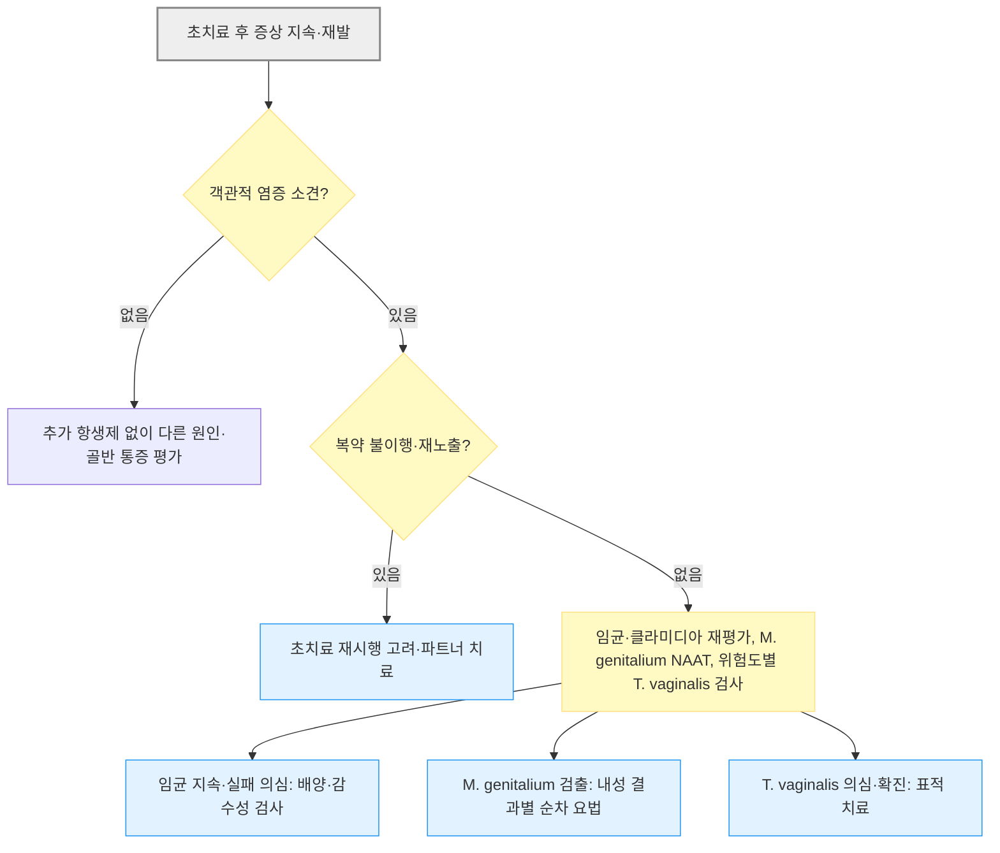

# 요도염 Urethritis

## <mark style="color:green;">일반 사항</mark>

* 요도의 감염성(더 흔함) 또는 비-감염성 염증
* 감염성의 경우 보통 균 노출 1\~3주 후 증상 발생; 임질은 1주 내 증상 발생
* 비-감염성 요도염은 대개 원인 노출 후 수 시간 내로 증상이 나타나거나 자극이 지속되는 동안 증상이 이어짐
* 분류 : 임균성 요도염(gonococcal urethritis, GU), 비임균성 요도염(nongonococcal urethritis, NGU)

#### <mark style="color:$primary;">Chlamydia 감염</mark>

* 세균성 STI(성매개감염) 중 가장 흔함
* 전염 경로 : 성관계, 질식 분만 수직 감염
* 대부분 무증상(특히 여성에서)으로, 진단 받지 않은 감염자들이 적지 않을 것으로 사료됨
* 감염 빈도는 지역·연령·대상집단에 따라 다르며 젊은 연령에서 높음
* 유발 질환 : \[여성] 자궁경부염, 자궁내막염, PID → 자궁외임신, 불임, 만성골반통; \[남성] 부고환염, 전립선염; \[신생아] 결막염, 폐렴

#### <mark style="color:$primary;">여성 요도증후군 (Female urethral syndrome)</mark>

* STI·방광염 등 감염과 다른 원인을 평가했으나 뚜렷한 원인 없이 빈뇨·배뇨통·잔뇨감이 지속되는 증상군. 급성 방광염과 동의어가 아님
* 원인 : 불명
  * 폐경 후 에스트로겐 감소, Skene gland dysfunction, pelvic floor dysfunction, 과민방광, 이전 UTI 병력, 환경 자극(예: 뒷물, 거품 목욕, 향이 강한 여성청결제) 등이 추정됨
* 기능적 요인이 의심되면 배뇨 일지, 요속 검사(uroflowmetry) 등 평가를 고려
* 종종 악화와 완화가 반복되어 비뇨기계 증상 뿐 아니라 불안 등의 심리적 증상을 초래함

## <mark style="color:green;">원인</mark>

#### <mark style="color:$primary;">감염성</mark>

* 임균 : _N. gonorrhoeae_ (☞ [임질](115_-2.gonorrhea.md))
* 비-임균 : _Chlamydia trachomatis_, _Mycoplasma genitalium_(특히 지속·재발 NGU), _Trichomonas vaginalis_(지역별 유병률 차이), HSV, adenovirus, 구강성교와 관련된 _Haemophilus_ spp.·_N. meningitidis_ 등; _U. urealyticum_ 검출만으로 원인균으로 단정하지 않으며 _U. parvum_의 병원성은 불확실

#### <mark style="color:$primary;">비-감염성</mark>

* 화학적 자극 : 비누, 샴푸, 질 세척, 살정자제
* 이물, 요도 기구

### <mark style="color:orange;">위험 인자</mark>

* 콘돔 없는 성관계, 다수의 성 파트너
* 성 매개 질환 병력
* 새로운 파트너, 25세 미만
* 동성애자 남성(MSM)

## <mark style="color:green;">임상 양상</mark>

* 무증상 감염도 흔하나 비율은 병원체·검사 부위·대상집단에 따라 다름
* 증상 지속 기간만으로 방광염과 요도염을 구별하지 않음
* 빈뇨, 배뇨통(작열감)
* 요도 가려움 : 요도구 주변의 _Candida_성 귀두염·외음부염이 동반되면 요도 가려움을 호소할 수 있음; 드물게 진균성 요도염도 감별
* 점액성\~농성 요도 분비물
* 드물게 혈뇨
* 여성에서는 질염 증상이 동반될 수 있음

### <mark style="color:$danger;">🚩 Red Flags!</mark>

<mark style="color:$danger;">**즉각 조치 또는 의뢰**</mark>

* 고열, 오한, 옆구리 통증 동반 → 상행 요로 감염(신우신염)
* 발열, 이동성 다발관절통, 건초염, 농포성 피부 병변 동반 → 파종성 임균 감염
* 갑자기 발생한 심한 음낭통 → 고환 염전 즉시 평가; 고환의 높은 위치·고환거근반사 소실이 없어도 배제 불가

<mark style="color:$warning;">**당일~수일 내 평가**</mark>

* 음낭통·압통·부종(당일) → 부고환염 평가; 갑작스러운 심한 통증은 고환 염전부터 배제
* 임질 치료 후 성접촉이 없는데 3\~5일 내 증상이 호전되지 않음(당일) → 치료 실패·다른 원인 평가
* 하복부·골반통을 동반한 여성(본인 또는 파트너)(당일) → 골반염 평가
* 임신부 또는 임신 가능성이 있는 여성 파트너 노출
* 요도 협착·이물 등 해부학적 이상이 의심되어 배뇨장애가 심한 경우

<mark style="color:$info;">**외래 추적 / 추가 평가 계획**</mark> <mark style="color:$info;">- 즉각 위험 낮으나 호전 없으면 의뢰</mark>

* 치료 완료 후 요도 분비물·배뇨통 지속 또는 재발
* 파트너의 불완전한 치료 또는 재노출 병력
* 반복적 요도염

## <mark style="color:green;">진단</mark>

### <mark style="color:orange;">진단 기준</mark>

* 다음의 객관적 염증 기준은 주로 **남성 요도염**에 적용하며 증상만으로 원인균을 구별할 수 없음
* 관찰되는 점액성·점액농성 또는 농성 요도 분비물
* 요도 분비물 그람염색 : 고유병률 환경에서 ≥2 WBC/oil immersion field, 저유병률 환경에서 ≥5 WBC/oil immersion field; 세포내 그람음성 쌍구균이 보이면 임질 추정
* **초회뇨(first-void/first-catch urine)**의 leukocyte esterase(+) 또는 원심분리한 초회뇨 침사 WBC ≥10/HPF [CDC 2021]. '아침에 처음 보는 소변'이라는 뜻은 아님
* BASHH 2026은 도말 또는 자동 요세포 분석이 가능할 때 leukocyte esterase 시험지만으로 NGU를 진단하지 않도록 권고

### <mark style="color:orange;">추가 검사</mark>

* 남성의 초회뇨 또는 적절한 요도 검체로 **임균·클라미디아 NAAT**(PCR, TMA 등)를 우선 시행; 성접촉 부위에 따라 인두·직장 검체도 평가
* 임균 치료 실패 의심 시 해당 부위 **배양 및 항생제 감수성 검사**(NAAT만으로 감수성 확인 불가)
* 지속·재발 NGU에서는 염증·복약·재노출 확인 후 _M. genitalium_ NAAT와 가능한 내성 검사, 위험도에 따른 _T. vaginalis_ 검사; 심한 배뇨통·요도구 염증·궤양 등에서는 HSV NAAT 고려
* HIV·매독 검사, B형간염 면역·접종력 확인; HCV 등은 위험도에 따라 검사
* 요도방광경검사 : 이물·협착 등 구조적 이상 의심 시 고려

### <mark style="color:orange;">STI 선별 검사 대상</mark>

* **요도염 진료 시** : 임균·클라미디아 NAAT와 HIV·매독 검사를 우선 고려; 노출 부위·파트너 감염·임신 가능성에 따라 검사 범위 조정
* **일반 선별검사(CDC 기준)** : HIV는 13\~64세 최소 1회, HCV는 18세 이상 최소 1회 권고; 지속 위험 노출 시 반복 평가
* 성적으로 활동하는 **25세 미만 여성**은 임균·클라미디아 연 1회, 25세 이상은 새로운·복수 파트너 등 위험 인자에 따라 선별. 자궁경부가 있는 사람에게 해당 부위의 선별 기준 적용
* MSM·HIV 감염인은 성접촉 부위별 임균·클라미디아·매독 등을 선별하고 지속 위험 노출·HIV PrEP 이용 시 3\~6개월 간격 고려. HAV·HBV 면역·접종력 확인 및 필요한 예방접종, 위험도에 따른 HCV 반복검사
* 임신부는 산전 지침에 따른 매독·HIV·B형간염 검사, 연령·위험도에 따른 임균·클라미디아 검사; 임신 중 클라미디아 확진 시 완치검사 계획

### <mark style="color:orange;">감별</mark>

* 배뇨통·요도 증상의 감별

<table><thead><tr><th width="448.57147216796875">임상 상황</th><th>시사 질환</th></tr></thead><tbody><tr><td>남성에서 증상은 지속되나 요도 감염의 증거가 없는 경우</td><td>만성 전립선염</td></tr><tr><td>여성에서 배뇨통은 있으나 농뇨가 없는 경우</td><td>질염</td></tr><tr><td>검사상 요도염의 증거는 없고 증상만 지속 또는 재발하는 경우</td><td>기능적 문제 (여성 요도증후군 등)</td></tr><tr><td>배뇨 곤란·배뇨통만 있고 분비물이 없는 경우</td><td>방광염·요도염·전립선/골반 통증 질환 감별; 증상만으로 클라미디아를 단정하지 않음</td></tr><tr><td>통증성 생식기 궤양 동반</td><td>HSV 감염</td></tr></tbody></table>

***

## <mark style="background-color:$warning;">Management</mark>

### <mark style="color:orange;">치료 방침</mark>

* 증상 발생·진단 전 60일 이내 성 파트너 평가·치료; 마지막 성접촉이 60일 이전이라도 가장 최근 파트너 포함
* 1회 요법 후 7일 또는 다회 요법 완료까지, 증상 소실과 모든 파트너의 치료 완료까지 성관계 제한(병원체·약제별 지침 확인)
* 객관적 요도염 확인 시 검체 채취 후 경험적 치료. 임균을 배제할 수 없다면 임균·클라미디아 양쪽에 효과적인 요법 선택
* 염증 증거가 없는 유증상 남성도 NAAT를 시행할 수 있으나, 경험적 항생제는 고위험이고 추적이 어려운 경우에 제한

<mark style="color:cyan;">**단계별 치료 전략**</mark>

<table><thead><tr><th>대상</th><th>단계</th><th>핵심 치료</th></tr></thead><tbody><tr><td>객관적 요도염 확인</td><td>Step 1</td><td>검체 채취 후 경험적 치료; 임균 배제 여부에 따라 선택</td></tr><tr><td>원인균 확인</td><td>Step 2</td><td>표적 치료·성 파트너 관리</td></tr><tr><td>증상 지속·재발</td><td>Step 3</td><td>염증·복약·재노출 재평가 후 원인균 검사; 임질 실패 의심 시 조기 배양·감수성 검사</td></tr></tbody></table>

### <mark style="color:orange;">치료 후 모니터링</mark>

* 증상 지속·재발 시 **객관적 염증**, 복약 이행·재노출을 재평가; 증상만으로 항생제를 연장·반복하지 않음
* 합병증 없는 요도·직장 임질과 비임신 클라미디아의 일률적 완치검사는 불필요. 복약 불확실·증상 지속·재감염 의심 시 재평가
* **인두 임질** : 치료 후 7\~14일에 배양 또는 NAAT로 완치검사(7일째 NAAT의 잔여 핵산 양성에 주의)
* **임신 중 클라미디아** : 치료 완료 약 4주 후 NAAT로 완치검사. 비임신자에서 완치검사가 필요한 경우에도 치료 완료 4주 미만 NAAT는 잔여 핵산 위양성 가능성에 주의
* Azithromycin으로 치료한 직장 클라미디아는 낮은 치료 효과를 고려해 치료 후 평가·필요 시 검사
* 임질·클라미디아 확진자는 완치검사와 별도로 치료 약 3개월 후 재감염 확인 검사

#### <mark style="color:$primary;">지속 또는 재발성 non-gonococcal urethritis(NGU)</mark>

* 염증 재확인 → 복약 이행·치료받지 않은 파트너와 재노출 확인 → 임균·클라미디아 검사 이력과 재감염 가능성 평가
* 초치료 불이행·재노출이면 기존 요법 재시행 고려. 적절한 치료와 재노출 없음이 확인되면 _M. genitalium_ NAAT·가능한 내성 검사, 이성 파트너·지역 유병률·파트너 감염에 따른 _T. vaginalis_ 평가
* 임질 치료 후 성접촉이 없고 3\~5일 내 호전되지 않으면 임균 배양·감수성 검사로 치료 실패 평가
* 골반·회음부 또는 사정 관련 통증이 3개월 넘게 지속되면 만성 전립선염/만성 골반통 증후군 평가; 요도구 염증·심한 배뇨통·궤양 등에서는 HSV NAAT 고려


**BASHH 2026 지속/재발 NGU 대안 접근(영국 최종 지침)** : 염증과 복약·재노출을 평가한 뒤, doxycycline 초치료 후 지속 시 azithromycin 첫날 1 g + 500 ㎎ qd ×3d와 metronidazole 400\~500 ㎎ bid ×7d, azithromycin 초치료 후 지속 시 doxycycline 100 ㎎ bid ×7d와 metronidazole 400\~500 ㎎ bid ×7d를 제시. 영국의 경험적 재치료 전략이며 국내 2023 지침·CDC의 병원체/내성 기반 경로와 구분하여 적용



```mermaid
flowchart TD
    A["초치료 후 증상 지속·재발"] --> B{"객관적 염증 소견?"}
    B -- 없음 --> C["추가 항생제 없이 다른 원인·골반 통증 평가"]
    B -- 있음 --> D{"복약 불이행·재노출?"}
    D -- 있음 --> E["초치료 재시행 고려·파트너 치료"]
    D -- 없음 --> F["임균·클라미디아 재평가, M. genitalium NAAT, 위험도별 T. vaginalis 검사"]
    F --> G["임균 지속·실패 의심: 배양·감수성 검사"]
    F --> H["M. genitalium 검출: 내성 결과별 순차 요법"]
    F --> I["T. vaginalis 의심·확진: 표적 치료"]
    style A fill:#eeeeee,stroke:#888888,stroke-width:2px
    classDef yellow fill:#fff9c4,stroke:#ffe082
    class B,D,F yellow
    classDef sky fill:#e3f2ff,stroke:#2196f3
    class E,G,H,I sky
```

<p align="center"><strong>초치료 후 지속되는 남성 요도염 증상의 평가</strong></p>
<p align="center"><em><mark style="color:$info;">Ref. CDC STI Treatment Guidelines 2021, Urethritis and Cervicitis; BASHH NGU Guideline 2026</mark></em></p>

***

## <mark style="color:green;">비-약물 치료 및 예방</mark>

* 성 파트너 검사 및 치료 : 60일 이내 성 파트너 및 60일 이전이라도 가장 최근 파트너 평가·치료. 파트너의 직접 진료·처방을 안내
* 콘돔의 일관되고 올바른 사용 : 재감염 위험을 크게 낮춤
* 화학적 자극 원인(비누, 질 세척, 살정자제 등) 회피 - 비감염성 요도염/여성 요도증후군에서 특히 중요
* 요도염 진료 시 HIV·매독 검사, B형간염 면역·접종력 및 위험도별 HCV 검사 평가


**Doxy-PEP(노출 후 예방요법)** : CDC 2024는 최근 12개월 내 세균성 STI 진단력이 있는 MSM·트랜스젠더 여성에게 이득·위해를 설명하고 공동 의사결정으로 제공하도록 권고. 모든 요도염 환자에게 일률적으로 적용하지 않음(☞ [성매개감염병](115_-1.STI.md#undefined-6))


## <mark style="color:green;">약물 치료</mark>


초기 경험적 치료와 지속·재발 시 원인균별 치료를 구분함. 확진 후 상세 용법·모니터링은 [클라미디아](115_-4.chlamydia.md), [임질](115_-2.gonorrhea.md) 챕터 참조


### <mark style="color:orange;">1차 선택제</mark>

* doxycycline : 100 ㎎ bid ×7d <mark style="color:blue;">\[독시사이클린]</mark>

_plus (임균 감염이 배제되지 않은 경우)_

* ceftriaxone : 500 ㎎ ×1회 IM <mark style="color:blue;">\[트리악손]</mark> ; 체중 ≥150 ㎏인 경우 1 g으로 증량 \[CDC 2021]
  * 국내 일부 진료 현장에서는 azithromycin 병용이 여전히 사용되지만, CDC 개정 이후로는 권장되지 않음

### <mark style="color:orange;">대체제</mark>

* azithromycin : 500 ㎎ 1회, 이후 250 ㎎ qd ×4d **또는** 1 g 1회 <mark style="color:blue;">\[지스로맥스]</mark> [CDC 2021 NGU 대체 요법]. 내성 선택·클라미디아 치료 실패를 고려해 doxycycline이 어려울 때 제한적으로 선택
  * 지침 차이 : BASHH 2026은 NGU의 azithromycin 1 g 단회 요법을 권하지 않으며, 대체 요법으로 첫날 1 g + 500 ㎎ qd ×2d를 제시. 임신 중 클라미디아는 별도 임신부 지침 적용
* levofloxacin은 **클라미디아 확진** 시 대체제가 될 수 있으나 원인 미확정 NGU에는 권하지 않음. Ofloxacin을 NGU 일반 대체제나 임균 경험적 치료제로 사용하지 않음

### <mark style="color:orange;">재발성 및 지속성 요도염</mark>

* _M. genitalium_ **NAAT 양성** 시 가능한 macrolide 내성 검사에 따라 치료 선택
  * macrolide **감수성 확인** : doxycycline 100 ㎎ bid ×7d → azithromycin 첫날 1 g + 500 ㎎ qd ×3d(총 2.5 g)
  * macrolide **내성 확인** : doxycycline 100 ㎎ bid ×7d → moxifloxacin 400 ㎎ qd ×7d <mark style="color:blue;">\[아벨록스]</mark>
  * **내성 검사 불가** : CDC 2021은 _M. genitalium_ 양성 시 doxycycline → moxifloxacin을 권고. 국내 성매개감염 진료지침 2023은 재발·치료 실패 시 doxycycline(또는 minocycline) → azithromycin 총 2.5 g과 **치료 완료 21일 후 완치검사**를 제시. 국내 내성 양상, 선행 azithromycin, fluoroquinolone 금기·부작용과 추적검사 가능성을 고려해 선택; '감수성 추정'만으로 azithromycin 요법을 선택하지 않음
  * 선행 NGU 치료로 doxycycline 7일을 이미 완료했다면 경과와 후속 약제 시작 시점을 확인하여 반복 투여 여부 판단
* _T. vaginalis_ : 이성 파트너가 있고 지역·집단 유병률이 높거나 파트너 감염이 확인된 지속·재발 요도염에서 검사 및 경험적 치료 고려
  * metronidazole : 2 g 경구 **1회** <mark style="color:blue;">\[후라시닐]</mark>
  * tinidazole : 2 g 경구 **1회** <mark style="color:blue;">\[티니다진]</mark>
  * 파트너 평가·치료. 국내 후라시닐정 안내에 따라 투여 중·종료 후 3일간 금주
* 초치료 불이행 또는 치료받지 않은 파트너와 재노출 → 객관적 염증·병력 확인 후 초치료 재시행 고려

### <mark style="color:orange;">여성에서 배뇨통이 지속될 때</mark>

* 자궁경부염·질염·성매개감염, 단순 방광염, 폐경 관련 비뇨생식기증후군, 방광통증증후군, 골반저 기능 이상 등을 감별
* STI 확인 시 병원체별 치료와 파트너 평가. **단순 방광염으로 진단한 경우에만** 방광염 권고 항생제를 선택(☞ 급성 방광염 챕터)
* 감염과 방광염이 배제된 여성 요도증후군에 TMP/SMX·nitrofurantoin·fosfomycin·pivmecillinam을 일률적으로 처방하지 않음. 자극물 회피, 배뇨 양상·폐경 관련 증상·골반저 평가 등 원인 중심 관리

***

## <mark style="color:red;">질병코드</mark>

N34.1 비특이성 요도염

A56.0 하부 비뇨생식기관의 클라미디아 감염

A54.0 요도주위 및 부속선 농양을 동반하지 않은 하부 비뇨생식기관의 임균 감염

A59.0 비뇨생식기 트리코모나스증

A64 상세불명의 성매개질환

***

## <mark style="color:purple;">처방례</mark>

> **처방례 1. 비-임균성 요도염**
>
> ```
> 독시사이클린 100 ㎎/C  2C  #2 ×7d
> 부루펜 200 ㎎/T  6T  #3  (불편 증상 시)
> ```
>
> _✽비임균성 요도염의 1차 선택제. 복용을 마치고 증상이 없어지며 파트너도 치료받을 때까지 성관계 제한_

> **처방례 2. 미확정 요도염 (임균 감염이 배제되지 않은 경우)**
>
> ```
> 트리악손 주 500 ㎎  IM  1회
> 독시사이클린 100 ㎎/C  2C  #2 ×7d  (Chlamydia 동반이 배제되지 않은 경우)
> ```
>
> _✽2021년 CDC 개정 이후 임균 감염에 azithromycin을 통상적으로 병용하지 않으며, ceftriaxone 단독 500 ㎎(체중 ≥150 ㎏이면 1 g)이 표준 용량임. Chlamydia 동반이 배제되지 않으면 doxycycline을 병용_

> **처방례 3. 재발성 및 지속성 요도염 (T. vaginalis 의심)**
>
> ```
> 후라시닐 250 ㎎/T  8T  #1 ×1d
> ```
>
> _✽metronidazole 2 g(후라시닐 250 ㎎ 8정)을 한 번에 복용. 투여 중·종료 후 3일간 금주_

> **처방례 4. 지속성 요도염 (_M. genitalium_ 양성, macrolide 감수성 확인)**
>
> ```
> 독시사이클린 100 ㎎/C  2C  #2 ×7d  선행 투여
> 지스로맥스 250 ㎎/T  4T  #1 ×1d, 이후 250 ㎎/T  2T  #1 ×3d
> ```
>
> _✽감수성 확인 시의 순차 요법. doxycycline을 이미 완료했다면 재투여와 후속 약제 시점 판단. 감수성 미확인 시 본문에 구분한 국내·CDC 경로와 완치검사 계획 확인_

***

### <mark style="color:$success;">핵심 복약 지도</mark>

> **항생제 복용 및 성관계 제한**
>
> * 처방된 항생제는 증상이 빨리 좋아지더라도 처방된 기간까지 빠짐없이 복용하십시오.
> * 1회 요법은 치료 후 7일간, 7일 요법은 완료까지 성관계를 피하십시오. 증상이 없어지고 파트너도 치료를 마칠 때까지 관계를 재개하지 마십시오. 약제별 안내를 따르십시오.
> * 최근 60일 이내 성 파트너도 함께 검사·치료받아야 재감염을 막을 수 있습니다.

> **doxycycline 복용 시 주의사항**
>
> * 유제품·제산제·철분제와는 2시간 이상 간격을 두고 복용하십시오(흡수 저하 가능).
> * 복용 직후 눕지 말고 충분한 물과 함께 복용하십시오(식도 자극·궤양 예방).
> * 복용 기간 중 광과민 반응이 있을 수 있어 과도한 자외선 노출을 피하십시오.

> **metronidazole/tinidazole 복용 시 주의사항**
>
> * 국내 후라시닐정 복약안내에 따라 복용 중과 종료 후 3일간 금주하십시오. Tinidazole도 담당 의사의 금주 안내를 따르십시오.

> **언제 다시 병원을 방문해야 하나요?**
>
> * 항생제 복용 완료 후에도 요도 분비물, 배뇨통이 지속되거나 재발하는 경우
> * 고열, 심한 옆구리 통증, 음낭 통증·부종이 새로 발생하는 경우 - 즉시 내원
> * 관절통, 피부 발진이 동반되는 경우 - 즉시 내원 (파종성 임균 감염 의심)

***

## <mark style="color:blue;">환자 안내서</mark>


**요도염의 원인을 확인하고 성 파트너도 함께 살핍니다**

요도염은 성 접촉으로 전염되는 감염이 흔하지만 바이러스나 자극물 등 다른 원인도 있습니다. 성매개감염이 의심되거나 확인되면 최근 성 파트너도 검사·치료를 받아야 재감염을 막을 수 있습니다.


#### <mark style="color:$primary;">왜 요도염이 생기나요?</mark>

* 대부분 성관계를 통해 옮는 세균(클라미디아, 임균 등)이 요도에 염증을 일으켜 발생합니다.
* 비누, 세정제 등 화학적 자극으로도 감염 없이 비슷한 증상이 생길 수 있습니다.
* 성매개감염은 증상이 없을 수도 있으므로 필요한 검사를 받으십시오.

#### <mark style="color:$primary;">치료는 어떻게 하나요?</mark>

* **처방받은 항생제를 증상이 없어져도 끝까지 복용하십시오.** 도중에 중단하면 균이 완전히 없어지지 않아 재발하거나 내성이 생길 수 있습니다.
* **7일 요법은 모두 복용할 때까지, 1회 요법은 치료 후 7일간 성관계를 피하십시오.** 증상이 없어지고 파트너도 치료를 마친 뒤 관계를 재개하십시오.
* **최근 성 파트너에게도 알리고 함께 검사·치료를 받으십시오.**

#### <mark style="color:$primary;">일상생활에서 어떻게 관리하나요?</mark>

* 콘돔을 일관되고 올바르게 사용하면 재감염 위험을 크게 줄일 수 있습니다.
* 비누, 질 세정제, 살정자제 등 자극이 될 수 있는 제품은 피하십시오. 증상이 지속되면 다른 원인에 대한 진료를 받으십시오.

#### <mark style="color:$primary;">치료 후 언제 다시 검사받아야 하나요?</mark>

* 클라미디아·임질에 감염되었던 경우, 재감염 여부 확인을 위해 치료 3개월 후 재검사를 받는 것이 좋습니다.
* 완치검사의 필요성과 시점은 원인균에 따라 다릅니다. 임신 중 클라미디아는 치료 완료 약 4주 후, 인두 임질은 치료 후 7\~14일에 검사합니다.

#### <mark style="color:$primary;">이럴 때는 다시 진료받으세요</mark>

* 치료 후에도 분비물이나 배뇨통이 계속되거나 다시 생기는 경우(재평가 필요)
* 열이 나거나 옆구리·아랫배가 심하게 아픈 경우 — 즉시 진료
* 갑자기 고환이 심하게 아픈 경우 — 즉시 응급 평가
* 관절통·피부 발진이 새로 생긴 경우 — 즉시 진료
