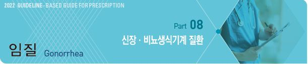
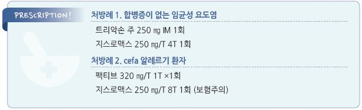

# 임질 Gonorrhea

## 일반 사항

* 원인균 : Neisseria gonorrhoeae
* 감염 시 남성에서는 요도염, 여성에서는 자궁경부염이 흔함
* 성관계 금지 : 치료 종료 7일 후까지
* 파트너 검사 : 증상 발생 또는 진단 60일 이내 관계한 성 파트너에 대한 평가를 요함
* STI 검사 : 임질이 진단된 환자는 다른 성 매개 질환(예: HIV)에 대한 검사를 요함

## 임상 양상

* 흔히 무증상; 남성 요도 감염의 30%, 자궁 경부 감염의 50%, 인두 감염의 90%에서 무증상

#### 남성 요도 감염

* 노출 2\~5일 후 증상 발생
* 화농성 성기 분비물, 배뇨통, 요도 발적, 고환 압통(편측 부고환염이 가장 흔한 합병증)

#### 여성 자궁 경부 감염

* 노출 5\~10일 후 증상 발생
* 점액농성 분비물, 배뇨통, 외음부 가려움, 골반통, 성교통, 자궁 경부 내 발적
* 합병증으로 PID 발생, \~90%에서 요도염 동반

#### 인두염

* 삼출성 인두염, 인후통, 편도 삼출물, 전경부 adenopathy

## 진단

### 검사

* 소변, 자궁 경부/요도/구강/직장 분비물(swab)에 대하여 검사
* 그람염색 : G(-) intracellular diplococci, WBC
* 배양 검사
* NAAT(PCR) : 생식기 외 감염에 대하여 선택
* 재감염이 흔하므로 치료 3개월 후 재검사 시행

***

## Management

## 약물 치료

### 합병증이 없는 Cervix, Urethra, Rectum

#### 1차 선택제 (합병증이 없는 Pharynx 감염 포함)

* ceftriaxone : 500 ㎎ ×1회 IM \[트리악손]

#### 대체제

* gentamicin 240 ㎎ IM ×1회 \[겐타마이신 주] plus azithromycin 2 g ×1회
* cefixime : 800 ㎎ ×1회 \[슈프락스]

※ Chlamydia 감염이 배제되지 않은 경우 doxycycline 100 ㎎ bid ×7d 투여 \[독시사이클린]

### 급성 부고환염

* Chlamydia 및 Gonorrhea 감염에 대하여 치료 (☞ p.654)

## 치료 후 검사

* 합병증이 없는 비뇨생식기, 직장 임균 감염의 경우 치료 후 확인 검사는 필요 없음
* 인두 감염을 대체 약제로 치료한 경우 치료 2주 후 검사 시행

> **질병코드** A54 임균감염

