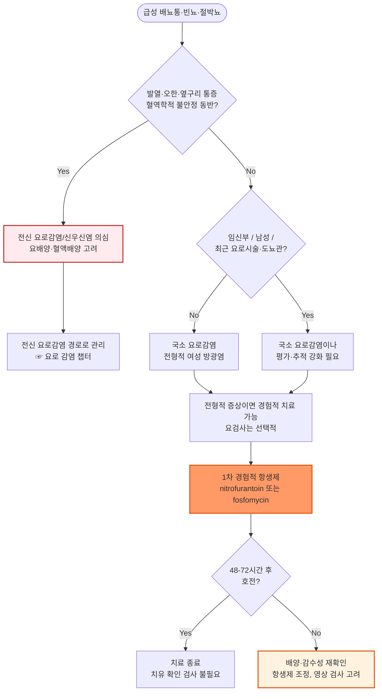

# 급성 방광염 Acute Cystitis

## <mark style="color:green;">일반 사항</mark>

* 방광에 국한된 급성 하부요로감염
* 분류 : 기존에는 성별·기저질환 유무를 기준으로 "단순(uncomplicated) vs 복잡(complicated) 방광염"을 구분했으나, 근래에는 "국소 요로감염(방광 국한) vs 전신 요로감염(방광을 넘어 진행, 발열 등 전신 증상 동반)"으로 분류함 \[IDSA·EAU·질병관리청 2025]
  * 당뇨병, 면역저하, 남성이 무조건 "복잡성" 요인은 아니며, 전신 증상 유무가 분류의 핵심 기준임
* 전염 경로 : 회음부·요도·항문으로부터의 상행 감염
* 합병증 : 신우신염(전신 요로감염)으로의 진행
  * 진행률(진단 후 30일 이내 기준) : 항생제 치료 시 치료군 약 0.5%(0\~2%), 미치료군 약 1.5%(0.4\~2.6%)로 보고됨(단, 미치료 시 증상 지속 기간은 길어짐)
* 재발성 방광염 : 6개월 내 ≥2회 또는 12개월 내 ≥3회

## <mark style="color:green;">원인</mark>

* 원인균 : E. coli(가장 흔함, 국소 요로감염의 약 70\~80%), Staphylococcus saprophyticus(특히 젊은 여성)
  * 기타 : Klebsiella pneumoniae, Proteus mirabilis, Enterococcus spp., Pseudomonas spp., Candida spp.

### <mark style="color:orange;">위험 인자</mark>

* 여성(요도 길이가 짧고 항문과 근접)
* 성관계, 살정자제·다이아프램 사용
* 폐경 후 상태(에스트로겐 감소로 인한 질 미생물총 변화)
* 고령
* 당뇨병, 면역 저하
* UTI 과거력, 재발성 UTI의 가족력
* 배뇨 장애 질환(예 : 요실금, 신경인성 방광)
* 도뇨관 유치, 입원, 최근 비뇨기계 시술

## <mark style="color:green;">임상 양상</mark>

* 흔한 증상 : 갑자기 발생한 빈뇨, 절박뇨, 배뇨통
* 덜 흔한 증상 : 혈뇨(특히 여성), 치골상부 불쾌감/압통, 악취가 나는 소변
* 고령자에서는 전형적 증상 없이 섬망·기능 저하만 나타날 수 있음 (☞ 무증상 세균뇨와의 감별이 특히 중요)
  * 단, 국소 요로 증상이나 전신 감염 소견 없이 섬망만으로 UTI를 진단하거나 항생제를 시작해서는 안 됨\[IDSA, AGS Choosing Wisely]

### <mark style="color:$danger;">🚩 Red Flags!</mark>

<mark style="color:$danger;">**즉각 조치 또는 의뢰**</mark>

* 발열·오한과 함께 빈맥, 저혈압, 의식 변화 등 패혈증/패혈성 쇼크 의심 소견 → 전신 요로감염(신우신염)·요로패혈증
* 급성 요폐(urinary retention), 특히 남성
* 임신부에서 발열 동반 방광염 증상 → 신우신염·조산 위험

<mark style="color:$warning;">**당일 또는 조기 의뢰**</mark>

* 발열(≥38℃) 또는 옆구리 통증, 늑골척추각 압통 동반 → 신우신염
* 남성에서 방광염 유사 증상 + 골반/음경 통증, 배뇨 지연·점적(dribbling) → 세균성 전립선염
* 당뇨병·면역저하 환자에서 치료 24\~48시간 내 반응이 지연되는 경우
* 임신부의 세균뇨(유증상/무증상) 확인

<mark style="color:$info;">**외래 추적 / 추가 평가 계획**</mark> <mark style="color:$info;">- 즉각 위험 낮으나 호전 없으면 의뢰</mark>

* 1차 경험적 항생제 치료 48\~72시간 후에도 증상 호전 없음
* 최근 6개월 내 2회 이상 또는 최근 12개월 내 3회 이상 재발
* 폐경 후 여성의 반복 감염

## <mark style="color:green;">진단</mark>

* 배뇨통·빈뇨·절박뇨·치골상부 압통·육안적 혈뇨 등 방광에 국한된 급성 요로 증상이 있으면서 농뇨(≥10 백혈구/HPF) 또는 세균뇨(≥10⁵ CFU/㎖)가 확인될 때 진단 \[질병관리청 요로감염 항생제 사용지침, 2025]
* 전형적인 배뇨통·빈뇨를 보이는 건강한 여성에서는 요검사 없이도 임상적으로 진단 가능하며, 요검사는 진단을 지지하는 소견으로 활용함 \[IDSA, EAU, NICE]

### <mark style="color:orange;">소변 검사</mark>

* U/A : 농뇨(WBC ≥10/HPF), 세균뇨; 증상의 중증도와 농뇨/세균뇨 정도가 일치하지는 않음
* 시험지봉 검사 : leukocyte esterase, nitrite; 두 가지 모두 양성 시 요로감염 확률 약 80%
* 배양 검사 : 전형적인 국소 요로감염에서는 일반적으로 불필요
  * 검사 대상 : 진단이 불확실한 경우, 전신 요로감염(신우신염) 의심, 비전형적 증상, 임신부, 남성, 재발성 감염, 최근 항생제 치료 실패
  * 진단 기준 : ≥10⁵ CFU/mL&#x20;
    * 과거 Kass 기준(≥10⁵ CFU/mL)은 무증상 세균뇨 진단 기준에서 유래하였으며, 증상이 있는 여성에서는 ≥10³ CFU/mL도 임상적으로 의미 있다고 간주됨\[IDSA]; 단, 국내 2025 지침상의 기준은 ≥10⁵ CFU/mL임

### <mark style="color:orange;">영상 검사</mark>

* 전형적인 여성 국소 요로감염에서는 불필요
* 남성에서의 방광염은 드물기 때문에 발생 시 결석, 전립선염, 만성 요저류 등 감별을 위해 복부 초음파, 잔뇨 검사를 고려; 방광경 검사는 급성 방광염 자체에서는 일반적이지 않으며 혈뇨 지속·재발성 감염·종양 의심 시에 한해 고려
* CT : 신우신염, 치료 반응 없는 재발 감염, 해부학적 이상이 의심되는 경우(72시간 치료 후에도 반응 없을 때)

### <mark style="color:orange;">감별</mark>

* 고열, 오한, 옆구리 통증, 근육통 → 신우신염(전신 요로감염), 세균성 전립선염
* 남성에서의 골반/음경 통증, 사정통, 배뇨 지연·점적 → 세균성 전립선염
* 남성에서의 재발성 방광염 유사 증상 → 만성 전립선염/만성 골반통증후군; 세균뇨 유무로 세균성 전립선염과 감별
* 성관계가 활발한 경우 → Chlamydia, Gonorrhea (요도염)
* 배뇨통은 있으나 농뇨·세균뇨가 확인되지 않는 경우 → 간질성 방광염/방광통증후군, 과민성 방광
* 무증상 세균뇨 → 증상이 없으므로 치료하지 않음(임신부·침습적 비뇨기 시술 예정자 제외)

<table><thead><tr><th width="166.66668701171875">질환</th><th width="220.4761962890625">방광염과의 차이점</th><th>핵심 감별 포인트</th></tr></thead><tbody><tr><td>신우신염(전신 요로감염)</td><td>감염이 방광을 넘어 진행</td><td>발열, 오한, 옆구리 통증, 늑골척추각 압통, 전신 증상 동반</td></tr><tr><td>세균성 전립선염</td><td>남성에서 전립선까지 침범</td><td>회음부·골반통, 배뇨 지연, 직장수지검사 시 전립선 압통</td></tr><tr><td>요도염(Chlamydia, Gonorrhea)</td><td>요도에 국한, 성매개</td><td>배뇨통이 배뇨 시작 시 국한, 질/요도 분비물, 성접촉력</td></tr><tr><td>간질성 방광염/방광통증후군</td><td>비감염성, 만성 경과</td><td>반복되는 배양 음성, 만성적 골반통, 항생제 반응 없음</td></tr><tr><td>무증상 세균뇨</td><td>세균뇨는 있으나 증상 없음</td><td>급성 요로 증상 부재 → 치료 불필요</td></tr></tbody></table>



<p align="center"><strong>급성 방광염 진단 및 치료 알고리듬</strong></p>

<p align="center"><em><mark style="color:$info;">Ref. 질병관리청·대한항균요법학회. 요로감염 항생제 사용지침(2025); IDSA Complicated UTI Guideline(2025)</mark></em></p>

***

## <mark style="background-color:$warning;">Management</mark>


* **5단계 경험적 항생제 선택 접근법** \[요로감염 항생제 사용지침, 2025]
  * 0단계 증상에 따른 질환 분류(국소 vs 전신) \
    → 1단계 중증도(패혈증 여부) 평가 \
    → 2단계 내성균 위험 인자 평가(최근 6개월 내 항생제/입원력, 요양시설 거주, ESBL 분리력 등) \
    → 3단계 환자별 고려사항(알레르기, 신기능, 약물 상호작용) \
    → 4단계(패혈증 시) 기관 항생제 감수성 결과 활용

### <mark style="color:orange;">치료 방침</mark>

* 국소 요로감염은 기저질환 유무와 관계없이 동일한 1차 경험적 항생제(nitrofurantoin 또는 fosfomycin)를 사용
* ciprofloxacin 등 fluoroquinolone은 부작용(건염·건파열, QT 연장, 저혈당 등)과 내성 문제로 1차 약제에서 제외 (✽국내 급여기준상으로 1차 약제 치료 실패 시에만 사용 가능)
* 치료 후 증상이 소실되면 치유 확인을 위한 U/A·배양 검사는 불필요
* 48\~72시간 치료에도 반응이 없으면 배양·감수성 재확인 및 항생제 조정, 구조적 이상(요로 폐쇄·농양 등) 감별 필요
  * 단, fosfomycin 단회 요법은 요중 유효 농도가 3일 이상 유지되므로, 복용 후 24\~48시간 내 증상이 완전히 소실되지 않았다고 하여 조기에 치료 실패로 판단, 다른 항생제로 교체하지 않도록 주의

## <mark style="color:green;">비-약물 치료 및 예방</mark>

* 수분 섭취 권장(과도한 강제 이뇨는 근거 부족)
  * 평소 수분 섭취가 하루 1.5 L 미만인 폐경 전 여성에서 하루 1.5 L를 추가 섭취하면 재발이 48% 감소한다는 보고가 있음
* 배뇨 후 앞에서 뒤로 닦기, 배뇨 지연 습관 교정
* 성관계 후 배뇨 습관 — 재발 예방 효과에 대한 근거는 제한적이나 흔히 권고됨
* 살정자제(spermicide)·다이아프램 사용을 피하면 재발 위험을 줄일 수 있음
* 프로바이오틱스(락토바실루스 등), 시판 "요로 건강" 보조제는 예방 효과에 대한 근거가 불충분함

#### <mark style="color:$primary;">재발성 방광염 예방 (AUA/CUA/SUFU 2025)</mark>

* 항생제 예방요법의 "collateral damage"(내성 유발, 부작용)를 고려하여 비항생제 전략을 우선 고려
* 폐경 후 여성 : 질 에스트로겐 요법 — 다른 금기가 없다면 우선 고려(강 권고)
* Cranberry(크랜베리) 제제 : 근거 수준은 제한적이나 시도해 볼 수 있는 보조적 선택지
* D-mannose : 근거 불충분, 일상적 권고 수준은 아님
* Methenamine hippurate <mark style="color:blue;">\[유로렉스]</mark> : 항생제 예방요법 대비 비열등 근거(예 : ALTAR trial)가 있어 대안으로 고려 가능; 1,000 ㎎ bid
* 위 방법으로 조절되지 않는 경우 저용량 지속 예방적 항생제 또는 성관계 후 예방(postcoital prophylaxis) 고려 — 장기간 항생제 노출에 따른 내성·부작용을 환자와 상의

***

## <mark style="color:green;">약물 치료</mark>

### <mark style="color:orange;">항생제 (국소 요로감염 — 1차·대안)</mark>

<table><thead><tr><th width="70">구분</th><th width="149.52374267578125">성분명 [상품명]</th><th width="158.09521484375">용법</th><th>최소 투여 기간·비고</th></tr></thead><tbody><tr><td>1차</td><td>nitrofurantoin <br>[니트로푸란토인]</td><td>50~100 mg qid¹⁾ (식후·취침 전)</td><td>5일; CrCl &#x3C;30 금기, 임신 38주 이후 금기, 신우신염에는 부적절</td></tr><tr><td>1차</td><td>fosfomycin <br>[모노롤]</td><td>3 g 1회(공복 또는 취침 전)</td><td>1일; 대부분의 신기능에서 용량 조절 없이 사용 가능(중증 신부전 자료는 제한적), 신우신염에는부적절</td></tr><tr><td>대안</td><td>TMP/SMX <br>[셉트린]</td><td>160/800 mg bid</td><td>3일; 국내 내성률 약 30%로 가능하면 배양 확인 후 사용; CrCl &#x3C;30에서는 사용 금기(해외 일부 자료는 중증 신부전에서 감량 사용을 언급하나, 국내 기준으로는 회피 권장)</td></tr><tr><td>대안</td><td>ciprofloxacin²⁾ <br>[씨프로바이]</td><td>250~500 mg bid</td><td>3일; 1차 약제 치료 실패·알레르기 시에만(국내 급여기준상 1차 약제 사용 불가)</td></tr></tbody></table>

¹⁾_국내에는 macrocrystal/monohydrate 서방형 제형이 유통되지 않아, 국제 지침의 100 mg bid×5일 대신 국내 허가 제형(immediate-release) 기준 50\~100 mg qid×5일을 사용함; 1일 4회 복용은 순응도 저하의 흔한 원인이므로, 순응도가 우려되는 환자에서는 fosfomycin 단회 요법을 우선 고려할 수 있음_

²⁾ _FDA는 다른 치료 선택지가 있는 경우 uncomplicated infection에서 fluoroquinolone 사용 제한을 권고함(건염·건파열, 대동맥류/박리 위험, QT 연장, 저혈당, 말초신경병증 등)_


**국소 요로감염에서 분리된 E. coli의 항생제 감수성** : nitrofurantoin 98.9%, fosfomycin 96.8%, cefotaxime 82.4%, ciprofloxacin 50.9%, TMP-SMX 68.1% (대한요로생식기감염학회, 2023년 전국 감시자료; Yu SH, et al. Investig Clin Urol 2025); ciprofloxacin·TMP-SMX의 내성 문제로 경험적 1차 약제로는 권장되지 않음



**경구 베타락탐계(cefpodoxime, cefdinir, cefcapene, cefditoren, cefixime, amoxicillin/clavulanate)에 대하여**\
2010년 IDSA/ESCMID 국제 지침에서는 국소 요로감염의 대안 약제로 열거되었으나, 2025년 국내 실무 지침의 경험적 1차·대안 항생제 목록에는 포함되지 않음. 상대적으로 낮은 근거 수준과 collateral damage(내성 유발, C. difficile 등) 우려로 국내에서는 nitrofurantoin·fosfomycin·TMP-SMX 우선 사용을 권장하며, 배양 결과에 따른 표적 치료 시에만 선택적으로 고려


### <mark style="color:orange;">기타</mark>

* 항진균제 : 칸디다 감염 시
  * fluconazole : 200 ㎎/d ×2주 <mark style="color:blue;">\[푸루나졸]</mark> (☞ [손발톱백선증](../229_/173_-onychomycosis-tinea-unguium.md#undefined-10))
* 진경제 (☞ [소화기계약제](../224_/073_.md#gi-antispasmodic-agent))
  * cimetropium : 50 ㎎ tid <mark style="color:blue;">\[알기론]</mark>
  * scopolamine : 10\~20 ㎎ tid\~qid <mark style="color:blue;">\[부스코판]</mark>
  * tiropramide : 100 ㎎ bid\~tid <mark style="color:blue;">\[티로파]</mark>
* 진통제 (☞ [통증](../220_/001_-pain.md#undefined-8))
  * ibuprofen : 400\~800 ㎎ tid <mark style="color:blue;">\[부루펜]</mark>
  * acetaminophen : 650\~1,300 ㎎ tid <mark style="color:blue;">\[타이레놀]</mark>
* 방광 마취제 : 항생제 치료 시작과 함께 병용, 최대 2일간 사용
  * phenazopyridine : 200 ㎎ tid ×2d <mark style="color:blue;">\[유니페나딘]</mark>; 눈물·소변이 오렌지색으로 변색될 수 있음; 감염을 치료하지 않으므로 항생제와 병용
    * 복용 중에는 소변이 오렌지\~적색으로 착색되어 요시험지봉(dipstick) 판독이 방해받을 수 있음 — 추적 요검사가 필요하면 복용 중단 후 시행

***

### <mark style="color:red;">질병코드</mark>

N30 방광염

N30.0 급성 방광염

***

## <mark style="color:purple;">처방례</mark>

> **처방례 1. 1차 선택 — 전형적 경증 방광염**
>
> ```
> 니트로푸란토인캡슐 50 mg  8Cap(1회 2Cap=100 mg)  #4 ×5일 (식후·취침 전)
> 티로파 100 mg/T  2T  #2
> 부루펜 200 mg/T  6T(1회 3T=600 mg)  #2 (불편 증상 없으면 생략)
> ```
>
> _✽nitrofurantoin은 국내 원인균 감수성이 98.9%로 가장 높고 collateral damage가 적어 1차 선택제로 권장됨; 신우신염 의심 시에는 부적절; 오심 등 위장 장애가 우려되면 50 mg qid(1회 1Cap)부터 시작하는 것도 가능_

> **처방례 2. 순응도 우선 — 단회 요법**
>
> ```
> 모노롤 산 3 g  1포  1회 (공복 또는 취침 전)
> 알기론 50 mg  2T  #2
> ```
>
> _✽1회 복용으로 치료가 완결되어 복약 순응도가 중요한 경우(출장, 단기 여행 등) 선호; 신기능 저하 환자에서도 용량 조절 없이 사용 가능_

> **처방례 3. 1차 약제 사용 불가 시(감수성 확인 권장)**
>
> ```
> 셉트린 160/800 mg  2T  #2 ×3일
> ```
>
> _✽국내 TMP-SMX 내성률이 약 30%에 달하므로, 가능하면 배양 결과 확인 후 처방; ciprofloxacin은 국내 급여기준상 1차 약제 치료 실패 시에만 사용 가능_

> **처방례 4. 재발성 방광염 — 성관계 후 예방**
>
> ```
> 니트로푸란토인캡슐 50 mg  1Cap  성관계 후 1회 필요시
> ```
>
> _✽6개월 내 2회 이상 또는 12개월 내 3회 이상 재발하며 성관계와 뚜렷한 연관성이 있는 경우 고려; 폐경 후 여성에서는 질 에스트로겐 병행을 우선 고려_

***

### <mark style="color:$success;">핵심 복약 지도</mark>

> **nitrofurantoin 복용 시 주의사항**
>
> * 반드시 식사와 함께 또는 식후 복용 — 위장 자극 감소 및 흡수율 향상
> * CrCl 30 mL/min 미만인 경우 유효 요중 농도에 도달하지 못해 사용하지 않음(고령자는 신기능 확인 필요)
> * 신우신염이 의심되면 즉시 다른 항생제로 변경 — nitrofurantoin은 신실질 내 농도가 낮아 상부 요로감염에는 효과가 부적절함
> * 임신 38주 이후에는 신생아 용혈성 빈혈 위험으로 금기

> **fosfomycin 복용 시 주의사항**
>
> * 1회 복용으로 치료가 종료되나, 증상이 완전히 사라지기까지 2\~3일이 걸릴 수 있음을 미리 설명
> * 공복 또는 취침 전(배뇨 후) 복용 시 흡수가 가장 좋음

> **언제 다시 병원을 방문해야 하나요?**
>
> * 항생제 복용 48\~72시간이 지나도 증상이 호전되지 않는 경우
> * **발열, 오한, 옆구리 통증**이 새로 나타나는 경우 — 신우신염 가능성, 즉시 내원
> * 임신 중 증상이 있거나 세균뇨가 확인된 경우 — 반드시 치료 및 산과 협진
> * 6개월에 2회 이상 또는 1년에 3회 이상 재발하는 경우 — 재발 원인 평가 필요

***

### <mark style="color:blue;">환자 안내서</mark>


**급성 방광염, 흔하지만 제대로 치료하면 대부분 빨리 좋아집니다**

방광염은 세균이 요도를 통해 방광으로 들어가 염증을 일으키는 흔한 감염입니다. 여성에게 특히 흔하며, 처방받은 항생제를 정해진 기간 동안 복용하면 대부분 며칠 안에 증상이 좋아집니다.


#### <mark style="color:$primary;">왜 방광염이 생기나요?</mark>

* 여성은 요도가 짧고 항문과 가까워 세균(주로 대장균)이 방광으로 들어가기 쉽습니다.
* 성관계, 배뇨를 오래 참는 습관, 폐경 이후 호르몬 변화 등이 위험을 높일 수 있습니다.

#### <mark style="color:$primary;">일상생활에서 어떻게 관리하나요?</mark>

* **물을 충분히 드십시오.** 소변으로 세균을 씻어내는 데 도움이 됩니다.
* **소변을 오래 참지 마십시오.** 방광에 세균이 머무는 시간을 줄여줍니다.
* **배뇨 후에는 앞에서 뒤로 닦으십시오.** 항문 부위 세균이 요도로 옮겨가는 것을 줄일 수 있습니다.
* **성관계 후에는 소변을 보십시오.** 재발이 잦다면 담당 의사와 예방적 관리 방법을 상의하십시오.

#### <mark style="color:$primary;">약은 어떻게 써야 하나요?</mark>

* 증상이 하루 이틀 만에 좋아지더라도 **처방된 기간까지 항생제를 모두 복용**하십시오.
* 1회만 복용하는 약(fosfomycin)을 처방받았다면, 효과가 나타나기까지 2\~3일 정도 걸릴 수 있습니다.
* 방광 마취제(phenazopyridine)를 복용하면 소변이 주황색으로 변할 수 있는데, 정상적인 현상입니다. 이 약은 통증만 줄여줄 뿐 감염을 치료하지 않으므로 항생제와 함께 복용하십시오.

#### <mark style="color:$primary;">이럴 때는 즉시 병원을 방문하세요</mark>

* 열이 나거나 옆구리(등쪽)가 아픈 경우
* 항생제를 2\~3일 복용해도 증상이 나아지지 않는 경우
* 임신 중인 경우
* 6개월에 2번 이상 또는 1년에 3번 이상 방광염이 반복되는 경우
