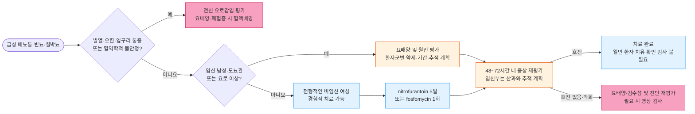

# 급성 방광염 Acute Cystitis

## <mark style="color:green;">일반 사항</mark>

* 방광에 국한된 급성 하부요로감염
* 분류 : 기존에는 성별·기저질환 유무를 기준으로 "단순(uncomplicated) vs 복잡(complicated) 방광염"을 구분했으나, 근래에는 "국소 요로감염(방광 국한) vs 전신 요로감염(방광을 넘어 진행, 발열 등 전신 증상 동반)"으로 분류함 \[IDSA·EAU·질병관리청 2025]
  * 당뇨병, 면역저하, 남성이 무조건 "복잡성" 요인은 아니며, 전신 증상 유무가 분류의 핵심 기준임
* 전염 경로 : 회음부·요도·항문으로부터의 상행 감염
* 합병증 : 신우신염(전신 요로감염)으로의 진행
  * 스웨덴의 비임신 여성 관찰 연구에서 진단 후 30일 내 신우신염 발생은 항생제 처방·조제군 약 0.5%, 비조제군 약 1.5%로 보고됨. 관찰 연구의 연관성이며 남성·임신부·면역저하 환자에게 그대로 적용할 수 없음 [Jansåker, et al. Antibiotics 2022]
* 재발성 방광염 : 6개월 내 ≥2회 또는 12개월 내 ≥3회 증상성 감염. 재발 진단과 예방요법 결정 전에는 요배양으로 감염을 확인하고 다른 원인을 감별

## <mark style="color:green;">원인</mark>

* 원인균 : _E. coli_(가장 흔함, 국소 요로감염의 약 70\~80%), _Staphylococcus saprophyticus_(특히 젊은 여성)
  * 기타 : _Klebsiella pneumoniae_, _Proteus mirabilis_, _Enterococcus_ spp., _Pseudomonas_ spp., _Candida_ spp.

### <mark style="color:orange;">위험 인자</mark>

* 여성(요도 길이가 짧고 항문과 근접)
* 성관계, 살정자제·다이아프램 사용
* 폐경 후 상태(에스트로겐 감소로 인한 질 미생물총 변화)
* 고령
* 당뇨병, 면역 저하
* UTI 과거력, 재발성 UTI의 가족력
* 배뇨 장애 질환(예 : 요실금, 신경인성 방광)
* 도뇨관 유치, 입원, 최근 비뇨기계 시술

## <mark style="color:green;">임상 양상</mark>

* 흔한 증상 : 갑자기 발생한 빈뇨, 절박뇨, 배뇨통
* 덜 흔한 증상 : 혈뇨(특히 여성), 치골상부 불쾌감/압통, 악취가 나는 소변
* 고령자의 섬망·기능 저하에서는 요로감염 외 원인과 무증상 세균뇨를 함께 감별
  * 단, 국소 요로 증상이나 전신 감염 소견 없이 섬망만으로 UTI를 진단하거나 항생제를 시작해서는 안 됨\[IDSA, AGS Choosing Wisely]

### <mark style="color:$danger;">🚩 Red Flags!</mark>

<mark style="color:$danger;">**즉각 조치 또는 의뢰**</mark>

* 발열·오한과 함께 빈맥, 저혈압, 의식 변화 등 패혈증/패혈성 쇼크 의심 소견 → 전신 요로감염(신우신염)·요로패혈증
* 급성 요폐(urinary retention), 특히 남성
* 임신부에서 발열 동반 방광염 증상 → 신우신염·조산 위험

<mark style="color:$warning;">**당일~수일 내 평가**</mark>

* 발열(≥38℃) 또는 옆구리 통증, 늑골척추각 압통 동반 → 신우신염
* 남성에서 방광염 유사 증상 + 골반/음경 통증, 배뇨 지연·점적(dribbling) → 세균성 전립선염
* 당뇨병·면역저하 환자에서 치료 24\~48시간 내 반응이 지연되는 경우
* 임신부의 세균뇨(유증상/무증상) 확인 → 당일 산과 진료·치료 계획 수립

<mark style="color:$info;">**외래 추적 / 추가 평가 계획**</mark> <mark style="color:$info;">- 즉각 위험 낮으나 호전 없으면 의뢰</mark>

* 1차 경험적 항생제 치료 48\~72시간 후에도 증상 호전 없음
* 최근 6개월 내 2회 이상 또는 최근 12개월 내 3회 이상 재발
* 폐경 후 여성의 반복 감염

## <mark style="color:green;">진단</mark>

* 배뇨통·빈뇨·절박뇨·치골상부 압통·육안적 혈뇨 등 방광에 국한된 급성 요로 증상이 있으면서 농뇨(≥10 백혈구/HPF) 또는 세균뇨(≥10⁵ CFU/㎖)가 확인될 때 진단 \[질병관리청 요로감염 항생제 사용지침, 2025]
* 전형적인 배뇨통·빈뇨를 보이고 질 분비물·질 자극 증상이 없는 비임신 여성에서는 요검사 없이도 임상적으로 진단 가능하며, 요검사는 진단을 지지하는 소견으로 활용함 \[EAU, NICE]

### <mark style="color:orange;">소변 검사</mark>

* U/A : 농뇨(WBC ≥10/HPF), 세균뇨; 증상의 중증도와 농뇨/세균뇨 정도가 일치하지는 않음
* 시험지봉 검사 : leukocyte esterase, nitrite; 두 가지 모두 양성 시 요로감염 확률 약 80%
* 배양 검사 : 전형적인 국소 요로감염에서는 일반적으로 불필요
  * 검사 대상 : 진단이 불확실한 경우, 전신 요로감염(신우신염) 의심, 비전형적 증상, 임신부, 남성, 재발성 감염, 최근 항생제 치료 실패 또는 2주 내 증상 재발
  * 국내 실무지침의 세균뇨 기준 : ≥10⁵ CFU/㎖. 단, 증상이 뚜렷한 여성에서는 이보다 낮은 균수도 의미가 있을 수 있으므로, 배양 수치만으로 감염을 배제하지 않음

### <mark style="color:orange;">영상 검사</mark>

* 전형적인 여성 국소 요로감염에서는 불필요
* 남성에서의 방광염은 드물기 때문에 발생 시 결석, 전립선염, 만성 요저류 등 감별을 위해 복부 초음파, 잔뇨 검사를 고려; 방광경 검사는 급성 방광염 자체에서는 일반적이지 않으며 혈뇨 지속·재발성 감염·종양 의심 시에 한해 고려
* CT : 신우신염, 치료 반응 없는 재발 감염, 해부학적 이상이 의심되는 경우(72시간 치료 후에도 반응 없을 때)

### <mark style="color:orange;">감별</mark>

* 고열, 오한, 옆구리 통증, 근육통 → 신우신염(전신 요로감염), 세균성 전립선염
* 남성에서의 골반/음경 통증, 사정통, 배뇨 지연·점적 → 세균성 전립선염
* 남성에서의 재발성 방광염 유사 증상 → 만성 전립선염/만성 골반통증후군; 세균뇨 유무로 세균성 전립선염과 감별
* 새 성접촉력, 요도·질 분비물 또는 질 자극 증상이 있는 경우 → 요도염(_C. trachomatis_, _N. gonorrhoeae_ 등), 질염; 의심 시 적절한 검체로 STI 검사 고려
* 배뇨통은 있으나 농뇨·세균뇨가 확인되지 않는 경우 → 간질성 방광염/방광통증후군, 과민성 방광
* 무증상 세균뇨 → 증상이 없으므로 치료하지 않음(임신부·점막 손상이 예상되는 비뇨기계 시술 예정자 제외)

<table><thead><tr><th>질환</th><th>방광염과의 차이점</th><th>핵심 감별 포인트</th></tr></thead><tbody><tr><td>신우신염(전신 요로감염)</td><td>감염이 방광을 넘어 진행</td><td>발열, 오한, 옆구리 통증, 늑골척추각 압통, 전신 증상 동반</td></tr><tr><td>세균성 전립선염</td><td>남성에서 전립선까지 침범</td><td>회음부·골반통, 배뇨 지연, 직장수지검사 시 전립선 압통</td></tr><tr><td>요도염·질염</td><td>방광 외 부위의 감염·염증</td><td>요도·질 분비물, 질 자극 증상, 성접촉력; 의심 시 STI 검사</td></tr><tr><td>간질성 방광염/방광통증후군</td><td>비감염성, 만성 경과</td><td>반복되는 배양 음성, 만성적 골반통, 항생제 반응 없음</td></tr><tr><td>무증상 세균뇨</td><td>세균뇨는 있으나 증상 없음</td><td>급성 요로 증상 부재 → 원칙적으로 치료 불필요</td></tr></tbody></table>



<p align="center"><strong>급성 방광염 진단 및 치료 알고리듬</strong></p>

<p align="center"><em><mark style="color:$info;">Ref. 질병관리청·대한항균요법학회. 요로감염 항생제 사용지침(2025);</mark></em> <br><em><mark style="color:$info;">IDSA Complicated UTI Guideline(2025)</mark></em></p>

***

## <mark style="background-color:$warning;">Management</mark>

* **경험적 항생제 선택 단계** \[요로감염 항생제 사용지침, 2025]
  * 0단계 증상에 따른 질환 분류(국소 vs 전신)\
    → 1단계 중증도(패혈증 여부) 평가\
    → 2단계 내성균 위험 인자 평가(최근 6개월 내 항생제/입원력, 요양시설 거주, ESBL 분리력 등)\
    → 3단계 환자별 고려사항(알레르기, 신기능, 약물 상호작용)\
    → 4단계(패혈증 시) 기관 항생제 감수성 결과 활용

### <mark style="color:orange;">치료 방침</mark>

* 국내 실무지침은 국소 요로감염에 nitrofurantoin 또는 fosfomycin을 권장함. 다만 분류상 국소 감염이어도 임신부·남성·도뇨관 유치 환자·요로 구조/기능 이상 환자에게 여성 단순 방광염의 약제·기간·추적 계획을 일률적으로 적용하지 않음
  * 남성 : 요배양 및 전립선 침범·요폐 등을 평가. 전립선 침범을 배제한 일부 방광 국한 감염에서 nitrofurantoin을 고려할 수 있으나 최적 기간 근거가 제한적이며, fosfomycin 3 g 단회는 국내 제품의 남성 방광염 허가 적응증이 아님
  * 임신부 : 치료 전 요배양, 임신 주수와 약제 안전성을 고려한 표적 치료 및 산과 추적. 증상 소실 후에도 치료 종료 1~2주 뒤 요배양을 고려하거나 증상 재발 시 검사
  * 도뇨관·요로 이상 : 증상과 집락화를 구분하고 도뇨관 교체·폐쇄 해소 등 원인 교정 여부와 항생제 선택·기간을 개별 결정
* ciprofloxacin 등 fluoroquinolone은 부작용(건염·건파열, QT 연장, 저혈당 등)과 내성 문제로 1차 약제에서 제외 (✽국내 급여기준상으로 1차 약제 치료 실패 시에만 사용 가능)
* 비임신 일반 환자는 치료 후 증상이 소실되면 치유 확인을 위한 U/A·배양 검사가 불필요함(임신부는 별도 추적 고려)
* 48\~72시간 치료에도 반응이 없으면 배양·감수성 재확인 및 항생제 조정, 구조적 이상(요로 폐쇄·농양 등) 감별 필요
  * 단, fosfomycin 단회 요법은 요중 유효 농도가 3일 이상 유지되므로, 복용 후 24\~48시간 내 증상이 완전히 소실되지 않았다고 하여 조기에 치료 실패로 판단, 다른 항생제로 교체하지 않도록 주의

## <mark style="color:green;">비-약물 치료 및 예방</mark>

* 수분 섭취 권장(과도한 강제 이뇨는 근거 부족)
  * 평소 수분 섭취가 하루 1.5 L 미만인 폐경 전 여성에서 하루 1.5 L를 추가 섭취하면 재발이 48% 감소한다는 보고가 있음
* 배뇨 후 앞에서 뒤로 닦기, 배뇨 지연 습관 교정
* 성관계 후 배뇨 습관 - 재발 예방 효과에 대한 근거는 제한적이나 흔히 권고됨
* 살정자제(spermicide)·다이아프램 사용을 피하면 재발 위험을 줄일 수 있음
* 프로바이오틱스(락토바실루스 등), 시판 "요로 건강" 보조제는 예방 효과에 대한 근거가 불충분함

### <mark style="color:orange;">재발성 방광염 예방 (AUA/CUA/SUFU 2025)</mark>

* 항생제 예방요법의 "collateral damage"(내성 유발, 부작용)를 고려하여 비항생제 전략을 우선 고려
* 폐경 이행기·폐경 후 여성 : 질 에스트로겐 요법 - 다른 금기가 없다면 우선 고려
* Cranberry(크랜베리) 제제 : AUA/CUA/SUFU 2025는 여성 재발성 UTI 예방 선택지로 권고(중등도 권고, 근거 B). 제품별 유효 성분·함량 차이 및 효과의 개인차를 설명
* D-mannose : 근거 불충분, 일상적 권고 수준은 아님
* Methenamine hippurate <mark style="color:blue;">\[유로렉스정]</mark> : 항생제 예방요법 대비 비열등 근거(ALTAR trial)가 있어 일부 재발성 감염에서 대안으로 고려; 1,000 ㎎ bid. 국내 허가사항은 원인균·감수성 정보를 이용할 수 없거나 적절한 항생제가 없는 환자에서 사용하도록 제한. 신장애·중증 간장애 등 금기, TMP/SMX 등 설폰아마이드계 약물·요 알칼리화제 병용 금기
* 위 방법으로 조절되지 않는 경우 저용량 지속 예방적 항생제 또는 성관계 후 예방(postcoital prophylaxis) 고려 - 장기간 항생제 노출에 따른 내성·부작용을 환자와 상의

***

## <mark style="color:green;">약물 치료</mark>

### <mark style="color:orange;">항생제 (국소 요로감염 - 1차·대안)</mark>

<table><thead><tr><th>구분</th><th>성분명 [상품명]</th><th>성인 용법</th><th>기간·주요 주의사항</th></tr></thead><tbody><tr><td>1차¹⁾</td><td>nitrofurantoin<br>[<mark style="color:blue;">니트로푸란토인캡슐 50 ㎎</mark>]</td><td>50~100 ㎎ qid (식후 및 취침 전)</td><td>5일; CrCl &lt;30 ㎖/min·임신 38~42주 금기, G6PD 결핍 주의. 신우신염·전립선염에는 부적절</td></tr><tr><td>1차²⁾</td><td>fosfomycin trometamol<br>[<mark style="color:blue;">모누롤산</mark>]</td><td>포스포마이신으로서 3 g 1회 (물에 녹여 공복·취침 전, 배뇨 후)</td><td>성인 여성 급성 단순 방광염의 국내 허가 적응증; CrCl ≤10 ㎖/min 금기. 신우신염에는 부적절</td></tr><tr><td>대안</td><td>TMP/SMX<br>[<mark style="color:blue;">셉트린정 80/400 ㎎</mark>]</td><td>160/800 ㎎ bid (1회 2정)</td><td>비임신 여성 3일; 국내 감수성 68.1%로 가능하면 배양 결과 확인. CrCl 10~29 ㎖/min에서는 감량 필요, &lt;10 ㎖/min·혈액투석에서는 사용 금기</td></tr><tr><td>대안</td><td>ciprofloxacin³⁾<br>[<mark style="color:blue;">씨프로바이</mark>]</td><td>250~500 ㎎ bid</td><td>비임신 여성 3일; 다른 적절한 약제를 사용할 수 없거나 1차 치료 실패 시 고려. 국내 국소 요로감염 급여기준 확인</td></tr></tbody></table>

¹⁾_국내 nitrofurantoin 일반 캡슐의 허가 용법은 50~100 ㎎ qid이며, 국제 지침의 macrocrystal/monohydrate 100 ㎎ bid와 제형·용법이 다름._

²⁾_Fosfomycin 단회 요법은 성인 여성 급성 단순 방광염에서 고려하며, 남성·도뇨관 관련 감염에 동일하게 확대하지 않음._

³⁾ _FDA는 다른 치료 선택지가 있는 경우 uncomplicated infection에서 fluoroquinolone 사용 제한을 권고함(건염·건파열, 대동맥류/박리 위험, QT 연장, 저혈당, 말초신경병증 등)_


**국소 요로감염에서 분리된 \_E. coli\_의 항생제 감수성** : nitrofurantoin 98.9%, fosfomycin 96.8%, cefotaxime 82.4%, ciprofloxacin 50.9%, TMP-SMX 68.1% (대한요로생식기감염학회, 2023년 전국 감시자료; Yu SH, et al. Investig Clin Urol 2025); ciprofloxacin은 감수성이 낮고(50.9%), TMP-SMX는 68.1%로 내성률이 약 30%대에 달해 경험적 1차 약제로는 권장되지 않음



**경구 베타락탐계(cefpodoxime, cefdinir, cefcapene, cefditoren, cefixime, amoxicillin/clavulanate)에 대하여**\
2010년 IDSA/ESCMID 지침은 amoxicillin/clavulanate, cefdinir, cefpodoxime 등 일부 경구 베타락탐계를 다른 권장 약제를 사용할 수 없을 때의 대안으로 언급함. 2025년 국내 실무 지침의 국소 요로감염 경험적 권장·대안 목록에는 경구 베타락탐계가 포함되지 않음. 임신 여부, 이전 배양·감수성, 약제 금기 및 다른 치료 선택지를 고려해 필요한 경우 개별적으로 선택


### <mark style="color:orange;">기타</mark>

* 항진균제 : 칸디다뇨만으로 투여하지 않음. 무증상 칸디다뇨에서는 도뇨관 등 유발 요인을 먼저 교정하고, 중증 호중구감소증·비뇨기계 처치 예정 등 예외 상황을 별도 평가
  * 감수성 균에 의한 **증상성 칸디다 방광염** : fluconazole 200 ㎎/d ×2주 <mark style="color:blue;">\[푸루나졸]</mark>; 신기능에 따른 용량 조정 및 도뇨관 제거·교체 고려 (☞ [손발톱백선증](../229_/173_-onychomycosis-tinea-unguium.md#undefined-10))
* 진경제 : 경련성 불편감이 뚜렷할 때 개별적으로 단기간 고려하며, 방광염 치료의 필수 병용약은 아님 (☞ [소화기계약제](../224_/073_.md#gi-antispasmodic-agent))
  * cimetropium : 50 ㎎ tid <mark style="color:blue;">\[알기론]</mark>
  * scopolamine : 10\~20 ㎎ tid\~qid <mark style="color:blue;">\[부스코판]</mark>
  * tiropramide : 100 ㎎ bid\~tid <mark style="color:blue;">\[티로파]</mark>
* 진통제 (☞ [통증](../220_/001_-pain.md#undefined-8))
  * ibuprofen : 400\~800 ㎎ tid <mark style="color:blue;">\[부루펜]</mark>
  * acetaminophen : 650\~1,300 ㎎ tid <mark style="color:blue;">\[타이레놀]</mark>
* 방광 진통제 : phenazopyridine 200 ㎎ tid ×최대 2일은 요로 작열감의 일시적 완화에 사용되며 감염을 치료하지 않음. 과거 제품 유니페나딘정의 허가 취소 이력이 있어 현행 국내 허가·공급을 확인하지 못한 상품명은 처방례에서 제외
  * 신부전·간질환·G6PD 결핍에서는 사용하지 않으며, 소변·눈물의 주황색 착색과 요검사 간섭 가능성을 설명

***

### <mark style="color:red;">질병코드</mark>

N30 방광염

N30.0 급성 방광염

***

## <mark style="color:purple;">처방례</mark>

> **처방례 1. 1차 선택 - 전형적 경증 방광염**
>
> ```
> 니트로푸란토인캡슐 50 ㎎  8Cap/일(1회 2Cap=100 ㎎)  #4 ×5일 (총 40Cap, 식후·취침 전)
> 부루펜 200 ㎎/T  6T/일(1회 3T=600 ㎎)  #2 필요 시 단기간 (불편 증상 없으면 생략)
> ```
>
> _✽비임신 성인 여성의 전형적 방광염 예시. Nitrofurantoin은 국내 E. coli 감수성이 98.9%로 높으나 신우신염·전립선염 의심 시에는 부적절. 신기능·임신 주수·G6PD 결핍 여부 확인_

> **처방례 2. 순응도 우선 - 단회 요법**
>
> ```
> 모누롤산(포스포마이신으로서 3 g)  1포  1회 (물에 녹여 공복, 취침 전 배뇨 후)
> ```
>
> _✽성인 여성의 급성 단순 방광염에서 허가된 단회 요법. 신우신염에는 부적절하며 CrCl ≤10 ㎖/min에서는 금기. 1포의 분말 총량과 포스포마이신 역가 3 g을 구분_

> **처방례 3. 1차 약제 사용 불가 시(감수성 확인 권장)**
>
> ```
> 셉트린정 80/400 ㎎/T  4T/일(1회 2T=160/800 ㎎)  #2 ×3일 (총 12T)
> ```
>
> _✽비임신 성인 여성의 예시. 국내 TMP/SMX 감수성은 68.1%이므로 가능하면 배양 결과 확인 후 처방. 셉트린정 1정은 TMP/SMX 80/400 ㎎이며, 신기능·고칼륨혈증 위험과 병용약을 확인_

> **처방례 4. 재발성 방광염 - 성관계 후 예방**
>
> ```
> 니트로푸란토인캡슐 50 ㎎  1Cap  성관계 후 1회 필요시
> ```
>
> _✽배양으로 확인된 재발성 방광염이 성관계와 뚜렷하게 연관된 여성에서만 고려. 신기능·임신 여부를 확인하고 예방요법의 효과와 이상반응을 주기적으로 재평가; 폐경 후 여성에서는 질 에스트로겐 우선 고려_

***

### <mark style="color:$success;">핵심 복약 지도</mark>

> **nitrofurantoin 복용 시 주의사항**
>
> * 반드시 식사와 함께 또는 식후 복용 - 위장 자극 감소 및 흡수율 향상
> * CrCl 30 ㎖/min 미만에서는 사용하지 않음(고령자는 신기능 확인 필요). G6PD 결핍이 있는 경우 용혈 위험에도 주의
> * 발열·옆구리 통증 등 신우신염이 의심되면 즉시 재평가 및 치료 변경 - nitrofurantoin은 신실질 내 농도가 낮아 상부 요로감염에는 부적절함
> * 임신 38주 이후에는 신생아 용혈성 빈혈 위험으로 금기

> **fosfomycin 복용 시 주의사항**
>
> * 1회 복용으로 치료가 종료되나, 증상이 완전히 사라지기까지 2\~3일이 걸릴 수 있음을 미리 설명
> * 모누롤산 1포를 물에 녹여 공복 또는 취침 전 배뇨 후 복용. CrCl ≤10 ㎖/min에서는 사용하지 않음

> **언제 다시 병원을 방문해야 하나요?**
>
> * 항생제 복용 48\~72시간이 지나도 증상이 호전되지 않는 경우
> * **발열, 오한, 옆구리 통증**이 새로 나타나는 경우 - 신우신염 가능성, 즉시 내원
> * 임신 중 증상이 있거나 세균뇨가 확인된 경우 - 반드시 치료 및 산과 협진
> * 6개월에 2회 이상 또는 1년에 3회 이상 재발하는 경우 - 재발 원인 평가 필요

***

## <mark style="color:blue;">환자 안내서</mark>


**급성 방광염, 흔하지만 제대로 치료하면 대부분 빨리 좋아집니다**

방광염은 세균이 요도를 통해 방광으로 들어가 염증을 일으키는 흔한 감염입니다. 여성에게 특히 흔하며, 처방받은 항생제를 정해진 기간 동안 복용하면 대부분 며칠 안에 증상이 좋아집니다.


### <mark style="color:orange;">왜 방광염이 생기나요?</mark>

* 여성은 요도가 짧고 항문과 가까워 세균(주로 대장균)이 방광으로 들어가기 쉽습니다.
* 성관계, 배뇨를 오래 참는 습관, 폐경 이후 호르몬 변화 등이 위험을 높일 수 있습니다.

### <mark style="color:orange;">일상생활에서 어떻게 관리하나요?</mark>

* **평소 부족하지 않게 물을 드십시오.** 무리하게 많은 양의 물을 한꺼번에 마실 필요는 없습니다.
* **소변을 오래 참지 마십시오.** 방광에 세균이 머무는 시간을 줄여줍니다.
* **배뇨 후에는 앞에서 뒤로 닦으십시오.** 항문 부위 세균이 요도로 옮겨가는 것을 줄일 수 있습니다.
* **성관계 후에는 소변을 보십시오.** 재발이 잦다면 담당 의사와 예방적 관리 방법을 상의하십시오.

### <mark style="color:orange;">약은 어떻게 써야 하나요?</mark>

* 증상이 하루 이틀 만에 좋아지더라도 **처방된 기간까지 항생제를 모두 복용**하십시오.
* 1회만 복용하는 약(fosfomycin)을 처방받았다면, 효과가 나타나기까지 2\~3일 정도 걸릴 수 있습니다.
* 처방받은 진통제는 불편한 증상을 줄이는 용도이며, 항생제를 대신하지 않습니다.

### <mark style="color:orange;">이럴 때는 다시 진료받으세요</mark>

* 열이 나거나 옆구리(등쪽)가 아픈 경우
* 항생제 치료 2\~3일 후에도 증상이 나아지지 않는 경우에는 재평가를 받으십시오.
* 임신 중 방광염 증상이 있으면 그날 의료진과 상의하고, 치료 후 검사 계획을 확인하십시오.
* 6개월에 2번 이상 또는 1년에 3번 이상 증상이 반복되면 진료를 받아 감염 여부와 예방 방법을 확인하십시오.
