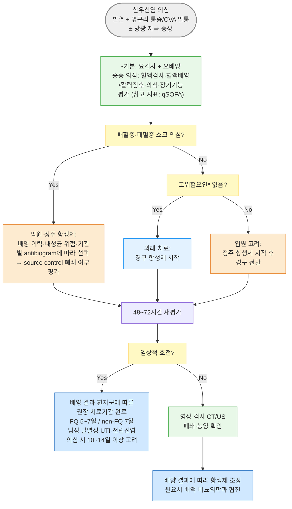

# 급성 신우신염 Acute Pyelonephritis, Uncomplicated

## <mark style="color:green;">일반 사항</mark>

* kidney parenchyma와 renal pelvis를 포함하는 신장의 감염에 따른 증상 증후군
* 다른 이름 : 상부 요로감염(upper UTI)
  * [ ] 분류 체계 참고 : 최신 지침(EAU 2025, 질병청 2025 요로감염 항생제 사용지침)은 방광에 국한된 국소 요로감염(cystitis)과 구분해, 급성 신우신염을 포함한 발열·전신증상 동반 감염을 전신 요로감염(systemic UTI) 범주로 묶어 치료 원칙을 공유함
* 경증부터 중증(패혈증)까지 다양한 수준의 임상 증상 발생
* 유병률 : 여성에서 연간 약 15\~17례/10,000명(남성 3\~4례/10,000명) 발생
  * 국내 건강보험 자료(2010\~2014) 분석에서 12개월 내 재발률 15.8%(남성 13.1%, 여성 16.1%), 입원 치료 환자의 재원 중 사망률 약 0.6/1,000례로 보고됨
* 합병증 : 신/신주위 농양(renal/perinephric abscess), 기종성 신우신염(emphysematous PN, 특히 당뇨병 환자), 패혈증·패혈성 쇼크, 급성신손상(AKI), 재발·만성화 시 콩팥 반흔 및 만성콩팥병 진행, 만성 폐쇄 동반 시 황색육아종성 신우신염(xanthogranulomatous PN)

- [ ] 본 챕터는 요로의 구조적·기능적 이상, 요로 폐쇄, 유치 도뇨관, 최근 요로기구 사용, 면역 저하, 임신 등이 없는 성인의 급성 신우신염을 중심으로 기술함; 남성·고령·당뇨병은 그 자체만으로 일률적으로 complicated로 분류하기보다, 전립선 침범 가능성·요로 이상·중증도·내성균 위험을 함께 평가. uncomplicated/complicated 이분법은 IDSA 2025 cUTI 지침 등 최신 분류 체계에서 지침마다 정의가 달라 단순 적용이 부적절해짐

**2025 요로감염 항생제 사용지침 분류 체계** \[질병청]

<table><thead><tr><th width="125.71429443359375">구분</th><th width="330.4761962890625">정의</th><th>비고</th></tr></thead><tbody><tr><td>국소 요로감염</td><td>방광에 국한된 급성 요로 증상(배뇨통·빈뇨·절박뇨·치골상부 압통 등) + 농뇨/세균뇨</td><td>기존 단순 방광염</td></tr><tr><td>전신 요로감염*</td><td>발열·오한·옆구리 통증·CVA 압통·혈역학적 불안정 등 전신 증상 ± 방광 증상</td><td>기존 단순/복잡 신우신염, 상부 요로감염 포함</td></tr></tbody></table>

_\*아래 항생제 감수성 수치는 국소 요로감염 대상이므로 전신 요로감염(신우신염) 환자군에 그대로 적용되지는 않음_

## <mark style="color:green;">원인</mark>

* 원인균 : _E. coli_(＞80%), _Klebsiella pneumoniae_, _Proteus mirabilis_, _Enterococcus_ spp., _Staphylococcus saprophyticus_
  * _Candida_ spp. - 주로 면역 저하·도뇨관 유치·요로기구 등 위험 상황에서 발생하며, uncomplicated PN에서는 드묾
* 전염 경로 : 하부 요로에서의 상행 감염(대부분), 혈행 감염(드묾)
* 기저질환·내성 위험 요인이 있을수록 _Klebsiella_, _Proteus_, _Pseudomonas_, _Enterococcus_ 등 분리율이 높아지고 내성균 가능성도 높아짐

### <mark style="color:orange;">감염 위험 인자</mark>

* 도뇨관 유치
* 성관계, 성관계 후 요로감염 병력
* 최근 요로감염 병력·재발성 UTI
* 요로 기형, 전립선비대증, 폐쇄, 신석증
* 당뇨병, 면역 저하
* 고령, 임신

### <mark style="color:orange;">내성균 위험 인자</mark>

* 6개월 이내 항생제 투여력 또는 입원력
* 요양시설 거주자
* 최근 ESBL 생성균 분리력
* 장기 유치 도뇨관 삽입
* 기저 신경학적 장애(신경인성 방광 등)
* 최근 12개월 내 fluoroquinolone 사용력 → 해당 시 경험적 fluoroquinolone 회피 권고

- [ ] 경험적 항생제 선택 시 확인

## <mark style="color:green;">임상 양상</mark>

* 전신 증상 : 갑작스런 발열(보통 ＞38.5℃; 환자의 ½에서 출현), malaise, 구역, 구토, 설사, 빈맥, 저혈압
* 옆구리 통증(½에서 출현), 늑골척추각 압통
* 방광 자극 증상(급성 방광 증상) : 빈뇨, 절박뇨, 배뇨통 - 동반될 수 있으나 필수는 아님

### <mark style="color:$danger;">🚩 Red Flags!</mark>

<mark style="color:$danger;">**즉각 조치 또는 의뢰**</mark>

* 패혈성 쇼크 징후 : 적절한 수액 요법에도 혈압 유지를 위해 승압제가 필요하거나 혈중 젖산 ＞2 mmol/L
* 급성 요로 폐쇄(감돈 결석 등)를 동반한 감염(infected obstruction)
* 패혈증에 준하는 의식 변화·섬망 동반

<mark style="color:$warning;">**당일 또는 조기 의뢰**</mark>

* 심한 구토 등으로 경구 섭취·경구 항생제 복용이 곤란
* 임신, 면역 저하, 요로 구조/기능 이상, 요로 폐쇄, 만성 도뇨관 유치, 최근 요로 시술 등 고위험 상황 동반
* 남성의 신우신염
* 48\~72시간 적절한 항생제 치료에도 발열·증상 지속 또는 악화

<mark style="color:$info;">**외래 추적 / 추가 평가 계획**</mark> <mark style="color:$info;">- 즉각 위험 낮으나 호전 없으면 의뢰</mark>

* 임상적으로 호전되었으나 요로결석 등 해부학적 원인 확인
* 반복되는 신우신염(특히 1년 내 2회 이상)

## <mark style="color:green;">진단</mark>

### <mark style="color:orange;">검사</mark>

* U/A : 의심되는 모든 환자에서 시행; leukocyte esterase(+), WBC ≥10개/HPF, 세균뇨, 혈뇨, 단백뇨, nitrite(+)
* 소변 배양 검사 : 항생제 투여 전, 신우신염이 의심되는 모든 환자에서 시행
  * 진단 기준 : 요로감염 증상 + 농뇨(≥10 백혈구/고배율시야) 또는 세균뇨(청결 채취 소변 ≥10⁵ cfu/㎖); {≥10² cfu/㎖ & 증상}을 기준으로 진단하는 경우도 있음(민감도 90\~95%)
* 혈액 검사 : CBC(WBC↑ Lt shift), BUN, Cr, GFR
* 혈액 배양검사 : 패혈증/중증 전신감염이 의심되거나 균혈증 가능성이 높은 환자, 입원 치료가 필요한 중증 환자, 진단이 불명확하거나 초기 치료에 반응하지 않는 경우 시행
  * 외래에서 안정적인 전형적 급성 신우신염 환자에게 일률적으로 시행할 필요는 없음
* 영상 검사 : 요로 폐쇄·결석 등 합병증 위험이 있거나 중증 감염이 의심되는 경우 초기 영상 검사를 고려; 적절한 치료에도 48\~72시간 내 호전되지 않거나 악화되는 경우 추가 영상 검사 시행. 초음파 또는 CT를 환자 상태와 의심되는 합병증에 따라 선택(결석/폐쇄 평가는 비조영 CT, 신농양 등 신실질 합병증 평가는 조영증강 CT가 유용; 임신 등 방사선 회피가 필요한 경우 초음파 우선) (☞ [콩팥질환의 진단](109_.md#undefined-9))


**중증도 선별** : 활력징후, 의식 상태 및 장기 기능 이상을 종합적으로 평가. qSOFA(의식 변화, 수축기 혈압 ≤100 ㎜Hg, 호흡수 ≥22회/분)는 중증 감염 환자의 위험도 평가에 참고할 수 있으나, 패혈증 선별·진단을 위한 단독 도구로 사용하지 않음. 가능하면 [SOFA 점수](https://www.mdcalc.com/calc/691/sequential-organ-failure-assessment-sofa-score)의 정식 평가를 함께 고려.

**패혈증** : 감염으로 인한 생명을 위협하는 장기 기능 장애(SOFA 점수가 기저치 대비 ≥2점 증가)\
**패혈성 쇼크** : 적절한 수액 요법에도 승압제가 필요하고 혈중 젖산 ＞2 mmol/L인 경우


### <mark style="color:orange;">감별</mark>

* 옆구리 통증·발열로 내원하는 환자에서 아래 질환의 감별 필요

<table><thead><tr><th width="137.142822265625">질환</th><th width="260">신우신염과의 차이점</th><th>핵심 감별 포인트</th></tr></thead><tbody><tr><td>급성 신산통<br>(요로결석)</td><td>발열 없이 심한 colicky 옆구리 통증이 주 증상</td><td>발열·농뇨 대개 없음; 비조영 CT로 결석 확인; 단, 감염을 동반한 폐쇄성 결석(감염석)은 응급 상황</td></tr><tr><td>급성 담낭염</td><td>우상복부 통증 + Murphy 징후, 옆구리보다 전방 통증</td><td>초음파에서 담낭벽 비후·담석; 요검사 정상</td></tr><tr><td>급성 충수돌기염</td><td>우하복부 통증으로 이행; 우측 신우신염과 혼동 가능</td><td>McBurney 압통; 요검사 정상 또는 경미한 이상만</td></tr><tr><td>골반염(PID)</td><td>하복부 통증, 질 분비물, 성접촉력</td><td>골반 진찰에서 자궁경부 운동 압통; 요검사 상대적으로 정상</td></tr><tr><td>하엽 폐렴</td><td>기침·흉통·호흡곤란 동반 가능</td><td>흉부 청진 이상, 흉부 X-ray로 확인</td></tr><tr><td>대상포진<br>(발진 전 단계)</td><td>편측 옆구리 통증이 dermatome을 따름</td><td>수일 내 수포성 발진 출현; 요검사 정상 - 특히 발진 전 단계에서는 신우신염과 혼동하기 쉬우므로, 편측 dermatome을 따르는 통증 양상에 유의</td></tr></tbody></table>

***



_\*고위험요인: 경구 섭취 가능 & 요로 구조/기능 이상·폐쇄·유치도뇨관·최근 요로기구 사용 등_

<p align="center"><strong>급성 신우신염 진단 및 치료 알고리듬</strong></p>

<p align="center"><em><mark style="color:$info;">Ref. 2025 요로감염 항생제 사용지침(질병관리청·대한항균요법학회, 2026);</mark></em> <br><em><mark style="color:$info;">EAU Guidelines on Urological Infections (2025/2026)</mark></em></p>

***

## <mark style="background-color:$warning;">Management</mark>

### <mark style="color:orange;">치료 방침</mark>

* 충분한 수분 섭취 또는 수액 공급, 해열·진통제, 항생제
  * 대부분 48\~72시간 내 반응함; 적절히 치료되어도 발열은 72시간까지 지속될 수 있음
* 입원 치료 대상 : 요로 폐쇄 등 complicated PN, 패혈증/패혈성 쇼크, 외래 치료 실패, 경구 항생제 불내증, 다제 내성 고위험군
* 남성의 발열성 UTI/신우신염 : 전립선 침범 가능성을 고려; 전립선염이 의심되거나 남성 systemic UTI에서는 일반적으로 10\~14일 이상 치료를 고려하며, 배양 결과와 임상 반응에 따라 조정 (여성의 단기요법(5\~7일)을 일률적으로 적용하지 않음)
* 경구 전환 기준(모두 충족 시) : ① 임상적 호전(해열제 없이 발열 호전, 혈역학적 안정), ② 경구 복용 가능, ③ 효과적인 경구 항생제 존재, ④ 요로 폐쇄가 있었다면 해결됨
* 예방 (☞ [요로감염](113_-urinary-tract-infection.md#undefined-13))

### <mark style="color:orange;">항생제</mark>

* **경험적 fluoroquinolone 사용 시 국내 내성률 고려 :** 국내 **국소 요로감염(단순 방광염)** 원인균 조사에서 \_E. coli\_의 항생제 감수성은 nitrofurantoin 98.9%, fosfomycin 96.8%, TMP/SMX 68.1%, **ciprofloxacin 50.9%**, cefotaxime 82.4%로 보고됨(대한요로생식기감염학회 2023년 전국 감시; Yu SH, et al. Investig Clin Urol 2025). 전신 요로감염(신우신염) 환자군에 대한 별도의 전국 감수성 자료는 제한적이나, 동일한 병원체 pool을 고려할 때 유사한 수준일 가능성이 있음. 패혈증/패혈성 쇼크 환자에서는 최근 배양 결과 및 기관별 antibiogram을 우선 참고하여 항생제를 선택하고, 자체 감수성 자료가 없다면 감수성이 확인되지 않은 fluoroquinolone 단독 경험적 사용은 신중히 선택. 최근 6개월 내 fluoroquinolone 사용력이 있는 환자에서는 경험적 fluoroquinolone 사용이 권장하지 않음.\
  ✽ 3·4세대 cephalosporin, carbapenem, piperacillin/tazobactam, fluoroquinolone은 IDSA 2025 cUTI 지침에서 패혈증 동반 cUTI의 경험적 1차 옵션으로 모두 인정됨

<mark style="color:cyan;">**경구(외래) - 비중증, complicated PN 위험 인자 없음**</mark>

<table data-search="false"><thead><tr><th width="170.952392578125">성분명 [상품명]</th><th width="180.47607421875">용법</th><th>비고</th></tr></thead><tbody><tr><td>ciprofloxacin<br><mark style="color:blue;">[씨프로바이]</mark></td><td>500 ㎎ bid ×5~7일</td><td>1차 선택; 기관별 fluoroquinolone 내성률이 낮고 최근 6개월 내 사용력이 없는 경우에 한함, 임신 시 회피</td></tr><tr><td>ciprofloxacin 서방형<br><mark style="color:blue;">[씨프로유로]</mark></td><td>1,000 ㎎ qd ×5~7일</td><td>순응도 고려한 대안 제형(동일 조건)</td></tr><tr><td>levofloxacin<br><mark style="color:blue;">[크라비트]</mark></td><td>750 ㎎ qd ×5일</td><td>1차 선택(국내 지침 고용량 단기요법); 기관별 내성률·최근 사용력 확인</td></tr><tr><td>TMP/SMX<br><mark style="color:blue;">[센트린]</mark></td><td>160/800 ㎎ bid ×7일</td><td>1차 선택 중 하나이지만 <em>E. coli</em> 감수성이 국내 약 68%로 지역별 편차 큼. 가급적 배양 결과 확인 후 사용</td></tr><tr><td>cefpodoxime<br><mark style="color:blue;">[바난]</mark></td><td>200 ㎎ bid ×7일</td><td>대안(국내 지침; EAU는 10일); 배양 결과에 따른 표적치료 시 사용 우선, 경험적 단독요법은 신중히</td></tr><tr><td>ceftibuten<br><mark style="color:blue;">[세프텀]</mark></td><td>400 ㎎ qd ×7일</td><td>대안(국내 지침; EAU는 10일); 배양 결과에 따른 표적치료 시 사용 우선, 경험적 단독요법은 신중히</td></tr><tr><td>amoxicillin<br>/clavulanate<br><mark style="color:blue;">[오구멘틴]</mark></td><td>625 ㎎(500/125 ㎎) tid ×7일 또는 875/125 ㎎ bid ×7일</td><td>경험적 단독 요법으로는 권장되지 않음; 배양 결과 확인 후 표적 치료로 사용</td></tr></tbody></table>

<mark style="color:cyan;">**치료 기간 비교**</mark> (균혈증 없고 해부학적 요인 교정·합병증 없음을 전제, 효과적인 항생제 치료 첫날부터 산정)

<table><thead><tr><th width="175.23809814453125">항생제</th><th width="136.19049072265625">국내 2025 지침</th><th>EAU 2025/2026 · IDSA 2025</th></tr></thead><tbody><tr><td>fluoroquinolone*</td><td>5~7일</td><td>EAU 5~7일(levofloxacin 5일 고용량) / IDSA 5~7일</td></tr><tr><td>TMP/SMX</td><td>7일</td><td>EAU 14일 / IDSA 7일(non-fluoroquinolone 단기요법)</td></tr><tr><td>경구 cephalosporin</td><td>7일</td><td>EAU 10일(cefpodoxime·ceftibuten) / IDSA는 경구 β-lactam 단기요법 근거 수준이 상대적으로 낮다고 명시</td></tr></tbody></table>

**\***_Fluoroquinolone : ciprofloxacin·levofloxacin은 건염/건파열, 말초신경병증, 중추신경계 이상, QT 간격 연장 및 드물게 대동맥 관련 이상반응 위험이 있으므로 내성률과 안전성을 함께 고려하여 적응증을 신중히 판단해야 함._

_✽본 챕터는 국내 2025 지침을 기준으로 기술함. IDSA 2025의 7일 non-fluoroquinolone 권고는 임상적으로 호전되는 환자를 대상으로 하며, 중증 패혈증·완전 요로폐쇄·농양·세균성 전립선염 등에서는 일반화하지 않음_

<mark style="color:cyan;">**정주(입원) - 중등도\~중증**</mark>

<table data-search="false"><thead><tr><th width="226">성분명</th><th width="150">용법</th><th>비고</th></tr></thead><tbody><tr><td>ceftriaxone <mark style="color:blue;">[트리악손]</mark></td><td>2 g IV qd</td><td>신기능 무관 고정 용량; 1차 선택</td></tr><tr><td>cefotaxime <mark style="color:blue;">[클래포란]</mark></td><td>1~2 g IV q8h</td><td>1차 선택</td></tr><tr><td>cefepime <mark style="color:blue;">[맥세핌]</mark></td><td>1~2 g IV q8~12h</td><td>1차 선택; AmpC 생성균(<em>Enterobacter</em>, <em>Citrobacter</em> 등) 의심 시 고려</td></tr><tr><td>piperacillin/tazobactam<br><mark style="color:blue;">[타조신]</mark></td><td>4.5 g IV q6~8h</td><td>1차 선택</td></tr><tr><td>ciprofloxacin <mark style="color:blue;">[씨프로바이]</mark></td><td>400 ㎎ IV q12h</td><td>1차 선택; 기관별 내성률이 낮고 6개월 내 fluoroquinolone 사용력이 없는 경우, 임신 시 회피</td></tr><tr><td>amikacin <mark style="color:blue;">[아미카신]</mark></td><td>15 ㎎/㎏ IV qd</td><td>대안; older aminoglycoside로 1차 옵션보다 후순위(IDSA 2025), ESBL 등 다제내성 의심 시 감수성 확인 후 사용, 신독성·이독성 주의</td></tr><tr><td>carbapenem (ertapenem, meropenem 등)</td><td>-</td><td>ESBL 생성균 등 다제 내성균 조기 확인 시에만 고려</td></tr></tbody></table>

✽AKI 동반 등 신기능 저하 시 cefepime, ciprofloxacin, aminoglycoside(amikacin) 등은 CrCl/eGFR에 따른 용량 조절이 필요함(ceftriaxone은 예외적으로 신기능 무관 고정 용량이 장점)

* 경구 항생제에 대한 내성이 ＞10\~20%일 가능성이 있거나(내성 위험 인자 동반) 감수성 결과 확인 전이라면, 위 표의 1차 정주 항생제(3\~4세대 cephalosporin, piperacillin/tazobactam, fluoroquinolone)로 시작; amikacin 등 older aminoglycoside는 ESBL 등 다제내성 Gram-negative균이 의심되며 감수성·신기능을 고려한 대체제가 필요한 경우에 한해 사용(IDSA 2025는 이를 1차 옵션보다 후순위로 둠)
* 배양 검사 결과에 따라 조정, 치료 중 악화되거나 48\~72시간 내 반응하지 않으면 재평가
* 요로 구조 이상 또는 폐쇄가 해결되지 않은 경우 장기간 투여 및 비뇨의학과 협진 고려
* 남성 환자의 치료 기간은 "치료 방침"의 별도 기준 참조(전립선 침범 가능성 고려, 통상 10\~14일 이상)


**해외 지침과의 차이 - 참고용** : \[ACP] fluoroquinolone ×5\~7일 또는 TMP-SMX ×14일(감수성이 있는 경우)\
\[NICE] cephalexin 500 ㎎ bid\~tid ×7\~10일(임신 여성 포함 1차 선택으로 명시), amoxicillin/clavulanate 500/125 ㎎ tid ×7\~10일 (배양 결과에 따라), trimethoprim 200 ㎎ bid ×14일, ciprofloxacin 500 ㎎ bid ×7일\
✽NICE는 cephalexin·amoxicillin/clavulanate를 1차 선택제로 명시하지만, 국내 2025 지침 및 EAU 2025는 이들 경구 베타락탐계를 경험적 단독 요법으로 권장하지 않음(배양 확인 후 표적 치료 시에는 사용 가능)


### <mark style="color:orange;">시술 및 기타 처치</mark>

* 감염된 요로 폐쇄(결석 감돈 등) 확인 시 응급 배액(경피적 신루설치술 또는 요관 스텐트) - 항생제만으로는 조절되지 않으며 지체 시 패혈증 진행 위험
* 신/신주위 농양 확인 시 크기·반응에 따라 경피적 배액 고려, 비뇨의학과 협진

***

### <mark style="color:red;">질병코드</mark>

N10 급성 세뇨관-간질신장염(급성 신우신염 포함)

N12 급성 또는 만성으로 명시되지 않은 세뇨관-간질신장염

✽질병관리청 KCD-8 기준

***

## <mark style="color:purple;">처방례</mark>

> **처방례 1. 경증, 외래 치료(1차 - fluoroquinolone)**
>
> ```
> 씨프로바이 500 ㎎/T  1T bid ×7일
> 타이레놀 이알 650 ㎎/T  1T tid  필요시
> ```
>
> _✽경구 섭취 가능하고 complicated PN 위험 인자 및 최근 6개월 내 fluoroquinolone 사용력이 없으며, 기관별 fluoroquinolone 내성률이 낮은 경우의 외래 신우신염 1차 선택. 해열·진통은 acetaminophen을 우선 사용_

> **처방례 2. 경증, fluoroquinolone 회피 시(임신 제외 - 임신 시 별도 프로토콜 참조)**
>
> ```
> 센트린 160/800 ㎎/T  1T bid ×7일
> ```
>
> _✽TMP/SMX의 국내 E. coli 감수성은 약 68%로 지역·기관별 편차가 있음. 요배양 및 감수성 결과를 확인할 수 있는 경우 우선 사용하며, 감수성 확인 전 경험적으로 사용하는 경우에는 초기 ceftriaxone 등 정주 항생제 병행을 함께 고려한다. 48\~72시간 내 반응을 반드시 확인_

> **처방례 3. 내성균 위험 인자 동반 - 초기 정주 후 경구 전환**
>
> ```
> 트리악손 주 2 g/V  IV 1회
> ※ 이후 요배양 결과에 따라 감수성 있는 경구 항생제로 전환(특정 약제를 배양 전에 미리 지정하지 않음)
> ```
>
> _✽최근 6개월 내 항생제 사용/입원, 요양시설 거주, 최근 ESBL 생성균 분리력 등 내성 위험 인자가 있는 경우 비경구 항생제로 시작 후 임상 호전·경구 가능 시 전환_

> **처방례 4. 통증 동반**
>
> ```
> 크라비트 750 ㎎/T  1T qd ×5일
> 타이레놀 이알 650 ㎎/T  1T tid  필요시
> ```
>
> _✽기관별 fluoroquinolone 내성률이 낮고 최근 6개월 내 사용력이 없는 경우에 한함. 탈수, 저혈압, AKI 또는 중증 패혈증이 동반된 경우 NSAID(이부프로펜, 아세클로페낙 등)는 신기능 악화 위험 때문에 피하거나 신중히 사용하고, 해열·진통에는 acetaminophen을 우선 고려_

***

### <mark style="color:$success;">핵심 복약 지도</mark>

> **항생제 임의 중단·변경 금지 지도**
>
> * 증상이 좋아졌더라도 의사와 상의 없이 항생제를 임의로 중단하거나 기간을 변경하지 않도록 안내합니다.
> * 요배양 결과에 따라 항생제의 종류나 치료 기간이 조정될 수 있음을 미리 안내합니다(넓은 스펙트럼의 경험적 항생제를 계속 유지하기보다, 배양 결과가 나오면 표적 치료로 전환하는 것이 원칙).

> **48\~72시간 반응 확인**
>
> * 적절히 치료되어도 발열은 72시간까지 지속될 수 있으나, 48\~72시간 이후에도 호전이 없으면 재평가(영상 검사 등)가 필요함을 설명합니다.

> **진통·해열제 선택**
>
> * 탈수·저혈압·AKI 또는 중증 패혈증이 동반된 경우 NSAID는 신기능 악화 위험 때문에 피하거나 신중히 사용하십시오. 해열·진통에는 acetaminophen을 우선 권합니다.

> **언제 다시 병원을 방문해야 하나요?**
>
> * 48시간 이상 항생제 복용에도 발열, 옆구리 통증이 호전되지 않는 경우
> * 오한, 혈압 저하, 의식 변화 등 패혈증 의심 증상이 나타나는 경우 - 즉시 응급실 방문
> * 구토가 심해 약을 삼키지 못하는 경우
> * 임신 중이거나 임신이 의심되는 경우 - 즉시 알림

***

### <mark style="color:blue;">환자 안내서</mark>


**급성 신우신염, 콩팥까지 번진 요로감염입니다**

방광염을 일으키는 세균이 콩팥(신장)까지 올라가 염증을 일으킨 상태로, 발열과 옆구리 통증이 특징입니다. 적절한 항생제 치료로 대부분 좋아지지만, 처방 기간을 반드시 지켜야 합니다.


#### <mark style="color:$primary;">왜 신우신염이 생기나요?</mark>

* 방광 안의 세균이 요관을 타고 거슬러 올라가 콩팥까지 감염을 일으키기 때문에 생깁니다.
* 여성, 임신, 요로결석, 방광 기능 이상, 당뇨병이 있으면 더 잘 생길 수 있습니다.

#### <mark style="color:$primary;">치료는 어떻게 하나요?</mark>

* **증상이 좋아졌더라도 의사와 상의 없이 항생제를 임의로 중단하거나 복용 기간을 바꾸지 마십시오.** 소변 검사(배양) 결과에 따라 항생제의 종류나 복용 기간이 바뀔 수 있습니다.
* 탈수가 생기지 않도록 평소보다 충분히 수분을 섭취하되, 억지로 과량의 물을 마실 필요는 없습니다. 무리한 활동은 피하고 안정을 취하십시오.
* 탈수되어 있거나 몸 상태가 좋지 않을 때는 이부프로펜 같은 소염진통제가 콩팥에 부담을 줄 수 있어 사용 전 반드시 의사와 상의하십시오. 열과 통증에는 아세트아미노펜(타이레놀 등)을 우선 사용하십시오.

#### <mark style="color:$primary;">이럴 때는 즉시 병원을 방문하세요</mark>

* 약을 먹어도 이틀(48시간)이 지나도 열이 떨어지지 않는 경우
* 오한이 심해지거나 어지럽고 정신이 혼미해지는 경우
* 구토가 심해 약을 먹을 수 없는 경우
* 소변량이 갑자기 줄어드는 경우
