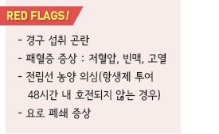
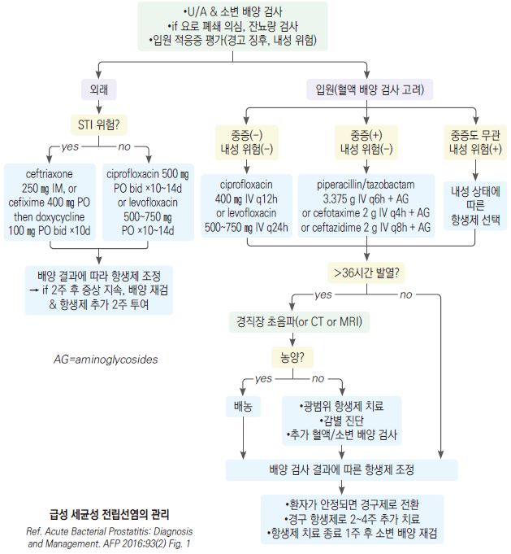
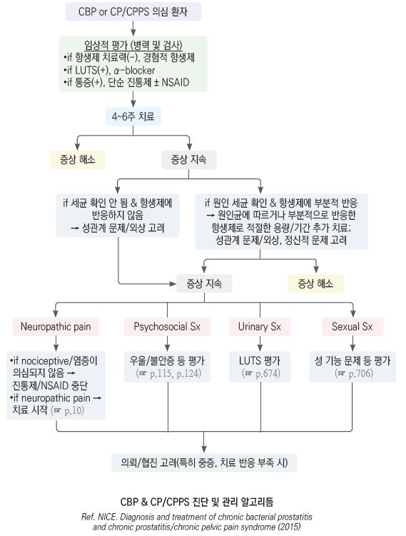
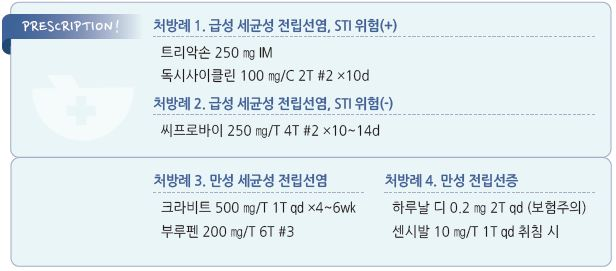

# 전립선염 Prostatitis


## 일반 사항

* 전립선의 세균성(＜10%) 또는 비-세균성 염증 상태
* 비뇨생식계의 통증, 배뇨 장애, 성 기능 장애 등을 일으킴
* 유병률 : 남성의 8%
* 호발 연령 : 급성 30\~50세; 만성 ＞50세
* 만성 : 다른 비뇨생식기 질환(예: 요도염, 방광염) 없이 최근 6개월 중 ≥3개월 지속 또는 재발
*   만성 증상 시 감별 질환 : BPH, 배뇨 기능 장애, 전립선 또는 뮐러관 잔유물, 비감염성 방광염, 신경병증성 통증,

    사정관 폐쇄, 방광암, 전립선암
*   치료 경과

    •급성 세균성 전립선염의 발열 및 배뇨통 호전 : 2\~6일

    •만성 세균성 전립선염 치료율 : 50%\~90%

    •지속 또는 재감염율 : 20%

### 위험 인자

* 요로 감염, HIV 감염
* 불결한 성관계
* 소변 저류, BPH, 전립선 결석, 요로 협착
* 비뇨기계 조작 : 도뇨관, 전립선 조작, 방광경 검사
* 외상 : 자전거, 승마

### 분류 \[NIH]

```

```

## Ⅰ. 급성 세균성 전립선염 (Acute bacterial prostatitis)

### 원인

*   원인균 : 주로 그람음성균(UTI와 동일); E. coli (\~80%), Pseudomonas

    •성적으로 활발한 젊은 연령에서는 N. gonorrhoeae , C. trachomatis

### 임상 양상

* 방광 자극 증상 : 빈뇨, 절박뇨, 배뇨통
* 요로 폐쇄 증상 : 소변 줄기가 끊어지거나 가늘어짐, 배뇨 시 힘주기, 불완전한 비움
* 하복부 증상 : 하복부/회음부/고환/음경부 통증, 방광 팽만감
* 비뇨기 외 증상 : 발열, 오한, malaise, 요통, 구역, 구토, 빈맥, 저혈압
* 전립선 수지 검사 : 전립선의 부종, 온감, 단단함, 심한 압통
* 치료하지 않는 경우 패혈증 또는 전립선 농양으로 진행

### 진단

* 소변 검사 : U/A(농뇨, 세균뇨, 혈뇨), 소변 그람염색, 배양 검사
* 혈액 검사 : CBC(WBC↑ Lt shift), 배양 검사(전신 증상 시)
* 잔뇨량 검사
* CT, 초음파 검사 : 항생제 투여 24\~48시간에 반응하지 않는 경우 고려

※ 급성 세균성 전립선염이 의심될 때 전립선 마사지는 금기

## Ⅱ. 만성 세균성 전립선염 (Chronic bacterial prostatitis)

### 원인

* 원인균 : 주로 그람음성균(급성과 동일), Enterococcus (그람양성균)
*   관련 인자 : 급성 세균성 전립선염에 대한 부적절한 치료, 재발성 방광염, 요도염, 부고환염

    •만성 세균성 전립선염은 급성 세균성 전립선염이나 재발성 요로 감염에서 이행될 수 있지만, 만성 세균성 전립선염

    환자의 절반 이상이 급성 감염의 이력이 없음

### 임상 양상

*   다양한 수준의 증상(간혹 무증상), 서서히 진행

    •농뇨/세균뇨가 있어도 자각 증상이 없을 수 있음
* 방광 자극 증상 : 빈뇨, 절박뇨, 배뇨통
* 하복부 증상 : 고환/회음부/원위 음경부/골반 통증, 하복부 통증
* 요로 폐쇄 증상 : 소변 줄기가 끊어지거나 가늘어짐, 배뇨 시 힘주기, 불완전한 비움
* 사정 중 또는 사정 후 통증
* 비뇨기 외 증상 : 미열, 요통
*   전립선 수지 검사 : 비대, 압통, 결절; 종종 정상

    •iatrogenic bacteremia를 유발할 수 있으므로 주의해서 부드럽게 시행해야 함

### 진단

* U/A : 2차성 방광염이 없는 한 정상
* 소변/EPS/정액으로 그람염색 & 배양 검사
* EPS, postprostatic massage voided urine : WBC ＞5\~10/HPF
* WBC 및 세균 숫자와 병의 중증도는 상관관계가 없음
* 배양 검사에서 세균이 확인되지 않으면 비세균성 전립선염, 만성 골반통증후군, 또는 interstitial cystitis 의심

#### 증상 평가 \[NIH-CPSI] (NIH chronic prostatitis symptom index)

```

```

## Ⅲ. 만성 골반통증후군 (Chronic pelvic pain syndrome)

*   임상 양상은 만성 세균성 전립선염과 유사하지만, 보통 요로 감염 병력이 확인되지 않으며, 감염의 명백한 증거 또는

    진찰상 이상 징후가 거의 없음 (만성 비세균성 전립선염)
* 증상과 심리적 영향으로 삶의 질을 크게 저하시킴

**만성 골반통증후군**

* ＞6개월 지속되는 골반 구조물에서 유래한 통증
* 하부 요로, bowel 및 pelvic floor의 기능 장애와 관련되며 behavioral, sexual, emotional 후유증이 발생할 수 있음

### 원인

* 불명
* 염증, 자가면역, 내분비, 근육, 신경, 정신적 문제가 상호 관련하여 발생
* 우울, 불안, catastrophizing, 낮은 사회적 지지, 스트레스 등에 영향을 받음

### 임상 양상

*   방광 자극 증상, 하복부 증상, 배뇨 폐쇄 증상, 사정 통증

    •만성적인 회음부/치골 상부/골반 통증이 가장 흔한 증상으로 고환, 서혜부, 허리 통증을 호소
* 전립선 수지 검사 : 종종 정상

### 진단

* EPS : WBC↑, 배양 검사 균 동정(-)
* 방광경 검사, 초음파 검사, CT urography, MRI
* 잔뇨량 검사, 요로 역학 검사

## Ⅳ. 무증상 염증성 전립선염 (Asymptomatic inflammatory prostatitis)

* 전립선염 또는 요로 감염의 증상 없이 염증 세포가 관찰되는 상태
* 보통 비뇨기적 또는 다른 문제에 대한 진료에서 부가적으로 진단됨
* 임상적 의미는 모호함
* 치료 : 검사의 계기가 된 원인 질환 또는 문제를 치료

***

## Management

## 비-약물 치료 및 예방

* 충분한 수분 섭취
* 전립선을 자극할 수 있는 활동 회피. 예) 의자에 오래 앉아 있거나 자전거 타기를 피함
* 취침 전 5\~10분간 온수 좌욕 또는 온열 패드 적용
* 방광을 자극할 수 있는 카페인, 알코올, 맵거나 신 음식 섭취를 피함
* 스트레스 해소, 규칙적 운동, 주기적인 사정(전립선액 배출)

## 약물 치료

* 항생제 : 1차 선택- fluoroquinolone
* 통증 완화, 해열 : NSAID
* 배뇨 증상 개선 : α-blocker(tamsulosin, alfuzosin, silodosin) (☞ p.668)

### Ⅰ. 급성 세균성 전립선염 (ABP)

*   성매개질환 위험(+) : ceftriaxone 250 ㎎ IM \[트리악손] or cefixime 400 ㎎ PO \[슈프락스] 1회 →

    이후 doxycycline \[독시사이클린] 100 ㎎ bid ×10d; 흔한 세균 및 N. gonorrhoeae , C. trachomatis 치료
*   성매개질환 위험(-) : ciprofloxacin 500 ㎎ bid \[씨프로바이] or levofloxacin 500~~750 ㎎ qd \[크라비트] ×10~~14d;

    대체 TMP/SMX 160/800 ㎎ bid \[셉트린]} ×10\~14d; 증상이 남아 있으면 추가 2주 치료
*   다음의 경우 입원 및 비경구 항생제 치료 : 경고 증상, 발열 또는 전신 증상, 외래 치료 실패, 내성균 위험

    (최근 fluoroquinolone 사용, 하부 요로 조작)

    

### Ⅱ. 만성 세균성 전립선염 (CBP)

* 치료가 어려울 수 있으며 종종 반복적인 항생제 치료를 요함

#### 1차 선택

* 4\~6주간 (필요시 그 이상 투여)
* ciprofloxacin : 500 ㎎ bid \[씨프로바이]
* levofloxacin : 500 ㎎ qd \[크라비트]
* TMP/SMX : 효과 적음. fluoroquinolone 내성 시 3개월 요법 고려; 160/800 ㎎ bid \[셉트린]

#### 2차 선택

* 특히 C. trachomatis 또는 N. gonorrhoeae 에 대하여 고려
* doxycycline : 100 ㎎ bid \[독시사이클린]
* azithromycin : 500 ㎎ qd \[지스로맥스]; \[대한감염학회] 1 g qwk ×4주
* clarithromycin : 500 ㎎ bid \[클래리시드]

### Ⅲ. 만성 골반통증후군

* 좋은 효과가 입증된 치료법은 없음
*   대부분 감염에 의한 것이 아니므로 감염의 증거가 없거나 감염 관리의 명백한 이득이 없으면 항생제(특히 quinolone)

    투여는 피해야 함
* 협진/의뢰 고려
*   배뇨 증상 : α-차단제 ×12주

    •tamsulosin : 0.4 ㎎ qd \[하루날 디]

    •alfuzosin : 10 ㎎ qd \[자트랄]
*   neuropathic pain 통증

    •gabapentinoids : gabapentin 300 ㎎ qd~~tid \[뉴론틴], pregabalin : 50~~100 ㎎ bid\~tid \[리리카]

    •TCA : amitriptyline or nortriptyline 10 ㎎ qd hr, 점차 증량 \[센시발]
*   골반저 근육 이상 : benzodiazepine, 바이오피드백, pelvic floor physical therapy(예: Kegel 운동),

    pelvic shock wave lithotripsy, 온열 요법, 좌욕
*   5ARI : 전립선 용적 감소; ×6개월 (☞ p.669)

    •finasteride : 5 ㎎ qd \[프로스카]

    •dutasteride : 0.5 ㎎ qd \[아보다트]
* 정신적 문제 : 인지행동 요법, 항우울제, 항불안제
*   기타

    •pentosan : 방광 점막에 부착하여 자극 물질의 이동을 차단; 900 ㎎ qd ×16주 \[펜폴] (보험주의)

    •quercetin(flavonoid) : 정맥압 및 림프 순환 호전 효과 기대; 500 ㎎ bid ×1개월 \[베니톨]
*   치료 후 매 30일마다 소변 검사, 배양 검사

    

> **질병코드** N41 전립선의 염증성 질환


