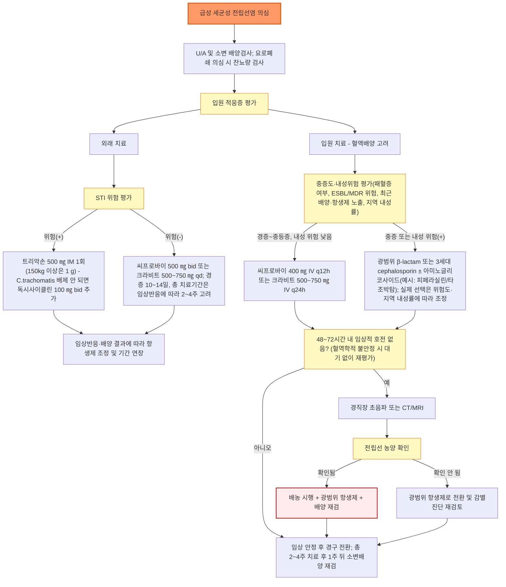
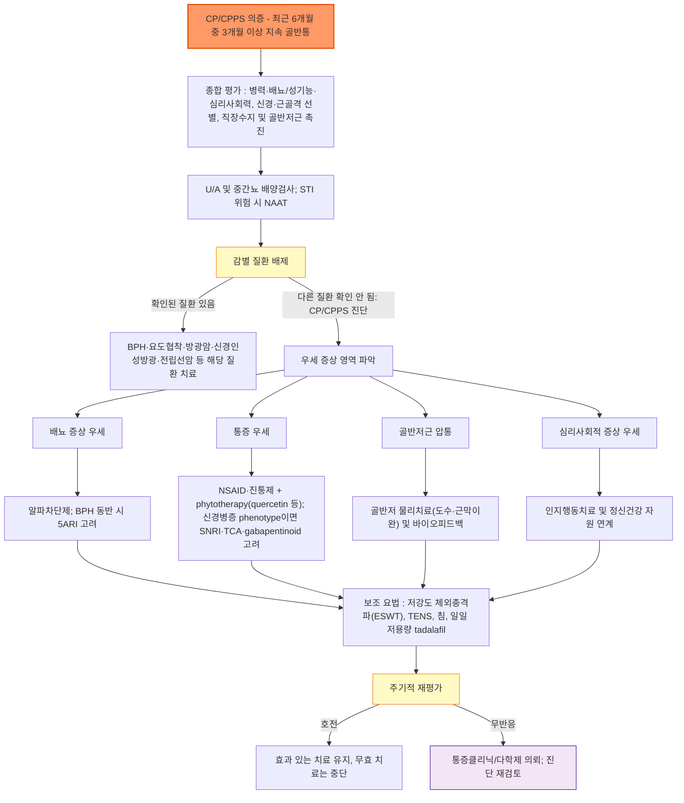

# 전립선염 Prostatitis

## <mark style="color:green;">일반 사항</mark>

* 전립선의 비-세균성 또는 세균성(＜10%) 염증 상태로, 비뇨생식계의 통증, 배뇨 장애, 성 기능 장애 등을 일으킴
* 만성 : 다른 비뇨생식기 질환(예: 요도염, 방광염) 없이 최근 6개월 중 ≥3개월 지속 또는 재발하는 골반통
* 유병률 : 남성의 2.2\~16%(중앙값 7.1%)에서 전립선염 유사 증상을 경험; 미국 성인 남성의 1.8%(약 200만 명)가 CP/CPPS(Chronic prostatitis/Chronic pelvic pain syndrome) 증상을 가짐 (RICE study)
* 호발 연령 : 급성 세균성 전립선염 30\~50세, 만성 세균성 전립선염 ＞50세; CP/CPPS는 ＜50세 남성에서 가장 흔한 비뇨기 질환
  * [ ] 만성 세균성 전립선염은 재발성 요로감염·BPH·전립선 결석 등 감염 위험 인자가 누적되는 고령층에서 주로 발생하는 반면, CP/CPPS는 감염이 아닌 기능적/신경병증적 기전이 중심이라 50세 미만에서 가장 흔한 비뇨기 질환으로 보고됨
* 치료 경과
  * 일반적으로적절한 항생제 치료 후 수일 내 발열·배뇨 증상이 호전되기 시작하; 48\~72시간 이내 임상적 호전이 없거나 악화되면 합병증 평가(혈역학적 불안정·패혈증 징후가 있으면 시간 기준과 무관하게 즉시 평가)
  * 만성 세균성 전립선염은 치료가 어려운 편이며 재발·재감염이 흔함
  * CP/CPPS는 뚜렷한 병인 없이 만성 경과를 밟는 경우가 많으며, 완치보다는 증상 조절이 치료 목표

### <mark style="color:orange;">분류 \[NIH]</mark>

<table><thead><tr><th width="141">Class</th><th width="184">특징</th><th width="111" align="center">WBC(고배율)</th><th width="72" align="center">VB1¹⁾</th><th width="72" align="center">VB2²⁾</th><th width="72" align="center">EPS</th><th width="72" align="center">VB3³⁾</th></tr></thead><tbody><tr><td><strong>Ⅰ. 급성 세균성 전립선염</strong></td><td>전립선의 급성 감염</td><td align="center">＞10</td><td align="center">+</td><td align="center">+</td><td align="center">금기</td><td align="center">+</td></tr><tr><td><strong>Ⅱ. 만성 세균성 전립선염</strong></td><td>전립선의 만성/재발 감염</td><td align="center">＞10</td><td align="center">-</td><td align="center">-</td><td align="center">+</td><td align="center">+</td></tr><tr><td><strong>Ⅲ. 만성 골반통증증후군</strong></td><td>감염 증거가 없는, 최근 6개월 중 3개월 이상 지속되는 골반통⁴⁾ </td><td align="center">아형에 따라 상이</td><td align="center">-</td><td align="center">-</td><td align="center">-</td><td align="center">-</td></tr><tr><td><strong>Ⅳ. 무증상 염증성 전립선염</strong></td><td>무증상. 다른 진단적 검사에서 우연히 발견됨</td><td align="center">＞10</td><td align="center">-</td><td align="center">-</td><td align="center">-</td><td align="center">-</td></tr></tbody></table>

_¹⁾  First 10 ㎖ of voided urine(urethral specimen). ²⁾ Midstream urine specimen(bladder specimen)._\
_³⁾ First 10 ㎖ of voided urine after EPS(prostatic specimen). ⁴⁾ ⅢA(염증형)/ⅢB(비염증형)로 세분._

_VB=voided bladder, EPS=expressed prostatic secretion_

_✽위 +/- 표는 단순화된 교육용 패턴임. 실제 핵심은 EPS·VB3 등 전립선 유래 검체에서 요도·방광 검체보다 유의하게 증가한 동일 세균이 검출되는 localization이며, WBC 수치나 세균 수 자체는 병의 중증도와 상관관계가 없음_


**Ⅰ·Ⅱ(세균성)와 Ⅲ(CP/CPPS)의 구분이 진료의 핵심** : Ⅲ(CP/CPPS)은 배양 검사에서 세균이 확인되지 않는 배제 진단(diagnosis of exclusion)임. **Ⅲ(CP/CPPS)의 두 아형(ⅢA/ⅢB)** 사이에 임상적으로 유의미한 차이가 입증되지않아, 실제 진료에서는 세균성 여부만 감별하면 충분한 경우가 많음 \[AUA 2025]


## <mark style="color:green;">원인</mark>

#### <mark style="color:$primary;">급성·만성 세균성 전립선염 (Ⅰ, Ⅱ)</mark>

* 원인균 : 주로 그람음성균(UTI와 동일); E. coli(약 80%), Pseudomonas
  * 성적으로 활발한 젊은 연령에서는 N. gonorrhoeae, C. trachomatis
  * 만성에서는 Enterococcus(그람양성균)도 흔함
* 관련 인자(만성) : 급성 세균성 전립선염에 대한 부적절한 치료, 재발성 방광염, 요도염, 부고환염
  * 만성 세균성 전립선염 환자의 절반 이상은 급성 감염의 병력이 없음

#### <mark style="color:$primary;">만성 골반통증증후군 (Ⅲ, CP/CPPS)</mark>

* 단일 병인이 밝혀지지 않은 다인성 증후군으로, 지속적인 감염에 의한 질환이 아님 - 반복적인 배양·분자생물학적 연구에도 특정 원인균이 확인되지 않음
* 염증, 자가면역, 내분비, 골반저 근육, 말초/중추 신경계 민감화, 정신심리적 요인이 상호 작용하여 발생하는 것으로 이해됨
* 우울, 불안, catastrophizing(파국화 사고), 낮은 사회적 지지, 스트레스가 증상 강도와 상관관계를 보임
* 통증은 조직 손상에 대한 반응뿐 아니라 신경학적 기원(중추 민감화)에서도 유래할 수 있음 - 만성 통증 자체를 하나의 질환으로 접근해야 함

### <mark style="color:orange;">위험 인자 - 공통</mark>

* 요로 감염, HIV 감염
* STI 위험 성행동 또는 STI 노출
* 소변 저류, BPH, 전립선 결석, 요로 협착
* 비뇨기계 조작 : 도뇨관, 전립선 조작, 방광경 검사
* 외상 : 자전거, 승마
* CP/CPPS 관련 동반 질환 : 과민성 대장 증후군, 섬유근통, 편두통, 만성 피로 증후군 등 만성 통증 질환이 동시에 있는 경우가 흔함; 심혈관 질환(특히 고혈압)·신경계 질환(특히 추간판 질환)·불안/우울이 대조군보다 유의하게 많음

## <mark style="color:green;">임상 양상</mark>

#### <mark style="color:$primary;">급성 세균성 전립선염</mark>

* 방광 자극 증상 : 빈뇨(하루 8회 이상), 절박뇨, 야간뇨, 배뇨통
* 요로 폐쇄 증상 : 소변 줄기가 끊어지거나 가늘어짐, 배뇨 시 힘주기, 불완전한 비움(잔뇨감)
* 하복부 증상 : 하복부/회음부/고환/음경부 통증, 방광 팽만감
* 비뇨기 외 증상 : 발열, 오한, malaise, 요통, 구역, 구토, 빈맥, 저혈압
* 전립선 수지 검사 : 전립선의 부종, 온감, 단단함, 심한 압통
  * 전립선 마사지 금기(농양 파열·패혈증 위험)
* 치료하지 않는 경우 패혈증 또는 전립선 농양으로 진행 가능

#### <mark style="color:$primary;">만성 세균성 전립선염</mark>

* 다양한 수준의 증상(간혹 무증상), 서서히 진행; 농뇨/세균뇨가 있어도 자각 증상이 없을 수 있음
* 방광 자극 증상, 요로 폐쇄 증상, 하복부 증상, 사정 중 또는 사정 후 통증
* 비뇨기 외 증상 : 미열, 요통
* 전립선 수지 검사 : 비대, 압통, 결절; 종종 정상&#x20;
  * 필요한 경우 매우 부드럽게 시행할 수 있으나, iatrogenic bacteremia 위험이 있으므로 반복하거나 과도한  압박은 회피

#### <mark style="color:$primary;">만성 골반통증증후군 (CP/CPPS)</mark>

* 회음부/치골 상부/골반의 만성 통증이 가장 흔함
* 음경통, 사정통, 배뇨통, 성기능 장애(발기부전)도 흔함
* 방광 자극 증상, 요로 폐쇄 증상이 동반될 수 있음&#x20;
  * [ ] 방광 충만 시 악화되고 배뇨 후 완화되는 통증 양상은 남성 간질성 방광염/방광통증증후군(IC/BPS)에서도 나타날 수 있어 감별이 필요; 이런 양상이 두드러지거나 야간뇨·심한 절박뇨가 동반되면 IC/BPS 가능성을 고려하고 필요시 방광경 검사
* 고환·서혜부·허리 통증이 동반될 수 있음
* 전체 환자의 약 70%가 골반 이외 부위에도 통증을 호소하며, 이런 경우는 수면장애·우울·불안·삶의 질 저하가 더 심함
* 골반저 근육 긴장 및 압통이 대조군보다 유의하게 흔함(MAPP 연구에서 CP/CPPS·IC/BPS 환자의 47%)
* 전립선 수지 검사 : 종종 정상

#### <mark style="color:$primary;">무증상 염증성 전립선염</mark>

* 전립선염 또는 요로 감염의 증상 없이 염증 세포가 관찰되는 상태
* 보통 불임 검사, 전립선암 선별검사 등 다른 진료에서 부가적으로 발견됨
* 임상적 의미는 아직 모호하며, 불임·전립선암 위험과의 연관성을 탐구하는 연구가 진행 중이나 현재까지 확립된 인과관계는 없음
* 치료는 검사의 계기가 된 원인 질환에 준함

### <mark style="color:$danger;">🚩 Red Flags!</mark>

<mark style="color:$danger;">**즉각 조치 또는 의뢰**</mark>

* 저혈압, 빈맥, 고열 등 패혈증 징후 또는 급성 의식 변화
* 경구 섭취 곤란·탈수
* 급성 요폐(요로 완전 폐쇄) 발생 시

<mark style="color:$warning;">**당일 또는 조기 의뢰**</mark>

* 급성 세균성 전립선염으로 적절한 항생제 투여 48\~72시간 이내 임상적 호전이 없거나 악화
* 심한 국소 압통·부종과 함께 전신 증상 동반
* 전립선 수지 검사에서 딱딱한 결절이나 비대칭적 경결 촉지

<mark style="color:$info;">**외래 추적 / 추가 평가 계획**</mark> <mark style="color:$info;">- 즉각 위험 낮으나 호전 없으면 의뢰</mark>

* CP/CPPS로 4\~6주 표준 치료(알파차단제, 진통제 등)에도 반응 없음
* 만성 세균성 전립선염의 반복 재발 또는 배양에서 지속적으로 원인균이 확인됨
* 육안적 혈뇨, 배뇨 증상의 급격한 변화, 체중 감소 → 악성 종양

## <mark style="color:green;">진단</mark>

* CP/CPPS는 병력·검사로 다른 질환들을 평가·배제하면서 임상적으로 진단하는 배제 진단임 - 가능한 모든 질환을 완전히 배제해야만 진단할 수 있다는 뜻은 아니며, "특정 원인균이 확인되지 않는 만성 골반통"이 핵심임

### <mark style="color:orange;">공통 초기 평가</mark>

* 병력 : 증상 발생 시기·기간·부위·양상, 악화/완화 인자, 배뇨·성기능 증상, 요로 감염 병력, 이전 치료 반응
* 계통 문진 : 위장관(과민성 대장 증후군), 근골격/류마티스, 신경학적(허리 통증, 하지 저림), 정신심리(불안, 우울, 스트레스, 외상 경험)
* 신체 검사 : 복부·서혜부·음낭 진찰(종괴·경화·탈장 배제), 직장 수지 검사(전립선 압통·결절), 경직장 골반저근 촉진(항문거근·폐쇄근 압통 확인 - 골반저근 근육통 진단)
* U/A 및 중간뇨 배양 검사 : 모든 환자에서 기본 - 가능하면 경험적 항생제 투여 전에 배양 검체를 채취하고, 이후 배양·감수성 결과에 따라 항생제를 조정(최근 항생제 사용, 반복 UTI, 요로 조작 병력이 있으면 경험적 FQ의 적절성이 낮을 수 있어 특히 중요)
* 잔뇨량 검사 : 요로 폐쇄 의심 시

### <mark style="color:orange;">아형별 진단</mark>

#### <mark style="color:$primary;">급성 세균성 전립선염</mark>

* 소변 검사 : U/A(농뇨, 세균뇨, 혈뇨) 및 중간뇨 배양·감수성 검사; 소변 그람염색은 필요시 추가
* 혈액 검사 : CBC(WBC↑ Lt shift), 배양 검사(전신 증상 시)
* PSA는 급성 염증기에 상승할 수 있어 급성 세균성 전립선염 진단 목적으로 시행하지 않음; 암 평가가 필요하면 염증 해소 후 약 4\~8주 뒤 재평가(단일 근거 기반 확정 시점은 아니며 임상적으로 흔히 쓰이는 범위)
* 경직장 초음파(TRUS)(필요시 CT/MRI) : 항생제 투여 48\~72시간에 임상 호전이 없는 경우 농양 감별을 위해 고려

※ 급성 세균성 전립선염이 의심될 때 전립선 마사지는 금기(EAU 2025, Strong)

#### <mark style="color:$primary;">만성 세균성 전립선염</mark>

* U/A : 2차성 방광염이 없는 한 정상
* 중간뇨 배양·감수성 검사가 기본; C. trachomatis, Mycoplasma 등 비정형 병원체에 대한 검사도 고려(EAU 2025)
* EPS, 전립선 마사지 후 배뇨(postprostatic massage voided urine) : WBC ＞5\~10/HPF
* WBC 및 세균 숫자와 병의 중증도는 상관관계가 없음
* 배양 검사에서 세균이 확인되지 않으면 CP/CPPS 또는 간질성 방광염 의심
* 정액 검사는 보조적으로 사용할 수 있으나, 정액 단독 배양 검사만으로 만성 세균성 전립선염을 진단하는 것은 권장되지 않음(EAU 2025)

#### <mark style="color:$primary;">만성 세균성 전립선염과 CP/CPPS의 감별이 불명확할 때</mark>

* 임상 경과(재발성 요로 감염 병력, 항생제 반응, 감염 간 무증상 여부)만으로 대개 구분되지만, 불명확한 경우 **Meares-Stamey 4-glass 검사** 또는 간소화된 **2-glass 검사**를 시행할 수 있음(AUA 2025, Expert Opinion)
  * 4-glass : VB1(첫 10 ㎖ 배뇨, 요도) → VB2(중간뇨, 방광) → 전립선 마사지 → EPS → VB3(마사지 후 배뇨, 전립선)
  * 2-glass(간소화) : VB2(중간뇨) → 전립선 마사지 → VB3(마사지 후 배뇨)
  * 만성 세균성 전립선염 : VB1·VB2 대비 EPS·VB3에서 유의하게 증가한 동일 세균이 검출(localization); CP/CPPS는 병원성 세균의 일관된 증거가 없음(단, 염증세포는 있을 수 있어 WBC 유무만으로 세균성 여부를 판단하지 않음)
  * 무증상 남성에서도 상당수 양성 결과가 나올 수 있어 해석에 주의
* 비정형 병원체에 대한 배양이나 NGS(차세대 염기서열 분석)를 통한 세균 DNA 검사는 일상적으로 시행하지 않음; 성매개감염이 의심될 때만 NAAT(임질·클라미디아·트리코모나스·마이코플라스마)를 시행(AUA 2025)

### <mark style="color:orange;">CP/CPPS 증상 평가 설문지</mark>

**NIH-CPSI(NIH Chronic Prostatitis Symptom Index)**

* 세 영역(통증, 배뇨, 삶의 질)을 평가하는 9문항 설문지

\[1. 통증 또는 불편]\
⑴ 지난 1주일간 다음 부위에서 통증·불편감을 경험했는가(있으면 각 항목 1점) : ①고환과 항문 사이(회음부) ②고환 ③성기 끝(배뇨와 무관) ④아래 배·치골·방광 부위\
⑵ 지난 1주일간 다음 증상이 있었는가(있으면 각 항목 1점) : ①소변 볼 때 통증·따끔거림 ②성관계에서 절정/사정 시 또는 그 이후 통증·불편감\
⑶ 지난 1주일간 통증·불편함의 빈도(0\~5점 : 전혀 없음\~항상)\
⑷ 지난 1주일간 통증·불편함의 정도(0\~10점 척도)

\[2. 배뇨 문제]\
⑸ 배뇨 후에도 소변이 방광에 남아 있는 느낌의 빈도(0\~5점 : 없다=0, 1번=1, ＜절반=2, 절반=3, ＞절반=4, 거의 항상=5)\
⑹ 배뇨 후 2시간 이내 재배뇨의 빈도(0\~5점 : 위와 동일한 척도)

\[3. 증상으로 인한 영향]\
⑺ 상기 증상으로 인한 일상생활 지장 정도(0\~3점 : 없다\~많다)\
⑻ 상기 증상에 대한 고민 정도(0\~3점)

\[4. 삶의 질]\
⑼ 지난 1주일간의 증상이 남은 평생 지속된다면 어떻게 느낄지(0\~6점 : 아주 좋다\~끔찍하다)

* 채점 : 통증(⑴\~⑷ 합, 0\~21점) + 배뇨(⑸\~⑹ 합, 0\~10점) + 삶의 질(⑺\~⑼ 합, 0\~12점) = 총점(0\~43점)
* 총점 0\~43점; 점수가 높을수록 증상 부담이 큼. 절대적인 중증도 절단값보다는 **치료 전후 점수 변화를 추적**하는 용도로 활용(참고용 구간 : 0\~14점 경증, 15\~29점 중등증, 30\~43점 중증)
* ✽GUPI(Genitourinary Pain Index)는 NIH-CPSI를 기반으로 방광통증·배뇨 후 통증 관련 항목을 보강한 별도의 validated instrument로, 남성 간질성 방광염/방광통증증후군(IC/BPS) 및 CP/CPPS의 증상 평가에 활용됨(AUA 2025)

### <mark style="color:orange;">감별</mark>&#x20;

* 만성 증상 시 감별 질환 : BPH, 배뇨 기능 장애, 전립선 또는 뮐러관 잔유물, 비감염성 방광염, 신경병증성 통증, 사정관 폐쇄, 방광암, 전립선암, 요도 협착, 신경인성 방광, 남성 간질성 방광염/방광통증증후군(IC/BPS)

<table><thead><tr><th width="140">질환</th><th>CP/CPPS와의 감별 포인트</th></tr></thead><tbody><tr><td>BPH / 배뇨 기능 장애</td><td>골반통 없이 하부 요로 증상(LUTS)이 주된 호소; 골반통 유무가 핵심 감별점</td></tr><tr><td>과민성 방광(OAB)</td><td>절박뇨·빈뇨 위주이며 골반·방광통이 동반되지 않음</td></tr><tr><td>남성 간질성 방광염/방광통증증후군(IC/BPS)</td><td>방광 충만과 관련된 통증·불편감이 6주 이상 지속; 필요시 방광경에서 Hunner 병변 등을 평가(Hunner 병변이 없어도 IC/BPS는 배제되지 않음)</td></tr><tr><td>요도 협착 / 신경인성 방광</td><td>요류 검사·요역동학 검사로 감별; 배뇨 증상이 주 소견</td></tr><tr><td>골반저근 근육통</td><td>경직장 촉진에서 항문거근·폐쇄근 압통(+); CP/CPPS와 흔히 동반</td></tr><tr><td>사정관 폐쇄</td><td>정액량 감소, 사정통이 주 증상; 경직장 초음파·MRI로 확인</td></tr><tr><td>방광암 / 전립선암</td><td>육안적 혈뇨, 체중 감소, 전립선 결절 등 경고 증상 동반 시 감별; 방광경·PSA·조직검사</td></tr><tr><td>만성 골반 신경병증(음부신경 포착 등)</td><td>앉으면 악화되는 편측 작열통, 신경 분포를 따르는 통증</td></tr></tbody></table>

***


```mermaid
graph TD
    Start["급성 세균성 전립선염 의심"] --> UA["U/A 및 소변 배양검사; 요로폐쇄 의심 시 잔뇨량 검사"]
    UA --> AdmitQ["입원 적응증 평가"]
    AdmitQ --> OPD["외래 치료"]
    AdmitQ --> IPD["입원 치료 - 혈액배양 고려"]

    OPD --> STIQ["STI 위험 평가"]
    STIQ -->|"위험(+)"| Rx1["트리악손 500 ㎎ IM 1회(150kg 이상은 1 g) - C.trachomatis 배제 안 되면 독시사이클린 100 ㎎ bid 추가"]
    STIQ -->|"위험(-)"| Rx2["씨프로바이 500 ㎎ bid 또는 크라비트 500~750 ㎎ qd; 경증 10~14일, 총 치료기간은 임상반응에 따라 2~4주 고려"]
    Rx1 --> F1["임상반응·배양 결과에 따라 항생제 조정 및 기간 연장"]
    Rx2 --> F1

    IPD --> SevQ["중증도·내성위험 평가(패혈증 여부, ESBL/MDR 위험, 최근 배양·항생제 노출, 지역 내성률)"]
    SevQ -->|"경증~중등증, 내성 위험 낮음"| Rx3["씨프로바이 400 ㎎ IV q12h 또는 크라비트 500~750 ㎎ IV q24h"]
    SevQ -->|"중증 또는 내성 위험(+)"| Rx4["광범위 β-lactam 또는 3세대 cephalosporin ± 아미노글리코사이드(예시: 피페라실린/타조박탐); 실제 선택은 위험도·지역 내성률에 따라 조정"]
    Rx3 --> RespQ["48~72시간 내 임상적 호전 없음? (혈역학적 불안정 시 대기 없이 재평가)"]
    Rx4 --> RespQ
    RespQ -->|"아니오"| Stable["임상 안정 후 경구 전환; 총 2~4주 치료 후 1주 뒤 소변배양 재검"]
    RespQ -->|"예"| Img["경직장 초음파 또는 CT/MRI"]
    Img --> AbsQ["전립선 농양 확인"]
    AbsQ -->|"확인됨"| Drain["배농 시행 + 광범위 항생제 + 배양 재검"]
    AbsQ -->|"확인 안 됨"| Broaden["광범위 항생제로 전환 및 감별진단 재검토"]
    Drain --> Stable
    Broaden --> Stable

    style Start fill:#f96,stroke:#e65100,stroke-width:2px
    style AdmitQ fill:#fff9c4,stroke:#f57f17
    style STIQ fill:#fff9c4,stroke:#f57f17
    style SevQ fill:#fff9c4,stroke:#f57f17
    style RespQ fill:#fff9c4,stroke:#f57f17
    style AbsQ fill:#fff9c4,stroke:#f57f17
    style Drain fill:#ffebee,stroke:#c62828,stroke-width:2px
```

<p align="center"><strong>급성 세균성 전립선염의 진단 및 관리 알고리듬</strong></p>

<p align="center"><em><mark style="color:$info;">Ref. Acute Bacterial Prostatitis: Diagnosis and Management. AFP 2016;93(2); IDSA Complicated UTI Guideline(2025); EAU Urological Infections Guideline(2025) 반영</mark></em></p>

***


```mermaid
graph TD
    Start["CP/CPPS 의증 - 최근 6개월 중 3개월 이상 지속 골반통"] --> Eval["종합 평가 : 병력·배뇨/성기능·심리사회력, 신경·근골격 선별, 직장수지 및 골반저근 촉진"]
    Eval --> Lab["U/A 및 중간뇨 배양검사; STI 위험 시 NAAT"]
    Lab --> ExclQ["감별 질환 배제"]
    ExclQ -->|"확인된 질환 있음"| Confusable["BPH·요도협착·방광암·신경인성방광·전립선암 등 해당 질환 치료"]
    ExclQ -->|"다른 질환 확인 안 됨: CP/CPPS 진단"| Domain["우세 증상 영역 파악"]

    Domain --> Voiding["배뇨 증상 우세"]
    Domain --> Pain["통증 우세"]
    Domain --> PFM["골반저근 압통"]
    Domain --> Psych["심리사회적 증상 우세"]

    Voiding --> TxVoid["알파차단제; BPH 동반 시 5ARI 고려"]
    Pain --> TxPain["NSAID·진통제 + phytotherapy(quercetin 등); 신경병증 phenotype이면 SNRI·TCA·gabapentinoid 고려"]
    PFM --> TxPFM["골반저 물리치료(도수·근막이완) 및 바이오피드백"]
    Psych --> TxPsych["인지행동치료 및 정신건강 자원 연계"]

    TxVoid --> Adjunct["보조 요법 : 저강도 체외충격파(ESWT), TENS, 침, 일일 저용량 tadalafil"]
    TxPain --> Adjunct
    TxPFM --> Adjunct
    TxPsych --> Adjunct

    Adjunct --> Reassess["주기적 재평가"]
    Reassess -->|"호전"| Continue["효과 있는 치료 유지, 무효 치료는 중단"]
    Reassess -->|"무반응"| MDT["통증클리닉/다학제 의뢰; 진단 재검토"]

    style Start fill:#f96,stroke:#e65100,stroke-width:2px
    style ExclQ fill:#fff9c4,stroke:#f57f17
    style Reassess fill:#fff9c4,stroke:#f57f17
    style MDT fill:#f3e5f5,stroke:#4a148c
```

<p align="center"><strong>만성 세균성 전립선염 및 만성 골반통증증후군(CP/CPPS)의 진단·다면적 관리 알고리듬</strong></p>

<p align="center"><em><mark style="color:$info;">Ref. Diagnosis and Management of Male Chronic Pelvic Pain(CP/CPPS and CSCP): AUA Guideline(2025)</mark></em></p>

***

## <mark style="background-color:$warning;">Management</mark>


**⚠️ Fluoroquinolone 사용 시 주의(FDA Boxed Warning)**\
Fluoroquinolone(ciprofloxacin, levofloxacin 등)은 조직 침투력이 우수해 전립선염의 1차 선택제로 널리 쓰이지만, 건 파열·말초신경병증·중추신경계 부작용(경련, 정신증)·대동맥류/박리 위험 증가와 관련된 경고가 있음. 특히 고령, 대동맥질환 병력, 스테로이드 병용 환자에서는 대체 가능한 항생제가 있다면 우선 고려



**⚠️ CP/CPPS에서 피해야 할 치료(AUA 2025)**\
・배양·성매개감염 검사가 음성인 상태에서 **반복적인 항생제 치료**를 시행하지 않음\
・통증 완화 목적의 **전립선 수술**(근치 전립선절제술, BPH 배출로 수술)을 시행하지 않음(전립선암·방광출구폐쇄가 동반된 경우는 예외)\
・**전신(경구) 스테로이드 장기 투여**를 하지 않음\
・적절한 의학적 평가 없이 신체화(somatization)로 단정해 심리적 개입으로만 보내지 않음


### <mark style="color:orange;">비-약물 치료 및 예방</mark>

* 충분한 수분 섭취
* 장시간 앉기·자전거 타기 등 증상을 유발하는 활동은 일시적으로 줄이고, 개인별 유발 요인을 확인
* 취침 전 5\~10분간 온수 좌욕 또는 온열 패드 적용
* 방광을 자극할 수 있는 카페인, 알코올, 맵거나 신 음식 섭취를 피함
* 스트레스 해소, 규칙적 운동
* CP/CPPS : 생활 습관 교정(식이, 유산소 운동)에 대해 상의(AUA 2025, Conditional Recommendation; Grade C)

### <mark style="color:orange;">약물 치료</mark>

* 항생제 : 세균성(Ⅰ·Ⅱ)에서 1차 선택 - fluoroquinolone
* 통증 완화, 해열 : NSAID
* 배뇨 증상 개선 : α-blocker(tamsulosin, alfuzosin, silodosin) (☞ p.668)

#### <mark style="color:$primary;">Ⅰ. 급성 세균성 전립선염(ABP)</mark>

* 성매개질환 위험(+) : ceftriaxone 500 ㎎ IM \[트리악손] 1회(체중 150 ㎏ 이상은 1 g); C. trachomatis가 배제되지 않은 경우 doxycycline \[독시사이클린] 100 ㎎ bid 추가(CDC 2021 임질 치료 용량 기준 - 기존 250 ㎎은 더 이상 표준 용량이 아님)
  * ceftriaxone 투여가 불가능한 경우의 임질 대체요법으로 cefixime 800 ㎎ PO 1회가 사용될 수 있으나, 전립선 침범이 의심되는 ABP의 전체 치료는 이와 별도로 고려해야 함(단회 cefixime을 ABP 완결 치료로 간주하지 않음)
  * 성 파트너의 임질 치료가 필요한 경우 EPT(expedited partner therapy)는 파트너 본인에 대한 치료이며, index patient(본 환자)의 ABP 치료와는 별개로 다룸
  * ✽국내를 포함한 유럽/WHO 지침(IUSTI 2020)은 내성 우려로 ceftriaxone 1 g(단독 또는 azithromycin 2 g 병용)을 표준으로 쓰는 경우가 많음 - 실제 처방 용량은 소속 기관·지역 내성률 및 최신 국내 지침에 따라 결정
  * 임질/클라미디아 동시치료 자체는 7일이면 충분하지만, 전립선 침범이 확인/의심되는 ABP는 이와 별개로 임상반응에 따라 전체 항생제 치료기간을 2\~4주로 잡는 것이 안전(EAU 2025)
* 성매개질환 위험(-) : ciprofloxacin 500 ㎎ bid \[씨프로바이] or levofloxacin 500\~750 ㎎ qd \[크라비트]; 대체 TMP/SMX 160/800 ㎎ bid(셉트린정 400/80 ㎎ 2T bid - 셉트린정 1정은 sulfamethoxazole 400 ㎎ + trimethoprim 80 ㎎의 regular strength 제형이므로 1회 2정 필요)
  * 경증\~중등증 : 10\~14일 치료 후 임상반응 재평가; 증상·발열이 남아 있거나 전립선 침범이 뚜렷하면 연장(IDSA 2025는 일반 cUTI의 단기요법 권고에서 세균성 전립선염을 제외하고 있음)
  * 전체 치료기간은 일반적으로 2\~4주를 고려(EAU 2025 systemic UTI 치료 원칙 준용)
* 다음의 경우 입원 및 비경구 항생제 치료 : 경고 증상, 발열 또는 전신 증상, 외래 치료 실패, 내성균 위험(최근 fluoroquinolone 사용, 하부 요로 조작)
* EAU 2025 : 급성 세균성 전립선염은 전신 요로 감염(systemic UTI) 치료 원칙에 준하여 치료; 진단 목적의 전립선 마사지는 금기(Strong)

#### <mark style="color:$primary;">Ⅱ. 만성 세균성 전립선염(CBP)</mark>

* 치료가 어려운 편이며 적절한 항생제 치료 후에도 재발할 수 있음 - 재발 시 배양 및 감수성 결과에 따라 치료를 재조정(무분별한 반복 처방이 아니라 근거 기반 재선택이 원칙)

**1차 선택**

* 4\~6주간(필요시 그 이상 투여)
* ciprofloxacin : 500 ㎎ bid \[씨프로바이]
* levofloxacin : 500 ㎎ qd \[크라비트]
* TMP/SMX : fluoroquinolone을 사용할 수 없거나 감수성이 확인된 경우의 대안; 치료기간은 임상반응·배양 결과에 따라 결정; 160/800 ㎎ bid(셉트린정 400/80 ㎎ 2T bid)

**2차 선택**

* 특히 C. trachomatis 또는 N. gonorrhoeae(비정형·세포내 병원체)에 대하여 고려
* doxycycline : 100 ㎎ bid \[독시사이클린]
* azithromycin : 500 ㎎ qd \[지스로맥스]\(EAU 2025 : 최대 3주)
  * 국내에서는 \[대한감염학회] 1 g qwk ×4주 요법도 사용됨 - 두 요법은 서로 다른 출처의 대안 regimen이므로 병용이 아니라 택일
* clarithromycin : 500 ㎎ bid \[클래리시드]

#### <mark style="color:$primary;">Ⅲ. 만성 골반통증증후군(CP/CPPS)</mark>

* 좋은 효과가 입증된 단일 치료법은 없으며, **증상 영역별 다면적(multimodal) 접근**이 권장됨(AUA 2025)
* 대부분 감염에 의한 것이 아니므로 감염의 증거가 없거나 감염 관리의 명백한 이득이 없으면 항생제(특히 quinolone) 투여는 피해야 함
* 협진/의뢰를 적극 고려(비뇨의학과, 골반저 물리치료, 통증클리닉, 정신건강의학과 등)

**배뇨 증상**

* α-차단제, 배뇨 증상이 있으면 투여를 권고(AUA 2025, Moderate Recommendation; Grade B); 통상 12주를 한 치료 주기로 삼되 4주 시점부터 효과를 평가할 수 있음
  * tamsulosin 0.4 ㎎/day \[하루날 디] : 제품별 실제 허가 용량·제형(정 함량)을 확인 후 처방
  * alfuzosin : 10 ㎎ qd \[자트랄]
* BPH 동반 시 : 전립선 비대·LUTS가 있는 경우 5ARI 고려(CP/CPPS 자체의 치료제가 아니라 동반된 BPH/LUTS를 겨냥한 것임에 유의); ×6개월 (☞ p.669) (AUA 2025, Expert Opinion)
  * finasteride : 5 ㎎ qd \[프로스카]
  * dutasteride : 0.5 ㎎ qd \[아보다트]

**통증**

* NSAID 등 항염증제를 다면적 통증 관리의 일부로 사용(AUA 2025, Conditional Recommendation; Grade B)
* 신경병증 phenotype(통증이 임상 소견에 비해 과도하거나 감각 이상을 동반)이면 신경병증성 통증 약제를 처방 가능(AUA 2025, Conditional Recommendation; Grade C); 신경병증성 통증 일반 진료에서는 SNRI(duloxetine)가 더 흔히 선호되며, TCA·gabapentinoid도 고려
  * ✽AUA 2025 원문은 "TCA, SSRI, gabapentinoid" 계열로 명시. SSRI는 우울/불안 치료제로 더 널리 인식되므로, 처방 시 통증 목적임을 환자에게 분명히 설명
  * gabapentinoids : gabapentin 300 ㎎ qd\~tid \[뉴론틴], pregabalin 50\~100 ㎎ bid\~tid \[리리카]
  * TCA : amitriptyline or nortriptyline 10 ㎎ qd hs, 점차 증량 \[센시발]
* PDE5 억제제 : 발기부전 동반 여부와 무관하게 매일 저용량 tadalafil을 전립선염 증상 개선 목적으로 처방 가능(AUA 2025, Conditional Recommendation; Grade B); tadalafil 5 ㎎ qd \[시알리스]\(CPPS 단독 적응 시 비급여 - HIRA 급여 기준 확인 필요)
* Phytotherapeutics : saw palmetto(톱야자 추출물), quercetin, pollen extract가 통증·배뇨 증상·삶의 질 개선에 도움(AUA 2025, Conditional Recommendation; Grade B)
  * quercetin(bioflavonoid) : 항산화·항염증 기전에 근거한 phytotherapy로, 일부 소규모 임상시험에서 CP/CPPS 증상·삶의 질 개선 가능성이 보고됨; 국내에서는 순수 quercetin 성분의 전문/일반의약품이 마땅치 않고 대부분 건강기능식품 형태로 유통되므로, 처방보다는 성분·함량을 확인한 건기식 권유 형태가 됨
  * 베니톨정(diosmin 450 ㎎ + hesperidin 50 ㎎, MPFF)은 정맥임파부전·치질에 허가된 약제로 CP/CPPS 임상시험에서 연구된 quercetin과는 **다른 플라보노이드**임; 항염증·미세순환 개선 기전이 있어 CP/CPPS에 오프라벨로 사용되는 경우가 있으나, quercetin의 근거를 그대로 적용할 수는 없으므로 처방 시 이 점을 감안
  * saw palmetto, pollen extract : 국내 유통 제품은 건강기능식품 형태가 많아 처방 전 실제 성분 함량·가용성 확인 필요

**골반저근 근육통**

* 도수 물리치료(내·외부 근막이완 등 개별화된 기법)를 제공 가능(AUA 2025, Conditional Recommendation; Grade C)
* 근전도 바이오피드백으로 골반저근 안정 시 긴장도 및 이완 시간을 개선(AUA 2025, Expert Opinion)
* 온열 요법, 좌욕 등도 보조적으로 고려; benzodiazepine은 의존성·진정 위험이 있어 골반저근 근육통의 일반적 치료제로 권고하지 않음

**심리사회적 개입**

* 인지행동치료(CBT)를 다른 치료의 보조 요법으로 제공 가능(AUA 2025, Conditional Recommendation; Grade C)
* 정신적 문제 동반 시 항우울제, 항불안제 병용

**추적 관찰**

* 정기적인 소변검사·배양 재검을 routine으로 반복할 근거는 없음; 새로운 발열, 배뇨통 악화, 농뇨·세균뇨 등 감염을 시사하는 소견이 있을 때 재검
* 증상 영역별 치료 효과를 NIH-CPSI 등으로 주기적으로 재평가하고, 효과 없는 치료는 중단; 여러 치료에도 호전이 없으면 진단 자체를 재고려(AUA 2025, Clinical Principle)

### <mark style="color:orange;">시술 및 기타 처치</mark>

* **저강도 체외충격파 치료(low-intensity ESWT)** : 일부 환자에서 증상 개선을 위해 고려할 수 있으며, 논의를 권고할 정도로 근거 수준이 비교적 높음(AUA 2025, Moderate Recommendation; Evidence Level Grade A - 메타분석에서 NIH-CPSI 총점·통증·배뇨 점수 개선 확인); 치료 저항성 환자에 국한된 옵션은 아니며 국내 시행 가능 기관 확인 필요
* **경피 신경 전기 자극(TENS)** : 통증 조절 목적으로 제공 가능(AUA 2025, Conditional Recommendation; Grade B)
* **침(acupuncture)** : 제공 가능(AUA 2025, Conditional Recommendation; Grade B)
* **골반저 물리치료 · 바이오피드백** : 골반저근 근육통 동반 시 우선 고려
* 위 시술은 단독보다 알파차단제·진통제 등 표준 약물 치료와 **병행**할 때 근거가 더 명확함

***

### <mark style="color:red;">질병코드</mark>

N41.0 급성 전립선염

N41.1 만성 전립선염(CP/CPPS 포함 여부 등 실제 청구 관행은 최신 KCD-8/심평원 고시로 최종 확인 필요)

N41.2 전립선농양

N41.9 상세불명의 전립선의 염증성 질환

✽청구 실무 팁 : CP/CPPS(Ⅲ형)는 세균 감염 증거가 없어 N41.1 단독 상병으로 알파차단제·소염진통제 등을 처방할 때 상병-처방 불일치로 심사에서 문제될 수 있음 - N41.1을 주상병으로 하고 R10.2(골반 및 회음부 통증) 또는 M79.6(사지의 통증) 등 증상 기반 부상병을 함께 기재하는 방식이 실무에서 쓰이나, 최종 인정 여부는 심평원 고시·개별 심사 사례에 따라 다를 수 있어 참고용으로만 활용

***

## <mark style="color:purple;">처방례</mark>

> **처방례 1. 급성 세균성 전립선염, STI 위험(+)**
>
> ```
> 트리악손 500 ㎎ IM(체중 150 ㎏ 이상은 1 g)
> 독시사이클린 100 ㎎/C 2T #2 ×7d(C. trachomatis 배제 안 된 경우)
> ```
>
> _✽성매개질환 위험이 있는 젊은 연령에서는 N. gonorrhoeae, C. trachomatis를 함께 커버(CDC 2021 기준 500 ㎎/1 g; 국내·유럽/WHO 지침은 1 g을 표준으로 쓰는 경우가 많아 소속 기관 지침에 따름); 전립선 침범이 확인/의심되면 별도로 전체 항생제 치료기간을 임상반응에 따라 2\~4주로 연장; 성 파트너 동반 치료 및 성매개감염 추가 검사(HIV, 매독 등)를 함께 고려_

> **처방례 2. 급성 세균성 전립선염, STI 위험(-)**
>
> ```
> 씨프로바이 500 ㎎/T 2T #2 ×10~14d
> ```
>
> _✽10\~14일 치료 후 임상반응을 재평가; 증상·발열이 남아 있거나 전립선 침범이 뚜렷하면 연장하며, 전체 치료기간은 흔히 2\~4주까지 고려; fluoroquinolone 부작용(건 파열·말초신경병증) 위험군에서는 TMP/SMX 등 대체제 고려_

> **처방례 3. 만성 세균성 전립선염**
>
> ```
> 크라비트 500 ㎎/T 1T qd ×4~6wk
> 부루펜 200 ㎎/T 6T #3
> ```
>
> _✽4\~6주 치료 후에도 증상·배양 양성이 지속되면 원인균 감수성에 따라 대체 항생제로 최대 3개월까지 연장 가능_

> **처방례 4. 만성 골반통증증후군 - 배뇨 증상 우세형**
>
> ```
> 하루날 디 0.2 ㎎ 2T qd (보험주의)
> 센시발 10 ㎎/T 1T qd 취침 시
> ```
>
> _✽국내 실무에서는 하루날 디 0.2 ㎎ 1T qd로 시작하여 증상 반응에 따라 0.4 ㎎(2T)까지 증량하는 경우가 많음; 알파차단제는 4주 시점부터 효과를 평가할 수 있으며, 통상 12주를 한 치료 주기로 삼음; 12주 후에도 무반응이면 중단하고 다른 증상 영역(통증·골반저근·심리사회) 중심 치료로 전환_

> **처방례 5. 만성 골반통증증후군 - 통증·신경병증 우세형, 치료 저항성**
>
> ```
> 리리카 75 ㎎/C 2C #2
> ```
>
> _✽4\~6주 반응이 없으면 저강도 체외충격파 치료(LI-ESWT) 또는 통증클리닉/다학제 의뢰를 고려; 골반저근 압통이 동반되면 골반저 물리치료 병행. phytotherapy를 고려한다면 quercetin 등 일부 제제에 제한적인 근거가 있으나 국내에는 의약품으로 허가된 표준 quercetin 제제가 마땅치 않고, diosmin/hesperidin 제제(예: 베니톨)는 성분이 달라 quercetin 연구 결과를 그대로 적용할 수 없음_

***

### <mark style="color:$success;">핵심 복약 지도</mark>

> **항생제는 증상이 좋아져도 처방 기간을 반드시 채워야 합니다**
>
> * 적절한 항생제 치료를 시작하면 수일 내 발열·배뇨통이 호전되기 시작하는 경우가 많지만, 전립선 조직 내 항생제 침투가 더디므로 최소 10\~14일(전립선 침범이 뚜렷하면 최대 2\~4주) 치료를 완료해야 함
> * 임의로 조기 중단하면 만성화·재발·내성균 발생 위험이 높아짐

> **Fluoroquinolone 처방 시 설명할 점**
>
> * 힘줄 통증·부종(특히 아킬레스건)이나 손발 저림 등 말초신경병증 증상이 나타나면 **즉시 복용을 중단**하고 내원하도록 안내
> * 갑작스러운 심한 흉통·복통·등통증(대동맥 관련 증상) 등 그 외 이상 증상은 즉시 의료진에게 연락해 상담하도록 안내
> * 고령, 스테로이드 병용, 대동맥질환 병력이 있는 환자에서는 대체 가능한 항생제가 적절한 경우 fluoroquinolone 회피를 우선 고려

> **CP/CPPS 환자에게는 "완치"가 아니라 "증상 조절"이 목표임을 설명**
>
> * 단일 약제로 극적인 효과를 기대하기보다, 배뇨·통증·골반저근·심리사회 등 우세한 증상 영역에 맞춘 다면적 치료를 함께 시행해야 함
> * 각 치료는 4\~12주 단위로 효과를 재평가하고, 효과가 없는 치료는 지속하지 말고 중단
> * 감염 증거가 없는데 항생제를 반복 처방하는 것은 근거가 없으며 내성만 유발할 수 있음을 설명

> **언제 다시 병원을 방문해야 하나요?**
>
> * 항생제 치료 중 48\~72시간 이상 발열이 지속되거나 증상이 악화되는 경우 - 즉시 내원(농양 등 합병증 감별)
> * 소변이 전혀 나오지 않거나 심한 하복부 팽만감이 동반되는 경우 - 즉시 내원
> * 오한, 고열, 혈압 저하 등 전신 증상이 동반되는 경우 - 즉시 내원(패혈증 감별)
> * CP/CPPS 표준 치료 4\~6주 후에도 호전이 없는 경우 - 비뇨의학과 의뢰

***

### <mark style="color:blue;">환자 안내서</mark>


**전립선염, 급성과 만성은 치료 방향이 다릅니다**

전립선염은 전립선에 생기는 염증으로, 세균 감염 때문에 생기는 경우와 뚜렷한 감염 없이 만성적인 골반 통증이 지속되는 경우가 있습니다. 두 경우 모두 배뇨 불편감이나 골반·회음부 통증을 일으키지만, 치료 방법과 경과는 크게 다릅니다.


#### <mark style="color:$primary;">왜 전립선염이 생기나요?</mark>

* 급성·만성 세균성 전립선염은 대장균 등 세균이 요도를 통해 전립선으로 들어가 감염을 일으켜 생깁니다.
* 반면 만성 골반통증증후군은 세균 감염이 확인되지 않는 경우가 대부분입니다. 염증, 신경 과민, 골반 근육 긴장, 스트레스 등 여러 요인이 함께 작용하는 것으로 알려져 있으며, **감염이 없다고 해서 통증이 가짜인 것은 아닙니다.**

#### <mark style="color:$primary;">일상생활에서 어떻게 관리하나요?</mark>

* **오래 앉아 있거나 자전거 타는 것이 증상을 악화시킨다면 그 시간을 줄여보십시오.** 사람마다 증상을 유발하는 활동이 다를 수 있으니 본인에게 맞는 요인을 확인해 보십시오.
* **카페인, 술, 맵고 신 음식을 줄이십시오.** 방광을 자극해 배뇨 증상을 악화시킬 수 있습니다.
* **취침 전 5\~10분 온수 좌욕**을 해보십시오. 골반 근육 긴장을 풀어주는 데 도움이 됩니다.
* 규칙적인 유산소 운동과 스트레스 관리는 만성 골반통증증후군 증상 완화에 도움이 됩니다.
* 갈증과 활동량에 맞춰 적절히 물을 섭취하십시오. 증상이 악화될 정도로 과도하게 마시지는 않도록 합니다.

#### <mark style="color:$primary;">약은 어떻게 써야 하나요?</mark>

* 세균 감염으로 인한 전립선염이라면, **증상이 좋아져도 처방받은 항생제는 끝까지 복용**해야 합니다. 도중에 중단하면 재발하거나 치료가 더 어려워질 수 있습니다.
* 만성 골반통증증후군은 한 가지 약으로 한 번에 좋아지기보다, 배뇨·통증·근육 긴장 등 본인의 주된 불편함에 맞춘 여러 치료를 함께 시도하며 몇 주에 걸쳐 효과를 지켜보는 경우가 많습니다.

#### <mark style="color:$primary;">만성 골반통증증후군, 왜 잘 낫지 않는 것 같나요?</mark>

* 만성 골반통증증후군은 원인이 한 가지로 딱 떨어지지 않는 경우가 많아 완치보다 **증상을 조절하며 함께 관리해 나가는 것**이 현실적인 목표입니다.
* 통증이 오래 지속되면 신경이 통증에 더 예민해지는 경우가 있는데, 이는 "마음의 문제"가 아니라 실제로 몸에서 일어나는 변화입니다. 필요하다면 통증클리닉, 골반저 물리치료, 정신건강 상담 등 여러 전문 분야의 도움을 함께 받는 것이 회복에 도움이 됩니다.

#### <mark style="color:$primary;">이럴 때는 즉시 병원을 방문하세요</mark>

* 갑작스러운 고열, 오한과 함께 통증이 심해지는 경우
* 소변이 전혀 나오지 않는 경우
* 항생제 복용 중 힘줄 통증·부종, 손발 저림, 갑작스러운 심한 흉통·복통이 생기는 경우
