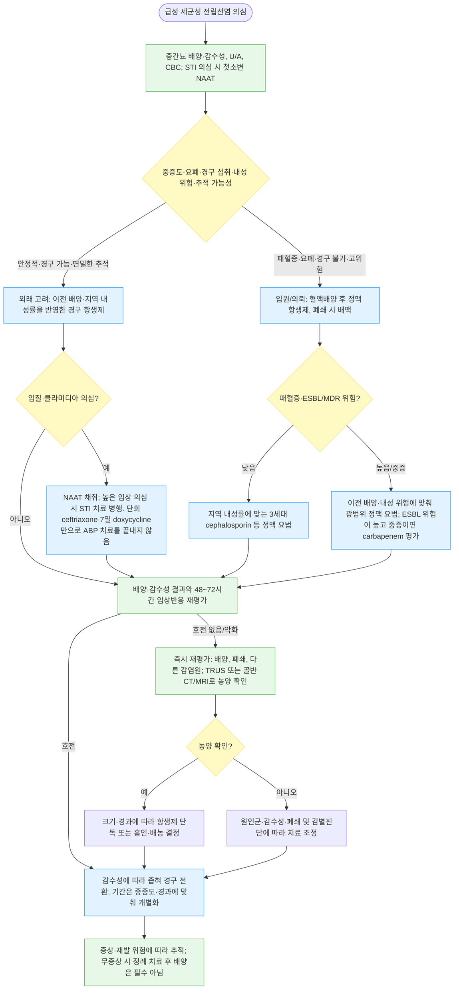
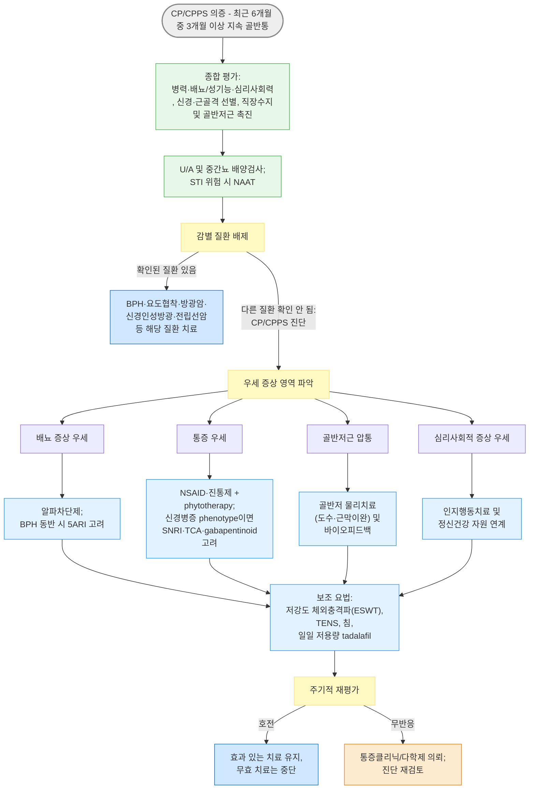

# 전립선염 Prostatitis

## <mark style="color:green;">일반 사항</mark>

* 전립선의 비-세균성 또는 세균성(＜10%) 염증 상태로, 비뇨생식계의 통증, 배뇨 장애, 성 기능 장애 등을 일으킴
* 만성 : 다른 비뇨생식기 질환(예: 요도염, 방광염) 없이 최근 6개월 중 ≥3개월 지속 또는 재발하는 골반통
* 유병률 : 남성의 2.2\~16%(중앙값 7.1%)에서 전립선염 유사 증상을 경험; 미국 성인 남성의 1.8%(약 200만 명)가 CP/CPPS(Chronic prostatitis/Chronic pelvic pain syndrome) 증상을 가짐 (RICE study)
* 호발 연령 : 급성 세균성 전립선염 30\~50세, 만성 세균성 전립선염 ＞50세; CP/CPPS는 ＜50세 남성에서 가장 흔한 비뇨기 질환
  * 만성 세균성 전립선염은 재발성 요로감염·BPH·전립선 결석 등 감염 위험 인자가 누적되는 고령층에서 주로 발생하는 반면, CP/CPPS는 감염이 아닌 기능적/신경병증적 기전이 중심이라 50세 미만에서 가장 흔한 비뇨기 질환으로 보고됨
* 치료 경과
  * 일반적으로 적절한 항생제 치료 후 수일 내 발열·배뇨 증상이 호전되기 시작함; 48\~72시간 이내 임상적 호전이 없거나 악화되면 합병증 평가(혈역학적 불안정·패혈증 징후가 있으면 시간 기준과 무관하게 즉시 평가)
  * 만성 세균성 전립선염은 치료가 어려운 편이며 재발·재감염이 흔함
  * CP/CPPS는 뚜렷한 병인 없이 만성 경과를 밟는 경우가 많으며, 완치보다는 증상 조절이 치료 목표

### <mark style="color:orange;">분류 \[NIH]</mark>

<table><thead><tr><th width="141">Class</th><th width="184">특징</th><th width="111" align="center">WBC(고배율)</th><th width="72" align="center">VB1¹⁾</th><th width="72" align="center">VB2²⁾</th><th width="72" align="center">EPS</th><th width="72" align="center">VB3³⁾</th></tr></thead><tbody><tr><td><strong>Ⅰ. 급성 세균성 전립선염</strong></td><td>전립선의 급성 감염</td><td align="center">＞10</td><td align="center">+</td><td align="center">+</td><td align="center"><mark style="background-color:$warning;">시행하지 않음</mark></td><td align="center"><mark style="background-color:$warning;">시행하지 않음</mark></td></tr><tr><td><strong>Ⅱ. 만성 세균성 전립선염</strong></td><td>전립선의 만성/재발 감염</td><td align="center">＞10</td><td align="center">-</td><td align="center">-</td><td align="center">+</td><td align="center">+</td></tr><tr><td><strong>Ⅲ. 만성 골반통증증후군</strong></td><td>감염 증거가 없는, 최근 6개월 중 3개월 이상 지속되는 골반통⁴⁾</td><td align="center">아형에 따라 상이</td><td align="center">-</td><td align="center">-</td><td align="center">-</td><td align="center">-</td></tr><tr><td><strong>Ⅳ. 무증상 염증성 전립선염</strong></td><td>무증상. 다른 진단적 검사에서 우연히 발견됨</td><td align="center">＞10</td><td align="center">-</td><td align="center">-</td><td align="center">-</td><td align="center">-</td></tr></tbody></table>

_¹⁾ First 10 ㎖ of voided urine(urethral specimen). ²⁾ Midstream urine specimen(bladder specimen)._\
_&#xB3;⁾ First 10 ㎖ of voided urine after EPS(prostatic specimen). ⁴⁾ ⅢA(염증형)/ⅢB(비염증형)로 세분._

_VB=voided bladder, EPS=expressed prostatic secretion_

_✽위 +/- 및 WBC 표기는 전형적인 검체 양상을 단순화한 것이며 각 NIH 유형의 필수 진단 기준이 아님. 급성기에는 전립선 마사지가 금기이므로 EPS·VB3를 채취하지 않음. 만성 세균성 전립선염 감별의 핵심은 EPS·VB3 등 전립선 유래 검체에서 요도·방광 검체보다 유의하게 증가한 동일 세균의 검출(localization)이며, WBC 수치나 세균 수 자체는 중증도와 상관관계가 없음_


**Ⅰ·Ⅱ(세균성)와 Ⅲ(CP/CPPS)의 구분이 진료의 핵심** : Ⅲ(CP/CPPS)은 배양 검사에서 세균이 확인되지 않는 배제 진단(diagnosis of exclusion)임. **Ⅲ(CP/CPPS)의 두 아형(ⅢA/ⅢB)** 사이에 임상적으로 유의미한 차이가 입증되지 않아, 실제 진료에서는 세균성 여부만 감별하면 충분한 경우가 많음 \[AUA 2025]


## <mark style="color:green;">원인</mark>

#### <mark style="color:$primary;">급성·만성 세균성 전립선염 (Ⅰ, Ⅱ)</mark>

* 원인균 : 주로 그람음성균(UTI와 동일); _E. coli_(약 80%), _Pseudomonas_
  * 성적으로 활발한 젊은 연령에서는 _N. gonorrhoeae_, _C. trachomatis_
  * 만성에서는 _Enterococcus_(그람양성균)도 흔함
* 관련 인자(만성) : 급성 세균성 전립선염에 대한 부적절한 치료, 재발성 방광염, 요도염, 부고환염
  * 만성 세균성 전립선염 환자의 절반 이상은 급성 감염의 병력이 없음

#### <mark style="color:$primary;">만성 골반통증증후군 (Ⅲ, CP/CPPS)</mark>

* 단일 병인이 밝혀지지 않은 다인성 증후군으로, 지속적인 감염에 의한 질환이 아님 - 반복적인 배양·분자생물학적 연구에도 특정 원인균이 확인되지 않음
* 염증, 자가면역, 내분비, 골반저 근육, 말초/중추 신경계 민감화, 정신심리적 요인이 상호 작용하여 발생하는 것으로 이해됨
* 우울, 불안, catastrophizing(파국화 사고), 낮은 사회적 지지, 스트레스가 증상 강도와 상관관계를 보임
* 통증은 조직 손상에 대한 반응뿐 아니라 신경학적 기원(중추 민감화)에서도 유래할 수 있음 - 만성 통증 자체를 하나의 질환으로 접근해야 함

### <mark style="color:orange;">위험 인자 - 공통</mark>

* 요로 감염, HIV 감염
* STI 위험 성행동 또는 STI 노출
* 소변 저류, BPH, 전립선 결석, 요로 협착
* 비뇨기계 조작 : 도뇨관, 전립선 조작, 방광경 검사
* 외상 : 자전거, 승마
* CP/CPPS 관련 동반 질환 : 과민성 대장 증후군, 섬유근통, 편두통, 만성 피로 증후군 등 만성 통증 질환이 동시에 있는 경우가 흔함; 심혈관 질환(특히 고혈압)·신경계 질환(특히 추간판 질환)·불안/우울이 대조군보다 유의하게 많음

## <mark style="color:green;">임상 양상</mark>

#### <mark style="color:$primary;">급성 세균성 전립선염</mark>

* 방광 자극 증상 : 빈뇨(하루 8회 이상), 절박뇨, 야간뇨, 배뇨통
* 요로 폐쇄 증상 : 소변 줄기가 끊어지거나 가늘어짐, 배뇨 시 힘주기, 불완전한 비움(잔뇨감)
* 하복부 증상 : 하복부/회음부/고환/음경부 통증, 방광 팽만감
* 비뇨기 외 증상 : 발열, 오한, malaise, 요통, 구역, 구토, 빈맥, 저혈압
* 전립선 수지 검사 : 부어 있고 심한 압통이 있는 전립선(불필요한 반복·강한 압박 회피)
  * 전립선 마사지 금기(농양 파열·패혈증 위험)
* 치료하지 않는 경우 패혈증 또는 전립선 농양으로 진행 가능

#### <mark style="color:$primary;">만성 세균성 전립선염</mark>

* 다양한 수준의 증상(간혹 무증상), 서서히 진행; 농뇨/세균뇨가 있어도 자각 증상이 없을 수 있음
* 방광 자극 증상, 요로 폐쇄 증상, 하복부 증상, 사정 중 또는 사정 후 통증
* 비뇨기 외 증상 : 미열, 요통
* 전립선 수지 검사 : 비대, 압통, 결절; 종종 정상
  * 필요한 경우 매우 부드럽게 시행할 수 있으나, iatrogenic bacteremia 위험이 있으므로 반복하거나 과도한 압박은 회피

#### <mark style="color:$primary;">만성 골반통증증후군 (CP/CPPS)</mark>

* 회음부/치골 상부/골반의 만성 통증이 가장 흔함
* 음경통, 사정통, 배뇨통, 성기능 장애(발기부전)도 흔함
* 방광 자극 증상, 요로 폐쇄 증상이 동반될 수 있음
  * 방광 충만 시 악화되고 배뇨 후 완화되는 통증 양상은 남성 간질성 방광염/방광통증증후군(IC/BPS)에서도 나타날 수 있어 감별이 필요; 이런 양상이 두드러지거나 야간뇨·심한 절박뇨가 동반되면 IC/BPS 가능성을 고려하고 필요시 방광경 검사
* 고환·서혜부·허리 통증이 동반될 수 있음
* 전체 환자의 약 70%가 골반 이외 부위에도 통증을 호소하며, 이런 경우는 수면장애·우울·불안·삶의 질 저하가 더 심함
* 골반저 근육 긴장 및 압통이 대조군보다 유의하게 흔함(MAPP 연구에서 CP/CPPS·IC/BPS 환자의 47%)
* 전립선 수지 검사 : 종종 정상

#### <mark style="color:$primary;">무증상 염증성 전립선염</mark>

* 전립선염 또는 요로 감염의 증상 없이 염증 세포가 관찰되는 상태
* 보통 불임 검사, 전립선암 선별검사 등 다른 진료에서 부가적으로 발견됨
* 임상적 의미는 아직 모호하며, 불임·전립선암 위험과의 연관성을 탐구하는 연구가 진행 중이나 현재까지 확립된 인과관계는 없음
* 치료는 검사의 계기가 된 원인 질환에 준함

### <mark style="color:$danger;">🚩 Red Flags!</mark>

<mark style="color:$danger;">**즉각 조치 또는 의뢰**</mark>

* 저혈압, 빈맥, 고열 등 패혈증 징후 또는 급성 의식 변화
* 경구 섭취 곤란·탈수
* 급성 요폐 또는 잔뇨량이 현저히 증가한 경우 : 즉시 비뇨의학과 평가 및 방광 배액 방법 결정

<mark style="color:$warning;">**당일~수일 내 평가**</mark>

* 급성 세균성 전립선염에서 적절한 항생제를 투여해도 48\~72시간 내 호전이 없으면 당일 재평가(악화·패혈증 징후가 있으면 시간 경과를 기다리지 않고 즉시 평가)
* 심한 국소 압통·부종과 함께 전신 증상 동반
* 전립선 수지 검사에서 딱딱한 결절이나 비대칭적 경결 촉지

<mark style="color:$info;">**외래 추적 / 추가 평가 계획**</mark> <mark style="color:$info;">- 즉각 위험 낮으나 호전 없으면 의뢰</mark>

* CP/CPPS로 4\~6주 표준 치료(알파차단제, 진통제 등)에도 반응 없음
* 만성 세균성 전립선염의 반복 재발 또는 배양에서 지속적으로 원인균이 확인됨
* 육안적 혈뇨, 배뇨 증상의 급격한 변화, 체중 감소 → 악성 종양

## <mark style="color:green;">진단</mark>

* CP/CPPS는 병력·검사로 다른 질환들을 평가·배제하면서 임상적으로 진단하는 배제 진단임 \[AUA 2025] - 가능한 모든 질환을 완전히 배제해야만 진단할 수 있다는 뜻은 아니며, "특정 원인균이 확인되지 않는 만성 골반통"이 핵심임

### <mark style="color:orange;">공통 초기 평가</mark>

* 병력 : 증상 발생 시기·기간·부위·양상, 악화/완화 인자, 배뇨·성기능 증상, 요로 감염 병력, 이전 치료 반응
* 계통 문진 : 위장관(과민성 대장 증후군), 근골격/류마티스, 신경학적(허리 통증, 하지 저림), 정신심리(불안, 우울, 스트레스, 외상 경험)
* 신체 검사 : 복부·서혜부·음낭 진찰(종괴·경화·탈장 배제), 직장 수지 검사(전립선 압통·결절), 경직장 골반저근 촉진(항문거근·폐쇄근 압통 확인 - 골반저근 근육통 진단)
* U/A 및 중간뇨 배양 검사 : 모든 환자에서 기본 - 가능하면 경험적 항생제 투여 전에 배양 검체를 채취하고, 이후 배양·감수성 결과에 따라 항생제를 조정(최근 항생제 사용, 반복 UTI, 요로 조작 병력이 있으면 경험적 FQ의 적절성이 낮을 수 있어 특히 중요)
* 잔뇨량 검사 : 요로 폐쇄 의심 시

### <mark style="color:orange;">아형별 진단</mark>

#### <mark style="color:$primary;">급성 세균성 전립선염</mark>

* 소변 검사 : U/A(농뇨, 세균뇨, 혈뇨) 및 중간뇨 배양·감수성 검사; 소변 그람염색은 필요시 추가
* 혈액 검사 : CBC; 입원·발열·패혈증 의심 시 항생제 투여 전 혈액배양을 시행. EAU는 급성 세균성 전립선염에서 CBC·혈액배양을 권고함
  * PSA는 급성 염증기에 상승할 수 있어 급성 세균성 전립선염 진단 목적으로 시행하지 않음; 암 평가가 필요하면 염증 해소 후 약 4\~8주 뒤 재평가(단일 근거 기반 확정 시점은 아니며 임상적으로 흔히 쓰이는 범위)
* 경직장 초음파(TRUS)(필요시 골반 CT/MRI) : 항생제 투여 후 발열이 지속되거나 48\~72시간 내 임상 호전이 없는 경우 전립선농양·폐쇄 등 합병증 평가를 위해 고려; 혈역학적으로 악화되면 기다리지 않고 영상·원인 평가


급성 세균성 전립선염이 의심될 때 전립선 마사지는 금기


#### <mark style="color:$primary;">만성 세균성 전립선염</mark>

* U/A : 중간뇨(VB2)로 시행; 2차성 방광염이 없는 한 정상
* VB2 배양·감수성 검사 : 기본 항목임; _C. trachomatis_, _Mycoplasma_ 등 비정형 병원체에 대한 검사도 고려
  * 배양 검사에서 세균이 확인되지 않으면 CP/CPPS 또는 간질성 방광염 의심
* EPS, VB3(전립선 마사지 후 채뇨) : WBC ＞10/HPF
  * WBC 및 세균 숫자와 병의 중증도는 상관관계가 없음
* 정액 검사는 보조적으로 사용할 수 있으나, 정액 단독 배양 검사만으로 만성 세균성 전립선염을 진단하는 것은 권장하지 않음

#### <mark style="color:$primary;">만성 세균성 전립선염과 CP/CPPS의 감별</mark>

* 임상 경과(재발성 요로 감염 병력, 항생제 반응, 감염 간 무증상 여부)만으로 대개 구분되지만, 불명확한 경우 Meares-Stamey 4-glass 검사 또는 간소화된 2-glass 검사를 시행할 수 있음
  * 4-glass : VB1(첫 10 ㎖ 배뇨, 요도 검체) → VB2(중간뇨, 방광 검체) → 전립선 마사지 → EPS → VB3(마사지 후 배뇨, 전립선 검체)
  * 2-glass(간소화) : VB2(중간뇨) → 전립선 마사지 → VB3(마사지 후 배뇨)
  * 만성 세균성 전립선염 : VB1·VB2 대비 EPS·VB3에서 유의하게 증가한 동일 세균이 검출(localization); CP/CPPS는 병원성 세균의 일관된 증거가 없음(단, 염증세포는 있을 수 있어 WBC 유무만으로 세균성 여부를 판단하지 않음)
  * 무증상 남성에서도 상당수 양성 결과가 나올 수 있어 해석에 주의
* 성매개감염 의심 시 첫소변(초회뇨) NAAT로 임질·클라미디아 검사; 지속/재발성 요도염 등 해당 적응증에서는 트리코모나스·_M. genitalium_ 검사 고려 (☞ [성매개감염](115_-1.STI.md#undefined-3))
* 비정형 병원체 배양이나 NGS(차세대 염기서열 분석)를 통한 세균 DNA 검사는 일상적으로 시행하지 않음

### <mark style="color:orange;">CP/CPPS 증상 평가 설문지</mark>

<mark style="color:cyan;">**NIH-CPSI (NIH Chronic Prostatitis Symptom Index)**</mark>

* '통증, 배뇨, 삶의 질' 세 영역을 평가하는 9문항 설문지

**1. 통증 또는 불편**\
⑴ 지난 1주일간 다음 부위에서 통증·불편감을 경험했는가(있으면 각 항목 1점) : ① 고환과 항문 사이(회음부), ② 고환, ③ 성기 끝(배뇨와 무관), ④ 아래 배·치골·방광 부위\
⑵ 지난 1주일간 다음 증상이 있었는가(있으면 각 항목 1점) : ① 소변 볼 때 통증·따끔거림, ② 성관계에서 절정/사정 시 또는 그 이후 통증·불편감\
⑶ 지난 1주일간 통증·불편함의 빈도 : 전혀 없음 0점\~항상 5점\
⑷ 지난 1주일간 통증·불편함의 정도 : 전혀 없음 0점\~최악의 상태 10점

**2. 배뇨 문제**\
아래 두 항목에 대하여: 없다=0점, 1번=1, ＜절반=2, 절반=3, ＞절반=4, 거의 항상=5점\
⑸ 배뇨 후에도 소변이 방광에 남아 있는 느낌의 빈도\
⑹ 배뇨 후 2시간 이내 재배뇨의 빈도

**3. 증상으로 인한 영향**\
⑺ 상기 증상으로 인한 일상생활 지장 정도 : 없다 0점\~많다 3점\
⑻ 상기 증상에 대한 고민 정도 : 없다 0점\~많다 3점

**4. 삶의 질**\
⑼ 지난 1주일간의 증상이 남은 평생 지속된다면 어떻게 느낄지 : 아주 좋다 0점\~끔찍하다 6점

* 채점 : 통증{⑴\~⑷ 합, 0\~21점} + 배뇨{⑸\~⑹ 합, 0\~10점} + 삶의 질{⑺\~⑼ 합, 0\~12점} = 총 0\~43점
* 총점 점수가 높을수록 증상 부담이 큼. 절대적인 중증도 절단값보다는 치료 전후 점수 변화를 추적하는 용도로 활용. ✽참고용 구간 : 0\~14점 경증, 15\~29점 중등증, 30\~43점 중증

* [**GUPI**](https://www.painful-bladder.org/archive/GUPI%20Male%20&%20Female%20Pain%20Score/) (Genitourinary Pain Index) : NIH-CPSI를 기반으로 방광 통증·배뇨 후 통증 관련 항목을 보강한 별도의 validated instrument; 일상적인 CP/CPPS 평가·추적은 NIH-CPSI를 우선 사용하고, 방광 충만통·배뇨 후 통증 완화 양상이 두드러져 간질성 방광염/방광 통증 증후군 감별이 필요한 경우에 GUPI를 추가로 고려

### <mark style="color:orange;">감별</mark>

* 만성 증상 시 감별 질환 : BPH, 배뇨 기능 장애, 전립선 또는 뮐러관 잔유물, 비감염성 방광염, 신경병증성 통증, 사정관 폐쇄, 방광암, 전립선암, 요도 협착, 신경인성 방광, 남성 간질성 방광염/방광통증증후군(IC/BPS)

<table data-search="false"><thead><tr><th width="154">질환</th><th>CP/CPPS와의 감별 포인트</th></tr></thead><tbody><tr><td>BPH /<br>배뇨 기능 장애</td><td>골반통 없이 하부 요로 증상(LUTS)이 주된 호소; 골반통 유무가 핵심 감별점</td></tr><tr><td>과민성 방광(OAB)</td><td>절박뇨·빈뇨 위주이며 골반·방광통이 동반되지 않음</td></tr><tr><td>남성 간질성 방광염/방광통증증후군(IC/BPS)</td><td>방광 충만과 관련된 통증·불편감이 6주 이상 지속; 필요시 방광경에서 Hunner 병변 등을 평가(Hunner 병변이 없어도 IC/BPS는 배제되지 않음)</td></tr><tr><td>요도 협착 /<br>신경인성 방광</td><td>요류 검사·요역동학 검사로 감별; 배뇨 증상이 주 소견</td></tr><tr><td>골반저근 근육통</td><td>경직장 촉진에서 항문거근·폐쇄근 압통(+); CP/CPPS와 흔히 동반</td></tr><tr><td>사정관 폐쇄</td><td>정액량 감소, 사정통이 주 증상; 경직장 초음파·MRI로 확인</td></tr><tr><td>방광암 / 전립선암</td><td>육안적 혈뇨, 체중 감소, 전립선 결절 등 경고 증상 동반 시 감별; 방광경·PSA·조직검사</td></tr><tr><td>만성 골반 신경병증(음부신경 포착 등)</td><td>앉으면 악화되는 편측 작열통, 신경 분포를 따르는 통증</td></tr></tbody></table>

***


```mermaid
graph TD
    Start(["급성 세균성 전립선염 의심"]) --> Tests["중간뇨 배양·감수성, U/A, CBC; STI 의심 시 첫소변 NAAT"]
    Tests --> Severity{"중증도·요폐·경구 섭취·내성 위험·추적 가능성"}
    Severity -->|"안정적·경구 가능·면밀한 추적"| OPD["외래 고려: 이전 배양·지역 내성률을 반영한 경구 항생제"]
    Severity -->|"패혈증·요폐·경구 불가·고위험"| IPD["입원/의뢰: 혈액배양 후 정맥 항생제, 폐쇄 시 배액"]
    OPD --> STI{"임질·클라미디아 의심?"}
    STI -->|"예"| AddSTI["NAAT 채취; 높은 임상 의심 시 STI 치료 병행. 단회 ceftriaxone·7일 doxycycline만으로 ABP 치료를 끝내지 않음"]
    STI -->|"아니오"| Review["배양·감수성 결과와 48~72시간 임상반응 재평가"]
    AddSTI --> Review
    IPD --> Risk{"패혈증·ESBL/MDR 위험?"}
    Risk -->|"낮음"| IV["지역 내성률에 맞는 3세대 cephalosporin 등 정맥 요법"]
    Risk -->|"높음/중증"| Broad["이전 배양·내성 위험에 맞춰 광범위 정맥 요법; ESBL 위험이 높고 중증이면 carbapenem 평가"]
    IV --> Review
    Broad --> Review
    Review -->|"호전"| Step["감수성에 따라 좁혀 경구 전환; 기간은 중증도·경과에 맞춰 개별화"]
    Review -->|"호전 없음/악화"| Image["즉시 재평가: 배양, 폐쇄, 다른 감염원; TRUS 또는 골반 CT/MRI로 농양 확인"]
    Image --> Abs{"농양 확인?"}
    Abs -->|"예"| Drain["크기·경과에 따라 항생제 단독 또는 흡인·배농 결정"]
    Abs -->|"아니오"| Revise["원인균·감수성·폐쇄 및 감별진단에 따라 치료 조정"]
    Drain --> Step
    Revise --> Step
    Step --> Follow["증상·재발 위험에 따라 추적; 무증상 시 정례 치료 후 배양은 필수 아님"]
    classDef decision fill:#fff9c4,stroke:#ffe082
    class Severity,STI,Risk,Abs decision
    classDef treatment fill:#e3f2ff,stroke:#2196f3
    class OPD,IPD,IV,Broad,AddSTI,Step treatment
    classDef evaluation fill:#e8f8e8,stroke:#4caf50
    class Tests,Review,Image,Follow evaluation
```

<p align="center"><strong>급성 세균성 전립선염의 진단 및 관리 알고리듬</strong></p>

<p align="center"><em><mark style="color:$info;">Ref. 국내 지역사회획득 요로감염 항생제 지침(2018); EAU Urological Infections Guideline(2026); IDSA cUTI Guideline(2025)의 적용 범위를 구분하여 반영</mark></em></p>

***


```mermaid
graph TD
    Start(["CP/CPPS 의증 - 최근 6개월 중 3개월 이상 지속 골반통"]) --> Eval["종합 평가:<br/> 병력·배뇨/성기능·심리사회력<br/>, 신경·근골격 선별, 직장수지 <br/>및 골반저근 촉진"]
    Eval --> Lab["U/A 및 중간뇨 배양검사; <br/>STI 위험 시 NAAT"]
    Lab --> ExclQ["감별 질환 배제"]
    ExclQ -->|"확인된 질환 있음"| Confusable["BPH·요도협착·방광암·<br/>신경인성방광·전립선암 <br/>등 해당 질환 치료"]
    ExclQ --->|"다른 질환 확인 안 됨:<br/> CP/CPPS 진단"| Domain["우세 증상 영역 파악"]
    Domain --> Voiding["배뇨 증상 우세"]
    Domain --> Pain["통증 우세"]
    Domain --> PFM["골반저근 압통"]
    Domain --> Psych["심리사회적 증상 우세"]
    Voiding --> TxVoid["알파차단제; <br/>BPH 동반 시 5ARI 고려"]
    Pain --> TxPain["NSAID·진통제 + <br/>phytotherapy; <br/>신경병증 phenotype이면 <br/>SNRI·TCA·gabapentinoid <br/>고려"]
    PFM --> TxPFM["골반저 물리치료<br/>(도수·근막이완) 및 <br/>바이오피드백"]
    Psych --> TxPsych["인지행동치료 및 <br/>정신건강 자원 연계"]
    TxVoid --> Adjunct["보조 요법: <br/>저강도 체외충격파(ESWT), <br/>TENS, 침, <br/>일일 저용량 tadalafil"]
    TxPain --> Adjunct
    TxPFM --> Adjunct
    TxPsych --> Adjunct
    Adjunct --> Reassess["주기적 재평가"]
    Reassess -->|"호전"| Continue["효과 있는 치료 유지, <br/>무효 치료는 중단"]
    Reassess -->|"무반응"| MDT["통증클리닉/다학제 의뢰; <br/>진단 재검토"]

    style Start fill:#eeeeee,stroke:#888888,stroke-width:2px
classDef yellow fill:#fff9c4,stroke:#ffe082
	class ExclQ,Reassess,Domain yellow
classDef lightGreen fill:#e8f8e8,stroke:#4caf50
	class Eval,Lab lightGreen
classDef sky fill:#e3f2ff,stroke:#2196f3
	class TxVoid,TxPain,TxPFM,TxPsych,Adjunct sky
classDef blue fill:#d0e8ff,stroke:#1a6abf
	class Confusable,Continue blue
style MDT fill:#fdebd0,stroke:#e67e22
```

<p align="center"><strong>만성 골반통증증후군(CP/CPPS)의 진단·다면적 관리 알고리듬</strong></p>

<p align="center"><em><mark style="color:$info;">Ref. Diagnosis and Management of Male Chronic Pelvic Pain(CP/CPPS and CSCP): AUA Guideline(2025)</mark></em></p>

***

## <mark style="background-color:$warning;">Management</mark>


**Fluoroquinolone 사용 시 주의(FDA Boxed Warning)** : Fluoroquinolone(ciprofloxacin, levofloxacin 등)은 조직 침투력이 우수해 전립선염의 1차 선택제로 널리 쓰이지만, 건 파열·말초신경병증·중추신경계 부작용(경련, 정신증)·대동맥류/박리 위험 증가와 관련된 경고가 있음. 특히 고령, 대동맥질환 병력, 스테로이드 병용 환자에서는 대체 가능한 항생제가 있다면 우선 고려



**CP/CPPS에서 피해야 할 치료 \[AUA 2025]**\
・배양·성매개감염 검사가 음성인 상태에서 반복적인 항생제 치료를 시행하지 않음\
・통증 완화 목적의 전립선 수술(근치 전립선절제술, BPH 배출로 수술)을 시행하지 않음(전립선암·방광출구폐쇄가 동반된 경우는 예외)\
・전신(경구) 스테로이드 장기 투여를 하지 않음\
・적절한 의학적 평가 없이 신체화(somatization)로 단정해 심리적 개입으로만 보내지 않음


### <mark style="color:orange;">비-약물 치료 및 예방</mark>

* 충분한 수분 섭취
* 장시간 앉기·자전거 타기 등 증상을 유발하는 활동은 일시적으로 줄이고, 개인별 유발 요인을 확인
* 취침 전 5\~10분간 온수 좌욕 또는 온열 패드 적용
* 방광을 자극할 수 있는 카페인, 알코올, 맵거나 신 음식 섭취를 피함
* 스트레스 해소, 규칙적 운동
* CP/CPPS : 생활 습관 교정(식이, 유산소 운동) 고려

### <mark style="color:orange;">약물 치료</mark>

* 항생제 : 급성 세균성 전립선염은 중증도·내성 위험·이전 배양 결과에 따라 초기 정맥 또는 경구 요법을 선택하고 감수성 결과에 맞춰 조정. 만성 세균성 전립선염은 감수성과 금기 사항을 고려해 fluoroquinolone을 우선 고려
* 통증 완화, 해열 : NSAID
* 배뇨 증상 개선 : α-blocker(tamsulosin, alfuzosin, silodosin) (☞ [BPH](124_-benign-prostatic-hyperplasia-bph.md))

#### <mark style="color:$primary;">Ⅰ. 급성 세균성 전립선염 (ABP)</mark>

* 성매개감염 의심 동반 : 중간뇨 배양과 임질·클라미디아 첫소변 NAAT를 항생제 투여 전에 채취. 요도분비물·노출력 등으로 임질이 강하게 의심되면 ceftriaxone 500 ㎎ IM <mark style="color:blue;">[트리악손]</mark> 1회(체중 ≥150 ㎏은 1 g)를 투여하고, 클라미디아가 배제되지 않으면 doxycycline 100 ㎎ bid <mark style="color:blue;">[독시사이클린]</mark> ×7일을 병용 (☞ [성매개감염증](115_-1.STI.md))
  * 이는 **동반 비복잡성 임질·클라미디아 치료 용법**으로, 급성 세균성 전립선염 전체 치료의 대체 처방이 아님. 전립선 감염은 장내세균 가능성·전신 상태·배양 결과에 따라 별도 치료 계획을 세우고, 확인된 STI의 성 파트너 평가·치료와 HIV·매독 검사도 고려
  * 임질 대체요법인 cefixime 800 ㎎ PO 1회도 비복잡성 임질용이며 전립선염 완결 요법으로 사용하지 않음. 임질이 확인되거나 강하게 의심되면서 전립선 감염이 지속되면 비뇨의학과·감염내과 협진을 고려
  * 국내·유럽 지침의 ceftriaxone 용량이 CDC의 비복잡성 임질 용량과 다를 수 있으므로 실제 STI 처방은 해당 기관의 최신 지침을 확인
* 장내세균성 감염이 의심되고 외래 경구 치료가 가능한 환자 : 소변배양 검체를 먼저 채취하고 이전 감수성 결과·지역 내성률·최근 fluoroquinolone 노출을 고려하여 ciprofloxacin 500 ㎎ bid <mark style="color:blue;">\[씨프로바이]</mark> or levofloxacin 500\~750 ㎎ qd <mark style="color:blue;">\[크라비트]</mark>; 감수성 확인 시 대체 TMP/SMX 160/800 ㎎ bid (<mark style="color:blue;">셉트린정</mark> 400/80 ㎎ 2T bid)
  * 안정적인 경증 환자는 10\~14일 치료 후 반응을 재평가할 수 있으나, 뚜렷한 전립선 감염·중증 또는 합병증 동반 시 총 2\~4주를 고려하고 임상반응·배양 결과에 맞춰 개별화. IDSA 2025의 일반 cUTI 단기요법 근거는 세균성 전립선염에 직접 적용되지 않으며 최적 기간은 확립되지 않음
* 입원·정맥 치료 고려 : 패혈증/혈역학적 불안정, 요폐 또는 폐쇄, 경구 섭취 불가, 중증 전신 증상, 내성균 위험, 외래 치료 실패 또는 신속한 재평가가 어려운 경우. 국내 지침(2018)은 입원·정맥 치료를 강하게 권고하므로 외래 치료는 안정적이고 추적 가능한 경증 환자에서 신중히 선택
* 입원 초기 요법 : 이전 배양 결과와 지역 감수성에 따라 3세대 cephalosporin 또는 적절한 광범위 β-lactam 등을 선택. 패혈증·ESBL/MDR 위험이 높으면 carbapenem 필요성을 평가하고, 감수성 확인 후 좁은 요법으로 조정. piperacillin/tazobactam이나 3세대 cephalosporin을 ESBL 고위험 중증 감염의 일괄 선택지로 간주하지 않음
* 요폐가 있으면 즉시 비뇨의학과에 의뢰하여 방광 배액 방법을 결정(필요시 치골상부 도뇨 고려). 전립선농양이 확인되면 크기와 치료 반응에 따라 항생제 단독·흡인·배농을 선택
* [EAU 2026] 급성 세균성 전립선염은 전신 요로 감염(systemic UTI) 치료 원칙에 준하여 치료

#### <mark style="color:$primary;">Ⅱ. 만성 세균성 전립선염 (CBP)</mark>

* 치료가 어려운 편이며 적절한 항생제 치료 후에도 재발할 수 있음
* 재발 시 배양 및 감수성 결과에 따라 치료를 재조정(단순한 반복 처방이 아니라 근거 기반 재선택이 원칙)

**1차 선택**

* 4\~6주간 (필요시 그 이상 투여)
* ciprofloxacin : 500 ㎎ bid <mark style="color:blue;">\[씨프로바이]</mark>
* levofloxacin : 500 ㎎ qd <mark style="color:blue;">\[크라비트]</mark>
* TMP/SMX : fluoroquinolone을 사용할 수 없거나 감수성이 확인된 경우의 대안; 치료 기간은 임상 반응·배양 결과에 따라 결정; 160/800 ㎎ bid <mark style="color:blue;">\[셉트린]</mark>

**원인균별 치료**

* _C. trachomatis_ 또는 생식기 mycoplasma 등 세포내 병원체가 확인된 경우 : 병원체별 감수성·최신 STI 지침을 고려해 doxycycline 100 ㎎ bid <mark style="color:blue;">[독시사이클린]</mark> 또는 적절한 macrolide를 선택. EAU 2026의 만성 세균성 전립선염 서술과 요법표에서 doxycycline 기간이 일치하지 않으므로 특정 기간을 일률적으로 적용하지 않음
* _N. gonorrhoeae_가 확인된 경우 : 임질의 최신 치료 지침에 따라 치료하고, 지속되는 전립선 감염의 치료는 별도로 비뇨의학과·감염내과와 상의. 임질을 다른 세포내 병원체와 동일한 doxycycline/macrolide 대체 치료군으로 묶지 않음
* _T. vaginalis_가 원인균으로 확인된 드문 만성 세균성 전립선염 : metronidazole 등 병원체별 치료를 고려

#### <mark style="color:$primary;">Ⅲ. 만성 골반통증증후군 (CP/CPPS)</mark>

* 좋은 효과가 입증된 단일 치료법은 없으며, 증상 영역별 다면적(multimodal) 접근이 권장됨 \[AUA 2025]
* 대부분 감염에 의한 것이 아니므로 감염의 증거가 없거나 감염 관리의 명백한 이득이 없으면 항생제(특히 quinolone) 투여는 피해야 함
* 협진/의뢰를 적극 고려(비뇨의학과, 골반저 물리치료, 통증클리닉, 정신건강의학과 등)

**배뇨 증상**

* α-차단제, 배뇨 증상이 있으면 투여를 권고 \[AUA 2025]; 통상 12주를 한 치료 주기로 삼되 4주 시점부터 효과를 평가할 수 있음
  * tamsulosin : 0.4 ㎎/d <mark style="color:blue;">\[하루날 디]</mark> (☞ [급여기준](https://www.hira.or.kr/rc/insu/insuadtcrtr/InsuAdtCrtrPopup.do?mtgHmeDd=20130901\&sno=1\&mtgMtrRegSno=0264))
  * alfuzosin : 10 ㎎ qd <mark style="color:blue;">\[자트랄]</mark>
* BPH 동반 시 : 전립선 비대·LUTS가 있는 경우 5ARI 고려(CP/CPPS 자체의 치료제가 아니라 동반된 BPH/LUTS를 겨냥한 것임에 유의; 근거 수준 낮음 \[AUA 2025, Expert Opinion]); ×6개월 (☞ [BPH](124_-benign-prostatic-hyperplasia-bph.md))
  * finasteride : 5 ㎎ qd <mark style="color:blue;">\[프로스카]</mark>
  * dutasteride : 0.5 ㎎ qd <mark style="color:blue;">\[아보다트]</mark>

**통증**

* NSAID 등 항염증제를 다면적 통증 관리의 일부로 사용 (☞ [통증](../220_/001_-pain.md#undefined-6))
* 신경병증 phenotype(통증이 임상 소견에 비해 과도하거나 감각 이상을 동반)이면 신경병증성 통증 약제 선택 고려(근거 수준 낮음 \[AUA 2025]); 신경병증성 통증 일반 진료에서는 SNRI(duloxetine)가 더 흔히 선호되며, TCA·gabapentinoid도 고려
  * gabapentinoids : gabapentin 300 ㎎ qd\~tid <mark style="color:blue;">\[뉴론틴]</mark>, pregabalin 50\~100 ㎎ bid\~tid <mark style="color:blue;">\[리리카]</mark>
  * TCA : amitriptyline or nortriptyline 10 ㎎ qd hs, 점차 증량 <mark style="color:blue;">\[센시발]</mark>
* PDE5 억제제 : 발기부전 동반 여부와 무관하게 매일 저용량 tadalafil을 전립선염 증상 개선 목적으로 고려(근거 수준 낮음 \[AUA 2025]); tadalafil 5 ㎎ qd <mark style="color:blue;">\[시알리스]</mark>(비급여)
* Phytotherapeutics : saw palmetto(톱야자 추출물), quercetin, pollen extract가 통증·배뇨 증상·삶의 질 개선에 약간의 도움이 될 가능성이 있으나 권고 강도는 낮음 \[AUA 2025]

**골반저근 근육통**

* 도수 물리치료(내·외부 근막이완 등 개별화된 기법)를 제공 가능
* 근전도 바이오피드백으로 골반저근 안정 시 긴장도 및 이완 시간을 개선
* 온열 요법, 좌욕 등도 보조적으로 고려

* benzodiazepine은 의존성·진정 위험이 있어 골반저근 근육통의 일반적 치료제로 권고하지 않음

**심리사회적 개입**

* 인지행동치료(CBT)를 다른 치료의 보조 요법으로 제공 가능
* 정신적 문제 동반 시 항우울제, 항불안제 병용

**추적 관찰**

* 정기적인 소변검사·배양 재검을 routine으로 반복할 근거는 없음; 새로운 발열, 배뇨통 악화, 농뇨·세균뇨 등 감염을 시사하는 소견이 있을 때 재검
* 증상 영역별 치료 효과를 NIH-CPSI 등으로 주기적으로 재평가하고, 효과 없는 치료는 중단; 여러 치료에도 호전이 없으면 진단 자체를 재고려

### <mark style="color:orange;">시술 및 기타 처치</mark>

* 저강도 체외충격파 치료(low-intensity ESWT) : 일부 환자에서 증상 개선을 위해 고려할 수 있으며, 논의를 권고할 정도로 근거 수준이 비교적 높음(다른 보조 요법보다 근거 등급이 높은 편 \[AUA 2025])
* 경피 신경 전기 자극(TENS) : 통증 조절 목적으로 제공 가능
* 침(acupuncture) : 제공 가능
* 골반저 물리치료 · 바이오피드백 : 골반저근 근육통 동반 시 우선 고려
* 위 시술은 단독보다 알파차단제·진통제 등 표준 약물 치료와 병행할 때 근거가 더 명확함

***

## <mark style="color:red;">질병코드</mark>

N41.0 급성 전립선염

N41.1 만성 전립선염(세균성 여부 및 CP/CPPS 관련 청구는 KCD-9 분류와 최신 심평원 기준에 따라 확인)

N41.2 전립선의 농양

N41.9 상세불명의 전립선의 염증성 질환

✽CP/CPPS의 상병·처방 급여 인정은 실제 진단과 약제별 허가·급여기준에 따라 확인. 골반 및 회음부 통증을 별도로 기재해야 할 임상적 근거가 있는 경우 R10.2를 고려할 수 있으나, 증상 코드를 추가하는 것만으로 약제의 급여가 보장되지는 않음

***

## <mark style="color:purple;">처방례</mark>

> **처방례 1. 급성 세균성 전립선염에 임질·클라미디아 감염이 의심되는 경우의 STI 추가 치료**
>
> ```
> 트리악손 500 ㎎ IM(체중 150 ㎏ 이상은 1 g)
> 독시사이클린 100 ㎎/C 2T #2 ×7d(C. trachomatis 배제 안 된 경우)
> ```
>
> _✽중간뇨 배양과 임질·클라미디아 첫소변 NAAT를 먼저 채취. 위 두 약제는 동반 비복잡성 STI 치료를 위한 **추가 처방**이며, 이것만으로 급성 세균성 전립선염 치료를 끝내지 않음. 전립선염의 원인균·중증도에 맞춘 별도 항생제 계획을 즉시 세우고 배양 결과에 따라 조정. STI의 성 파트너 평가·치료와 HIV·매독 검사도 고려. Ceftriaxone 용량은 국내·기관 지침과 대조_

> **처방례 2. 안정적인 경증 급성 세균성 전립선염, 장내세균 감염 의심·외래 치료 가능**
>
> ```
> 씨프로바이 500 ㎎/T 2T #2 ×10~14d
> ```
>
> _✽치료 전 중간뇨 배양 채취. 이전 배양·지역 내성률·최근 fluoroquinolone 노출을 확인하여 경험적 처방 가능성을 판단하고, 결과에 따라 조정. 48\~72시간 내 임상 경과를 확인하며, 10\~14일 시점에 치료기간을 다시 결정(전립선 침범·중증도·합병증에 따라 총 2\~4주 고려). 지속 발열·악화 시 기간만 연장하지 말고 즉시 재평가. TMP/SMX는 감수성 확인 시 대안_

> **처방례 3. 만성 세균성 전립선염**
>
> ```
> 크라비트 500 ㎎/T 1T qd ×4~6wk
> 부루펜 200 ㎎/T 6T #3
> ```
>
> _✽4\~6주 후에도 증상·배양 양성이 지속되면 재감염·농양·폐쇄 등 원인을 평가하고, 감수성에 따라 치료 변경 또는 전문가 의뢰를 고려. 항생제를 일률적으로 3개월까지 연장하지 않음_

> **처방례 4. 만성 골반통증증후군 - 배뇨 증상 우세형**
>
> ```
> 하루날 디 0.2 ㎎ 2T qd (보험주의)
> 센시발 10 ㎎/T 1T qd 취침 시
> ```
>
> _✽국내 실무에서는 하루날 디 0.2 ㎎ 1T qd로 시작하여 증상 반응에 따라 0.4 ㎎(2T)까지 증량하는 경우가 많음; 알파차단제는 4주 시점부터 효과를 평가할 수 있으며, 통상 12주를 한 치료 주기로 삼음; 12주 후에도 무반응이면 중단하고 다른 증상 영역(통증·골반저근·심리사회) 중심 치료로 전환_

> **처방례 5. 만성 골반통증증후군 - 통증·신경병증 우세형, 치료 저항성**
>
> ```
> 리리카 75 ㎎/C 2C #2
> ```
>
> _✽4\~6주 반응이 없으면 저강도 체외충격파 치료(LI-ESWT) 또는 통증클리닉/다학제 의뢰를 고려; 골반저근 압통이 동반되면 골반저 물리치료 병행. phytotherapy를 고려한다면 quercetin 등 일부 제제에 제한적인 근거가 있으나 국내에는 의약품으로 허가된 표준 quercetin 제제가 마땅치 않고, diosmin/hesperidin 제제(예: 베니톨)는 성분이 달라 quercetin 연구 결과를 그대로 적용할 수 없음_

***

### <mark style="color:$success;">핵심 복약 지도</mark>

> **항생제는 증상이 좋아져도 처방 기간을 반드시 채워야 합니다**
>
> * 적절한 항생제를 시작하면 수일 내 발열·배뇨통이 호전될 수 있으나, 처방 기간은 중증도·원인균·임상반응에 따라 달라짐. 흔히 10\~14일 후 재평가하고 필요하면 총 2\~4주 치료를 고려하므로, 의료진이 정한 기간과 재진 일정을 지킬 것
> * 임의로 조기 중단하면 만성화·재발·내성균 발생 위험이 높아짐

> **Fluoroquinolone 처방 시 설명할 점**
>
> * 힘줄 통증·부종(특히 아킬레스건)이나 손발 저림 등 말초신경병증 증상이 나타나면 **즉시 복용을 중단**하고 내원하도록 안내
> * 갑작스러운 심한 흉통·복통·등통증(대동맥 관련 증상) 등 그 외 이상 증상은 즉시 의료진에게 연락해 상담하도록 안내
> * 고령, 스테로이드 병용, 대동맥질환 병력이 있는 환자에서는 대체 가능한 항생제가 적절한 경우 fluoroquinolone 회피를 우선 고려

> **CP/CPPS 환자에게는 "완치"가 아니라 "증상 조절"이 목표임을 설명**
>
> * 단일 약제로 극적인 효과를 기대하기보다, 배뇨·통증·골반저근·심리사회 등 우세한 증상 영역에 맞춘 다면적 치료를 함께 시행해야 함
> * 각 치료는 4\~12주 단위로 효과를 재평가하고, 효과가 없는 치료는 지속하지 말고 중단
> * 감염 증거가 없는데 항생제를 반복 처방하는 것은 근거가 없으며 내성만 유발할 수 있음을 설명

> **언제 다시 병원을 방문해야 하나요?**
>
> * 항생제 치료 후 48\~72시간 내 발열·증상이 호전되지 않으면 당일 재평가를 받으며, 언제든 악화되거나 심한 오한·의식 변화가 생기면 즉시 내원(농양·패혈증 등 감별)
> * 소변이 전혀 나오지 않거나 심한 하복부 팽만감이 동반되는 경우 - 즉시 내원
> * 오한, 고열, 혈압 저하 등 전신 증상이 동반되는 경우 - 즉시 내원(패혈증 감별)
> * CP/CPPS 표준 치료 4\~6주 후에도 호전이 없는 경우 - 비뇨의학과 의뢰

***

## <mark style="color:blue;">환자 안내서</mark>


**전립선염, 급성과 만성은 치료 방향이 다릅니다**

전립선염은 전립선에 생기는 염증으로, 세균 감염 때문에 생기는 경우와 뚜렷한 감염 없이 만성적인 골반 통증이 지속되는 경우가 있습니다. 두 경우 모두 배뇨 불편감이나 골반·회음부 통증을 일으키지만, 치료 방법과 경과는 크게 다릅니다.


#### <mark style="color:$primary;">왜 전립선염이 생기나요?</mark>

* 급성·만성 세균성 전립선염은 대장균 등 세균이 요도를 통해 전립선으로 들어가 감염을 일으켜 생깁니다.
* 반면 만성 골반통증증후군은 세균 감염이 확인되지 않는 경우가 대부분입니다. 염증, 신경 과민, 골반 근육 긴장, 스트레스 등 여러 요인이 함께 작용하는 것으로 알려져 있으며, **감염이 없다고 해서 통증이 가짜인 것은 아닙니다.**

#### <mark style="color:$primary;">일상생활에서 어떻게 관리하나요?</mark>

* **오래 앉아 있거나 자전거 타는 것이 증상을 악화시킨다면 그 시간을 줄여보십시오.** 사람마다 증상을 유발하는 활동이 다를 수 있으니 본인에게 맞는 요인을 확인해 보십시오.
* **카페인, 술, 맵고 신 음식을 줄이십시오.** 방광을 자극해 배뇨 증상을 악화시킬 수 있습니다.
* **취침 전 5\~10분 온수 좌욕**을 해보십시오. 골반 근육 긴장을 풀어주는 데 도움이 됩니다.
* 규칙적인 유산소 운동과 스트레스 관리는 만성 골반통증증후군 증상 완화에 도움이 됩니다.
* 갈증과 활동량에 맞춰 적절히 물을 섭취하십시오. 증상이 악화될 정도로 과도하게 마시지는 않도록 합니다.

#### <mark style="color:$primary;">약은 어떻게 써야 하나요?</mark>

* 세균 감염으로 인한 전립선염이라면, **증상이 좋아져도 처방받은 항생제는 끝까지 복용**해야 합니다. 도중에 중단하면 재발하거나 치료가 더 어려워질 수 있습니다.
* 만성 골반통증증후군은 한 가지 약으로 한 번에 좋아지기보다, 배뇨·통증·근육 긴장 등 본인의 주된 불편함에 맞춘 여러 치료를 함께 시도하며 몇 주에 걸쳐 효과를 지켜보는 경우가 많습니다.

#### <mark style="color:$primary;">만성 골반통증증후군, 왜 잘 낫지 않는 것 같나요?</mark>

* 만성 골반통증증후군은 원인이 한 가지로 딱 떨어지지 않는 경우가 많아 완치보다 **증상을 조절하며 함께 관리해 나가는 것**이 현실적인 목표입니다.
* 통증이 오래 지속되면 신경이 통증에 더 예민해지는 경우가 있는데, 이는 "마음의 문제"가 아니라 실제로 몸에서 일어나는 변화입니다. 필요하다면 통증클리닉, 골반저 물리치료, 정신건강 상담 등 여러 전문 분야의 도움을 함께 받는 것이 회복에 도움이 됩니다.

#### <mark style="color:$primary;">이럴 때는 즉시 병원을 방문하세요</mark>

* 갑작스러운 고열, 오한과 함께 통증이 심해지는 경우
* 소변이 전혀 나오지 않는 경우
* 항생제 복용 중 힘줄 통증·부종, 손발 저림, 갑작스러운 심한 흉통·복통이 생기는 경우
