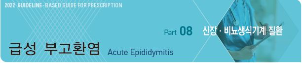
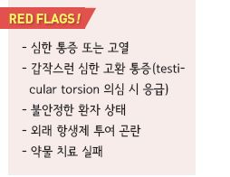
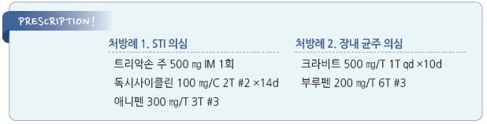

# 급성 부고환염 Acute Epididymitis



## 일반 사항

* 감염 또는 국소 외상에 의해 발생하는, 음낭의 부종과 통증이 있는 부고환의 염증
* 유병률 : \[미국] ＞60만 회/년 외래 방문
* 급성 ＜6주, 만성 ≥6주
*   경과 : 신속한 치료 시 대부분 양호; 심한 부종 시 회복에 4주 소요

    •치료가 지연되거나 부적절한 경우 epididymo-orchitis, abscess 발생, fertility 저하

## 원인

#### 감염성 (Infectious epididymitis)

* 기전 : 소변의 세균이 정관을 통하여 부고환으로 retrograde, 드물게 혈행성
* ＞35세 : coliform bacteria(E. coli), S. aureus, S. epidermidis, M. tuberculosis
* ＞35세 : coliform bacteria, S. aureus , S. epidermidis

#### 비-감염성 (Sterile epididymitis)

* 기전 : sterile urine의 역류(예: 소변을 참은 상태에서의 심한 육체 활동) → 24시간 내 염증 반응 발생(편측 고환 부종, 통증)

### 위험 인자

*   복압 증가 : 빈번한 신체 긴장, 준비되지 않은 상태에서의 강한 신체 활동, 방광이 가득 찬 상태에서의 격렬한 활동,

    (소변을 참고 일하는) 식당 근로자, 군인
* 요로 감염, 전립선염
* 도뇨관 유치, 요로 조작/수술, 경직장 전립선 시술
* 요도 원위부 폐쇄 : 요도 협착, 전립선비대증, 전립선 종양
* 심한 육체 활동 또는 장기간의 비-활동
* 전신 질환, 면역 저하, 결핵(특히 만성 부고환염)
* 고위험 성교



## 임상 양상

* 갑자기 또는 수 시간에 걸쳐 심해지는 편측 고환 뒷부분의 통증, 압통, 부종, 발적
* 서혜부, 하복부, 또는 옆구리로의 방사통
* 요도염 증상(요로 자극) : 빈뇨, 배뇨통, 혼탁뇨, 혈뇨
* reactive hydrocele
* 직장 수지 검사에서 전립선 압통
* (고환염 발생 시) 고환 및 spermatic cord 압통
* 심한 경우 전신 발열

> ✽당뇨병신경병증이 있는 고령의 환자에서는 통증을 잘 느끼지 못할 수 있음

## 진단

* 요로에 대한 full assessment(특히 재발 시)

### 실험실 검사

* CBC : WBC↑ Lt shift
* 소변 검사 : leukocyte esterase(+), WBC ≥10/HPF
* 요도 분비물 그람염색 : WBC ≥2/HPF
* 소변 현미경검사, 배양 검사, PCR
* STI(성매개감염)가 의심되는 경우 C. trachomatis , N. gonorrhoeae 등 모든 STI 관련 균주 검사

### 영상 검사

* 증상이 호전되지 않거나 감별 진단이 되지 않는 경우 시행
* radionuclide scanning : 가장 정확하지만 시행하기 어려움
* 초음파 : 편리하지만 위음성 및 testicular torsion과 구별하기 어려운 경우가 많음
* 도플러 초음파 : testicular torsion을 배제하지 못하는 경우 고려
* 결핵균 감염 의심 시 흉부 X선

### Acute scrotal pain 감별

```

```

### 증상/병력에 따른 남성 Genital problem의 감별

```

```

## Management

### 치료 방침

* 대증 치료 : 진통제, 안정/활동 제한, 고환 거상/지지(예: scrotal supporter), 냉찜질
* 항생제 치료 : 경험적 항생제 투여, 검사 결과 및 치료 반응에 따라 조정
*   치료 완료까지 성관계 중단; 성관계 관련 원인 의심 시 성 파트너 함께 치료

    •추적을 요하는 이전 성 접촉 기간 : C. trachomatis 6개월, N. gonorrhoeae 2개월, M. genitalium 3개월, 기타 2개월

## 약물 치료

### 항생제

```
[CDC/IUSTI]
```

*   STI(Chlamydia or Gonorrhea ) 의심 : ceftriaxone 500 ㎎ IM ×1회 \[트리악손]

    plus doxycycline 100 ㎎ bid ×10d \[독시사이클린]
* 장내 균주 의심 : levofloxacin 500 ㎎ qd ×10d \[크라비트]
* STI or 장내 균주 의심 : ceftriaxone 500 ㎎ IM ×1회 plus levofloxacin 500 ㎎ qd ×10d
* Mycoplasma genitalium 확인 : moxifloxacin 400 ㎎ qd ×14d \[아벨록스] OR levofloxacin, ofloxacin
* 임균 감염 가능성이 낮음 : ceftriaxone OR ofloxacin 고려
* 임균 감염 가능성이 있음 : ceftriaxone & doxycycline plus azithromycin (☞ p.637)
* 내성 균주 증가에 따라 ofloxacin은 N. gonorrhoeae 에 대하여 1차 선택하지 않음

### 통증

* NSAID : narproxen \[낙센], ibuprofen \[부루펜]
* steroid : NSAID로 조절되지 않는 경우; methylprednisolone 40 ㎎/d \[메치론]
* acetaminophen-codeine, acetaminophen-oxycodone : 중등증 이상의 통증
* spermatic cord block : 중증 통증

## 추적 관리

* 치료 개시 3일 내 증상 호전되지 않으면 재평가
* 항생제 기본 치료 기간 시행 후에도 부종과 압통이 지속되면 재평가
* 2주째 증상, 치료 순응도 등 평가
*   cure test (치료 종료 후) •N. gonorrhoeae : 3일째 배양 검사, 2주째 NAAT •C. trachomatis or M. genitalium :

    4주째 시행할 수 있음

## 예방

* 변비 치료
* BPH/전립선염 치료
* 비감염성 부고환염 시 수 주간 복압을 높일 수 있는 활동 삼가, 운동 전 배뇨
* 볼거리 백신 접종
* 요도 조작 전 예방적 항생제 투여

> **질병코드** N45 고환염 및 부고환염


