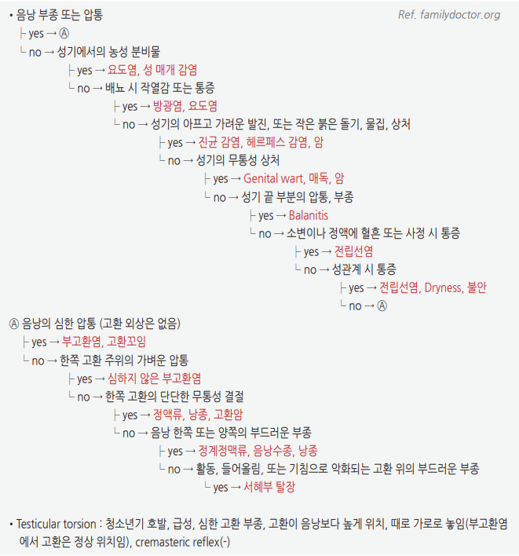
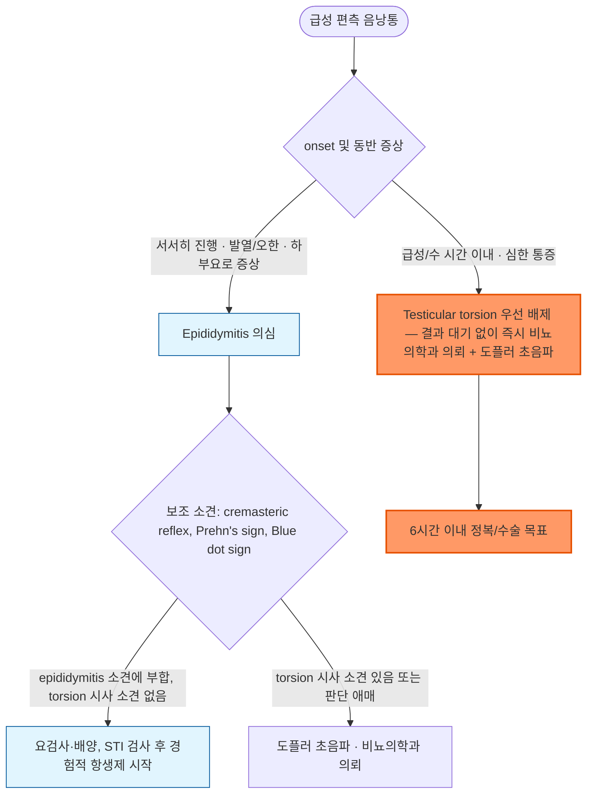

# 급성 부고환염 Acute Epididymitis

## <mark style="color:green;">일반 사항</mark>

* 정의 : 감염 또는 국소 외상에 의해 발생하는, 음낭 부종과 통증을 동반한 부고환의 염증
* 분류 : 급성 ＜6주, 만성 ≥6주
* 유병률 : \[미국] ＞60만 회/년 외래 방문
* 경과 : 신속한 치료 시 대부분 양호; 항생제 치료가 종료된 후에도 부종·압통 등 국소 증상은 수 주간 지속될 수 있으며, 이는 그 자체로 치료 실패를 의미하지 않음
* 합병증 : 치료가 지연되거나 부적절한 경우 epididymo-orchitis, abscess 발생, fertility 저하

## <mark style="color:green;">원인</mark>

#### <mark style="color:$primary;">감염성 (Infectious epididymitis)</mark>

* 기전 : 소변의 세균이 정관을 통하여 부고환으로 retrograde, 드물게 혈행성
* STI 위험이 있는 성활동 남성 : C. trachomatis, N. gonorrhoeae 중심(±M. genitalium)
* Insertive anal sex : STI 균주 + 장내세균
* BPH, 요로폐색, 요로 조작/수술(도뇨관 유치, 전립선 생검 등) : E. coli 등 장내세균 중심; 카테터 관련 감염에서는 S. aureus, S. epidermidis도 고려
* M. tuberculosis : 만성·육아종성 부고환염에서 고려(급성 원인균으로는 드묾)
* ✽나이(＞35세)는 STI 위험이 낮고 장내세균 위험이 높음을 시사하는 보조적 지표일 뿐, 고령에서도 STI가 배제되지 않음

#### <mark style="color:$primary;">비-감염성 (Sterile epididymitis)</mark>

* 기전 : 비감염성 염증이 발생하는 경우도 있으나 흔하지 않음. Sterile urine의 역류(예: 심한 육체 활동, 배뇨 지연)나 심한 신체 활동 등이 관련될 수 있다는 보고가 있음
* 약물성 : amiodarone(고용량·장기 복용) — 부고환 두부에 축적되어 무균성 염증 유발; 의심 시 amiodarone 용량 조정/중단 고려(일부 증례에서는 자연 호전이 없어 중단이 필요했음)
* ✽감염 원인이 배제된 비-감염성 부고환염으로 판단되면 항생제는 필요하지 않으며 대증치료(안정, NSAID, 냉찜질)로 관리; 다만 비-감염성 진단은 감염을 배제한 후에 내리는 진단임에 유의

### <mark style="color:orange;">위험 인자</mark>

* 복압 증가 : 빈번한 신체 긴장, 준비되지 않은 상태에서의 강한 신체 활동, 방광이 가득 찬 상태에서의 격렬한 활동, 소변을 오래 참는 근무 환경
* 요로 감염, 전립선염
* 도뇨관 유치, 요로 조작/수술, 경직장 전립선 시술
* 요도 원위부 폐쇄 : 요도 협착, 전립선비대증, 전립선 종양
* 심한 육체 활동 또는 장기간의 비-활동
* 전신 질환, 면역 저하, 결핵(특히 만성 부고환염)
* 고위험 성교

## <mark style="color:green;">임상 양상</mark>

* 갑자기 또는 수 시간에 걸쳐 심해지는 편측 고환 뒷부분의 통증, 압통, 부종, 발적
* 서혜부, 하복부, 또는 옆구리로의 방사통
* 요도염 증상(요로 자극) : 빈뇨, 배뇨통, 혼탁뇨, 혈뇨
* reactive hydrocele
* 요로폐색·전립선염이 의심되거나 장내세균성 원인이 예상되는 경우 직장 수지 검사에서 전립선 압통 확인
* (고환염 발생 시) 고환 및 spermatic cord 압통
* 심한 경우 전신 발열
* ✽당뇨병신경병증이 있는 고령의 환자에서는 통증을 잘 느끼지 못할 수 있음

### <mark style="color:$danger;">🚩 Red Flags!</mark>

<mark style="color:$danger;">**즉각 조치 또는 의뢰**</mark>

* 갑작스런 심한 고환 통증(testicular torsion 의심) → 즉시 비뇨의학과 평가; 필요 시 지체 없이 color Doppler 초음파(초음파 대기로 수술적 평가가 지연되어서는 안 됨)
* 불안정한 환자 상태

<mark style="color:$warning;">**당일 또는 조기 의뢰**</mark>

* 심한 통증 또는 고열
* 외래 항생제 투여 곤란

<mark style="color:$info;">**외래 추적 / 추가 평가 계획**</mark> <mark style="color:$info;">- 즉각 위험 낮으나 호전 없으면 의뢰</mark>

* 약물 치료 실패(표준 항생제 치료 기간 완료 후에도 반응 없음)

## <mark style="color:green;">진단</mark>

* 요로에 대한 full assessment(특히 재발 시)

### <mark style="color:orange;">실험실 검사</mark>

* CBC : WBC↑ Lt shift
* 요검사 : pyuria 또는 leukocyte esterase 양성 등 요로 염증 소견(WBC ≥10/HPF)
* 요도 분비물 Gram stain : WBC ≥2/oil immersion field — 동반 요도염의 객관적 증거(부고환염 자체의 필수 진단기준은 아님)
* 소변 현미경검사, 배양 검사, PCR
* STI 위험이 있으면 N. gonorrhoeae, C. trachomatis NAAT 시행; 매독 혈청검사 및 HIV 검사도 모든 의심 환자에서 고려/권고

### <mark style="color:orange;">영상 검사</mark>

* 증상이 호전되지 않거나 감별 진단이 되지 않는 경우 시행
* Color Doppler 초음파 : torsion과 epididymitis의 감별에 유용한 1차 영상검사. 다만 임상적으로 torsion이 강하게 의심되는 경우 초음파 결과 때문에 비뇨의학과 평가가 지연되어서는 안 됨
* radionuclide scanning : 이론적으로 가장 정확하나 신속한 시행이 어려워 1차 진료에서 실용성은 낮음
* 결핵균 감염 의심 시 소변 결핵검사(AFB smear/culture 및 NAAT 등) 및 필요 시 흉부 X선

### <mark style="color:orange;">감별 — Acute Scrotal Pain</mark>

<table><thead><tr><th width="156">질환</th><th>증상</th><th>징후</th></tr></thead><tbody><tr><td><strong>Epididymitis</strong></td><td>• insidious onset • fevers &#x26; rigors • 관련된 성관계 경력 • 하부 요로 증상</td><td>• indurated epididymis • 고환 상부 압통 • Prehn's sign(+) • cremasteric reflex 유지</td></tr><tr><td><strong>Testicular torsion</strong></td><td>• sudden onset • 중증 통증 • 외상 관련 • 구역, 구토, 복통</td><td>• 무증상, high-riding testis • Prehn's sign(-) • cremasteric reflex(-)</td></tr><tr><td><strong>Torsion of the appendix testis</strong></td><td>• gradual onset • 중등증–중증 통증 • 구역, 구토</td><td>• 고환 상극 압통(upper pole tenderness) • 'Blue dot' sign</td></tr></tbody></table>

_\*Prehn's sign : 고환을 손으로 밑에서 받쳐 올리면 통증 감소_\
_✽Prehn's sign은 torsion을 신뢰성 있게 배제하지 못함(양성이어도 torsion 환자의 상당수에서 관찰될 수 있음) — 임상적으로 torsion이 의심되면 Prehn's sign이나 초음파 결과와 무관하게 즉시 비뇨의학과 의뢰_\
_Ref. Acute scrotal pain. Aust Fam Physician 2013;42(11)_

### <mark style="color:orange;">증상/병력에 따른 남성 Genital problem의 감별</mark>

<figure><figcaption></figcaption></figure>

***


```mermaid
graph TD
    Start([급성 편측 음낭통]) --> Onset{onset 및 동반 증상}
    Onset -->|급성/수 시간 이내 · 심한 통증| Torsion[Testicular torsion 우선 배제 — 결과 대기 없이 즉시 비뇨의학과 의뢰 + 도플러 초음파]
    Onset -->|서서히 진행 · 발열/오한 · 하부요로 증상| Epi[Epididymitis 의심]
    Epi --> Adjunct{보조 소견: cremasteric reflex, Prehn's sign, Blue dot sign}
    Adjunct -->|epididymitis 소견에 부합, torsion 시사 소견 없음| Treat[요검사·배양, STI 검사 후 경험적 항생제 시작]
    Adjunct -->|torsion 시사 소견 있음 또는 판단 애매| Refer[도플러 초음파 · 비뇨의학과 의뢰]
    Torsion --> Surgery[6시간 이내 정복/수술 목표]
    style Torsion fill:#f96,stroke:#e65100,stroke-width:2px
    style Surgery fill:#f96,stroke:#e65100,stroke-width:2px
    style Epi fill:#e1f5fe,stroke:#01579b
    style Treat fill:#e1f5fe,stroke:#01579b
```

<p align="center"><strong>급성 음낭통 감별 알고리듬</strong></p>

<p align="center"><em><mark style="color:$info;">Ref. Acute scrotal pain. Aust Fam Physician 2013;42(11)</mark></em></p>

***

## <mark style="background-color:$warning;">Management</mark>

### <mark style="color:orange;">치료 방침</mark>

* 항생제 치료 : 경험적 항생제 투여, 검사 결과 및 치료 반응에 따라 조정
* 치료 완료까지 성관계 중단; 성관계 관련 원인 의심 시 성 파트너 함께 치료
  * C. trachomatis 또는 N. gonorrhoeae 의심/확인 시, 증상 발생 전 최근 60일 이내 성 파트너를 평가·검사·치료(CDC)

## <mark style="color:green;">비-약물 치료 및 예방</mark>

* 대증 치료 : 진통제, 안정/활동 제한, 고환 거상/지지(예: scrotal supporter), 냉찜질
* 예방
  * 변비 치료
  * BPH/전립선염 치료
  * 비감염성 부고환염 시 수 주간 복압을 높일 수 있는 활동 삼가, 운동 전 배뇨
  * 요로 조작/수술 전 예방적 항생제 투여 여부는 해당 시술의 감염예방 지침에 따라 결정
  * ✽볼거리(mumps) 백신 : 세균성 부고환염이 아닌 볼거리 바이러스성 orchitis 예방 목적
  * ✽doxycycline PEP(성접촉 후 72시간 내 200 ㎎ 1회 복용) : CDC 2024, 최근 12개월 내 매독·클라미디아·임균 감염력이 있는 MSM/TGW 대상 성매개감염 예방 옵션으로 상담 가능(부고환염 자체의 예방 근거는 아니며 STI 재발 예방 목적)

## <mark style="color:green;">약물 치료</mark>

### <mark style="color:orange;">항생제 \[CDC/IUSTI]</mark>


**Ceftriaxone 용량 — 지침별 차이**\
CDC 2021(미국) : ceftriaxone 500 ㎎ IM ×1회(체중 ≥150 kg인 경우 1 g IM) + doxycycline 100 ㎎ bid ×10일\
2024 European(BASHH/IUSTI) guideline : ceftriaxone 1 g IM ×1회 + doxycycline 100 ㎎ bid ×10일(azithromycin 병용은 원칙적으로 제외)\
→ 국내 진료에서는 최신 국내 지침 및 임균 내성 동향을 함께 고려하여 용량 선택


* STI(Chlamydia or Gonorrhea) 의심 : ceftriaxone 500 ㎎ IM ×1회 <mark style="color:blue;">\[트리악손]</mark> plus doxycycline 100 ㎎ bid ×10d <mark style="color:blue;">\[독시사이클린]</mark>
* Insertive anal sex 등으로 STI와 장내 균주가 모두 의심 : ceftriaxone 500 ㎎ IM ×1회 plus levofloxacin 500 ㎎ qd ×10d
* 장내 균주만 의심(임균 감염 가능성 낮음, gram stain 등으로 배제) : levofloxacin 500 ㎎ qd ×10d <mark style="color:blue;">\[크라비트]</mark> 단독
* Mycoplasma genitalium 확인 : moxifloxacin 400 ㎎ qd ×14d <mark style="color:blue;">\[아벨록스]</mark> (✽부고환염과의 인과관계 근거는 제한적이나, complicated infection에 대한 IUSTI 2021 권고, Grade 1C — 다른 원인(임균/클라미디아/장내균 등) 배제 후 치료 고려; levofloxacin/ofloxacin은 M. genitalium에 대한 감수성이 낮아 대체제로 권장되지 않음)
* 내성 균주 증가에 따라 ofloxacin은 N. gonorrhoeae 에 대하여 1차 선택하지 않음
* ✽CDC 2021 지침 이후 임균 치료에서 azithromycin 병용은 더 이상 routine 권고되지 않음(doxycycline 단독 병용으로 대체)

### <mark style="color:orange;">통증</mark>

* NSAID : naproxen <mark style="color:blue;">\[낙센]</mark>, ibuprofen <mark style="color:blue;">\[부루펜]</mark>
* acetaminophen-codeine, acetaminophen-oxycodone : 중등증 이상의 통증
* NSAID로 조절되지 않는 심한 통증 : torsion, abscess 등 다른 진단 재평가 우선; 배제된 경우 spermatic cord block 고려

## <mark style="color:green;">추적 관리</mark>

* 치료 개시 후 72시간(3일) 이내 증상 호전 여부 평가
* 호전 없음 : 진단 및 항생제 선택 재평가; torsion, abscess, 종양 등 다른 원인 반드시 배제
* 표준 치료 기간 종료 후에도 부종·압통이 지속되는 경우 : abscess, tumor, infarction, TB 등 감별 및 비뇨의학과 의뢰
* 임균 또는 클라미디아 양성이었던 경우 : 재감염 탐지를 위해 치료 완료 3개월 후 재검사(CDC) — 치료 실패 확인용 test-of-cure와는 별개의 개념
* 임균/클라미디아 등 개별 STI의 test-of-cure 적응증은 해당 STI 챕터 기준을 따름

***

### <mark style="color:red;">질병코드</mark>

N45 고환염 및 부고환염

***

## <mark style="color:purple;">처방례</mark>

> **처방례 1. STI(클라미디아/임균) 의심**
>
> ```
> 트리악손 주 500 ㎎  IM 1회
> 독시사이클린 100 ㎎/C  2T #2  ×10d
> 애니펜 300 ㎎/T  3T #3
> ```
>
> _✽ceftriaxone 500 ㎎ IM 1회 + doxycycline 100 ㎎ bid ×10d 병용(CDC/IUSTI); 통증 조절은 NSAID 병용_

> **처방례 2. 장내 균주 의심**
>
> ```
> 크라비트 500 ㎎/T  1T qd  ×10d
> 부루펜 200 ㎎/T  6T #3
> ```
>
> _✽levofloxacin 단독 요법(CDC/IUSTI); enteric organism(대장균 등) 의심 시_

> **처방례 3. STI + 장내 균주 동시 의심**
>
> ```
> 트리악손 주 500 ㎎  IM 1회
> 크라비트 500 ㎎/T  1T qd  ×10d
> 부루펜 200 ㎎/T  6T #3
> ```
>
> _✽ceftriaxone 500 ㎎ IM 1회 + levofloxacin 500 ㎎ qd ×10d 병용(CDC 2021 기준); 성매개균과 장내균 감염이 모두 의심되는 경우(예: 삽입 성교 이력 있는 남성). ✽ceftriaxone 용량은 국내 STI 지침과 별도로 최종 대조 권장(상단 hint 참조)_

> **처방례 4. M. genitalium이 확인된 부고환염**
>
> ```
> 아벨록스 400 ㎎/T  1T qd  ×14d
> 부루펜 200 ㎎/T  6T #3
> ```
>
> _✽M. genitalium은 부고환염과의 인과관계에 대한 근거가 제한적임. 다만 IUSTI 2021은 M. genitalium에 의한 complicated infection(epididymitis)에 moxifloxacin 400 ㎎ qd ×14일을 권고(Grade 1C)_

***

### <mark style="color:$success;">핵심 복약 지도</mark>

> **항생제, 처방된 기간까지 반드시 완료하세요**
>
> * 처방된 항생제는 정해진 용량과 기간에 따라 복용하고, 증상이 좋아졌다고 임의로 중단하거나 남은 약을 임의로 연장하지 않도록 안내
> * 3일 이내 증상 호전이 없거나 치료 완료 후에도 부종·압통이 지속되면 재평가 필요
> * doxycycline 복용 시 충분한 물과 함께 복용, 복용 직후 눕지 않도록 안내(식도 자극 예방); 광과민 반응 주의(자외선 차단)
> * STI가 원인으로 확인/의심되는 경우, 본인과 성 파트너의 치료가 모두 완료되고 증상이 호전될 때까지 성관계 금지; 최근 성 파트너도 함께 검사·치료 받도록 안내

> **음낭 지지와 냉찜질, 통증 조절**
>
> * scrotal supporter 착용 및 안정으로 부종·통증 완화
> * 급성기 냉찜질 권장
> * NSAID로 조절되지 않는 심한 통증은 torsion·abscess 등 재평가 우선, 배제 후 spermatic cord block 등 고려

> **언제 다시 병원을 방문해야 하나요?**
>
> * 3일 이내 증상이 호전되지 않는 경우
> * 표준 치료 기간 종료 후에도 부종·압통이 지속되는 경우
> * **갑자기 통증이 심해지거나 고환이 위로 당겨 올라간 느낌**, 발열·오한이 동반되는 경우 — 즉시 응급실 방문(testicular torsion, abscess 감별)
> * 항생제 복용 중 심한 설사, 발진 등 약물 이상반응이 생긴 경우

***

### <mark style="color:blue;">환자 안내서</mark>


**부고환염, 대부분 항생제 치료로 잘 낫습니다**

부고환염은 고환 뒤쪽에 있는 '부고환'이라는 관에 염증이 생기는 질환입니다. 방광염처럼 세균 감염이 원인인 경우가 많고, 적절한 항생제 치료를 받으면 대부분 좋아집니다.


#### <mark style="color:$primary;">왜 생기나요?</mark>

* 요로의 세균이 정관을 따라 거꾸로 부고환까지 올라가 염증을 일으키는 경우가 가장 흔합니다.
* 드물게 세균 감염이 없어도, 소변을 오래 참거나 무리한 신체 활동을 한 뒤 비슷한 증상이 생기는 경우가 보고됩니다.
* 성 접촉을 통해 옮는 세균(클라미디아, 임균 등)이 원인인 경우도 흔하며, 이 경우 성 파트너도 함께 검사·치료가 필요합니다.

#### <mark style="color:$primary;">일상생활에서 어떻게 관리하나요?</mark>

* **음낭을 받쳐 올려주는 서포터(scrotal supporter)를 착용하십시오.** 통증과 부종을 줄여줍니다.
* **최대한 안정을 취하고 심한 신체 활동은 피하십시오.**
* **초기에는 냉찜질을 하십시오.** 통증과 부기를 줄이는 데 도움이 됩니다.
* **소변을 오래 참지 마십시오.** 방광이 가득 찬 상태에서 무리한 힘을 주는 것을 피하십시오. 특히 화장실 이용이 어려운 근무 환경(장시간 소변을 참아야 하는 직종 등)에서는 더욱 주의가 필요합니다.

#### <mark style="color:$primary;">항생제는 어떻게 써야 하나요?</mark>

* **처방된 항생제는 정해진 용량과 기간에 따라 복용하고, 증상이 좋아졌다고 임의로 중단하거나 남은 약을 임의로 연장하지 마십시오.** 중간에 끊으면 치료가 불완전해지고 재발할 수 있습니다.
* 원인이 성 접촉으로 인한 감염으로 확인·의심되는 경우, **본인과 성 파트너의 치료가 모두 끝나고 증상이 없어질 때까지 성관계를 피하십시오.** 최근 성 파트너도 검사와 치료를 받아야 합니다.

#### <mark style="color:$primary;">이럴 때는 즉시 병원을 방문하세요</mark>

* **갑자기 고환 통증이 매우 심해지거나 고환이 평소보다 위로 당겨 올라간 느낌이 들 때**
* 심한 발열, 오한이 동반될 때
* 치료 시작 후 3일이 지나도 증상이 좋아지지 않을 때
