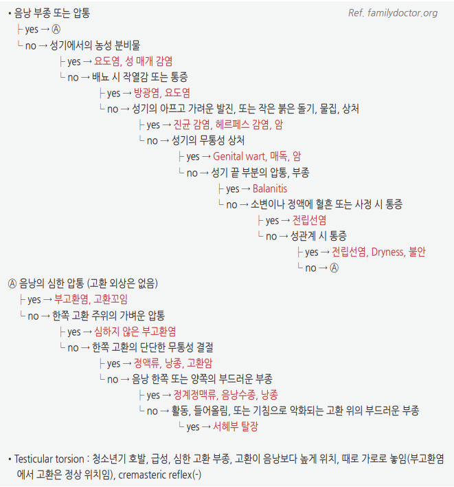
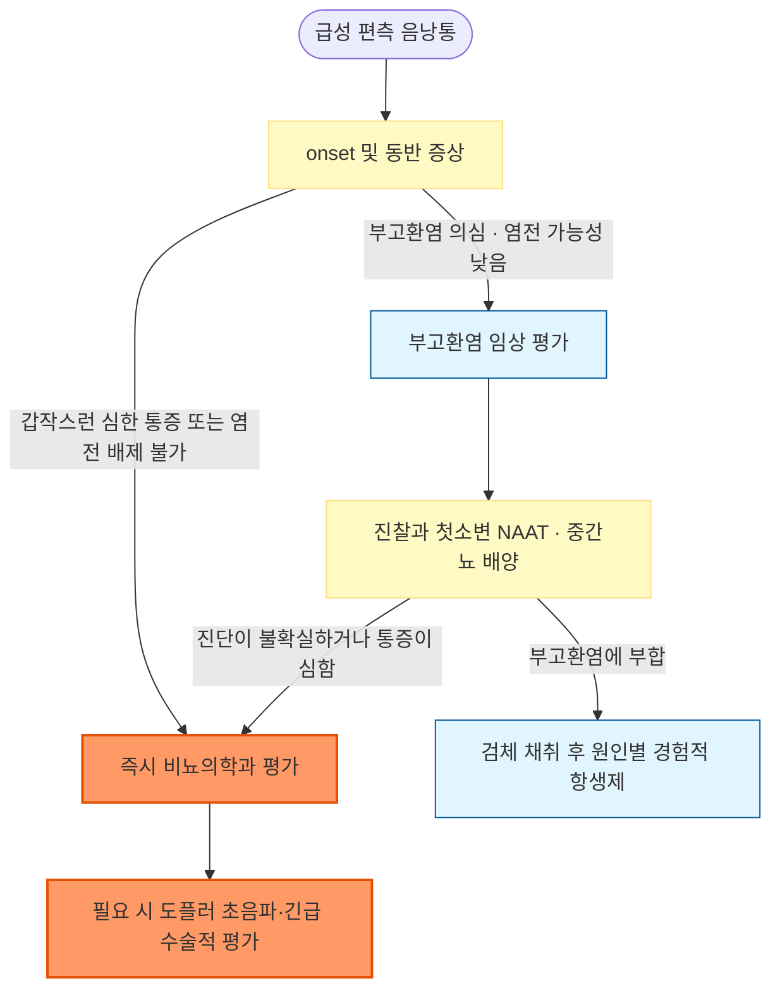

# 급성 부고환염 Acute Epididymitis

## <mark style="color:green;">일반 사항</mark>

* 정의 : 음낭 부종과 통증을 동반하는 부고환의 염증. 흔히 감염성이고 드물게 비감염성 원인에 의함
* 분류 : 급성 ＜6주, 만성 ≥6주
* 유병률 : \[미국] ＞60만 회/년 외래 방문
* 경과 : 신속한 치료 시 대부분 양호; 항생제 치료가 종료된 후에도 부종·압통 등 국소 증상은 수 주간 지속될 수 있으며, 이는 그 자체로 치료 실패를 의미하지 않음
* 합병증 : 치료가 지연되거나 부적절한 경우 epididymo-orchitis, abscess 발생, fertility 저하

## <mark style="color:green;">원인</mark>

#### <mark style="color:$primary;">감염성 (Infectious epididymitis)</mark>

* 기전 : 소변의 세균이 정관을 통하여 부고환으로 retrograde, 드물게 혈행성
* 성매개감염이 관련된 경우 : C. trachomatis, N. gonorrhoeae 중심(±M. genitalium); 성활동 연령·병력만으로 원인균을 단정하지 않음
* Insertive anal sex : STI 균주 + 장내세균
* BPH, 요로폐색, 요로 조작/수술(도뇨관 유치, 전립선 생검 등) : E. coli 등 장내세균 중심; 카테터 관련 감염에서는 S. aureus, S. epidermidis도 고려
* M. tuberculosis : 만성·육아종성 부고환염에서 고려(급성 원인균으로는 드묾)
* ✽나이(＞35세)는 STI 위험이 낮고 장내세균 위험이 높음을 시사하는 보조적 지표일 뿐, 고령에서도 STI가 배제되지 않음

#### <mark style="color:$primary;">비-감염성 (Sterile epididymitis)</mark>

* 기전 : 드물게 감염 없이 염증이 발생하며, 무균성 소변의 역류나 격한 신체 활동과의 연관성이 보고됨. 병력만으로 비감염성을 확진할 수 없음
* 약물성 : 고용량·장기간 amiodarone 사용과 관련된 무균성 부고환염이 보고됨. 의심 시 처방의와 상의하여 용량 조정 또는 대체를 검토하며 임의로 중단하지 않음
* ✽감염 원인이 배제된 비-감염성 부고환염으로 판단되면 항생제는 필요하지 않으며 대증치료(안정, NSAID, 냉찜질)로 관리; 다만 비-감염성 진단은 감염을 배제한 후에 내리는 진단임에 유의

### <mark style="color:orange;">위험 인자</mark>

* 요로 감염, 전립선염
* 도뇨관 유치, 요로 조작/수술, 경직장 전립선 시술
* 배뇨장애·요로폐색 : 요도 협착, 전립선비대증, 신경인성 방광 등
* 전신 질환, 면역 저하, 결핵(특히 만성 부고환염)
* 임균·클라미디아 노출 위험이 있는 성접촉; 삽입 항문성교는 장내세균 노출도 고려
* ✽격한 신체 활동·소변 참기 등과 비감염성 부고환염의 연관성은 보고 수준이며, 일반적인 감염성 부고환염의 확립된 위험 인자로 취급하지 않음

## <mark style="color:green;">임상 양상</mark>

* 갑자기 또는 수 시간에 걸쳐 심해지는 편측 고환 뒷부분의 통증, 압통, 부종, 발적
* 서혜부, 하복부, 또는 옆구리로의 방사통
* 요도염 증상(요로 자극) : 빈뇨, 배뇨통, 혼탁뇨, 혈뇨
* reactive hydrocele
* 발열·회음부 통증·배뇨장애 등으로 급성 전립선염이 별도로 의심되는 경우, 상태와 필요성을 판단하여 부드러운 직장수지검사를 고려(전립선 마사지 금지)
* (고환염 발생 시) 고환 및 spermatic cord 압통
* 심한 경우 전신 발열
* ✽당뇨병신경병증이 있는 고령의 환자에서는 통증을 잘 느끼지 못할 수 있음

### <mark style="color:$danger;">🚩 Red Flags!</mark>

<mark style="color:$danger;">**즉각 조치 또는 의뢰**</mark>

* 갑작스런 심한 고환 통증(testicular torsion 의심) → 즉시 비뇨의학과 평가; 필요 시 지체 없이 color Doppler 초음파(초음파 대기로 수술적 평가가 지연되어서는 안 됨)
* 불안정한 환자 상태
* 급속히 번지는 음낭·회음부 발적/부종, 피부 변색·괴사, 염발음 또는 패혈증 소견(Fournier 괴저 의심) → 즉시 응급 평가

<mark style="color:$warning;">**당일~수일 내 평가**</mark>

* 심한 통증 또는 고열, 농양·고환경색 등 합병증 의심 → 당일 비뇨의학과/응급 평가 및 입원 여부 판단
* 외래 항생제 복용 불가 또는 빠르게 진행하는 국소 염증 → 당일 평가
* 치료 시작 후 72시간 안에 호전되지 않거나 악화함 → 지체 없이 재평가(상태에 따라 당일 의뢰)

<mark style="color:$info;">**외래 추적 / 추가 평가 계획**</mark>

* 치료 종료 후 부종·압통이 뚜렷하게 남거나 악화함 → 농양·종양·경색·결핵 등 감별 계획(가벼운 잔여 불편감은 호전 추세를 확인)

## <mark style="color:green;">진단</mark>

* 요로에 대한 full assessment(특히 재발 시)

### <mark style="color:orange;">실험실 검사</mark>

* CBC, CRP : 발열·전신 증상 등 중증도 평가가 필요한 경우 고려(백혈구 증가/좌방이동은 비특이적)
* 첫소변(first-void urine) : leukocyte esterase 양성 또는 원심분리한 침사에서 WBC ≥10/HPF 등 요도 염증의 객관적 소견 확인
* 요도 분비물이 있으면 Gram stain 등에서 WBC ≥2/oil immersion field 확인; 세포내 그람음성 쌍구균은 임균 감염을 시사. 염증 소견이나 분비물이 없다고 부고환염·STI를 배제하지 않음
* 모든 급성 부고환염 의심 환자 : 첫소변 N. gonorrhoeae·C. trachomatis NAAT와 일반 세균배양용 중간뇨 채취(가능하면 항생제 투여 전). 일반 소변배양은 임균·클라미디아 진단을 대신하지 않음
* 모든 의심 환자에서 HIV 검사 및 매독 혈청검사 권고; 성접촉 부위와 병력에 따라 다른 STI 검사도 고려

### <mark style="color:orange;">영상 검사</mark>

* 진단이 불확실하거나 torsion·농양·종양·경색 등 다른 병태가 의심되는 경우, 또는 적절한 치료에도 호전되지 않는 경우 시행
* Color Doppler 초음파 : 급성 음낭통의 감별에 유용하나 부분 염전에서는 부고환염과 비슷하게 보일 수 있음. 염전이 강하게 의심되면 초음파 대기로 즉각적인 비뇨의학과 평가·수술적 탐색을 지연하지 않음
* radionuclide scanning : 이론적으로 가장 정확하나 신속한 시행이 어려워 1차 진료에서 실용성은 낮음
* 결핵균 감염 의심 시 소변 결핵검사(AFB smear/culture 및 NAAT 등) 및 필요 시 흉부 X선

### <mark style="color:orange;">감별 - Acute Scrotal Pain</mark>

<table><thead><tr><th width="156">질환</th><th>시사하는 병력</th><th>진찰 소견(배제 기준은 아님)</th></tr></thead><tbody><tr><td><strong>Epididymitis</strong></td><td>• 수일에 걸쳐 진행 가능 • 배뇨 증상이나 요도 분비물은 없을 수도 있음 • 성접촉·요로 시술 병력 확인</td><td>• 부고환 중심의 압통·종창 • 반응성 음낭수종 가능</td></tr><tr><td><strong>Testicular torsion</strong></td><td>• 갑작스런 심한 편측 통증 • 구역·구토 또는 복통 가능 • 증상 시작 양상만으로 배제 불가</td><td>• 고환의 상승/가로놓임 또는 고환올림근반사 소실이 시사적이나, 없다고 배제 불가</td></tr><tr><td><strong>Torsion of the appendix testis</strong></td><td>• 비교적 국소적인 통증으로 시작 가능</td><td>• 고환 상극의 국소 압통 • blue dot sign이 보일 수 있음</td></tr></tbody></table>

_\*Prehn's sign : 고환을 손으로 밑에서 받쳐 올리면 통증 감소_\
_✽Prehn's sign과 고환올림근반사는 단독으로 염전을 배제하지 못함. 부분 염전에서는 도플러 초음파도 감별이 어려울 수 있어 임상적으로 염전이 의심되면 즉시 비뇨의학과 평가_\
_Ref. Acute scrotal pain. Aust Fam Physician 2013;42(11)_

### <mark style="color:orange;">증상/병력에 따른 남성 Genital problem의 감별</mark>

<figure><figcaption></figcaption></figure>

***


```mermaid
graph TD
    Start([급성 편측 음낭통]) --> Onset[onset 및 동반 증상]
    Onset -->|갑작스런 심한 통증 또는 염전 배제 불가| Torsion[즉시 비뇨의학과 평가]
    Onset -->|부고환염 의심 · 염전 가능성 낮음| Epi[부고환염 임상 평가]
    Epi --> Adjunct[진찰과 첫소변 NAAT · 중간뇨 배양]
    Adjunct -->|진단이 불확실하거나 통증이 심함| Torsion
    Adjunct -->|부고환염에 부합| Treat[검체 채취 후 원인별 경험적 항생제]
    Torsion --> Surgery[필요 시 도플러 초음파·긴급 수술적 평가]
    classDef yellow fill:#fff9c4,stroke:#ffe082
    class Onset,Adjunct yellow
    style Torsion fill:#f96,stroke:#e65100,stroke-width:2px
    style Surgery fill:#f96,stroke:#e65100,stroke-width:2px
    style Epi fill:#e1f5fe,stroke:#01579b
    style Treat fill:#e1f5fe,stroke:#01579b
```

<p align="center"><strong>급성 음낭통 감별 알고리듬</strong></p>

<p align="center"><em><mark style="color:$info;">✽초음파를 기다리느라 수술적 평가를 늦추지 않으며, 증상 시작 후 6시간이 지났어도 긴급 평가가 필요함. Ref. CDC STI Treatment Guidelines 2021; EAU Urological Infections 2026</mark></em></p>

***

## <mark style="background-color:$warning;">Management</mark>

### <mark style="color:orange;">치료 방침</mark>

* 항생제 치료 : 경험적 항생제 투여, 검사 결과 및 치료 반응에 따라 조정
* 치료 완료까지 성관계 중단; 성관계 관련 원인 의심 시 성 파트너 함께 치료
  * C. trachomatis 또는 N. gonorrhoeae 의심/확인 시, 증상 발생 전 최근 60일 이내 성 파트너를 평가·검사·추정 치료. 마지막 성접촉이 60일보다 이전이면 가장 최근 성 파트너도 평가·치료(CDC)

## <mark style="color:green;">비-약물 치료 및 예방</mark>

* 대증 치료 : 진통제, 안정/활동 제한, 고환 거상/지지(예: scrotal supporter), 냉찜질
* 예방
  * 동반된 배뇨장애·전립선비대증·요로감염은 원인에 따라 평가·치료
  * 비감염성 부고환염이 의심되면 증상을 악화시키는 활동을 한동안 줄이고 충분히 회복한 뒤 활동 재개
  * 요로 조작/수술 전 예방적 항생제 투여 여부는 해당 시술의 감염예방 지침에 따라 결정
  * ✽볼거리(mumps) 백신 : 세균성 부고환염이 아닌 볼거리 바이러스성 orchitis 예방 목적
  * ✽doxycycline PEP : 부고환염 자체의 예방 요법은 아님. 최근 12개월 내 세균성 STI 병력이 있는 MSM/TGW에서는 CDC 2024 STI 예방 지침에 따라 성접촉 후 72시간 이내 doxycycline 200 ㎎(24시간 최대 200 ㎎) 사용의 이득·위험을 개별 상담

## <mark style="color:green;">약물 치료</mark>

### <mark style="color:orange;">항생제 \[CDC 2021 중심]</mark>


**Ceftriaxone 용량 - 지침별 차이**\
CDC 2021 부고환염 요법 : ceftriaxone 500 ㎎ IM ×1회(체중 ≥150 kg이면 1 g IM) + doxycycline 100 ㎎ bid ×10일\
2024 European 부고환-고환염 지침(2026년 출판) : 임균 등 STI 가능성이 높으면 ceftriaxone 1 g IM ×1회 + doxycycline 권고(azithromycin의 일률적 병용 비권고)\
EAU 2026 : 임균 가능성이 높으면 ceftriaxone 1 g IM/IV ×1회 + doxycycline 10~14일 등\
국내 성매개감염 진료지침 2023의 임균 감염 치료 용량 : ceftriaxone 500 ㎎ IM/IV 또는 1 g IV ×1회(부고환염 전용 요법은 아님). 아래 처방례는 CDC 2021 부고환염 요법에 따름


* STI(Chlamydia or Gonorrhea) 의심 : ceftriaxone 500 ㎎ IM ×1회 <mark style="color:blue;">\[트리악손]</mark> plus doxycycline 100 ㎎ bid ×10d <mark style="color:blue;">\[독시사이클린]</mark>
* Insertive anal sex 등으로 STI와 장내 균주가 모두 의심 : ceftriaxone 500 ㎎ IM ×1회 plus levofloxacin 500 ㎎ qd ×10d
* 장내 균주만 의심 : 임균 가능성이 낮고 임균을 배제한 경우 levofloxacin 500 ㎎ qd ×10d <mark style="color:blue;">\[크라비트]</mark> 단독. 요도 분비물이 없거나 그람염색이 음성이라는 이유만으로 무증상 임균 감염을 배제하지 말고 성접촉 병력·NAAT를 함께 고려; 배양·감수성 결과에 따라 조정
* Mycoplasma genitalium 관련 부고환염이 의심되고 다른 원인 및 동반감염을 평가한 경우 : moxifloxacin 400 ㎎ qd ×14d <mark style="color:blue;">\[아벨록스]</mark> (IUSTI 2021 complicated infection 권고, Grade 1C). 균 검출만으로 부고환염의 원인이라고 단정하지 않으며 전문의와 상의하여 적용. 국내 아벨록스정 허가 적응증에 부고환염이 없어 허가 외 사용에 해당; QT 연장 위험·병용약 확인. levofloxacin/ofloxacin은 M. genitalium 대체제로 권장하지 않음
* 내성 균주 증가에 따라 ofloxacin은 N. gonorrhoeae 에 대하여 1차 선택하지 않음
* ✽임균 치료에 azithromycin을 일률적으로 병용하지 않음. 위 doxycycline 병용은 동반 클라미디아 감염의 치료·경험적 포괄을 위한 것

### <mark style="color:orange;">통증</mark>

* NSAID : naproxen <mark style="color:blue;">\[낙센]</mark>, ibuprofen <mark style="color:blue;">\[부루펜]</mark>
* dexibuprofen <mark style="color:blue;">\[애니펜]</mark> : NSAID 대안; 기저 신장·위장관·심혈관 위험을 고려하여 단기간 사용
* acetaminophen-codeine, acetaminophen-oxycodone : 중등증 이상의 통증
* NSAID로 조절되지 않는 심한 통증 : torsion, abscess 등 다른 진단 재평가 우선; 배제된 경우 spermatic cord block 고려

## <mark style="color:green;">추적 관리</mark>

* 치료 개시 후 72시간 이내 증상 호전 여부 확인. 호전이 없거나 악화하면 예정된 치료 종료일까지 기다리지 않고 진단·항생제 선택 재평가; torsion, abscess, tumor, infarction 등 배제
* 항생제 종료 후에도 부종·압통이 뚜렷하게 남거나 악화하면 abscess, tumor, infarction, TB 등 감별 및 비뇨의학과 의뢰. 국소 불편감이 수 주간 남을 수 있으므로 호전 추세·새로운 소견을 함께 판단
* 임균 또는 클라미디아 양성이었던 경우 : 재감염 탐지를 위해 치료 완료 3개월 후 재검사(CDC) - 치료 실패 확인용 test-of-cure와는 별개의 개념
* 임균/클라미디아 등 개별 STI의 test-of-cure 적응증은 해당 STI 챕터 기준을 따름
* M. genitalium 관련 감염으로 치료했다면 증상 경과를 확인하고, IUSTI 권고에 따라 test-of-cure NAAT를 고려할 때 치료 종료 후 최소 3주가 지난 뒤 검체 채취

***

## <mark style="color:red;">질병코드</mark>

N45 고환염 및 부고환염

***

## <mark style="color:purple;">처방례</mark>

> **처방례 1. STI(클라미디아/임균) 의심**
>
> ```
> 트리악손 주 500 ㎎  IM 1회
> 독시사이클린 100 ㎎/C  2T #2  ×10d
> 애니펜 300 ㎎/T  3T #3
> ```
>
> _✽ceftriaxone 500 ㎎ IM 1회 + doxycycline 100 ㎎ bid ×10d 병용(CDC 2021 부고환염 요법); 애니펜은 dexibuprofen으로 통증 조절용 NSAID_

> **처방례 2. 장내 균주만 의심·임균 배제**
>
> ```
> 크라비트 500 ㎎/T  1T qd  ×10d
> 부루펜 200 ㎎/T  6T #3
> ```
>
> _✽levofloxacin 단독 요법(CDC 2021); 장내세균 원인이 유력하고 임균 가능성을 평가·배제한 경우에만 사용. 배양·감수성 결과에 따라 조정_

> **처방례 3. STI + 장내 균주 동시 의심**
>
> ```
> 트리악손 주 500 ㎎  IM 1회
> 크라비트 500 ㎎/T  1T qd  ×10d
> 부루펜 200 ㎎/T  6T #3
> ```
>
> _✽ceftriaxone 500 ㎎ IM 1회 + levofloxacin 500 ㎎ qd ×10d 병용(CDC 2021 부고환염 요법); 임균·클라미디아와 장내세균이 모두 의심되는 경우(예: 삽입 항문성교). 국내 임균 지침과 유럽 부고환염 지침의 ceftriaxone 용량 차이는 상단 hint 참조_

> **처방례 4. M. genitalium 관련 부고환염으로 판단된 경우**
>
> ```
> 아벨록스 400 ㎎/T  1T qd  ×14d
> 부루펜 200 ㎎/T  6T #3
> ```
>
> _✽M. genitalium 검출만으로 인과관계를 확정하지 않음. 다른 원인·동반감염을 평가하고 M. genitalium 관련 복잡 감염으로 판단한 경우 IUSTI 2021 권고(Grade 1C)에 따름. 국내 허가 외 사용으로 QT 연장 위험·병용약 확인 및 추적 NAAT 계획 필요_

***

### <mark style="color:$success;">핵심 복약 지도</mark>

> **항생제, 처방된 기간까지 반드시 완료하세요**
>
> * 처방된 항생제는 정해진 용량과 기간에 따라 복용하고, 증상이 좋아졌다고 임의로 중단하거나 남은 약을 임의로 연장하지 않도록 안내
> * 치료 시작 후 72시간 이내 호전이 없거나 악화하면 치료 종료를 기다리지 말고 재평가; 치료 종료 후에도 뚜렷한 부종·압통이 남거나 악화할 때도 평가 필요
> * doxycycline 복용 시 충분한 물과 함께 복용, 복용 직후 눕지 않도록 안내(식도 자극 예방); 광과민 반응 주의(자외선 차단)
> * levofloxacin·moxifloxacin 복용 중 새로 생긴 힘줄 통증·부종, 저림·감각 이상 등이 나타나면 복용을 중단하고 즉시 처방의와 상담. levofloxacin은 신기능 저하 시 용량 조정 여부 확인
> * STI가 원인으로 확인/의심되는 경우, 본인과 성 파트너의 치료가 모두 완료되고 증상이 호전될 때까지 성관계 금지; 최근 성 파트너도 함께 검사·치료 받도록 안내

> **음낭 지지와 냉찜질, 통증 조절**
>
> * scrotal supporter 착용 및 안정으로 부종·통증 완화
> * 급성기 냉찜질 권장
> * NSAID로 조절되지 않는 심한 통증은 torsion·abscess 등 재평가 우선, 배제 후 전문의가 추가 통증 치료 고려

> **언제 다시 병원을 방문해야 하나요?**
>
> * 치료 시작 후 72시간 이내 증상이 호전되지 않거나 악화하는 경우(치료 종료까지 기다리지 않음)
> * 치료 종료 후에도 부종·압통이 뚜렷하게 남거나 악화하는 경우
> * **갑자기 통증이 심해지거나 고환이 위로 당겨 올라간 느낌**, 발열·오한이 동반되는 경우 - 즉시 응급실 방문(testicular torsion, abscess 감별)
> * 항생제 복용 중 심한 설사, 발진 등 약물 이상반응이 생긴 경우

***

### <mark style="color:blue;">환자 안내서</mark>


**부고환염, 대부분 항생제 치료로 잘 낫습니다**

부고환염은 고환 뒤쪽에 있는 '부고환'이라는 관에 염증이 생기는 질환입니다. 방광염처럼 세균 감염이 원인인 경우가 많고, 적절한 항생제 치료를 받으면 대부분 좋아집니다.


#### <mark style="color:$primary;">왜 생기나요?</mark>

* 요로의 장내세균이나 성 접촉을 통해 옮는 세균(클라미디아·임균 등)이 원인이 될 수 있습니다. 나이만으로 원인을 단정할 수 없어 검사와 병력을 함께 봅니다.
* 드물게 감염이 없는 염증도 생길 수 있지만, 감염을 평가한 뒤 판단합니다.
* 성매개감염이 원인이라면 성 파트너도 검사·치료가 필요합니다.

#### <mark style="color:$primary;">일상생활에서 어떻게 관리하나요?</mark>

* **음낭을 받쳐 올려주는 서포터(scrotal supporter)를 착용하십시오.** 통증과 부종을 줄여줍니다.
* **최대한 안정을 취하고 심한 신체 활동은 피하십시오.**
* **초기에는 냉찜질을 하십시오.** 통증과 부기를 줄이는 데 도움이 됩니다.
* 불편감을 악화시키는 활동은 회복될 때까지 줄이십시오. 배뇨장애가 있다면 진료 시 알려주십시오.

#### <mark style="color:$primary;">항생제는 어떻게 써야 하나요?</mark>

* **처방된 항생제는 정해진 용량과 기간에 따라 복용하고, 증상이 좋아졌다고 임의로 중단하거나 남은 약을 임의로 연장하지 마십시오.** 중간에 끊으면 치료가 불완전해지고 재발할 수 있습니다.
* 원인이 성 접촉으로 인한 감염으로 확인·의심되는 경우, **본인과 성 파트너의 치료가 모두 끝나고 증상이 없어질 때까지 성관계를 피하십시오.** 최근 성 파트너도 검사와 치료를 받아야 합니다.

#### <mark style="color:$primary;">이럴 때는 즉시 병원을 방문하세요</mark>

* **갑자기 고환 통증이 매우 심해지거나 고환이 평소보다 위로 당겨 올라간 느낌이 들 때**
* 심한 발열, 오한이 동반될 때
* 치료 시작 후 72시간 이내 증상이 좋아지지 않거나 오히려 악화할 때(항생제가 끝날 때까지 기다리지 마십시오)
* 음낭·회음부의 붓기나 붉은 부위가 빠르게 퍼지거나 피부가 검게 변할 때
