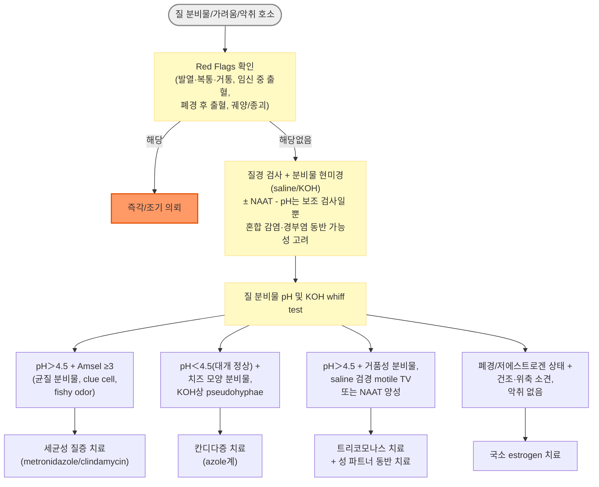

# 음문질 감염증 (Vulvovaginitis) Vulvovaginal Infections

## <mark style="color:green;">일반 사항</mark>

* 비정상적인 질 분비물, 악취, 가려움, 작열감 등의 증상을 일으키는 감염, 염증, 또는 normal flora 변화와 관련된 음문질의 질환군
* vaginosis - 염증 소견 없음; vaginitis - 염증 소견 동반
* 원인 질환에 따라 재발이 흔하며, 일부 질환(트리코모나스 질염)은 재발 시 성 파트너 치료가 필요

### <mark style="color:orange;">원인 및 위험 인자</mark>

* 감염 : 세균성 질증(40\~50%), 칸디다증(20\~25%), 편모충증(15\~20%)
* 비감염성 원인 : estrogen 감소(위축성 질염), 물리적/화학적 자극, 알레르기, 이물질, 자궁경부염, 박리성 염증성 질염
* 위험 인자
  * 흡연
  * 새로운 또는 다수의 성 파트너, 콘돔 미사용
  * 잦은 질 세척(douching) - ✽Lactobacillus 소실로 질 산도 유지 안 됨
  * estrogen 감소(폐경, 난소 제거술, 수유기)
  * 물리적/화학적 자극 : 질 세정제, 향수 비누, 조이는 옷, 자궁 내 장치

## <mark style="color:green;">임상 양상</mark>

* 공통 3주징 : 질 분비물, 가려움, 악취(세균성 질증·편모충증에서 amine odor 흔함)
* 작열감, 통증, 자극 증상, 외음부 배뇨통(배뇨 시 소변이 음순·질 입구를 자극)

### <mark style="color:orange;">아형별 비교</mark>

<table><thead><tr><th width="140">질환</th><th width="110">무증상 비율</th><th width="220">분비물 특징</th><th width="90">악취</th><th>기타 소견</th></tr></thead><tbody><tr><td>세균성 질증(BV)</td><td>약 50%</td><td>흰색, 낮은 점도, 균질, 질 벽을 coating</td><td>+(fishy)</td><td>염증 소견 없음(no inflammation)</td></tr><tr><td>Aerobic vaginitis</td><td>10\~20%</td><td>농성 분비물</td><td>-/±</td><td>질 작열감·따가움, 성교통, 질 홍반/부종, 질 궤양</td></tr><tr><td>칸디다증(VVC)</td><td>-(증상 발생군 기준)</td><td>덩어리(치즈 모양)</td><td>-</td><td>질 통증/가려움, 성교통, 질 홍반/부종, vulval fissuring, 위성 피부 병변</td></tr><tr><td>트리코모나스 질염</td><td>무증상이 흔함</td><td>거품/노란색\~초록색</td><td>+</td><td>질 가려움/자극, 배뇨통, strawberry cervix(딸기 모양 자궁경부, 드묾)</td></tr></tbody></table>

_✽건강한 여성의 약 10\~20%에서 Candida가 무증상으로 colonization되어 있어(CDC 2021), 표의 "무증상 비율"은 이미 증상성 삽화가 발생한 군을 기준으로 한 수치임에 유의_

### <mark style="color:orange;">세균성 질증 (Bacterial vaginosis, BV)</mark>

* 가임기 여성에서 비정상 질 분비물의 가장 흔한 원인
* 기전 : 혐기성 균주가 정상 Lactobacilli를 대치 → lactic acid 생성 감소 → 질 pH 상승(산성도 감소) → 혐기성 균주 증식 → G. vaginalis 등에 의한 biofilm 형성
* 원인균 : Gardnerella vaginalis, Prevotella, Atopobium vaginae, Megasphaera, Mobiluncus 등 polymicrobial
* 증상 : 50%에서 무증상; 증상 시 흰색\~회색의 낮은 점도, 균질, 생선 비린내가 나는 분비물이 질 벽을 coating; 다른 원인에 비해 염증·자극 증상은 상대적으로 적음
* 재발률 : 1개월 - 23%, 3개월 - 43%, 12개월 - 58%

### <mark style="color:orange;">Aerobic vaginitis</mark>

* 기전 : Lactobacilli 감소 및 질 산도 저하와 함께 호기성 균(예: E. coli, group B Streptococcus, S. aureus)이 우세해지는 상태 - 염증성 질환으로 분류되지만 병태생리가 명확히 규명되지는 않음
* ✽국제적으로 통일된 진단 기준(CDC 등)이 아직 확립되어 있지 않으며, 유럽(특히 Donders 등)의 문헌에서 주로 사용되는 개념임에 유의
* 증상 : 농성 분비물, 경도의 위축(atrophy) 소견, vaginitis; 장기간에 걸쳐 간헐적 악화를 보일 수 있고 치료 후 재발이 흔함

### <mark style="color:orange;">음문질 칸디다증 (Vulvovaginal Candidiasis, VVC)</mark>

* 건강한 여성의 약 10\~20%에서 Candida가 무증상으로 질 내에 집락(colonization)되어 있음; 여성의 75%가 평생 ≥1회 증상성 VVC를 경험 [CDC 2021]
* ✽무증상 집락(colonization) 자체는 치료 적응증이 아니며, 증상이 있을 때에만 VVC로 진단·치료
* 원인균 : C. albicans(약 90%), non-albicans(C. glabrata 등, ☞ p.933)
* 기전 : 정상 flora인 Candida의 과잉 증식과 질 상피세포 침범
* 위험 인자 : 쇠약, 스테로이드·항생제 사용, 당뇨병, 면역 저하, 임신, 고온다습·밀폐 의상
* 분비물 : 흰색, 높은 점도, 덩어리(치즈 모양), 악취 없음
* 분비물 외 증상 : 가려움, 작열감, 배뇨 곤란, 성교통

#### <mark style="color:$primary;">Uncomplicated VVC</mark>

* 원인균 : C. albicans
* 중등증 이하 증상; 면역 정상 여성에서 산발적으로 발생

#### <mark style="color:$primary;">Complicated VVC</mark>

* 재발성(RVVC), 중증(심한 음문 발적·부종·찰상·열상), non-albicans 감염, 또는 조절되지 않는 당뇨병·면역저하 등 숙주 요인이 동반된 경우 [CDC 2021]
* ✽임신은 complicated VVC의 구성 요소가 아니라 별도의 특수 상황(special population)으로 분류 - 치료는 국소 azole계로 제한

### <mark style="color:orange;">편모충 질염 (Trichomonal vaginitis)</mark>

* 원인균 : Trichomonas vaginalis (성매개)
* 기전 : 성관계를 통해 전파되어 질·요도 상피세포를 침범(질 감염 여성의 약 90%에서 요도 동반 감염)
* 무증상이 흔함(문헌마다 보고 비율 편차가 큼)
* 분비물 : 화농성, 악취, 노란색\~초록색
* 분비물 외 증상 : 작열감, 가려움, 배뇨 곤란, 성교통, 성관계 후 출혈
* ✽HIV 감염 여성에서는 무증상이라도 매년 선별 검사가 권고됨 [CDC 2021]

### <mark style="color:orange;">자극성 및 알레르기성 질염 (Irritant and Allergic vaginitis)</mark>

* 원인 : 살정제, 질 세정 용액, 피임용 격막(diaphragm), 라텍스 콘돔, 국소 의약품
* 증상 : 가려움, 질 불편감

### <mark style="color:orange;">위축성 질염 (Atrophic vaginitis)</mark>

* 질과 질 주변 조직이 건조·위축되고 염증을 일으킨 상태
* 원인 : estrogen 결핍(폐경, 난소 제거술, 수유기, 항에스트로겐 치료)
* 증상 : 질 건조, 자극감, 화끈거림, 성교통, 마찰·자극 시 출혈, 질 분비물, 방광 자극 증상(빈뇨, 배뇨통)

### <mark style="color:$danger;">🚩 Red Flags!</mark>

<mark style="color:$danger;">**즉각 조치 또는 의뢰**</mark>

* 발열, 하복부 통증, 자궁경부 거통(cervical motion tenderness) 또는 부속기 압통 동반 → 골반염증성 질환(PID) 의심, 즉각 평가 및 항생제 치료
* 임신 중 질 출혈 또는 복통을 동반한 이상 분비물 → 산과 즉시 평가
* 심한 외음부 부종·괴사·전신 증상(고열, 저혈압) 동반 → 괴사성 근막염 등 중증 연조직 감염 의심, 응급 평가
* 소아·청소년에서 성적 학대가 의심되는 정황을 동반한 질 감염 → 즉각 보호·신고 절차 진행

<mark style="color:$warning;">**당일 또는 조기 의뢰**</mark>

* 폐경 후 새로운 질 출혈 → 이상 분비물 동반 여부와 관계없이 자궁경부·자궁내막 병변 배제 위해 부인과 평가
* 질·외음부 궤양, 병변, 종괴 동반 → herpes, 매독 등 성매개 궤양성 질환 또는 종양 감별 필요
* 표준 1차 치료에 반응이 없고 원인이 불명확한 경우 → 배양 검사 포함 재평가 또는 부인과 의뢰
* 당뇨병 조절 불량, HIV 감염, 스테로이드 사용 등 면역 저하 상태에서 심하거나 비정형적인 감염 소견

<mark style="color:$info;">**외래 추적 / 추가 평가 계획**</mark> <mark style="color:$info;">- 즉각 위험 낮으나 호전 없으면 의뢰</mark>

* 표준 치료 후에도 증상이 지속되거나 조기에 재발하는 경우 → 원인 재평가 및 필요 시 현미경 검사·배양·NAAT 재시행(트리코모나스는 무증상이라도 치료 후 약 3개월에 재검사)
* 연 3회 이상 재발하는 칸디다증(RVVC) → 배양 검사를 통한 확진 및 유지 요법 고려
* 세균성 질증의 잦은 재발 → 예방적 유지 요법 고려

## <mark style="color:green;">진단</mark>

### <mark style="color:orange;">검사</mark>

* pH test : 칸디다증은 대개 정상 질 pH 범위(<4.5), 세균성 질증 ＞4.5, 편모충증은 흔히 ＞4.5; pH 상승 시 BV·트리코모나스·혼합감염 등을 고려하되 비특이적 소견이므로 단독 진단에는 한계
* 그람염색에 기초한 Nugent score(0\~10점, 표준 정량 채점법) : BV 진단의 참고표준(reference standard); Hay-Ison criteria(등급 분류법)는 유럽권에서 주로 사용되는 대안적 등급 분류법; Amsel's criteria는 임상에서 간편하게 사용할 수 있는 진단 기준
* 배양 검사 : polymicrobial infection이 흔하므로 BV 진단을 위한 일상적 배양 검사는 권고하지 않음(단, 재발성 칸디다증에서 균종 확인 목적의 배양은 권고)
* 질 분비물 saline-solution specimen 현미경 검사 : 움직이는 T. vaginalis 또는 clue cell 관찰
* KOH 현미경 검사 : blastospore 또는 pseudohyphae 관찰 - 칸디다증 진단(민감도 약 50%로 낮아 임상적으로 의심되나 음성일 때 배양 검사 고려)
* NAAT(핵산증폭검사) : 트리코모나스 진단에서 가장 민감도가 높은 검사로 권고 [CDC 2021]
* OSOM® trichomonas rapid test 등 immunochromatographic capillary flow dipstick 검사, PCR assay : 편모충증 즉시 진단(민감도 ＞80%, 특이도 ＞95%)

### <mark style="color:orange;">Amsel's criteria - 세균성 질증 감별</mark>

다음 4가지 중 ≥3가지이면 세균성 질증으로 진단 [CDC 2021]

① 질 벽을 매끄럽게 코팅하는 낮은 점도의 균질한 흰색\~노란색 분비물\
② 현미경 검사상 총 상피 세포의 ＞20%에서 clue cell 관찰\
③ 질 분비물 pH ＞4.5\
④ 질 분비물의 생선 비린내(특히 KOH 도포 시, whiff test 양성)

### <mark style="color:orange;">감별 진단</mark>

* 유사한 증상(비정상 분비물, 가려움, 자극감)으로 나타날 수 있는 다른 외음질 질환들의 감별이 필요

<table><thead><tr><th width="150">질환</th><th width="260">주요 특징</th><th>핵심 감별 포인트</th></tr></thead><tbody><tr><td>자궁경부염(Cervicitis)</td><td>점액농성 경부 분비물, 접촉 출혈</td><td>경부 시진·클라미디아/임질 NAAT로 확인</td></tr><tr><td>골반염증성 질환(PID)</td><td>하복부 통증, 발열, 부속기 압통</td><td>양측성 골반 압통·거통 동반 시 의심</td></tr><tr><td>단순포진 바이러스(HSV) 감염</td><td>통증성 수포·궤양</td><td>병변 형태로 감별; NAAT/배양으로 확진</td></tr><tr><td>접촉성/자극성 피부염</td><td>국소 자극 물질 사용력, 가려움 위주</td><td>분비물 특징적 소견 없음, 유발 물질 병력</td></tr><tr><td>외음부 편평태선/경화태선</td><td>만성 가려움, 백색 위축성 병변</td><td>표준 항균·항진균 치료에 무반응, 조직검사 고려</td></tr><tr><td>이물질(잔류 탐폰 등)</td><td>악취가 심한 지속성 분비물</td><td>질경 검사로 확인 및 제거</td></tr></tbody></table>

***



<p align="center"><strong>질 분비물/외음질 증상 진단 알고리듬</strong></p>

<p align="center"><em><mark style="color:$info;">Ref. [CDC STI Treatment Guidelines, 2021]</mark></em></p>

***

## <mark style="background-color:$warning;">Management</mark>

## <mark style="color:green;">비-약물 치료 및 예방</mark>

* 위험 요인 회피 : 잦은 질 세척 중단, 금연, 성관계 시 콘돔 사용
* 물리적/화학적 자극 회피 : 질 세정제, 향수 비누, 조이는 옷, 불필요한 질 내 제품 사용

## <mark style="color:green;">약물 치료</mark>

* 1일 1회 국소 적용 제제는 취침 시 적용
* 항진균제 질 크림·좌제(oleaginous base 함유 제품)는 콘돔 및 질 diaphragm의 라텍스를 약화시킬 수 있음 - 사용 중 및 사용 후 3일(72시간)간 라텍스 제품 병용 자제


**metronidazole·tinidazole 복용 중 금주 지침 업데이트**\
과거 disulfiram 유사 반응 우려로 금주가 권고되었으나, CDC 2021 지침은 metronidazole이 acetaldehyde dehydrogenase를 억제하지 않아 disulfiram 유사 기전의 근거가 부족하다고 명시하며 metronidazole 복용 중 금주가 필수는 아니라고 안내함. 다만 tinidazole은 복용 종료 후 72시간 금주가 권고됨. **국내 처방 시에는 실제 처방하는 제품의 첨부문서(허가사항)에 따른 금주 안내를 우선 적용**하는 것이 안전함 [CDC 2021]


### <mark style="color:orange;">세균성 질증(Bacterial vaginosis)</mark>

* 남성 성 파트너의 일상적인 치료는 권고하지 않음. 여성 파트너 동시 치료의 재발 감소 효과에 대한 연구가 진행 중이나, 아직 routine partner treatment로 권고되지는 않음 [CDC 2021]

#### <mark style="color:$primary;">1차 선택제(uncomplicated BV)</mark>

* metronidazole : 500 ㎎ bid ×7d <mark style="color:blue;">\[후라시닐]</mark>
* metronidazole 겔 : 0.75%, 5 g 질 내 도포 qd ×5d <mark style="color:blue;">\[메로겔]</mark>
* clindamycin 크림 : 2%, 5 g 질 내 도포 qd ×7d <mark style="color:blue;">\[크레오신 질크림]</mark>

#### <mark style="color:$primary;">대체제</mark>

* clindamycin : 300 ㎎ bid ×7d <mark style="color:blue;">\[훌그램]</mark>
* clindamycin 질정 : 100 ㎎ qd 취침 시 ×3d <mark style="color:blue;">\[훌그램]</mark>
* tinidazole : 2 g qd ×2d, 또는 1 g qd ×5d(복용 종료 후 72시간 금주) <mark style="color:blue;">\[티니다진]</mark>
* secnidazole 2 g 경구 과립 1회 요법(국내 미허가, 2026년 기준) - 비용이 높고 장기 성적 자료가 제한적이어서 대체제로 분류 [CDC 2021]

#### <mark style="color:$primary;">빈번한 재발 시 예방 요법</mark>

* metronidazole gel : 0.75% 제제 주 2회 ×4\~6개월\
  ✽중단 시 예방 효과가 지속되지 않으며, 장기 사용 시 칸디다증 발생이 증가할 수 있음
* Probiotics : 단독 치료로서의 유효성에 대한 근거는 부족\
  ✽Lactobacillus 분말 질 내 투여 시 12주/24주차 재발률이 각각 30%/39%였다는 보고(위약군 45%/54%)

#### <mark style="color:$primary;">임신</mark>

* metronidazole : 500 ㎎ bid 또는 250 ㎎ tid ×7d\
  ✽임신 중 세균성 질증 치료는 증상을 개선하지만 조산 위험을 감소시키지는 못함
* 대체제(metronidazole 알레르기·불내약 시) : clindamycin 300 ㎎ bid ×7d 경구, 또는 clindamycin 크림 2% 질 내 qd ×7d - 임신 중에도 CDC 2021 기준 비임신 여성과 동일한 권장 regimen 사용 가능 [CDC 2021]
* ✽secnidazole, metronidazole 1.3% 겔, 750 ㎎ 질정 등은 임신 중 자료 부족으로 사용을 피함

### <mark style="color:orange;">Aerobic vaginitis</mark>

* Aerobic vaginitis는 국제적으로 표준화된 진단·치료 지침이 아직 확립되어 있지 않으므로, 현미경 소견(Donders scoring 등) 및 감별 진단을 바탕으로 부인과 전문의와 치료 방침을 결정하는 것이 안전함
* 1차 진료에서 시도 가능한 옵션 : clindamycin 크림 2%, 5 g 질 내 도포 qd ×7\~21d <mark style="color:blue;">\[크레오신 질크림]</mark>
* ✽국소 steroid 병용은 근거 수준이 낮아 일상적으로 권고하지 않으며, 염증이 뚜렷하고 반응이 없는 경우에 한해 부인과 협진 하에 제한적으로 고려

### <mark style="color:orange;">음문질 칸디다증(Vulvovaginal Candidiasis)</mark>

* 무증상 질 집락 및 무증상 성 파트너에 대한 치료는 권고하지 않음; 증상이 있는 남성 파트너는 칸디다 귀두포피염 여부를 평가·치료

#### <mark style="color:$primary;">Uncomplicated</mark>

* 경구제 : fluconazole 150 ㎎ 1회 <mark style="color:blue;">\[푸루나졸]</mark> 또는 itraconazole 200 ㎎ bid ×1d <mark style="color:blue;">\[스포라녹스]</mark>
* 국소제(질 내)
  * clotrimazole 질정 : 500 ㎎ 1회 또는 200 ㎎ qd ×3d <mark style="color:blue;">\[카네스텐1 질정]</mark>
  * miconazole 질정 : 1200 ㎎ 1회 또는 400 ㎎ qd ×3d
  * econazole pessary : 150 ㎎ 1회
  * clotrimazole 크림 : 1% 5 g 질 내 ×7\~14d 또는 2% 5 g 질 내 ×3d
  * miconazole 크림 : 2% 5 g 질 내 ×7d 또는 4% 5 g 질 내 ×3d

#### <mark style="color:$primary;">Complicated VVC</mark>

* 대상 범주 : 중증(severe), non-albicans 감염, 재발성(RVVC, 아래 별도 서술), 조절되지 않는 당뇨병·면역저하 등 숙주 요인 동반(임신은 별도 특수 상황으로 아래에서 다룸) [CDC 2021]
* Complicated VVC가 의심되면 vaginal culture 또는 PCR로 균종을 확인 - C. glabrata는 pseudohyphae를 형성하지 않아 KOH 현미경에서 잘 관찰되지 않음 [CDC 2021]

**Severe VVC(중증)**

* 국소 azole계 7\~14d, 또는 fluconazole 150 ㎎ PO 72시간 간격 2회(총 2회) - RVVC induction 요법(아래, 총 3회)과 용법이 다르므로 구분 필요 [CDC 2021]

**Non-albicans VVC**

* 1차 : non-fluconazole azole 국소제 7\~14d
* 반응 불량 시 : 붕산(boric acid) 600 ㎎(gelatin capsule) 질 내 qd ×3주 - 임상·진균학적 소실률 약 70% [CDC 2021]


**⚠️ 붕산(Boric acid) 안전 경고**\
질 내 삽입 전용이며 **경구 복용 시 치명적 독성**을 일으킬 수 있음. **임신 중 절대 금기**(배아·태아 독성). 처방 및 복약 지도 시 반드시 "삼키지 말 것, 소아 접근 금지 보관"을 명시할 것


**조절되지 않는 당뇨병·면역저하 동반**

* 일반적인 7\~14일 국소 azole계 또는 induction 경구 요법 고려; 기저 질환 조절이 재발 방지에 중요

#### <mark style="color:$primary;">Recurrent VVC(RVVC)</mark>

* 정의 : 1년 이내 증상성 VVC ≥3회 [CDC 2021]; RVVC 진단 시 vaginal culture 또는 PCR로 균종을 확인하고, 이후 비전형적 재발·치료 실패 시 재검사를 고려(모든 삽화에서 배양을 의무화하지 않음)
* 유도 치료(mycologic remission 목표) : 국소 azole계 7\~14일, 또는 fluconazole 150 ㎎ PO 3일 간격 3회(1, 4, 7일)
* 유지 치료(유도 치료 후 시작) : fluconazole 150 ㎎ PO 주 1회 ×6개월; 경구 유지가 어려운 경우 국소제 간헐 사용 고려; 약제 중단 후 재발이 흔함\
  ✽모든 환자에게 정기적 간기능 검사가 필수는 아니나, 간질환 병력이 있거나 간독성이 의심되는 증상(황달, 심한 피로감 등)이 발생하면 간기능 검사를 고려
* non-albicans 감염 재발 : 붕산 600 ㎎(gelatin capsule) 질 내 qd ×3주(경구 복용 금지, 임신 중 금기 - 위 경고 참조)
* ✽국외에서는 폐경 후 또는 영구 불임 여성을 대상으로 한 경구 oteseconazole(RVVC 예방 목적, 배아독성으로 가임기 여성 금기)이 사용되고 있으나 국내 미허가(2026년 기준)

#### <mark style="color:$primary;">임신</mark>

* 국소 azole계만 사용(경구 azole계는 임신 중 금기 또는 신중 투여) - 7일 이상의 국소 치료 권고 [CDC 2021]

### <mark style="color:orange;">편모충 질염(Trichomonal vaginitis)</mark>

* 성 파트너 동반 치료를 요함; 본인과 성 파트너가 모두 치료를 완료하고 증상이 소실될 때까지 성관계를 피함 [CDC 2021]
* 추적 : 성적으로 활동적인 여성은 재감염률이 높으므로 증상·파트너 치료 여부와 무관하게 치료 후 약 3개월에 routine 재검사를 권고(재감염 선별 목적) [CDC 2021]
* ✽치료 실패·지속/재발이 의심되어 조기에 NAAT로 확인하는 경우는 치료 종료 후 최소 3주 이후 시행 - 잔존 핵산으로 인한 위양성 가능성(위 3개월 routine 재검사와는 목적이 다름)

#### <mark style="color:$primary;">1차 선택제</mark>

* 여성 : metronidazole 500 ㎎ bid ×7d <mark style="color:blue;">\[후라시닐]</mark> - 2g 단회 요법 대비 치료 성공률이 높아 여성에서는 7일 요법이 권고됨 [CDC 2021]
* 남성 : metronidazole 2 g 1회
* 대체(남, 여) : tinidazole 2 g 1회(복용 종료 후 72시간 금주) <mark style="color:blue;">\[티니다진]</mark>

#### <mark style="color:$primary;">지속 또는 재발</mark>

* 1단계 - 재노출 여부 확인이 핵심 [CDC 2021]
  * 미치료 파트너와 재노출된 경우 → metronidazole 500 ㎎ bid ×7d로 재치료(파트너도 함께)
  * 재노출 없이 지속되거나 약물 내성이 의심되는 경우 → metronidazole 또는 tinidazole 2 g qd ×7d
* 2단계 - 고용량 요법 실패 시 : tinidazole 2 g qd + tinidazole 질 내 500 ㎎ bid ×14d → 그래도 실패 시 tinidazole 1 g tid + paromomycin 6.25% 크림 질 내 4 g ×14d
* 반복 실패 시 약제 감수성 검사(drug susceptibility testing) 및 전문기관 자문 고려
* 부적절한 치료, 성 파트너 미치료, 재감염 여부를 매 단계에서 재확인

### <mark style="color:orange;">위축성 질염(Atrophic vaginitis)</mark>

* ✽최근에는 폐경 관련 요로생식기 증상 전반을 포괄하는 Genitourinary Syndrome of Menopause(GSM)라는 용어가 함께 사용됨
* 국소(질 내) estrogen - 위축성 질염/GSM의 표준 치료; 전신 흡수가 미미하여 경피·경구 제형과는 구분됨
  * estriol 0.5 ㎎ 질좌제 : 1일 1회 취침 시 질 내 삽입, 증상 호전까지 보통 3주 → 이후 유지 요법(주 2회) <mark style="color:blue;">\[오베스틴 질좌제]</mark>\
    ✽가능한 최소 기간·최소 용량으로 투여; 유지 요법 지속 여부 판단을 위해 2\~3개월마다 4주간 휴약 후 재평가 - 오베스틴 질좌제 제품 첨부문서 상 용법(다른 vaginal estrogen 제제는 첨부문서 별도 확인)
  * estradiol 0.03 ㎎ 질정 <mark style="color:blue;">\[지노프로 질정]</mark>, estriol 1 ㎎/g 질크림 <mark style="color:blue;">\[유센스 질크림]</mark> 등도 국내 유통
* ospemifene : estrogen 유사 작용 경구제(선택적 에스트로겐 수용체 조절제)
* prasterone(DHEA) 질정

***

### <mark style="color:red;">질병코드 (KCD)</mark>

A59.00 편모충성 외음질염

B37.3 외음 및 질의 칸디다증

N76.0 급성 질염

N76.1 아급성 및 만성 질염

N77.1 달리 분류된 감염성/기생충성 질환에서의 질염, 외음염 또는 외음질염

N95.2 폐경후 위축성 질염

***

## <mark style="color:purple;">처방례</mark>

> **처방례 1. 세균성 질증(경구)**
>
> ```
> 후라시닐 250 ㎎/T  4T  #2  ×7d
> ```
>
> _✽1차 선택 regimen 중 하나를 단독으로 선택하는 것이 원칙(경구·국소 병용이 표준 regimen은 아님); 복용 중 금주가 필수는 아니나 국내 제품 첨부문서 상 금주 경고 여부 확인_

> **처방례 1-1. 세균성 질증(국소, 경구 선호하지 않는 경우)**
>
> ```
> 크레오신 질크림 40 g/tube  5g  취침 시 질 내 도포  ×7d
> ```
>
> _✽오일 기반 제제로 사용 중·후 72시간 라텍스 콘돔/다이아프램 약화 가능_

> **처방례 2. 칸디다 질증, Uncomplicated(경구)**
>
> ```
> 푸루나졸 150 ㎎/T  1T  1회
> ```
>
> _✽경구·국소 중 하나만으로 충분; 국소 자극이 뚜렷한 경우 아래 국소제 단독 처방도 가능_

> **처방례 2-1. 칸디다 질증, Uncomplicated(국소)**
>
> ```
> 카네스텐1 질정 500 ㎎/T  1T  취침 시 질 내 삽입, 1회
> ```

> **처방례 3. 트리코모나스 질염**
>
> ```
> 후라시닐 250 ㎎/T  4T  #2  ×7d
> ```
>
> _✽4T #2 ×7d = 1회 500 ㎎ bid, 1일 1,000 ㎎(여성 표준 용량); 여성에서는 2 g 단회 요법보다 7일 요법이 권고됨[CDC 2021]; T. vaginalis는 요도·Skene선까지 침범하므로 국소 질정/좌제만으로는 치료 농도에 도달하지 못함 - 경구 전신 치료가 핵심이며 국소 항균제 병용은 권고되지 않음[CDC 2021]; 본인과 성 파트너가 모두 치료를 완료하고 증상이 소실될 때까지 성관계를 피함_

> **처방례 4. 위축성 질염(폐경 후)**
>
> ```
> 오베스틴 질좌제 0.5 ㎎/T  1T  취침 시 질 내 삽입  매일 ×3주 → 이후 주 2회
> ```
>
> _✽가능한 최소 기간·최소 용량으로 투여; 유지요법 지속 중에도 2\~3개월마다 4주간 휴약 후 계속 투여 필요성을 재평가 - 오베스틴 질좌제 제품 첨부문서 상 용법; 저용량 국소 질 estrogen은 전신 estrogen 요법과 동일한 금기로 취급하지 않음; 유방암 병력이 있는 경우 비호르몬 치료를 우선 고려하고 증상 지속 시 종양내과와 상의하여 개별화된 접근을 권고 [ACOG]; 4\~6주 내 호전 없으면 부인과 의뢰_

> **처방례 5. Aerobic vaginitis(1차 진료 시도 가능 옵션)**
>
> ```
> 크레오신 질크림 2%  5g  취침 시 질 내 도포  ×7d
> ```
>
> _✽표준화된 국제 지침이 없는 질환이므로 반응이 없으면 조기에 부인과 의뢰; steroid 병용은 일상적으로 권고하지 않음_

***

### <mark style="color:$success;">핵심 복약 지도</mark>

> **금주 지침(metronidazole/tinidazole)**
>
> * metronidazole 복용 중 금주는 CDC 2021 지침상 필수는 아니나, **실제 처방하는 제품의 국내 첨부문서 금주 안내를 우선 적용**하여 설명
> * tinidazole은 복용 종료 후 72시간 금주를 권고

> **항진균제 질 크림/좌제와 라텍스 제품**
>
> * 오일 기반(oleaginous base) 제제는 콘돔·다이아프램의 라텍스를 약화시킬 수 있어, 사용 중 및 사용 후 최대 72시간은 다른 피임을 사용하거나 성관계를 자제

> **붕산(Boric acid) 처방 시 필수 안내**
>
> * 질 내 삽입 전용, 절대 경구 복용 금지(치명적 독성 가능) - 소아 접근 금지 보관
> * 임신 중 절대 금기

> **세균성 질증 - 파트너 치료 안내**
>
> * 남성 파트너의 일상적 치료는 권고하지 않으며, 여성 파트너 동시 치료 역시 현재 routine 권고 사항은 아님(관련 연구 진행 중)

> **트리코모나스 질염 - 파트너 동반 치료 필수**
>
> * 본인만 치료할 경우 파트너로부터 재감염되어 치료가 실패한 것처럼 보일 수 있음을 설명
> * 본인과 성 파트너가 모두 치료를 완료하고 증상이 소실될 때까지 성관계를 피함 [CDC 2021]

> **위축성 질염(GSM) - 국소 estrogen 사용법**
>
> * 초기 증상 호전까지(보통 3주)는 매일, 이후 유지 용법(주 2회)으로 감량
> * 가능한 최소 기간·최소 용량 원칙; 유지요법 중에도 2\~3개월마다 4주간 휴약하여 계속 투여 필요성을 재평가 - 오베스틴 질좌제 제품 첨부문서 상 용법(다른 vaginal estrogen 제제 처방 시 해당 제품 첨부문서 확인)
> * 저용량 국소 질 estrogen은 전신 흡수가 미미하여 전신 호르몬요법과 동일한 금기 기준을 적용하지 않음; 유방암 병력이 있는 경우 비호르몬 치료를 먼저 고려하고 필요 시 종양내과와 상의

> **언제 다시 병원을 방문해야 하나요?**
>
> * 표준 치료 후에도 증상이 지속되거나 조기에 재발하는 경우
> * 트리코모나스 질염 치료 후에는 증상이 없어도 약 3개월에 재검사
> * 발열, 하복부 통증이 동반되는 경우 - 즉시 내원
> * 치료 중 또는 치료 후 질 출혈이 새로 발생하는 경우(특히 폐경 후) - 즉시 내원
> * 연 3회 이상 칸디다증이 반복되는 경우

***

### <mark style="color:blue;">환자 안내서</mark>


**질염, 종류에 따라 치료가 다릅니다**

질 분비물이나 가려움의 원인은 세균, 칸디다(곰팡이), 트리코모나스(기생충) 등 다양하며, 원인에 맞는 치료가 필요합니다. 임의로 시중 항진균제를 반복 사용하기보다는 정확한 진단을 받는 것이 중요합니다.


#### <mark style="color:$primary;">왜 질염이 생기나요?</mark>

* 질에는 원래 유익균(Lactobacillus)이 있어 산도를 유지하며 다른 균의 증식을 막아줍니다.
* 잦은 질 세척, 항생제 사용, 면역력 저하, 당뇨병, 임신, 폐경 등으로 이 균형이 깨지면 증상이 나타날 수 있습니다.

#### <mark style="color:$primary;">일상생활에서 어떻게 관리하나요?</mark>

* **질 세척(douching)을 하지 마십시오.** 오히려 유익균을 씻어내어 재발을 부추길 수 있습니다.
* **향이 있는 비누, 질 세정제 사용을 피하십시오.** 순한 물로 외음부만 씻는 것으로 충분합니다.
* **조이는 옷이나 합성 섬유 속옷보다 통풍이 잘되는 면 속옷을 착용하십시오.**
* **금연하십시오.** 흡연은 재발 위험을 높입니다.
* 성관계 시 콘돔을 사용하면 일부 질염의 재발을 줄이는 데 도움이 됩니다.

#### <mark style="color:$primary;">약은 어떻게 써야 하나요?</mark>

* 처방된 기간을 다 채워 복용/사용하십시오. 증상이 먼저 좋아져도 중간에 중단하면 재발하기 쉽습니다.
* 질정·질크림은 취침 전 삽입하는 것이 흘러나오지 않아 효과적입니다.
* 트리코모나스 질염으로 진단된 경우 파트너도 함께 치료받아야 하며, 그렇지 않으면 서로 재감염을 주고받을 수 있습니다.
* 트리코모나스 질염 치료를 마친 후에는 증상이 없어도 약 3개월 뒤 재검사를 받는 것이 권장됩니다(재감염 확인 목적). 만약 치료 효과가 의심되어 더 일찍 검사하는 경우에는 치료 종료 후 최소 3주는 지나야 정확한 결과를 얻을 수 있습니다.
* 유방암 병력이 있는 분은 위축성 질염(질 건조증) 치료 전 담당 의료진과 상의해 주세요.

#### <mark style="color:$primary;">이럴 때는 즉시 병원을 방문하세요</mark>

* 열이 나거나 아랫배가 아픈 경우
* 폐경 이후인데 질 출혈이 새로 생긴 경우
* 치료해도 증상이 좋아지지 않거나 금방 재발하는 경우
* 트리코모나스 질염으로 치료받았다면 증상이 없어도 3개월 후 재검사를 받으세요
* 심한 통증이나 궤양, 물집 같은 병변이 만져지는 경우
