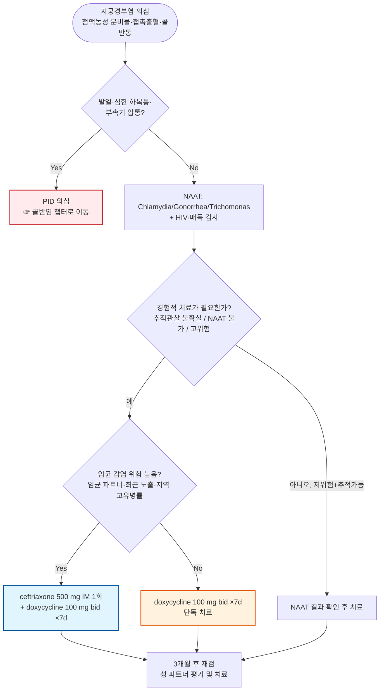

# 자궁경부염 (Cervicitis) Cervicitis (CX)

## <mark style="color:green;">일반 사항</mark>

* uterine cervix의 염증; 1차적으로 endocervical gland의 columnar epithelial cell 이환
* 정의 (CDC STI Treatment Guidelines, 2021) : 자궁경부 내 점액농성 삼출물 또는 부드러운 마찰(cotton swab)로 유발되는 자궁경부 내 출혈로 특징지어지는 임상 증후군(mucopurulent cervicitis)
* 분류
  * 급성 : C. trachomatis, N. gonorrhoeae 등이 주요 원인
  * 지속성/재발성 : 재감염 외에 M. genitalium, 세균성 질증, 잦은 질 세척·화학적 자극, cervical ectopy, cervical dysplasia 등 다양한 원인이 관여할 수 있음
* 위험군 : 성적 활동 연령, 콘돔 미사용, 복수의 성 파트너, 신규 파트너
* 합병증 : 상행성 감염에 의한 PID·endometritis, 임신/태아 합병증(조기진통·유산 위험), 치료되지 않은 상행성 감염에 따른 난관성 불임
* 선별 검사 : 성적으로 활동적인 25세 미만 여성 및 25세 이상 여성 중 새로운 또는 복수의 성 파트너, STI가 있는 파트너 등 위험요인이 있는 경우 매년 Gonorrhea·Chlamydia 검사를 권고
* 새롭게 발병한 경우 PID 감별이 필요함
* C. trachomatis, N. gonorrhoeae 또는 T. vaginalis가 확인된 경우 최근 60일 이내 성 파트너의 평가·검사 및 경험적 치료가 필요함

## <mark style="color:green;">원인</mark>

#### <mark style="color:$primary;">감염성 원인</mark>

* Chlamydia trachomatis, Neisseria gonorrhoeae, Trichomonas vaginalis
* 세균성 질증 유발 균주 (☞ [음문질감염증](122_-vulvovaginal-infections.md))
* Herpes simplex virus (HSV-2) — 특히 궤양성 병변 동반 시 고려
* Mycoplasma genitalium — 지속·재발성 자궁경부염에서 고려되는 원인균. Routine cervicitis에서 일률적 검사는 권고되지 않으며, 지속 증상이 있고 재노출·복약불이행 등이 배제된 경우 NAAT를 고려
* 특히 STI 위험이 낮은 여성에서는 상당수에서 특정 병원체가 확인되지 않음

#### <mark style="color:$primary;">비감염성 원인</mark>

* 물리적 자극 : 이물(예: pessary, diaphragm, tampon, cervical cap)
* 화학적 자극 : 라텍스, 뒷물(douching), 살정제·피임 크림
* 방사선 치료, 전신성 염증 질환(예: Behçet Dz)

## <mark style="color:green;">임상 양상</mark>

* 보통 무증상 또는 가벼운 증상
* 농성/점액 농성 질 분비물 : 자궁경부염의 특징적인 소견이지만 특이도는 높지 않음
* 질 출혈 : 성관계 후 또는 월경 사이 출혈(intermenstrual bleeding); 자극에 쉽게 출혈
* 골반통, 성교통, 자궁경부 홍반 및 압통
* 방광 자극 증상(빈뇨, 절박뇨, 배뇨통)

### <mark style="color:$danger;">🚩 Red Flags!</mark>

<mark style="color:$danger;">**즉각 조치 또는 의뢰**</mark>

* 발열 + 심한 하복부 통증 + 부속기 압통 → 골반염(PID)·골반농양 의심, 응급 평가 (☞ [골반염](pelvic-inflammatory-disease.md))
* 임신부에서 자궁경부염 의심 증상과 함께 복통 또는 질 출혈 동반 → 조기진통·유산 위험, 즉시 산과 평가
* 빈맥·저혈압·의식 변화 등 패혈증 징후 동반

<mark style="color:$warning;">**당일 또는 조기 의뢰**</mark>

* 발열 없이 심한 골반통 또는 성교통이 있는 경우 → PID 감별을 위한 조기 평가 필요
* 임신 중 클라미디아 또는 임균 감염이 확인된 경우 → 산과 협진 하 치료 및 추적

<mark style="color:$info;">**외래 추적 / 추가 평가 계획**</mark> <mark style="color:$info;">- 즉각 위험 낮으나 호전 없으면 의뢰</mark>

* 클라미디아·임균·트리코모나스 치료 후 3개월 재검 시행
* 표준 항생제 치료(1\~2회) 후에도 증상이 지속되는 경우 → M. genitalium 검사 고려
* 성 파트너 치료 미이행이 의심되는 경우 → 재감염 가능성 상담 및 재치료

## <mark style="color:green;">진단</mark>

1. 농성 또는 점액농성 자궁경부 내 삼출물(mucopurulent cervicitis 소견)
2. cotton swab 등 부드러운 마찰에 의해 자궁경부 내 출혈 유발

### <mark style="color:orange;">실험실 검사</mark>

* C. trachomatis, N. gonorrhoeae 검사 : 분비물 또는 소변 NAAT (☞ 실험실 검사 챕터 — 링크 연결 필요)\
  ✽국내 의료기관별 NAAT 접근성에 차이가 있을 수 있어, 가능한 경우 시행하고 여건상 어려운 경우 임상적 위험도에 따라 경험적 치료를 고려
* 세균성 질증, trichomoniasis 평가 (☞ [음문질감염증](122_-vulvovaginal-infections.md))\
  ✽Trichomonas는 wet mount의 민감도가 낮으므로(약 50%), 의심 증상이 있으면서 wet mount가 음성이면 NAAT 등 추가검사를 고려
* 생식기 궤양 등 HSV 감염을 시사하는 병변이 있는 경우 병변 PCR 등으로 평가 (☞ 생식기 헤르페스 챕터 — 링크 연결 필요); 자궁경부염 소견만으로 HSV 검사를 routine하게 시행할 근거는 부족
* 자궁경부염이 의심되는 환자에서 HIV 및 매독 검사 시행
* 표준 치료 후에도 지속·재발하는 경우 M. genitalium NAAT 고려

### <mark style="color:orange;">감별 진단</mark>

* 유사한 질 분비물·출혈·골반통을 유발할 수 있는 질환들의 감별

<table><thead><tr><th width="140">질환</th><th width="260">자궁경부염과의 차이점</th><th>핵심 감별 포인트</th></tr></thead><tbody><tr><td>질염 (Vaginitis)</td><td>염증의 주 병소가 질 자체; 경부 압통·접촉 출혈은 드묾</td><td>냉대하 성상, 생리식염수·KOH 도말 검경</td></tr><tr><td>골반염 (PID)</td><td>상부 생식기(자궁내막·난관)까지 침범, 전신 증상 동반 가능</td><td>발열, 부속기 압통, CRP/ESR 상승, 초음파 소견</td></tr><tr><td>자궁내막염</td><td>자궁 자체의 염증, 비정상 자궁 출혈이 흔함</td><td>자궁 압통, 초음파, 산욕기·시술 후 병력</td></tr><tr><td>자궁경부 상피내종양 (CIN)</td><td>감염과 무관, 무증상인 경우가 많음</td><td>Pap smear, HPV 검사, colposcopy</td></tr><tr><td>자궁경부암</td><td>지속적 접촉출혈, 육안적 병변 동반 가능</td><td>Pap smear/HPV 검사, colposcopy</td></tr><tr><td>자궁경부 폴립</td><td>국소적으로 돌출된 양성 병변</td><td>접촉출혈, 육안 확인</td></tr><tr><td>자궁경부 외번 (ectropion)</td><td>가임기 여성에서 흔한 정상 변이로, 접촉출혈·점액성 분비물을 유발할 수 있음</td><td>염증 소견 없이 원주상피가 노출된 소견</td></tr><tr><td>외상성 경부 병변</td><td>물리적 손상에 의함, 감염 소견 없음</td><td>질 내 기구·성기구 사용력, 최근 시술력</td></tr></tbody></table>

***



<p align="center"><strong>진단 및 경험적 치료 알고리듬</strong></p>

<p align="center"><em><mark style="color:$info;">Ref. CDC Sexually Transmitted Infections Treatment Guidelines (2021), Cervicitis</mark></em></p>

***

## <mark style="background-color:$warning;">Management</mark>

### <mark style="color:orange;">치료 방침</mark>

* 경험적 치료 원칙(CDC 2021) : ① 추적관찰이 불확실하거나 NAAT 검사가 불가능한 경우, 또는 ② 임균 감염 위험이 높은 경우(임균 감염 파트너, 최근 임균 노출, 지역사회 고유병률)에는 경험적 항생제 치료를 고려하여 시작. 저위험이면서 추적관찰이 확실한 경우에는 NAAT 결과 확인 후 치료를 보류할 수 있음
* 위험 요인 회피 : 잦은 질 세척(douching) 회피, 성관계 시 콘돔 사용, 화학적 자극(질 세정제, 향료 함유 제품, 살정제 등)을 피함
* 추적 관리 : 클라미디아·임균·트리코모나스 감염 시 치료 3개월 후 재검
* 치료 후 환자 및 성 파트너 모두 치료를 완료하고, 7일 요법은 치료를 마칠 때까지, 단회요법은 투여 후 7일이 지나며 증상이 호전될 때까지 성관계를 피함

## <mark style="color:green;">비-약물 치료 및 예방</mark>

* 본인 및 성 파트너가 치료를 완료할 때까지 성관계 금지
* 콘돔 사용 및 성 파트너 수 제한
* 잦은 질 세척(douching) 회피
* 국소 자극 원인(질 세척제, 향료가 포함된 제품, 살정제 등) 확인 및 제거
* pessary, cervical cap, tampon 등 국소 이물이 원인으로 의심되면 제거 후 재평가
* 기존에 삽입된 자궁 내 기구(IUD)는 자궁경부염 치료를 위해 제거할 필요는 없으나, 자궁경부염이 있는 상태에서 새로운 IUD 삽입은 치료 후로 연기

## <mark style="color:green;">약물 치료</mark>

### <mark style="color:orange;">경험적 항생제 치료</mark>

* 원칙 (CDC STI Treatment Guidelines, 2021) : 추적관찰이 불확실하거나 NAAT 검사가 불가능한 경우, 또는 임균 감염 위험이 높은 경우에는 경험적 치료를 고려하여 시작. 저위험이면서 추적관찰이 확실하면 NAAT 결과 확인 후 치료를 보류할 수 있음\
  ✽2015년 가이드라인의 "모든 자궁경부염에 클라미디아·임균 동시 경험적 치료" 원칙은 항생제 스튜어드십 강화를 위해 2021년부터 위험도 기반 접근으로 개정됨
* doxycycline 100 ㎎ bid ×7일 — 1차 선택제
* ceftriaxone 500 ㎎ IM 1회 병용 <mark style="color:blue;">\[트리악손]</mark> : 임균 감염 위험이 높은 경우(임균 감염 파트너, 최근 임균 노출 등) 또는 지역사회 임균 유병률이 높은 경우 (체중 150 ㎏ 미만 기준; 2015년 250 ㎎에서 2021년 500 ㎎으로 상향)
* azithromycin 1 g 1회 <mark style="color:blue;">\[지스로맥스]</mark> — 항생제 내성 증가로 비임신 성인의 1차 선택에서는 후순위이며, 임신부 또는 doxycycline 복약순응도가 우려되는 경우의 대안

#### <mark style="color:$primary;">임신부</mark>

* azithromycin 1 g 1회 — 임신 중 Chlamydia 치료의 권장 대안이며, doxycycline은 임신 중 권장되지 않음
* 임신 중 Chlamydia 감염이 확인된 경우 치료 4주 후 NAAT로 test-of-cure 시행, 이후 3개월 후 재검. 재감염 위험이 지속되는 경우 임신 3분기에 재검

### <mark style="color:orange;">Trichomonas 동반</mark>

* metronidazole 500 ㎎ bid ×7일 <mark style="color:blue;">\[후라시닐]</mark> — 여성에서는 단회 2 g 요법보다 치료 성공률이 높아 우선 권고
* tinidazole 2 g 1회 <mark style="color:blue;">\[티니다진]</mark> — 대안 요법

### <mark style="color:orange;">Herpes 동반</mark>

* acyclovir, valacyclovir, famciclovir — 세부 용량은 생식기 헤르페스 챕터 참고(☞ 링크 연결 필요)

### <mark style="color:orange;">재발 및 지속성 자궁경부염</mark>

* 성병 노출 등 재평가, 성 파트너 평가
* **반복적인 항생제 치료에도 불구하고 재발하는 자궁경부염은 대부분 Chlamydia나 Gonorrhea에 의한 것이 아니며, 지속 항생제 복용의 유용성은 불확실함 — 불필요한 항생제 재처방을 지양하고 원인 재평가를 우선**
* 적절한 치료 후에도 지속되며 재노출·복약불이행·BV 등이 배제된 경우 M. genitalium NAAT 고려\
  * macrolide-susceptible 확인 시 : doxycycline 100 ㎎ bid ×7일 선행 후 azithromycin 1 g 1일차, 이후 500 ㎎ qd ×3일
  * macrolide resistance testing이 불가능하거나 내성이 확인된 경우 : doxycycline 100 ㎎ bid ×7일 선행 후 moxifloxacin 400 ㎎ qd ×7일 순차 치료 고려
* 감염 외 다른 원인 고려 : vaginal flora 이상, 빈번한 질 세척, 화학적 자극
* 부인과 의뢰

***

### <mark style="color:red;">질병코드</mark>

(KCD-8 기준)

N72 자궁경부의 염증성 질환 (핵심 진단 코드)

원인이 확인된 경우 추가:

A54 임균감염

A56.0 하부비뇨생식관의 클라미디아감염

A59.0 비뇨생식기 트리코모나스증

A60.0 생식기 및 비뇨생식관의 헤르페스바이러스감염

✽파트너 평가·접촉력 확인 등 노출 상황을 기록할 때는 Z20.2(성병 접촉에 의한 노출)를 참고로 병기할 수 있음

***

## <mark style="color:purple;">처방례</mark>

> **처방례 1. 경험적 치료가 필요한 저위험 자궁경부염 — Doxycycline 단독**
>
> ```
> 독시사이클린 100 ㎎/C  2C #2  ×7d
> ```
>
> _✽저위험·추적 가능 환자는 NAAT 결과 확인 후 치료를 보류할 수 있으며, 본 처방례는 추적관찰이 불확실하거나 NAAT 시행이 어려워 경험적 치료가 필요한 경우이며 임균 동반 위험 요인(파트너 임균감염 확인, 지역사회 고유병률 등)은 없는 상황_

> **처방례 2. 임균 동반 위험 높음 — 병용 요법**
>
> ```
> 트리악손 500 ㎎  IM  1회
> 독시사이클린 100 ㎎/C  2C #2  ×7d
> ```
>
> _✽체중 150 ㎏ 이상인 경우 ceftriaxone 1 g으로 증량_

> **처방례 3. 임신부 Chlamydia 감염 — Azithromycin**
>
> ```
> 지스로맥스 250 ㎎/T  4T  1회
> ```
>
> _✽doxycycline은 임신 중 권장되지 않음; 치료 4주 후 test-of-cure NAAT 시행, 이후 3개월 후 재검_

> **처방례 4. Trichomonas 동반**
>
> ```
> 후라시닐 500 ㎎/T  1T bid  ×7d
> ```
>
> _✽여성에서는 단회 2 g 요법보다 7일 요법의 치료 성공률이 높음(특히 HIV 동반 여성)_

> **처방례 5. 재발·지속성, M. genitalium NAAT 양성 + macrolide resistance testing 불가**
>
> ```
> 독시사이클린 100 ㎎/C  2C #2  ×7d 선행 후
> 목시플록사신 400 ㎎/T  1T qd  ×7d
> ```
>
> _✽마크로라이드 내성 M. genitalium 확인 시(또는 내성 검사 불가 시) 순차 요법 고려; 부인과·감염내과 협진 권장_

***

### <mark style="color:$success;">핵심 복약 지도</mark>

> **항생제 복용 및 금욕 기간**
>
> * doxycycline은 충분한 물과 함께 복용하고, 복용 직후 눕지 않도록 안내(식도 자극·궤양 예방)
> * doxycycline은 제산제·철분제·칼슘제·유제품 등 2가/3가 양이온 함유 제품과 동시 복용 시 흡수가 저하되므로 최소 2시간 이상 간격을 두고 복용
> * 광과민 반응 가능 — 치료 기간 중 직사광선 노출을 최소화하고 자외선 차단제 사용 권고
> * 처방된 항생제를 임의로 중단하지 말고 전 기간 복용을 완료
> * 본인 및 파트너 모두 치료를 완료하고, 7일 요법은 치료를 마칠 때까지, 단회요법은 투여 후 7일이 지나며 증상이 호전될 때까지 성관계를 금할 것

> **파트너 치료의 중요성**
>
> * C. trachomatis, N. gonorrhoeae 또는 T. vaginalis가 확인된 경우 최근 60일 이내 성 파트너의 평가 및 경험적 치료가 필요함을 설명
> * 파트너 미치료 시 재감염 위험이 높아 3개월 후 재검사가 권고됨을 안내
> * 국내에서는 EPT(파트너 대리처방) 적용에 법적·제도적 제한이 있으므로, 파트너도 직접 의료기관을 방문하여 평가 및 치료를 받도록 안내

> **언제 다시 병원을 방문해야 하나요?**
>
> * 치료 중 또는 치료 후 **발열, 심한 하복부 통증**이 발생하는 경우 — 즉시 내원(골반염 의심)
> * 임신 중인 경우 **복통 또는 질 출혈**이 동반되면 즉시 산과 평가
> * 치료 완료 후에도 증상이 지속되거나 재발하는 경우

***

### <mark style="color:blue;">환자 안내서</mark>


**자궁경부염은 원인을 찾아 적절히 치료하는 것이 중요한 염증성 질환입니다**

자궁경부염은 자궁경부(자궁의 입구)에 생긴 염증입니다. 클라미디아·임질 등 성접촉을 통해 전파되는 감염이 흔한 원인이지만, 다른 감염이나 자극도 원인이 될 수 있습니다. 증상이 없는 경우도 많지만, 감염을 적절히 치료하지 않고 상행성 감염이 발생하면 골반염으로 이어질 수 있으며, 심한 경우 난관 손상과 불임을 초래할 수 있습니다.


#### <mark style="color:$primary;">왜 자궁경부염이 생기나요?</mark>

* 클라미디아·임질 등이 흔한 원인이지만, 트리코모나스, 헤르페스, M. genitalium 등 다른 감염이나 비감염성 자극도 원인이 될 수 있습니다.
* 콘돔을 사용하지 않거나 여러 명의 성 파트너가 있는 경우 위험이 높아집니다.
* 감염이 아니더라도 질 세정제, 탐폰, 질 내 기구(페사리 등)로 인한 자극으로도 생길 수 있습니다.

#### <mark style="color:$primary;">치료는 어떻게 하나요?</mark>

* 처방받은 항생제를 **처방된 기간 동안 빠짐없이** 복용하십시오.
* (독시사이클린 복용 시) 복용 후에는 최소 30분간 눕지 마시고, 치료 기간에는 햇빛 노출을 피하십시오. 이 주의사항은 독시사이클린에 해당하며, 다른 항생제(아지스로마이신, 메트로니다졸 등)에는 적용되지 않습니다.
* 증상이 좋아지더라도 임의로 약을 중단하지 마십시오.

#### <mark style="color:$primary;">성 파트너와 관련해 무엇을 해야 하나요?</mark>

* 최근 60일 이내 성 파트너도 반드시 검사와 치료를 받아야 합니다.
* 본인과 파트너 모두 치료를 마칠 때까지(마지막 약 복용 후 7일) 성관계를 하지 마십시오.
* 재감염을 막기 위해 3개월 후 재검사를 받으십시오.

#### <mark style="color:$primary;">이럴 때는 즉시 병원을 방문하세요</mark>

* 열이 나거나 아랫배가 심하게 아픈 경우
* 임신 중인데 복통이나 질 출혈이 있는 경우
* 치료 후에도 증상이 계속되거나 다시 나타나는 경우
