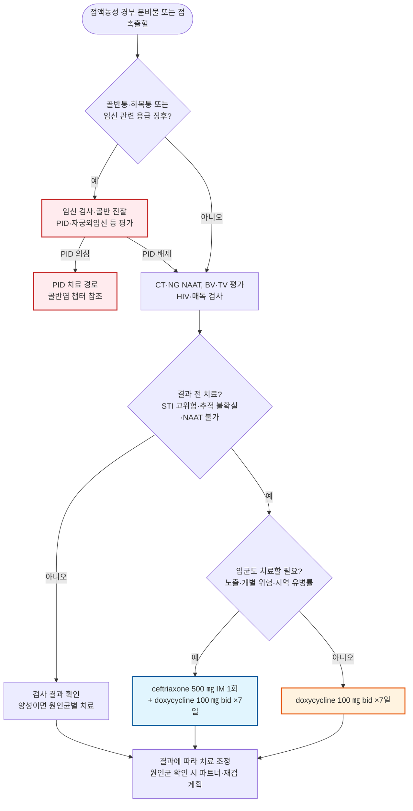

# 자궁경부염 (Cervicitis)

## <mark style="color:green;">일반 사항</mark>

* uterine cervix의 염증; 1차적으로 endocervical gland의 columnar epithelial cell 이환
* 정의 (CDC STI Treatment Guidelines, 2021) : 자궁경부 내 점액농성 삼출물 또는 부드러운 마찰(cotton swab)로 유발되는 자궁경부 내 출혈로 특징지어지는 임상 증후군(mucopurulent cervicitis)
* 분류
  * 급성 : C. trachomatis, N. gonorrhoeae 등이 주요 원인
  * 지속성/재발성 : 재노출·치료 실패 외에 M. genitalium, 세균성 질증·질내균총 이상, 잦은 질 세척·화학적 자극, 자궁경부 외번(ectropion) 등이 관여할 수 있음. 자궁경부 이형성·암도 출혈이나 병변이 지속될 때 감별
* 위험군 : 성적 활동 연령, 콘돔 미사용, 복수의 성 파트너, 신규 파트너
* 합병증 : 원인균에 따라 상행성 감염에 의한 골반염(PID)·자궁내막염, 난관 손상·불임 등이 발생할 수 있음. 임신 중 감염은 병원체에 따라 임신·신생아 합병증과 관련되므로 균종별로 평가·치료
* 선별 검사 : 미국 CDC 기준으로 성적으로 활동적인 25세 미만 여성 및 25세 이상 여성 중 새 파트너, 복수 파트너, STI가 있는 파트너 등 위험요인이 있는 경우 매년 Chlamydia·Gonorrhea 검사 권고. 국내에서는 검사 접근성·유병률·개별 위험도를 함께 고려
* 새롭게 발병한 경우 PID 감별이 필요함
* C. trachomatis, N. gonorrhoeae 또는 T. vaginalis가 확인된 경우 최근 60일 이내 성 파트너의 평가·검사 및 추정 치료가 필요함(마지막 성 접촉이 60일보다 오래되었다면 가장 최근 파트너 포함)

## <mark style="color:green;">원인</mark>

#### <mark style="color:$primary;">감염성 원인</mark>

* Chlamydia trachomatis, Neisseria gonorrhoeae, Trichomonas vaginalis
* 세균성 질증·질내균총 이상이 동반되거나 경부염 소견과 관련될 수 있음 (☞ [음문질감염증](122_-vulvovaginal-infections.md))
* Herpes simplex virus (특히 초발 HSV-2) - 수포·궤양성 병변 동반 시 고려
* Mycoplasma genitalium - 지속·재발성 자궁경부염에서 고려되는 원인균. Routine cervicitis에서 일률적 검사는 권고되지 않으며, 지속 증상이 있고 재노출·복약불이행 등이 배제된 경우 NAAT를 고려
* 특히 STI 위험이 낮은 여성에서는 상당수에서 특정 병원체가 확인되지 않음

#### <mark style="color:$primary;">비감염성 원인</mark>

* 물리적 자극 : 이물(예: pessary, diaphragm, tampon, cervical cap)
* 화학적 자극 : 라텍스, 뒷물(douching), 살정제·피임 크림
* 방사선 치료, 전신성 염증 질환(예: Behçet Dz)

## <mark style="color:green;">임상 양상</mark>

* 보통 무증상 또는 가벼운 증상
* 자궁경부 내 농성·점액농성 분비물 : 자궁경부염의 특징적인 소견이지만 병원체를 특정하지는 못함
* 질 출혈 : 성관계 후 또는 월경 사이 출혈(intermenstrual bleeding); 자극에 쉽게 출혈
* 골반통, 성교통, 자궁경부 홍반. 골반통이나 진찰상 자궁경부 운동통·자궁 압통·부속기 압통은 PID 평가가 필요하며 단순 경부염으로 단정하지 않음
* 방광 자극 증상(빈뇨, 절박뇨, 배뇨통)

### <mark style="color:$danger;">🚩 Red Flags!</mark>

<mark style="color:$danger;">**즉각 조치 또는 의뢰**</mark>

* 심한 하복부 통증, 복막 자극 징후, 고열·구토, 골반농양 의심 → PID 및 다른 급성 복증의 응급 평가 (☞ [골반염](pelvic-inflammatory-disease.md))
* 임신부의 복통 또는 질 출혈 → 자궁외임신·유산·조기진통 등 감별을 위해 즉시 산과 평가
* 빈맥·저혈압·의식 변화 등 패혈증 징후 동반

<mark style="color:$warning;">**당일~수일 내 평가**</mark>

* 골반통·하복통과 자궁경부 운동통, 자궁 압통, 부속기 압통 중 하나 이상 → 발열이 없어도 PID 감별 및 경험적 치료 필요성을 당일 평가
* 임신 중 클라미디아 또는 임균 감염 확인 → 신속히 치료하고 산과 진료와 추적을 연계

<mark style="color:$info;">**외래 추적**</mark>

* 확인된 클라미디아·임균 감염 및 여성의 트리코모나스 감염 치료 후 약 3개월에 재감염 검사
* 적절한 치료 후에도 경부염 소견이 지속·재발하는 경우 → 재노출·복약·세균성 질증 등을 재평가하고 M. genitalium 검사 고려
* 성 파트너 치료 미이행이 의심되는 경우 → 재감염 여부를 평가하고 원인균에 따라 치료

## <mark style="color:green;">진단</mark>

1. 농성 또는 점액농성 자궁경부 내 삼출물(mucopurulent cervicitis 소견)
2. cotton swab 등 부드러운 마찰에 의해 자궁경부 내 출혈 유발

### <mark style="color:orange;">실험실 검사</mark>

* C. trachomatis, N. gonorrhoeae 검사 : 질 검체(자가 채취 또는 의료진 채취), 자궁경부 검체 또는 소변 NAAT (☞ 실험실 검사 챕터 - 링크 연결 필요)\
  ✽국내 의료기관별 NAAT 접근성에 차이가 있을 수 있어, 가능한 경우 시행하고 여건상 어려운 경우 임상적 위험도에 따라 경험적 치료를 고려
* 세균성 질증, trichomoniasis 평가 (☞ [음문질감염증](122_-vulvovaginal-infections.md))\
  ✽Trichomonas는 wet mount의 민감도가 낮으므로(약 50%), 의심 증상이 있으면서 wet mount가 음성이면 NAAT 등 추가검사를 고려
* 생식기 궤양 등 HSV 감염을 시사하는 병변이 있는 경우 병변 PCR 등으로 평가 (☞ 생식기 헤르페스 챕터 - 링크 연결 필요); 자궁경부염 소견만으로 HSV 검사를 routine하게 시행할 근거는 부족
* 자궁경부염이 의심되는 환자에서 HIV 및 매독 검사 시행
* 표준 치료 후에도 지속·재발하는 경우 M. genitalium NAAT 고려
* 가임기 골반통·비정상 출혈이 있는 경우 임신 검사와 자궁외임신 등 다른 원인 평가. PID 의심 시 경부 NAAT 음성만으로 상부 생식기 감염을 배제하지 않음

### <mark style="color:orange;">감별 진단</mark>

* 유사한 질 분비물·출혈·골반통을 유발할 수 있는 질환들의 감별

<table><thead><tr><th width="140">질환</th><th width="260">자궁경부염과의 차이점</th><th>핵심 감별 포인트</th></tr></thead><tbody><tr><td>질염 (Vaginitis)</td><td>염증의 주 병소가 질 자체; 경부 접촉 출혈은 드묾</td><td>분비물 성상, 생리식염수·KOH 도말 검경</td></tr><tr><td>골반염 (PID)</td><td>상부 생식기(자궁내막·난관)까지 침범; 발열 없이도 가능</td><td>골반통·하복통과 자궁경부 운동통·자궁 압통·부속기 압통 중 하나 이상이면 의심. 발열·염증수치·초음파 이상은 필수 조건이 아님</td></tr><tr><td>자궁내막염</td><td>자궁 자체의 염증, 비정상 자궁 출혈이 흔함</td><td>자궁 압통, 산욕기·시술 후 병력 등</td></tr><tr><td>자궁경부 상피내종양 (CIN)</td><td>감염과 무관, 무증상인 경우가 많음</td><td>적응증에 따른 자궁경부 세포검사·HPV 검사, 필요 시 질확대경·생검</td></tr><tr><td>자궁경부암</td><td>지속적 접촉출혈, 육안적 병변 동반 가능</td><td>의심 병변은 세포검사 결과만 기다리지 말고 부인과 평가·생검</td></tr><tr><td>자궁경부 폴립</td><td>국소적으로 돌출된 양성 병변</td><td>접촉출혈, 육안 확인</td></tr><tr><td>자궁경부 외번 (ectropion)</td><td>가임기 여성에서 흔한 정상 변이로, 접촉출혈·점액성 분비물을 유발할 수 있음</td><td>염증 소견 없이 원주상피가 노출된 소견</td></tr><tr><td>외상성 경부 병변</td><td>물리적 손상에 의함, 감염 소견 없음</td><td>질 내 기구·성기구 사용력, 최근 시술력</td></tr></tbody></table>

***


```mermaid
graph TD
    A([점액농성 경부 분비물 또는 접촉출혈]) --> B{골반통·하복통 또는<br/>임신 관련 응급 징후?}
    B -->|예| C[임신 검사·골반 진찰<br/>PID·자궁외임신 등 평가]
    C -->|PID 의심| P[PID 치료 경로<br/>골반염 챕터 참조]
    B -->|아니오| D[CT·NG NAAT, BV·TV 평가<br/>HIV·매독 검사]
    C -->|PID 배제| D
    D --> I{결과 전 치료?<br/>STI 고위험·추적 불확실·NAAT 불가}
    I -->|아니오| J[검사 결과 확인<br/>양성이면 원인균별 치료]
    I -->|예| E{임균도 치료할 필요?<br/>노출·개별 위험·지역 유병률}
    E -->|예| F[ceftriaxone 500 ㎎ IM 1회<br/>+ doxycycline 100 ㎎ bid ×7일]
    E -->|아니오| G[doxycycline 100 ㎎ bid ×7일]
    F --> H[결과에 따라 치료 조정<br/>원인균 확인 시 파트너·재검 계획]
    G --> H
    J --> H
    style C fill:#ffebee,stroke:#c62828,stroke-width:2px
    style P fill:#ffebee,stroke:#c62828,stroke-width:2px
    style F fill:#e1f5fe,stroke:#01579b,stroke-width:2px
    style G fill:#fff3e0,stroke:#e65100,stroke-width:2px
```

✽ CT = C. trachomatis, NG = N. gonorrhoeae, BV = 세균성 질증, TV = T. vaginalis. PID 의심 시 경부염의 7일 치료만으로 대체하지 않음. 임신 중에는 doxycycline 대신 임신에 적합한 원인균별 치료를 선택. 검사 음성이고 치료를 보류한 경우에도 경부염 소견의 호전 여부를 확인하며, 3개월 재검·파트너 추정 치료는 확인된 병원체에 따라 결정.

<p align="center"><strong>진단 및 경험적 치료 알고리듬</strong></p>

<p align="center"><em><mark style="color:$info;">Ref. CDC Sexually Transmitted Infections Treatment Guidelines (2021), Cervicitis</mark></em></p>

***

## <mark style="background-color:$warning;">Management</mark>

### <mark style="color:orange;">치료 방침</mark>

* 경험적 치료 원칙(CDC 2021) : 25세 미만, 새 파트너, 파트너의 다른 성 파트너 또는 STI 등 감염 위험이 높은 경우, 추적관찰이 불확실하거나 NAAT가 불가능한 경우에는 결과 전 Chlamydia 치료를 시작하고 임균 치료 병용 필요성을 평가. 임균 약제 병용은 개별 위험도와 지역 유병률을 고려. 저위험이면서 검사가 가능하고 추적이 확실한 경우에는 결과 확인까지 치료를 보류할 수 있음
* 위험 요인 회피 : 잦은 질 세척(douching) 회피, 성관계 시 콘돔 사용, 화학적 자극(질 세정제, 향료 함유 제품, 살정제 등)을 피함
* 추적 관리 : 확인된 클라미디아·임균 및 여성의 트리코모나스 감염은 치료 약 3개월 후 재감염 검사를 계획. 임신 중 클라미디아는 약 4주 후 치료 확인 NAAT도 시행
* 환자와 성 파트너의 치료가 모두 끝나고 증상이 호전될 때까지 성관계를 피함. 경부염에서 클라미디아·임균 치료가 포함된 경우 7일 요법은 완료할 때까지, 단회요법은 투여 후 7일까지 금욕

## <mark style="color:green;">비-약물 치료 및 예방</mark>

* 감염성 경부염의 치료 기간에는 본인 및 성 파트너가 치료를 완료하고 증상이 호전될 때까지 성관계를 피함
* 콘돔 사용 및 성 파트너 수 제한
* 잦은 질 세척(douching) 회피
* 국소 자극 원인(질 세척제, 향료가 포함된 제품, 살정제 등) 확인 및 제거
* pessary, cervical cap, tampon 등 국소 이물이 원인으로 의심되면 제거 후 재평가
* 기존에 삽입된 자궁 내 기구(IUD)는 자궁경부염 치료를 위해 제거할 필요는 없으나, 자궁경부염이 있는 상태에서 새로운 IUD 삽입은 치료 후로 연기

## <mark style="color:green;">약물 치료</mark>

### <mark style="color:orange;">경험적 항생제 치료</mark>

* 원칙 (CDC STI Treatment Guidelines, 2021) : 25세 미만 또는 새 파트너·STI 파트너 등의 감염 위험이 높거나, 추적관찰이 불확실하거나, NAAT가 불가능하면 결과 전 치료를 시작. 저위험이고 검사와 추적이 가능하면 결과 확인까지 보류 가능. 임균 약제 병용은 개별 위험도·지역 유병률에 따라 판단
* doxycycline 100 ㎎ bid ×7일 - 1차 선택제
* ceftriaxone 500 ㎎ IM 1회 병용 <mark style="color:blue;">\[트리악손]</mark> : 임균 감염 위험이 높은 경우(임균 감염 파트너, 최근 임균 노출 등) 또는 지역사회 임균 유병률이 높은 경우. 체중 150 ㎏ 미만 기준이며, 150 ㎏ 이상이면 1 g IM 1회
* azithromycin 1 g 경구 1회 <mark style="color:blue;">\[지스로맥스]</mark> - 비임신 성인 경부염 치료의 대안. doxycycline 복약순응도가 우려되는 경우 고려하되, 동반 직장 클라미디아 감염에서는 치료 효능이 낮을 수 있음. 임균 감염 치료를 대체하지 않음

#### <mark style="color:$primary;">임신부</mark>

* Chlamydia 감염 확인 시 azithromycin 1 g 경구 1회 - 임신 중 권장 요법이며, doxycycline은 임신 중 권장되지 않음
* 임균 감염 확인 또는 강한 의심 시 ceftriaxone 500 ㎎ IM 1회(체중 ≥150 ㎏은 1 g). Chlamydia가 배제되지 않았다면 임신에 적합한 Chlamydia 치료도 함께 고려하고 산과 진료와 연계
* 임신 중 Chlamydia 감염이 확인된 경우 치료 4주 후 NAAT로 test-of-cure 시행, 이후 3개월 후 재검. 재감염 위험이 지속되는 경우 임신 3분기에 재검

### <mark style="color:orange;">Trichomonas 동반</mark>

* metronidazole 500 ㎎ bid ×7일 <mark style="color:blue;">\[후라시닐정 250 ㎎]</mark> - 여성에서는 단회 2 g 요법보다 치료 성공률이 높아 우선 권고. 후라시닐정은 1정 250 ㎎이므로 1회 2정 복용. ✽국내 해당 제품의 트리코모나스증 허가 용법(250 ㎎ bid ×10일)과 CDC 권고 용법이 다름
* tinidazole 2 g 1회 <mark style="color:blue;">\[티니다진]</mark> - 대안 요법. 임신 중에는 피함

### <mark style="color:orange;">Herpes 동반</mark>

* acyclovir, valacyclovir, famciclovir - 세부 용량은 생식기 헤르페스 챕터 참고(☞ 링크 연결 필요)

### <mark style="color:orange;">재발 및 지속성 자궁경부염</mark>

* 경부염 소견을 재확인하고 재노출·복약불이행·파트너 치료 여부 및 다른 질환을 재평가
* **반복적인 항생제 치료에도 불구하고 재발하는 자궁경부염은 대부분 Chlamydia나 Gonorrhea에 의한 것이 아니며, 지속 항생제 복용의 유용성은 불확실함 - 불필요한 항생제 재처방을 지양하고 원인 재평가를 우선**
* 적절한 치료 후에도 지속되며 재노출·복약불이행·BV 등이 배제된 경우 M. genitalium NAAT를 고려하고, 가능하면 마크로라이드 내성 검사 병행. 검출된 경우에만 내성 결과에 따라 순차 치료\
  * macrolide-susceptible 확인 시 : doxycycline 100 ㎎ bid ×7일 선행 후 azithromycin 1 g 1일차, 이후 500 ㎎ qd ×3일
  * macrolide resistance testing이 불가능하거나 내성이 확인된 경우 : doxycycline 100 ㎎ bid ×7일 선행 후 moxifloxacin 400 ㎎ qd ×7일 순차 치료 고려
* 감염 외 다른 원인 고려 : vaginal flora 이상, 빈번한 질 세척, 화학적 자극
* 부인과 의뢰

***

### <mark style="color:red;">질병코드</mark>

N72 자궁경부의 염증성 질환 (핵심 진단 코드)

원인균이 확인된 경우 해당 감염 코드도 검토:

A54 임균감염

A56.0 하부비뇨생식관의 클라미디아감염

A59.0 비뇨생식기 트리코모나스증

A60.0 생식기 및 비뇨생식관의 헤르페스바이러스감염

✽파트너 평가·접촉력 확인 등 노출 상황을 기록할 때는 Z20.2(성병 접촉에 의한 노출)를 참고로 병기할 수 있음

***

## <mark style="color:purple;">처방례</mark>

> **처방례 1. 임균 동반 위험이 낮으나 결과 전 치료가 필요한 자궁경부염 - Doxycycline 단독**
>
> ```
> 독시사이클린 100 ㎎/C  2C #2  ×7d
> ```
>
> _✽감염 위험이 낮고 검사·추적이 가능하면 NAAT 결과 확인까지 치료를 보류할 수 있음. 본 처방례는 추적관찰이 불확실하거나 NAAT 시행이 어려워 결과 전 치료가 필요하지만 임균 동반 위험이 낮은 경우_

> **처방례 2. 임균 동반 위험 높음 - 병용 요법**
>
> ```
> 트리악손 500 ㎎  IM  1회
> 독시사이클린 100 ㎎/C  2C #2  ×7d
> ```
>
> _✽체중 150 ㎏ 이상인 경우 ceftriaxone 1 g으로 증량. 임신 중에는 doxycycline을 사용하지 않고 임균·클라미디아 감염 상태에 따라 임신에 적합한 치료를 선택_

> **처방례 3. 임신부 Chlamydia 감염 - Azithromycin**
>
> ```
> 지스로맥스 250 ㎎/T  4T  1회
> ```
>
> _✽doxycycline은 임신 중 권장되지 않음; 치료 4주 후 test-of-cure NAAT 시행, 이후 3개월 후 재검_

> **처방례 4. Trichomonas 동반 - CDC 권고 용법**
>
> ```
> 후라시닐정 250 ㎎/T  2T bid  ×7d
> ```
>
> _✽여성에서는 단회 2 g 요법보다 7일 요법의 치료 성공률이 높음. 후라시닐정은 250 ㎎/정이며, 국내 제품의 트리코모나스증 허가 용법은 250 ㎎ bid ×10일로 CDC 권고 용법과 다름_

> **처방례 5. 재발·지속성, M. genitalium NAAT 양성 + macrolide resistance testing 불가**
>
> ```
> 독시사이클린 100 ㎎/C  2C #2  ×7d 선행 후
> 목시플록사신 400 ㎎/T  1T qd  ×7d
> ```
>
> _✽마크로라이드 내성 M. genitalium 확인 시(또는 내성 검사 불가 시) 순차 요법 고려; 부인과·감염내과 협진 권장_

***

### <mark style="color:$success;">핵심 복약 지도</mark>

> **항생제 복용 및 금욕 기간**
>
> * doxycycline은 충분한 물과 함께 복용하고, 복용 직후 눕지 않도록 안내(식도 자극·궤양 예방)
> * doxycycline은 제산제·철분제·칼슘제·유제품 등 2가/3가 양이온 함유 제품과 동시 복용 시 흡수가 저하되므로 최소 2시간 이상 간격을 두고 복용
> * 광과민 반응 가능 - 치료 기간 중 직사광선 노출을 최소화하고 자외선 차단제 사용 권고
> * 처방된 항생제를 임의로 중단하지 말고 전 기간 복용을 완료
> * 본인과 파트너가 모두 치료를 완료하고 증상이 호전될 때까지 성관계를 피할 것. 클라미디아·임균 치료가 포함되었다면 7일 요법은 복용 완료 시까지, 단회요법은 투여 후 7일까지 금욕

> **파트너 치료의 중요성**
>
> * C. trachomatis, N. gonorrhoeae 또는 T. vaginalis가 확인된 경우 최근 60일 이내 성 파트너의 평가·검사 및 추정 치료가 필요함을 설명(마지막 접촉이 60일보다 오래되었다면 가장 최근 파트너 포함)
> * 확인된 클라미디아·임균 및 여성의 트리코모나스 감염은 재감염 확인을 위해 약 3개월 후 재검사가 권고됨을 안내
> * 파트너도 직접 의료기관을 방문해 평가와 적절한 치료를 받도록 안내

> **언제 다시 병원을 방문해야 하나요?**
>
> * 치료 중 또는 치료 후 **발열, 심한 하복부 통증**이 발생하는 경우 - 즉시 내원(골반염 의심)
> * 임신 중인 경우 **복통 또는 질 출혈**이 동반되면 즉시 산과 평가
> * 치료 완료 후에도 분비물·출혈 등이 지속되거나 재발하는 경우 재진료

***

### <mark style="color:blue;">환자 안내서</mark>


**자궁경부염은 원인을 찾아 적절히 치료하는 것이 중요한 염증성 질환입니다**

자궁경부염은 자궁경부(자궁의 입구)에 생긴 염증입니다. 클라미디아·임질 등 성접촉을 통해 전파되는 감염이 흔한 원인이지만, 다른 감염이나 자극도 원인이 될 수 있습니다. 증상이 없는 경우도 많지만, 감염을 적절히 치료하지 않고 상행성 감염이 발생하면 골반염으로 이어질 수 있으며, 심한 경우 난관 손상과 불임을 초래할 수 있습니다.


#### <mark style="color:$primary;">왜 자궁경부염이 생기나요?</mark>

* 클라미디아·임질 등이 흔한 원인이지만, 트리코모나스, 헤르페스, M. genitalium 등 다른 감염이나 비감염성 자극도 원인이 될 수 있습니다.
* 콘돔을 사용하지 않거나 여러 명의 성 파트너가 있는 경우 위험이 높아집니다.
* 감염이 아니더라도 질 세정제, 탐폰, 질 내 기구(페사리 등)로 인한 자극으로도 생길 수 있습니다.

#### <mark style="color:$primary;">치료는 어떻게 하나요?</mark>

* 감염이 확인되거나 의심되어 항생제를 처방받았다면 **처방된 기간 동안 빠짐없이** 복용하십시오. 검사 결과에 따라 약을 조정할 수 있습니다.
* (독시사이클린 복용 시) 복용 후에는 최소 30분간 눕지 마시고, 치료 기간에는 햇빛 노출을 피하십시오. 이 주의사항은 독시사이클린에 해당하며, 다른 항생제(아지스로마이신, 메트로니다졸 등)에는 적용되지 않습니다.
* 증상이 좋아지더라도 임의로 약을 중단하지 마십시오.

#### <mark style="color:$primary;">성 파트너와 관련해 무엇을 해야 하나요?</mark>

* 클라미디아·임균·트리코모나스 감염이 확인되었다면, 최근 60일 이내 성 파트너도 의료기관에서 평가와 치료를 받아야 합니다. 마지막 성관계가 그보다 오래되었다면 가장 최근 파트너에 대해 의료진과 상의하십시오.
* 본인과 파트너가 모두 치료를 마치고 증상이 나을 때까지 성관계를 피하십시오. 7일간 약을 복용한다면 복용 완료 시까지, 한 번 복용하는 클라미디아·임균 치료라면 복용·투여 후 7일까지 피하십시오. 마지막 약 복용 뒤 무조건 7일을 더 기다려야 한다는 뜻은 아닙니다.
* 클라미디아·임균 또는 트리코모나스 감염이 확인되었다면 약 3개월 후 재감염 검사를 받으십시오. 임신 중 클라미디아 감염은 치료 약 4주 뒤 치료 확인 검사도 필요합니다.

#### <mark style="color:$primary;">이럴 때는 즉시 진료를 받으세요</mark>

* 열이 나거나 아랫배가 심하게 아픈 경우
* 임신 중인데 복통이나 질 출혈이 있는 경우

#### <mark style="color:$primary;">이럴 때는 다시 진료를 받으세요</mark>

* 치료 후에도 분비물·출혈 등이 계속되거나 다시 나타나는 경우
